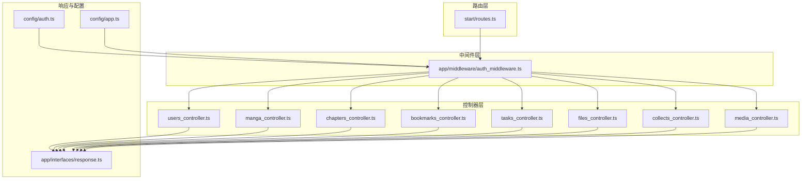
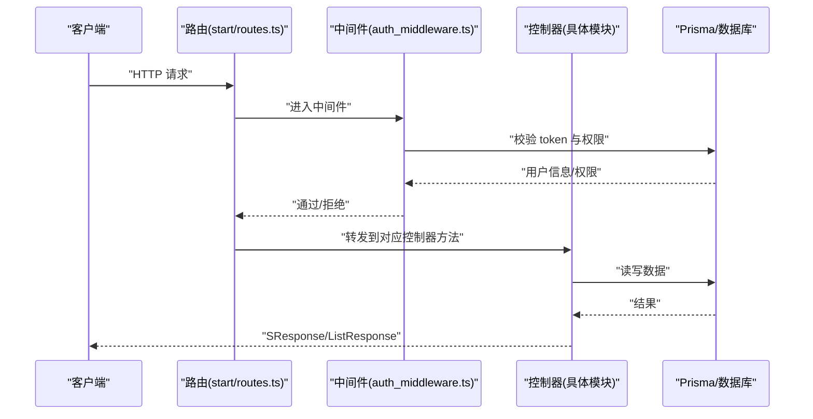
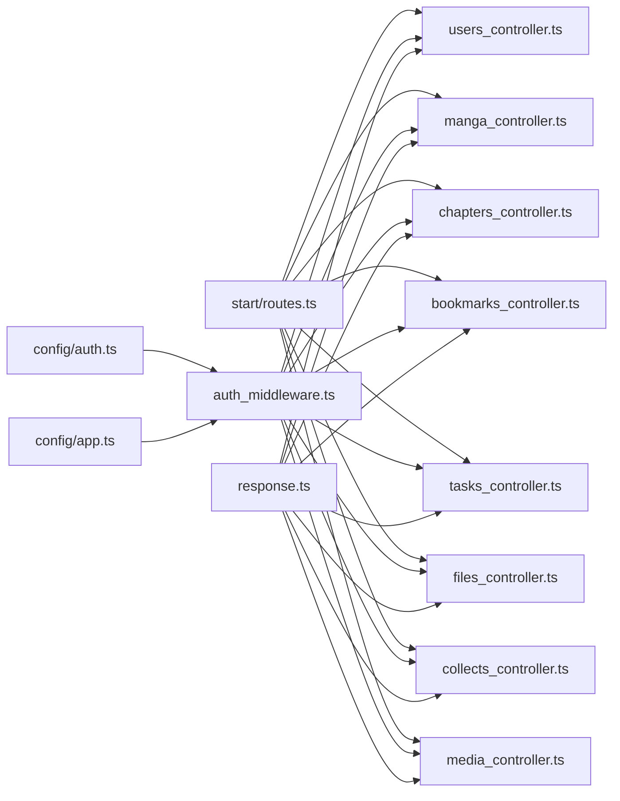

# API接口文档

<cite>
**本文引用的文件**
- [routes.ts](file://start/routes.ts)
- [auth_middleware.ts](file://app/middleware/auth_middleware.ts)
- [response.ts](file://app/interfaces/response.ts)
- [users_controller.ts](file://app/controllers/users_controller.ts)
- [manga_controller.ts](file://app/controllers/manga_controller.ts)
- [chapters_controller.ts](file://app/controllers/chapters_controller.ts)
- [bookmarks_controller.ts](file://app/controllers/bookmarks_controller.ts)
- [tasks_controller.ts](file://app/controllers/tasks_controller.ts)
- [files_controller.ts](file://app/controllers/files_controller.ts)
- [collects_controller.ts](file://app/controllers/collects_controller.ts)
- [media_controller.ts](file://app/controllers/media_controller.ts)
- [api.ts](file://app/utils/api.ts)
- [auth.ts](file://config/auth.ts)
- [app.ts](file://config/app.ts)
- [package.json](file://package.json)
</cite>

## 目录
1. [简介](#简介)
2. [项目结构](#项目结构)
3. [核心组件](#核心组件)
4. [架构总览](#架构总览)
5. [详细组件分析](#详细组件分析)
6. [依赖关系分析](#依赖关系分析)
7. [性能与并发特性](#性能与并发特性)
8. [故障排查指南](#故障排查指南)
9. [结论](#结论)
10. [附录](#附录)

## 简介
本文件为 SManga Adonis 的完整 API 接口文档，覆盖用户管理、漫画管理、章节管理、收藏、任务、文件资源等模块。文档提供每个端点的 HTTP 方法、URL 模式、请求/响应结构、认证方式、错误码定义，并给出常见使用场景与客户端实现建议。同时包含版本号、速率限制与安全注意事项、调试与监控方法。

## 项目结构
- 路由集中定义于路由文件，按模块划分端点。
- 控制器负责业务逻辑与数据库交互，统一返回标准响应格式。
- 中间件负责鉴权与权限校验。
- 配置文件定义认证守卫与应用 Cookie 行为。

**图表来源**
- [routes.ts:10-241](file://start/routes.ts#L10-L241)
- [auth_middleware.ts:17-85](file://app/middleware/auth_middleware.ts#L17-L85)
- [response.ts:18-63](file://app/interfaces/response.ts#L18-L63)
- [auth.ts:5-15](file://config/auth.ts#L5-L15)
- [app.ts:18-40](file://config/app.ts#L18-L40)

**章节来源**
- [routes.ts:10-241](file://start/routes.ts#L10-L241)
- [auth_middleware.ts:17-85](file://app/middleware/auth_middleware.ts#L17-L85)
- [response.ts:18-63](file://app/interfaces/response.ts#L18-L63)
- [auth.ts:5-15](file://config/auth.ts#L5-L15)
- [app.ts:18-40](file://config/app.ts#L18-L40)

## 核心组件
- 路由与端点：集中于路由文件，按模块映射到各控制器方法。
- 认证与权限：基于请求头 token 的中间件，结合用户角色与媒体权限进行校验。
- 响应格式：统一返回 SResponse（单条）与 ListResponse（列表），包含 code、message、data、count/status 等字段。
- 客户端工具：内置同步 API 与下载工具，便于跨服务调用与文件下载。

**章节来源**
- [routes.ts:10-241](file://start/routes.ts#L10-L241)
- [auth_middleware.ts:23-85](file://app/middleware/auth_middleware.ts#L23-L85)
- [response.ts:18-63](file://app/interfaces/response.ts#L18-L63)
- [api.ts:52-178](file://app/utils/api.ts#L52-L178)

## 架构总览
系统采用“路由 -> 中间件 -> 控制器 -> 数据库”的分层架构。中间件统一处理鉴权与权限，控制器负责查询/修改数据并返回统一格式响应；部分端点会触发后台任务队列执行耗时操作。

**图表来源**
- [routes.ts:10-241](file://start/routes.ts#L10-L241)
- [auth_middleware.ts:23-85](file://app/middleware/auth_middleware.ts#L23-L85)
- [response.ts:18-63](file://app/interfaces/response.ts#L18-L63)

## 详细组件分析

### 认证与权限
- 认证方式：请求头携带 token 字段，中间件从数据库校验令牌有效性。
- 权限控制：
  - 管理员可访问所有模块。
  - 普通用户仅能访问被授权的媒体库与模块。
  - DELETE 方法需管理员权限。
- 特殊放行：部署、测试、登录、文件、分析相关端点不强制鉴权。

**章节来源**
- [auth_middleware.ts:23-85](file://app/middleware/auth_middleware.ts#L23-L85)
- [auth.ts:5-15](file://config/auth.ts#L5-L15)

### 响应格式规范
- 单条响应：SResponse(code, message, data, status)
- 列表响应：ListResponse(code, message, list, count)
- 错误码：Success=0，Failed=1（枚举）

**章节来源**
- [response.ts:18-63](file://app/interfaces/response.ts#L18-L63)

### 用户管理 API
- GET /user：分页列出用户，包含媒体权限映射。
- GET /user/:userId：获取指定用户详情。
- POST /user：创建用户，支持设置角色、媒体许可与媒体限制。
- PUT /user/:userId：更新用户信息与媒体权限。
- DELETE /user/:userId：删除用户。
- GET client-user-config：获取当前用户配置（基于中间件注入的 userId）。

参数与返回
- 创建/更新支持字段：userName、passWord、role、mediaPermit、mediaLimit、userConfig。
- 返回统一响应对象。

**章节来源**
- [routes.ts:194-200](file://start/routes.ts#L194-L200)
- [users_controller.ts:8-160](file://app/controllers/users_controller.ts#L8-L160)
- [response.ts:18-63](file://app/interfaces/response.ts#L18-L63)

### 漫画管理 API
- GET /manga：分页/不分页查询漫画，支持按媒体库、关键词、排序。
- GET /manga/:mangaId：获取漫画详情（含元数据、标签、媒体信息）。
- POST /manga：创建漫画。
- PUT /manga/:mangaId：更新漫画信息。
- DELETE /manga/:mangaId：软删除漫画并异步执行清理任务。
- DELETE /manga/:mangaIds/batch：批量软删除。
- PUT /manga/:mangaId/scan：触发扫描任务。
- PUT /manga/:mangaId/reload-meta：重新加载元数据。
- PUT /manga/:mangaId/meta：编辑元数据。
- PUT /manga/:mangaId/tags：设置标签。
- PUT /manga/:mangaId/compress：对漫画下所有章节发起压缩任务。
- DELETE /manga/:mangaId/compress：删除压缩记录。

权限与行为
- 非管理员需具备媒体权限且媒体库匹配。
- 编辑元数据支持写入本地 meta 文件（可选）。

**章节来源**
- [routes.ts:169-182](file://start/routes.ts#L169-L182)
- [manga_controller.ts:13-460](file://app/controllers/manga_controller.ts#L13-L460)
- [auth_middleware.ts:30-45](file://app/middleware/auth_middleware.ts#L30-L45)

### 章节管理 API
- GET /chapter：分页/不分页查询章节，支持按漫画、媒体库、关键词、排序。
- GET /chapter/:chapterId：获取章节详情。
- POST /chapter：创建章节。
- PUT /chapter/:chapterId：更新章节。
- DELETE /chapter/:chapterId：软删除章节并异步清理。
- DELETE /chapter/:chapterIds/batch：批量软删除。
- GET /chapter-images/:chapterId：获取章节图片列表（含解压状态与排序选项）。
- GET /chapter-first：按排序获取首章。
- DELETE /chapter/:chapterId/compress：删除解压记录。

流程要点
- 章节类型为 img/pdf 或压缩包时，自动处理解压与缓存清理。
- 支持按数字排序图片。

**章节来源**
- [routes.ts:183-193](file://start/routes.ts#L183-L193)
- [chapters_controller.ts:13-515](file://app/controllers/chapters_controller.ts#L13-L515)
- [auth_middleware.ts:30-53](file://app/middleware/auth_middleware.ts#L30-L53)

### 收藏 API
- GET /collect：列出所有收藏。
- GET /collect-manga：当前用户收藏的漫画列表（分页）。
- GET /collect-chapter：当前用户收藏的章节列表（分页）。
- GET /collect/:collectId：获取收藏详情。
- POST /collect：创建收藏。
- PUT /collect/:collectId：更新收藏。
- DELETE /collect/:collectId：删除收藏。
- POST /collect-manga/:mangaId：收藏/取消收藏漫画。
- GET /manga-iscollect/:mangaId：判断是否收藏漫画。
- POST /collect-chapter/:chapterId：收藏/取消收藏章节。
- GET /chapter-iscollect/:chapterId：判断是否收藏章节。

**章节来源**
- [routes.ts:64-76](file://start/routes.ts#L64-L76)
- [collects_controller.ts:6-281](file://app/controllers/collects_controller.ts#L6-L281)

### 书签 API
- GET /bookmark：当前用户书签列表（分页可选）。
- GET /bookmark/:bookmarkId：获取书签详情。
- POST /bookmark：创建书签，支持上传页面截图并压缩存储。
- PUT /bookmark/:bookmarkId：更新书签。
- DELETE /bookmark/:bookmarkId：删除书签并清理截图文件。
- DELETE /bookmark/:bookmarkIds/batch：批量删除书签并清理截图。

**章节来源**
- [routes.ts:77-84](file://start/routes.ts#L77-L84)
- [bookmarks_controller.ts:7-201](file://app/controllers/bookmarks_controller.ts#L7-L201)

### 任务 API
- GET /task：获取队列中活动/等待任务列表。
- GET /task/:taskId：获取指定任务详情。
- DELETE /task/:taskId：删除指定任务。
- DELETE /task：清空队列（清理所有历史任务）。
- DELETE /task/:taskIds/batch：批量删除任务。

**章节来源**
- [routes.ts:127-133](file://start/routes.ts#L127-L133)
- [tasks_controller.ts:6-55](file://app/controllers/tasks_controller.ts#L6-L55)

### 文件资源 API
- GET /file：根据文件路径返回图片/二进制流。
- POST /file：同上（支持请求体传参）。
- GET /file/apk：返回 APK 安装包（按平台选择路径）。

注意
- 若文件非图片类型，默认以二进制流返回。
- 提供下载工具函数用于客户端侧下载与重试。

**章节来源**
- [routes.ts:237-241](file://start/routes.ts#L237-L241)
- [files_controller.ts:7-55](file://app/controllers/files_controller.ts#L7-L55)
- [api.ts:75-178](file://app/utils/api.ts#L75-L178)

### 媒体库 API
- GET /media：分页查询媒体库，非管理员仅可见授权媒体。
- GET /media/:mediaId：获取媒体详情。
- POST /media：创建/恢复媒体库。
- PUT /media/:mediaId：更新媒体库。
- DELETE /media/:mediaId：软删除媒体库并异步清理。
- DELETE /media/:mediaIds/batch：批量软删除。
- PUT /media-cover/:mediaId：生成媒体封面。
- PUT /media/:mediaId/scan：对媒体下所有路径发起扫描任务。

**章节来源**
- [routes.ts:134-143](file://start/routes.ts#L134-L143)
- [media_controller.ts:9-206](file://app/controllers/media_controller.ts#L9-L206)
- [auth_middleware.ts:63-76](file://app/middleware/auth_middleware.ts#L63-L76)

### 其他模块端点
- 部署：/deploy/database-get、/deploy/database-test、/deploy/database-check
- 图像：/image、/image/upload
- 历史与最新阅读：/history、/latest、/chapter-is-read 等
- 日志、登录、图表、搜索、分享、同步、配置等端点详见路由文件

**章节来源**
- [routes.ts:59-236](file://start/routes.ts#L59-L236)

## 依赖关系分析
- 路由 -> 控制器：路由文件将 URL 映射到控制器方法。
- 控制器 -> 响应：统一使用 SResponse/ListResponse。
- 中间件 -> 数据库：通过 Prisma 校验 token 与权限。
- 配置 -> 中间件：认证守卫与 Cookie 配置影响鉴权行为。

**图表来源**
- [routes.ts:10-241](file://start/routes.ts#L10-L241)
- [auth_middleware.ts:23-85](file://app/middleware/auth_middleware.ts#L23-L85)
- [response.ts:18-63](file://app/interfaces/response.ts#L18-L63)
- [auth.ts:5-15](file://config/auth.ts#L5-L15)
- [app.ts:18-40](file://config/app.ts#L18-L40)

**章节来源**
- [routes.ts:10-241](file://start/routes.ts#L10-L241)
- [auth_middleware.ts:23-85](file://app/middleware/auth_middleware.ts#L23-L85)
- [response.ts:18-63](file://app/interfaces/response.ts#L18-L63)
- [auth.ts:5-15](file://config/auth.ts#L5-L15)
- [app.ts:18-40](file://config/app.ts#L18-L40)

## 性能与并发特性
- 分页查询：列表接口普遍支持 page、pageSize 参数，避免一次性返回大量数据。
- 并发与队列：多处端点通过任务队列执行耗时操作（扫描、压缩、删除等），提升接口响应速度。
- 解压与缓存：章节图片解压采用临时目录与自动清理策略，降低磁盘压力。
- 客户端下载：提供带重试与指数退避的下载工具，增强稳定性。

**章节来源**
- [manga_controller.ts:78-115](file://app/controllers/manga_controller.ts#L78-L115)
- [chapters_controller.ts:222-359](file://app/controllers/chapters_controller.ts#L222-L359)
- [api.ts:125-178](file://app/utils/api.ts#L125-L178)

## 故障排查指南
- 认证失败：检查请求头 token 是否有效；确认用户角色与媒体权限。
- 权限不足：非管理员访问受限模块或跨媒体库访问会被拒绝。
- 资源不存在：漫画/章节/媒体等实体被软删除或路径缺失时返回相应错误。
- 任务异常：通过任务 API 查询队列状态，必要时清理或重试。
- 文件下载失败：使用下载工具的重试机制，检查目标路径与权限。

**章节来源**
- [auth_middleware.ts:32-54](file://app/middleware/auth_middleware.ts#L32-L54)
- [manga_controller.ts:217-259](file://app/controllers/manga_controller.ts#L217-L259)
- [chapters_controller.ts:180-359](file://app/controllers/chapters_controller.ts#L180-L359)
- [tasks_controller.ts:6-55](file://app/controllers/tasks_controller.ts#L6-L55)
- [api.ts:125-178](file://app/utils/api.ts#L125-L178)

## 结论
本接口文档梳理了 SManga Adonis 的主要 RESTful 端点与交互规范，明确了认证、权限、响应格式与常见使用场景。建议客户端在调用前先进行鉴权与权限校验，合理使用分页与任务队列能力，确保稳定与高效。

## 附录

### API 版本管理
- 当前项目版本号：3.8.8
- 包管理与脚本：见 package.json

**章节来源**
- [package.json:1-100](file://package.json#L1-L100)

### 速率限制与安全
- 速率限制：未在路由层显式配置全局限流。
- 安全建议：
  - 强制 HTTPS 生产环境。
  - 使用强 token 策略与定期轮换。
  - 对敏感端点启用管理员权限校验。
  - 严格控制媒体库与模块访问范围。

**章节来源**
- [app.ts:32-39](file://config/app.ts#L32-L39)
- [auth_middleware.ts:63-76](file://app/middleware/auth_middleware.ts#L63-L76)

### 常见使用场景与客户端实现建议
- 获取漫画列表并分页：GET /manga，传入 mediaId、page、pageSize、keyWord、order。
- 查看章节图片：GET /chapter-images/:chapterId，必要时传入排序参数。
- 下载文件：POST /file（或 GET /file），传入 file 路径。
- 触发扫描/压缩任务：PUT /manga/:mangaId/scan、PUT /manga/:mangaId/compress。
- 管理用户与权限：POST /user、PUT /user/:userId、DELETE /user/:userId。

**章节来源**
- [routes.ts:169-182](file://start/routes.ts#L169-L182)
- [chapters_controller.ts:180-369](file://app/controllers/chapters_controller.ts#L180-L369)
- [files_controller.ts:7-55](file://app/controllers/files_controller.ts#L7-L55)
- [manga_controller.ts:217-259](file://app/controllers/manga_controller.ts#L217-L259)
- [users_controller.ts:52-138](file://app/controllers/users_controller.ts#L52-L138)

### 协议特定的调试与监控
- 任务队列可视化：项目引入队列与可视化面板依赖，可在开发环境观察任务状态。
- 日志与错误：统一响应格式便于前端与监控系统采集。
- 客户端工具：内置同步 API 与下载工具，支持重试与错误日志记录。

**章节来源**
- [package.json:72-84](file://package.json#L72-L84)
- [api.ts:52-178](file://app/utils/api.ts#L52-L178)