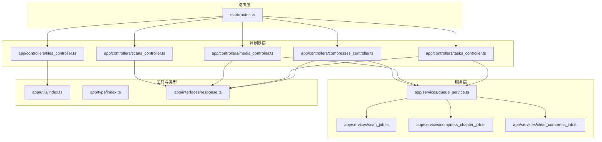
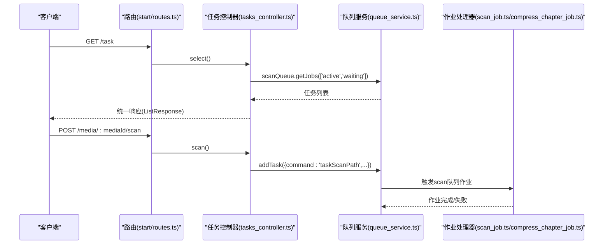
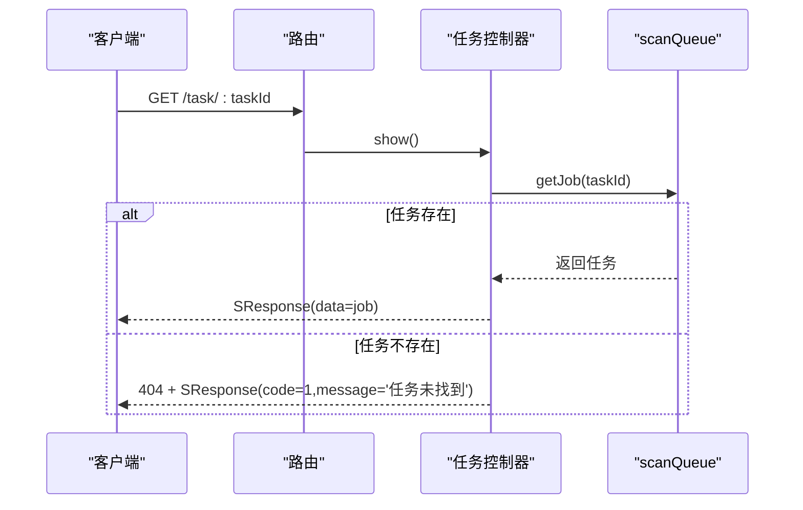
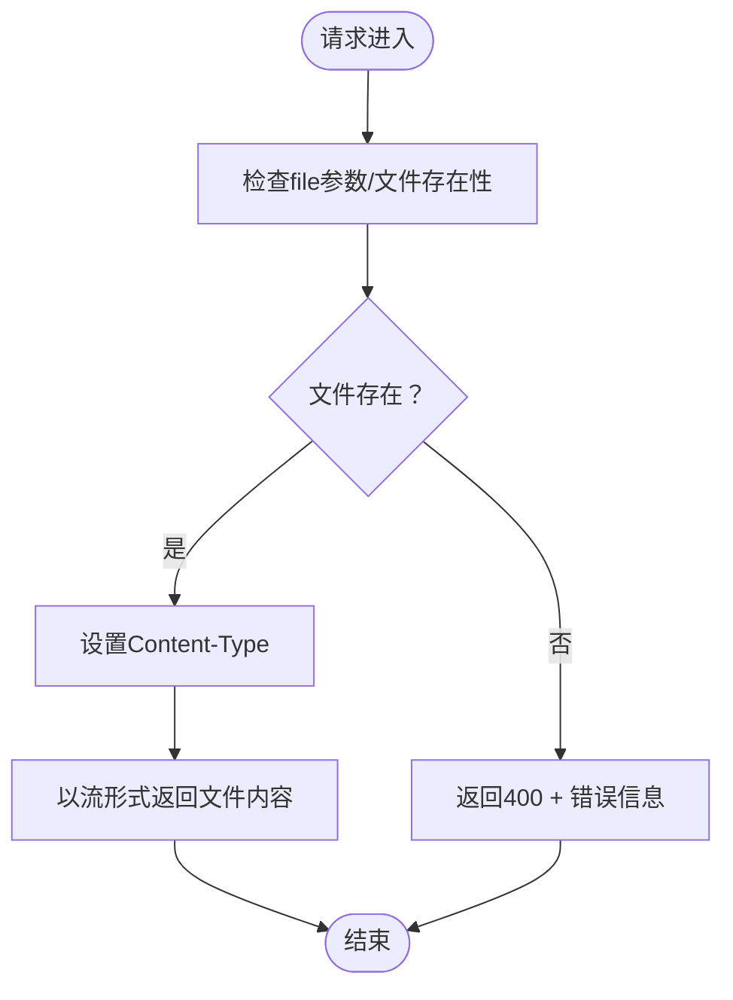
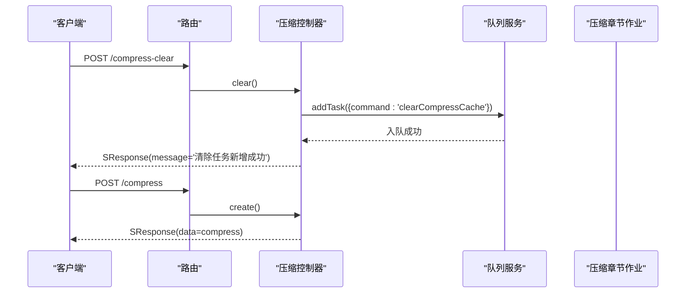
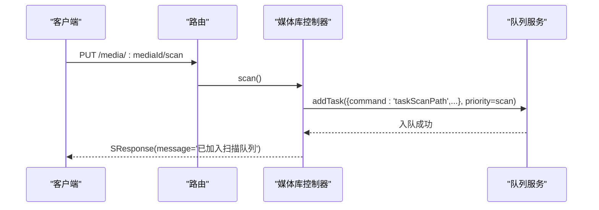
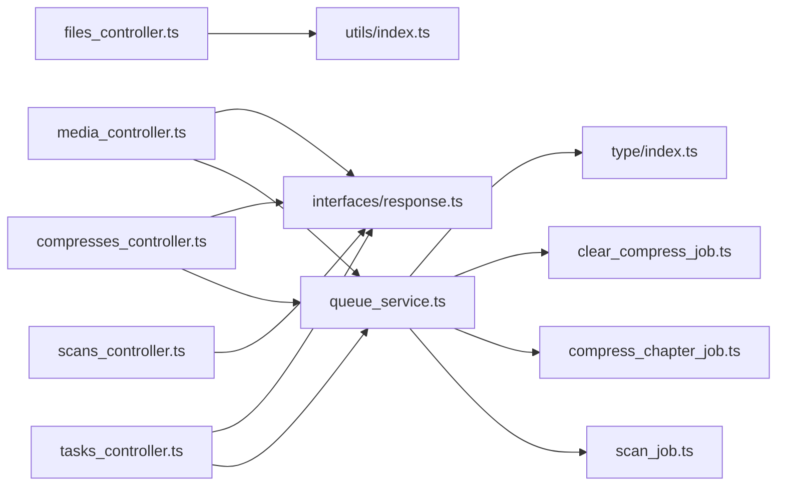

# 任务与文件API

<cite>
**本文引用的文件**
- [tasks_controller.ts](file://app/controllers/tasks_controller.ts)
- [files_controller.ts](file://app/controllers/files_controller.ts)
- [compresses_controller.ts](file://app/controllers/compresses_controller.ts)
- [scans_controller.ts](file://app/controllers/scans_controller.ts)
- [media_controller.ts](file://app/controllers/media_controller.ts)
- [queue_service.ts](file://app/services/queue_service.ts)
- [scan_job.ts](file://app/services/scan_job.ts)
- [compress_chapter_job.ts](file://app/services/compress_chapter_job.ts)
- [clear_compress_job.ts](file://app/services/clear_compress_job.ts)
- [response.ts](file://app/interfaces/response.ts)
- [index.ts](file://app/type/index.ts)
- [routes.ts](file://start/routes.ts)
- [index.ts](file://app/utils/index.ts)
- [unzip.ts](file://app/utils/unzip.ts)
- [unrar.ts](file://app/utils/unrar.ts)
- [un7z.ts](file://app/utils/un7z.ts)
</cite>

## 目录
1. [简介](#简介)
2. [项目结构](#项目结构)
3. [核心组件](#核心组件)
4. [架构总览](#架构总览)
5. [详细组件分析](#详细组件分析)
6. [依赖关系分析](#依赖关系分析)
7. [性能考量](#性能考量)
8. [故障排查指南](#故障排查指南)
9. [结论](#结论)
10. [附录](#附录)

## 简介
本文件为 SManga Adonis 的“任务与文件API”技术文档，覆盖以下主题：
- 异步任务管理接口：任务创建、状态查询、批量与全量清理
- 文件上传下载与资源访问：图片与APK下载
- 压缩处理：章节解压、压缩缓存清理
- 媒体库管理：媒体库增删改查、扫描触发、封面生成
- 任务队列状态、文件处理进度、压缩配置
- 文件扫描、媒体库更新、清理操作等辅助功能
- 提供完整的任务生命周期管理与文件操作示例

## 项目结构
本项目采用基于控制器与服务分层的组织方式，API路由集中在路由文件中，控制器负责请求处理与响应封装，服务层负责具体业务逻辑与队列调度。

**图表来源**
- [routes.ts:127-142](file://start/routes.ts#L127-L142)
- [tasks_controller.ts:1-55](file://app/controllers/tasks_controller.ts#L1-L55)
- [files_controller.ts:1-55](file://app/controllers/files_controller.ts#L1-L55)
- [compresses_controller.ts:1-147](file://app/controllers/compresses_controller.ts#L1-L147)
- [scans_controller.ts:1-58](file://app/controllers/scans_controller.ts#L1-L58)
- [media_controller.ts:1-206](file://app/controllers/media_controller.ts#L1-L206)
- [queue_service.ts:1-267](file://app/services/queue_service.ts#L1-L267)
- [scan_job.ts:1-254](file://app/services/scan_job.ts#L1-L254)
- [compress_chapter_job.ts:1-71](file://app/services/compress_chapter_job.ts#L1-L71)
- [clear_compress_job.ts:1-56](file://app/services/clear_compress_job.ts#L1-L56)
- [index.ts:1-313](file://app/utils/index.ts#L1-L313)
- [index.ts:1-49](file://app/type/index.ts#L1-L49)
- [response.ts:1-64](file://app/interfaces/response.ts#L1-L64)

**章节来源**
- [routes.ts:127-142](file://start/routes.ts#L127-L142)
- [tasks_controller.ts:1-55](file://app/controllers/tasks_controller.ts#L1-L55)
- [files_controller.ts:1-55](file://app/controllers/files_controller.ts#L1-L55)
- [compresses_controller.ts:1-147](file://app/controllers/compresses_controller.ts#L1-L147)
- [scans_controller.ts:1-58](file://app/controllers/scans_controller.ts#L1-L58)
- [media_controller.ts:1-206](file://app/controllers/media_controller.ts#L1-L206)
- [queue_service.ts:1-267](file://app/services/queue_service.ts#L1-L267)
- [scan_job.ts:1-254](file://app/services/scan_job.ts#L1-L254)
- [compress_chapter_job.ts:1-71](file://app/services/compress_chapter_job.ts#L1-L71)
- [clear_compress_job.ts:1-56](file://app/services/clear_compress_job.ts#L1-L56)
- [index.ts:1-313](file://app/utils/index.ts#L1-L313)
- [index.ts:1-49](file://app/type/index.ts#L1-L49)
- [response.ts:1-64](file://app/interfaces/response.ts#L1-L64)

## 核心组件
- 任务控制器：提供任务列表、详情、删除、批量删除、清空等接口
- 文件控制器：提供图片与APK下载接口
- 压缩控制器：提供压缩记录的增删改查与批量删除、清理压缩缓存任务提交
- 扫描控制器：提供扫描记录的增删改查
- 媒体库控制器：提供媒体库管理、扫描触发、封面生成
- 队列服务：统一的任务调度、队列选择、重试与退避策略
- 工具与类型：平台路径、配置读取、压缩工具、任务优先级定义
- 响应封装：统一的响应格式与列表格式

**章节来源**
- [tasks_controller.ts:1-55](file://app/controllers/tasks_controller.ts#L1-L55)
- [files_controller.ts:1-55](file://app/controllers/files_controller.ts#L1-L55)
- [compresses_controller.ts:1-147](file://app/controllers/compresses_controller.ts#L1-L147)
- [scans_controller.ts:1-58](file://app/controllers/scans_controller.ts#L1-L58)
- [media_controller.ts:1-206](file://app/controllers/media_controller.ts#L1-L206)
- [queue_service.ts:1-267](file://app/services/queue_service.ts#L1-L267)
- [index.ts:1-313](file://app/utils/index.ts#L1-L313)
- [index.ts:1-49](file://app/type/index.ts#L1-L49)
- [response.ts:1-64](file://app/interfaces/response.ts#L1-L64)

## 架构总览
系统通过路由将请求分发至对应控制器，控制器调用队列服务进行任务入队，队列服务根据任务名称自动选择队列（scan/sync/compress），并在Redis中执行作业。具体作业由对应的作业类实现，如扫描路径、压缩章节、清理压缩缓存等。

**图表来源**
- [routes.ts:127-142](file://start/routes.ts#L127-L142)
- [tasks_controller.ts:6-17](file://app/controllers/tasks_controller.ts#L6-L17)
- [media_controller.ts:187-204](file://app/controllers/media_controller.ts#L187-L204)
- [queue_service.ts:234-263](file://app/services/queue_service.ts#L234-L263)
- [scan_job.ts:29-119](file://app/services/scan_job.ts#L29-L119)

**章节来源**
- [routes.ts:127-142](file://start/routes.ts#L127-L142)
- [tasks_controller.ts:6-17](file://app/controllers/tasks_controller.ts#L6-L17)
- [media_controller.ts:187-204](file://app/controllers/media_controller.ts#L187-L204)
- [queue_service.ts:234-263](file://app/services/queue_service.ts#L234-L263)
- [scan_job.ts:29-119](file://app/services/scan_job.ts#L29-L119)

## 详细组件分析

### 任务管理API
- 路由与方法
  - GET /task：列出活动与等待中的任务
  - GET /task/:taskId：按ID查询任务详情
  - DELETE /task/:taskId：删除指定任务
  - DELETE /task/:taskIds/batch：批量删除任务
  - DELETE /task：清空队列（保留历史）
- 响应格式
  - 统一使用 SResponse/ListResponse 封装
- 实现要点
  - 控制器直接从 scanQueue 查询任务
  - 删除任务前进行存在性校验
  - 批量删除通过任务ID列表批量移除

**图表来源**
- [routes.ts:127-132](file://start/routes.ts#L127-L132)
- [tasks_controller.ts:19-28](file://app/controllers/tasks_controller.ts#L19-L28)
- [response.ts:18-33](file://app/interfaces/response.ts#L18-L33)

**章节来源**
- [routes.ts:127-132](file://start/routes.ts#L127-L132)
- [tasks_controller.ts:6-53](file://app/controllers/tasks_controller.ts#L6-L53)
- [response.ts:18-63](file://app/interfaces/response.ts#L18-L63)

### 文件下载API
- 路由与方法
  - GET /file：下载本地图片资源
  - GET /file/apk：下载APK安装包
- 行为说明
  - 图片下载：校验文件存在性与类型，设置Content-Type并以流形式返回
  - APK下载：设置附件并返回文件内容
- 注意事项
  - Windows/Linux下APK路径不同
  - 图片类型判断基于扩展名

**图表来源**
- [files_controller.ts:7-34](file://app/controllers/files_controller.ts#L7-L34)
- [index.ts:24-28](file://app/utils/index.ts#L24-L28)

**章节来源**
- [routes.ts:238-241](file://start/routes.ts#L238-L241)
- [files_controller.ts:6-54](file://app/controllers/files_controller.ts#L6-L54)
- [index.ts:9-18](file://app/utils/index.ts#L9-L18)

### 压缩处理API
- 路由与方法
  - GET /compress：分页查询压缩记录
  - GET /compress/:compressId：查询单条记录
  - POST /compress：新增记录
  - PUT /compress/:compressId：更新记录
  - DELETE /compress/:compressId：删除记录并删除物理文件
  - DELETE /compress/:compressIds/batch：批量删除记录并删除物理文件
  - DELETE /compress-clear：提交清理压缩缓存任务
- 压缩流程
  - 解压章节：根据压缩类型（zip/rar/7z）调用对应工具解压
  - 更新压缩记录：upsert压缩记录，标记状态为已压缩
- 清理策略
  - 依据配置限制数量，删除多余记录与对应目录
  - 删除数据库中不存在的冗余目录

**图表来源**
- [routes.ts:85-92](file://start/routes.ts#L85-L92)
- [compresses_controller.ts:137-145](file://app/controllers/compresses_controller.ts#L137-L145)
- [queue_service.ts:50-66](file://app/services/queue_service.ts#L50-L66)
- [compress_chapter_job.ts:31-65](file://app/services/compress_chapter_job.ts#L31-L65)

**章节来源**
- [routes.ts:85-92](file://start/routes.ts#L85-L92)
- [compresses_controller.ts:8-146](file://app/controllers/compresses_controller.ts#L8-L146)
- [compress_chapter_job.ts:1-71](file://app/services/compress_chapter_job.ts#L1-L71)
- [clear_compress_job.ts:1-56](file://app/services/clear_compress_job.ts#L1-L56)

### 媒体库管理API
- 路由与方法
  - GET /media：分页查询媒体库（考虑权限）
  - GET /media/:mediaId：查询媒体库详情（权限校验）
  - POST /media：新增媒体库（若同名存在则取消删除标志）
  - PUT /media/:mediaId：更新媒体库
  - DELETE /media/:mediaId：软删除（标记deleteFlag=1），并异步删除媒体库数据
  - DELETE /media/:mediaIds/batch：批量软删除并异步删除
  - PUT /media-cover/:mediaId：生成媒体库封面
  - PUT /media/:mediaId/scan：为媒体库下所有路径加入扫描任务
- 权限控制
  - 管理员或拥有媒体库权限的用户可查看
- 任务调度
  - 删除、扫描、生成封面均通过 addTask 入队

**图表来源**
- [routes.ts:134-142](file://start/routes.ts#L134-L142)
- [media_controller.ts:187-204](file://app/controllers/media_controller.ts#L187-L204)
- [queue_service.ts:234-263](file://app/services/queue_service.ts#L234-L263)

**章节来源**
- [routes.ts:134-142](file://start/routes.ts#L134-L142)
- [media_controller.ts:8-205](file://app/controllers/media_controller.ts#L8-L205)
- [queue_service.ts:103-141](file://app/services/queue_service.ts#L103-L141)

### 扫描与同步API
- 路由与方法
  - GET /sync：列出同步任务（控制器存在但未在路由中暴露）
  - POST /sync：新增同步任务
  - PUT /sync/:syncId：更新同步任务
  - DELETE /sync/:syncId：删除同步任务
  - DELETE /sync/:syncIds/batch：批量删除同步任务
  - POST /sync/execute/:syncId：执行同步任务
- 扫描记录
  - GET /scan：列出扫描记录
  - GET /scan/:scanId：查询扫描记录
  - POST /scan：新增扫描记录
  - PUT /scan/:scanId：更新扫描记录
  - DELETE /scan/:scanId：删除扫描记录

**章节来源**
- [routes.ts:223-229](file://start/routes.ts#L223-L229)
- [scans_controller.ts:6-58](file://app/controllers/scans_controller.ts#L6-L58)

## 依赖关系分析
- 控制器依赖队列服务进行任务入队与状态查询
- 队列服务根据任务名称选择队列（scan/sync/compress），并注册对应处理器
- 作业类实现具体业务逻辑（扫描路径、压缩章节、清理缓存等）
- 工具模块提供平台路径、配置读取、压缩工具等支撑能力
- 类型模块定义任务优先级与元数据键类型

**图表来源**
- [tasks_controller.ts:1-55](file://app/controllers/tasks_controller.ts#L1-L55)
- [media_controller.ts:1-206](file://app/controllers/media_controller.ts#L1-L206)
- [compresses_controller.ts:1-147](file://app/controllers/compresses_controller.ts#L1-L147)
- [queue_service.ts:1-267](file://app/services/queue_service.ts#L1-L267)
- [scan_job.ts:1-254](file://app/services/scan_job.ts#L1-L254)
- [compress_chapter_job.ts:1-71](file://app/services/compress_chapter_job.ts#L1-L71)
- [clear_compress_job.ts:1-56](file://app/services/clear_compress_job.ts#L1-L56)
- [files_controller.ts:1-55](file://app/controllers/files_controller.ts#L1-L55)
- [index.ts:1-313](file://app/utils/index.ts#L1-L313)
- [response.ts:1-64](file://app/interfaces/response.ts#L1-L64)
- [index.ts:1-49](file://app/type/index.ts#L1-L49)

**章节来源**
- [tasks_controller.ts:1-55](file://app/controllers/tasks_controller.ts#L1-L55)
- [media_controller.ts:1-206](file://app/controllers/media_controller.ts#L1-L206)
- [compresses_controller.ts:1-147](file://app/controllers/compresses_controller.ts#L1-L147)
- [queue_service.ts:1-267](file://app/services/queue_service.ts#L1-L267)
- [scan_job.ts:1-254](file://app/services/scan_job.ts#L1-L254)
- [compress_chapter_job.ts:1-71](file://app/services/compress_chapter_job.ts#L1-L71)
- [clear_compress_job.ts:1-56](file://app/services/clear_compress_job.ts#L1-L56)
- [files_controller.ts:1-55](file://app/controllers/files_controller.ts#L1-L55)
- [index.ts:1-313](file://app/utils/index.ts#L1-L313)
- [response.ts:1-64](file://app/interfaces/response.ts#L1-L64)
- [index.ts:1-49](file://app/type/index.ts#L1-L49)

## 性能考量
- 队列并发与重试
  - 队列配置包含并发数、最大重试次数与超时时间
  - 采用指数退避与抖动，避免重试风暴
- 路径扫描去重
  - 对同一路径的扫描与删除任务进行去重判断，避免重复执行
- 压缩缓存清理
  - 基于配置限制压缩缓存数量，定期清理多余记录与目录
- I/O优化
  - 图片下载使用流式传输，减少内存占用
  - 压缩解压使用流式处理与按需提取

**章节来源**
- [queue_service.ts:18-32](file://app/services/queue_service.ts#L18-L32)
- [queue_service.ts:222-232](file://app/services/queue_service.ts#L222-L232)
- [clear_compress_job.ts:17-42](file://app/services/clear_compress_job.ts#L17-L42)
- [files_controller.ts:32-33](file://app/controllers/files_controller.ts#L32-L33)

## 故障排查指南
- 任务未找到
  - 现象：查询任务返回404
  - 排查：确认任务ID正确；检查队列中是否存在该任务
- 任务删除失败
  - 现象：删除任务报错
  - 排查：确认任务存在；检查队列连接与权限
- 压缩任务失败
  - 现象：压缩记录状态异常
  - 排查：查看作业日志；确认压缩文件类型与目标路径；检查磁盘空间
- 媒体库扫描未生效
  - 现象：扫描未执行
  - 排查：确认路径存在且未处于扫描/删除中；检查队列服务与Redis连接
- 文件下载失败
  - 现象：图片或APK下载返回错误
  - 排查：确认文件路径与权限；检查Content-Type设置；Windows/Linux路径差异

**章节来源**
- [tasks_controller.ts:23-36](file://app/controllers/tasks_controller.ts#L23-L36)
- [compress_chapter_job.ts:66-69](file://app/services/compress_chapter_job.ts#L66-L69)
- [media_controller.ts:187-204](file://app/controllers/media_controller.ts#L187-L204)
- [files_controller.ts:17-22](file://app/controllers/files_controller.ts#L17-L22)

## 结论
本API体系围绕“任务队列+作业处理”的架构设计，实现了媒体库扫描、压缩处理、文件下载等核心能力。通过统一的响应封装与严格的权限控制，确保了系统的稳定性与可维护性。建议在生产环境中结合监控与日志完善可观测性，并根据业务规模调整队列并发与重试策略。

## 附录

### 常用工具与配置
- 平台路径
  - 元数据、海报、书签、缓存、压缩、配置等目录路径根据平台自动切换
- 配置读取
  - 读取与写入配置文件，支持运行时动态调整
- 压缩工具
  - zip：AdmZip
  - rar：node-unrar-js
  - 7z：node-7z

**章节来源**
- [index.ts:34-115](file://app/utils/index.ts#L34-L115)
- [unzip.ts:10-168](file://app/utils/unzip.ts#L10-L168)
- [unrar.ts:7-118](file://app/utils/unrar.ts#L7-L118)
- [un7z.ts:12-141](file://app/utils/un7z.ts#L12-L141)