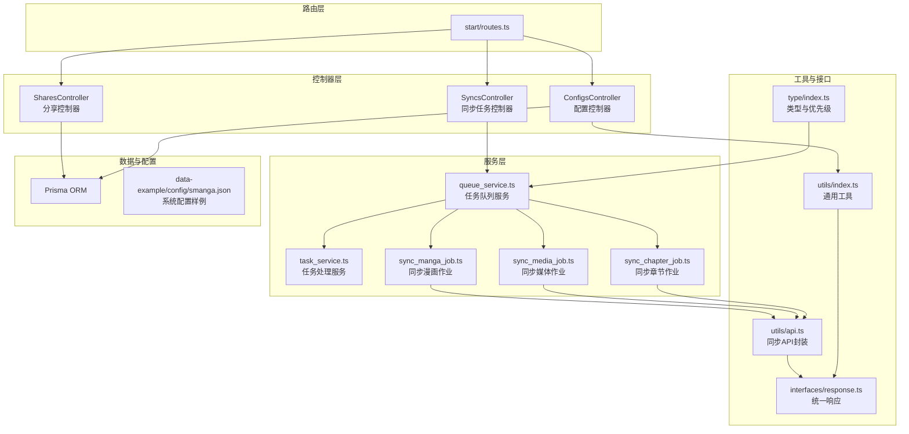
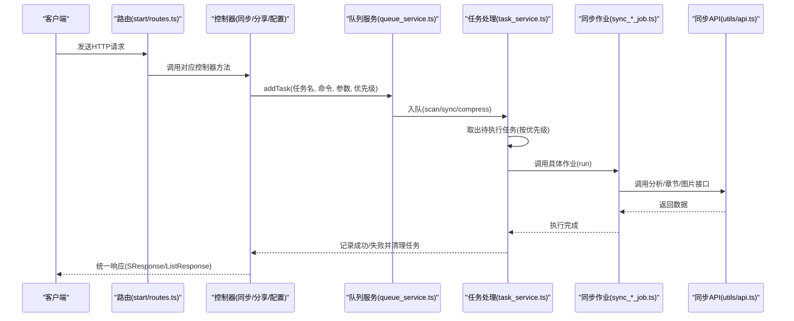
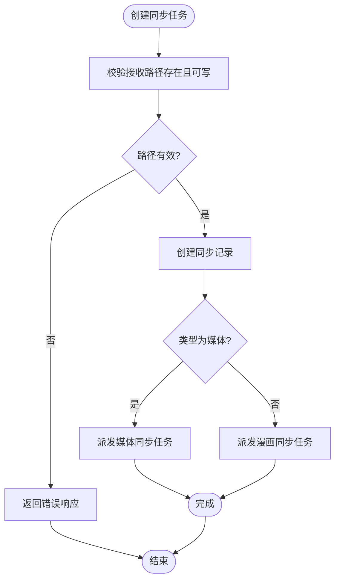
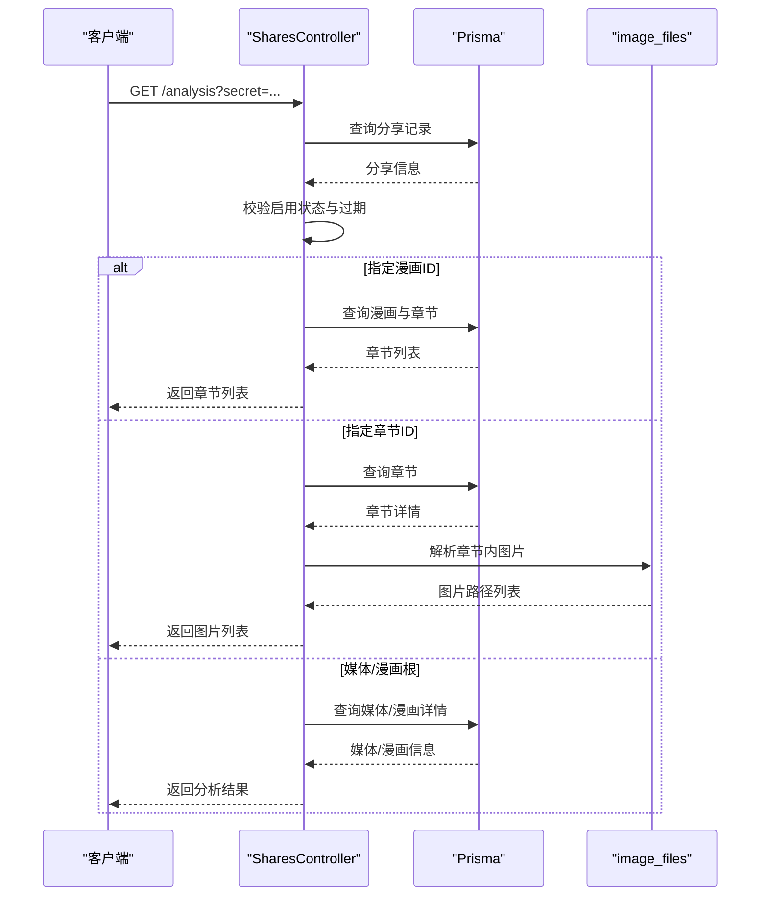
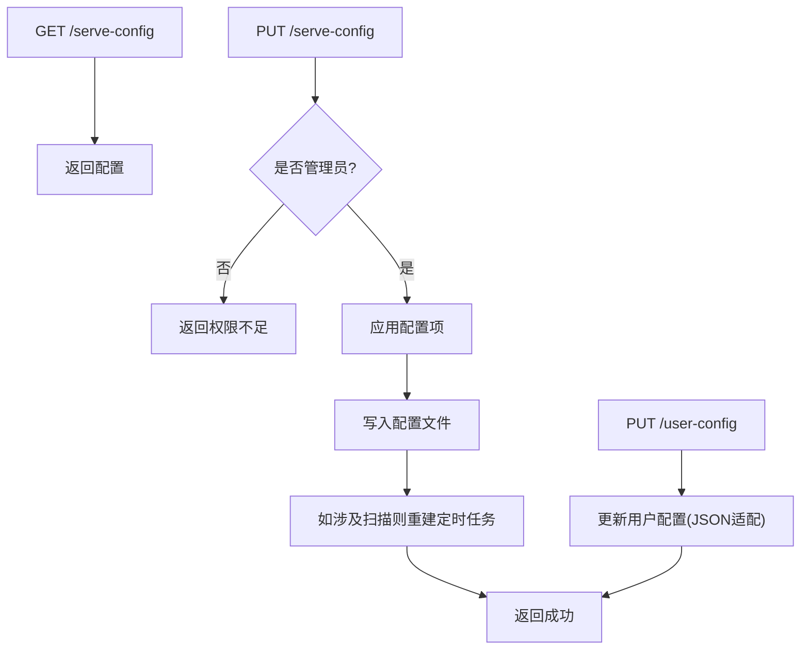
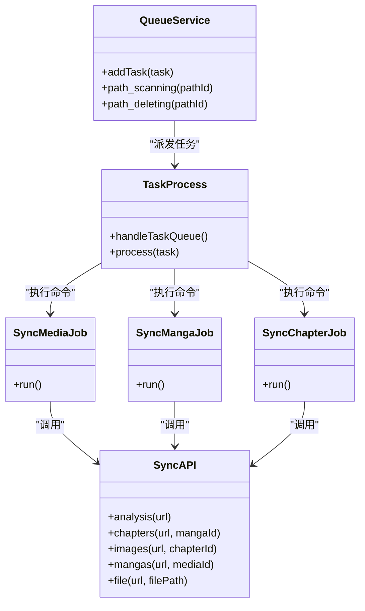
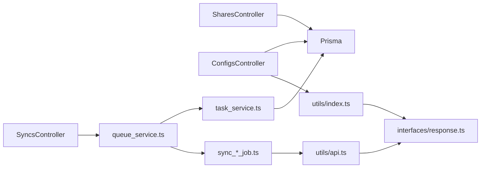

# 同步分享与配置API

<cite>
**本文档引用的文件**
- [app/controllers/syncs_controller.ts](file://app/controllers/syncs_controller.ts)
- [app/controllers/shares_controller.ts](file://app/controllers/shares_controller.ts)
- [app/controllers/configs_controller.ts](file://app/controllers/configs_controller.ts)
- [app/services/queue_service.ts](file://app/services/queue_service.ts)
- [app/services/task_service.ts](file://app/services/task_service.ts)
- [app/services/sync_manga_job.ts](file://app/services/sync_manga_job.ts)
- [app/services/sync_media_job.ts](file://app/services/sync_media_job.ts)
- [app/services/sync_chapter_job.ts](file://app/services/sync_chapter_job.ts)
- [app/utils/api.ts](file://app/utils/api.ts)
- [app/utils/index.ts](file://app/utils/index.ts)
- [app/type/index.ts](file://app/type/index.ts)
- [app/interfaces/response.ts](file://app/interfaces/response.ts)
- [start/routes.ts](file://start/routes.ts)
- [data-example/config/smanga.json](file://data-example/config/smanga.json)
</cite>

## 目录
1. [简介](#简介)
2. [项目结构](#项目结构)
3. [核心组件](#核心组件)
4. [架构总览](#架构总览)
5. [详细组件分析](#详细组件分析)
6. [依赖关系分析](#依赖关系分析)
7. [性能考量](#性能考量)
8. [故障排查指南](#故障排查指南)
9. [结论](#结论)
10. [附录](#附录)

## 简介
本文件为 SManga Adonis 的“同步分享与配置”API文档，覆盖以下能力：
- 同步任务管理：创建、查询、更新、执行、删除、批量删除
- 分享管理：创建分享、分析统计、章节与图片解析、批量删除
- 系统配置：服务端配置、用户配置、客户端配置接口
- 同步策略：基于队列的任务调度、重试与超时、并发控制
- 分享统计：按分享密钥进行访问校验、过期控制、资源解析
- 配置验证：配置项校验、持久化与定时任务重建

## 项目结构
围绕同步、分享、配置三大主题，后端采用控制器-服务-工具分层设计，配合路由注册与数据库交互。

**图表来源**
- [start/routes.ts:1-241](file://start/routes.ts#L1-L241)
- [app/controllers/syncs_controller.ts:1-193](file://app/controllers/syncs_controller.ts#L1-L193)
- [app/controllers/shares_controller.ts:1-378](file://app/controllers/shares_controller.ts#L1-L378)
- [app/controllers/configs_controller.ts:1-119](file://app/controllers/configs_controller.ts#L1-L119)
- [app/services/queue_service.ts:1-267](file://app/services/queue_service.ts#L1-L267)
- [app/services/task_service.ts:1-171](file://app/services/task_service.ts#L1-L171)
- [app/services/sync_manga_job.ts:1-103](file://app/services/sync_manga_job.ts#L1-L103)
- [app/services/sync_media_job.ts:1-44](file://app/services/sync_media_job.ts#L1-L44)
- [app/services/sync_chapter_job.ts:1-35](file://app/services/sync_chapter_job.ts#L1-L35)
- [app/utils/api.ts:1-178](file://app/utils/api.ts#L1-L178)
- [app/utils/index.ts:1-313](file://app/utils/index.ts#L1-L313)
- [app/type/index.ts:1-49](file://app/type/index.ts#L1-L49)
- [app/interfaces/response.ts:1-64](file://app/interfaces/response.ts#L1-L64)
- [data-example/config/smanga.json:1-54](file://data-example/config/smanga.json#L1-L54)

**章节来源**
- [start/routes.ts:1-241](file://start/routes.ts#L1-L241)

## 核心组件
- 同步任务控制器：提供同步任务的增删改查与执行入口，创建时自动派发对应同步作业
- 分享控制器：提供分享创建、分析、章节/图片解析、批量删除
- 配置控制器：提供服务端配置读取、设置（含管理员权限校验）、用户配置更新
- 队列服务：统一的任务派发、队列分类（scan/sync/compress）、重试与超时策略
- 任务处理服务：串行拉取待执行任务、执行并记录成功/失败
- 同步作业：根据分享链接或本地记录，拉取目标资源并派发子任务
- 工具与接口：统一响应格式、通用工具、同步API封装、类型定义

**章节来源**
- [app/controllers/syncs_controller.ts:1-193](file://app/controllers/syncs_controller.ts#L1-L193)
- [app/controllers/shares_controller.ts:1-378](file://app/controllers/shares_controller.ts#L1-L378)
- [app/controllers/configs_controller.ts:1-119](file://app/controllers/configs_controller.ts#L1-L119)
- [app/services/queue_service.ts:1-267](file://app/services/queue_service.ts#L1-L267)
- [app/services/task_service.ts:1-171](file://app/services/task_service.ts#L1-L171)
- [app/services/sync_manga_job.ts:1-103](file://app/services/sync_manga_job.ts#L1-L103)
- [app/services/sync_media_job.ts:1-44](file://app/services/sync_media_job.ts#L1-L44)
- [app/services/sync_chapter_job.ts:1-35](file://app/services/sync_chapter_job.ts#L1-L35)
- [app/utils/api.ts:1-178](file://app/utils/api.ts#L1-L178)
- [app/utils/index.ts:1-313](file://app/utils/index.ts#L1-L313)
- [app/type/index.ts:1-49](file://app/type/index.ts#L1-L49)
- [app/interfaces/response.ts:1-64](file://app/interfaces/response.ts#L1-L64)

## 架构总览
下图展示从HTTP请求到任务执行与资源同步的整体流程。

**图表来源**
- [start/routes.ts:223-235](file://start/routes.ts#L223-L235)
- [app/controllers/syncs_controller.ts:34-108](file://app/controllers/syncs_controller.ts#L34-L108)
- [app/controllers/shares_controller.ts:50-78](file://app/controllers/shares_controller.ts#L50-L78)
- [app/services/queue_service.ts:175-264](file://app/services/queue_service.ts#L175-L264)
- [app/services/task_service.ts:36-171](file://app/services/task_service.ts#L36-L171)
- [app/services/sync_manga_job.ts:25-102](file://app/services/sync_manga_job.ts#L25-L102)
- [app/services/sync_media_job.ts:17-43](file://app/services/sync_media_job.ts#L17-L43)
- [app/services/sync_chapter_job.ts:20-35](file://app/services/sync_chapter_job.ts#L20-L35)
- [app/utils/api.ts:52-73](file://app/utils/api.ts#L52-L73)
- [app/interfaces/response.ts:18-63](file://app/interfaces/response.ts#L18-L63)

## 详细组件分析

### 同步任务管理
- 查询同步任务：分页查询、总数统计
- 创建同步任务：校验接收路径存在性与可写性；根据类型派发媒体/漫画同步任务
- 更新同步任务：更新基础字段
- 执行同步任务：根据已有记录重新派发对应命令
- 删除同步任务：单条删除
- 批量删除：按逗号分隔的ID列表批量删除

**图表来源**
- [app/controllers/syncs_controller.ts:34-108](file://app/controllers/syncs_controller.ts#L34-L108)
- [app/services/queue_service.ts:234-264](file://app/services/queue_service.ts#L234-L264)

**章节来源**
- [app/controllers/syncs_controller.ts:1-193](file://app/controllers/syncs_controller.ts#L1-L193)
- [app/services/queue_service.ts:1-267](file://app/services/queue_service.ts#L1-L267)

### 分享管理
- 分享创建：生成UUID密钥与分享链接，关联媒体/漫画，设置过期时间，默认一年
- 分享分析：按密钥校验、启用状态与过期时间；支持返回漫画章节、章节图片、媒体下漫画列表
- 分享更新：更新关联媒体/漫画
- 分享删除：单条删除与批量删除

**图表来源**
- [app/controllers/shares_controller.ts:118-261](file://app/controllers/shares_controller.ts#L118-L261)
- [app/utils/index.ts:235-260](file://app/utils/index.ts#L235-L260)

**章节来源**
- [app/controllers/shares_controller.ts:1-378](file://app/controllers/shares_controller.ts#L1-L378)
- [app/utils/index.ts:1-313](file://app/utils/index.ts#L1-L313)

### 系统配置
- 服务端配置读取：返回当前运行配置
- 服务端配置设置：管理员权限校验，支持扫描、压缩、队列、同步等配置项；变更后重建扫描定时任务
- 用户配置更新：更新用户自定义配置（JSON序列化/反序列化适配）

**图表来源**
- [app/controllers/configs_controller.ts:10-117](file://app/controllers/configs_controller.ts#L10-L117)
- [app/utils/index.ts:94-115](file://app/utils/index.ts#L94-L115)

**章节来源**
- [app/controllers/configs_controller.ts:1-119](file://app/controllers/configs_controller.ts#L1-L119)
- [app/utils/index.ts:1-313](file://app/utils/index.ts#L1-L313)
- [data-example/config/smanga.json:1-54](file://data-example/config/smanga.json#L1-L54)

### 同步策略与执行
- 任务派发：根据任务名关键字选择队列（sync/compress），设置优先级与超时、重试
- 任务执行：串行拉取待执行任务，按命令分发到具体作业
- 同步作业：
  - 媒体同步：先分析分享，再拉取媒体下漫画列表，逐个派发漫画同步
  - 漫画同步：先分析分享，创建本地漫画目录，下载外置封面与元数据，派发章节同步
  - 章节同步：下载章节外置封面与图片资源

**图表来源**
- [app/services/queue_service.ts:175-264](file://app/services/queue_service.ts#L175-L264)
- [app/services/task_service.ts:36-171](file://app/services/task_service.ts#L36-L171)
- [app/services/sync_media_job.ts:17-43](file://app/services/sync_media_job.ts#L17-L43)
- [app/services/sync_manga_job.ts:25-102](file://app/services/sync_manga_job.ts#L25-L102)
- [app/services/sync_chapter_job.ts:20-35](file://app/services/sync_chapter_job.ts#L20-L35)
- [app/utils/api.ts:52-73](file://app/utils/api.ts#L52-L73)

**章节来源**
- [app/services/queue_service.ts:1-267](file://app/services/queue_service.ts#L1-L267)
- [app/services/task_service.ts:1-171](file://app/services/task_service.ts#L1-L171)
- [app/services/sync_media_job.ts:1-44](file://app/services/sync_media_job.ts#L1-L44)
- [app/services/sync_manga_job.ts:1-103](file://app/services/sync_manga_job.ts#L1-L103)
- [app/services/sync_chapter_job.ts:1-35](file://app/services/sync_chapter_job.ts#L1-L35)
- [app/utils/api.ts:1-178](file://app/utils/api.ts#L1-L178)
- [app/type/index.ts:1-49](file://app/type/index.ts#L1-L49)

## 依赖关系分析
- 控制器依赖：同步控制器依赖队列服务与Prisma；分享控制器依赖Prisma与通用工具；配置控制器依赖Prisma与配置工具
- 服务依赖：队列服务依赖Bull与各作业；任务处理服务依赖Prisma与互斥锁
- 工具依赖：同步API封装依赖Axios；通用工具提供路径、JSON序列化、图片解析等

**图表来源**
- [app/controllers/syncs_controller.ts:1-193](file://app/controllers/syncs_controller.ts#L1-L193)
- [app/controllers/shares_controller.ts:1-378](file://app/controllers/shares_controller.ts#L1-L378)
- [app/controllers/configs_controller.ts:1-119](file://app/controllers/configs_controller.ts#L1-L119)
- [app/services/queue_service.ts:1-267](file://app/services/queue_service.ts#L1-L267)
- [app/services/task_service.ts:1-171](file://app/services/task_service.ts#L1-L171)
- [app/services/sync_manga_job.ts:1-103](file://app/services/sync_manga_job.ts#L1-L103)
- [app/services/sync_media_job.ts:1-44](file://app/services/sync_media_job.ts#L1-L44)
- [app/services/sync_chapter_job.ts:1-35](file://app/services/sync_chapter_job.ts#L1-L35)
- [app/utils/api.ts:1-178](file://app/utils/api.ts#L1-L178)
- [app/utils/index.ts:1-313](file://app/utils/index.ts#L1-L313)
- [app/interfaces/response.ts:1-64](file://app/interfaces/response.ts#L1-L64)

**章节来源**
- [app/controllers/syncs_controller.ts:1-193](file://app/controllers/syncs_controller.ts#L1-L193)
- [app/controllers/shares_controller.ts:1-378](file://app/controllers/shares_controller.ts#L1-L378)
- [app/controllers/configs_controller.ts:1-119](file://app/controllers/configs_controller.ts#L1-L119)
- [app/services/queue_service.ts:1-267](file://app/services/queue_service.ts#L1-L267)
- [app/services/task_service.ts:1-171](file://app/services/task_service.ts#L1-L171)
- [app/services/sync_manga_job.ts:1-103](file://app/services/sync_manga_job.ts#L1-L103)
- [app/services/sync_media_job.ts:1-44](file://app/services/sync_media_job.ts#L1-L44)
- [app/services/sync_chapter_job.ts:1-35](file://app/services/sync_chapter_job.ts#L1-L35)
- [app/utils/api.ts:1-178](file://app/utils/api.ts#L1-L178)
- [app/utils/index.ts:1-313](file://app/utils/index.ts#L1-L313)
- [app/interfaces/response.ts:1-64](file://app/interfaces/response.ts#L1-L64)

## 性能考量
- 队列并发与重试：队列配置支持并发、最大重试次数与超时；同步任务采用指数退避重试，避免重试风暴
- 任务优先级：同步相关任务具有较高优先级，确保及时执行
- 串行任务处理：任务处理服务限制并发，避免数据库与磁盘竞争
- 资源下载：文件下载具备重试与错误日志记录，失败后清理临时文件

**章节来源**
- [app/services/queue_service.ts:18-28](file://app/services/queue_service.ts#L18-L28)
- [app/services/queue_service.ts:234-264](file://app/services/queue_service.ts#L234-L264)
- [app/services/task_service.ts:26-84](file://app/services/task_service.ts#L26-L84)
- [app/utils/api.ts:119-176](file://app/utils/api.ts#L119-L176)

## 故障排查指南
- 同步任务创建失败：检查接收路径是否存在、可写；确认链接格式与来源API路径拼接逻辑
- 分享分析失败：确认分享密钥正确、启用状态正常、未过期；检查媒体/漫画ID有效性
- 配置修改无效：确认调用者具备管理员角色；检查配置文件写入权限与定时任务重建
- 任务未执行：检查队列服务是否启动、Redis连接状态；查看任务优先级与队列分类
- 下载失败：查看重试日志与错误信息，确认远端文件路径与网络连通性

**章节来源**
- [app/controllers/syncs_controller.ts:34-108](file://app/controllers/syncs_controller.ts#L34-L108)
- [app/controllers/shares_controller.ts:118-139](file://app/controllers/shares_controller.ts#L118-L139)
- [app/controllers/configs_controller.ts:16-21](file://app/controllers/configs_controller.ts#L16-L21)
- [app/services/queue_service.ts:34-47](file://app/services/queue_service.ts#L34-L47)
- [app/utils/api.ts:164-170](file://app/utils/api.ts#L164-L170)

## 结论
本API体系通过清晰的控制器-服务-工具分层，结合队列与任务处理机制，实现了可靠的同步分享与配置管理能力。建议在生产环境中合理配置队列并发与重试策略，并完善监控与日志记录，以保障大规模任务的稳定执行。

## 附录

### 接口一览与最佳实践

- 同步任务接口
  - GET /sync：分页查询同步任务
  - POST /sync：创建同步任务（校验接收路径、派发媒体/漫画同步）
  - PUT /sync/{syncId}：更新同步任务
  - POST /sync/execute/{syncId}：执行已有同步任务
  - DELETE /sync/{syncId}：删除同步任务
  - DELETE /sync/{syncIds}/batch：批量删除同步任务

- 分享接口
  - GET /share：分页查询分享
  - GET /share/{shareId}：查询分享详情
  - POST /share：创建分享（生成密钥与链接）
  - PUT /share/{shareId}：更新分享关联对象
  - DELETE /share/{shareId}：删除分享
  - DELETE /share/{shareIds}/batch：批量删除分享
  - GET /analysis：按密钥分析（漫画章节/图片/媒体/漫画）
  - GET /analysis/chapters：按漫画ID返回章节列表
  - GET /analysis/images：按章节ID返回图片列表
  - GET /analysis/mangas：按媒体ID返回漫画列表

- 配置接口
  - GET serve-config：获取服务端配置
  - PUT serve-config：设置服务端配置（管理员）
  - PUT user-config：更新用户配置（JSON序列化）

最佳实践
- 同步任务：优先使用分享链接创建任务，便于统一管理与过期控制；批量派发时注意任务优先级与队列分类
- 分享管理：合理设置过期时间与启用状态；对外暴露分析接口时严格校验密钥与过期
- 配置管理：变更扫描/压缩/队列配置后及时重建定时任务；确保配置文件写入权限

**章节来源**
- [start/routes.ts:223-235](file://start/routes.ts#L223-L235)
- [app/controllers/syncs_controller.ts:1-193](file://app/controllers/syncs_controller.ts#L1-L193)
- [app/controllers/shares_controller.ts:1-378](file://app/controllers/shares_controller.ts#L1-L378)
- [app/controllers/configs_controller.ts:1-119](file://app/controllers/configs_controller.ts#L1-L119)