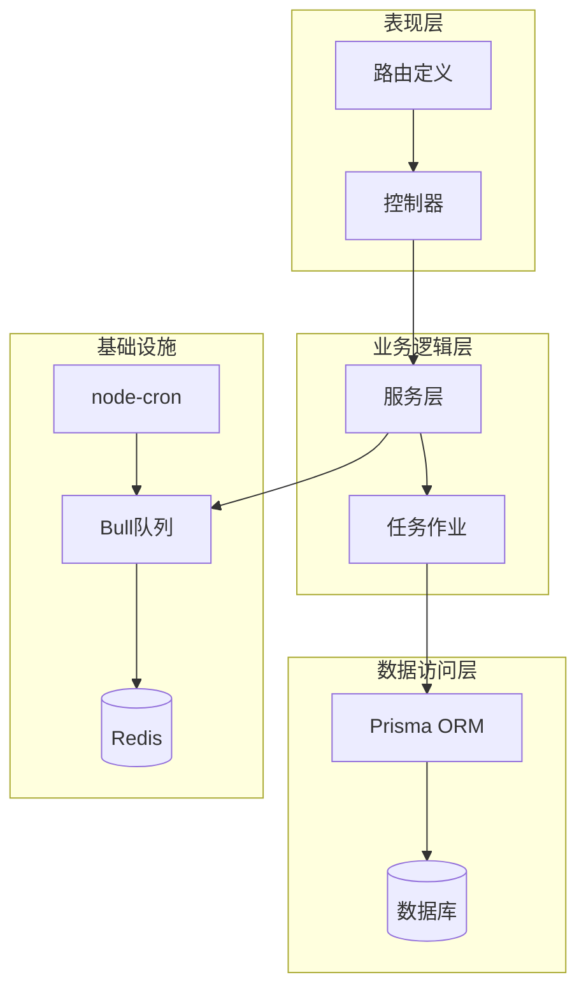
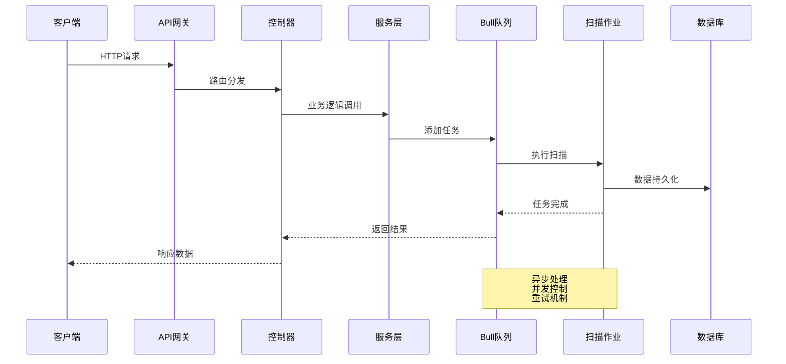
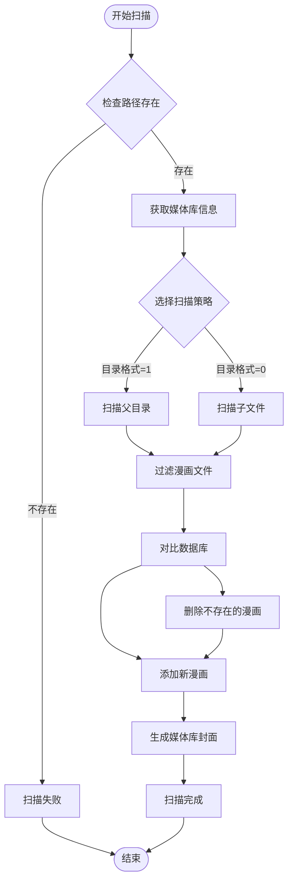
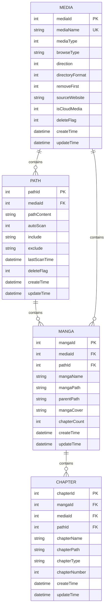
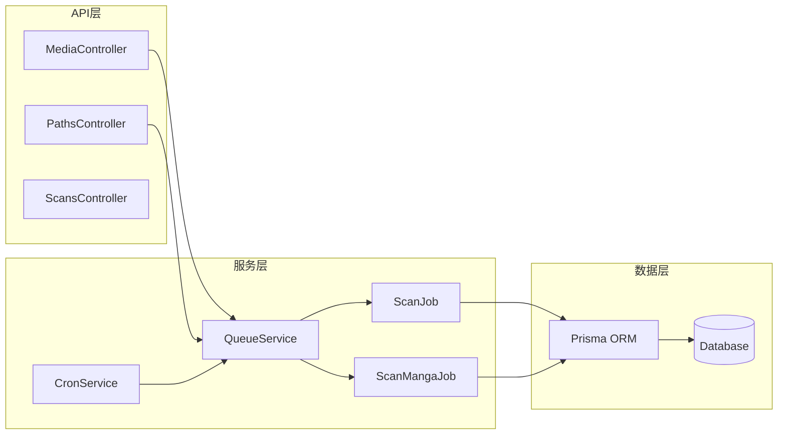

# 媒体库与路径API

<cite>
**本文档引用的文件**
- [media_controller.ts](file://app/controllers/media_controller.ts)
- [paths_controller.ts](file://app/controllers/paths_controller.ts)
- [scans_controller.ts](file://app/controllers/scans_controller.ts)
- [routes.ts](file://start/routes.ts)
- [scan_job.ts](file://app/services/scan_job.ts)
- [scan_manga_job.ts](file://app/services/scan_manga_job.ts)
- [queue_service.ts](file://app/services/queue_service.ts)
- [cron_service.ts](file://app/services/cron_service.ts)
- [index.ts](file://app/type/index.ts)
- [index.ts](file://app/utils/index.ts)
- [response.ts](file://app/interfaces/response.ts)
- [schema.prisma](file://prisma/sqlite/schema.prisma)
- [smanga.json](file://data-example/config/smanga.json)
</cite>

## 目录
1. [简介](#简介)
2. [项目结构](#项目结构)
3. [核心组件](#核心组件)
4. [架构概览](#架构概览)
5. [详细组件分析](#详细组件分析)
6. [依赖关系分析](#依赖关系分析)
7. [性能考虑](#性能考虑)
8. [故障排除指南](#故障排除指南)
9. [结论](#结论)

## 简介

SManga Adonis 是一个基于 Node.js 和 AdonisJS 构建的漫画管理系统，提供了完整的媒体库管理和路径扫描功能。本文档详细介绍了媒体库与路径相关的API接口，包括媒体库CRUD操作、封面设置、扫描更新等功能，以及路径管理的CRUD、重新扫描、批量操作等特性。

系统采用现代化的架构设计，使用Prisma ORM进行数据库操作，Bull队列系统处理异步任务，node-cron实现定时扫描功能，并通过Redis进行任务调度和状态管理。

## 项目结构

系统采用典型的三层架构模式：



**图表来源**
- [routes.ts:134-153](file://start/routes.ts#L134-L153)
- [queue_service.ts:34-39](file://app/services/queue_service.ts#L34-L39)

**章节来源**
- [routes.ts:134-153](file://start/routes.ts#L134-L153)
- [media_controller.ts:8-206](file://app/controllers/media_controller.ts#L8-L206)
- [paths_controller.ts:10-194](file://app/controllers/paths_controller.ts#L10-L194)

## 核心组件

### 媒体库管理模块

媒体库管理模块负责漫画收藏库的完整生命周期管理，包括创建、查询、更新、删除等操作。

**主要功能特性：**
- 媒体库CRUD操作
- 权限控制和用户访问限制
- 自动化封面生成
- 批量扫描任务调度

### 路径管理模块

路径管理模块负责管理媒体库对应的文件系统路径，支持多种扫描策略和过滤规则。

**核心功能：**
- 路径CRUD操作
- 自动扫描配置
- 正则表达式过滤
- 重新扫描机制
- 批量路径操作

### 扫描服务模块

扫描服务模块实现了复杂的文件系统扫描逻辑，支持多种漫画格式和扫描策略。

**技术特点：**
- 异步任务队列处理
- 多格式文件识别
- 元数据提取和处理
- 缓存和性能优化

**章节来源**
- [media_controller.ts:78-147](file://app/controllers/media_controller.ts#L78-L147)
- [paths_controller.ts:46-126](file://app/controllers/paths_controller.ts#L46-L126)
- [scan_job.ts:29-119](file://app/services/scan_job.ts#L29-L119)

## 架构概览

系统采用事件驱动的异步架构，通过队列系统实现任务解耦和并发处理：



**图表来源**
- [queue_service.ts:103-141](file://app/services/queue_service.ts#L103-L141)
- [scan_job.ts:29-119](file://app/services/scan_job.ts#L29-L119)

**章节来源**
- [queue_service.ts:175-264](file://app/services/queue_service.ts#L175-L264)
- [cron_service.ts:16-43](file://app/services/cron_service.ts#L16-L43)

## 详细组件分析

### 媒体库API接口

#### 基础CRUD操作

媒体库管理提供了完整的RESTful API接口：

| 方法 | 路径 | 功能描述 |
|------|------|----------|
| GET | `/media` | 获取媒体库列表 |
| GET | `/media/:mediaId` | 获取指定媒体库详情 |
| POST | `/media` | 创建新的媒体库 |
| PUT | `/media/:mediaId` | 更新媒体库信息 |
| DELETE | `/media/:mediaId` | 删除媒体库 |
| DELETE | `/media/:mediaIds/batch` | 批量删除媒体库 |

#### 高级功能接口

| 方法 | 路径 | 功能描述 |
|------|------|----------|
| PUT | `/media-cover/:mediaId` | 生成媒体库封面 |
| PUT | `/media/:mediaId/scan` | 触发媒体库扫描 |

#### 请求参数说明

**创建媒体库请求体参数：**
- `mediaName`: 媒体库名称 (必填)
- `mediaType`: 媒体库类型 (必填)
- `browseType`: 浏览类型 (默认: flow)
- `direction`: 阅读方向 (默认: 1)
- `directoryFormat`: 目录格式 (默认: 0)
- `removeFirst`: 移除首字 (默认: 0)
- `sourceWebsite`: 来源网站
- `isCloudMedia`: 云媒体标识 (默认: 0)

**响应数据结构：**
```typescript
interface MediaResponse {
  mediaId: number;
  mediaName: string;
  mediaType: number;
  browseType: string;
  direction: number;
  directoryFormat: number;
  removeFirst: number;
  sourceWebsite?: string;
  isCloudMedia: number;
  deleteFlag: number;
  createTime: Date;
  updateTime: Date;
}
```

**章节来源**
- [media_controller.ts:78-132](file://app/controllers/media_controller.ts#L78-L132)
- [routes.ts:134-142](file://start/routes.ts#L134-L142)

### 路径管理API接口

#### 路径CRUD操作

路径管理提供了完整的文件系统路径管理功能：

| 方法 | 路径 | 功能描述 |
|------|------|----------|
| GET | `/path` | 获取路径列表 |
| GET | `/path/:pathId` | 获取指定路径详情 |
| POST | `/path` | 创建新路径 |
| PUT | `/path/:pathId` | 更新路径配置 |
| DELETE | `/path/:pathId` | 删除路径 |
| DELETE | `/path/:pathIds/batch` | 批量删除路径 |

#### 扫描相关接口

| 方法 | 路径 | 功能描述 |
|------|------|----------|
| PUT | `/path/scan/:pathId` | 触发路径扫描 |
| PUT | `/path/:pathId/rescan` | 重新扫描路径 |

#### 请求参数详解

**创建路径请求体参数：**
- `pathContent`: 路径内容 (必填)
- `mediaId`: 媒体库ID (必填)
- `autoScan`: 自动扫描 (默认: 0)
- `include`: 包含正则表达式
- `exclude`: 排除正则表达式

**路径配置说明：**
- `autoScan`: 1启用自动扫描，0禁用
- `include/exclude`: 支持正则表达式过滤
- `lastScanTime`: 最后扫描时间

**章节来源**
- [paths_controller.ts:46-126](file://app/controllers/paths_controller.ts#L46-L126)
- [routes.ts:144-152](file://start/routes.ts#L144-L152)

### 扫描服务架构

#### 扫描流程设计

系统实现了两级扫描架构，确保扫描过程的可靠性和效率：



**图表来源**
- [scan_job.ts:29-119](file://app/services/scan_job.ts#L29-L119)
- [scan_manga_job.ts:76-356](file://app/services/scan_manga_job.ts#L76-L356)

#### 任务优先级管理

系统使用优先级队列确保重要任务的及时处理：

| 优先级 | 任务类型 | 说明 |
|--------|----------|------|
| 100000 | 压缩任务 | 高优先级压缩处理 |
| 200000 | 删除任务 | 删除操作优先级 |
| 300000 | 扫描任务 | 核心扫描任务 |
| 310000 | 漫画扫描 | 漫画文件扫描 |
| 330000 | 封面生成 | 媒体库封面生成 |
| 500000 | 同步任务 | 数据同步操作 |
| 900000 | 默认任务 | 普通任务 |

**章节来源**
- [scan_job.ts:126-250](file://app/services/scan_job.ts#L126-L250)
- [scan_manga_job.ts:728-791](file://app/services/scan_manga_job.ts#L728-L791)
- [index.ts:3-16](file://app/type/index.ts#L3-L16)

### 配置管理

#### 系统配置参数

系统配置通过JSON文件管理，支持运行时动态修改：

**扫描配置 (scan):**
- `auto`: 自动扫描开关 (默认: 0)
- `concurrency`: 并发数 (默认: 1)
- `reloadCover`: 重新加载封面 (默认: 0)
- `doNotCopyCover`: 不复制封面 (默认: 1)
- `ignoreHiddenFiles`: 忽略隐藏文件 (默认: 1)
- `defaultTagColor`: 默认标签颜色 (默认: #a0d911)
- `interval`: 扫描间隔 (默认: 0 0 0,12 * * *)
- `mediaPosterInterval`: 媒体库封面生成间隔 (默认: 0 0 1 * * *)

**队列配置 (queue):**
- `concurrency`: 队列并发数 (默认: 1)
- `attempts`: 最大重试次数 (默认: 3)
- `timeout`: 任务超时时间 (默认: 120000ms)

**章节来源**
- [smanga.json:18-50](file://data-example/config/smanga.json#L18-L50)
- [configs_controller.ts:16-50](file://app/controllers/configs_controller.ts#L16-L50)

## 依赖关系分析

### 数据模型关系

系统采用Prisma ORM定义了清晰的数据模型关系：



**图表来源**
- [schema.prisma:267-283](file://prisma/sqlite/schema.prisma#L267-L283)
- [schema.prisma:163-171](file://prisma/sqlite/schema.prisma#L163-L171)

### 组件依赖关系



**图表来源**
- [media_controller.ts:1-8](file://app/controllers/media_controller.ts#L1-L8)
- [paths_controller.ts:1-8](file://app/controllers/paths_controller.ts#L1-L8)
- [queue_service.ts:1-15](file://app/services/queue_service.ts#L1-L15)

**章节来源**
- [media_controller.ts:1-8](file://app/controllers/media_controller.ts#L1-L8)
- [paths_controller.ts:1-8](file://app/controllers/paths_controller.ts#L1-L8)
- [queue_service.ts:1-15](file://app/services/queue_service.ts#L1-L15)

## 性能考虑

### 扫描性能优化

系统在扫描过程中采用了多项性能优化策略：

1. **并发控制**: 通过配置文件控制扫描并发数，避免系统资源过度占用
2. **任务去重**: 检测相同路径的重复扫描任务，避免重复执行
3. **增量更新**: 只处理发生变化的漫画文件，减少不必要的数据库操作
4. **缓存机制**: 使用缓存目录存储中间结果，提高重复扫描速度

### 内存管理

- **流式处理**: 对大型文件采用流式处理方式，避免内存溢出
- **垃圾回收**: 定期清理临时文件和缓存数据
- **超时控制**: 为长时间运行的任务设置超时机制

### 网络优化

- **批量操作**: 支持批量删除和批量扫描，减少网络往返
- **异步处理**: 所有耗时操作都通过队列异步执行
- **连接池**: 数据库连接采用连接池管理，提高连接复用率

## 故障排除指南

### 常见问题及解决方案

#### 扫描任务失败

**问题症状：**
- 扫描任务长时间处于等待状态
- 扫描结果不完整
- 系统日志出现错误信息

**排查步骤：**
1. 检查Redis服务是否正常运行
2. 查看队列中待处理任务数量
3. 检查目标路径是否存在且可访问
4. 验证配置文件中的扫描参数

**解决方案：**
- 重启Redis服务
- 清理队列中的异常任务
- 检查路径权限设置
- 调整扫描并发参数

#### 数据库连接问题

**问题症状：**
- API请求超时
- 数据库操作失败
- 系统启动时报错

**排查步骤：**
1. 检查数据库服务状态
2. 验证数据库连接配置
3. 查看数据库连接池状态
4. 检查数据库文件权限

**解决方案：**
- 重启数据库服务
- 更新正确的连接参数
- 检查防火墙设置
- 验证数据库文件完整性

#### 配置文件错误

**问题症状：**
- 系统启动失败
- 部分功能不可用
- 运行时抛出配置异常

**排查步骤：**
1. 检查JSON语法是否正确
2. 验证必需字段是否存在
3. 确认数据类型是否匹配
4. 检查文件路径是否正确

**解决方案：**
- 使用JSON验证工具检查语法
- 参考示例配置文件修正
- 重启应用使配置生效
- 检查文件权限设置

**章节来源**
- [queue_service.ts:222-232](file://app/services/queue_service.ts#L222-L232)
- [index.ts:94-115](file://app/utils/index.ts#L94-L115)

## 结论

SManga Adonis 提供了一个功能完整、架构清晰的漫画管理系统。通过精心设计的API接口和高效的扫描机制，系统能够满足各种规模的漫画收藏需求。

**主要优势：**
1. **模块化设计**: 清晰的职责分离，便于维护和扩展
2. **异步处理**: 基于队列的任务处理，提高系统响应性
3. **配置灵活**: 支持运行时配置修改，适应不同环境需求
4. **性能优化**: 多层次的性能优化策略，确保系统稳定运行

**未来改进方向：**
1. 增加更多的扫描策略选项
2. 优化大规模数据集的处理能力
3. 提供更丰富的统计和分析功能
4. 增强用户界面的交互体验

通过本文档提供的API参考和最佳实践指导，开发者可以有效地使用和扩展SManga Adonis系统，构建更加完善的漫画管理解决方案。