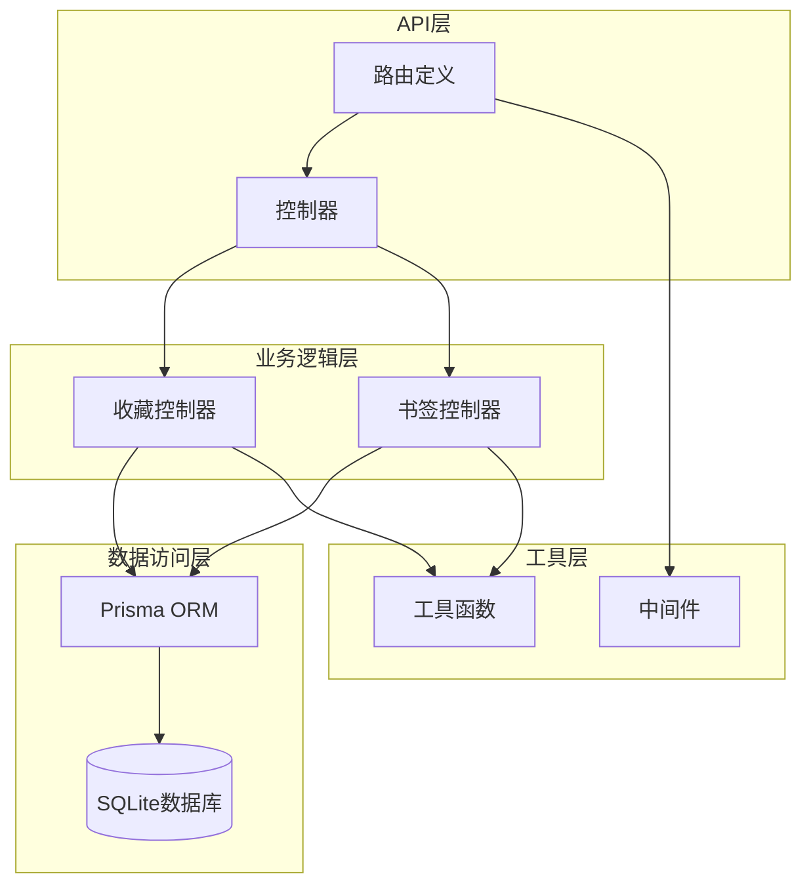
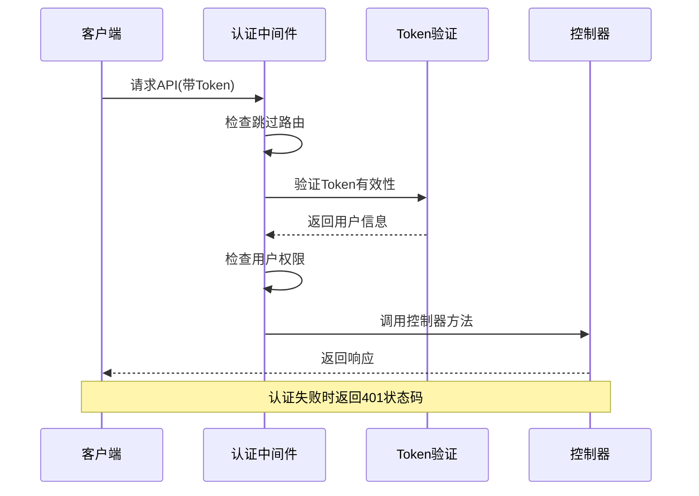
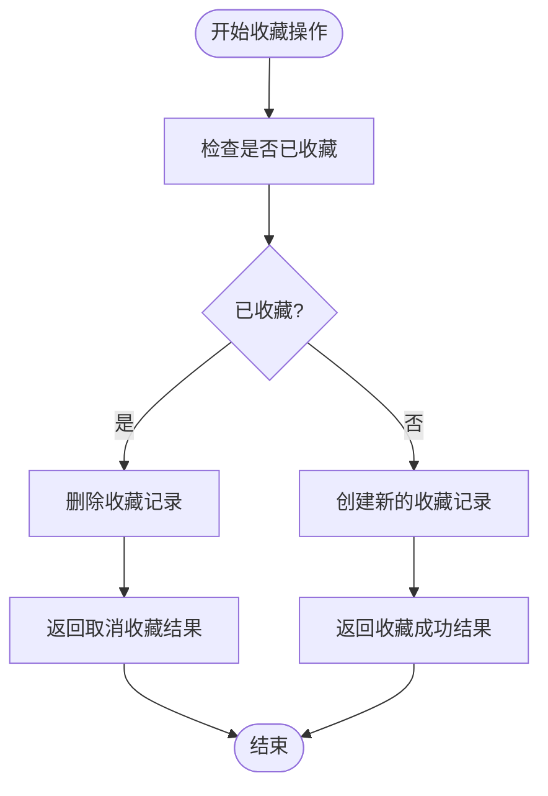
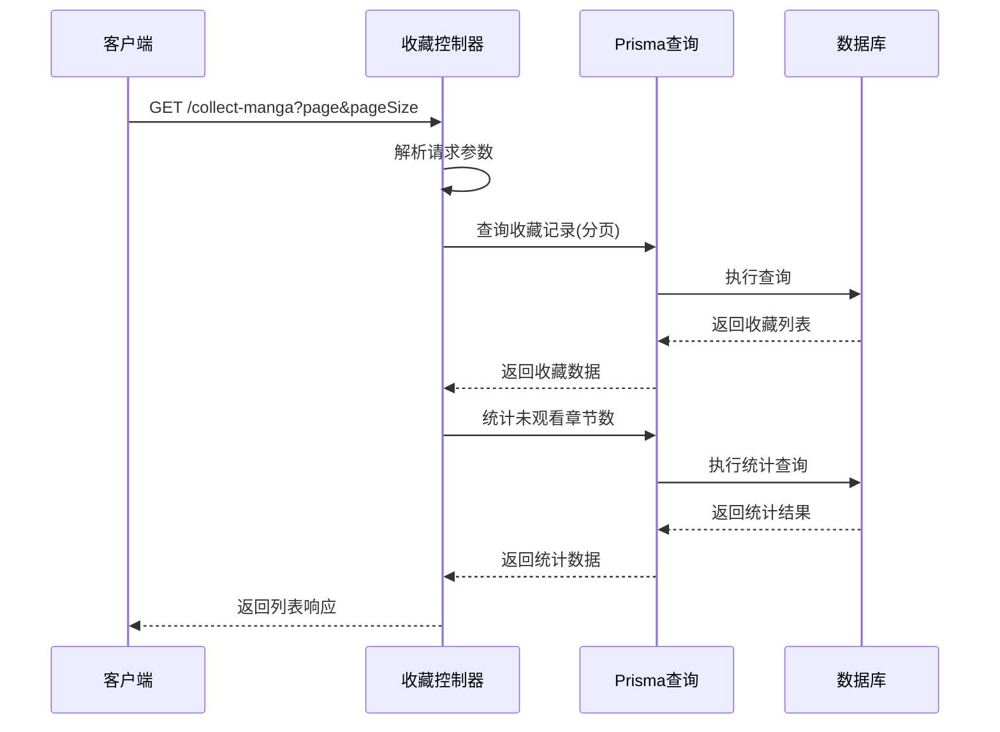
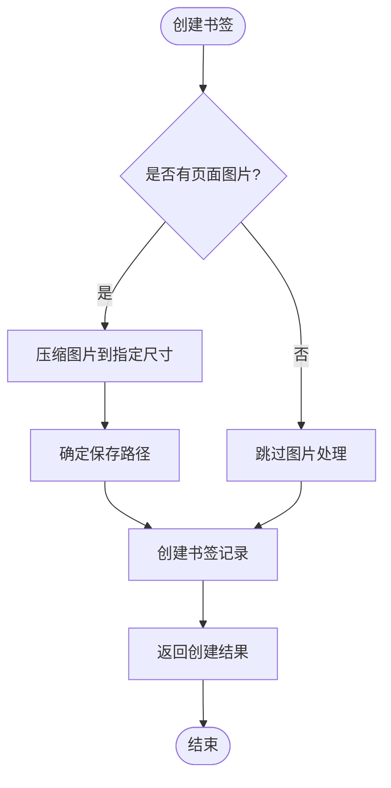
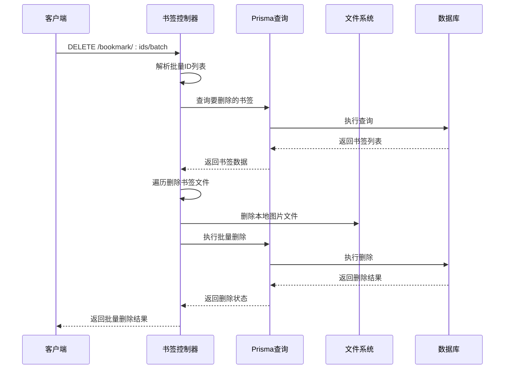
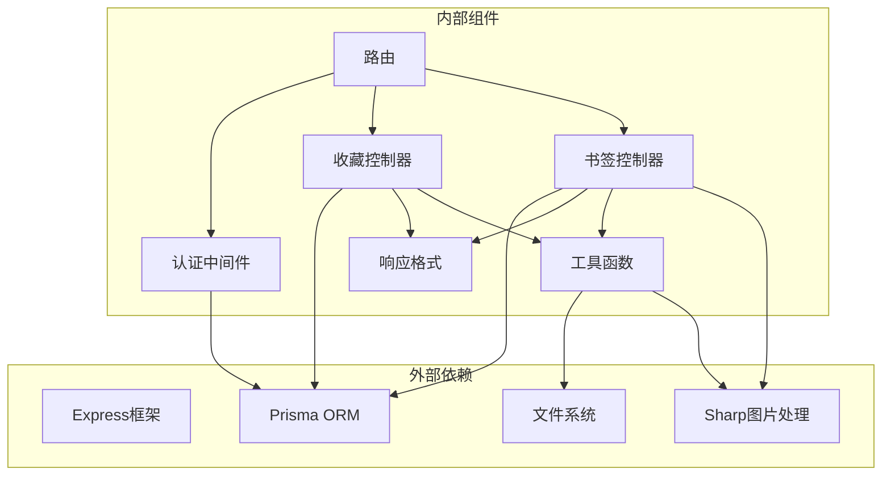
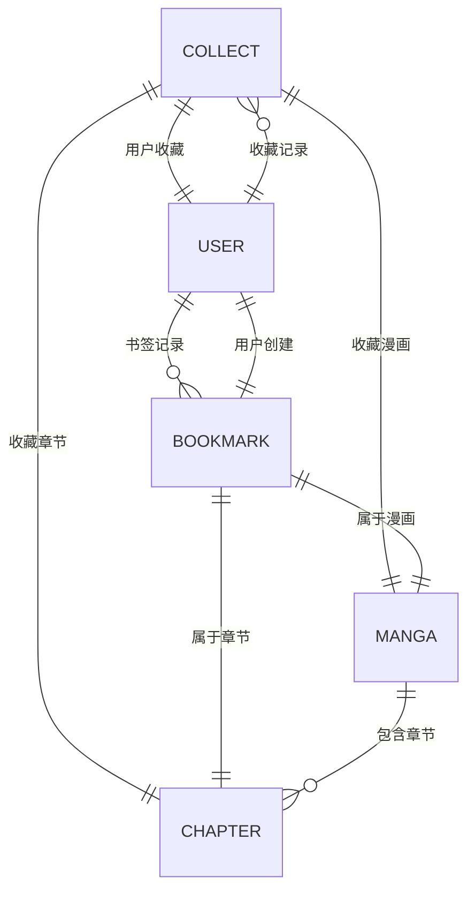

# 收藏与书签API

<cite>
**本文档引用的文件**
- [collects_controller.ts](file://app/controllers/collects_controller.ts)
- [bookmarks_controller.ts](file://app/controllers/bookmarks_controller.ts)
- [schema.prisma](file://prisma/sqlite/schema.prisma)
- [routes.ts](file://start/routes.ts)
- [response.ts](file://app/interfaces/response.ts)
- [auth_middleware.ts](file://app/middleware/auth_middleware.ts)
- [index.ts](file://app/utils/index.ts)
- [sharp.ts](file://app/utils/sharp.ts)
</cite>

## 目录
1. [简介](#简介)
2. [项目结构](#项目结构)
3. [核心组件](#核心组件)
4. [架构概览](#架构概览)
5. [详细组件分析](#详细组件分析)
6. [依赖关系分析](#依赖关系分析)
7. [性能考虑](#性能考虑)
8. [故障排除指南](#故障排除指南)
9. [结论](#结论)

## 简介

SManga Adonis 是一个基于 AdonisJS 的漫画管理系统，本文件专注于收藏与书签功能的API文档。该系统提供了完整的漫画收藏管理和章节书签功能，支持用户对漫画和章节进行收藏，并保存阅读进度书签。

主要功能包括：
- 漫画收藏：支持添加/取消漫画收藏，查询收藏列表
- 章节收藏：支持添加/取消章节收藏，查询收藏列表  
- 书签管理：支持书签的CRUD操作，批量删除，图片压缩存储
- 收藏统计：计算未观看章节数量
- 最近阅读：关联最新阅读位置
- 权限控制：基于Token的认证机制

## 项目结构

系统采用标准的MVC架构模式，收藏与书签功能由专门的控制器处理：



**图表来源**
- [routes.ts:64-84](file://start/routes.ts#L64-L84)
- [collects_controller.ts:1-281](file://app/controllers/collects_controller.ts#L1-L281)
- [bookmarks_controller.ts:1-201](file://app/controllers/bookmarks_controller.ts#L1-L201)

**章节来源**
- [routes.ts:1-241](file://start/routes.ts#L1-L241)
- [collects_controller.ts:1-281](file://app/controllers/collects_controller.ts#L1-L281)
- [bookmarks_controller.ts:1-201](file://app/controllers/bookmarks_controller.ts#L1-L201)

## 核心组件

### 数据模型关系

系统通过Prisma ORM定义了收藏和书签的核心数据模型：

```mermaid
erDiagram
USER {
int userId PK
string userName UK
string passWord
string nickName
string role
}
MANGA {
int mangaId PK
string mangaName
string mangaPath
int mediaId
int pathId
}
CHAPTER {
int chapterId PK
string chapterName
string chapterPath
int mangaId
int mediaId
int pathId
}
COLLECT {
int collectId PK
string collectType
int userId
int mediaId
int mangaId
int? chapterId
string? mangaName
string? chapterName
}
BOOKMARK {
int bookmarkId PK
int mediaId
int mangaId
int chapterId
int userId
string browseType
int page
string? pageImage
}
USER ||--o{ COLLECT : "收藏"
USER ||--o{ BOOKMARK : "创建"
MANGA ||--o{ COLLECT : "被收藏"
MANGA ||--o{ BOOKMARK : "包含"
CHAPTER ||--o{ COLLECT : "被收藏"
CHAPTER ||--o{ BOOKMARK : "包含"
```

**图表来源**
- [schema.prisma:11-74](file://prisma/sqlite/schema.prisma#L11-L74)

### 收藏类型定义

系统支持两种收藏类型：
- **manga**：漫画收藏，用于收藏整个漫画作品
- **chapter**：章节收藏，用于收藏特定章节

### 书签浏览类型

书签支持不同的浏览类型：
- **flow**：流式浏览（默认）
- **vertical**：纵向滚动
- **horizontal**：横向滚动
- **page**：分页浏览

**章节来源**
- [schema.prisma:19-23](file://prisma/sqlite/schema.prisma#L19-L23)
- [schema.prisma:60](file://prisma/sqlite/schema.prisma#L60)

## 架构概览

### API路由设计

收藏与书签API遵循RESTful设计原则，提供完整的CRUD操作：

```mermaid
graph LR
subgraph "收藏API"
C1[/collect GET<br/>获取所有收藏]
C2[/collect-manga GET<br/>漫画收藏列表]
C3[/collect-chapter GET<br/>章节收藏列表]
C4[/collect/:collectId GET<br/>获取收藏详情]
C5[/collect POST<br/>创建收藏]
C6[/collect/:collectId PUT<br/>更新收藏]
C7[/collect/:collectId DELETE<br/>删除收藏]
C8[/collect-manga/:mangaId POST<br/>收藏/取消漫画]
C9[/manga-iscollect/:mangaId GET<br/>检查漫画收藏状态]
C10[/collect-chapter/:chapterId POST<br/>收藏/取消章节]
C11[/chapter-iscollect/:chapterId GET<br/>检查章节收藏状态]
end
subgraph "书签API"
B1[/bookmark GET<br/>获取书签列表]
B2[/bookmark/:bookmarkId GET<br/>获取书签详情]
B3[/bookmark POST<br/>创建书签]
B4[/bookmark/:bookmarkId PUT<br/>更新书签]
B5[/bookmark/:bookmarkId DELETE<br/>删除书签]
B6[/bookmark/:bookmarkIds/batch DELETE<br/>批量删除书签]
end
Routes --> C1
Routes --> C2
Routes --> C3
Routes --> C4
Routes --> C5
Routes --> C6
Routes --> C7
Routes --> C8
Routes --> C9
Routes --> C10
Routes --> C11
Routes --> B1
Routes --> B2
Routes --> B3
Routes --> B4
Routes --> B5
Routes --> B6
```

**图表来源**
- [routes.ts:64-84](file://start/routes.ts#L64-L84)

### 认证与授权

系统采用Token认证机制，所有受保护的API都需要有效的认证Token：



**图表来源**
- [auth_middleware.ts:23-84](file://app/middleware/auth_middleware.ts#L23-L84)

**章节来源**
- [routes.ts:64-84](file://start/routes.ts#L64-L84)
- [auth_middleware.ts:1-87](file://app/middleware/auth_middleware.ts#L1-L87)

## 详细组件分析

### 收藏控制器分析

收藏控制器提供了完整的收藏管理功能：

#### 收藏状态切换流程



**图表来源**
- [collects_controller.ts:142-164](file://app/controllers/collects_controller.ts#L142-L164)

#### 收藏列表查询

收藏列表查询支持分页和关联数据查询：



**图表来源**
- [collects_controller.ts:17-70](file://app/controllers/collects_controller.ts#L17-L70)

**章节来源**
- [collects_controller.ts:1-281](file://app/controllers/collects_controller.ts#L1-L281)

### 书签控制器分析

书签控制器提供了灵活的书签管理功能：

#### 书签图片处理流程



**图表来源**
- [bookmarks_controller.ts:105-139](file://app/controllers/bookmarks_controller.ts#L105-L139)

#### 批量删除流程



**图表来源**
- [bookmarks_controller.ts:170-199](file://app/controllers/bookmarks_controller.ts#L170-L199)

**章节来源**
- [bookmarks_controller.ts:1-201](file://app/controllers/bookmarks_controller.ts#L1-L201)

### 数据模型详细说明

#### 收藏模型字段说明

| 字段名 | 类型 | 必填 | 描述 | 默认值 |
|--------|------|------|------|--------|
| collectId | Integer | 是 | 收藏记录ID | 自增主键 |
| collectType | String | 是 | 收藏类型(manga/chapter) | 'manga' |
| userId | Integer | 是 | 用户ID | 外键 |
| mediaId | Integer | 是 | 媒体库ID | 外键 |
| mangaId | Integer | 是 | 漫画ID | 外键 |
| chapterId | Integer | 否 | 章节ID | 外键 |
| mangaName | String | 否 | 漫画名称 | null |
| chapterName | String | 否 | 章节名称 | null |
| createTime | DateTime | 否 | 创建时间 | 当前时间 |
| updateTime | DateTime | 否 | 更新时间 | 当前时间 |

#### 书签模型字段说明

| 字段名 | 类型 | 必填 | 描述 | 默认值 |
|--------|------|------|------|--------|
| bookmarkId | Integer | 是 | 书签ID | 自增主键 |
| mediaId | Integer | 是 | 媒体库ID | 外键 |
| mangaId | Integer | 是 | 漫画ID | 外键 |
| chapterId | Integer | 是 | 章节ID | 外键 |
| userId | Integer | 是 | 用户ID | 外键 |
| browseType | String | 是 | 浏览类型 | 'flow' |
| page | Integer | 是 | 页面编号 | 无默认值 |
| pageImage | String | 否 | 页面截图路径 | null |
| createTime | DateTime | 否 | 创建时间 | 当前时间 |
| updateTime | DateTime | 否 | 更新时间 | 当前时间 |

**章节来源**
- [schema.prisma:11-74](file://prisma/sqlite/schema.prisma#L11-L74)

## 依赖关系分析

### 组件间依赖关系



**图表来源**
- [collects_controller.ts:1-5](file://app/controllers/collects_controller.ts#L1-L5)
- [bookmarks_controller.ts:1-6](file://app/controllers/bookmarks_controller.ts#L1-L6)

### 数据库约束关系

系统通过外键约束确保数据完整性：



**图表来源**
- [schema.prisma:14-17](file://prisma/sqlite/schema.prisma#L14-L17)
- [schema.prisma:64-67](file://prisma/sqlite/schema.prisma#L64-L67)

**章节来源**
- [schema.prisma:1-447](file://prisma/sqlite/schema.prisma#L1-L447)

## 性能考虑

### 查询优化策略

1. **分页查询**：收藏列表和书签列表都支持分页，避免一次性加载大量数据
2. **并发查询**：使用Promise.all并行执行查询，提高响应速度
3. **条件索引**：通过WHERE条件精确查询，减少不必要的数据扫描

### 缓存策略

系统通过以下方式优化性能：
- 使用Promise.all并行查询多个数据源
- 合理的数据库查询条件，避免全表扫描
- 图片文件的延迟加载和按需压缩

### 存储优化

1. **图片压缩**：书签图片自动压缩到指定尺寸
2. **文件清理**：删除书签时自动清理相关文件
3. **唯一约束**：防止重复收藏和书签创建

## 故障排除指南

### 常见错误及解决方案

#### 认证失败
- **症状**：返回401状态码，消息为"用户信息失效"
- **原因**：缺少Token或Token无效
- **解决**：重新登录获取有效Token

#### 权限不足
- **症状**：返回401状态码，消息为"无权限操作"
- **原因**：非管理员用户尝试访问管理功能
- **解决**：使用管理员账户或申请相应权限

#### 数据不存在
- **症状**：返回错误状态码，提示数据不存在
- **原因**：请求的收藏或书签ID不存在
- **解决**：确认ID的有效性或重新查询数据

#### 数据库约束冲突
- **症状**：创建收藏或书签时报错
- **原因**：违反唯一约束或外键约束
- **解决**：检查数据完整性，确保关联实体存在

### 调试建议

1. **启用日志**：检查服务器日志获取详细错误信息
2. **验证Token**：确认Token格式正确且未过期
3. **检查数据**：验证关联实体是否存在
4. **网络连接**：确认数据库连接正常

**章节来源**
- [auth_middleware.ts:34-54](file://app/middleware/auth_middleware.ts#L34-L54)
- [bookmarks_controller.ts:155-167](file://app/controllers/bookmarks_controller.ts#L155-L167)

## 结论

SManga Adonis的收藏与书签API提供了完整的漫画收藏管理和阅读进度跟踪功能。系统采用模块化设计，具有良好的扩展性和维护性。通过合理的数据模型设计和API接口规范，为用户提供了便捷的收藏和书签管理体验。

主要优势包括：
- 完整的CRUD操作支持
- 灵活的查询和过滤功能
- 完善的权限控制机制
- 高效的性能优化策略
- 友好的错误处理机制

未来可以考虑的功能增强：
- 收藏分类和标签管理
- 导出导入收藏功能
- 跨设备同步机制
- 更丰富的统计分析功能