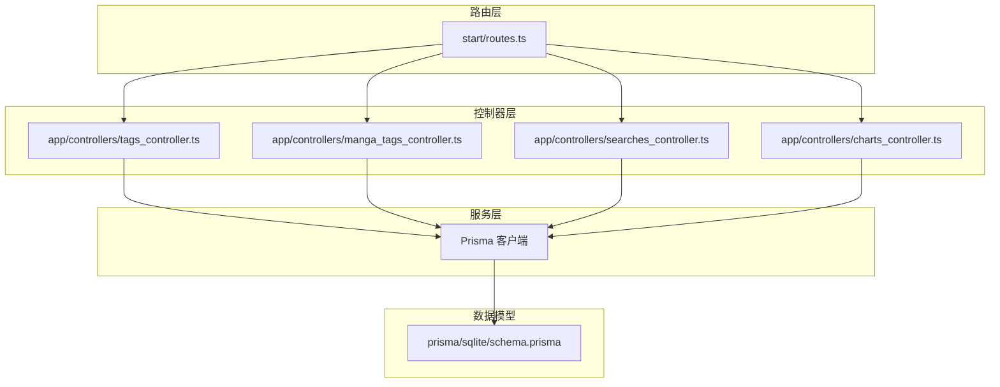
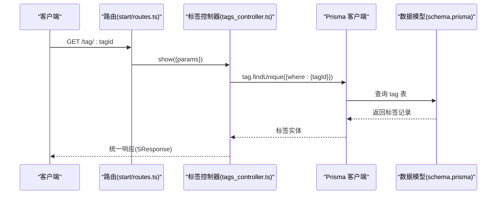
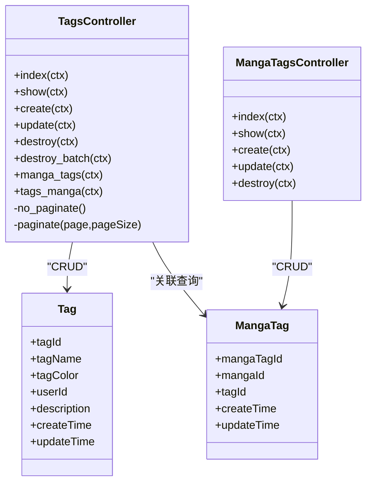
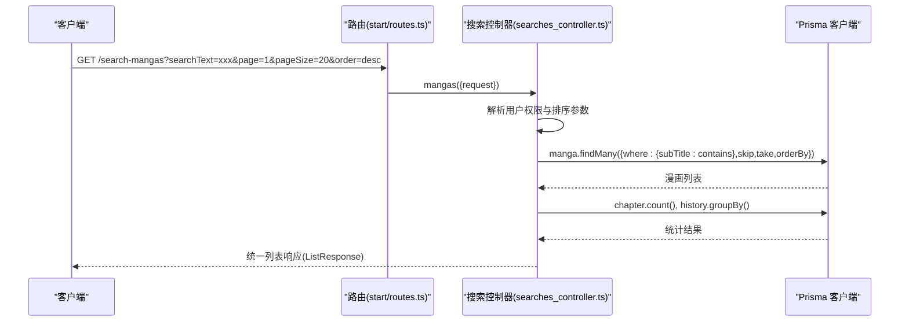
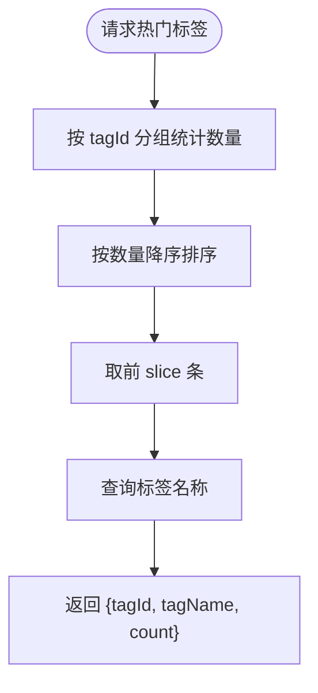
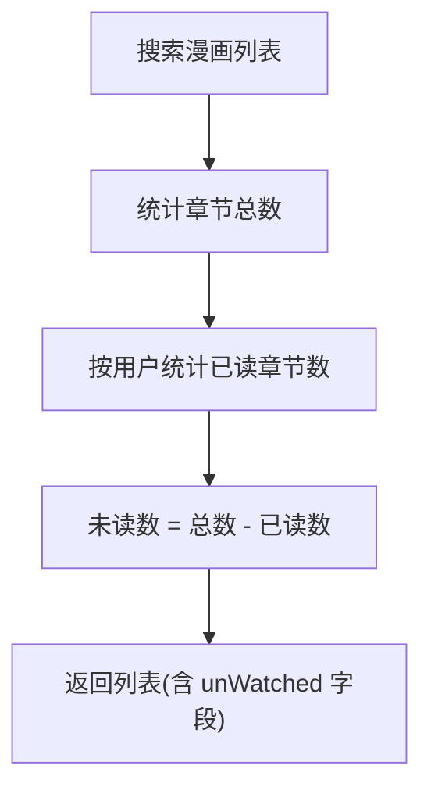
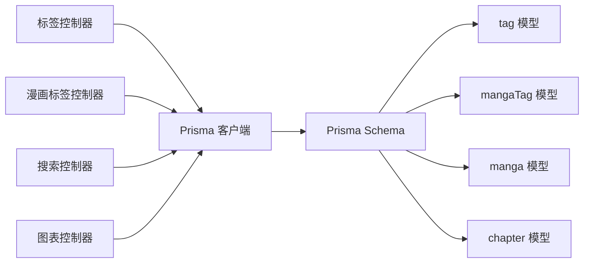

# 标签与搜索API

<cite>
**本文档引用的文件**
- [routes.ts](file://start/routes.ts)
- [tags_controller.ts](file://app/controllers/tags_controller.ts)
- [manga_tags_controller.ts](file://app/controllers/manga_tags_controller.ts)
- [searches_controller.ts](file://app/controllers/searches_controller.ts)
- [charts_controller.ts](file://app/controllers/charts_controller.ts)
- [response.ts](file://app/interfaces/response.ts)
- [index.ts](file://app/utils/index.ts)
- [schema.prisma](file://prisma/sqlite/schema.prisma)
</cite>

## 目录
1. [简介](#简介)
2. [项目结构](#项目结构)
3. [核心组件](#核心组件)
4. [架构概览](#架构概览)
5. [详细组件分析](#详细组件分析)
6. [依赖关系分析](#依赖关系分析)
7. [性能考虑](#性能考虑)
8. [故障排查指南](#故障排查指南)
9. [结论](#结论)
10. [附录](#附录)

## 简介
本文件为 SManga Adonis 项目的标签与搜索API技术文档，覆盖标签管理（CRUD、标签与漫画关联）以及搜索功能（漫画搜索、章节搜索、关键词匹配）。文档同时阐述标签系统设计理念、搜索算法与结果排序策略，并包含标签统计、热门标签、搜索历史等辅助功能的实现说明与使用示例。

## 项目结构
SManga Adonis 采用基于控制器的分层架构，路由集中定义在路由文件中，各业务模块通过控制器实现具体逻辑，数据模型由 Prisma 定义，统一通过 Prisma 客户端访问数据库。

**图表来源**
- [routes.ts:154-209](file://start/routes.ts#L154-L209)
- [tags_controller.ts:1-203](file://app/controllers/tags_controller.ts#L1-L203)
- [manga_tags_controller.ts:1-60](file://app/controllers/manga_tags_controller.ts#L1-L60)
- [searches_controller.ts:1-137](file://app/controllers/searches_controller.ts#L1-L137)
- [charts_controller.ts:1-160](file://app/controllers/charts_controller.ts#L1-L160)
- [schema.prisma:1-447](file://prisma/sqlite/schema.prisma#L1-L447)

**章节来源**
- [routes.ts:154-209](file://start/routes.ts#L154-L209)

## 核心组件
- 标签控制器：提供标签列表、详情、创建、更新、删除、批量删除、标签与漫画关联查询、标签筛选漫画等能力。
- 漫画标签控制器：提供漫画标签关系的增删改查。
- 搜索控制器：提供漫画与章节的关键词搜索，支持分页与排序。
- 图表控制器：提供热门标签统计等分析功能。
- 响应接口：统一返回格式（单对象与列表），便于前端解析。
- 工具函数：提供通用排序参数解析等工具。

**章节来源**
- [tags_controller.ts:1-203](file://app/controllers/tags_controller.ts#L1-L203)
- [manga_tags_controller.ts:1-60](file://app/controllers/manga_tags_controller.ts#L1-L60)
- [searches_controller.ts:1-137](file://app/controllers/searches_controller.ts#L1-L137)
- [charts_controller.ts:1-160](file://app/controllers/charts_controller.ts#L1-L160)
- [response.ts:1-64](file://app/interfaces/response.ts#L1-L64)
- [index.ts:117-154](file://app/utils/index.ts#L117-L154)

## 架构概览
标签与搜索API围绕以下设计原则：
- 数据一致性：通过 Prisma 关系模型保证标签与漫画的多对多关联。
- 权限控制：根据用户角色与媒体权限限制可见范围。
- 性能优化：分页查询、并发统计、索引字段命中（subTitle、deleteFlag等）。
- 可扩展性：统一响应格式、可配置排序参数、支持多种数据库客户端。

**图表来源**
- [routes.ts:156](file://start/routes.ts#L156)
- [tags_controller.ts:54-60](file://app/controllers/tags_controller.ts#L54-L60)
- [schema.prisma:299-308](file://prisma/sqlite/schema.prisma#L299-L308)

## 详细组件分析

### 标签管理接口
- 列表与分页：支持不分页全量获取与分页获取，返回统一列表响应。
- 详情查询：按 tagId 查询标签详情。
- 创建：接收 tagName、description、tagColor 等字段，自动绑定当前用户。
- 更新：按 tagId 更新指定字段。
- 删除：级联删除关联的漫画标签关系，再删除标签。
- 批量删除：按逗号分隔的 tagIds 批量删除。
- 标签与漫画关联：
  - 获取某漫画的所有标签（含中间表字段）。
  - 按标签集合筛选漫画（支持分页、权限过滤、去重）。

**图表来源**
- [tags_controller.ts:1-203](file://app/controllers/tags_controller.ts#L1-L203)
- [manga_tags_controller.ts:1-60](file://app/controllers/manga_tags_controller.ts#L1-L60)
- [schema.prisma:299-308](file://prisma/sqlite/schema.prisma#L299-L308)
- [schema.prisma:201-212](file://prisma/sqlite/schema.prisma#L201-L212)

**章节来源**
- [tags_controller.ts:6-203](file://app/controllers/tags_controller.ts#L6-L203)
- [manga_tags_controller.ts:12-60](file://app/controllers/manga_tags_controller.ts#L12-L60)

### 搜索接口
- 漫画搜索：按 subTitle 关键词模糊匹配，支持分页与排序；根据用户权限过滤媒体范围；附加未观看章节统计。
- 章节搜索：按 subTitle 关键词模糊匹配，支持分页与排序；附加最新阅读标记。
- 排序策略：通过工具函数解析 order 参数，支持按 id、number、name、createTime、updateTime 等字段升/降序。

**图表来源**
- [routes.ts:208](file://start/routes.ts#L208)
- [searches_controller.ts:14-74](file://app/controllers/searches_controller.ts#L14-L74)
- [index.ts:117-154](file://app/utils/index.ts#L117-L154)

**章节来源**
- [searches_controller.ts:14-137](file://app/controllers/searches_controller.ts#L14-L137)
- [index.ts:117-154](file://app/utils/index.ts#L117-L154)

### 标签统计与热门标签
- 热门标签：按标签被分配次数降序取前 N 个，返回标签名称与计数。
- 该功能可用于推荐、筛选与可视化展示。

**图表来源**
- [charts_controller.ts:32-73](file://app/controllers/charts_controller.ts#L32-L73)
- [schema.prisma:201-212](file://prisma/sqlite/schema.prisma#L201-L212)
- [schema.prisma:299-308](file://prisma/sqlite/schema.prisma#L299-L308)

**章节来源**
- [charts_controller.ts:32-73](file://app/controllers/charts_controller.ts#L32-L73)

### 搜索历史与未读统计
- 搜索漫画时，附加未观看章节数统计，便于用户快速了解阅读进度。
- 历史记录模块提供阅读历史的增删改查与批量标记功能，支持按用户维度统计。

**图表来源**
- [searches_controller.ts:54-65](file://app/controllers/searches_controller.ts#L54-L65)
- [schema.prisma:29-55](file://prisma/sqlite/schema.prisma#L29-L55)

**章节来源**
- [searches_controller.ts:54-65](file://app/controllers/searches_controller.ts#L54-L65)

## 依赖关系分析
- 控制器依赖 Prisma 客户端进行数据访问。
- 标签与漫画通过中间表 mangaTag 建立多对多关系。
- 搜索接口依赖 subTitle 字段进行模糊匹配，结合 deleteFlag 过滤逻辑删除状态。
- 排序参数通过工具函数 order_params 解析，支持不同模型字段映射。

**图表来源**
- [tags_controller.ts:1-203](file://app/controllers/tags_controller.ts#L1-L203)
- [manga_tags_controller.ts:1-60](file://app/controllers/manga_tags_controller.ts#L1-L60)
- [searches_controller.ts:1-137](file://app/controllers/searches_controller.ts#L1-L137)
- [charts_controller.ts:1-160](file://app/controllers/charts_controller.ts#L1-L160)
- [schema.prisma:163-198](file://prisma/sqlite/schema.prisma#L163-L198)
- [schema.prisma:201-212](file://prisma/sqlite/schema.prisma#L201-L212)
- [schema.prisma:299-308](file://prisma/sqlite/schema.prisma#L299-L308)

**章节来源**
- [schema.prisma:163-198](file://prisma/sqlite/schema.prisma#L163-L198)
- [schema.prisma:201-212](file://prisma/sqlite/schema.prisma#L201-L212)
- [schema.prisma:299-308](file://prisma/sqlite/schema.prisma#L299-L308)

## 性能考虑
- 分页与并发：列表查询使用 Promise 并发执行数据与计数，减少往返时间。
- 索引与过滤：subTitle 字段用于模糊匹配，deleteFlag 用于过滤逻辑删除，建议在数据库层面建立合适索引以提升查询效率。
- 排序参数：order_params 支持多种字段映射，避免硬编码排序逻辑，便于扩展。
- 权限过滤：在查询阶段即按用户媒体权限过滤，减少无效数据传输。

[本节为通用性能建议，不直接分析具体文件]

## 故障排查指南
- 认证失败：当用户不存在或令牌无效时，控制器返回统一错误响应，检查用户登录状态与令牌有效性。
- 权限不足：管理员或媒体全权限用户可查看全部资源，普通用户仅能看到其媒体权限范围内的数据。
- 关键字为空：搜索接口要求 searchText 存在，否则返回错误提示。
- 数据不存在：删除标签或漫画标签时若 ID 不存在，Prisma 将抛出异常，需先确认 ID 是否正确。

**章节来源**
- [tags_controller.ts:150-154](file://app/controllers/tags_controller.ts#L150-L154)
- [searches_controller.ts:25-29](file://app/controllers/searches_controller.ts#L25-L29)
- [searches_controller.ts:140-142](file://app/controllers/searches_controller.ts#L140-L142)

## 结论
SManga Adonis 的标签与搜索API通过清晰的控制器职责划分、统一的响应格式与完善的权限控制，实现了标签管理与搜索功能的完整闭环。配合热门标签统计与未读统计，能够为用户提供高效、直观的内容发现体验。后续可在数据库索引、缓存策略与更丰富的搜索算法上进一步优化。

[本节为总结性内容，不直接分析具体文件]

## 附录

### API 定义与使用示例

- 标签管理
  - 获取标签列表：GET /tag?page=1&pageSize=20&order=desc
  - 获取标签详情：GET /tag/:tagId
  - 新增标签：POST /tag（body：tagName, description, tagColor）
  - 更新标签：PUT /tag/:tagId（body：tagName, description, tagColor）
  - 删除标签：DELETE /tag/:tagId
  - 批量删除：DELETE /tag/:tagIds/batch（tagIds: 逗号分隔）
  - 获取漫画标签：GET /manga-tag/:mangaId
  - 按标签筛选漫画：GET /tags-manga?tagIds=1,2,3&page=1&pageSize=20

- 漫画标签关系
  - 新增关系：POST /manga-tag（body：mangaId, tagId）
  - 删除关系：DELETE /manga-tag/:mangaTagId

- 搜索
  - 搜索漫画：GET /search-mangas?searchText=xxx&page=1&pageSize=20&order=desc
  - 搜索章节：GET /search-chapters?searchText=xxx&page=1&pageSize=20&order=desc

- 统计
  - 热门标签：GET /chart-tag?slice=5

**章节来源**
- [routes.ts:154-209](file://start/routes.ts#L154-L209)
- [tags_controller.ts:6-203](file://app/controllers/tags_controller.ts#L6-L203)
- [manga_tags_controller.ts:12-60](file://app/controllers/manga_tags_controller.ts#L12-L60)
- [searches_controller.ts:14-137](file://app/controllers/searches_controller.ts#L14-L137)
- [charts_controller.ts:32-73](file://app/controllers/charts_controller.ts#L32-L73)

### 数据模型要点
- tag：标签主表，包含标签名称、颜色、描述与创建/更新时间。
- mangaTag：标签与漫画的中间表，唯一约束为 (mangaId, tagId)。
- manga/chapter：搜索与统计依赖的关键实体，subTitle 用于关键词匹配，deleteFlag 用于逻辑删除。

**章节来源**
- [schema.prisma:299-308](file://prisma/sqlite/schema.prisma#L299-L308)
- [schema.prisma:201-212](file://prisma/sqlite/schema.prisma#L201-L212)
- [schema.prisma:163-198](file://prisma/sqlite/schema.prisma#L163-L198)
- [schema.prisma:29-55](file://prisma/sqlite/schema.prisma#L29-L55)