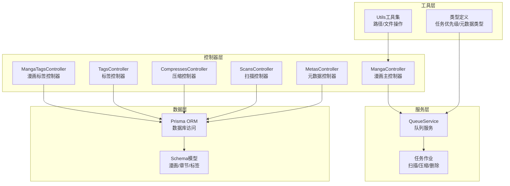
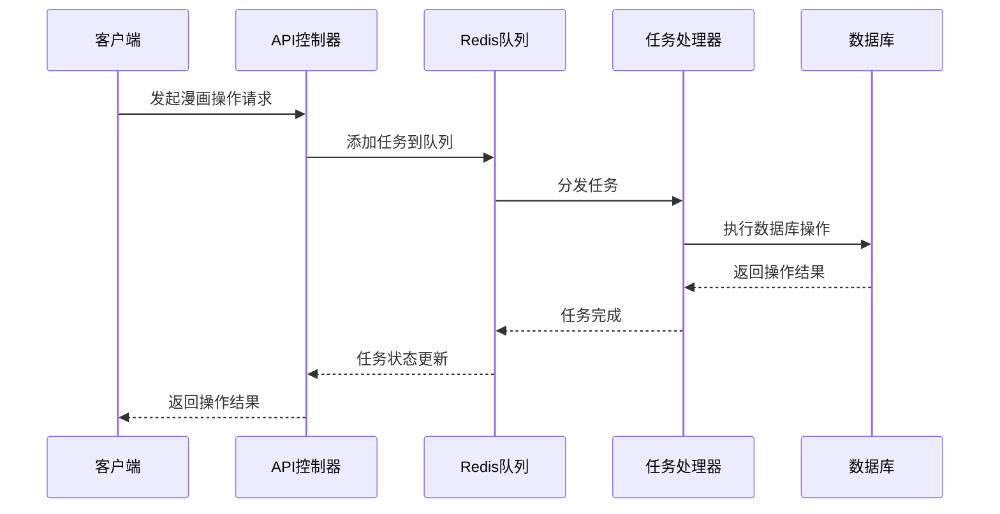
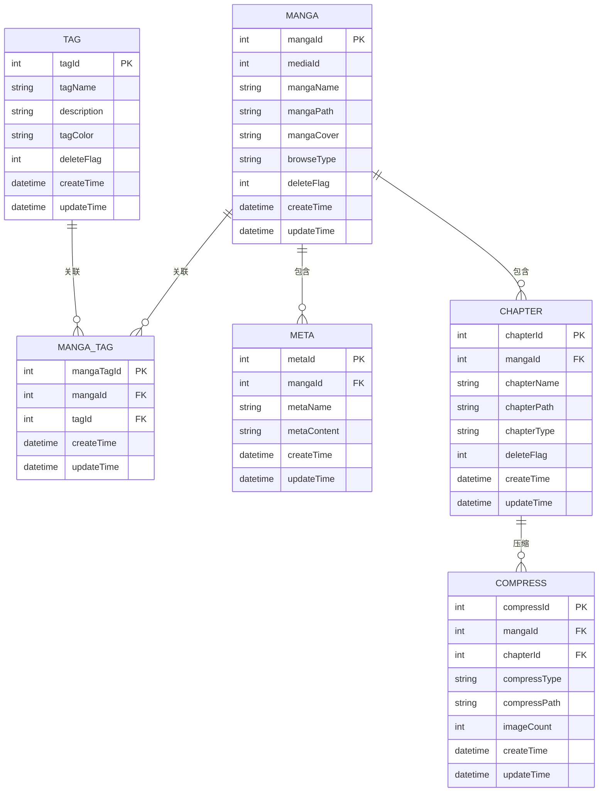
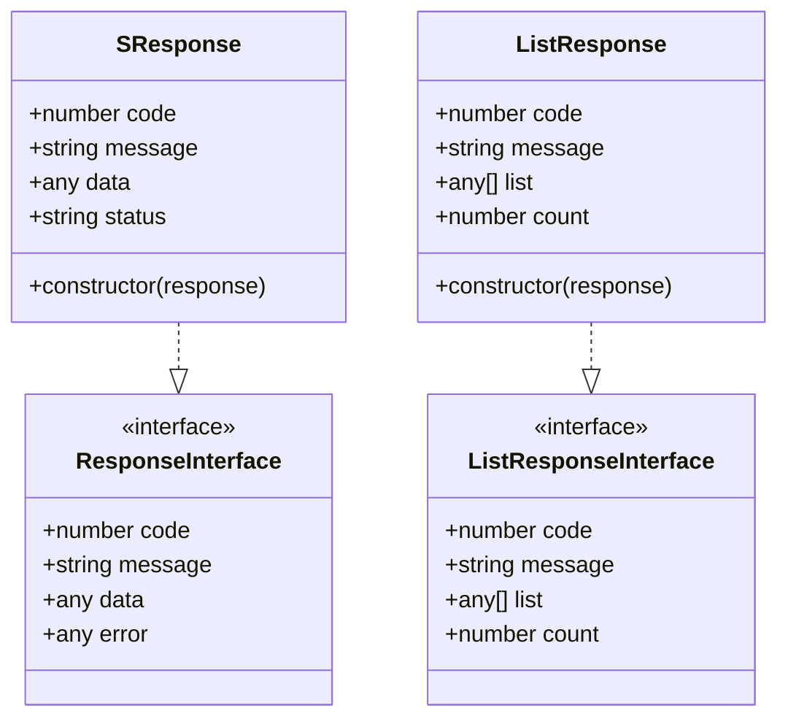
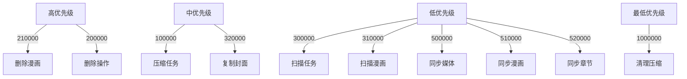
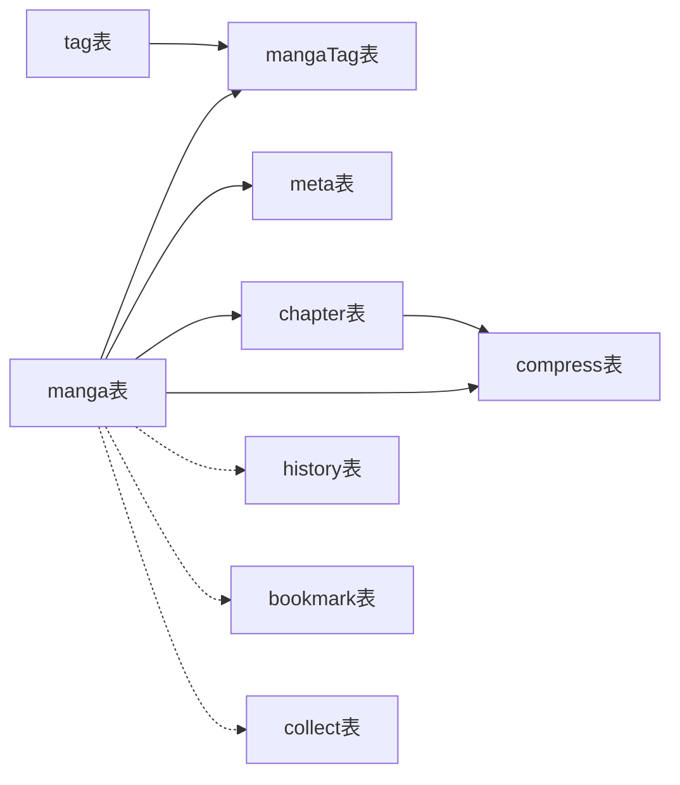

# 漫画管理API

<cite>
**本文档引用的文件**
- [manga_controller.ts](file://app/controllers/manga_controller.ts)
- [manga_tags_controller.ts](file://app/controllers/manga_tags_controller.ts)
- [tags_controller.ts](file://app/controllers/tags_controller.ts)
- [routes.ts](file://start/routes.ts)
- [response.ts](file://app/interfaces/response.ts)
- [queue_service.ts](file://app/services/queue_service.ts)
- [index.ts](file://app/utils/index.ts)
- [index.ts](file://app/type/index.ts)
- [metas_controller.ts](file://app/controllers/metas_controller.ts)
- [compresses_controller.ts](file://app/controllers/compresses_controller.ts)
- [scans_controller.ts](file://app/controllers/scans_controller.ts)
- [schema.prisma](file://prisma/sqlite/schema.prisma)
</cite>

## 目录
1. [简介](#简介)
2. [项目结构](#项目结构)
3. [核心组件](#核心组件)
4. [架构概览](#架构概览)
5. [详细组件分析](#详细组件分析)
6. [依赖关系分析](#依赖关系分析)
7. [性能考虑](#性能考虑)
8. [故障排除指南](#故障排除指南)
9. [结论](#结论)

## 简介

SManga Adonis 是一个基于 Node.js 和 AdonisJS 框架构建的漫画管理系统。本API文档专注于漫画管理功能，涵盖漫画CRUD操作、标签关联、元数据编辑、批量操作、扫描更新等核心功能。系统采用分层架构设计，通过队列服务实现异步任务处理，支持漫画扫描、压缩、删除等耗时操作。

## 项目结构

系统采用典型的 MVC 架构模式，主要文件组织如下：

**图表来源**
- [manga_controller.ts:12-460](file://app/controllers/manga_controller.ts#L12-L460)
- [routes.ts:169-182](file://start/routes.ts#L169-L182)
- [queue_service.ts:1-267](file://app/services/queue_service.ts#L1-L267)

**章节来源**
- [routes.ts:1-241](file://start/routes.ts#L1-L241)
- [manga_controller.ts:1-460](file://app/controllers/manga_controller.ts#L1-L460)

## 核心组件

### 漫画主控制器 (MangaController)

漫画主控制器是漫画管理的核心，提供完整的CRUD操作和高级功能：

- **基础CRUD操作**：创建、读取、更新、删除漫画
- **查询功能**：支持分页查询、关键字搜索、排序
- **标签管理**：漫画与标签的关联和管理
- **元数据编辑**：标题、作者、描述等元数据维护
- **扫描功能**：漫画文件系统的扫描和更新
- **压缩管理**：漫画章节的压缩和清理
- **批量操作**：支持批量删除等批量处理

### 标签管理控制器

系统提供两级标签管理：
- **标签控制器**：管理标签的增删改查
- **漫画标签控制器**：管理漫画与标签的多对多关系

### 压缩控制器

专门处理漫画压缩相关的功能：
- 压缩记录的增删改查
- 批量压缩清理
- 压缩缓存管理

**章节来源**
- [manga_controller.ts:12-460](file://app/controllers/manga_controller.ts#L12-L460)
- [tags_controller.ts:1-203](file://app/controllers/tags_controller.ts#L1-L203)
- [manga_tags_controller.ts:1-60](file://app/controllers/manga_tags_controller.ts#L1-L60)
- [compresses_controller.ts:1-147](file://app/controllers/compresses_controller.ts#L1-L147)

## 架构概览

系统采用事件驱动的异步架构，通过Redis队列实现任务调度：

**图表来源**
- [queue_service.ts:34-141](file://app/services/queue_service.ts#L34-L141)
- [manga_controller.ts:178-184](file://app/controllers/manga_controller.ts#L178-L184)

### 数据模型关系

**图表来源**
- [schema.prisma:177-216](file://prisma/sqlite/schema.prisma#L177-L216)

## 详细组件分析

### 漫画CRUD操作

#### 基础查询接口

**GET /manga**
- **功能**：获取漫画列表
- **参数**：
  - `mediaId`：媒体库ID（可选）
  - `page`：页码（可选）
  - `pageSize`：每页数量（可选）
  - `keyWord`：搜索关键词（可选）
  - `order`：排序方式（可选）
- **响应**：分页漫画列表，包含未观看章节统计

**GET /manga/:mangaId**
- **功能**：获取漫画详情
- **响应**：漫画详细信息，包含元数据和标签

#### 创建和更新操作

**POST /manga**
- **功能**：创建新漫画
- **请求体**：漫画基本信息
- **响应**：创建成功的漫画信息

**PUT /manga/:mangaId**
- **功能**：更新漫画信息
- **请求体**：可更新字段包括名称、路径、封面、浏览类型等

#### 删除操作

**DELETE /manga/:mangaId**
- **功能**：软删除漫画
- **行为**：标记删除标志，异步执行物理删除

**DELETE /manga/:mangaIds/batch**
- **功能**：批量删除漫画
- **参数**：多个漫画ID组成的数组

**章节来源**
- [manga_controller.ts:13-115](file://app/controllers/manga_controller.ts#L13-L115)
- [manga_controller.ts:147-188](file://app/controllers/manga_controller.ts#L147-L188)

### 标签关联管理

#### 标签基本操作

**GET /tag**
- **功能**：获取标签列表
- **参数**：分页参数

**GET /tag/:tagId**
- **功能**：获取单个标签

**POST /tag**
- **功能**：创建新标签

**PUT /tag/:tagId**
- **功能**：更新标签信息

**DELETE /tag/:tagId**
- **功能**：删除标签（级联删除关联）

**DELETE /tag/:tagIds/batch**
- **功能**：批量删除标签

#### 漫画标签关联

**GET /manga-tag/:mangaId**
- **功能**：获取漫画的所有标签
- **响应**：标签列表，包含关联ID

**POST /manga-tag**
- **功能**：建立漫画与标签的关联

**DELETE /manga-tag/:mangaTagId**
- **功能**：删除漫画标签关联

**章节来源**
- [tags_controller.ts:6-203](file://app/controllers/tags_controller.ts#L6-L203)
- [manga_tags_controller.ts:12-60](file://app/controllers/manga_tags_controller.ts#L12-L60)

### 元数据编辑功能

#### 元数据管理

**GET /meta**
- **功能**：获取元数据列表

**GET /meta/:metaId**
- **功能**：获取单个元数据项

**POST /meta**
- **功能**：创建元数据

**PUT /meta/:metaId**
- **功能**：更新元数据

**DELETE /meta/:metaId**
- **功能**：删除元数据

#### 漫画元数据编辑

**PUT /manga/:mangaId/meta**
- **功能**：批量编辑漫画元数据
- **支持字段**：标题、作者、发布日期、封面、评分、描述、标签
- **参数**：`wirteMetaJson` 控制是否同时写入本地JSON文件

**PUT /manga/:mangaId/reload-meta**
- **功能**：重新加载漫画元数据
- **行为**：从文件系统重新解析元数据

**章节来源**
- [metas_controller.ts:13-61](file://app/controllers/metas_controller.ts#L13-L61)
- [manga_controller.ts:261-348](file://app/controllers/manga_controller.ts#L261-L348)

### 高级功能接口

#### 扫描更新功能

**PUT /manga/:mangaId/scan**
- **功能**：扫描指定漫画
- **行为**：异步扫描漫画文件夹，更新章节信息
- **队列**：`taskScanManga` 任务

#### 压缩处理功能

**PUT /manga/:mangaId/compress**
- **功能**：压缩漫画所有未压缩章节
- **行为**：为每个未压缩章节创建压缩任务
- **队列**：`compressChapter` 任务

**DELETE /manga/:mangaId/compress**
- **功能**：删除漫画所有压缩记录和文件
- **行为**：清理压缩缓存

#### 批量操作

**DELETE /manga/:mangaIds/batch**
- **功能**：批量删除多个漫画
- **参数**：`:mangaIds` 为逗号分隔的ID列表

**DELETE /compress/:compressIds/batch**
- **功能**：批量删除压缩记录
- **参数**：`:compressIds` 为逗号分隔的ID列表

**章节来源**
- [manga_controller.ts:217-259](file://app/controllers/manga_controller.ts#L217-L259)
- [manga_controller.ts:396-458](file://app/controllers/manga_controller.ts#L396-L458)
- [compresses_controller.ts:108-135](file://app/controllers/compresses_controller.ts#L108-L135)

### 请求响应格式

系统采用统一的响应格式：

**图表来源**
- [response.ts:5-64](file://app/interfaces/response.ts#L5-L64)

响应格式示例：
- **成功响应**：`{ code: 0, message: "", data: {} }`
- **失败响应**：`{ code: 1, message: "错误信息", data: null }`
- **列表响应**：`{ code: 0, message: "", list: [], count: 0 }`

**章节来源**
- [response.ts:1-64](file://app/interfaces/response.ts#L1-L64)

## 依赖关系分析

### 任务优先级体系

系统定义了完整的任务优先级体系，确保重要任务优先执行：

**图表来源**
- [index.ts:3-16](file://app/type/index.ts#L3-L16)

### 数据库依赖关系

**图表来源**
- [schema.prisma:177-216](file://prisma/sqlite/schema.prisma#L177-L216)

**章节来源**
- [queue_service.ts:1-267](file://app/services/queue_service.ts#L1-L267)
- [index.ts:1-49](file://app/type/index.ts#L1-L49)

## 性能考虑

### 查询优化策略

1. **分页查询**：默认使用分页机制，避免一次性加载大量数据
2. **条件查询**：支持按媒体库、关键词等条件过滤
3. **排序优化**：支持多种排序字段，包括ID、名称、数字、时间等
4. **预加载关联**：使用`include`预加载必要关联数据

### 异步处理优势

1. **非阻塞操作**：耗时操作通过队列异步执行
2. **任务去重**：检查相同任务是否已在执行中
3. **重试机制**：支持指数退避重试策略
4. **并发控制**：可配置的任务并发数

### 缓存策略

1. **压缩缓存**：章节压缩文件缓存
2. **元数据缓存**：本地JSON文件缓存
3. **配置缓存**：运行时配置缓存

## 故障排除指南

### 常见问题及解决方案

#### 权限问题
- **症状**：返回401错误
- **原因**：用户无权限访问目标漫画
- **解决**：检查用户媒体权限配置

#### 任务执行失败
- **症状**：扫描/压缩任务失败
- **原因**：文件系统权限不足或磁盘空间不足
- **解决**：检查Redis连接和磁盘空间

#### 数据库连接问题
- **症状**：CRUD操作失败
- **原因**：数据库连接异常
- **解决**：检查数据库配置和连接状态

#### 文件操作异常
- **症状**：压缩/删除操作失败
- **原因**：文件权限或路径错误
- **解决**：检查文件系统权限和路径配置

**章节来源**
- [manga_controller.ts:23-45](file://app/controllers/manga_controller.ts#L23-L45)
- [queue_service.ts:41-47](file://app/services/queue_service.ts#L41-L47)

## 结论

SManga Adonis的漫画管理API提供了完整而强大的漫画管理系统功能。通过清晰的分层架构、统一的响应格式、完善的权限控制和异步任务处理机制，系统能够高效地管理大规模漫画资源。

主要特性包括：
- **完整的CRUD操作**：支持漫画的全生命周期管理
- **灵活的查询机制**：支持多种查询条件和排序方式
- **强大的标签系统**：支持漫画与标签的多对多关联
- **异步任务处理**：通过队列实现扫描、压缩等耗时操作
- **统一的响应格式**：便于前端集成和错误处理
- **完善的权限控制**：基于媒体库的细粒度权限管理

该API设计充分考虑了性能和可扩展性，适合构建企业级的漫画管理平台。