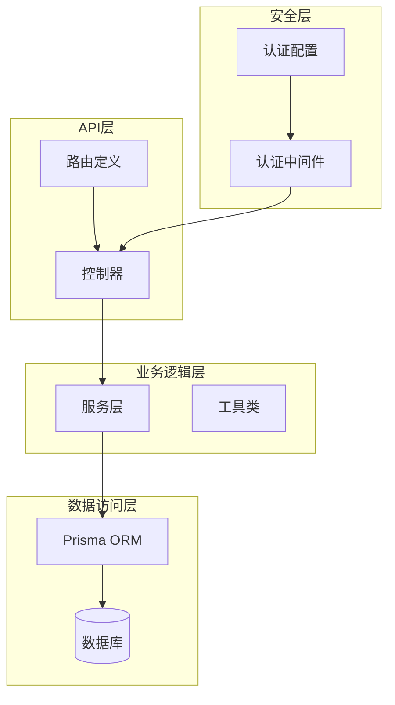
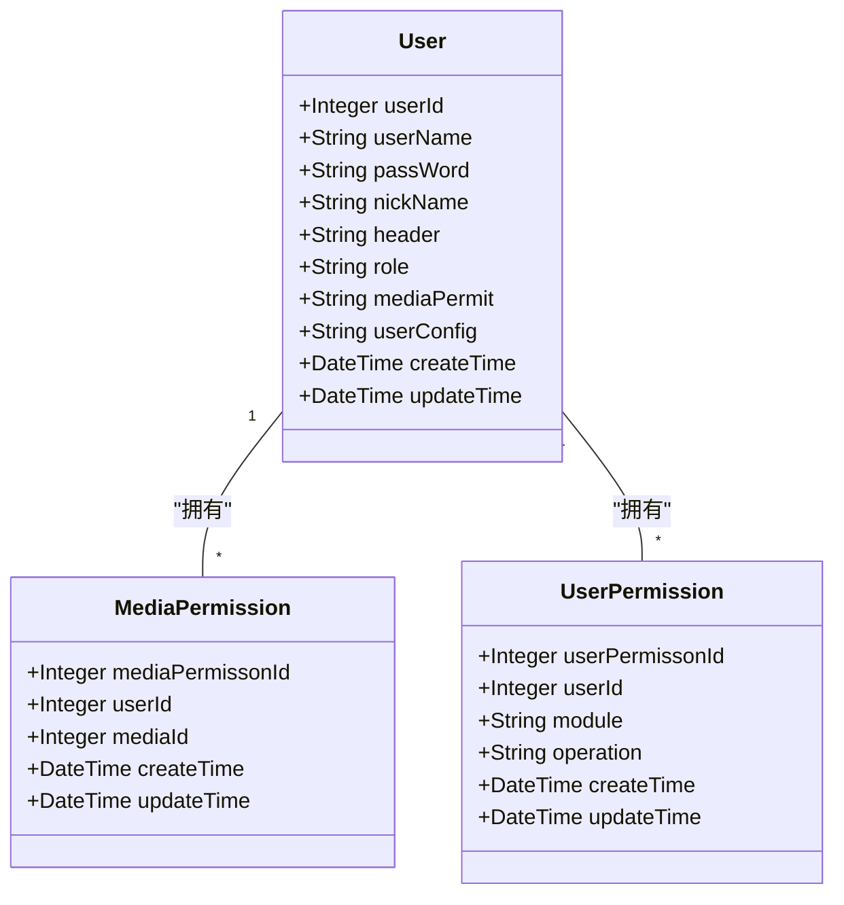
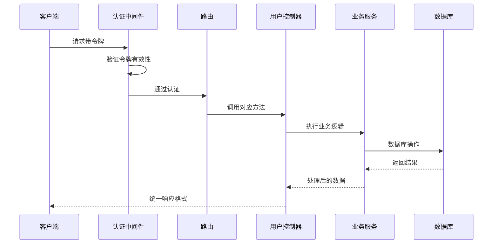
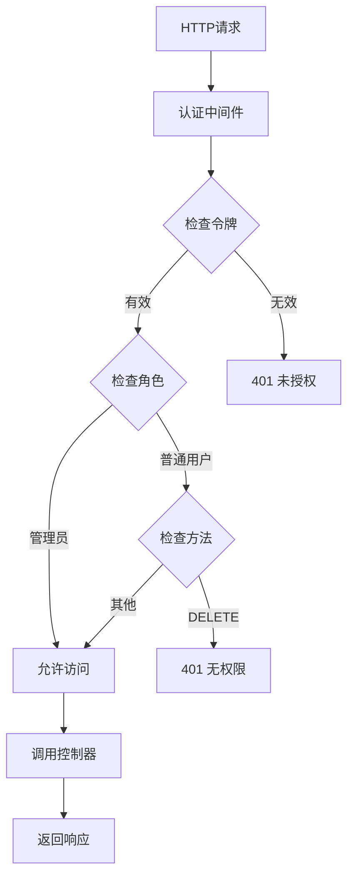
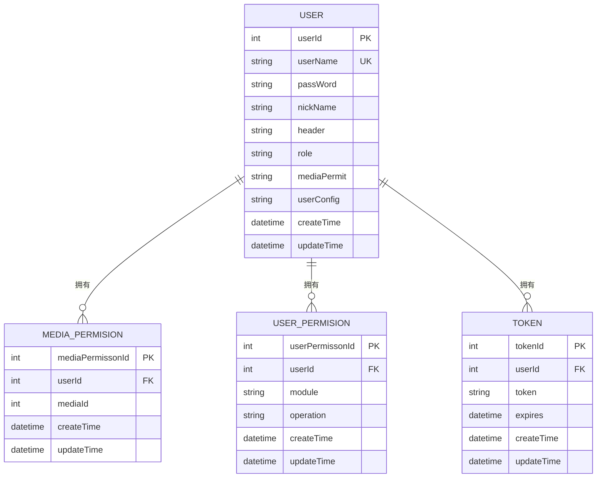

# 用户管理API

<cite>
**本文档引用的文件**
- [users_controller.ts](file://app/controllers/users_controller.ts)
- [user_permissons_controller.ts](file://app/controllers/user_permissons_controller.ts)
- [routes.ts](file://start/routes.ts)
- [response.ts](file://app/interfaces/response.ts)
- [index.ts](file://app/utils/index.ts)
- [auth_middleware.ts](file://app/middleware/auth_middleware.ts)
- [auth.ts](file://config/auth.ts)
- [schema.prisma](file://prisma/sqlite/schema.prisma)
- [login_controller.ts](file://app/controllers/login_controller.ts)
- [configs_controller.ts](file://app/controllers/configs_controller.ts)
</cite>

## 目录
1. [简介](#简介)
2. [项目结构](#项目结构)
3. [核心组件](#核心组件)
4. [架构概览](#架构概览)
5. [详细组件分析](#详细组件分析)
6. [依赖关系分析](#依赖关系分析)
7. [性能考虑](#性能考虑)
8. [故障排除指南](#故障排除指南)
9. [结论](#结论)

## 简介

SManga Adonis 是一个基于 AdonisJS 和 Prisma 的漫画管理系统，用户管理API提供了完整的用户CRUD操作功能。本文档详细介绍了用户管理的所有接口，包括用户注册、信息修改、权限设置、列表查询、单个用户详情、批量操作等核心功能。

系统采用RESTful API设计，使用统一的响应格式，支持用户权限控制和媒体库访问限制。通过令牌认证机制确保API的安全性，管理员用户拥有完整的操作权限。

## 项目结构

SManga Adonis 采用典型的分层架构设计，用户管理功能主要分布在以下层次：



**图表来源**
- [routes.ts:194-200](file://start/routes.ts#L194-L200)
- [users_controller.ts:1-160](file://app/controllers/users_controller.ts#L1-L160)
- [auth_middleware.ts:1-87](file://app/middleware/auth_middleware.ts#L1-L87)

**章节来源**
- [routes.ts:194-200](file://start/routes.ts#L194-L200)
- [users_controller.ts:1-160](file://app/controllers/users_controller.ts#L1-L160)

## 核心组件

### 用户模型定义

系统中的用户模型定义如下：

| 字段名 | 类型 | 描述 | 默认值 |
|--------|------|------|--------|
| userId | Integer | 用户唯一标识符 | 自动递增 |
| userName | String | 用户名 | 必填，唯一约束 |
| passWord | String | 密码（MD5加密） | 必填 |
| nickName | String | 昵称 | 可选 |
| header | String | 头像URL | 可选 |
| role | String | 用户角色 | 'user' |
| mediaPermit | String | 媒体访问权限 | 'limit' |
| userConfig | String/JSON | 用户配置信息 | 可选 |
| createTime | DateTime | 创建时间 | 自动设置 |
| updateTime | DateTime | 更新时间 | 自动更新 |

### 权限模型

系统支持两种权限类型：

1. **角色权限**：基于用户角色的全局权限控制
2. **媒体权限**：基于媒体库的细粒度访问控制



**图表来源**
- [schema.prisma:368-386](file://prisma/sqlite/schema.prisma#L368-L386)
- [schema.prisma:389-400](file://prisma/sqlite/schema.prisma#L389-L400)

**章节来源**
- [schema.prisma:368-400](file://prisma/sqlite/schema.prisma#L368-L400)

## 架构概览

用户管理API采用分层架构设计，确保了良好的可维护性和扩展性：



**图表来源**
- [auth_middleware.ts:23-84](file://app/middleware/auth_middleware.ts#L23-L84)
- [routes.ts:194-200](file://start/routes.ts#L194-L200)
- [users_controller.ts:8-160](file://app/controllers/users_controller.ts#L8-L160)

## 详细组件分析

### 用户CRUD操作接口

#### 用户列表查询

**接口定义**
- 方法：GET
- 路径：`/user`
- 认证：需要管理员权限

**请求参数**

| 参数名 | 类型 | 必需 | 描述 | 示例 |
|--------|------|------|------|------|
| page | Integer | 否 | 页码，默认1 | 1 |
| pageSize | Integer | 否 | 每页数量，默认10 | 10 |
| order | String | 否 | 排序方式 | asc/desc |

**响应格式**
```json
{
  "code": 0,
  "message": "",
  "list": [
    {
      "userId": 1,
      "userName": "admin",
      "nickName": "管理员",
      "header": "",
      "role": "admin",
      "mediaPermit": "limit",
      "mediaPermissons": [1, 2, 3],
      "createTime": "2024-01-01T00:00:00Z",
      "updateTime": "2024-01-01T00:00:00Z"
    }
  ],
  "count": 1
}
```

**错误处理**
- 401 未授权：非管理员用户访问
- 500 服务器错误：数据库查询异常

#### 单个用户详情

**接口定义**
- 方法：GET
- 路径：`/user/{userId}`
- 认证：需要管理员权限

**路径参数**

| 参数名 | 类型 | 必需 | 描述 |
|--------|------|------|------|
| userId | Integer | 是 | 用户唯一标识符 |

**响应格式**
```json
{
  "code": 0,
  "message": "",
  "data": {
    "userId": 1,
    "userName": "admin",
    "nickName": "管理员",
    "header": "",
    "role": "admin",
    "mediaPermit": "limit",
    "mediaPermissons": [1, 2, 3],
    "userConfig": "{}",
    "createTime": "2024-01-01T00:00:00Z",
    "updateTime": "2024-01-01T00:00:00Z"
  }
}
```

#### 用户注册

**接口定义**
- 方法：POST
- 路径：`/user`
- 认证：需要管理员权限

**请求体参数**

| 参数名 | 类型 | 必需 | 描述 | 示例 |
|--------|------|------|------|------|
| userName | String | 是 | 用户名 | admin |
| passWord | String | 是 | 密码 | password |
| role | String | 否 | 用户角色 | user/admin |
| mediaPermit | String | 否 | 媒体访问权限 | limit/all |
| mediaLimit | Array | 否 | 媒体权限列表 | [{"mediaId": 1, "permit": true}] |

**响应格式**
```json
{
  "code": 0,
  "message": "新增成功",
  "data": {
    "userId": 1,
    "userName": "admin",
    "passWord": "md5_hash",
    "role": "admin",
    "mediaPermit": "limit",
    "createTime": "2024-01-01T00:00:00Z",
    "updateTime": "2024-01-01T00:00:00Z"
  }
}
```

#### 用户信息修改

**接口定义**
- 方法：PUT
- 路径：`/user/{userId}`
- 认证：需要管理员权限

**请求体参数**

| 参数名 | 类型 | 必需 | 描述 | 示例 |
|--------|------|------|------|------|
| userName | String | 否 | 用户名 | admin |
| passWord | String | 否 | 密码 | new_password |
| userConfig | String/Object | 否 | 用户配置 | {} |
| role | String | 否 | 用户角色 | user/admin |
| mediaPermit | String | 否 | 媒体访问权限 | limit/all |
| mediaLimit | Array | 否 | 媒体权限列表 | [{"mediaId": 1, "permit": true}] |

**响应格式**
```json
{
  "code": 0,
  "message": "更新成功",
  "data": {
    "userId": 1,
    "userName": "admin",
    "nickName": "管理员",
    "header": "",
    "role": "admin",
    "mediaPermit": "limit",
    "mediaPermissons": [1, 2, 3],
    "userConfig": "{}",
    "createTime": "2024-01-01T00:00:00Z",
    "updateTime": "2024-01-01T00:00:00Z"
  }
}
```

#### 用户删除

**接口定义**
- 方法：DELETE
- 路径：`/user/{userId}`
- 认证：需要管理员权限

**响应格式**
```json
{
  "code": 0,
  "message": "删除成功",
  "data": {
    "userId": 1,
    "userName": "admin",
    "role": "admin"
  }
}
```

### 用户权限管理接口

#### 用户权限列表

**接口定义**
- 方法：GET
- 路径：`/user-permission`
- 认证：需要管理员权限

**响应格式**
```json
{
  "code": 0,
  "message": "",
  "list": [
    {
      "userPermissonId": 1,
      "userId": 1,
      "module": "user",
      "operation": "default",
      "createTime": "2024-01-01T00:00:00Z",
      "updateTime": "2024-01-01T00:00:00Z"
    }
  ],
  "count": 1
}
```

#### 用户权限详情

**接口定义**
- 方法：GET
- 路径：`/user-permission/{userPermissonId}`
- 认证：需要管理员权限

#### 用户权限创建

**接口定义**
- 方法：POST
- 路径：`/user-permission`
- 认证：需要管理员权限

**请求体参数**

| 参数名 | 类型 | 必需 | 描述 |
|--------|------|------|------|
| userId | Integer | 是 | 用户ID |
| module | String | 是 | 模块名称 |
| operation | String | 否 | 操作类型，默认"default" |

#### 用户权限修改

**接口定义**
- 方法：PUT
- 路径：`/user-permission/{userPermissonId}`
- 认证：需要管理员权限

**请求体参数**
- userId: Integer - 用户ID
- permissonId: Integer - 权限ID

#### 用户权限删除

**接口定义**
- 方法：DELETE
- 路径：`/user-permission/{userPermissonId}`
- 认证：需要管理员权限

### 用户配置接口

#### 获取用户配置

**接口定义**
- 方法：GET
- 路径：`/user-config`
- 认证：需要用户令牌

**响应格式**
```json
{
  "code": 0,
  "message": "",
  "data": {
    "theme": "dark",
    "language": "zh-CN",
    "autoRefresh": true
  }
}
```

#### 设置用户配置

**接口定义**
- 方法：PUT
- 路径：`/user-config`
- 认证：需要用户令牌

**请求体参数**
- userConfig: Object/String - 用户配置对象

**章节来源**
- [users_controller.ts:8-160](file://app/controllers/users_controller.ts#L8-L160)
- [user_permissons_controller.ts:1-66](file://app/controllers/user_permissons_controller.ts#L1-L66)
- [routes.ts:194-200](file://start/routes.ts#L194-L200)

## 依赖关系分析

### 认证与授权流程



**图表来源**
- [auth_middleware.ts:23-84](file://app/middleware/auth_middleware.ts#L23-L84)

### 数据库关系图



**图表来源**
- [schema.prisma:368-400](file://prisma/sqlite/schema.prisma#L368-L400)

**章节来源**
- [auth_middleware.ts:1-87](file://app/middleware/auth_middleware.ts#L1-L87)
- [schema.prisma:368-400](file://prisma/sqlite/schema.prisma#L368-L400)

## 性能考虑

### 查询优化策略

1. **分页查询**：用户列表支持分页，避免一次性加载大量数据
2. **条件查询**：支持按用户名等条件过滤用户
3. **懒加载**：权限信息按需加载，减少不必要的数据库查询

### 缓存策略

- **令牌缓存**：认证中间件中对令牌进行快速验证
- **配置缓存**：用户配置信息在内存中缓存，减少数据库访问

### 并发处理

- **事务处理**：用户权限更新使用数据库事务确保数据一致性
- **并发控制**：通过数据库外键约束防止并发冲突

## 故障排除指南

### 常见错误及解决方案

| 错误代码 | 错误类型 | 可能原因 | 解决方案 |
|----------|----------|----------|----------|
| 401 | 未授权 | 令牌无效或过期 | 重新登录获取新令牌 |
| 403 | 禁止访问 | 权限不足 | 确认用户角色为管理员 |
| 404 | 未找到 | 用户不存在 | 检查用户ID是否正确 |
| 500 | 服务器错误 | 数据库操作失败 | 检查数据库连接和SQL语法 |

### 调试建议

1. **启用日志**：在开发环境中启用详细的API日志
2. **参数验证**：确保所有必需参数都已正确传递
3. **权限检查**：确认用户具有执行相应操作的权限
4. **数据库状态**：检查数据库连接和表结构完整性

**章节来源**
- [auth_middleware.ts:34-54](file://app/middleware/auth_middleware.ts#L34-L54)
- [users_controller.ts:61-72](file://app/controllers/users_controller.ts#L61-L72)

## 结论

SManga Adonis 的用户管理API提供了完整而灵活的用户管理功能，具有以下特点：

1. **安全性**：采用令牌认证和角色权限控制，确保系统的安全性
2. **完整性**：支持完整的CRUD操作和权限管理
3. **可扩展性**：模块化设计便于功能扩展和维护
4. **易用性**：统一的响应格式和清晰的API设计

通过合理使用这些API，开发者可以构建功能完善的漫画管理系统，满足不同场景下的用户管理需求。建议在生产环境中结合具体的业务需求，适当调整权限策略和数据验证规则。