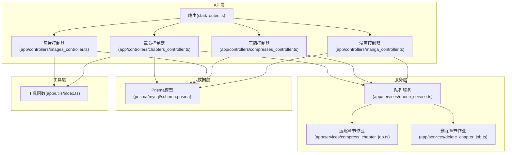
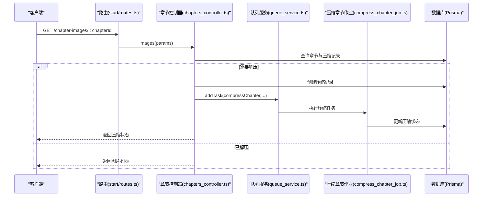
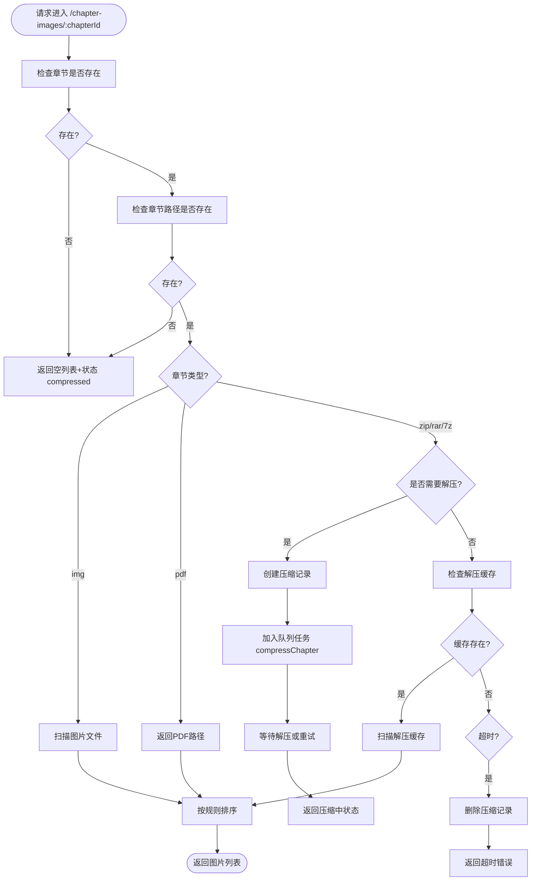
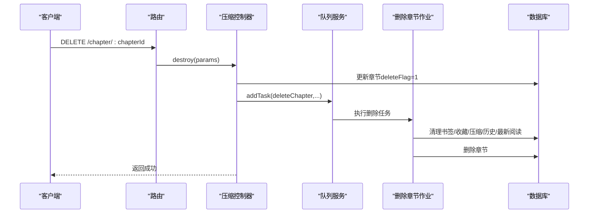
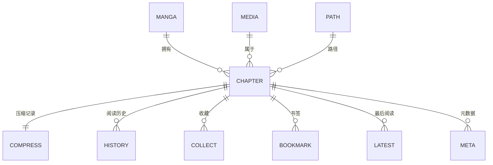
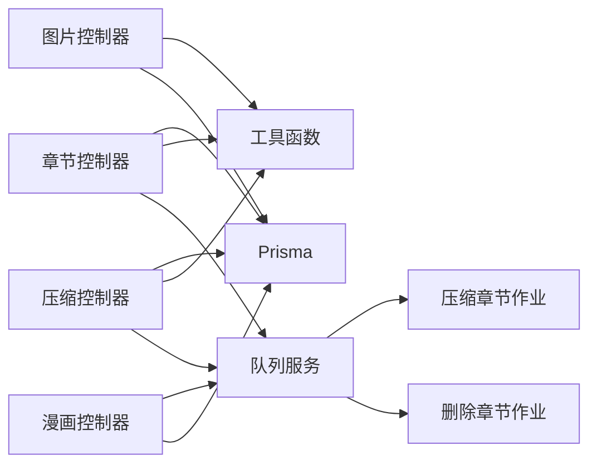

# 章节管理API

<cite>
**本文档引用的文件**
- [chapters_controller.ts](file://app/controllers/chapters_controller.ts)
- [routes.ts](file://start/routes.ts)
- [response.ts](file://app/interfaces/response.ts)
- [index.ts](file://app/utils/index.ts)
- [queue_service.ts](file://app/services/queue_service.ts)
- [compress_chapter_job.ts](file://app/services/compress_chapter_job.ts)
- [delete_chapter_job.ts](file://app/services/delete_chapter_job.ts)
- [images_controller.ts](file://app/controllers/images_controller.ts)
- [compresses_controller.ts](file://app/controllers/compresses_controller.ts)
- [manga_controller.ts](file://app/controllers/manga_controller.ts)
- [schema.prisma](file://prisma/mysql/schema.prisma)
</cite>

## 目录
1. [简介](#简介)
2. [项目结构](#项目结构)
3. [核心组件](#核心组件)
4. [架构概览](#架构概览)
5. [详细组件分析](#详细组件分析)
6. [依赖分析](#依赖分析)
7. [性能考虑](#性能考虑)
8. [故障排查指南](#故障排查指南)
9. [结论](#结论)

## 简介
本文件为 SManga Adonis 的章节管理API文档，覆盖漫画章节的CRUD操作、图片处理、压缩与删除、章节列表查询、详情获取、图片获取、批量操作、状态管理、阅读进度跟踪、章节扫描等完整功能。文档同时提供章节与图片的关联关系、章节统计等接口，并给出完整的请求参数与响应格式说明，帮助开发者快速集成与维护。

## 项目结构
章节管理API主要由以下模块组成：
- 控制器层：章节控制器、图片控制器、压缩控制器、漫画控制器
- 路由层：统一注册章节相关HTTP路由
- 数据层：Prisma ORM模型定义章节、压缩、历史、最新阅读等实体
- 服务层：队列服务与任务作业（压缩章节、删除章节等）
- 工具层：通用工具函数（路径、排序、压缩包解压、文件操作等）

**图表来源**
- [routes.ts:1-241](file://start/routes.ts#L1-L241)
- [chapters_controller.ts:1-515](file://app/controllers/chapters_controller.ts#L1-L515)
- [images_controller.ts:1-114](file://app/controllers/images_controller.ts#L1-L114)
- [compresses_controller.ts:1-147](file://app/controllers/compresses_controller.ts#L1-L147)
- [manga_controller.ts:1-460](file://app/controllers/manga_controller.ts#L1-L460)
- [queue_service.ts:1-267](file://app/services/queue_service.ts#L1-L267)
- [compress_chapter_job.ts:1-71](file://app/services/compress_chapter_job.ts#L1-L71)
- [delete_chapter_job.ts:1-58](file://app/services/delete_chapter_job.ts#L1-L58)
- [index.ts:1-313](file://app/utils/index.ts#L1-L313)
- [schema.prisma:32-146](file://prisma/mysql/schema.prisma#L32-L146)

**章节来源**
- [routes.ts:183-193](file://start/routes.ts#L183-L193)
- [chapters_controller.ts:12-515](file://app/controllers/chapters_controller.ts#L12-L515)
- [images_controller.ts:8-114](file://app/controllers/images_controller.ts#L8-L114)
- [compresses_controller.ts:7-147](file://app/controllers/compresses_controller.ts#L7-L147)
- [manga_controller.ts:12-460](file://app/controllers/manga_controller.ts#L12-L460)
- [queue_service.ts:17-267](file://app/services/queue_service.ts#L17-L267)
- [compress_chapter_job.ts:6-71](file://app/services/compress_chapter_job.ts#L6-L71)
- [delete_chapter_job.ts:11-58](file://app/services/delete_chapter_job.ts#L11-L58)
- [index.ts:94-313](file://app/utils/index.ts#L94-L313)
- [schema.prisma:32-146](file://prisma/mysql/schema.prisma#L32-L146)

## 核心组件
- 章节控制器：提供章节列表、详情、图片获取、创建、更新、删除、批量删除、下载、压缩删除等接口
- 图片控制器：提供图片流式获取与海报上传接口
- 压缩控制器：提供压缩记录的增删改查与批量删除、清理缓存等接口
- 队列服务：统一调度压缩章节、删除章节等后台任务
- 工具函数：提供路径解析、排序参数转换、压缩包解压、文件删除、图片检测等通用能力

**章节来源**
- [chapters_controller.ts:12-515](file://app/controllers/chapters_controller.ts#L12-L515)
- [images_controller.ts:8-114](file://app/controllers/images_controller.ts#L8-L114)
- [compresses_controller.ts:7-147](file://app/controllers/compresses_controller.ts#L7-L147)
- [queue_service.ts:17-267](file://app/services/queue_service.ts#L17-L267)
- [index.ts:94-313](file://app/utils/index.ts#L94-L313)

## 架构概览
章节管理API采用“控制器-服务-数据层”分层架构，通过队列系统异步处理耗时任务（如章节压缩、删除），并通过Prisma进行数据库访问。图片与压缩文件的路径管理由工具函数统一处理，确保跨平台兼容。

**图表来源**
- [routes.ts:190](file://start/routes.ts#L190)
- [chapters_controller.ts:180-369](file://app/controllers/chapters_controller.ts#L180-L369)
- [queue_service.ts:49-66](file://app/services/queue_service.ts#L49-L66)
- [compress_chapter_job.ts:31-65](file://app/services/compress_chapter_job.ts#L31-L65)

## 详细组件分析

### 章节CRUD与查询接口
- 列表查询
  - 方法：GET
  - 路由：/chapter
  - 请求参数：
    - page/pageSize：分页参数
    - mangaId/mediaId：筛选条件
    - order：排序规则（支持id、number、name、createTime、updateTime及asc/desc）
    - keyWord：章节副标题关键词
  - 响应：ListResponse，包含列表与总数
- 详情获取
  - 方法：GET
  - 路由：/chapter/:chapterId
  - 响应：SResponse，data为章节对象
- 首章查询
  - 方法：GET
  - 路由：/chapter-first
  - 请求参数：mangaId、order
  - 响应：SResponse，data为首章对象
- 新增章节
  - 方法：POST
  - 路由：/chapter
  - 请求体：章节字段（如chapterName、chapterPath、chapterCover、chapterNumber等）
  - 响应：SResponse
- 更新章节
  - 方法：PUT
  - 路由：/chapter/:chapterId
  - 请求体：可选字段（chapterName、chapterPath、chapterCover、chapterNumber）
  - 响应：SResponse
- 删除章节
  - 方法：DELETE
  - 路由：/chapter/:chapterId
  - 响应：SResponse（同时异步触发删除章节任务）
- 批量删除章节
  - 方法：DELETE
  - 路由：/chapter/:chapterIds/batch
  - 响应：SResponse（批量删除并异步触发多个删除任务）
- 下载章节
  - 方法：GET
  - 路由：/chapter/download
  - 请求参数：chapterId
  - 响应：纯图片章节返回图片列表；压缩包章节返回文件流
- 压缩删除
  - 方法：DELETE
  - 路由：/chapter/:chapterId/compress
  - 响应：SResponse

**章节来源**
- [routes.ts:183-192](file://start/routes.ts#L183-L192)
- [chapters_controller.ts:13-160](file://app/controllers/chapters_controller.ts#L13-L160)
- [chapters_controller.ts:162-178](file://app/controllers/chapters_controller.ts#L162-L178)
- [chapters_controller.ts:371-378](file://app/controllers/chapters_controller.ts#L371-L378)
- [chapters_controller.ts:380-389](file://app/controllers/chapters_controller.ts#L380-L389)
- [chapters_controller.ts:391-404](file://app/controllers/chapters_controller.ts#L391-L404)
- [chapters_controller.ts:406-429](file://app/controllers/chapters_controller.ts#L406-L429)
- [chapters_controller.ts:431-472](file://app/controllers/chapters_controller.ts#L431-L472)
- [chapters_controller.ts:474-483](file://app/controllers/chapters_controller.ts#L474-L483)

### 章节图片获取与处理
- 图片列表获取
  - 方法：GET
  - 路由：/chapter-images/:chapterId
  - 请求参数：
    - orderChapterByNumber：是否按数字排序
    - reTry：重试次数限制
  - 响应：SResponse，data为图片路径数组，status表示压缩状态（compressed/compressing/failed）
  - 行为说明：
    - 纯图片章节：直接扫描章节目录
    - PDF章节：返回PDF文件路径
    - 压缩章节：根据配置决定同步或异步解压，并在完成后返回图片列表
    - 自动清理：根据配置自动清理解压缓存
- 图片流式获取
  - 方法：GET
  - 路由：/image
  - 请求体：file（图片绝对路径）
  - 响应：图片文件流（自动识别图片或二进制）
- 海报上传
  - 方法：POST
  - 路由：/image/upload
  - 请求参数：mangaId/chapterId/mediaId（三选一）、image文件
  - 响应：SResponse，data包含保存路径与绑定ID

**图表来源**
- [chapters_controller.ts:180-369](file://app/controllers/chapters_controller.ts#L180-L369)
- [index.ts:24-28](file://app/utils/index.ts#L24-L28)
- [index.ts:234-260](file://app/utils/index.ts#L234-L260)

**章节来源**
- [chapters_controller.ts:180-369](file://app/controllers/chapters_controller.ts#L180-L369)
- [images_controller.ts:9-29](file://app/controllers/images_controller.ts#L9-L29)
- [images_controller.ts:35-112](file://app/controllers/images_controller.ts#L35-L112)
- [index.ts:24-28](file://app/utils/index.ts#L24-L28)
- [index.ts:234-260](file://app/utils/index.ts#L234-L260)

### 压缩与删除接口
- 压缩记录管理
  - 列表：GET /compress
  - 详情：GET /compress/:compressId
  - 新增：POST /compress
  - 更新：PUT /compress/:compressId
  - 删除：DELETE /compress/:compressId
  - 批量删除：DELETE /compress/:compressIds/batch
  - 清理缓存：DELETE /compress-clear
- 删除章节
  - 方法：DELETE /chapter/:chapterId
  - 行为：标记删除并异步清理书签、收藏、压缩、历史、最后阅读记录、章节封面等
- 清理章节压缩缓存
  - 方法：DELETE /chapter/:chapterId/compress
  - 行为：删除压缩记录与解压缓存目录

**图表来源**
- [routes.ts:188-192](file://start/routes.ts#L188-L192)
- [compresses_controller.ts:96-105](file://app/controllers/compresses_controller.ts#L96-L105)
- [chapters_controller.ts:391-404](file://app/controllers/chapters_controller.ts#L391-L404)
- [queue_service.ts:120-122](file://app/services/queue_service.ts#L120-L122)
- [delete_chapter_job.ts:18-56](file://app/services/delete_chapter_job.ts#L18-L56)

**章节来源**
- [compresses_controller.ts:8-28](file://app/controllers/compresses_controller.ts#L8-L28)
- [compresses_controller.ts:58-94](file://app/controllers/compresses_controller.ts#L58-L94)
- [compresses_controller.ts:96-135](file://app/controllers/compresses_controller.ts#L96-L135)
- [compresses_controller.ts:137-145](file://app/controllers/compresses_controller.ts#L137-L145)
- [chapters_controller.ts:391-404](file://app/controllers/chapters_controller.ts#L391-L404)
- [delete_chapter_job.ts:18-56](file://app/services/delete_chapter_job.ts#L18-L56)

### 章节状态管理与阅读进度
- 章节状态
  - 压缩状态：compressed/compressing/failed
  - 删除标志：deleteFlag（0/1）
- 阅读进度
  - 历史记录：/history、/history/:chapterId、/history
  - 最后阅读：/latest、/latest/:chapterId
  - 全部已读/未读：/read-all-chapters/:mangaId、/unread-all-chapters/:mangaId
  - 章节是否已读：/chapter-is-read/:chapterId

**章节来源**
- [chapters_controller.ts:180-369](file://app/controllers/chapters_controller.ts#L180-L369)
- [routes.ts:96-104](file://start/routes.ts#L96-L104)
- [routes.ts:106-112](file://start/routes.ts#L106-L112)

### 章节扫描与统计
- 章节扫描
  - 触发：/manga/:mangaId/scan（漫画扫描）
  - 实现：队列任务taskScanManga，扫描漫画目录并创建章节
- 章节统计
  - 未读章节数：在漫画列表中计算每个漫画的未读章节数（基于历史记录）

**章节来源**
- [routes.ts:176](file://start/routes.ts#L176)
- [manga_controller.ts:217-259](file://app/controllers/manga_controller.ts#L217-L259)
- [manga_controller.ts:78-115](file://app/controllers/manga_controller.ts#L78-L115)

### 数据模型与关联关系
章节模型与相关实体的关系如下：
- 章节 chapter
  - 关联漫画 manga
  - 关联媒体 media
  - 关联路径 path
  - 关联压缩 compress
  - 关联历史 history
  - 关联收藏 collect
  - 关联书签 bookmark
  - 关联最新阅读 latest
  - 关联元数据 meta

**图表来源**
- [schema.prisma:32-55](file://prisma/mysql/schema.prisma#L32-L55)
- [schema.prisma:77-88](file://prisma/mysql/schema.prisma#L77-L88)
- [schema.prisma:109-127](file://prisma/mysql/schema.prisma#L109-L127)

**章节来源**
- [schema.prisma:32-146](file://prisma/mysql/schema.prisma#L32-L146)

## 依赖分析
- 控制器依赖
  - 章节控制器依赖Prisma、工具函数、队列服务、压缩包解压工具
  - 图片控制器依赖工具函数与文件系统
  - 压缩控制器依赖Prisma与文件删除工具
- 服务依赖
  - 队列服务统一调度压缩章节、删除章节等作业
  - 作业类封装具体业务逻辑（如压缩章节、删除章节）
- 工具依赖
  - 路径解析、排序参数、图片检测、压缩包解压、文件删除等

**图表来源**
- [chapters_controller.ts:1-11](file://app/controllers/chapters_controller.ts#L1-L11)
- [images_controller.ts:1-6](file://app/controllers/images_controller.ts#L1-L6)
- [compresses_controller.ts:1-5](file://app/controllers/compresses_controller.ts#L1-L5)
- [queue_service.ts:1-15](file://app/services/queue_service.ts#L1-L15)
- [compress_chapter_job.ts:1-5](file://app/services/compress_chapter_job.ts#L1-L5)
- [delete_chapter_job.ts:1-9](file://app/services/delete_chapter_job.ts#L1-L9)

**章节来源**
- [chapters_controller.ts:1-11](file://app/controllers/chapters_controller.ts#L1-L11)
- [images_controller.ts:1-6](file://app/controllers/images_controller.ts#L1-L6)
- [compresses_controller.ts:1-5](file://app/controllers/compresses_controller.ts#L1-L5)
- [queue_service.ts:1-15](file://app/services/queue_service.ts#L1-L15)

## 性能考虑
- 异步处理：章节压缩、删除等耗时操作通过队列异步执行，避免阻塞请求
- 缓存策略：解压后的图片路径缓存于压缩记录，减少重复解压
- 排序优化：支持按多种字段排序，结合索引提升查询效率
- 文件流传输：图片与压缩包下载采用流式传输，降低内存占用
- 自动清理：根据配置自动清理解压缓存，释放磁盘空间

[本节为通用性能建议，无需特定文件引用]

## 故障排查指南
- 章节不存在
  - 现象：返回章节不存在提示
  - 排查：确认chapterId是否正确，检查章节路径是否存在
- 章节文件不存在
  - 现象：返回章节文件不存在提示
  - 排查：确认章节路径指向有效文件或目录
- 解压超时
  - 现象：返回解压超时错误
  - 排查：检查压缩包完整性、磁盘空间、队列任务状态
- 权限不足
  - 现象：返回无权限访问
  - 排查：确认用户角色或媒体权限设置
- 压缩记录异常
  - 现象：压缩状态异常
  - 排查：检查压缩记录与实际文件夹一致性，必要时执行清理

**章节来源**
- [chapters_controller.ts:24-53](file://app/controllers/chapters_controller.ts#L24-L53)
- [chapters_controller.ts:184-194](file://app/controllers/chapters_controller.ts#L184-L194)
- [chapters_controller.ts:350-359](file://app/controllers/chapters_controller.ts#L350-L359)
- [compresses_controller.ts:96-105](file://app/controllers/compresses_controller.ts#L96-L105)

## 结论
SManga Adonis 的章节管理API提供了完善的章节CRUD、图片处理、压缩与删除、状态管理、阅读进度跟踪与扫描统计功能。通过队列异步处理与缓存策略，系统在保证用户体验的同时兼顾了性能与可维护性。建议在生产环境中合理配置队列并发与超时参数，并定期清理压缩缓存以维持最佳运行状态。