# 统计分析API

<cite>
**本文档引用的文件**
- [charts_controller.ts](file://app/controllers/charts_controller.ts)
- [logs_controller.ts](file://app/controllers/logs_controller.ts)
- [histories_controller.ts](file://app/controllers/histories_controller.ts)
- [latests_controller.ts](file://app/controllers/latests_controller.ts)
- [routes.ts](file://start/routes.ts)
- [response.ts](file://app/interfaces/response.ts)
- [schema.prisma](file://prisma/mysql/schema.prisma)
- [index.ts](file://app/utils/index.ts)
- [database.ts](file://config/database.ts)
</cite>

## 目录
1. [简介](#简介)
2. [项目结构](#项目结构)
3. [核心组件](#核心组件)
4. [架构概览](#架构概览)
5. [详细组件分析](#详细组件分析)
6. [依赖关系分析](#依赖关系分析)
7. [性能考虑](#性能考虑)
8. [故障排除指南](#故障排除指南)
9. [结论](#结论)

## 简介

SManga Adonis 是一个基于 AdonisJS 框架构建的漫画管理系统，提供了完整的统计分析功能。本文档详细介绍了统计分析API的设计与实现，包括图表统计接口（浏览统计、标签统计、排名统计、频率统计）、日志管理接口以及最新阅读记录等分析相关功能。

系统采用现代化的架构设计，使用 Prisma ORM 进行数据库操作，支持 MySQL、PostgreSQL 和 SQLite 数据库。通过统一的响应格式和RESTful API设计，为前端应用提供了丰富的统计数据接口。

## 项目结构

SManga Adonis 项目采用典型的 MVC 架构模式，统计分析功能主要分布在以下模块中：

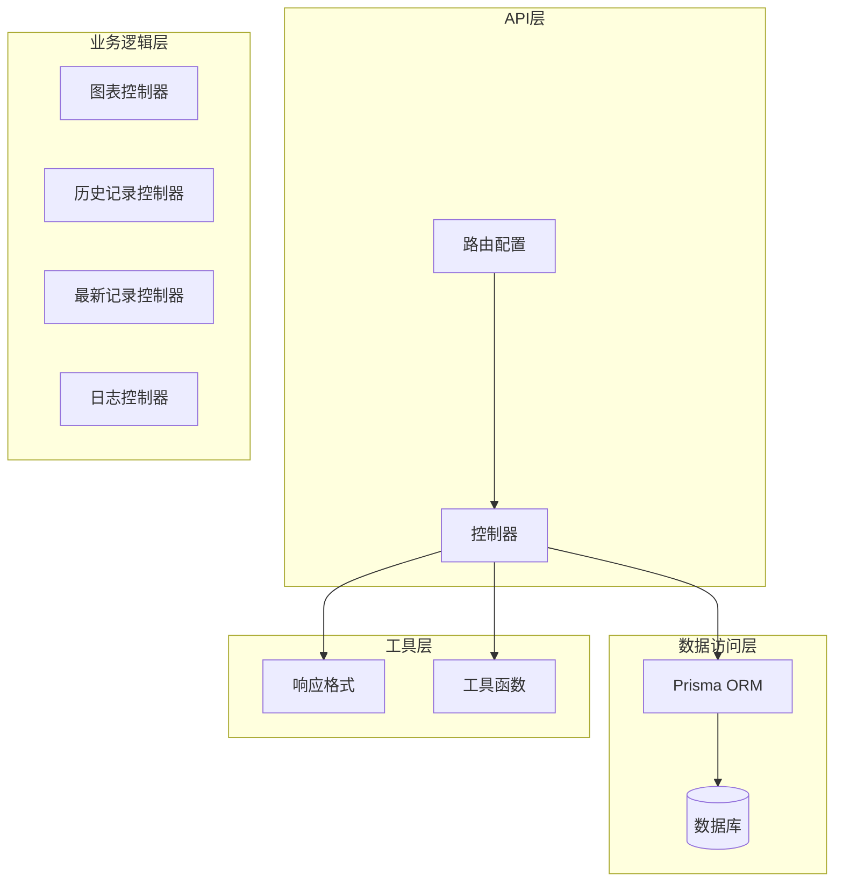

**图表来源**
- [routes.ts:1-241](file://start/routes.ts#L1-L241)
- [charts_controller.ts:1-160](file://app/controllers/charts_controller.ts#L1-L160)
- [histories_controller.ts:1-270](file://app/controllers/histories_controller.ts#L1-L270)

**章节来源**
- [routes.ts:1-241](file://start/routes.ts#L1-L241)
- [charts_controller.ts:1-160](file://app/controllers/charts_controller.ts#L1-L160)

## 核心组件

### 统计分析控制器

系统的核心统计分析功能由四个主要控制器提供：

1. **ChartsController** - 图表统计控制器
2. **HistoriesController** - 历史记录控制器  
3. **LatestsController** - 最新阅读记录控制器
4. **LogsController** - 日志管理控制器

每个控制器都遵循统一的响应格式规范，确保API的一致性和可预测性。

### 数据模型关系

系统使用Prisma ORM定义了完整的数据模型关系，支持复杂的统计查询：

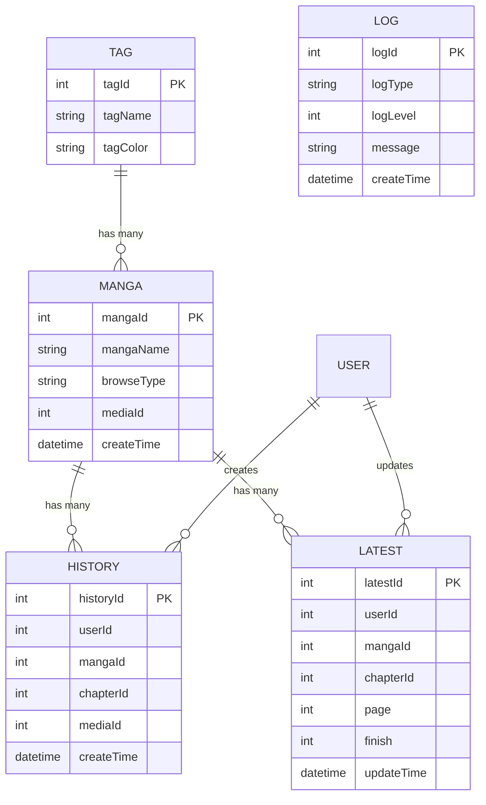

**图表来源**
- [schema.prisma:163-310](file://prisma/mysql/schema.prisma#L163-L310)

**章节来源**
- [schema.prisma:1-449](file://prisma/mysql/schema.prisma#L1-L449)

## 架构概览

系统采用分层架构设计，确保关注点分离和代码的可维护性：

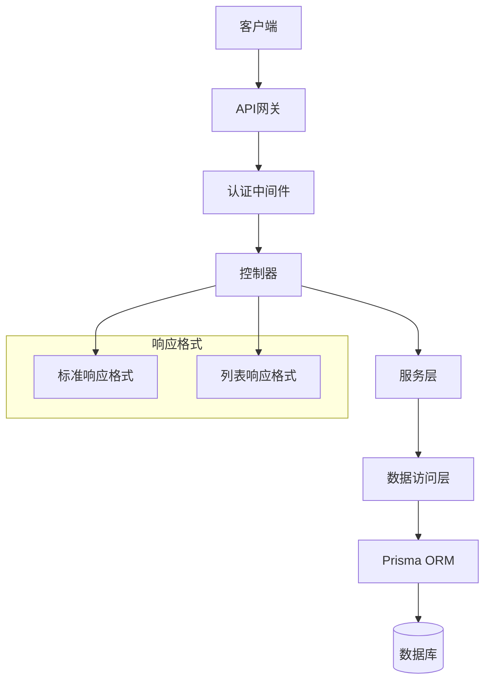

**图表来源**
- [response.ts:1-64](file://app/interfaces/response.ts#L1-L64)
- [charts_controller.ts:1-160](file://app/controllers/charts_controller.ts#L1-L160)

## 详细组件分析

### 图表统计控制器 (ChartsController)

ChartsController 提供了四种核心统计功能：

#### 浏览统计 (Browse Statistics)

浏览统计功能根据漫画的浏览类型进行分类统计，支持以下浏览类型：
- flow: 条漫（纵向滚动）
- single: 单页显示
- double: 双页显示
- half: 裁剪显示

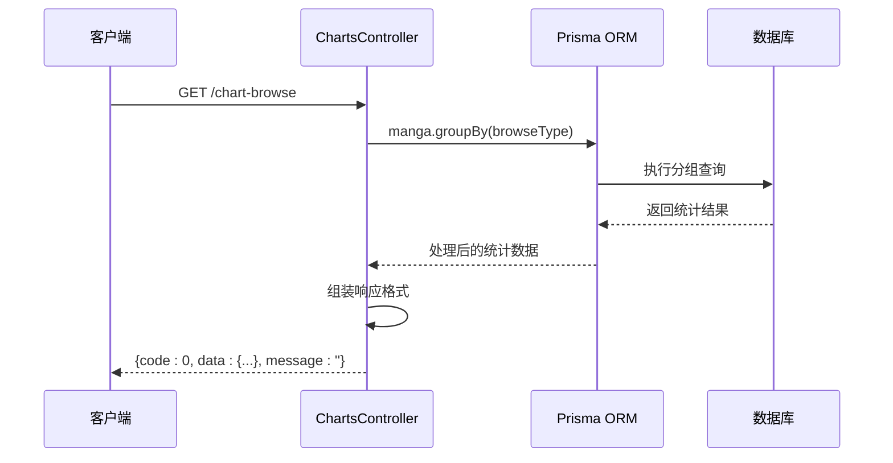

**图表来源**
- [charts_controller.ts:6-30](file://app/controllers/charts_controller.ts#L6-L30)

#### 标签统计 (Tag Statistics)

标签统计功能统计各个标签的使用频率，支持通过 `slice` 参数限制返回数量：

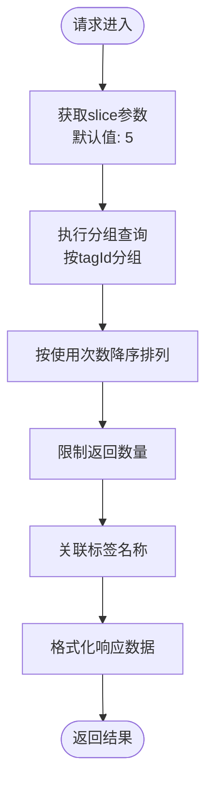

**图表来源**
- [charts_controller.ts:32-73](file://app/controllers/charts_controller.ts#L32-L73)

#### 排名统计 (Ranking Statistics)

排名统计功能基于历史记录统计漫画的阅读次数排名：

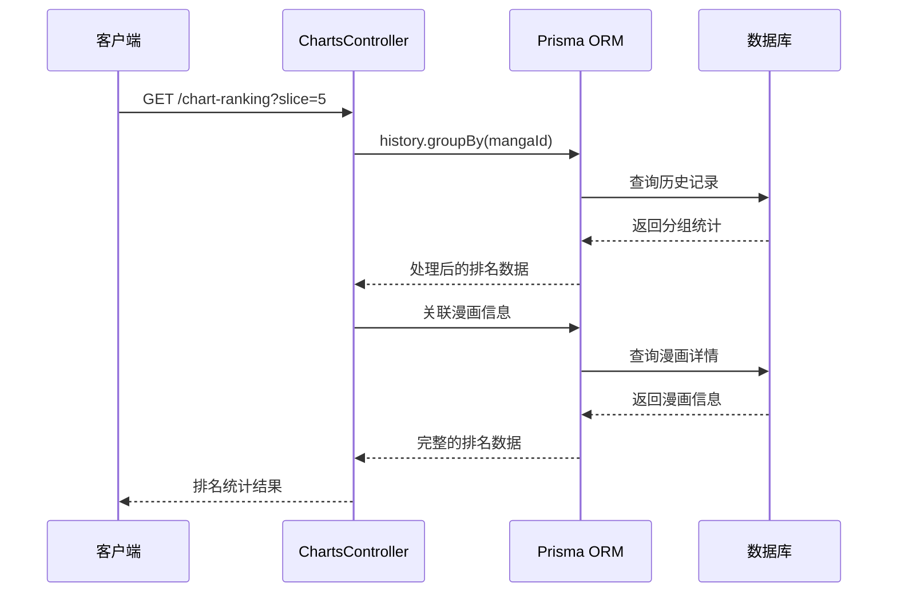

**图表来源**
- [charts_controller.ts:75-112](file://app/controllers/charts_controller.ts#L75-L112)

#### 频率统计 (Frequency Statistics)

频率统计功能统计用户过去7天的阅读频率，按日期进行分组：

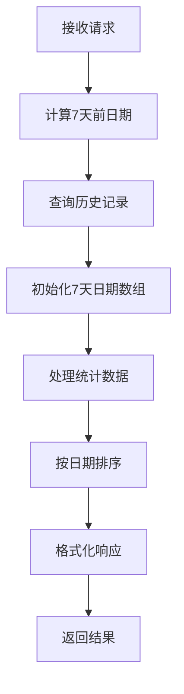

**图表来源**
- [charts_controller.ts:114-158](file://app/controllers/charts_controller.ts#L114-L158)

**章节来源**
- [charts_controller.ts:1-160](file://app/controllers/charts_controller.ts#L1-L160)

### 历史记录控制器 (HistoriesController)

历史记录控制器提供了完整的阅读历史管理功能：

#### 分页查询历史记录

支持按用户ID分页查询历史记录，自动处理MySQL和PostgreSQL的差异：

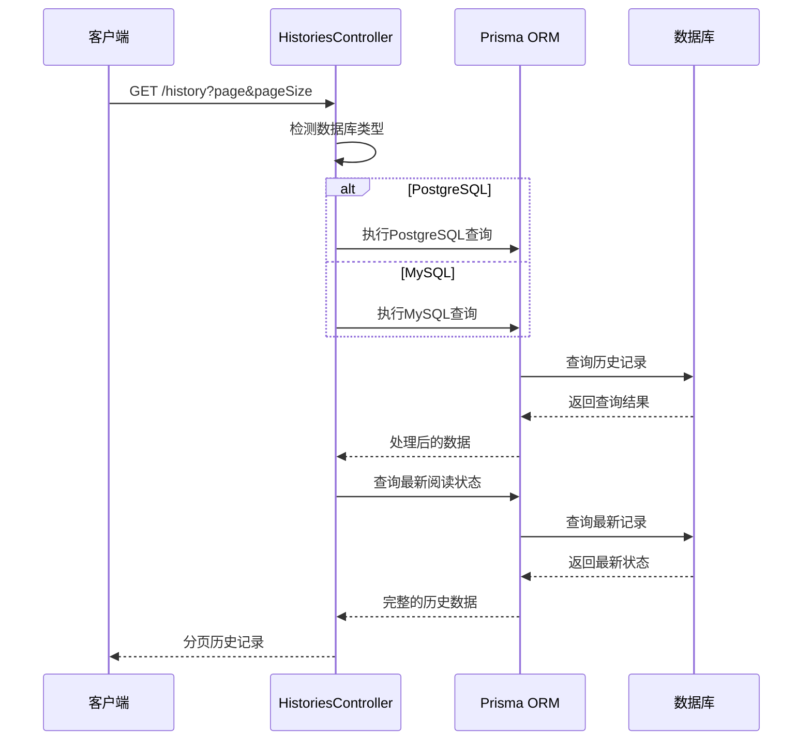

**图表来源**
- [histories_controller.ts:8-46](file://app/controllers/histories_controller.ts#L8-L46)

#### 创建历史记录

当用户阅读漫画章节时，系统自动创建历史记录：

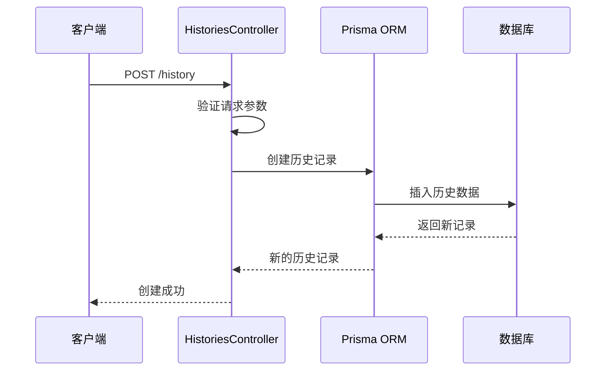

**图表来源**
- [histories_controller.ts:126-160](file://app/controllers/histories_controller.ts#L126-L160)

**章节来源**
- [histories_controller.ts:1-270](file://app/controllers/histories_controller.ts#L1-L270)

### 最新阅读记录控制器 (LatestsController)

最新阅读记录控制器专门管理用户的最新阅读进度：

#### 查询最新阅读记录

支持按用户ID查询最新的阅读记录，并计算未观看章节数量：

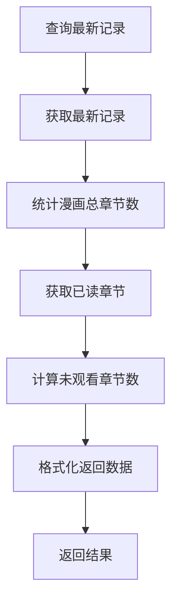

**图表来源**
- [latests_controller.ts:8-38](file://app/controllers/latests_controller.ts#L8-L38)

#### 更新阅读进度

用户更新阅读进度时，系统自动处理最新记录的创建或更新：

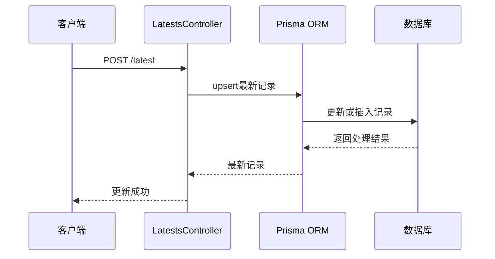

**图表来源**
- [latests_controller.ts:136-157](file://app/controllers/latests_controller.ts#L136-L157)

**章节来源**
- [latests_controller.ts:1-179](file://app/controllers/latests_controller.ts#L1-L179)

### 日志管理控制器 (LogsController)

日志管理控制器提供了完整的日志CRUD操作：

#### 日志列表查询

支持分页查询日志列表，按创建时间倒序排列：

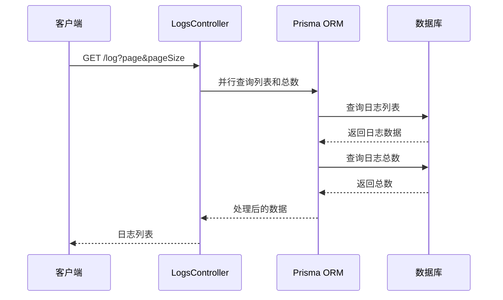

**图表来源**
- [logs_controller.ts:9-22](file://app/controllers/logs_controller.ts#L9-L22)

**章节来源**
- [logs_controller.ts:1-61](file://app/controllers/logs_controller.ts#L1-L61)

## 依赖关系分析

系统的关键依赖关系如下：

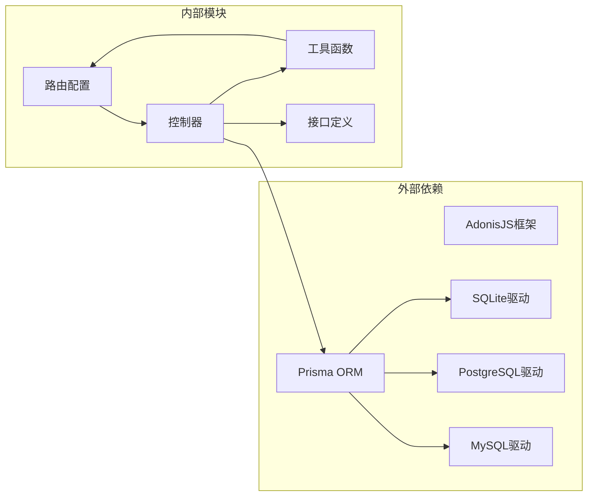

**图表来源**
- [routes.ts:1-241](file://start/routes.ts#L1-L241)
- [charts_controller.ts:1-160](file://app/controllers/charts_controller.ts#L1-L160)

**章节来源**
- [routes.ts:1-241](file://start/routes.ts#L1-L241)
- [database.ts:1-24](file://config/database.ts#L1-L24)

## 性能考虑

### 数据库优化策略

1. **索引优化**: 系统在关键字段上建立了适当的索引，如 `userId`、`mangaId`、`chapterId` 等
2. **查询优化**: 使用 `groupBy` 和 `orderBy` 进行高效的统计查询
3. **连接优化**: 通过 `JOIN` 操作减少查询次数
4. **分页优化**: 实现了高效的分页查询机制

### 缓存策略

系统支持多种数据库类型的优化：
- **PostgreSQL**: 使用 `MAX()` 函数处理 `ONLY_FULL_GROUP_BY` 模式
- **MySQL**: 通过 `GROUP BY` 和聚合函数优化查询性能

### 响应格式优化

统一的响应格式确保了API的一致性和可预测性：
- 成功响应: `{ code: 0, data: any, message: '' }`
- 列表响应: `{ code: 0, list: [], count: number, message: '' }`

## 故障排除指南

### 常见问题及解决方案

#### 数据库连接问题

**症状**: API调用失败，出现数据库连接错误
**解决方案**: 
1. 检查数据库配置文件中的连接参数
2. 确认数据库服务正在运行
3. 验证用户权限设置

#### 查询性能问题

**症状**: 统计查询响应缓慢
**解决方案**:
1. 检查数据库索引是否完整
2. 优化查询条件和分页参数
3. 考虑添加适当的数据库索引

#### 统计数据不准确

**症状**: 统计结果与预期不符
**解决方案**:
1. 验证数据完整性
2. 检查时间范围设置
3. 确认用户权限验证

**章节来源**
- [response.ts:1-64](file://app/interfaces/response.ts#L1-L64)
- [index.ts:94-105](file://app/utils/index.ts#L94-L105)

## 结论

SManga Adonis 的统计分析API提供了完整的数据分析功能，包括浏览统计、标签统计、排名统计、频率统计等核心功能。系统采用现代化的架构设计，使用Prisma ORM简化了数据库操作，支持多种数据库类型，并提供了统一的响应格式。

通过合理的数据库设计和查询优化，系统能够高效地处理大量的统计数据。同时，清晰的API设计和完善的错误处理机制确保了系统的稳定性和可靠性。

未来可以考虑添加更多高级统计功能，如趋势分析、用户行为分析等，进一步提升系统的数据分析能力。