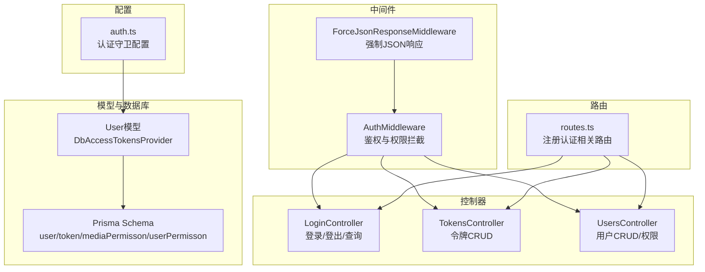
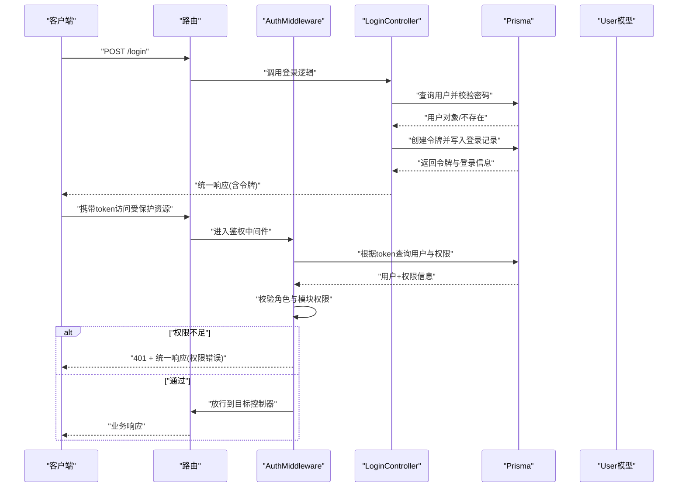
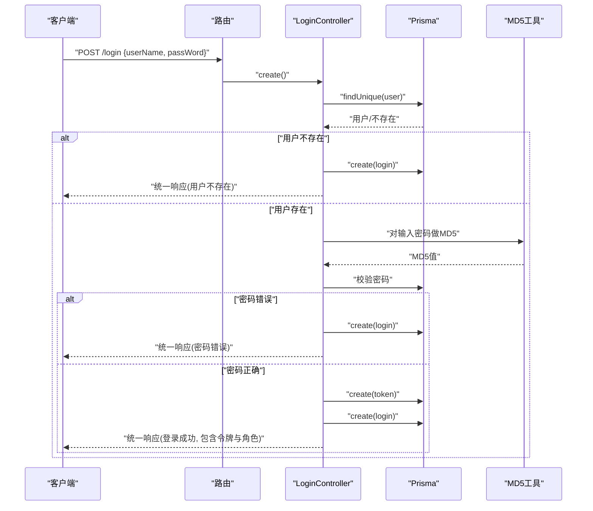
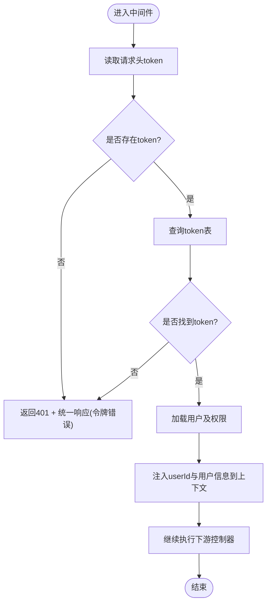
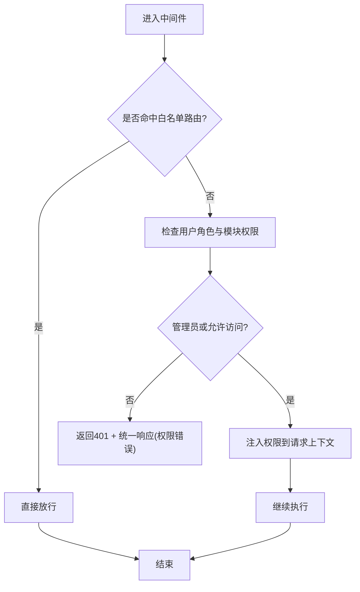
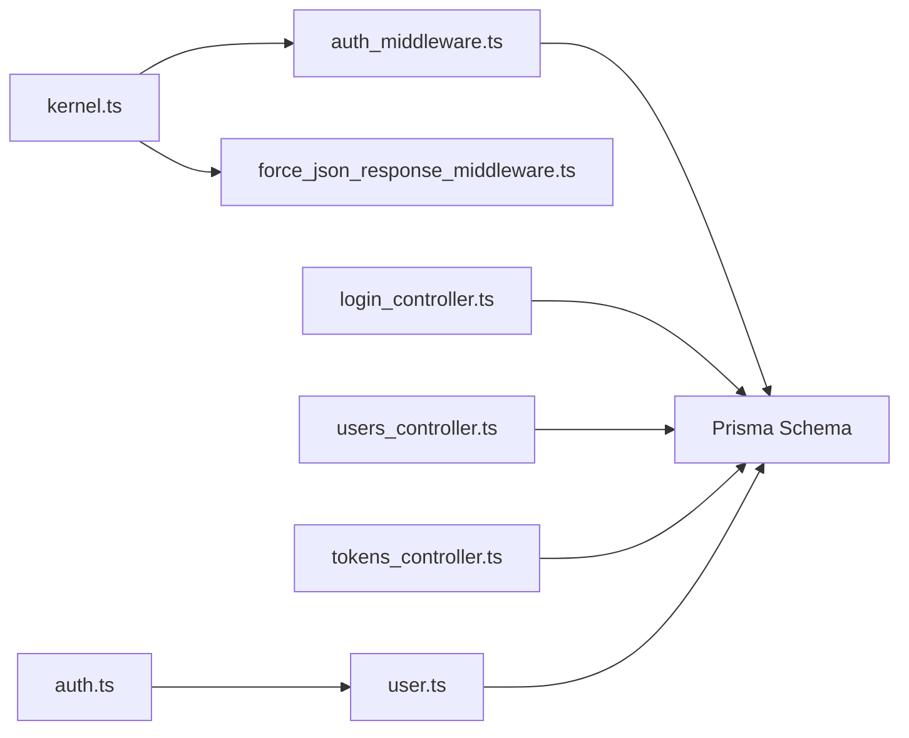

# 认证与授权API

<cite>
**本文引用的文件**
- [app/middleware/auth_middleware.ts](file://app/middleware/auth_middleware.ts)
- [app/controllers/login_controller.ts](file://app/controllers/login_controller.ts)
- [app/controllers/tokens_controller.ts](file://app/controllers/tokens_controller.ts)
- [config/auth.ts](file://config/auth.ts)
- [app/models/user.ts](file://app/models/user.ts)
- [app/interfaces/response.ts](file://app/interfaces/response.ts)
- [app/utils/md5.ts](file://app/utils/md5.ts)
- [start/routes.ts](file://start/routes.ts)
- [start/kernel.ts](file://start/kernel.ts)
- [prisma/sqlite/schema.prisma](file://prisma/sqlite/schema.prisma)
- [app/controllers/users_controller.ts](file://app/controllers/users_controller.ts)
- [app/exceptions/handler.ts](file://app/exceptions/handler.ts)
- [app/middleware/force_json_response_middleware.ts](file://app/middleware/force_json_response_middleware.ts)
</cite>

## 目录
1. [简介](#简介)
2. [项目结构](#项目结构)
3. [核心组件](#核心组件)
4. [架构总览](#架构总览)
5. [详细组件分析](#详细组件分析)
6. [依赖关系分析](#依赖关系分析)
7. [性能考虑](#性能考虑)
8. [故障排除指南](#故障排除指南)
9. [结论](#结论)
10. [附录](#附录)

## 简介
本文件面向SManga Adonis项目的认证与授权API，系统性梳理用户登录、登出、权限验证、JWT令牌生成与验证、中间件配置与权限控制流程，并提供认证头设置、令牌刷新、会话管理、认证失败处理、权限不足错误码与安全最佳实践。文档同时给出请求/响应示例与常见认证场景的实现指南，帮助开发者快速集成与排查问题。

## 项目结构
认证与授权相关的关键文件分布如下：
- 中间件层：统一鉴权与权限拦截
- 控制器层：登录、令牌管理、用户管理
- 配置层：认证守卫与令牌提供者
- 数据模型与数据库：用户、令牌、权限关联
- 路由层：暴露认证相关接口
- 工具与响应封装：MD5加密封装、统一响应格式

图表来源
- [start/kernel.ts:44-49](file://start/kernel.ts#L44-L49)
- [app/middleware/auth_middleware.ts:17-85](file://app/middleware/auth_middleware.ts#L17-L85)
- [config/auth.ts:5-15](file://config/auth.ts#L5-L15)
- [app/models/user.ts:32](file://app/models/user.ts#L32)
- [prisma/sqlite/schema.prisma:357-386](file://prisma/sqlite/schema.prisma#L357-L386)
- [start/routes.ts:120-126](file://start/routes.ts#L120-L126)

章节来源
- [start/kernel.ts:35-49](file://start/kernel.ts#L35-L49)
- [start/routes.ts:120-126](file://start/routes.ts#L120-L126)

## 核心组件
- 认证守卫与令牌提供者：通过配置启用基于访问令牌的API认证，使用数据库令牌提供者绑定用户模型。
- 用户模型：集成令牌提供者，支持数据库令牌存储与查找。
- 登录控制器：负责用户凭据校验、令牌生成、登录记录写入与统一响应。
- 令牌控制器：提供令牌的列表、详情、新增、更新、删除接口（用于运维或测试）。
- 权限中间件：统一拦截HTTP请求，校验令牌有效性、用户角色与模块权限。
- 统一响应与工具：统一响应格式、MD5密码哈希。

章节来源
- [config/auth.ts:5-15](file://config/auth.ts#L5-L15)
- [app/models/user.ts:32](file://app/models/user.ts#L32)
- [app/controllers/login_controller.ts:34-93](file://app/controllers/login_controller.ts#L34-L93)
- [app/controllers/tokens_controller.ts:13-61](file://app/controllers/tokens_controller.ts#L13-L61)
- [app/middleware/auth_middleware.ts:23-85](file://app/middleware/auth_middleware.ts#L23-L85)
- [app/interfaces/response.ts:18-33](file://app/interfaces/response.ts#L18-L33)
- [app/utils/md5.ts:19-21](file://app/utils/md5.ts#L19-L21)

## 架构总览
下图展示从客户端到服务端的认证与授权流程，包括登录、令牌校验、权限拦截与统一响应。

图表来源
- [app/controllers/login_controller.ts:34-93](file://app/controllers/login_controller.ts#L34-L93)
- [app/middleware/auth_middleware.ts:23-85](file://app/middleware/auth_middleware.ts#L23-L85)
- [prisma/sqlite/schema.prisma:357-386](file://prisma/sqlite/schema.prisma#L357-L386)
- [app/models/user.ts:32](file://app/models/user.ts#L32)

## 详细组件分析

### 登录与登出流程
- 登录接口
  - 请求路径：POST /login
  - 请求参数：用户名、密码
  - 处理逻辑：查询用户是否存在且密码匹配；若匹配则生成UUID令牌并写入token表，同时写入登录记录；否则记录失败登录信息并返回统一响应。
  - 返回：统一响应，包含登录结果与用户角色信息。
- 登出接口
  - 当前仓库未提供显式“登出”接口。建议通过删除对应token或在业务侧撤销token使用实现登出。

图表来源
- [start/routes.ts:123](file://start/routes.ts#L123)
- [app/controllers/login_controller.ts:34-93](file://app/controllers/login_controller.ts#L34-L93)
- [app/utils/md5.ts:19-21](file://app/utils/md5.ts#L19-L21)
- [prisma/sqlite/schema.prisma:357-365](file://prisma/sqlite/schema.prisma#L357-L365)

章节来源
- [start/routes.ts:120-126](file://start/routes.ts#L120-L126)
- [app/controllers/login_controller.ts:34-93](file://app/controllers/login_controller.ts#L34-L93)
- [app/utils/md5.ts:19-21](file://app/utils/md5.ts#L19-L21)
- [prisma/sqlite/schema.prisma:357-365](file://prisma/sqlite/schema.prisma#L357-L365)

### 令牌生成与验证机制
- 令牌生成
  - 登录成功后，系统为用户创建一条唯一令牌记录，用于后续请求的身份识别。
- 令牌验证
  - 中间件从请求头读取token字段，查询数据库中的令牌是否存在；若不存在或为空则返回401与统一响应。
- 令牌提供者
  - 配置启用基于访问令牌的守卫，并通过数据库令牌提供者绑定用户模型，便于后续扩展标准JWT能力。

图表来源
- [app/middleware/auth_middleware.ts:23-85](file://app/middleware/auth_middleware.ts#L23-L85)
- [prisma/sqlite/schema.prisma:357-386](file://prisma/sqlite/schema.prisma#L357-L386)

章节来源
- [app/middleware/auth_middleware.ts:23-85](file://app/middleware/auth_middleware.ts#L23-L85)
- [config/auth.ts:5-15](file://config/auth.ts#L5-L15)
- [app/models/user.ts:32](file://app/models/user.ts#L32)

### 权限控制流程
- 角色与模块权限
  - 用户具备角色(role)，部分路由仅管理员可访问；DELETE方法默认要求管理员。
  - 用户可被授予特定媒体库(mediaPermisson)与模块(userPermisson)权限，中间件将权限映射到请求上下文供业务使用。
- 路由白名单
  - 部分路由无需认证即可访问，如部署、测试、登录、文件资源、分析等。

图表来源
- [app/middleware/auth_middleware.ts:24-85](file://app/middleware/auth_middleware.ts#L24-L85)

章节来源
- [app/middleware/auth_middleware.ts:24-85](file://app/middleware/auth_middleware.ts#L24-L85)

### 中间件配置与统一响应
- 中间件栈
  - 服务器级中间件：容器绑定、强制JSON响应、CORS。
  - 路由级中间件：BodyParser、认证初始化、参数中间件、自定义鉴权中间件。
- 强制JSON响应
  - 将Accept头强制为application/json，确保错误与认证相关响应为JSON格式。
- 统一响应
  - 提供SResponse与ListResponse两类统一响应封装，包含code、message、data、status等字段，便于前端统一处理。

章节来源
- [start/kernel.ts:35-49](file://start/kernel.ts#L35-L49)
- [app/middleware/force_json_response_middleware.ts:9-15](file://app/middleware/force_json_response_middleware.ts#L9-L15)
- [app/interfaces/response.ts:18-63](file://app/interfaces/response.ts#L18-L63)

### 令牌管理与会话管理
- 令牌管理接口
  - 列表、详情、新增、更新、删除等基础CRUD接口，便于运维或测试环境使用。
- 会话管理
  - 当前实现以静态token为主，未见会话状态持久化与自动刷新机制。建议在业务侧结合token过期策略与刷新流程实现会话管理。

章节来源
- [start/routes.ts:120-126](file://start/routes.ts#L120-L126)
- [app/controllers/tokens_controller.ts:13-61](file://app/controllers/tokens_controller.ts#L13-L61)

## 依赖关系分析
- 组件耦合
  - 中间件依赖Prisma查询用户与令牌；控制器依赖Prisma进行用户、令牌与登录记录操作；模型通过令牌提供者与守卫集成。
- 外部依赖
  - AdonisJS认证与中间件生态、Prisma ORM、Node内置crypto用于MD5。
- 可能的循环依赖
  - 当前结构清晰，控制器与中间件通过Prisma与配置解耦，未发现明显循环依赖。

图表来源
- [start/kernel.ts:35-49](file://start/kernel.ts#L35-L49)
- [app/middleware/auth_middleware.ts:8-11](file://app/middleware/auth_middleware.ts#L8-L11)
- [app/controllers/login_controller.ts:8-12](file://app/controllers/login_controller.ts#L8-L12)
- [app/controllers/users_controller.ts:1-6](file://app/controllers/users_controller.ts#L1-L6)
- [app/controllers/tokens_controller.ts:8-11](file://app/controllers/tokens_controller.ts#L8-L11)
- [config/auth.ts:5-15](file://config/auth.ts#L5-L15)
- [app/models/user.ts:32](file://app/models/user.ts#L32)
- [prisma/sqlite/schema.prisma:357-386](file://prisma/sqlite/schema.prisma#L357-L386)

章节来源
- [start/kernel.ts:35-49](file://start/kernel.ts#L35-L49)
- [config/auth.ts:5-15](file://config/auth.ts#L5-L15)
- [app/models/user.ts:32](file://app/models/user.ts#L32)
- [prisma/sqlite/schema.prisma:357-386](file://prisma/sqlite/schema.prisma#L357-L386)

## 性能考虑
- 中间件查询优化
  - 在鉴权中间件中按需查询令牌与用户信息，避免不必要的字段加载；可考虑缓存热点用户权限以降低数据库压力。
- 密码哈希
  - 当前使用MD5，建议升级为更安全的哈希算法或AdonisJS默认的哈希方案，提升安全性。
- 并发与事务
  - 登录与令牌创建应保证原子性，避免并发场景下的重复令牌或竞态条件。

## 故障排除指南
- 401 令牌错误
  - 现象：未携带token或token无效。
  - 排查：确认请求头是否包含token；检查token是否存在于数据库；核对路由是否命中白名单。
- 401 权限错误
  - 现象：非管理员访问管理员路由或执行DELETE但非管理员。
  - 排查：确认用户角色；检查模块权限与媒体权限映射；核对中间件权限判断逻辑。
- 登录失败
  - 现象：用户不存在或密码错误。
  - 排查：确认用户名是否存在；确认密码MD5值是否一致；查看登录记录是否正确写入。
- 统一响应格式
  - 统一使用SResponse/ListResponse，前端可根据code与message进行统一处理；必要时结合status字段区分错误类型。

章节来源
- [app/middleware/auth_middleware.ts:34-76](file://app/middleware/auth_middleware.ts#L34-L76)
- [app/controllers/login_controller.ts:44-66](file://app/controllers/login_controller.ts#L44-L66)
- [app/interfaces/response.ts:18-63](file://app/interfaces/response.ts#L18-L63)
- [app/exceptions/handler.ts:15-27](file://app/exceptions/handler.ts#L15-L27)

## 结论
SManga Adonis的认证与授权体系以中间件为核心，结合Prisma与自定义令牌提供者实现登录、令牌校验与权限拦截。当前实现简洁可靠，适合中小型项目；建议后续引入标准JWT、令牌过期与刷新机制、更强的密码哈希策略以及更细粒度的权限控制，以满足更高安全与可用性需求。

## 附录

### 认证头设置与请求示例
- 认证头
  - 在请求头添加token字段，值为登录接口返回的令牌字符串。
- 示例请求
  - 登录：POST /login，Body包含用户名与密码。
  - 受保护资源：携带token头访问相应路由。
- 示例响应
  - 成功：统一响应包含code=0、message、data（含令牌与用户角色）。
  - 失败：统一响应包含code=1、message与status（如token error、permisson error）。

章节来源
- [app/controllers/login_controller.ts:34-93](file://app/controllers/login_controller.ts#L34-L93)
- [app/interfaces/response.ts:18-33](file://app/interfaces/response.ts#L18-L33)

### 令牌刷新与会话管理建议
- 刷新策略
  - 为token增加过期时间字段；在中间件中校验过期；提供刷新接口生成新令牌并作废旧令牌。
- 会话管理
  - 在业务侧维护最近一次登录时间与设备信息；支持多端登录与踢人功能。
- 安全增强
  - 密码采用强哈希算法；限制登录尝试次数；记录登录日志与异常行为。

章节来源
- [prisma/sqlite/schema.prisma:361-362](file://prisma/sqlite/schema.prisma#L361-L362)
- [app/middleware/auth_middleware.ts:48-54](file://app/middleware/auth_middleware.ts#L48-L54)