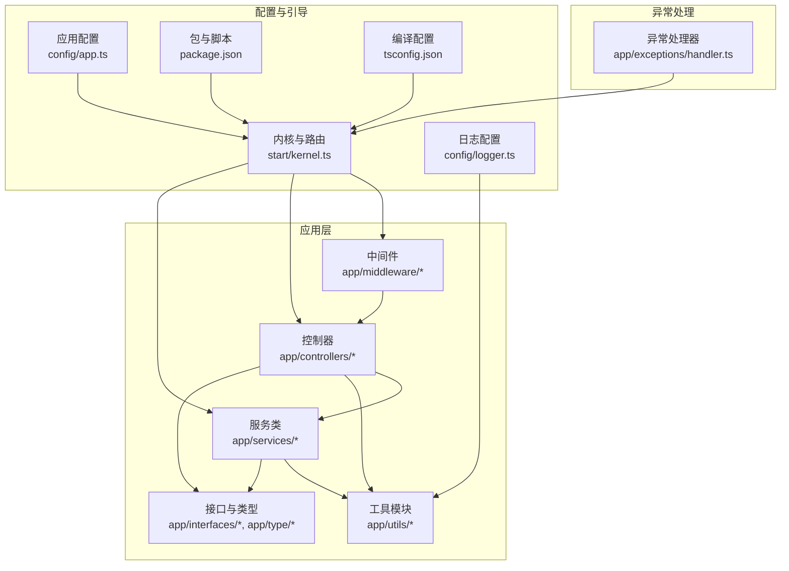
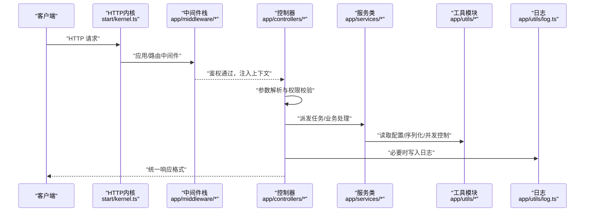
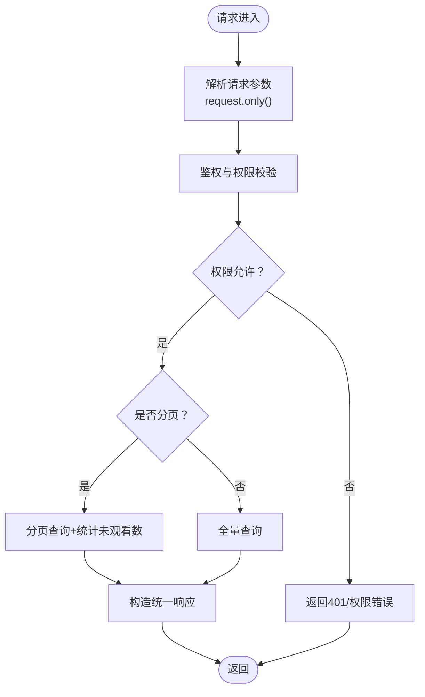
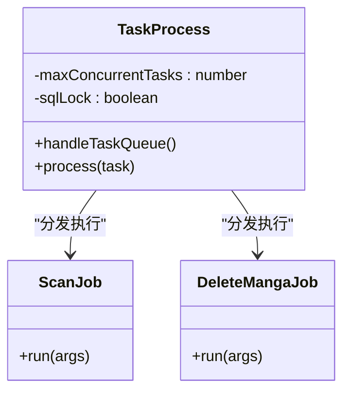
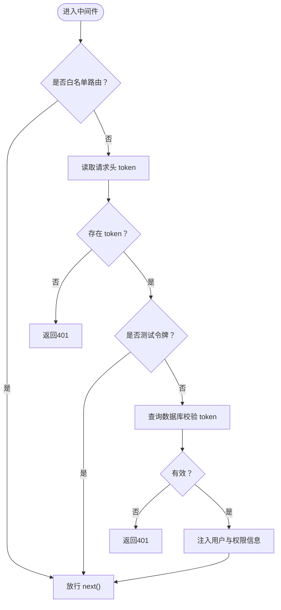
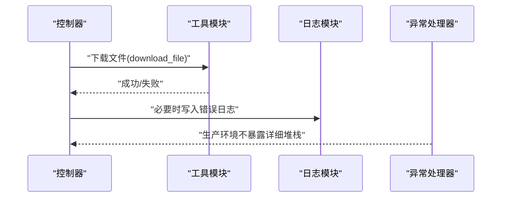
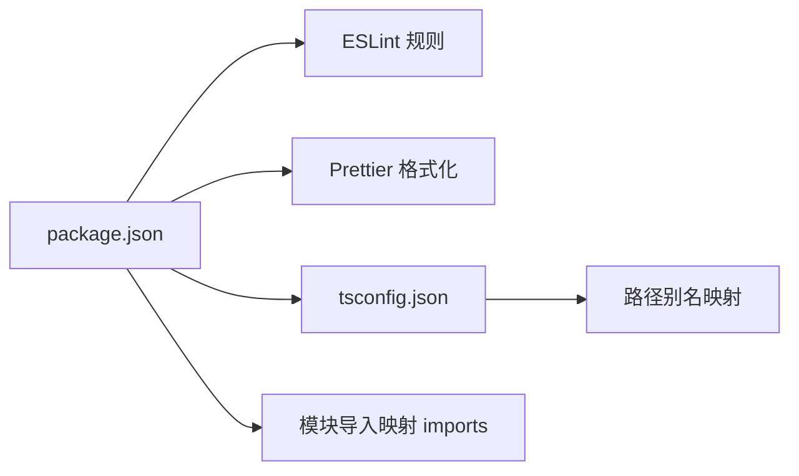

# 代码规范

<cite>
**本文引用的文件**
- [app/controllers/manga_controller.ts](file://app/controllers/manga_controller.ts)
- [app/services/task_service.ts](file://app/services/task_service.ts)
- [app/middleware/auth_middleware.ts](file://app/middleware/auth_middleware.ts)
- [app/utils/log.ts](file://app/utils/log.ts)
- [app/interfaces/response.ts](file://app/interfaces/response.ts)
- [app/type/index.ts](file://app/type/index.ts)
- [app/utils/api.ts](file://app/utils/api.ts)
- [config/app.ts](file://config/app.ts)
- [config/logger.ts](file://config/logger.ts)
- [package.json](file://package.json)
- [start/kernel.ts](file://start/kernel.ts)
- [tsconfig.json](file://tsconfig.json)
- [app/exceptions/handler.ts](file://app/exceptions/handler.ts)
- [app/utils/index.ts](file://app/utils/index.ts)
</cite>

## 目录
1. [引言](#引言)
2. [项目结构](#项目结构)
3. [核心组件](#核心组件)
4. [架构总览](#架构总览)
5. [详细组件分析](#详细组件分析)
6. [依赖关系分析](#依赖关系分析)
7. [性能考虑](#性能考虑)
8. [故障排查指南](#故障排查指南)
9. [结论](#结论)
10. [附录](#附录)

## 引言
本文件为 SManga Adonis 项目制定统一的代码规范与质量保障标准，覆盖 TypeScript 编码规范、命名约定、文件组织结构、AdonisJS 特定风格（控制器、服务类、中间件）、注释与文档、错误处理与日志记录、PR 检查清单与代码审查要点，以及性能优化与内存管理最佳实践。规范以现有代码库为依据，结合 AdonisJS 生态与项目实际进行提炼与扩展。

## 项目结构
项目采用按职责分层的组织方式：控制器负责 HTTP 请求入口与响应封装；服务类封装业务逻辑与任务调度；中间件处理鉴权与参数校验；工具模块提供通用能力；配置模块定义应用与日志行为；类型与接口模块提供强类型约束。

图表来源
- [start/kernel.ts:1-69](file://start/kernel.ts#L1-L69)
- [config/app.ts:1-41](file://config/app.ts#L1-L41)
- [config/logger.ts:1-36](file://config/logger.ts#L1-L36)
- [package.json:1-100](file://package.json#L1-L100)
- [tsconfig.json:1-41](file://tsconfig.json#L1-L41)

章节来源
- [start/kernel.ts:1-69](file://start/kernel.ts#L1-L69)
- [config/app.ts:1-41](file://config/app.ts#L1-L41)
- [config/logger.ts:1-36](file://config/logger.ts#L1-L36)
- [package.json:1-100](file://package.json#L1-L100)
- [tsconfig.json:1-41](file://tsconfig.json#L1-L41)

## 核心组件
- 控制器：统一返回格式、鉴权与权限控制、批量操作与任务派发。
- 服务类：任务队列处理、并发控制、任务执行与失败记录。
- 中间件：全局与路由级中间件注册、鉴权与权限校验。
- 工具模块：路径与配置、排序参数、JSON 序列化、日志与下载等。
- 接口与类型：统一响应结构、任务优先级与元数据键类型。
- 日志与异常：日志写入策略、错误上报与生产调试开关。

章节来源
- [app/controllers/manga_controller.ts:1-460](file://app/controllers/manga_controller.ts#L1-L460)
- [app/services/task_service.ts:1-171](file://app/services/task_service.ts#L1-L171)
- [app/middleware/auth_middleware.ts:1-87](file://app/middleware/auth_middleware.ts#L1-L87)
- [app/utils/log.ts:1-74](file://app/utils/log.ts#L1-L74)
- [app/interfaces/response.ts:1-64](file://app/interfaces/response.ts#L1-L64)
- [app/type/index.ts:1-49](file://app/type/index.ts#L1-L49)
- [app/utils/api.ts:1-178](file://app/utils/api.ts#L1-L178)
- [app/utils/index.ts:1-313](file://app/utils/index.ts#L1-L313)
- [app/exceptions/handler.ts:1-29](file://app/exceptions/handler.ts#L1-L29)

## 架构总览
下图展示请求从进入内核到控制器处理、服务执行与日志记录的整体流程。

图表来源
- [start/kernel.ts:35-49](file://start/kernel.ts#L35-L49)
- [app/middleware/auth_middleware.ts:23-85](file://app/middleware/auth_middleware.ts#L23-L85)
- [app/controllers/manga_controller.ts:13-55](file://app/controllers/manga_controller.ts#L13-L55)
- [app/services/task_service.ts:36-84](file://app/services/task_service.ts#L36-L84)
- [app/utils/log.ts:10-72](file://app/utils/log.ts#L10-L72)

## 详细组件分析

### 控制器规范（以 Manga 控制器为例）
- 统一响应：使用统一响应类封装 code、message、data、count 等字段，便于前端一致处理。
- 参数与权限：严格从请求中提取所需参数，结合用户角色与媒体权限进行访问控制。
- 分页与非分页：根据是否存在 page 字段选择不同查询策略，并在分页场景统计未观看章节数。
- 任务派发：对删除、扫描、压缩等耗时操作通过任务队列异步执行，避免阻塞请求。
- 错误处理：对不存在资源、权限不足等情况返回明确的状态码与消息。

图表来源
- [app/controllers/manga_controller.ts:13-115](file://app/controllers/manga_controller.ts#L13-L115)
- [app/interfaces/response.ts:18-63](file://app/interfaces/response.ts#L18-L63)

章节来源
- [app/controllers/manga_controller.ts:1-460](file://app/controllers/manga_controller.ts#L1-L460)
- [app/interfaces/response.ts:1-64](file://app/interfaces/response.ts#L1-L64)

### 服务类规范（任务处理）
- 并发控制：通过互斥锁与最大并发数限制，确保任务有序执行，避免数据库与文件系统竞争。
- 任务队列：按优先级排序取出待执行任务，执行成功写入成功表，失败写入失败表并保留错误信息。
- 数据一致性：任务执行前后对状态进行更新，完成后清理任务记录。
- 可扩展性：通过命令分发器扩展新任务类型，保持单一职责。

图表来源
- [app/services/task_service.ts:25-171](file://app/services/task_service.ts#L25-L171)

章节来源
- [app/services/task_service.ts:1-171](file://app/services/task_service.ts#L1-L171)

### 中间件规范（鉴权）
- 路由白名单：对无需鉴权的路由（如登录、静态文件、测试等）放行。
- Token 校验：从请求头读取 token，查询数据库验证有效性。
- 权限细化：针对用户模块与 DELETE 方法进行更严格的权限判断。
- 上下文注入：将用户信息与权限集合注入到请求上下文中，供后续控制器使用。

图表来源
- [app/middleware/auth_middleware.ts:23-85](file://app/middleware/auth_middleware.ts#L23-L85)

章节来源
- [app/middleware/auth_middleware.ts:1-87](file://app/middleware/auth_middleware.ts#L1-L87)

### 日志与错误处理
- 日志策略：生产环境写入文件，开发环境输出到控制台；日志包含类型、级别、版本与环境信息。
- 错误处理：异常处理器根据环境决定是否输出详细堆栈；统一响应体用于对外暴露结构化错误。
- 下载重试：网络下载失败时按指数退避重试并记录错误日志，防止任务中断。

图表来源
- [app/utils/api.ts:125-176](file://app/utils/api.ts#L125-L176)
- [app/utils/log.ts:60-72](file://app/utils/log.ts#L60-L72)
- [app/exceptions/handler.ts:15-27](file://app/exceptions/handler.ts#L15-L27)

章节来源
- [app/utils/log.ts:1-74](file://app/utils/log.ts#L1-L74)
- [app/utils/api.ts:1-178](file://app/utils/api.ts#L1-L178)
- [app/exceptions/handler.ts:1-29](file://app/exceptions/handler.ts#L1-L29)

## 依赖关系分析
- 包管理与脚本：通过 imports 映射简化模块导入；ESLint 与 Prettier 规范统一代码风格；TypeScript 类型检查保障安全。
- 编译与别名：tsconfig 使用路径映射与类型根目录，提升可维护性。
- 配置驱动：应用配置与日志配置通过环境变量与服务注入，便于多环境部署。

图表来源
- [package.json:16-36](file://package.json#L16-L36)
- [package.json:95-99](file://package.json#L95-L99)
- [tsconfig.json:14-28](file://tsconfig.json#L14-L28)

章节来源
- [package.json:1-100](file://package.json#L1-L100)
- [tsconfig.json:1-41](file://tsconfig.json#L1-L41)

## 性能考虑
- I/O 与并发
  - 使用互斥锁与最大并发限制控制任务执行，避免数据库与文件系统争用。
  - 对批量操作采用分页查询与并行统计，减少单次查询压力。
- 网络与缓存
  - 下载文件采用流式管道与指数退避重试，降低失败成本。
  - 统一响应体减少前端重复解析成本。
- 存储与序列化
  - SQLite 场景对 JSON 进行字符串化处理，避免类型不兼容问题。
  - 路径与配置读取按平台区分，避免跨平台路径错误。
- 内存管理
  - 流式写入与及时释放资源，避免大文件处理导致内存峰值过高。
  - 合理使用 Promise 与 async/await，避免回调地狱与悬挂引用。

章节来源
- [app/services/task_service.ts:29-84](file://app/services/task_service.ts#L29-L84)
- [app/utils/api.ts:125-176](file://app/utils/api.ts#L125-L176)
- [app/utils/index.ts:163-179](file://app/utils/index.ts#L163-L179)

## 故障排查指南
- 常见问题定位
  - 鉴权失败：检查 token 是否存在、是否命中白名单、数据库中是否存在对应用户与权限。
  - 权限不足：确认用户角色与媒体权限集合，核对 DELETE 方法与用户模块路由的限制。
  - 任务未执行：查看任务队列状态与并发上限，确认互斥锁是否被长时间占用。
  - 下载失败：查看重试次数与退避延迟，确认目标文件是否存在与网络连通性。
- 日志与异常
  - 生产环境仅记录结构化日志，开发环境开启详细堆栈以便调试。
  - 统一响应体便于前端快速识别错误类型与提示信息。

章节来源
- [app/middleware/auth_middleware.ts:23-85](file://app/middleware/auth_middleware.ts#L23-L85)
- [app/services/task_service.ts:74-169](file://app/services/task_service.ts#L74-L169)
- [app/utils/api.ts:164-170](file://app/utils/api.ts#L164-L170)
- [config/logger.ts:5-27](file://config/logger.ts#L5-L27)
- [app/exceptions/handler.ts:9-27](file://app/exceptions/handler.ts#L9-L27)

## 结论
本规范以现有代码库为基础，结合 AdonisJS 框架特性，制定了统一的编码风格、命名约定、文件组织与质量保障流程。建议团队在日常开发中严格遵循，持续通过 PR 审查与自动化检查提升代码质量与可维护性。

## 附录

### TypeScript 编码规范与命名约定
- 文件命名
  - 控制器：小驼峰，复数形式，如 manga_controller.ts
  - 服务类：小驼峰，以 Service/Job 结尾，如 task_service.ts、scan_manga_job.ts
  - 中间件：小驼峰，以 _middleware.ts 结尾，如 auth_middleware.ts
  - 工具模块：小驼峰，如 api.ts、log.ts、index.ts
- 类与接口
  - 类名：帕斯卡命名，如 TaskProcess、SResponse
  - 接口名：帕斯卡命名，如 ResponseInterface、ListResponseInterface
  - 枚举：帕斯卡命名，如 TaskPriority、SResponseCode
  - 变量与方法：小驼峰，如 handleTaskQueue、order_params
- 常量：全大写下划线，如 MAX_CONCURRENT_TASKS
- 类型别名：小驼峰，如 metaType

章节来源
- [app/type/index.ts:3-49](file://app/type/index.ts#L3-L49)
- [app/interfaces/response.ts:5-63](file://app/interfaces/response.ts#L5-L63)

### AdonisJS 特定风格
- 控制器
  - 使用 HttpContext 注入 request/response，方法名语义化（index/show/create/update/destroy）
  - 统一返回 SResponse/ListResponse
- 服务类
  - 以类封装业务，提供 handleTaskQueue/process 等公共方法
  - 任务命令通过 switch 分发，便于扩展
- 中间件
  - 在内核中注册应用与路由中间件，按需注入上下文
  - 白名单路由与权限细化分离处理

章节来源
- [app/controllers/manga_controller.ts:12-55](file://app/controllers/manga_controller.ts#L12-L55)
- [app/services/task_service.ts:25-171](file://app/services/task_service.ts#L25-L171)
- [start/kernel.ts:35-49](file://start/kernel.ts#L35-L49)

### 代码注释标准
- 函数/方法：简述用途、参数与返回值，复杂逻辑补充说明
- 类：说明职责、关键属性与方法
- 关键分支：对条件判断与边界情况给出注释
- 外部依赖：对第三方库的使用场景与注意事项进行说明

章节来源
- [app/controllers/manga_controller.ts:331-348](file://app/controllers/manga_controller.ts#L331-L348)
- [app/services/task_service.ts:16-24](file://app/services/task_service.ts#L16-L24)

### 错误处理与日志记录规范
- 统一响应：使用 SResponse/SResponseCode 提供一致的错误与成功结构
- 日志级别：info/warn/error 对应不同重要程度，生产环境写入文件
- 异常上报：开发环境输出详细堆栈，生产环境保持简洁

章节来源
- [app/interfaces/response.ts:18-63](file://app/interfaces/response.ts#L18-L63)
- [app/utils/log.ts:10-72](file://app/utils/log.ts#L10-L72)
- [config/logger.ts:12-24](file://config/logger.ts#L12-L24)
- [app/exceptions/handler.ts:9-27](file://app/exceptions/handler.ts#L9-L27)

### PR 检查清单与代码审查要点
- 代码风格
  - 通过 ESLint 与 Prettier 自动化检查
  - 类型检查通过，无未处理的 any
- 功能正确性
  - 单元测试覆盖关键路径，集成测试覆盖端到端流程
  - 对权限、分页、批量操作与任务派发进行重点验证
- 性能与健壮性
  - 并发控制与互斥锁使用合理
  - I/O 与网络请求具备超时与重试机制
- 文档与注释
  - 关键函数与复杂逻辑具备清晰注释
  - README 或变更说明完整

章节来源
- [package.json:7-14](file://package.json#L7-L14)
- [tsconfig.json:3-28](file://tsconfig.json#L3-L28)