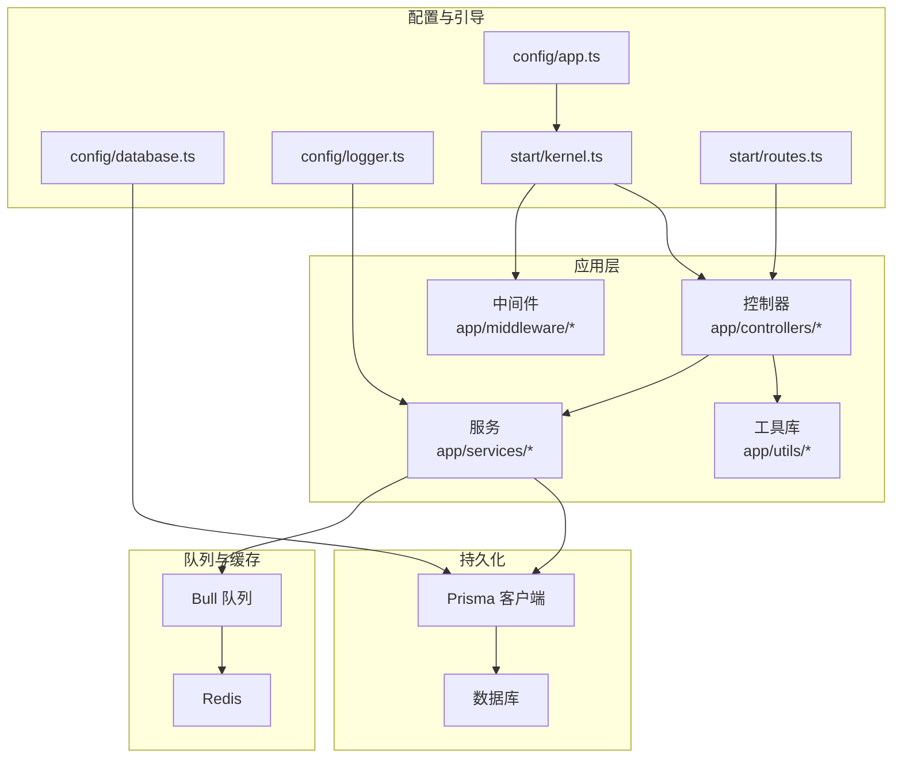
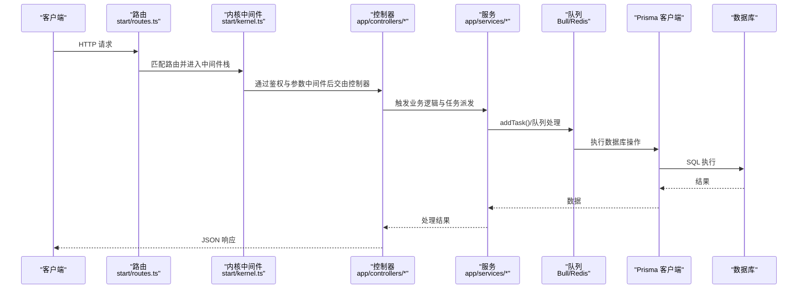
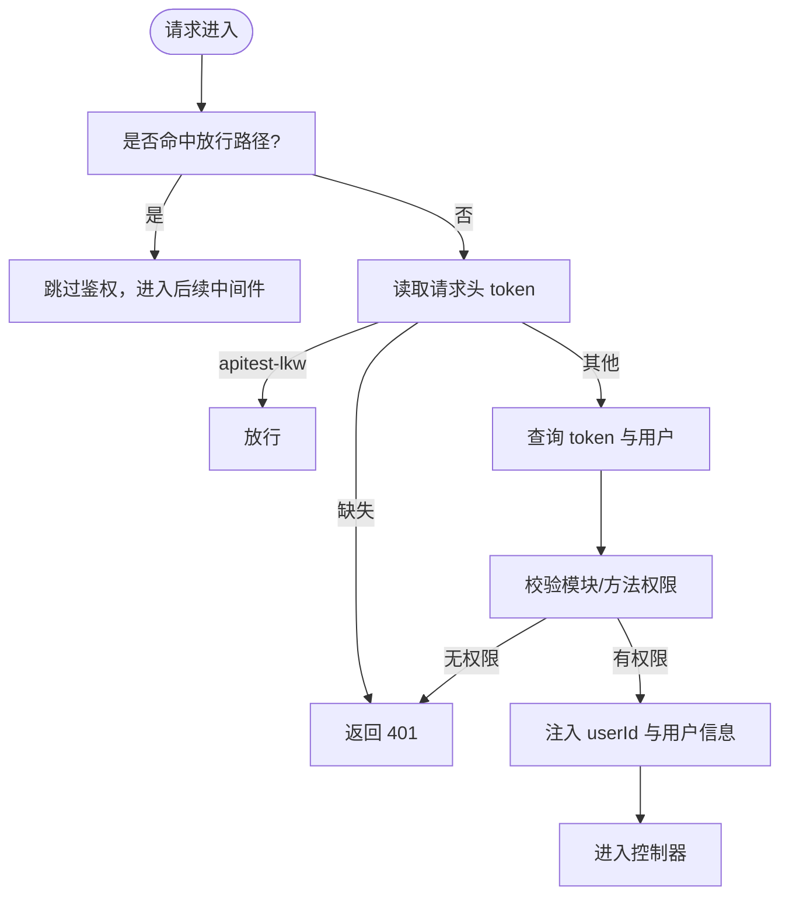
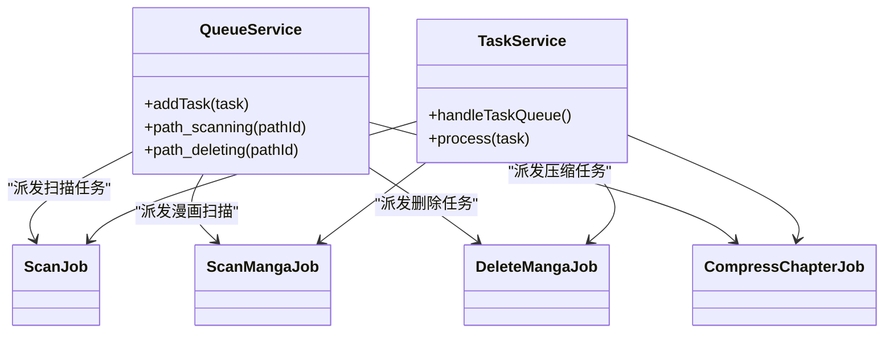
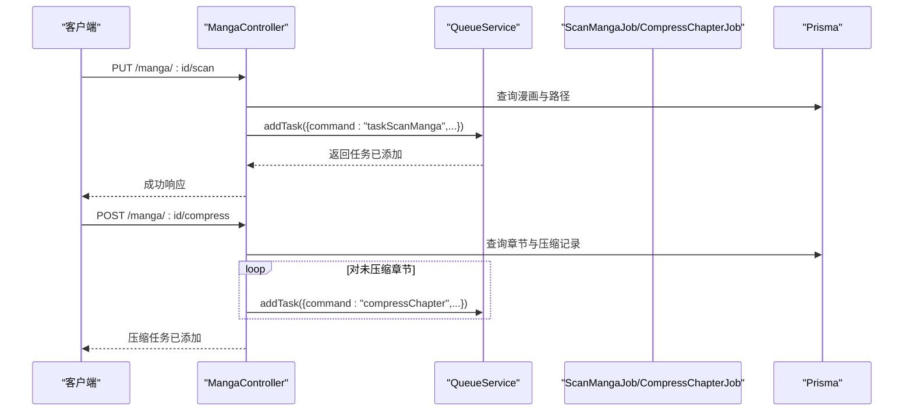
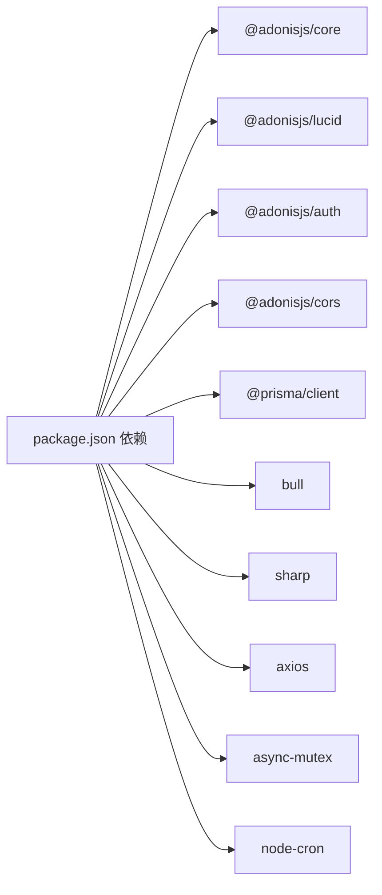

# 开发指南

<cite>
**本文引用的文件**
- [package.json](file://package.json)
- [adonisrc.ts](file://adonisrc.ts)
- [start/kernel.ts](file://start/kernel.ts)
- [start/routes.ts](file://start/routes.ts)
- [config/app.ts](file://config/app.ts)
- [config/database.ts](file://config/database.ts)
- [config/logger.ts](file://config/logger.ts)
- [app/middleware/auth_middleware.ts](file://app/middleware/auth_middleware.ts)
- [app/middleware/params_middleware.ts](file://app/middleware/params_middleware.ts)
- [app/services/queue_service.ts](file://app/services/queue_service.ts)
- [app/services/task_service.ts](file://app/services/task_service.ts)
- [app/utils/index.ts](file://app/utils/index.ts)
- [app/utils/api.ts](file://app/utils/api.ts)
- [app/controllers/manga_controller.ts](file://app/controllers/manga_controller.ts)
- [tests/bootstrap.ts](file://tests/bootstrap.ts)
</cite>

## 目录
1. [简介](#简介)
2. [项目结构](#项目结构)
3. [核心组件](#核心组件)
4. [架构总览](#架构总览)
5. [详细组件分析](#详细组件分析)
6. [依赖关系分析](#依赖关系分析)
7. [性能考虑](#性能考虑)
8. [故障排查指南](#故障排查指南)
9. [结论](#结论)
10. [附录](#附录)

## 简介
本开发指南面向 SManga Adonis 项目的开发者，提供从环境搭建、代码规范、架构设计、测试策略到性能优化与运维排障的完整指引。项目基于 AdonisJS 6，采用 TypeScript、Prisma ORM、Bull 队列与 Redis，围绕“漫画资源管理”场景构建，包含媒体库扫描、章节压缩、分享统计、同步与任务调度等能力。

## 项目结构
项目采用按职责分层的组织方式：
- app/controllers：HTTP 控制器，负责路由入口与业务编排
- app/middleware：中间件栈，统一处理鉴权、参数转换、CORS 等横切关注点
- app/services：服务层，封装任务队列、定时任务、数据库检查等
- app/utils：通用工具函数库，路径解析、日志、压缩解压、网络请求等
- config：应用配置，如 app、database、logger、cors 等
- start：启动引导，注册内核中间件、路由、初始化逻辑
- tests：测试引导与套件配置
- prisma：多数据库迁移与 schema，支持 MySQL、PostgreSQL、SQLite

图表来源
- [start/kernel.ts:1-69](file://start/kernel.ts#L1-L69)
- [start/routes.ts:1-241](file://start/routes.ts#L1-L241)
- [config/app.ts:1-41](file://config/app.ts#L1-L41)
- [config/database.ts:1-24](file://config/database.ts#L1-L24)
- [config/logger.ts:1-36](file://config/logger.ts#L1-L36)
- [app/services/queue_service.ts:1-267](file://app/services/queue_service.ts#L1-L267)

章节来源
- [package.json:1-100](file://package.json#L1-L100)
- [adonisrc.ts:1-72](file://adonisrc.ts#L1-L72)

## 核心组件
- 应用内核与中间件栈：统一注册 CORS、容器绑定、强制 JSON 响应、参数中间件与鉴权中间件
- 路由系统：集中式路由定义，按模块划分 REST 接口
- 数据访问：通过 Prisma 访问 MySQL/PG/SQLite
- 任务队列：Bull + Redis 实现扫描、删除、压缩、同步等后台任务
- 工具库：路径解析、日志、压缩解压、网络请求、延迟、排序等
- 测试框架：Japa + @japa/plugin-adonisjs，支持单元与功能测试套件

章节来源
- [start/kernel.ts:1-69](file://start/kernel.ts#L1-L69)
- [start/routes.ts:1-241](file://start/routes.ts#L1-L241)
- [config/database.ts:1-24](file://config/database.ts#L1-L24)
- [app/services/queue_service.ts:1-267](file://app/services/queue_service.ts#L1-L267)
- [app/utils/index.ts:1-313](file://app/utils/index.ts#L1-L313)
- [tests/bootstrap.ts:1-39](file://tests/bootstrap.ts#L1-L39)

## 架构总览
下图展示请求从路由进入，经中间件、控制器、服务与队列，最终落库与缓存的整体流程。

图表来源
- [start/routes.ts:1-241](file://start/routes.ts#L1-L241)
- [start/kernel.ts:1-69](file://start/kernel.ts#L1-L69)
- [app/controllers/manga_controller.ts:1-460](file://app/controllers/manga_controller.ts#L1-L460)
- [app/services/queue_service.ts:1-267](file://app/services/queue_service.ts#L1-L267)
- [config/database.ts:1-24](file://config/database.ts#L1-L24)

## 详细组件分析

### 中间件体系
- 鉴权中间件：对特定路径放行，校验请求头 token，查询用户与权限，注入用户上下文
- 参数中间件：统一将 query/body/path 中以 id 结尾或指定键的参数转换为数字类型
- CORS/容器绑定/强制 JSON：全局中间件保证跨域与响应格式一致性

图表来源
- [app/middleware/auth_middleware.ts:1-87](file://app/middleware/auth_middleware.ts#L1-L87)
- [app/middleware/params_middleware.ts:1-65](file://app/middleware/params_middleware.ts#L1-L65)

章节来源
- [start/kernel.ts:1-69](file://start/kernel.ts#L1-L69)
- [app/middleware/auth_middleware.ts:1-87](file://app/middleware/auth_middleware.ts#L1-L87)
- [app/middleware/params_middleware.ts:1-65](file://app/middleware/params_middleware.ts#L1-L65)

### 任务队列与服务
- 队列服务：定义 scan/sync/compress 三类队列，支持并发、重试、指数退避、超时控制；根据任务名自动选择队列；支持同步/异步派发
- 任务服务：基于数据库的任务表实现任务拉取、加锁、执行、成功/失败归档与清理

图表来源
- [app/services/queue_service.ts:1-267](file://app/services/queue_service.ts#L1-L267)
- [app/services/task_service.ts:1-171](file://app/services/task_service.ts#L1-L171)

章节来源
- [app/services/queue_service.ts:1-267](file://app/services/queue_service.ts#L1-L267)
- [app/services/task_service.ts:1-171](file://app/services/task_service.ts#L1-L171)

### 控制器示例：漫画控制器
- 权限校验：非管理员需满足媒体权限与模块限制
- 分页/不分页查询：支持关键词、排序、统计未观看章节数
- 业务操作：扫描漫画、编辑元数据、批量标签写入、全章节压缩、删除压缩记录
- 任务派发：通过队列服务异步执行耗时任务，保证接口快速返回

图表来源
- [app/controllers/manga_controller.ts:1-460](file://app/controllers/manga_controller.ts#L1-L460)
- [app/services/queue_service.ts:1-267](file://app/services/queue_service.ts#L1-L267)

章节来源
- [app/controllers/manga_controller.ts:1-460](file://app/controllers/manga_controller.ts#L1-L460)

### 工具函数库
- 路径与配置：跨平台路径解析、配置读写、日志写入
- 图片处理：判断图片类型、提取图片列表、首图查找
- JSON 存储：SQLite 兼容的 JSON 字段序列化/反序列化
- 延迟与排序：阻塞式延迟、通用排序参数生成
- 网络请求：Axios 封装、带重试的文件下载

章节来源
- [app/utils/index.ts:1-313](file://app/utils/index.ts#L1-L313)
- [app/utils/api.ts:1-178](file://app/utils/api.ts#L1-L178)

### 配置与启动
- 应用配置：Cookie、请求 ID、SameSite 等 HTTP 设置
- 数据库配置：支持 MySQL/PG/SQLite，迁移路径可配置
- 日志配置：开发/生产不同输出目标
- 启动内核：注册异常处理器、全局中间件、路由中间件、启动数据库检查与初始化

章节来源
- [config/app.ts:1-41](file://config/app.ts#L1-L41)
- [config/database.ts:1-24](file://config/database.ts#L1-L24)
- [config/logger.ts:1-36](file://config/logger.ts#L1-L36)
- [start/kernel.ts:1-69](file://start/kernel.ts#L1-L69)

## 依赖关系分析
- 构建与运行：AdonisJS Core、Lucid、Auth、CORS、Prisma 客户端
- 队列与可视化：Bull、bull-board
- 压缩与解压：sharp、adm-zip、node-7z、unzipper、node-unrar-js
- 并发与定时：async-mutex、node-cron
- 类型与校验：uuid、luxon、zod、Vine
- 开发工具：ESLint、Prettier、TypeScript、SWC

图表来源
- [package.json:62-88](file://package.json#L62-L88)

章节来源
- [package.json:1-100](file://package.json#L1-L100)
- [adonisrc.ts:24-35](file://adonisrc.ts#L24-L35)

## 性能考虑
- 队列并发与退避：通过队列配置控制并发、最大重试与指数退避，避免瞬时压力导致雪崩
- 数据库查询：分页与 count 并行、必要字段投影、避免 N+1 查询
- IO 优化：图片处理使用 sharp，压缩/解压使用流式处理，减少内存占用
- 缓存与日志：合理设置日志级别与输出目标，避免频繁磁盘 IO
- 任务去重：路径扫描/删除前检查队列中是否存在同路径任务，避免重复执行

章节来源
- [app/services/queue_service.ts:17-28](file://app/services/queue_service.ts#L17-L28)
- [app/services/queue_service.ts:222-232](file://app/services/queue_service.ts#L222-L232)
- [app/utils/index.ts:210-221](file://app/utils/index.ts#L210-L221)
- [app/utils/api.ts:125-176](file://app/utils/api.ts#L125-L176)

## 故障排查指南
- 鉴权失败：确认请求头 token 是否存在、是否为 apitest-lkw、数据库 token 表是否存在对应记录
- 权限不足：检查用户角色与媒体/模块权限映射，确认中间件放行规则
- 任务不执行：检查 Redis 可达性、队列配置、任务名是否匹配处理器分支
- 数据库连接：核对环境变量与数据库配置，确认迁移已执行
- 日志定位：查看日志配置与输出目标，结合请求 ID 快速定位问题

章节来源
- [app/middleware/auth_middleware.ts:23-85](file://app/middleware/auth_middleware.ts#L23-L85)
- [app/services/queue_service.ts:34-47](file://app/services/queue_service.ts#L34-L47)
- [config/database.ts:4-22](file://config/database.ts#L4-L22)
- [config/logger.ts:5-27](file://config/logger.ts#L5-L27)

## 结论
本指南提供了从环境搭建到日常开发、测试与运维的全流程建议。建议在开发中坚持“控制器薄、服务厚”的原则，将耗时与复杂逻辑下沉至服务层并通过队列异步化；严格遵循中间件的横切职责，确保鉴权与参数规范化；利用工具库统一处理 IO 与第三方交互，提升稳定性与可维护性。

## 附录

### 开发环境搭建与 IDE 配置
- 安装 Node.js 与包管理器
- 安装依赖：npm ci
- 启动 Redis（队列依赖）
- 配置数据库（MySQL/PG/SQLite），执行迁移
- 启动开发服务器：npm run dev
- IDE 插件：TypeScript、ESLint、Prettier、EditorConfig

章节来源
- [package.json:7-14](file://package.json#L7-L14)

### 调试设置与代码规范
- 调试：使用 HMR 开发模式，结合浏览器/VS Code 断点调试
- 规范：ESLint + Prettier，提交前执行 lint 与 format
- 类型检查：tsc --noEmit

章节来源
- [package.json:12-14](file://package.json#L12-L14)
- [package.json:95-99](file://package.json#L95-L99)

### 单元测试与集成测试
- 测试框架：Japa + @japa/plugin-adonisjs
- 套件：unit（短时）、functional（含 HTTP 服务）
- 引导：tests/bootstrap.ts 注册插件与 HTTP 服务

章节来源
- [tests/bootstrap.ts:1-39](file://tests/bootstrap.ts#L1-L39)
- [adonisrc.ts:56-70](file://adonisrc.ts#L56-L70)

### 贡献指南、代码审查与发布
- 提交流程：本地 lint/format/typecheck 通过后提交 PR
- 代码审查：至少一名维护者同意，确保中间件/权限/任务派发正确
- 发布：版本号在 package.json 中更新，CI/CD 自动构建与部署（如启用）

章节来源
- [package.json:7-14](file://package.json#L7-L14)

### 工具函数库使用要点
- 路径与配置：跨平台路径解析、配置读写、日志写入
- 图片处理：统一图片类型判断、递归扫描、首图提取
- JSON 存储：SQLite 兼容的序列化/反序列化
- 网络请求：统一超时、参数清洗、带重试的文件下载

章节来源
- [app/utils/index.ts:1-313](file://app/utils/index.ts#L1-L313)
- [app/utils/api.ts:1-178](file://app/utils/api.ts#L1-L178)

### 中间件开发与自定义服务
- 中间件：在 start/kernel.ts 中注册，遵循 ctx.next() 传递与错误统一返回
- 自定义服务：在 app/services 下新增，通过队列或定时器调度，注意并发与幂等

章节来源
- [start/kernel.ts:35-49](file://start/kernel.ts#L35-L49)
- [app/services/queue_service.ts:1-267](file://app/services/queue_service.ts#L1-L267)