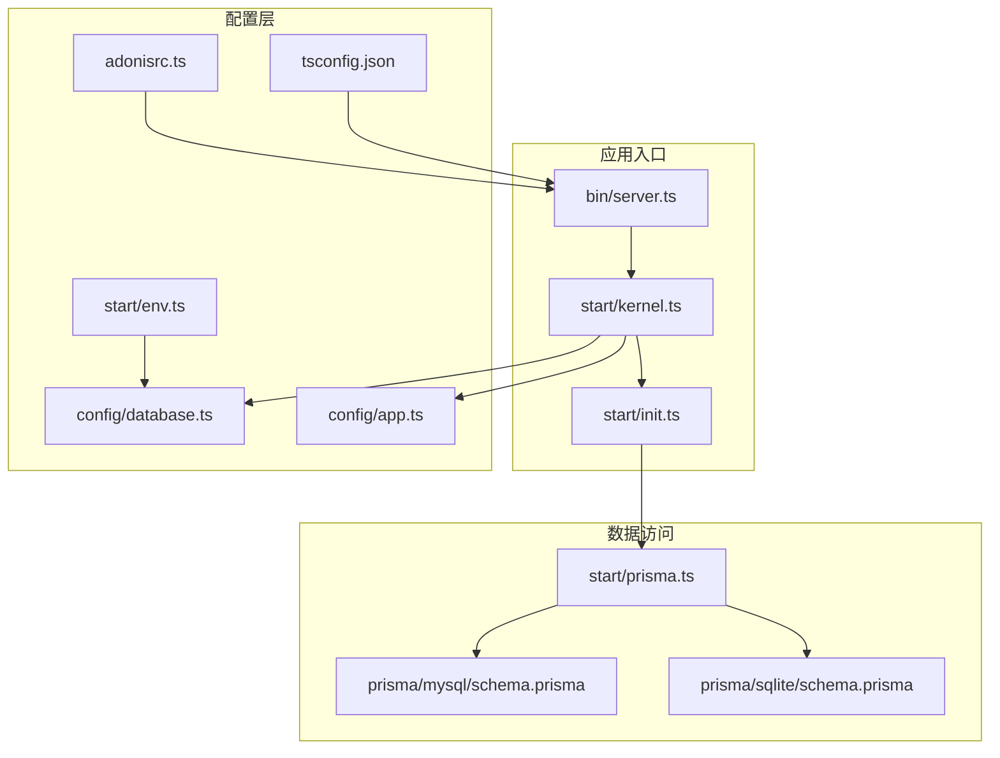
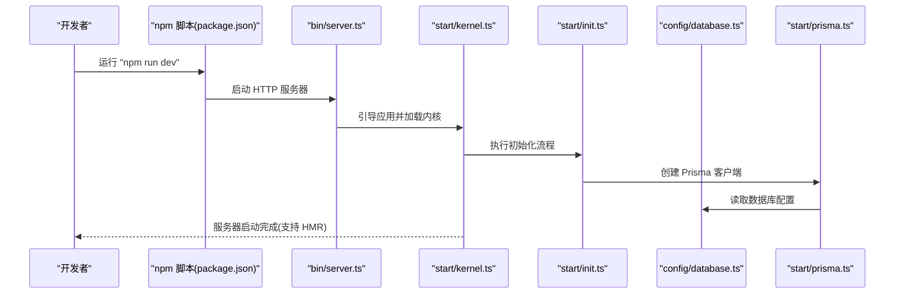
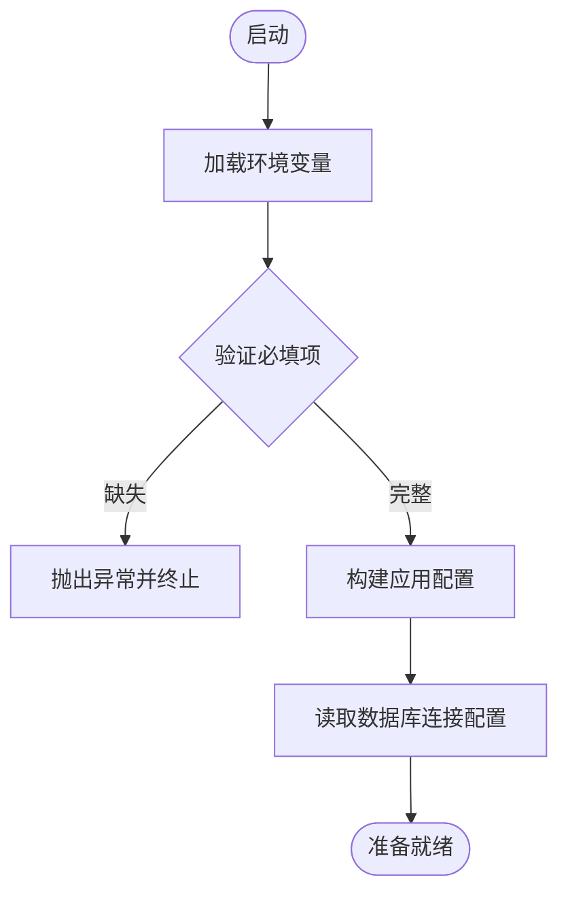
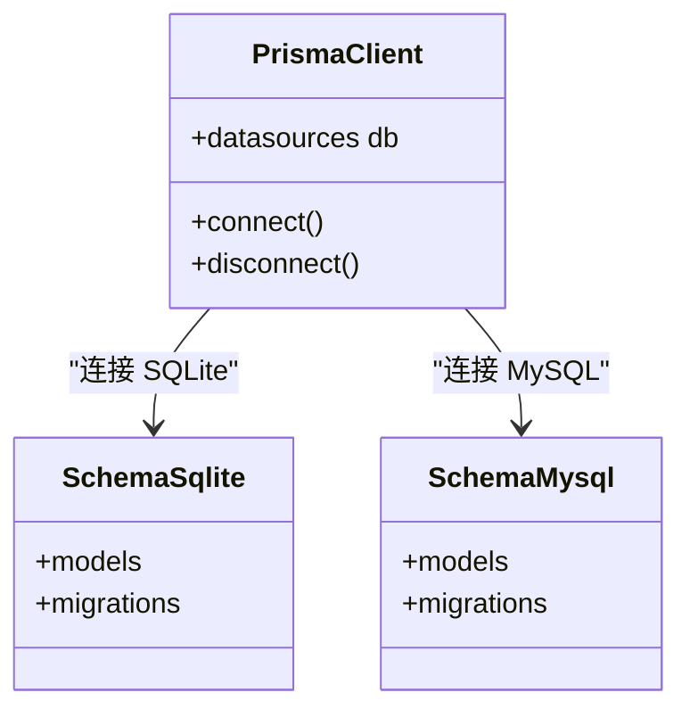
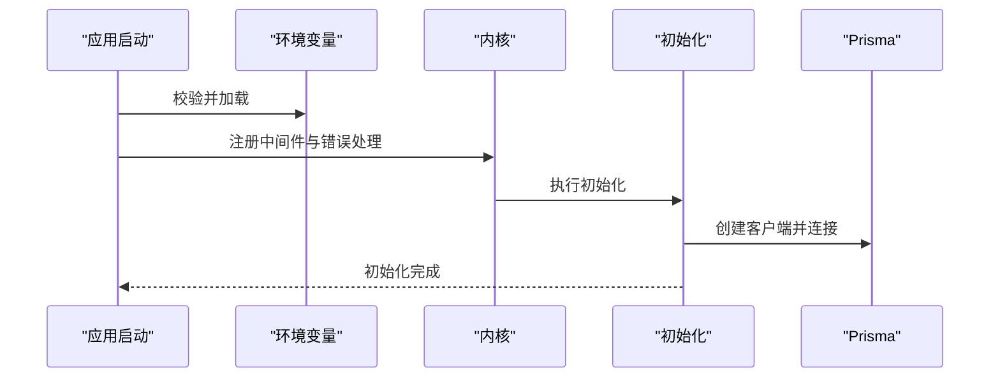
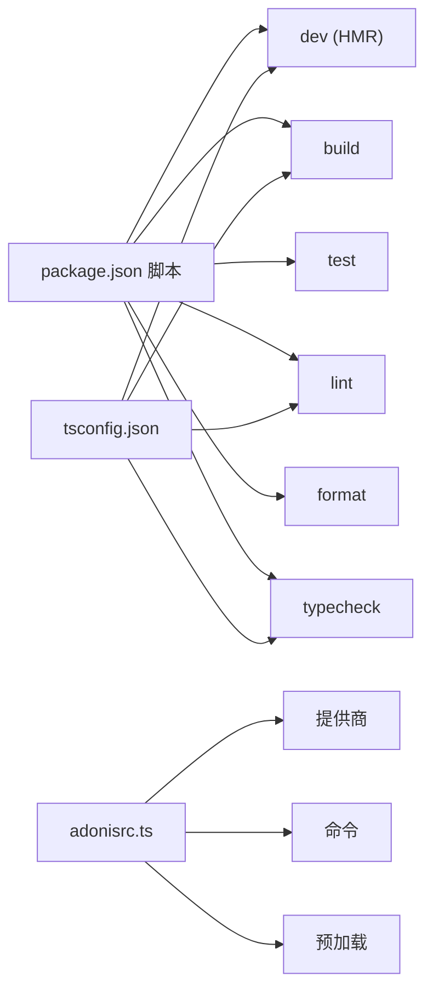

# 开发环境搭建

<cite>
**本文引用的文件**
- [package.json](file://package.json)
- [adonisrc.ts](file://adonisrc.ts)
- [tsconfig.json](file://tsconfig.json)
- [start/env.ts](file://start/env.ts)
- [config/app.ts](file://config/app.ts)
- [config/database.ts](file://config/database.ts)
- [start/prisma.ts](file://start/prisma.ts)
- [data-example/config/smanga.json](file://data-example/config/smanga.json)
- [prisma/sqlite/schema.prisma](file://prisma/sqlite/schema.prisma)
- [prisma/mysql/schema.prisma](file://prisma/mysql/schema.prisma)
- [bin/server.ts](file://bin/server.ts)
- [start/init.ts](file://start/init.ts)
- [start/kernel.ts](file://start/kernel.ts)
</cite>

## 目录
1. [简介](#简介)
2. [项目结构](#项目结构)
3. [核心组件](#核心组件)
4. [架构总览](#架构总览)
5. [详细组件分析](#详细组件分析)
6. [依赖关系分析](#依赖关系分析)
7. [性能考虑](#性能考虑)
8. [故障排查指南](#故障排查指南)
9. [结论](#结论)
10. [附录](#附录)

## 简介
本指南面向首次参与 SManga Adonis 项目的开发者，提供从零到一的完整开发环境搭建流程。内容涵盖 Node.js 版本要求、依赖安装、环境变量配置、数据库与 Redis 的本地配置、开发服务器启动与热重载、IDE 推荐设置（含 TypeScript、ESLint、Prettier），以及常见问题排查与解决方案。

## 项目结构
该项目基于 AdonisJS 6 构建，采用模块化分层组织：控制器、中间件、模型、服务、工具、配置与 Prisma 数据库迁移等。核心入口为 HTTP 服务器启动文件，应用启动时会加载环境变量、内核中间件链与初始化逻辑，并根据操作系统差异执行数据库初始化与默认配置生成。

**图表来源**
- [bin/server.ts:1-46](file://bin/server.ts#L1-L46)
- [start/kernel.ts:1-69](file://start/kernel.ts#L1-L69)
- [start/init.ts:1-253](file://start/init.ts#L1-L253)
- [adonisrc.ts:1-72](file://adonisrc.ts#L1-L72)
- [tsconfig.json:1-41](file://tsconfig.json#L1-L41)
- [start/env.ts:1-39](file://start/env.ts#L1-L39)
- [config/app.ts:1-41](file://config/app.ts#L1-L41)
- [config/database.ts:1-24](file://config/database.ts#L1-L24)
- [start/prisma.ts:1-42](file://start/prisma.ts#L1-L42)
- [prisma/sqlite/schema.prisma:1-447](file://prisma/sqlite/schema.prisma#L1-L447)
- [prisma/mysql/schema.prisma:1-449](file://prisma/mysql/schema.prisma#L1-L449)

**章节来源**
- [bin/server.ts:1-46](file://bin/server.ts#L1-L46)
- [start/kernel.ts:1-69](file://start/kernel.ts#L1-L69)
- [start/init.ts:1-253](file://start/init.ts#L1-L253)
- [adonisrc.ts:1-72](file://adonisrc.ts#L1-L72)
- [tsconfig.json:1-41](file://tsconfig.json#L1-L41)
- [start/env.ts:1-39](file://start/env.ts#L1-L39)
- [config/app.ts:1-41](file://config/app.ts#L1-L41)
- [config/database.ts:1-24](file://config/database.ts#L1-L24)
- [start/prisma.ts:1-42](file://start/prisma.ts#L1-L42)
- [prisma/sqlite/schema.prisma:1-447](file://prisma/sqlite/schema.prisma#L1-L447)
- [prisma/mysql/schema.prisma:1-449](file://prisma/mysql/schema.prisma#L1-L449)

## 核心组件
- 应用入口与启动
  - HTTP 服务器入口负责引导应用、监听信号并启动 HTTP 服务器。
  - 参考路径：[bin/server.ts:1-46](file://bin/server.ts#L1-L46)
- 内核与中间件
  - 统一注册全局与路由级中间件，定义错误处理策略。
  - 参考路径：[start/kernel.ts:1-69](file://start/kernel.ts#L1-L69)
- 初始化流程
  - 跨平台创建必要目录、生成默认配置文件、创建默认管理员账户、清理缓存、重置任务状态并注册定时任务。
  - 参考路径：[start/init.ts:1-253](file://start/init.ts#L1-L253)
- 配置系统
  - 环境变量校验与类型转换、HTTP Cookie 配置、数据库连接配置。
  - 参考路径：[start/env.ts:1-39](file://start/env.ts#L1-L39)，[config/app.ts:1-41](file://config/app.ts#L1-L41)，[config/database.ts:1-24](file://config/database.ts#L1-L24)
- 数据库与 Prisma
  - 支持 SQLite、MySQL、PostgreSQL；通过统一的 Prisma 客户端按配置动态构建连接字符串。
  - 参考路径：[start/prisma.ts:1-42](file://start/prisma.ts#L1-L42)，[prisma/sqlite/schema.prisma:1-447](file://prisma/sqlite/schema.prisma#L1-L447)，[prisma/mysql/schema.prisma:1-449](file://prisma/mysql/schema.prisma#L1-L449)
- 项目配置
  - AdonisJS 应用配置、测试套件、命令注册、提供商与预加载模块。
  - 参考路径：[adonisrc.ts:1-72](file://adonisrc.ts#L1-L72)
- TypeScript 与构建
  - 扩展官方 tsconfig，启用源码映射与路径别名，定义构建输出目录。
  - 参考路径：[tsconfig.json:1-41](file://tsconfig.json#L1-L41)
- 包管理与脚本
  - 提供 dev、build、test、lint、format、typecheck 等常用脚本。
  - 参考路径：[package.json:1-100](file://package.json#L1-L100)

**章节来源**
- [bin/server.ts:1-46](file://bin/server.ts#L1-L46)
- [start/kernel.ts:1-69](file://start/kernel.ts#L1-L69)
- [start/init.ts:1-253](file://start/init.ts#L1-L253)
- [start/env.ts:1-39](file://start/env.ts#L1-L39)
- [config/app.ts:1-41](file://config/app.ts#L1-L41)
- [config/database.ts:1-24](file://config/database.ts#L1-L24)
- [start/prisma.ts:1-42](file://start/prisma.ts#L1-L42)
- [prisma/sqlite/schema.prisma:1-447](file://prisma/sqlite/schema.prisma#L1-L447)
- [prisma/mysql/schema.prisma:1-449](file://prisma/mysql/schema.prisma#L1-L449)
- [adonisrc.ts:1-72](file://adonisrc.ts#L1-L72)
- [tsconfig.json:1-41](file://tsconfig.json#L1-L41)
- [package.json:1-100](file://package.json#L1-L100)

## 架构总览
下图展示了开发环境中的关键交互：IDE/终端触发 npm 脚本，AdonisJS 引导应用，加载环境变量与内核，初始化系统并连接数据库，最后启动 HTTP 服务器并支持热重载。

**图表来源**
- [package.json:7-14](file://package.json#L7-L14)
- [bin/server.ts:32-45](file://bin/server.ts#L32-L45)
- [start/kernel.ts:60-69](file://start/kernel.ts#L60-L69)
- [start/init.ts:63-110](file://start/init.ts#L63-L110)
- [config/database.ts:4-22](file://config/database.ts#L4-L22)
- [start/prisma.ts:7-33](file://start/prisma.ts#L7-L33)

## 详细组件分析

### 环境变量与配置
- 必需环境变量
  - NODE_ENV、PORT、APP_KEY、HOST、LOG_LEVEL、DB_HOST、DB_PORT、DB_USER、DB_PASSWORD、DB_DATABASE。
  - 参考路径：[start/env.ts:21-38](file://start/env.ts#L21-L38)
- 应用配置
  - APP_KEY 用于加密与签名；HTTP Cookie 行为与 SameSite 策略。
  - 参考路径：[config/app.ts:13-40](file://config/app.ts#L13-L40)
- 数据库配置
  - Lucid 使用 mysql2 作为客户端，连接参数来自环境变量。
  - 参考路径：[config/database.ts:4-22](file://config/database.ts#L4-L22)

**图表来源**
- [start/env.ts:21-38](file://start/env.ts#L21-L38)
- [config/app.ts:13-40](file://config/app.ts#L13-L40)
- [config/database.ts:4-22](file://config/database.ts#L4-L22)

**章节来源**
- [start/env.ts:1-39](file://start/env.ts#L1-L39)
- [config/app.ts:1-41](file://config/app.ts#L1-L41)
- [config/database.ts:1-24](file://config/database.ts#L1-L24)

### 数据库与 Prisma 集成
- 多数据库支持
  - SQLite：通过文件路径连接，适用于本地开发。
  - MySQL/PostgreSQL：通过连接字符串连接，适用于多环境部署。
  - 参考路径：[start/prisma.ts:12-24](file://start/prisma.ts#L12-L24)
- 模型与迁移
  - SQLite/MySQL 分别对应不同的 schema.prisma 文件，包含完整的数据模型定义与迁移配置。
  - 参考路径：[prisma/sqlite/schema.prisma:1-447](file://prisma/sqlite/schema.prisma#L1-L447)，[prisma/mysql/schema.prisma:1-449](file://prisma/mysql/schema.prisma#L1-L449)
- 默认配置示例
  - 提供了包含 SQL 客户端、扫描、压缩、队列等配置项的示例文件。
  - 参考路径：[data-example/config/smanga.json:1-54](file://data-example/config/smanga.json#L1-L54)

**图表来源**
- [start/prisma.ts:1-42](file://start/prisma.ts#L1-L42)
- [prisma/sqlite/schema.prisma:1-447](file://prisma/sqlite/schema.prisma#L1-L447)
- [prisma/mysql/schema.prisma:1-449](file://prisma/mysql/schema.prisma#L1-L449)

**章节来源**
- [start/prisma.ts:1-42](file://start/prisma.ts#L1-L42)
- [prisma/sqlite/schema.prisma:1-447](file://prisma/sqlite/schema.prisma#L1-L447)
- [prisma/mysql/schema.prisma:1-449](file://prisma/mysql/schema.prisma#L1-L449)
- [data-example/config/smanga.json:1-54](file://data-example/config/smanga.json#L1-L54)

### 启动流程与初始化
- 启动顺序
  - 加载环境变量 → 注册内核中间件 → 初始化系统 → 连接数据库 → 启动 HTTP 服务器。
  - 参考路径：[bin/server.ts:32-45](file://bin/server.ts#L32-L45)，[start/kernel.ts:60-69](file://start/kernel.ts#L60-L69)，[start/init.ts:63-110](file://start/init.ts#L63-L110)
- 跨平台初始化
  - Windows：自动创建目录、生成默认配置、创建默认管理员账户。
  - Linux：在 /data 下创建目录与配置文件。
  - 参考路径：[start/init.ts:185-252](file://start/init.ts#L185-L252)

**图表来源**
- [bin/server.ts:32-45](file://bin/server.ts#L32-L45)
- [start/kernel.ts:60-69](file://start/kernel.ts#L60-L69)
- [start/init.ts:63-110](file://start/init.ts#L63-L110)
- [start/prisma.ts:7-33](file://start/prisma.ts#L7-L33)

**章节来源**
- [bin/server.ts:1-46](file://bin/server.ts#L1-L46)
- [start/kernel.ts:1-69](file://start/kernel.ts#L1-L69)
- [start/init.ts:1-253](file://start/init.ts#L1-L253)
- [start/prisma.ts:1-42](file://start/prisma.ts#L1-L42)

## 依赖关系分析
- 脚本与命令
  - dev：启动开发服务器并启用 HMR。
  - build：构建项目。
  - test：运行测试。
  - lint：ESLint 检查。
  - format：Prettier 格式化。
  - typecheck：TypeScript 类型检查。
  - 参考路径：[package.json:7-14](file://package.json#L7-L14)
- TypeScript 配置
  - 继承官方 tsconfig，启用源码映射与路径别名，排除测试与构建目录。
  - 参考路径：[tsconfig.json:1-41](file://tsconfig.json#L1-L41)
- AdonisJS 配置
  - 命令、提供商、预加载与测试套件配置。
  - 参考路径：[adonisrc.ts:1-72](file://adonisrc.ts#L1-L72)

**图表来源**
- [package.json:7-14](file://package.json#L7-L14)
- [tsconfig.json:1-41](file://tsconfig.json#L1-L41)
- [adonisrc.ts:1-72](file://adonisrc.ts#L1-L72)

**章节来源**
- [package.json:1-100](file://package.json#L1-L100)
- [tsconfig.json:1-41](file://tsconfig.json#L1-L41)
- [adonisrc.ts:1-72](file://adonisrc.ts#L1-L72)

## 性能考虑
- HMR 与增量编译
  - 开发模式下启用 HMR，提升迭代效率；建议在大型项目中合理拆分模块，避免不必要的全量刷新。
- 数据库连接
  - SQLite 适合本地开发；生产或高并发场景建议使用 MySQL/PostgreSQL 并开启连接池。
- 缓存与日志
  - 启动时清理缓存可避免陈旧数据影响；合理设置日志级别以平衡可观测性与性能。
- 任务与定时器
  - 初始化阶段会重置“进行中”任务并注册定时任务，确保后台作业稳定运行。

[本节为通用指导，无需特定文件引用]

## 故障排查指南
- 环境变量缺失
  - 症状：启动时报错提示缺少必填环境变量。
  - 处理：根据 [start/env.ts:21-38](file://start/env.ts#L21-L38) 中的定义补齐 NODE_ENV、PORT、APP_KEY、DB_* 等。
- 数据库连接失败
  - 症状：无法连接数据库或迁移报错。
  - 处理：确认 [config/database.ts:4-22](file://config/database.ts#L4-L22) 中的连接参数与实际数据库一致；如使用 Prisma，请检查 [start/prisma.ts:12-24](file://start/prisma.ts#L12-L24) 的连接字符串生成逻辑。
- 启动后无响应或立即退出
  - 症状：服务器启动即退出。
  - 处理：查看 [bin/server.ts:42-45](file://bin/server.ts#L42-L45) 的错误打印；检查 [start/kernel.ts:60-69](file://start/kernel.ts#L60-L69) 的初始化是否成功。
- 权限与目录问题（Linux）
  - 症状：无法在 /data 下创建目录或写入配置。
  - 处理：确认 [start/init.ts:221-252](file://start/init.ts#L221-L252) 的目录创建逻辑与权限；必要时以 sudo 或调整权限。
- 热重载不生效
  - 症状：修改代码后页面未刷新。
  - 处理：确认 [package.json](file://package.json#L10) 中的 dev 脚本启用了 HMR；检查 [adonisrc.ts:90-94](file://adonisrc.ts#L90-L94) 的 hot-hook 边界配置是否覆盖目标文件。

**章节来源**
- [start/env.ts:21-38](file://start/env.ts#L21-L38)
- [config/database.ts:4-22](file://config/database.ts#L4-L22)
- [start/prisma.ts:12-24](file://start/prisma.ts#L12-L24)
- [bin/server.ts:42-45](file://bin/server.ts#L42-L45)
- [start/kernel.ts:60-69](file://start/kernel.ts#L60-L69)
- [start/init.ts:221-252](file://start/init.ts#L221-L252)
- [package.json:10](file://package.json#L10)
- [adonisrc.ts:90-94](file://adonisrc.ts#L90-L94)

## 结论
通过本指南，您可以在本地快速搭建 SManga Adonis 的开发环境：安装 Node.js 与依赖、配置环境变量与数据库、启动开发服务器并启用 HMR，同时结合 IDE 的 TypeScript、ESLint、Prettier 设置获得一致的编码体验。遇到问题时，可依据故障排查章节逐项定位并解决。

[本节为总结性内容，无需特定文件引用]

## 附录

### Node.js 版本要求
- 项目使用 ES Modules 与较新的语言特性，建议使用 Node.js LTS 版本（如 18.x 或 20.x）以获得最佳兼容性与性能。
- 参考路径：[package.json:1-100](file://package.json#L1-L100)

**章节来源**
- [package.json:1-100](file://package.json#L1-L100)

### 依赖安装步骤
- 安装依赖
  - 使用包管理器安装所有依赖（含开发依赖）。
  - 参考路径：[package.json:1-100](file://package.json#L1-L100)
- 构建与运行
  - 开发：npm run dev（启用 HMR）
  - 生产构建：npm run build
  - 测试：npm run test
  - 类型检查：npm run typecheck
  - 代码格式化：npm run format
  - 代码检查：npm run lint
  - 参考路径：[package.json:7-14](file://package.json#L7-L14)

**章节来源**
- [package.json:1-100](file://package.json#L1-L100)

### 环境变量配置清单
- 必填项
  - NODE_ENV、PORT、APP_KEY、HOST、LOG_LEVEL
  - DB_HOST、DB_PORT、DB_USER、DB_PASSWORD、DB_DATABASE
- 示例参考
  - [start/env.ts:21-38](file://start/env.ts#L21-L38)
  - [config/app.ts:13-40](file://config/app.ts#L13-L40)
  - [config/database.ts:4-22](file://config/database.ts#L4-L22)

**章节来源**
- [start/env.ts:21-38](file://start/env.ts#L21-L38)
- [config/app.ts:13-40](file://config/app.ts#L13-L40)
- [config/database.ts:4-22](file://config/database.ts#L4-L22)

### 数据库本地开发环境配置
- SQLite（推荐本地开发）
  - 使用文件路径连接，适合快速起步。
  - 参考路径：[start/prisma.ts:12-21](file://start/prisma.ts#L12-L21)，[prisma/sqlite/schema.prisma:1-8](file://prisma/sqlite/schema.prisma#L1-L8)
- MySQL
  - 通过连接字符串连接，适用于需要强一致性的场景。
  - 参考路径：[start/prisma.ts:12-14](file://start/prisma.ts#L12-L14)，[prisma/mysql/schema.prisma:1-8](file://prisma/mysql/schema.prisma#L1-L8)
- PostgreSQL
  - 通过连接字符串连接，适用于复杂查询与扩展需求。
  - 参考路径：[start/prisma.ts:22-24](file://start/prisma.ts#L22-L24)，[prisma/mysql/schema.prisma:1-8](file://prisma/mysql/schema.prisma#L1-L8)

**章节来源**
- [start/prisma.ts:12-24](file://start/prisma.ts#L12-L24)
- [prisma/sqlite/schema.prisma:1-8](file://prisma/sqlite/schema.prisma#L1-L8)
- [prisma/mysql/schema.prisma:1-8](file://prisma/mysql/schema.prisma#L1-L8)

### Redis 安装与配置
- 安装
  - Windows：可使用 WSL2 或官方预编译包。
  - Linux：使用发行版包管理器安装。
- 配置
  - 项目中使用 redis 依赖，具体连接参数请在环境变量或配置文件中设置（如 DB_URL_REDIS 等，视实际使用而定）。
  - 参考路径：[package.json](file://package.json#L80)

**章节来源**
- [package.json:80](file://package.json#L80)

### 开发服务器启动与热重载
- 启动
  - 使用 npm run dev 启动开发服务器并启用 HMR。
  - 参考路径：[package.json](file://package.json#L10)
- 热重载边界
  - 通过 hot-hook 配置限制热重载生效范围，提高性能与稳定性。
  - 参考路径：[package.json:89-94](file://package.json#L89-L94)，[adonisrc.ts:90-94](file://adonisrc.ts#L90-L94)

**章节来源**
- [package.json:10](file://package.json#L10)
- [package.json:89-94](file://package.json#L89-L94)
- [adonisrc.ts:90-94](file://adonisrc.ts#L90-L94)

### 调试环境设置
- 日志级别
  - 通过 LOG_LEVEL 控制日志输出，便于定位问题。
  - 参考路径：[start/env.ts](file://start/env.ts#L26)
- 错误处理
  - 统一的错误处理器由内核注册，便于捕获与格式化异常。
  - 参考路径：[start/kernel.ts](file://start/kernel.ts#L28)

**章节来源**
- [start/env.ts:26](file://start/env.ts#L26)
- [start/kernel.ts:28](file://start/kernel.ts#L28)

### IDE 推荐设置（VSCode、WebStorm 等）
- TypeScript
  - 使用项目内置 tsconfig，启用源码映射与路径别名，确保类型检查与跳转准确。
  - 参考路径：[tsconfig.json:1-41](file://tsconfig.json#L1-L41)
- ESLint
  - 使用官方配置扩展，保持团队风格一致。
  - 参考路径：[package.json:95-97](file://package.json#L95-L97)
- Prettier
  - 使用官方配置，统一代码格式。
  - 参考路径：[package.json](file://package.json#L98)

**章节来源**
- [tsconfig.json:1-41](file://tsconfig.json#L1-L41)
- [package.json:95-98](file://package.json#L95-L98)