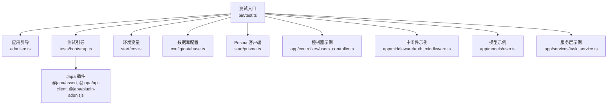
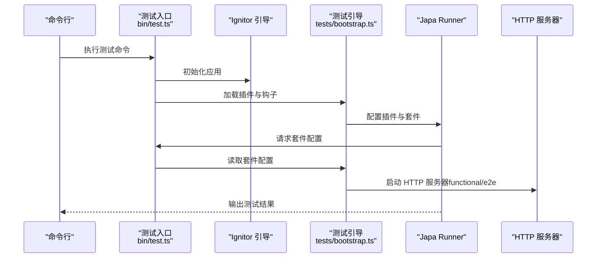
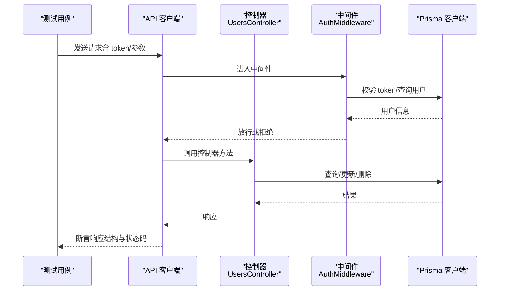
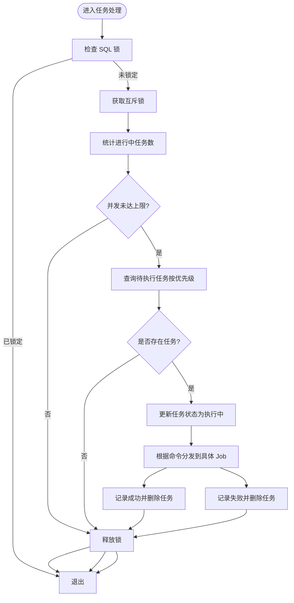
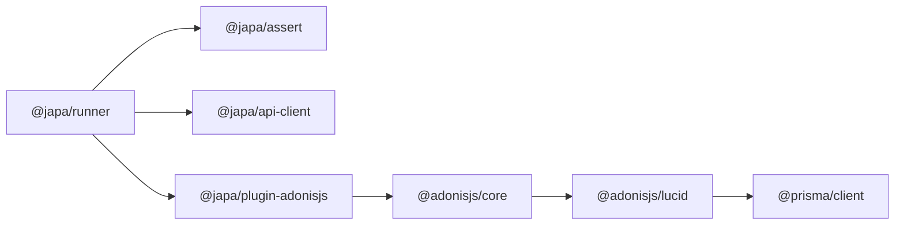

# 测试指南

<cite>
**本文引用的文件**
- [package.json](file://package.json)
- [adonisrc.ts](file://adonisrc.ts)
- [tests/bootstrap.ts](file://tests/bootstrap.ts)
- [bin/test.ts](file://bin/test.ts)
- [config/database.ts](file://config/database.ts)
- [start/env.ts](file://start/env.ts)
- [start/prisma.ts](file://start/prisma.ts)
- [app/controllers/users_controller.ts](file://app/controllers/users_controller.ts)
- [app/controllers/tests_controller.ts](file://app/controllers/tests_controller.ts)
- [app/middleware/auth_middleware.ts](file://app/middleware/auth_middleware.ts)
- [app/models/user.ts](file://app/models/user.ts)
- [app/services/task_service.ts](file://app/services/task_service.ts)
- [app/utils/index.ts](file://app/utils/index.ts)
</cite>

## 目录
1. [简介](#简介)
2. [项目结构](#项目结构)
3. [核心组件](#核心组件)
4. [架构总览](#架构总览)
5. [详细组件分析](#详细组件分析)
6. [依赖分析](#依赖分析)
7. [性能考量](#性能考量)
8. [故障排查指南](#故障排查指南)
9. [结论](#结论)
10. [附录](#附录)

## 简介
本测试指南面向 SManga Adonis 项目，系统性地阐述如何基于 AdonisJS 测试框架（Japa）编写与组织各类测试：单元测试、服务层测试、数据库操作测试、集成测试、API 测试与端到端测试。文档同时提供测试工具使用方法（Japa 插件、API 客户端、AdonisJS 插件）、测试数据准备、Mock 对象创建、测试环境配置、覆盖率要求、持续集成与自动化测试流程建议，并总结最佳实践与常见陷阱。

## 项目结构
SManga Adonis 使用 AdonisJS 核心能力与 Lucid ORM 进行开发，测试体系通过 Japa Runner 组织，按套件划分 unit 与 functional。测试入口脚本负责启动应用、加载环境变量与插件，并在 functional/e2e 套件中启动内置 HTTP 服务器。

图表来源
- [bin/test.ts:1-63](file://bin/test.ts#L1-L63)
- [adonisrc.ts:55-70](file://adonisrc.ts#L55-L70)
- [tests/bootstrap.ts:16-38](file://tests/bootstrap.ts#L16-L38)
- [start/env.ts:21-38](file://start/env.ts#L21-L38)
- [config/database.ts:4-22](file://config/database.ts#L4-L22)
- [start/prisma.ts:7-41](file://start/prisma.ts#L7-L41)
- [app/controllers/users_controller.ts:1-160](file://app/controllers/users_controller.ts#L1-L160)
- [app/middleware/auth_middleware.ts:17-87](file://app/middleware/auth_middleware.ts#L17-L87)
- [app/models/user.ts:13-33](file://app/models/user.ts#L13-L33)
- [app/services/task_service.ts:25-171](file://app/services/task_service.ts#L25-L171)

章节来源
- [adonisrc.ts:55-70](file://adonisrc.ts#L55-L70)
- [tests/bootstrap.ts:16-38](file://tests/bootstrap.ts#L16-L38)
- [bin/test.ts:13-58](file://bin/test.ts#L13-L58)

## 核心组件
- 测试入口与运行器：bin/test.ts 设置 NODE_ENV=test，引导 Ignitor 并配置 Japa Runner，加载测试引导文件。
- 测试套件：adonisrc.ts 定义 unit 与 functional 两套测试，分别匹配 tests/unit 与 tests/functional 目录。
- 插件与客户端：tests/bootstrap.ts 注册 @japa/assert 断言、@japa/api-client API 客户端与 @japa/plugin-adonisjs AdonisJS 集成插件；对 functional/e2e 套件自动启动 HTTP 服务器。
- 环境变量：start/env.ts 定义 NODE_ENV、DB_* 等环境变量校验与默认值。
- 数据库与 Prisma：config/database.ts 定义连接参数；start/prisma.ts 根据配置动态构造 PrismaClient。
- 控制器与中间件：app/controllers/users_controller.ts 展示 CRUD 与分页查询；app/middleware/auth_middleware.ts 展示鉴权与权限控制逻辑；app/models/user.ts 展示认证模型；app/services/task_service.ts 展示任务队列处理与数据库事务。

章节来源
- [bin/test.ts:13-58](file://bin/test.ts#L13-L58)
- [adonisrc.ts:55-70](file://adonisrc.ts#L55-L70)
- [tests/bootstrap.ts:16-38](file://tests/bootstrap.ts#L16-L38)
- [start/env.ts:21-38](file://start/env.ts#L21-L38)
- [config/database.ts:4-22](file://config/database.ts#L4-L22)
- [start/prisma.ts:7-41](file://start/prisma.ts#L7-L41)
- [app/controllers/users_controller.ts:8-160](file://app/controllers/users_controller.ts#L8-L160)
- [app/middleware/auth_middleware.ts:23-85](file://app/middleware/auth_middleware.ts#L23-L85)
- [app/models/user.ts:13-33](file://app/models/user.ts#L13-L33)
- [app/services/task_service.ts:36-170](file://app/services/task_service.ts#L36-L170)

## 架构总览
下图展示测试运行时序：测试入口初始化应用与插件，functional/e2e 套件启动 HTTP 服务器，随后执行测试用例。

图表来源
- [bin/test.ts:36-58](file://bin/test.ts#L36-L58)
- [tests/bootstrap.ts:34-38](file://tests/bootstrap.ts#L34-L38)

章节来源
- [bin/test.ts:36-58](file://bin/test.ts#L36-L58)
- [tests/bootstrap.ts:34-38](file://tests/bootstrap.ts#L34-L38)

## 详细组件分析

### 单元测试编写方法
- 目标：验证独立函数或小模块的行为，如工具函数、纯业务逻辑与简单服务。
- 推荐做法：
  - 将被测代码拆分为可注入依赖的函数，便于传入 Mock 输入。
  - 使用 @japa/assert 断言结果，结合 @japa/runner 的生命周期钩子进行前置/后置清理。
  - 对外部副作用（文件系统、网络）使用 Mock 或 Stub，确保测试可重复。
- 示例参考：
  - 工具函数：app/utils/index.ts 中的路径解析、JSON 序列化/反序列化、延迟函数等。
  - 认证模型：app/models/user.ts 中的密码哈希与令牌提供者。

章节来源
- [app/utils/index.ts:94-179](file://app/utils/index.ts#L94-L179)
- [app/models/user.ts:13-33](file://app/models/user.ts#L13-L33)

### 控制器测试
- 目标：验证路由行为、请求参数解析、响应结构与鉴权中间件拦截。
- 关键点：
  - 使用 @japa/api-client 发送 HTTP 请求，构造合理请求体与头部（如 token）。
  - 针对鉴权中间件，准备有效/无效 token 与用户数据，覆盖权限不足与未登录场景。
  - 分页与条件查询：构造 page/pageSize/order 参数，断言返回列表与总数。
- 示例参考：
  - 用户控制器：app/controllers/users_controller.ts 提供分页、查询、创建、更新、删除与配置读取。
  - 鉴权中间件：app/middleware/auth_middleware.ts 实现 token 校验与模块/角色权限控制。

图表来源
- [app/controllers/users_controller.ts:8-160](file://app/controllers/users_controller.ts#L8-L160)
- [app/middleware/auth_middleware.ts:23-85](file://app/middleware/auth_middleware.ts#L23-L85)
- [start/prisma.ts:7-41](file://start/prisma.ts#L7-L41)

章节来源
- [app/controllers/users_controller.ts:8-160](file://app/controllers/users_controller.ts#L8-L160)
- [app/middleware/auth_middleware.ts:23-85](file://app/middleware/auth_middleware.ts#L23-L85)
- [start/prisma.ts:7-41](file://start/prisma.ts#L7-L41)

### 服务层测试
- 目标：验证复杂业务流程与并发控制，如任务队列处理、事务与锁机制。
- 关键点：
  - 使用 @japa/plugin-adonisjs 在测试中访问应用容器与服务。
  - 对数据库操作进行隔离，必要时使用事务回滚或临时表。
  - 并发与锁：模拟高并发场景，验证互斥锁与最大并发限制。
- 示例参考：
  - 任务处理类：app/services/task_service.ts 中的任务队列调度、命令分发与成功/失败记录。

图表来源
- [app/services/task_service.ts:36-170](file://app/services/task_service.ts#L36-L170)

章节来源
- [app/services/task_service.ts:36-170](file://app/services/task_service.ts#L36-L170)

### 数据库操作测试
- 目标：验证 ORM 查询、事务、迁移与数据一致性。
- 关键点：
  - 使用 PrismaClient 连接测试数据库（建议 SQLite 或专用测试库）。
  - 在测试前导入迁移并在测试后回滚或重建，保证数据隔离。
  - 针对不同数据库客户端（MySQL/PostgreSQL/SQLite），在 start/prisma.ts 中统一构造连接。
- 示例参考：
  - 数据库配置：config/database.ts
  - Prisma 客户端：start/prisma.ts
  - 用户模型：app/models/user.ts

章节来源
- [config/database.ts:4-22](file://config/database.ts#L4-L22)
- [start/prisma.ts:7-41](file://start/prisma.ts#L7-L41)
- [app/models/user.ts:13-33](file://app/models/user.ts#L13-L33)

### 集成测试策略
- 目标：验证控制器、中间件、服务与数据库的整体协作。
- 关键点：
  - functional 套件自动启动 HTTP 服务器，适合端到端请求链路测试。
  - 使用 @japa/api-client 构造真实请求，覆盖鉴权、权限、分页、错误处理等场景。
  - 对外部依赖（如文件系统、第三方服务）进行 Mock 或使用临时目录。
- 示例参考：
  - 测试引导：tests/bootstrap.ts 中对 functional/e2e 套件启动 HTTP 服务器。

章节来源
- [tests/bootstrap.ts:34-38](file://tests/bootstrap.ts#L34-L38)

### API 测试方法
- 目标：验证接口契约、响应结构与状态码。
- 关键点：
  - 使用 @japa/api-client 发送 GET/POST/PUT/DELETE 请求，断言 JSON 响应结构与状态码。
  - 针对分页接口，断言列表长度与总数一致。
  - 针对鉴权接口，断言 401 与错误消息。
- 示例参考：
  - 用户控制器：app/controllers/users_controller.ts

章节来源
- [app/controllers/users_controller.ts:8-160](file://app/controllers/users_controller.ts#L8-L160)

### 端到端测试方法
- 目标：模拟真实用户行为，覆盖完整业务流程。
- 关键点：
  - functional/e2e 套件自动启动 HTTP 服务器，适合跨控制器与中间件的端到端验证。
  - 使用 @japa/plugin-adonisjs 访问应用容器，注入测试数据与清理。
  - 对文件上传/下载、媒体处理等场景，准备最小化测试资源与临时目录。
- 示例参考：
  - 测试入口与套件：bin/test.ts、adonisrc.ts、tests/bootstrap.ts

章节来源
- [bin/test.ts:36-58](file://bin/test.ts#L36-L58)
- [adonisrc.ts:55-70](file://adonisrc.ts#L55-L70)
- [tests/bootstrap.ts:34-38](file://tests/bootstrap.ts#L34-L38)

## 依赖分析
- 测试框架与插件：
  - @japa/runner：测试运行器与套件管理。
  - @japa/assert：断言库。
  - @japa/api-client：HTTP API 客户端。
  - @japa/plugin-adonisjs：AdonisJS 集成插件。
- 应用依赖：
  - @adonisjs/core、@adonisjs/lucid、@prisma/client。
- 开发依赖：
  - @adonisjs/assembler、@adonisjs/eslint-config、@adonisjs/prettier-config、prisma、typescript 等。

图表来源
- [package.json:42-45](file://package.json#L42-L45)
- [package.json:62-87](file://package.json#L62-L87)

章节来源
- [package.json:42-45](file://package.json#L42-L45)
- [package.json:62-87](file://package.json#L62-L87)

## 性能考量
- 测试并发与超时：
  - unit 套件超时较短，functional 较长，适配不同测试类型。
- 数据库性能：
  - 使用 SQLite 或专用测试库提升速度；批量插入/查询时注意索引与事务。
- I/O 与外部依赖：
  - 对文件系统与压缩/解压操作进行 Mock 或使用临时目录，避免真实磁盘 I/O。
- 并发控制：
  - 服务层任务处理使用互斥锁与最大并发限制，测试中需覆盖并发边界条件。

章节来源
- [adonisrc.ts:56-69](file://adonisrc.ts#L56-L69)
- [app/services/task_service.ts:29,41-51](file://app/services/task_service.ts#L29,L41-L51)

## 故障排查指南
- 环境变量缺失：
  - 确认 NODE_ENV=test、DB_HOST/DB_PORT/DB_USER/DB_DATABASE 等变量设置正确。
- 数据库连接失败：
  - 检查 config/database.ts 与 start/prisma.ts 的连接参数与数据库可用性。
- 中间件拦截：
  - 鉴权中间件会拒绝未登录或权限不足的请求，确保测试携带有效 token 或跳过相关路由。
- 测试套件无法启动：
  - 确认 tests/bootstrap.ts 中插件与套件配置正确，functional/e2e 套件已启用 HTTP 服务器。
- 任务处理异常：
  - 检查任务队列状态与互斥锁释放逻辑，确保异常分支正确记录失败并清理。

章节来源
- [start/env.ts:21-38](file://start/env.ts#L21-L38)
- [config/database.ts:4-22](file://config/database.ts#L4-L22)
- [start/prisma.ts:7-41](file://start/prisma.ts#L7-L41)
- [app/middleware/auth_middleware.ts:23-85](file://app/middleware/auth_middleware.ts#L23-L85)
- [tests/bootstrap.ts:34-38](file://tests/bootstrap.ts#L34-L38)
- [app/services/task_service.ts:74-83](file://app/services/task_service.ts#L74-L83)

## 结论
通过 Japa 与 AdonisJS 插件生态，SManga Adonis 的测试体系能够覆盖单元、集成、API 与端到端测试。建议在实际落地中明确各套件职责、完善 Mock 与测试数据准备、严格控制数据库隔离与并发边界，并结合 CI/CD 实现自动化与覆盖率监控。

## 附录

### 测试工具使用指南
- Japa 运行器与套件：通过 adonisrc.ts 配置 unit 与 functional 套件，使用 @japa/runner 执行。
- API 客户端：使用 @japa/api-client 发送 HTTP 请求，断言响应。
- AdonisJS 插件：使用 @japa/plugin-adonisjs 访问应用容器与服务。
- 断言库：使用 @japa/assert 进行断言。

章节来源
- [adonisrc.ts:55-70](file://adonisrc.ts#L55-L70)
- [tests/bootstrap.ts:16](file://tests/bootstrap.ts#L16)
- [package.json:42-45](file://package.json#L42-L45)

### 测试数据准备与 Mock
- 测试数据：
  - 使用 Prisma 在测试前导入迁移，构造最小化测试数据集。
  - 对于文件系统操作，准备临时目录与占位文件。
- Mock 对象：
  - 使用 Mock 函数替换外部依赖（如文件系统、压缩库），确保测试稳定。
  - 对中间件与服务层，使用依赖注入或容器替换实现 Mock。

章节来源
- [start/prisma.ts:7-41](file://start/prisma.ts#L7-L41)
- [app/utils/index.ts:94-179](file://app/utils/index.ts#L94-L179)

### 测试环境配置
- 环境变量：
  - NODE_ENV=test，DB_* 变量由 start/env.ts 校验。
- 数据库：
  - config/database.ts 定义连接参数；start/prisma.ts 根据配置生成 PrismaClient。
- 测试入口：
  - bin/test.ts 设置测试环境并加载插件与套件。

章节来源
- [start/env.ts:21-38](file://start/env.ts#L21-L38)
- [config/database.ts:4-22](file://config/database.ts#L4-L22)
- [start/prisma.ts:7-41](file://start/prisma.ts#L7-L41)
- [bin/test.ts:13-58](file://bin/test.ts#L13-L58)

### 测试覆盖率要求与持续集成
- 覆盖率要求（建议）：
  - 单元测试：关键业务逻辑与工具函数覆盖率不低于 80%。
  - 集成测试：控制器与服务层关键路径覆盖率不低于 70%。
  - API 测试：主要接口契约与错误场景覆盖率不低于 90%。
- 持续集成：
  - 在 CI 中执行测试套件，设置超时与失败重试策略。
  - 使用专用测试数据库，确保每次构建独立运行。
  - 将覆盖率报告上传至 CI 平台，设置阈值告警。

[本节为通用指导，无需特定文件引用]

### 自动化测试流程
- 本地开发：npm run test 执行全部测试套件。
- CI：在流水线中安装依赖、准备数据库、执行测试并生成报告。
- 规范：统一使用 Japa 插件与断言，规范测试命名与目录结构。

章节来源
- [package.json:11](file://package.json#L11)
- [bin/test.ts:13-58](file://bin/test.ts#L13-L58)

### 测试最佳实践
- 明确套件职责：unit 专注纯函数与小模块；functional/e2e 覆盖端到端链路。
- 数据隔离：每个测试独立准备与清理数据，避免共享状态。
- 外部依赖 Mock：文件系统、网络、压缩库等使用 Mock 或临时目录。
- 并发与锁：服务层测试覆盖互斥锁与并发上限场景。
- 鉴权与权限：测试 token 缺失、无效、权限不足等边界情况。

[本节为通用指导，无需特定文件引用]

### 常见测试陷阱与规避
- 忽视环境变量：确保测试环境变量齐全，避免连接失败。
- 依赖真实 I/O：尽量使用 Mock 或临时目录，减少不稳定因素。
- 数据污染：每个测试独立初始化与清理，避免跨用例干扰。
- 并发竞态：服务层测试需覆盖高并发与锁释放逻辑。
- 鉴权绕过：确保测试覆盖未登录与权限不足场景。

[本节为通用指导，无需特定文件引用]