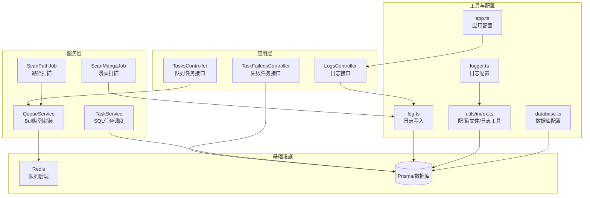
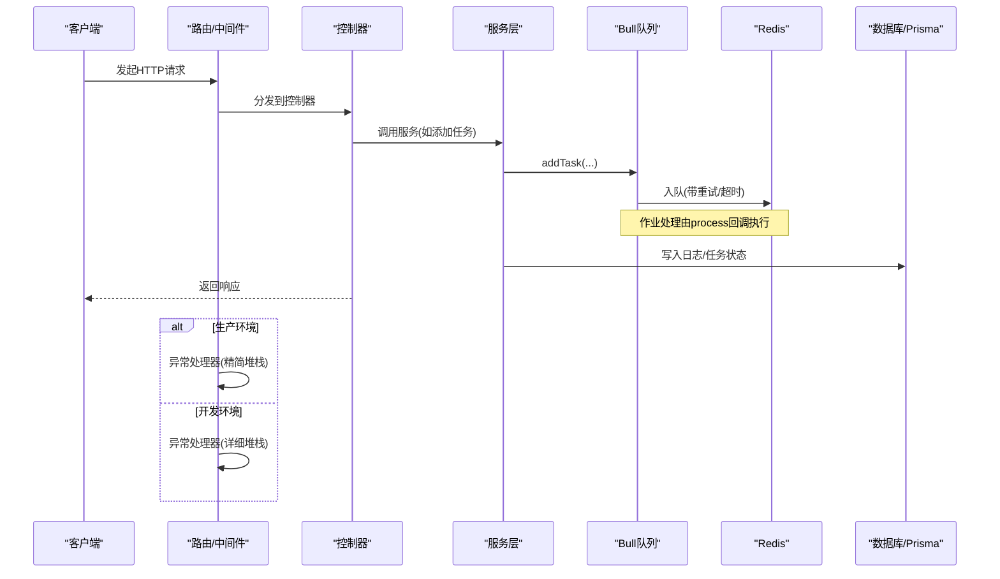
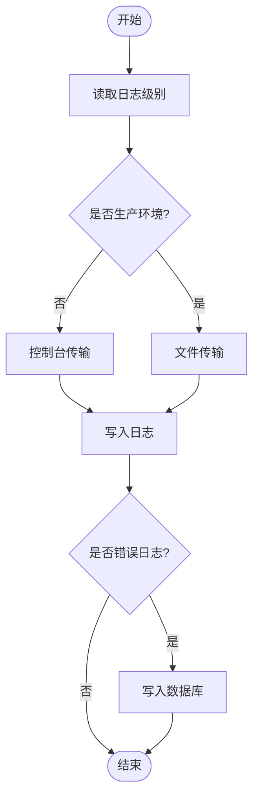
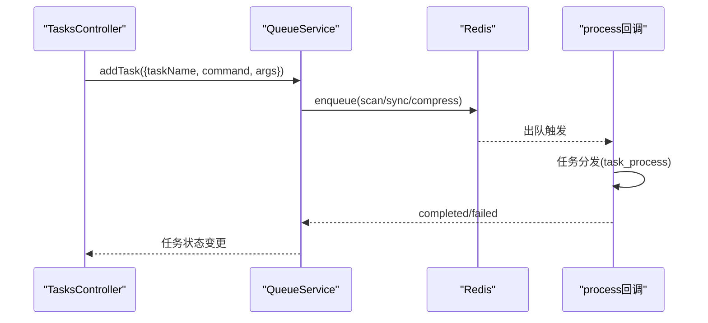
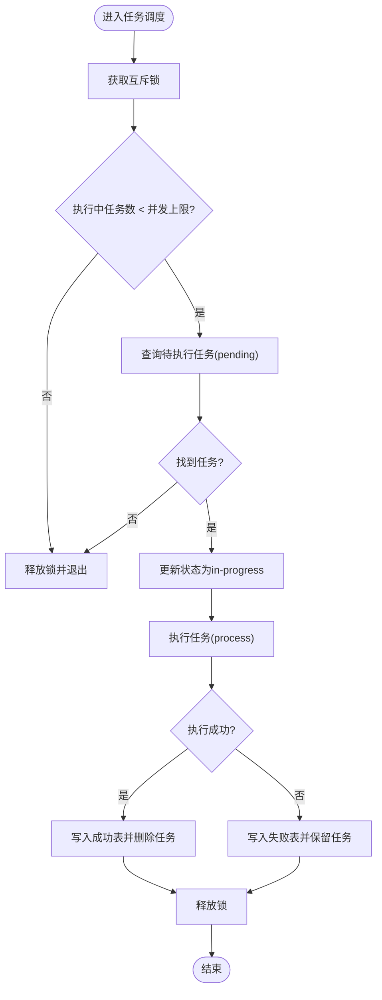
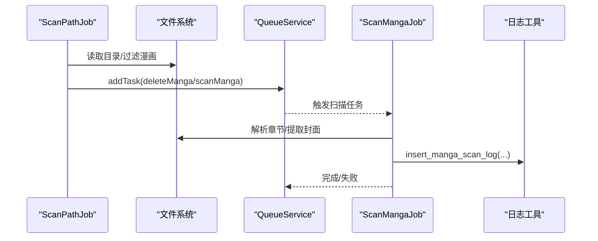
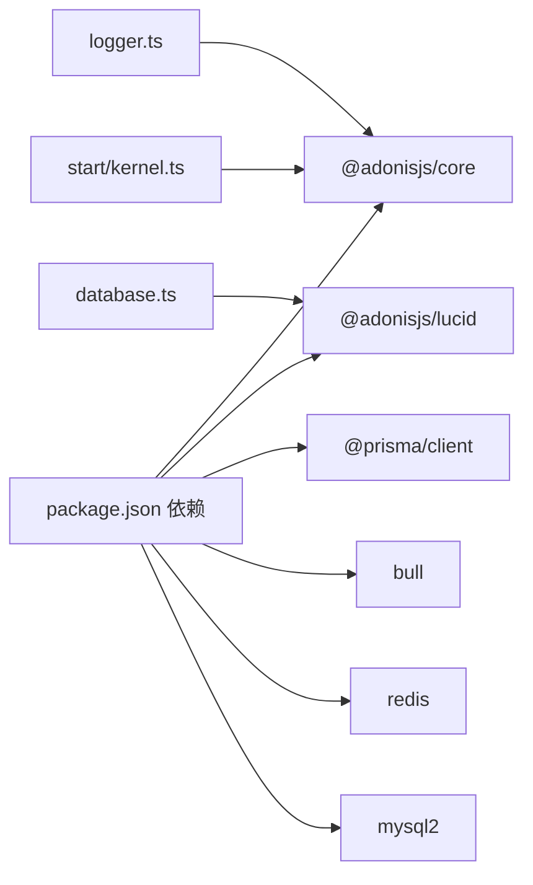
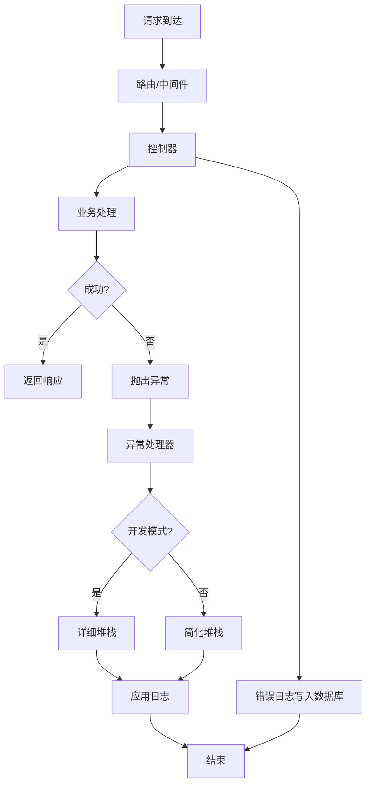

# 调试与故障排除

<cite>
**本文引用的文件**
- [app/utils/log.ts](file://app/utils/log.ts)
- [app/exceptions/handler.ts](file://app/exceptions/handler.ts)
- [config/logger.ts](file://config/logger.ts)
- [config/database.ts](file://config/database.ts)
- [app/services/queue_service.ts](file://app/services/queue_service.ts)
- [app/controllers/logs_controller.ts](file://app/controllers/logs_controller.ts)
- [app/controllers/tasks_controller.ts](file://app/controllers/tasks_controller.ts)
- [app/controllers/task_faileds_controller.ts](file://app/controllers/task_faileds_controller.ts)
- [app/services/task_service.ts](file://app/services/task_service.ts)
- [app/utils/index.ts](file://app/utils/index.ts)
- [app/services/scan_job.ts](file://app/services/scan_job.ts)
- [app/services/scan_manga_job.ts](file://app/services/scan_manga_job.ts)
- [config/app.ts](file://config/app.ts)
- [package.json](file://package.json)
- [start/kernel.ts](file://start/kernel.ts)
</cite>

## 目录
1. [简介](#简介)
2. [项目结构](#项目结构)
3. [核心组件](#核心组件)
4. [架构总览](#架构总览)
5. [详细组件分析](#详细组件分析)
6. [依赖关系分析](#依赖关系分析)
7. [性能考量](#性能考量)
8. [故障排除指南](#故障排除指南)
9. [结论](#结论)
10. [附录](#附录)

## 简介
本指南面向SManga Adonis项目的开发者与运维人员，提供系统化的调试与故障排除方法。内容覆盖：
- 开发调试技巧：断点设置、变量检查、调用栈分析与日志定位
- 日志系统：日志级别配置、自定义日志记录与错误追踪
- 常见错误类型：数据库连接失败、队列处理异常、文件处理错误等
- 性能分析：工具使用、内存泄漏检测、并发问题排查
- 生产环境诊断与紧急修复流程

## 项目结构
SManga Adonis采用AdonisJS框架，按功能模块组织代码。关键目录与职责概览：
- app/controllers：HTTP控制器，负责接收请求、调用服务层并返回响应
- app/services：业务服务与作业处理，包含队列调度、扫描与压缩等
- app/utils：通用工具函数，如日志、配置读取、文件操作等
- config：应用配置，如日志、数据库、应用键等
- start：启动引导，注册中间件、异常处理器与初始化逻辑
- prisma：数据库Schema与迁移
- tests：测试入口

**图表来源**
- [app/controllers/logs_controller.ts:1-61](file://app/controllers/logs_controller.ts#L1-L61)
- [app/controllers/tasks_controller.ts:1-55](file://app/controllers/tasks_controller.ts#L1-L55)
- [app/controllers/task_faileds_controller.ts:1-61](file://app/controllers/task_faileds_controller.ts#L1-L61)
- [app/services/queue_service.ts:1-267](file://app/services/queue_service.ts#L1-L267)
- [app/services/task_service.ts:1-171](file://app/services/task_service.ts#L1-L171)
- [app/services/scan_job.ts:1-254](file://app/services/scan_job.ts#L1-L254)
- [app/services/scan_manga_job.ts:1-800](file://app/services/scan_manga_job.ts#L1-L800)
- [app/utils/log.ts:1-74](file://app/utils/log.ts#L1-L74)
- [app/utils/index.ts:1-313](file://app/utils/index.ts#L1-L313)
- [config/logger.ts:1-36](file://config/logger.ts#L1-L36)
- [config/database.ts:1-24](file://config/database.ts#L1-L24)
- [config/app.ts:1-41](file://config/app.ts#L1-L41)

**章节来源**
- [start/kernel.ts:1-69](file://start/kernel.ts#L1-L69)
- [config/app.ts:1-41](file://config/app.ts#L1-L41)
- [config/logger.ts:1-36](file://config/logger.ts#L1-L36)
- [config/database.ts:1-24](file://config/database.ts#L1-L24)

## 核心组件
- 异常处理与调试开关
  - 异常处理器根据运行环境决定是否输出详细堆栈
  - 参考：[异常处理器:1-29](file://app/exceptions/handler.ts#L1-L29)
- 日志系统
  - 应用日志通过配置选择控制台或文件传输；错误日志同时写入数据库
  - 参考：[日志配置:1-36](file://config/logger.ts#L1-L36)、[日志工具:1-74](file://app/utils/log.ts#L1-L74)
- 队列与任务
  - 基于Bull的Redis队列，支持多队列、重试、超时与事件监听
  - 参考：[队列服务:1-267](file://app/services/queue_service.ts#L1-L267)、[任务控制器:1-55](file://app/controllers/tasks_controller.ts#L1-L55)
- SQL任务调度
  - 基于数据库的任务表，互斥锁与并发控制，失败/成功记录
  - 参考：[任务服务:1-171](file://app/services/task_service.ts#L1-L171)
- 文件与配置
  - 统一的配置读取、日志写入、文件操作与路径管理
  - 参考：[工具集:1-313](file://app/utils/index.ts#L1-L313)
- 扫描作业
  - 路径扫描与漫画扫描，生成任务并记录扫描日志
  - 参考：[路径扫描作业:1-254](file://app/services/scan_job.ts#L1-L254)、[漫画扫描作业:1-800](file://app/services/scan_manga_job.ts#L1-L800)

**章节来源**
- [app/exceptions/handler.ts:1-29](file://app/exceptions/handler.ts#L1-L29)
- [config/logger.ts:1-36](file://config/logger.ts#L1-L36)
- [app/utils/log.ts:1-74](file://app/utils/log.ts#L1-L74)
- [app/services/queue_service.ts:1-267](file://app/services/queue_service.ts#L1-L267)
- [app/controllers/tasks_controller.ts:1-55](file://app/controllers/tasks_controller.ts#L1-L55)
- [app/services/task_service.ts:1-171](file://app/services/task_service.ts#L1-L171)
- [app/utils/index.ts:1-313](file://app/utils/index.ts#L1-L313)
- [app/services/scan_job.ts:1-254](file://app/services/scan_job.ts#L1-L254)
- [app/services/scan_manga_job.ts:1-800](file://app/services/scan_manga_job.ts#L1-L800)

## 架构总览
下图展示请求与作业在系统中的流转路径，以及关键的错误与日志落点。

**图表来源**
- [start/kernel.ts:28-49](file://start/kernel.ts#L28-L49)
- [app/controllers/tasks_controller.ts:1-55](file://app/controllers/tasks_controller.ts#L1-L55)
- [app/services/queue_service.ts:1-267](file://app/services/queue_service.ts#L1-L267)
- [app/utils/log.ts:1-74](file://app/utils/log.ts#L1-L74)
- [config/logger.ts:1-36](file://config/logger.ts#L1-L36)
- [app/exceptions/handler.ts:1-29](file://app/exceptions/handler.ts#L1-L29)

## 详细组件分析

### 组件A：日志系统与错误追踪
- 日志级别与输出
  - 应用日志级别由环境变量控制；开发环境使用控制台格式化输出，生产环境写入文件
  - 参考：[日志配置:1-36](file://config/logger.ts#L1-L36)
- 自定义日志记录
  - 提供扫描日志、封面生成日志与错误日志写入数据库能力
  - 参考：[日志工具:1-74](file://app/utils/log.ts#L1-L74)
- 错误追踪
  - 控制器可查询日志与失败任务；异常处理器在开发/生产环境差异行为
  - 参考：[日志控制器:1-61](file://app/controllers/logs_controller.ts#L1-L61)、[失败任务控制器:1-61](file://app/controllers/task_faileds_controller.ts#L1-L61)、[异常处理器:1-29](file://app/exceptions/handler.ts#L1-L29)

**图表来源**
- [config/logger.ts:1-36](file://config/logger.ts#L1-L36)
- [app/utils/log.ts:1-74](file://app/utils/log.ts#L1-L74)

**章节来源**
- [config/logger.ts:1-36](file://config/logger.ts#L1-L36)
- [app/utils/log.ts:1-74](file://app/utils/log.ts#L1-L74)
- [app/controllers/logs_controller.ts:1-61](file://app/controllers/logs_controller.ts#L1-L61)
- [app/controllers/task_faileds_controller.ts:1-61](file://app/controllers/task_faileds_controller.ts#L1-L61)
- [app/exceptions/handler.ts:1-29](file://app/exceptions/handler.ts#L1-L29)

### 组件B：队列与任务处理
- 队列配置与事件
  - 支持scan/sync/compress三类队列；监听completed/failed事件；指数退避重试
  - 参考：[队列服务:1-267](file://app/services/queue_service.ts#L1-L267)
- 任务调度与去重
  - 路径扫描/删除去重；支持同步/异步模式切换；超时与最大重试
  - 参考：[队列服务:175-264](file://app/services/queue_service.ts#L175-L264)
- 任务接口
  - 查询活动/等待任务、删除单个/批量/全部任务
  - 参考：[任务控制器:1-55](file://app/controllers/tasks_controller.ts#L1-L55)

**图表来源**
- [app/controllers/tasks_controller.ts:1-55](file://app/controllers/tasks_controller.ts#L1-L55)
- [app/services/queue_service.ts:1-267](file://app/services/queue_service.ts#L1-L267)

**章节来源**
- [app/services/queue_service.ts:1-267](file://app/services/queue_service.ts#L1-L267)
- [app/controllers/tasks_controller.ts:1-55](file://app/controllers/tasks_controller.ts#L1-L55)

### 组件C：SQL任务调度与并发控制
- 互斥锁与并发上限
  - 使用互斥锁与计数器限制“执行中”任务数量，避免资源争用
  - 参考：[任务服务:25-84](file://app/services/task_service.ts#L25-L84)
- 任务执行与失败/成功记录
  - 解析命令与参数，捕获异常并写入失败表；完成后写入成功表并清理
  - 参考：[任务服务:91-170](file://app/services/task_service.ts#L91-L170)
- 与队列的协作
  - 队列作业可调用SQL任务处理流程，形成双层调度体系
  - 参考：[队列服务:103-141](file://app/services/queue_service.ts#L103-L141)

**图表来源**
- [app/services/task_service.ts:25-171](file://app/services/task_service.ts#L25-L171)

**章节来源**
- [app/services/task_service.ts:1-171](file://app/services/task_service.ts#L1-L171)
- [app/services/queue_service.ts:1-267](file://app/services/queue_service.ts#L1-L267)

### 组件D：扫描作业与文件处理
- 路径扫描
  - 读取媒体库与路径配置，过滤漫画目录，生成删除/扫描任务
  - 参考：[路径扫描作业:1-254](file://app/services/scan_job.ts#L1-L254)
- 漫画扫描
  - 解析章节、生成封面、写入元数据与日志；支持云盘与本地差异处理
  - 参考：[漫画扫描作业:1-800](file://app/services/scan_manga_job.ts#L1-L800)
- 文件与路径工具
  - 统一的配置读取、日志写入、文件遍历与封面提取
  - 参考：[工具集:1-313](file://app/utils/index.ts#L1-L313)

**图表来源**
- [app/services/scan_job.ts:1-254](file://app/services/scan_job.ts#L1-L254)
- [app/services/scan_manga_job.ts:1-800](file://app/services/scan_manga_job.ts#L1-L800)
- [app/utils/log.ts:1-74](file://app/utils/log.ts#L1-L74)

**章节来源**
- [app/services/scan_job.ts:1-254](file://app/services/scan_job.ts#L1-L254)
- [app/services/scan_manga_job.ts:1-800](file://app/services/scan_manga_job.ts#L1-L800)
- [app/utils/index.ts:1-313](file://app/utils/index.ts#L1-L313)

## 依赖关系分析
- 运行时依赖
  - AdonisJS核心、Lucid ORM、Prisma客户端、Bull队列、Redis、MySQL驱动等
  - 参考：[依赖清单:62-88](file://package.json#L62-L88)
- 配置依赖
  - 日志与数据库配置分别影响输出与数据访问
  - 参考：[日志配置:1-36](file://config/logger.ts#L1-L36)、[数据库配置:1-24](file://config/database.ts#L1-L24)
- 启动依赖
  - 异常处理器注册、中间件链、初始化逻辑
  - 参考：[启动内核:28-69](file://start/kernel.ts#L28-L69)

**图表来源**
- [package.json:62-88](file://package.json#L62-L88)
- [config/logger.ts:1-36](file://config/logger.ts#L1-L36)
- [config/database.ts:1-24](file://config/database.ts#L1-L24)
- [start/kernel.ts:28-49](file://start/kernel.ts#L28-L49)

**章节来源**
- [package.json:62-88](file://package.json#L62-L88)
- [config/logger.ts:1-36](file://config/logger.ts#L1-L36)
- [config/database.ts:1-24](file://config/database.ts#L1-L24)
- [start/kernel.ts:28-69](file://start/kernel.ts#L28-L69)

## 性能考量
- 队列并发与超时
  - 通过配置调整并发数、最大重试与超时，避免慢任务拖垮整体吞吐
  - 参考：[队列配置:18-32](file://app/services/queue_service.ts#L18-L32)
- I/O密集型优化
  - 文件扫描与解压建议结合流式处理与缓存策略，减少重复I/O
  - 参考：[漫画扫描作业:728-800](file://app/services/scan_manga_job.ts#L728-L800)
- 数据库压力
  - SQL任务并发上限与互斥锁保护，避免高并发写入导致锁竞争
  - 参考：[任务服务:25-84](file://app/services/task_service.ts#L25-L84)
- 日志开销
  - 生产环境使用文件传输，避免过多控制台输出带来的性能损耗
  - 参考：[日志配置:17-22](file://config/logger.ts#L17-L22)

[本节为通用指导，不直接分析具体文件，故无“章节来源”]

## 故障排除指南

### 1. 开发调试技巧
- 断点设置
  - 在控制器入口、服务方法关键节点、队列process回调处设置断点
  - 参考：[任务控制器:6-28](file://app/controllers/tasks_controller.ts#L6-L28)、[队列服务:103-141](file://app/services/queue_service.ts#L103-L141)
- 变量检查
  - 关注任务参数、命令与上下文对象；检查Redis队列状态与数据库记录
  - 参考：[队列服务:241-262](file://app/services/queue_service.ts#L241-L262)、[任务服务:91-130](file://app/services/task_service.ts#L91-L130)
- 调用栈分析
  - 开启开发模式以获得完整堆栈；结合日志定位异常源
  - 参考：[异常处理器:9-17](file://app/exceptions/handler.ts#L9-L17)、[日志配置:17-22](file://config/logger.ts#L17-L22)

**章节来源**
- [app/controllers/tasks_controller.ts:6-28](file://app/controllers/tasks_controller.ts#L6-L28)
- [app/services/queue_service.ts:103-141](file://app/services/queue_service.ts#L103-L141)
- [app/services/task_service.ts:91-130](file://app/services/task_service.ts#L91-L130)
- [app/exceptions/handler.ts:9-17](file://app/exceptions/handler.ts#L9-L17)
- [config/logger.ts:17-22](file://config/logger.ts#L17-L22)

### 2. 日志系统使用
- 日志级别与输出
  - 通过环境变量设置日志级别；开发环境控制台输出，生产环境文件输出
  - 参考：[日志配置:16-22](file://config/logger.ts#L16-L22)
- 自定义日志记录
  - 使用扫描日志与错误日志接口记录业务事件与异常
  - 参考：[日志工具:10-72](file://app/utils/log.ts#L10-L72)
- 错误追踪
  - 通过日志接口与失败任务接口快速定位问题
  - 参考：[日志控制器:9-22](file://app/controllers/logs_controller.ts#L9-L22)、[失败任务控制器:14-23](file://app/controllers/task_faileds_controller.ts#L14-L23)

**章节来源**
- [config/logger.ts:16-22](file://config/logger.ts#L16-L22)
- [app/utils/log.ts:10-72](file://app/utils/log.ts#L10-L72)
- [app/controllers/logs_controller.ts:9-22](file://app/controllers/logs_controller.ts#L9-L22)
- [app/controllers/task_faileds_controller.ts:14-23](file://app/controllers/task_faileds_controller.ts#L14-L23)

### 3. 常见错误类型与解决方案

- 数据库连接失败
  - 现象：应用启动或查询时报连接错误
  - 排查要点：
    - 检查数据库配置与凭据
    - 确认数据库服务可用与网络连通
  - 参考：[数据库配置:4-22](file://config/database.ts#L4-L22)
  - 解决方案：
    - 校验环境变量与连接参数；必要时启用连接池与重试

- 队列处理异常
  - 现象：任务长时间处于active/waiting或频繁failed
  - 排查要点：
    - 查看队列事件监听输出与Redis状态
    - 检查任务超时与重试配置
  - 参考：[队列服务:41-47](file://app/services/queue_service.ts#L41-L47)、[队列配置:24-32](file://app/services/queue_service.ts#L24-L32)
  - 解决方案：
    - 调整并发与超时；优化任务耗时；清理失败任务后重试

- 文件处理错误
  - 现象：扫描/解压/封面生成失败
  - 排查要点：
    - 检查路径权限、文件存在性与格式支持
    - 关注日志与失败任务记录
  - 参考：[漫画扫描作业:728-791](file://app/services/scan_manga_job.ts#L728-L791)、[工具集:181-200](file://app/utils/index.ts#L181-L200)
  - 解决方案：
    - 修正路径与权限；补充缺失的解压库；增加容错与回滚

- 并发冲突与死锁
  - 现象：任务堆积、执行缓慢或状态不一致
  - 排查要点：
    - 检查互斥锁与并发上限设置
    - 观察SQL任务与队列任务的交互
  - 参考：[任务服务:25-84](file://app/services/task_service.ts#L25-L84)、[队列服务:103-141](file://app/services/queue_service.ts#L103-L141)
  - 解决方案：
    - 合理设置并发；引入幂等设计；避免长事务

**章节来源**
- [config/database.ts:4-22](file://config/database.ts#L4-L22)
- [app/services/queue_service.ts:41-47](file://app/services/queue_service.ts#L41-L47)
- [app/services/queue_service.ts:24-32](file://app/services/queue_service.ts#L24-L32)
- [app/services/scan_manga_job.ts:728-791](file://app/services/scan_manga_job.ts#L728-L791)
- [app/utils/index.ts:181-200](file://app/utils/index.ts#L181-L200)
- [app/services/task_service.ts:25-84](file://app/services/task_service.ts#L25-L84)

### 4. 性能分析与内存泄漏检测
- 工具使用
  - 使用Node.js内置分析器与heapdump定位热点与泄漏
- 内存泄漏检测
  - 关注队列回调、文件流与数据库连接的释放
- 并发问题排查
  - 通过任务状态与日志交叉验证，识别竞态条件与死锁

[本节为通用指导，不直接分析具体文件，故无“章节来源”]

### 5. 生产环境诊断与紧急修复流程
- 快速诊断
  - 检查应用日志与错误日志；查看队列状态与失败任务
  - 参考：[日志配置:16-22](file://config/logger.ts#L16-L22)、[任务控制器:6-17](file://app/controllers/tasks_controller.ts#L6-L17)
- 紧急修复
  - 清理失败任务与堆积任务；临时降低并发；回滚可疑变更
  - 参考：[任务控制器:30-53](file://app/controllers/tasks_controller.ts#L30-L53)
- 回归验证
  - 逐步恢复并发与功能，持续观察日志与队列状态

**章节来源**
- [config/logger.ts:16-22](file://config/logger.ts#L16-L22)
- [app/controllers/tasks_controller.ts:6-17](file://app/controllers/tasks_controller.ts#L6-L17)
- [app/controllers/tasks_controller.ts:30-53](file://app/controllers/tasks_controller.ts#L30-L53)

## 结论
本指南提供了SManga Adonis从日志、队列到扫描与SQL任务的全链路调试与故障排除方法。建议在开发阶段开启详细堆栈与控制台日志，在生产阶段严格控制日志级别与输出，并建立完善的失败任务与日志查询机制，以确保问题可追踪、可定位、可修复。

[本节为总结性内容，不直接分析具体文件，故无“章节来源”]

## 附录

### A. 关键流程图：异常处理与日志落点

**图表来源**
- [start/kernel.ts:28-49](file://start/kernel.ts#L28-L49)
- [app/exceptions/handler.ts:9-17](file://app/exceptions/handler.ts#L9-L17)
- [config/logger.ts:16-22](file://config/logger.ts#L16-L22)
- [app/utils/log.ts:60-72](file://app/utils/log.ts#L60-L72)