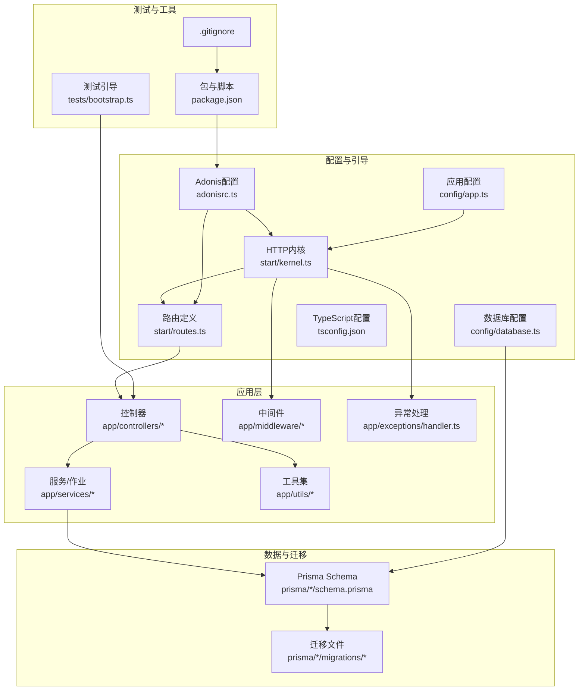
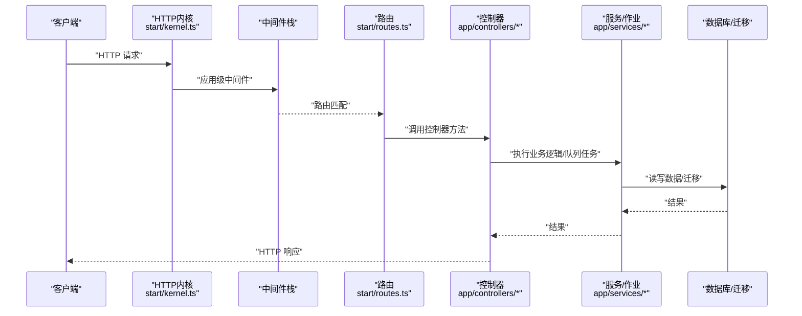
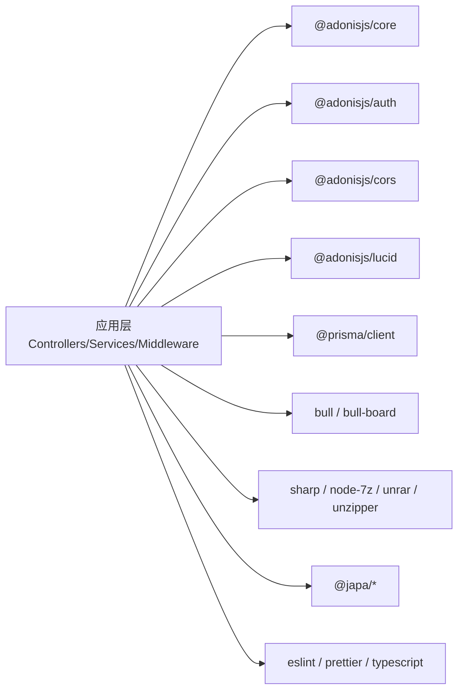

# 贡献流程

<cite>
**本文引用的文件**
- [package.json](file://package.json)
- [adonisrc.ts](file://adonisrc.ts)
- [.gitignore](file://.gitignore)
- [tsconfig.json](file://tsconfig.json)
- [start/routes.ts](file://start/routes.ts)
- [start/kernel.ts](file://start/kernel.ts)
- [config/app.ts](file://config/app.ts)
- [config/database.ts](file://config/database.ts)
- [tests/bootstrap.ts](file://tests/bootstrap.ts)
- [app/controllers/users_controller.ts](file://app/controllers/users_controller.ts)
- [app/controllers/manga_controller.ts](file://app/controllers/manga_controller.ts)
- [app/controllers/chapters_controller.ts](file://app/controllers/chapters_controller.ts)
- [app/controllers/media_controller.ts](file://app/controllers/media_controller.ts)
- [app/controllers/collects_controller.ts](file://app/controllers/collects_controller.ts)
- [app/controllers/bookmarks_controller.ts](file://app/controllers/bookmarks_controller.ts)
- [app/controllers/tasks_controller.ts](file://app/controllers/tasks_controller.ts)
- [app/controllers/syncs_controller.ts](file://app/controllers/syncs_controller.ts)
- [app/controllers/searches_controller.ts](file://app/controllers/searches_controller.ts)
- [app/controllers/shares_controller.ts](file://app/controllers/shares_controller.ts)
- [app/controllers/configs_controller.ts](file://app/controllers/configs_controller.ts)
- [app/controllers/files_controller.ts](file://app/controllers/files_controller.ts)
- [app/controllers/deploy_controller.ts](file://app/controllers/deploys_controller.ts)
- [app/controllers/logs_controller.ts](file://app/controllers/logs_controller.ts)
- [app/controllers/latests_controller.ts](file://app/controllers/latests_controller.ts)
- [app/controllers/histories_controller.ts](file://app/controllers/histories_controller.ts)
- [app/controllers/images_controller.ts](file://app/controllers/images_controller.ts)
- [app/controllers/tokens_controller.ts](file://app/controllers/tokens_controller.ts)
- [app/controllers/versions_controller.ts](file://app/controllers/versions_controller.ts)
- [app/controllers/manga_tags_controller.ts](file://app/controllers/manga_tags_controller.ts)
- [app/controllers/tags_controller.ts](file://app/controllers/tags_controller.ts)
- [app/controllers/scans_controller.ts](file://app/controllers/scans_controller.ts)
- [app/controllers/charts_controller.ts](file://app/controllers/charts_controller.ts)
- [app/controllers/metars_controller.ts](file://app/controllers/metas_controller.ts)
- [app/controllers/paths_controller.ts](file://app/controllers/paths_controller.ts)
- [app/controllers/syncs_controller.ts](file://app/controllers/syncs_controller.ts)
- [app/controllers/sync_media_job.ts](file://app/services/sync_media_job.ts)
- [app/controllers/sync_manga_job.ts](file://app/services/sync_manga_job.ts)
- [app/controllers/sync_chapter_job.ts](file://app/services/sync_chapter_job.ts)
- [app/controllers/scan_job.ts](file://app/services/scan_job.ts)
- [app/controllers/scan_manga_job.ts](file://app/services/scan_manga_job.ts)
- [app/controllers/compress_chapter_job.ts](file://app/services/compress_chapter_job.ts)
- [app/controllers/clear_compress_job.ts](file://app/services/clear_compress_job.ts)
- [app/controllers/delete_chapter_job.ts](file://app/services/delete_chapter_job.ts)
- [app/controllers/delete_manga_job.ts](file://app/services/delete_manga_job.ts)
- [app/controllers/delete_media_job.ts](file://app/services/delete_media_job.ts)
- [app/controllers/delete_path_job.ts](file://app/controllers/delete_path_job.ts)
- [app/controllers/create_media_poster_job.ts](file://app/services/create_media_poster_job.ts)
- [app/controllers/copy_poster_job.ts](file://app/services/copy_poster_job.ts)
- [app/controllers/queue_service.ts](file://app/services/queue_service.ts)
- [app/controllers/task_service.ts](file://app/services/task_service.ts)
- [app/controllers/cron_service.ts](file://app/services/cron_service.ts)
- [app/controllers/timer_service.ts](file://app/services/timer_service.ts)
- [app/controllers/database_check_service.ts](file://app/services/database_check_service.ts)
- [app/middleware/auth_middleware.ts](file://app/middleware/auth_middleware.ts)
- [app/middleware/params_middleware.ts](file://app/middleware/params_middleware.ts)
- [app/middleware/force_json_response_middleware.ts](file://app/middleware/force_json_response_middleware.ts)
- [app/middleware/container_bindings_middleware.ts](file://app/middleware/container_bindings_middleware.ts)
- [app/exceptions/handler.ts](file://app/exceptions/handler.ts)
- [app/utils/api.ts](file://app/utils/api.ts)
- [app/utils/log.ts](file://app/utils/log.ts)
- [app/utils/meta.ts](file://app/utils/meta.ts)
- [app/utils/sharp.ts](file://app/utils/sharp.ts)
- [app/utils/un7z.ts](file://app/utils/un7z.ts)
- [app/utils/unrar.ts](file://app/utils/unrar.ts)
- [app/utils/unzip.ts](file://app/utils/unzip.ts)
- [app/utils/npxShell.ts](file://app/utils/npxShell.ts)
- [app/utils/convertText.ts](file://app/utils/convertText.ts)
- [app/utils/md5.ts](file://app/utils/md5.ts)
- [app/utils/crypToJs.ts](file://app/utils/crypToJs.ts)
- [prisma/sqlite/schema.prisma](file://prisma/sqlite/schema.prisma)
- [prisma/mysql/migrations/20240817081809_init/migration.sql](file://prisma/mysql/migrations/20240817081809_init/migration.sql)
- [prisma/mysql/migrations/20250314173950_/migration.sql](file://prisma/mysql/migrations/20250314173950_/migration.sql)
- [prisma/mysql/migrations/20250805164706_source_website/migration.sql](file://prisma/mysql/migrations/20250805164706_source_website/migration.sql)
- [prisma/mysql/migrations/20250830061003_share/migration.sql](file://prisma/mysql/migrations/20250830061003_share/migration.sql)
- [prisma/mysql/migrations/20250830092435_share2/migration.sql](file://prisma/mysql/migrations/20250830092435_share2/migration.sql)
- [prisma/mysql/migrations/20250910071841_meta_chapter/migration.sql](file://prisma/mysql/migrations/20250910071841_meta_chapter/migration.sql)
- [prisma/mysql/migrations/20251120081337_is_cloud_media/migration.sql](file://prisma/mysql/migrations/20251120081337_is_cloud_media/migration.sql)
- [prisma/pgsql/schema.prisma](file://prisma/pgsql/schema.prisma)
- [prisma/pgsql/migrations/20240817084740_init/migration.sql](file://prisma/pgsql/migrations/20240817084740_init/migration.sql)
- [prisma/pgsql/migrations/20250314173757_/migration.sql](file://prisma/pgsql/migrations/20250314173757_/migration.sql)
- [prisma/pgsql/migrations/20250805164608_source_website/migration.sql](file://prisma/pgsql/migrations/20250805164608_source_website/migration.sql)
- [prisma/pgsql/migrations/20250830070912_share/migration.sql](file://prisma/pgsql/migrations/20250830070912_share/migration.sql)
- [prisma/pgsql/migrations/20250830092637_share2/migration.sql](file://prisma/pgsql/migrations/20250830092637_share2/migration.sql)
- [prisma/pgsql/migrations/20250910072030_meta_chapter/migration.sql](file://prisma/pgsql/migrations/20250910072030_meta_chapter/migration.sql)
- [prisma/pgsql/migrations/20251120114453_is_cloud_media/migration.sql](file://prisma/pgsql/migrations/20251120114453_is_cloud_media/migration.sql)
</cite>

## 目录
1. 引言
2. 项目结构
3. 核心组件
4. 架构总览
5. 详细组件分析
6. 依赖关系分析
7. 性能考量
8. 故障排查指南
9. 结论
10. 附录

## 引言
本指南面向希望为 SManga Adonis 贡献代码与内容的开发者，覆盖从本地环境准备、Git 工作流、分支策略、提交规范，到 Pull Request（PR）流程、代码审查与合并标准；同时给出 Issue 报告模板、Bug 反馈格式、功能请求流程；以及版本发布、变更日志维护与向后兼容性注意事项。此外，还提供社区贡献指南、行为准则、沟通渠道，以及贡献者许可协议与知识产权相关事项的建议。

## 项目结构
SManga Adonis 是基于 AdonisJS 6 的服务端应用，采用 TypeScript 开发，使用 Prisma 进行数据库建模与迁移，内置 Bull 队列处理异步任务，提供 REST 风格的 API 接口，并通过 Ace 命令行工具管理构建、开发与测试。

图表来源
- [start/kernel.ts:1-69](file://start/kernel.ts#L1-L69)
- [start/routes.ts:1-241](file://start/routes.ts#L1-L241)
- [config/app.ts:1-41](file://config/app.ts#L1-L41)
- [config/database.ts:1-24](file://config/database.ts#L1-L24)
- [adonisrc.ts:1-72](file://adonisrc.ts#L1-L72)
- [tsconfig.json:1-41](file://tsconfig.json#L1-L41)
- [tests/bootstrap.ts:1-39](file://tests/bootstrap.ts#L1-L39)
- [package.json:1-100](file://package.json#L1-L100)
- [.gitignore:1-29](file://.gitignore#L1-L29)
- [prisma/sqlite/schema.prisma](file://prisma/sqlite/schema.prisma)
- [prisma/mysql/migrations/20240817081809_init/migration.sql](file://prisma/mysql/migrations/20240817081809_init/migration.sql)

章节来源
- [package.json:1-100](file://package.json#L1-L100)
- [adonisrc.ts:1-72](file://adonisrc.ts#L1-L72)
- [.gitignore:1-29](file://.gitignore#L1-L29)
- [tsconfig.json:1-41](file://tsconfig.json#L1-L41)
- [start/routes.ts:1-241](file://start/routes.ts#L1-L241)
- [start/kernel.ts:1-69](file://start/kernel.ts#L1-L69)
- [config/app.ts:1-41](file://config/app.ts#L1-L41)
- [config/database.ts:1-24](file://config/database.ts#L1-L24)
- [tests/bootstrap.ts:1-39](file://tests/bootstrap.ts#L1-L39)

## 核心组件
- 控制器：负责接收请求、参数校验、调用服务层并返回响应。项目按业务域划分控制器，如用户、漫画、章节、媒体、收藏、标签、同步、分享、任务等。
- 服务/作业：封装业务逻辑与后台任务，如扫描、压缩、同步、队列与定时任务等。
- 中间件：统一处理跨域、JSON 强制响应、参数解析、鉴权等。
- 异常处理：集中捕获异常并转换为标准 HTTP 响应。
- 数据模型与迁移：使用 Prisma 管理多数据库（SQLite/MySQL/PostgreSQL）模式与迁移。
- 测试：基于 Japa Runner，支持单元与功能测试套件。
- 构建与开发：通过 Ace 命令行工具与 npm scripts 管理开发、构建、测试与类型检查。

章节来源
- [start/routes.ts:1-241](file://start/routes.ts#L1-L241)
- [app/middleware/auth_middleware.ts](file://app/middleware/auth_middleware.ts)
- [app/middleware/params_middleware.ts](file://app/middleware/params_middleware.ts)
- [app/middleware/force_json_response_middleware.ts](file://app/middleware/force_json_response_middleware.ts)
- [app/middleware/container_bindings_middleware.ts](file://app/middleware/container_bindings_middleware.ts)
- [app/exceptions/handler.ts](file://app/exceptions/handler.ts)
- [prisma/sqlite/schema.prisma](file://prisma/sqlite/schema.prisma)
- [tests/bootstrap.ts:1-39](file://tests/bootstrap.ts#L1-L39)
- [package.json:7-14](file://package.json#L7-L14)

## 架构总览
下图展示请求从 HTTP 内核进入，经由中间件栈与路由映射到控制器，控制器调用服务层执行业务逻辑，必要时访问数据库或触发队列任务。

图表来源
- [start/kernel.ts:35-49](file://start/kernel.ts#L35-L49)
- [start/routes.ts:10-241](file://start/routes.ts#L10-L241)
- [config/database.ts:4-22](file://config/database.ts#L4-L22)

## 详细组件分析

### Git 工作流程与分支策略
- 分支命名
  - 功能开发：feature/主题简述
  - 修复缺陷：fix/问题简述
  - 文档更新：docs/主题简述
  - 破坏性变更：breaking/说明
- 合并与保护
  - 主分支受保护，禁止直接推送，必须通过 PR 合并。
  - PR 必须通过 CI、测试与代码审查后方可合并。
- 提交规范
  - 类型：feat、fix、docs、style、refactor、perf、test、build、ci、chore、revert
  - 范围：可选，如 controller、service、db、deps
  - 描述：简洁明确，避免冗长
  - 示例：feat(controller): 新增用户登录接口
- 提交前检查
  - 运行类型检查、格式化与 Lint
  - 运行测试，确保新增/修改代码通过单元与功能测试
  - 本地构建验证（可选）

章节来源
- [package.json:11-14](file://package.json#L11-L14)
- [tests/bootstrap.ts:56-70](file://tests/bootstrap.ts#L56-L70)

### Pull Request 创建流程
- 准备
  - 基于最新主分支创建特性分支
  - 确保本地已通过类型检查、格式化、Lint 与测试
- 创建 PR
  - 使用模板填写标题与描述，关联 Issue
  - 选择合适的审查者
- 审查与反馈
  - 审查者关注：代码质量、测试覆盖率、性能影响、安全性、可维护性
  - 修改后重新推送，保持提交历史整洁
- 合并
  - 通过 CI 与测试
  - 至少一名审查者批准
  - 合并后清理分支

章节来源
- [tests/bootstrap.ts:56-70](file://tests/bootstrap.ts#L56-L70)
- [package.json:11-14](file://package.json#L11-L14)

### 代码审查要求与合并标准
- 代码质量
  - 符合 ESLint 与 Prettier 规范
  - 类型安全，无未使用的变量/导入
- 可测试性
  - 单元测试覆盖核心逻辑
  - 功能测试覆盖关键场景
- 可维护性
  - 逻辑清晰、注释充分
  - 避免重复代码与过深嵌套
- 安全性
  - 输入校验与权限控制
  - 避免敏感信息泄露
- 合并标准
  - 无阻塞性审查意见
  - CI 与测试全部通过
  - 代码风格与规范一致

章节来源
- [package.json:95-98](file://package.json#L95-L98)
- [tests/bootstrap.ts:16](file://tests/bootstrap.ts#L16)

### Issue 报告模板与 Bug 反馈格式
- 模板字段
  - 标题：简明扼要描述问题
  - 环境：操作系统、Node 版本、AdonisJS 版本、数据库类型与版本
  - 复现步骤：最小可复现步骤
  - 预期行为：期望的结果
  - 实际行为：实际出现的问题
  - 日志：关键错误日志与堆栈
  - 截图/录屏：有助于定位问题的可视化材料
- Bug 分类
  - 类型：功能异常、性能问题、安全问题、兼容性问题
  - 严重程度：轻微、一般、严重、阻断
- 关联 PR/提交
  - 若已有修复方案，附上 PR 链接

章节来源
- [app/utils/log.ts](file://app/utils/log.ts)
- [app/exceptions/handler.ts](file://app/exceptions/handler.ts)

### 功能请求流程
- 在创建 Issue 前先搜索是否已有类似需求
- 描述背景、目标与预期收益
- 提供可行的技术方案与风险评估
- 讨论通过后可由贡献者认领实现

章节来源
- [start/routes.ts:1-241](file://start/routes.ts#L1-L241)

### 版本发布流程、变更日志与向后兼容性
- 版本号
  - 遵循语义化版本（主.次.补丁）
  - 破坏性变更提升主版本
- 发布前检查
  - 所有测试通过
  - 文档更新（如有）
  - 变更日志更新（按类别汇总）
- 发布步骤
  - 更新版本号（package.json）
  - 提交并打标签
  - 推送标签触发 CI 发布制品
- 变更日志维护
  - 区分：新增、改进、修复、破坏性变更
  - 附带影响范围与迁移指引（如适用）
- 向后兼容性
  - 尽量避免破坏性变更
  - 对不可避免的变更提供迁移脚本与过渡期

章节来源
- [package.json:2-4](file://package.json#L2-L4)

### 社区贡献指南、行为准则与沟通渠道
- 行为准则
  - 尊重与包容，禁止骚扰与歧视
  - 建设性反馈，聚焦问题而非人身攻击
- 沟通渠道
  - GitHub Issues：Bug 与功能请求
  - Discussions：设计讨论与路线规划
  - 邮件/即时通讯群组：日常协作（如建立）
- 贡献方式
  - 编码贡献：遵循上述流程
  - 文档贡献：改进 README、指南与 API 文档
  - 测试与反馈：提供真实场景下的测试用例与反馈

章节来源
- [start/routes.ts:1-241](file://start/routes.ts#L1-L241)

### 贡献者许可协议与知识产权
- 贡献者许可协议（CLA）
  - 建议引入 CLA，明确贡献代码的授权条款与知识产权归属
  - 个人贡献者需签署，企业贡献者由授权代表签署
- 知识产权
  - 默认保留作者权利，贡献代码默认以项目许可证开放
  - 明确第三方依赖的许可证兼容性（当前项目为 UNLICENSED，注意合规）
- 知识产权限制
  - 不得贡献侵犯第三方版权/专利的内容
  - 遵守开源许可证条款（如 GPL、BSD、MIT 等）

章节来源
- [package.json:6](file://package.json#L6)

## 依赖关系分析
- 应用框架与核心
  - AdonisJS Core、Auth、CORS、Lucid（数据库 ORM）、Vine（验证）
- 数据库与迁移
  - Prisma 客户端与多数据库适配（MySQL、PostgreSQL、SQLite）
- 队列与任务
  - Bull/Bull-Board 队列与可视化面板
- 压缩与图像处理
  - Sharp、node-7z、unrar、unzipper
- 工具与开发
  - ESLint、Prettier、TypeScript、Japa 测试框架

图表来源
- [package.json:62-88](file://package.json#L62-L88)
- [adonisrc.ts:24-35](file://adonisrc.ts#L24-L35)

章节来源
- [package.json:62-88](file://package.json#L62-L88)
- [adonisrc.ts:24-35](file://adonisrc.ts#L24-L35)

## 性能考量
- 队列与并发
  - 使用 Bull 管理后台任务，合理设置并发与重试策略
  - 对耗时操作（扫描、压缩、同步）进行分片与限流
- 数据库
  - 使用 Prisma 查询优化与索引设计
  - 迁移时避免长时间锁表
- 缓存与压缩
  - 利用 Redis 缓存热点数据
  - 图像处理使用 Sharp 并限制并发
- 监控与日志
  - 统一日志格式与级别，便于问题定位
  - 关键路径埋点与告警

## 故障排查指南
- 启动失败
  - 检查环境变量与数据库连接配置
  - 查看异常处理输出与日志
- 路由无法访问
  - 确认路由注册与中间件顺序
  - 检查 CORS 与鉴权中间件
- 数据库问题
  - 确认 Prisma 连接字符串与迁移状态
  - 检查迁移文件完整性与顺序
- 队列不执行
  - 检查 Redis 可用性与队列服务初始化
  - 查看任务监听器与作业实现

章节来源
- [config/database.ts:4-22](file://config/database.ts#L4-L22)
- [app/exceptions/handler.ts](file://app/exceptions/handler.ts)
- [app/utils/log.ts](file://app/utils/log.ts)
- [app/services/queue_service.ts](file://app/services/queue_service.ts)

## 结论
本指南提供了从开发到发布的完整贡献流程，强调了规范化的提交、严格的测试与审查、清晰的变更管理与社区协作机制。遵循上述流程可显著提升代码质量与协作效率，保障项目长期健康发展。

## 附录

### API 路由概览（按模块）
- 用户与认证：用户列表、详情、创建、更新、删除；令牌、配置
- 收藏与书签：收藏/取消收藏漫画与章节；批量管理
- 历史与最近阅读：章节阅读状态、批量标记
- 媒体库：媒体增删改查、封面处理、扫描
- 路径管理：路径增删改查、扫描与重新扫描
- 标签与漫画标签：标签 CRUD、漫画标签关联
- 漫画与章节：漫画增删改查、扫描、元数据编辑、压缩与解压
- 任务与同步：任务查询/删除、同步规则增删改查与执行
- 搜索：漫画与章节搜索
- 分享：分享管理与统计分析
- 文件与部署：资源文件与数据库部署检查
- 配置：服务端与用户配置读取与设置

章节来源
- [start/routes.ts:10-241](file://start/routes.ts#L10-L241)