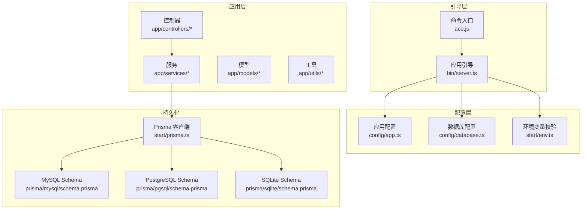
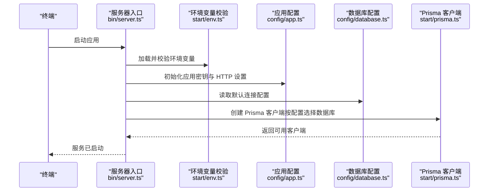
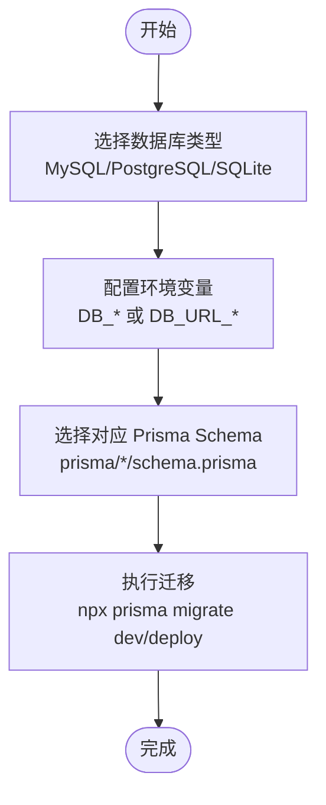
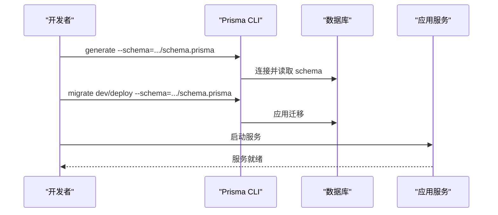
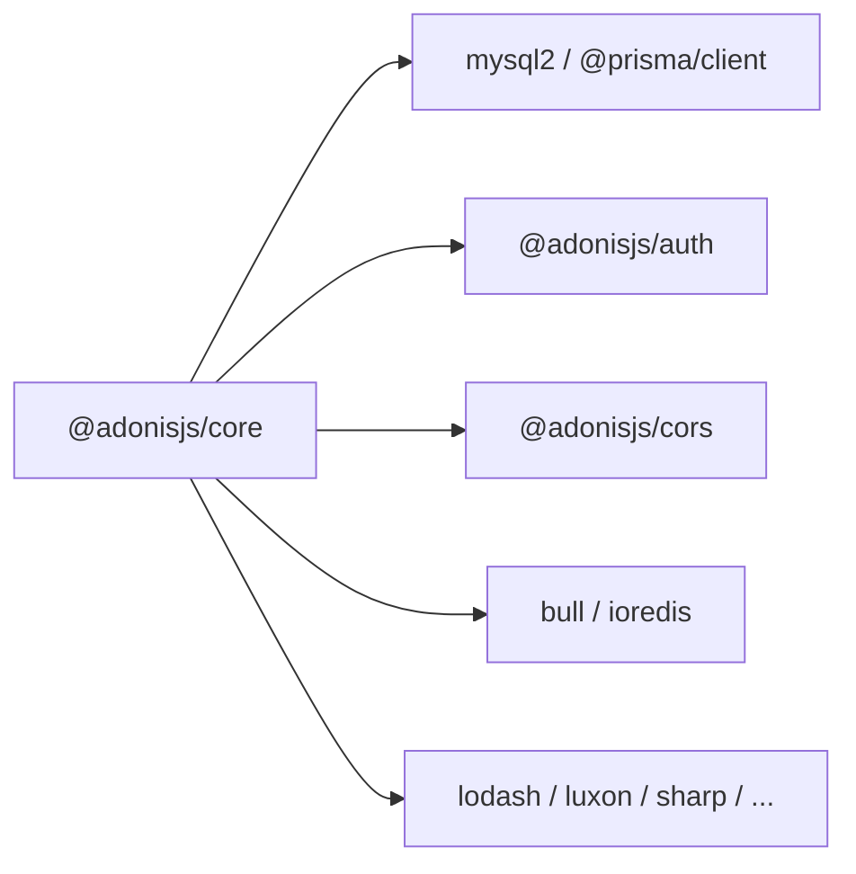

# 快速开始

<cite>
**本文引用的文件**
- [package.json](file://package.json)
- [adonisrc.ts](file://adonisrc.ts)
- [config/app.ts](file://config/app.ts)
- [config/database.ts](file://config/database.ts)
- [start/env.ts](file://start/env.ts)
- [bin/server.ts](file://bin/server.ts)
- [start/prisma.ts](file://start/prisma.ts)
- [prisma/mysql/schema.prisma](file://prisma/mysql/schema.prisma)
- [prisma/pgsql/schema.prisma](file://prisma/pgsql/schema.prisma)
- [prisma/sqlite/schema.prisma](file://prisma/sqlite/schema.prisma)
- [data-example/config/smanga.json](file://data-example/config/smanga.json)
- [start-redis.bat](file://start-redis.bat)
- [app/services/database_check_service.ts](file://app/services/database_check_service.ts)
- [ace.js](file://ace.js)
</cite>

## 目录
1. [简介](#简介)
2. [项目结构](#项目结构)
3. [核心组件](#核心组件)
4. [架构总览](#架构总览)
5. [详细组件分析](#详细组件分析)
6. [依赖关系分析](#依赖关系分析)
7. [性能注意事项](#性能注意事项)
8. [故障排除指南](#故障排除指南)
9. [结论](#结论)
10. [附录](#附录)

## 简介
本指南面向首次接触 SManga Adonis 的用户，帮助你在本地快速完成安装与启动，涵盖以下内容：
- Node.js 版本要求与环境准备
- 依赖安装与构建
- 数据库设置（MySQL、PostgreSQL、SQLite 三选一）
- Redis 配置与队列服务
- 环境变量与配置文件
- 启动流程（数据库迁移、服务启动、基础功能验证）
- 常见问题与排错
- 简单 API 调用示例

## 项目结构
该项目基于 AdonisJS 6 构建，采用模块化分层组织，核心目录与职责如下：
- app：控制器、模型、中间件、服务、工具等业务代码
- config：应用配置（应用密钥、HTTP、数据库、日志等）
- prisma：多数据库模式的 Prisma Schema 与迁移
- start：应用引导、路由、内核、环境变量校验
- data-example：示例配置文件（smanga.json）
- bin：服务器入口与控制台命令入口
- tests：测试套件配置

图表来源
- [bin/server.ts:12-45](file://bin/server.ts#L12-L45)
- [start/env.ts:21-38](file://start/env.ts#L21-L38)
- [config/app.ts:1-41](file://config/app.ts#L1-L41)
- [config/database.ts:4-22](file://config/database.ts#L4-L22)
- [start/prisma.ts:7-33](file://start/prisma.ts#L7-L33)
- [prisma/mysql/schema.prisma:1-8](file://prisma/mysql/schema.prisma#L1-L8)
- [prisma/pgsql/schema.prisma:1-8](file://prisma/pgsql/schema.prisma#L1-L8)
- [prisma/sqlite/schema.prisma:1-8](file://prisma/sqlite/schema.prisma#L1-L8)
- [ace.js:22-28](file://ace.js#L22-L28)

章节来源
- [package.json:1-100](file://package.json#L1-L100)
- [adonisrc.ts:1-72](file://adonisrc.ts#L1-L72)
- [bin/server.ts:12-45](file://bin/server.ts#L12-L45)
- [start/env.ts:21-38](file://start/env.ts#L21-L38)
- [config/app.ts:1-41](file://config/app.ts#L1-L41)
- [config/database.ts:4-22](file://config/database.ts#L4-L22)
- [start/prisma.ts:7-33](file://start/prisma.ts#L7-L33)
- [prisma/mysql/schema.prisma:1-8](file://prisma/mysql/schema.prisma#L1-L8)
- [prisma/pgsql/schema.prisma:1-8](file://prisma/pgsql/schema.prisma#L1-L8)
- [prisma/sqlite/schema.prisma:1-8](file://prisma/sqlite/schema.prisma#L1-L8)
- [ace.js:22-28](file://ace.js#L22-L28)

## 核心组件
- 应用引导与启动
  - 服务器入口负责加载环境、注册应用并启动 HTTP 服务器
  - 参考路径：[bin/server.ts:12-45](file://bin/server.ts#L12-L45)
- 环境变量与配置
  - 环境变量在启动前进行校验与类型转换
  - 应用密钥用于 Cookie 加密、签名 URL 等
  - 参考路径：[start/env.ts:21-38](file://start/env.ts#L21-L38)，[config/app.ts:13-13](file://config/app.ts#L13-L13)
- 数据库配置
  - Lucid 默认使用 mysql2 连接器，支持 MySQL；Prisma 提供多数据库 Schema
  - 参考路径：[config/database.ts:4-22](file://config/database.ts#L4-L22)，[start/prisma.ts:7-33](file://start/prisma.ts#L7-L33)
- 命令入口
  - ace.js 注册 ts-node/esm 并导入 bin/console.js，便于执行 Ace 命令
  - 参考路径：[ace.js:22-28](file://ace.js#L22-L28)

章节来源
- [bin/server.ts:12-45](file://bin/server.ts#L12-L45)
- [start/env.ts:21-38](file://start/env.ts#L21-L38)
- [config/app.ts:13-13](file://config/app.ts#L13-L13)
- [config/database.ts:4-22](file://config/database.ts#L4-L22)
- [start/prisma.ts:7-33](file://start/prisma.ts#L7-L33)
- [ace.js:22-28](file://ace.js#L22-L28)

## 架构总览
下图展示了从启动到数据库访问的关键交互：

图表来源
- [bin/server.ts:32-41](file://bin/server.ts#L32-L41)
- [start/env.ts:21-38](file://start/env.ts#L21-L38)
- [config/app.ts:13-40](file://config/app.ts#L13-L40)
- [config/database.ts:4-22](file://config/database.ts#L4-L22)
- [start/prisma.ts:7-33](file://start/prisma.ts#L7-L33)

## 详细组件分析

### 安装与环境准备
- Node.js 版本要求
  - 项目使用 ES Modules 与 TypeScript，建议使用长期支持版 LTS（如 20.x 或更高）
  - 依赖中包含 Bull 队列与 ioredis，要求 Node.js 版本满足其引擎约束
- 依赖安装
  - 使用包管理器安装依赖后，可直接运行开发或生产命令
  - 参考脚本定义：[package.json:7-14](file://package.json#L7-L14)
- 构建与开发
  - 开发模式：热更新监听
  - 生产构建：预编译打包
  - 参考路径：[package.json:7-14](file://package.json#L7-L14)

章节来源
- [package.json:7-14](file://package.json#L7-L14)

### 数据库设置（MySQL、PostgreSQL、SQLite）
- 选择一种数据库并在配置中启用
  - MySQL：Lucid 默认连接器，Prisma 提供对应 schema
  - PostgreSQL：Prisma 提供对应 schema
  - SQLite：Prisma 提供对应 schema
- 配置方式
  - 方式一：通过环境变量（推荐）
    - Lucid 连接器使用 DB_HOST、DB_PORT、DB_USER、DB_PASSWORD、DB_DATABASE
    - Prisma 通过 DB_URL_MYSQL/DB_URL_POSTGRESQL/DB_URL_SQLITE 指定连接串
    - 参考路径：[config/database.ts:4-22](file://config/database.ts#L4-L22)，[start/env.ts:33-37](file://start/env.ts#L33-L37)
  - 方式二：通过示例配置文件（非生产）
    - data-example/config/smanga.json 中 sql.client 指定数据库类型
    - 参考路径：[data-example/config/smanga.json:2-11](file://data-example/config/smanga.json#L2-L11)
- Prisma Schema 与迁移
  - 三个数据库的 schema 文件位于 prisma/{mysql|pgsql|sqlite}/schema.prisma
  - 迁移文件位于 prisma/{mysql|pgsql|sqlite}/migrations
  - 参考路径：
    - [prisma/mysql/schema.prisma:1-8](file://prisma/mysql/schema.prisma#L1-L8)
    - [prisma/pgsql/schema.prisma:1-8](file://prisma/pgsql/schema.prisma#L1-L8)
    - [prisma/sqlite/schema.prisma:1-8](file://prisma/sqlite/schema.prisma#L1-L8)

图表来源
- [config/database.ts:4-22](file://config/database.ts#L4-L22)
- [start/env.ts:33-37](file://start/env.ts#L33-L37)
- [prisma/mysql/schema.prisma:1-8](file://prisma/mysql/schema.prisma#L1-L8)
- [prisma/pgsql/schema.prisma:1-8](file://prisma/pgsql/schema.prisma#L1-L8)
- [prisma/sqlite/schema.prisma:1-8](file://prisma/sqlite/schema.prisma#L1-L8)

章节来源
- [config/database.ts:4-22](file://config/database.ts#L4-L22)
- [start/env.ts:33-37](file://start/env.ts#L33-L37)
- [prisma/mysql/schema.prisma:1-8](file://prisma/mysql/schema.prisma#L1-L8)
- [prisma/pgsql/schema.prisma:1-8](file://prisma/pgsql/schema.prisma#L1-L8)
- [prisma/sqlite/schema.prisma:1-8](file://prisma/sqlite/schema.prisma#L1-L8)

### Redis 配置与队列服务
- 组件与用途
  - 项目使用 Bull 队列与 ioredis 进行任务队列处理
  - Redis 用于存储队列状态与任务数据
- 启动 Redis
  - 提供 Windows 批处理脚本 start-redis.bat，自动检测并启动 redis-server.exe
  - 参考路径：[start-redis.bat:1-42](file://start-redis.bat#L1-L42)
- 运行时连接
  - 项目通过 redis 包与 Bull 集成，无需额外配置即可使用
  - 参考路径：[package.json:72-80](file://package.json#L72-L80)

章节来源
- [start-redis.bat:1-42](file://start-redis.bat#L1-L42)
- [package.json:72-80](file://package.json#L72-L80)

### 环境变量与配置文件
- 必需环境变量
  - NODE_ENV、PORT、HOST、LOG_LEVEL
  - 数据库相关：DB_HOST、DB_PORT、DB_USER、DB_PASSWORD、DB_DATABASE
  - 应用密钥：APP_KEY
  - 参考路径：[start/env.ts:22-37](file://start/env.ts#L22-L37)，[config/app.ts:13-13](file://config/app.ts#L13-L13)
- 示例配置文件
  - data-example/config/smanga.json 提供了 sql、扫描、压缩、队列等配置项示例
  - 参考路径：[data-example/config/smanga.json:1-54](file://data-example/config/smanga.json#L1-L54)

章节来源
- [start/env.ts:22-37](file://start/env.ts#L22-L37)
- [config/app.ts:13-13](file://config/app.ts#L13-L13)
- [data-example/config/smanga.json:1-54](file://data-example/config/smanga.json#L1-L54)

### 启动流程（含数据库迁移）
- 步骤概览
  1) 准备数据库与连接串（环境变量或 Prisma DB_URL_*）
  2) 生成 Prisma 客户端
  3) 执行迁移（dev 或 deploy）
  4) 启动应用服务
- 关键命令参考
  - 生成 Prisma 客户端
    - npx prisma generate --schema=./prisma/{mysql|pgsql|sqlite}/schema.prisma
  - 开发迁移（dev）
    - npx prisma migrate dev --name <迁移名称> --schema=./prisma/{mysql|pgsql|sqlite}/schema.prisma
  - 部署迁移（deploy）
    - npx prisma migrate deploy --schema=./prisma/{mysql|pgsql|sqlite}/schema.prisma
  - 参考路径：[app/services/database_check_service.ts:78-92](file://app/services/database_check_service.ts#L78-L92)
- 应用启动
  - 开发模式：node ace serve --hmr
  - 生产模式：node bin/server.js 或 npm start
  - 参考路径：[package.json:7-14](file://package.json#L7-L14)，[bin/server.ts:8-8](file://bin/server.ts#L8-L8)

图表来源
- [app/services/database_check_service.ts:78-92](file://app/services/database_check_service.ts#L78-L92)
- [prisma/mysql/schema.prisma:1-8](file://prisma/mysql/schema.prisma#L1-L8)
- [prisma/pgsql/schema.prisma:1-8](file://prisma/pgsql/schema.prisma#L1-L8)
- [prisma/sqlite/schema.prisma:1-8](file://prisma/sqlite/schema.prisma#L1-L8)
- [bin/server.ts:8-8](file://bin/server.ts#L8-L8)

章节来源
- [app/services/database_check_service.ts:78-92](file://app/services/database_check_service.ts#L78-L92)
- [package.json:7-14](file://package.json#L7-L14)
- [bin/server.ts:8-8](file://bin/server.ts#L8-L8)

### 基础功能测试（API 调用示例）
以下为通用调用思路，便于验证安装是否成功。请根据实际部署地址替换主机与端口。

- 获取用户列表（GET）
  - 请求：GET /users
  - 预期：返回用户数组（若无用户则为空数组）
- 创建用户（POST）
  - 请求体：包含用户名、密码等字段
  - 响应：返回新创建的用户信息
- 登录（POST）
  - 请求体：用户名、密码
  - 响应：返回登录令牌与用户信息
- 获取漫画列表（GET）
  - 请求：GET /mangas
  - 预期：返回漫画列表
- 获取章节列表（GET）
  - 请求：GET /chapters
  - 预期：返回章节列表

说明
- 具体接口以各控制器实现为准，建议先登录获取令牌，再调用受保护接口
- 若未配置管理员账户，请先创建用户并通过相应接口提升权限

[本节为概念性说明，不直接分析具体源码文件]

## 依赖关系分析
- 应用框架与核心
  - @adonisjs/core、@adonisjs/lucid、@adonisjs/auth、@adonisjs/cors
- 数据库与 ORM
  - mysql2（Lucid 连接器），@prisma/client（Prisma 客户端）
- 队列与缓存
  - bull、bull-board、ioredis、redis
- 工具与图像处理
  - lodash、luxon、sharp、adm-zip、node-7z、unzipper、node-unrar-js、xml2js
- 开发与构建
  - @adonisjs/assembler、typescript、ts-node、eslint、prettier

图表来源
- [package.json:62-87](file://package.json#L62-L87)

章节来源
- [package.json:62-87](file://package.json#L62-L87)

## 性能注意事项
- 图像处理
  - 使用 sharp 进行缩略图与压缩，建议合理设置内存限制与并发数
- 队列与任务
  - 合理设置队列并发与超时时间，避免阻塞
- 数据库连接
  - 根据负载调整连接池大小与查询优化
- 缓存与 Redis
  - 合理设置过期策略与内存上限，避免内存泄漏

[本节提供一般性指导，不直接分析具体源码文件]

## 故障排除指南
- 环境变量缺失或类型错误
  - 症状：启动时报错或配置无效
  - 处理：检查 start/env.ts 中的 schema 定义，补齐缺失项并确认类型
  - 参考路径：[start/env.ts:22-37](file://start/env.ts#L22-L37)
- 数据库连接失败
  - 症状：无法连接数据库或迁移报错
  - 处理：确认 DB_* 环境变量或 DB_URL_* 是否正确；优先使用 Prisma DB_URL_*；检查数据库服务状态
  - 参考路径：[config/database.ts:4-22](file://config/database.ts#L4-L22)，[start/env.ts:33-37](file://start/env.ts#L33-L37)
- Prisma 客户端生成失败
  - 症状：找不到 Prisma 客户端或生成失败
  - 处理：执行 npx prisma generate --schema=./prisma/{mysql|pgsql|sqlite}/schema.prisma
  - 参考路径：[app/services/database_check_service.ts:78-92](file://app/services/database_check_service.ts#L78-L92)
- Redis 无法连接
  - 症状：队列任务无法入队或执行异常
  - 处理：使用 start-redis.bat 启动 Redis，确认端口与路径
  - 参考路径：[start-redis.bat:1-42](file://start-redis.bat#L1-L42)
- 应用密钥未设置
  - 症状：Cookie 加密失败或签名 URL 异常
  - 处理：在生产环境设置 APP_KEY
  - 参考路径：[config/app.ts:13-13](file://config/app.ts#L13-L13)

章节来源
- [start/env.ts:22-37](file://start/env.ts#L22-L37)
- [config/database.ts:4-22](file://config/database.ts#L4-L22)
- [app/services/database_check_service.ts:78-92](file://app/services/database_check_service.ts#L78-L92)
- [start-redis.bat:1-42](file://start-redis.bat#L1-L42)
- [config/app.ts:13-13](file://config/app.ts#L13-L13)

## 结论
按照本指南完成环境准备、数据库与 Redis 配置、Prisma 迁移以及应用启动后，你将具备运行 SManga Adonis 的基础能力。建议在开发阶段使用示例配置文件进行验证，并逐步迁移到生产环境的严格配置与安全策略。

[本节为总结性内容，不直接分析具体源码文件]

## 附录

### 环境变量清单（示例）
- NODE_ENV：development/production/test
- PORT：服务端口
- HOST：绑定地址
- LOG_LEVEL：日志级别
- DB_HOST/DB_PORT/DB_USER/DB_PASSWORD/DB_DATABASE：Lucid 连接参数
- DB_URL_MYSQL/DB_URL_POSTGRESQL/DB_URL_SQLITE：Prisma 连接串
- APP_KEY：应用密钥

章节来源
- [start/env.ts:22-37](file://start/env.ts#L22-L37)
- [config/database.ts:4-22](file://config/database.ts#L4-L22)
- [config/app.ts:13-13](file://config/app.ts#L13-L13)