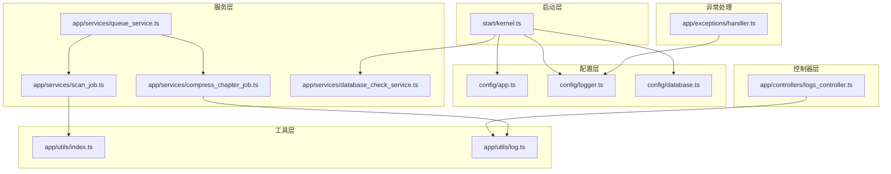
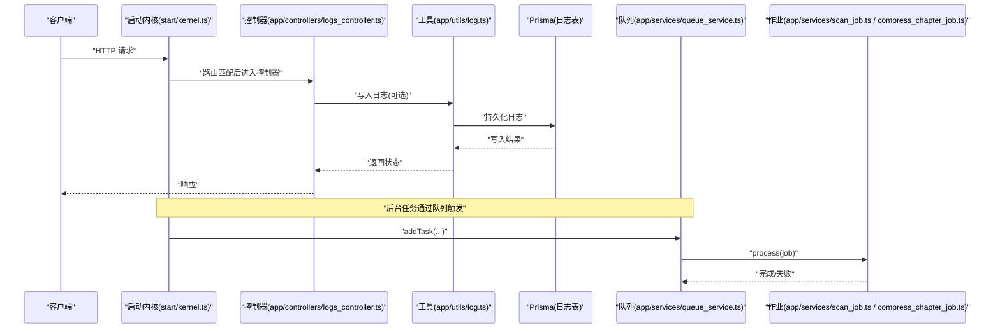
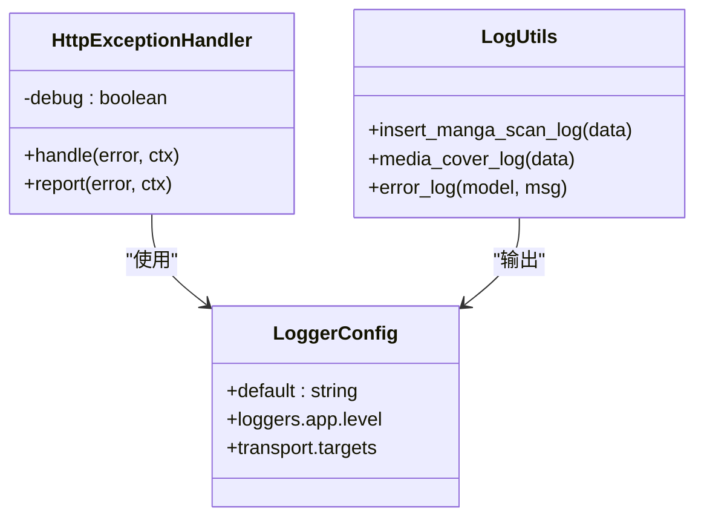
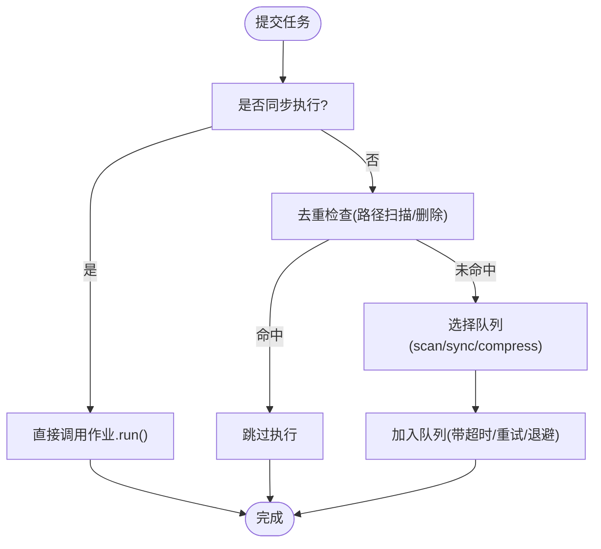
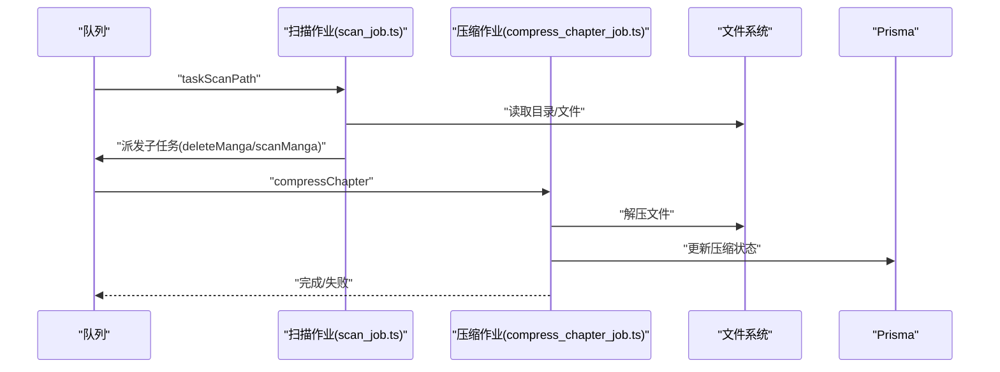
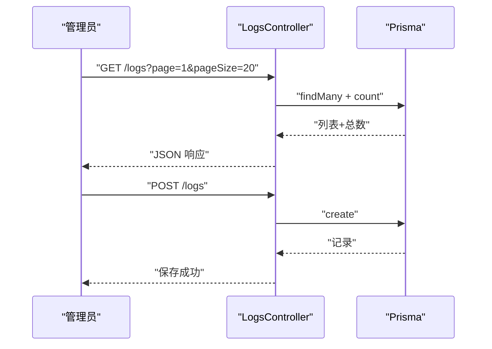
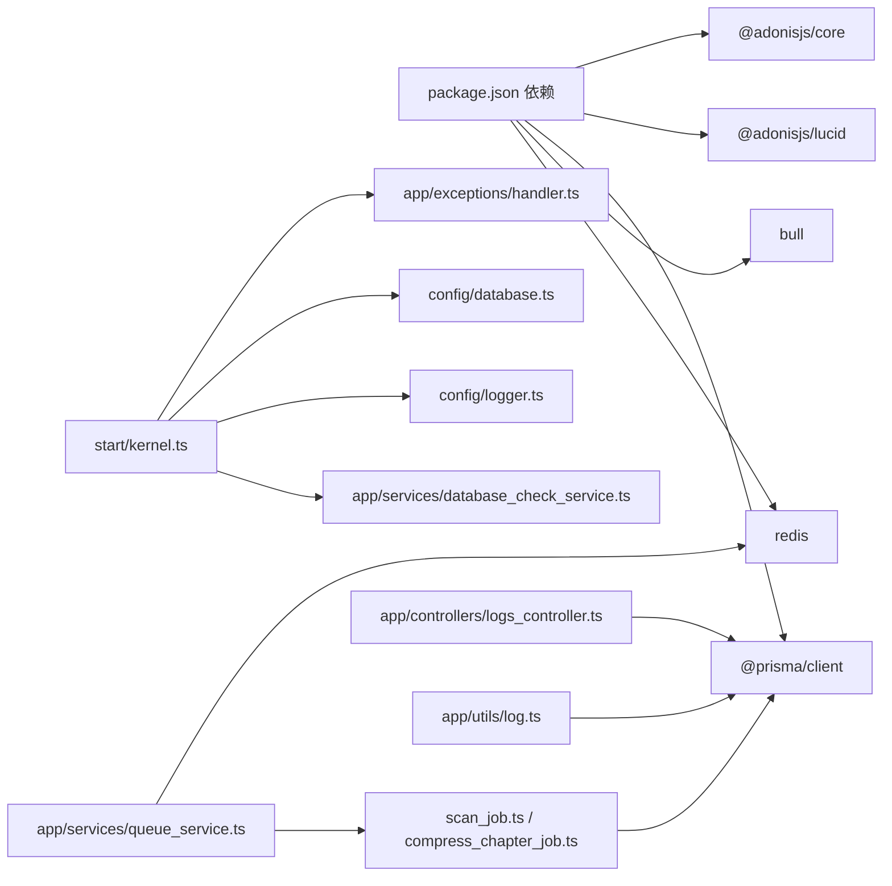

# 故障排除

<cite>
**本文引用的文件**
- [app/exceptions/handler.ts](file://app/exceptions/handler.ts)
- [config/logger.ts](file://config/logger.ts)
- [config/database.ts](file://config/database.ts)
- [app/utils/log.ts](file://app/utils/log.ts)
- [app/services/queue_service.ts](file://app/services/queue_service.ts)
- [app/controllers/logs_controller.ts](file://app/controllers/logs_controller.ts)
- [app/services/database_check_service.ts](file://app/services/database_check_service.ts)
- [config/app.ts](file://config/app.ts)
- [start/kernel.ts](file://start/kernel.ts)
- [package.json](file://package.json)
- [app/services/scan_job.ts](file://app/services/scan_job.ts)
- [app/services/compress_chapter_job.ts](file://app/services/compress_chapter_job.ts)
- [app/utils/index.ts](file://app/utils/index.ts)
</cite>

## 目录
1. [简介](#简介)
2. [项目结构](#项目结构)
3. [核心组件](#核心组件)
4. [架构总览](#架构总览)
5. [详细组件分析](#详细组件分析)
6. [依赖关系分析](#依赖关系分析)
7. [性能考虑](#性能考虑)
8. [故障排除指南](#故障排除指南)
9. [结论](#结论)
10. [附录](#附录)

## 简介
本故障排除文档面向 SManga Adonis 项目的运维与开发人员，聚焦于安装、配置、运行时异常、数据库连接、Redis 队列、文件处理等常见问题的系统化诊断与修复。文档提供日志分析、错误追踪、性能瓶颈定位、并发与内存问题排查、以及紧急恢复流程，帮助快速定位并解决问题。

## 项目结构
SManga Adonis 基于 AdonisJS 框架，采用分层与功能模块化组织：
- 配置层：应用、日志、数据库、认证等配置
- 控制器层：对外接口，负责请求响应与业务入口
- 服务层：任务队列、扫描、压缩、同步等后台作业
- 工具层：通用工具、日志写入、路径管理、配置读取
- 异常处理：统一异常捕获与上报
- 启动层：内核中间件、错误处理器注册、数据库初始化

**图表来源**
- [config/app.ts:1-41](file://config/app.ts#L1-L41)
- [config/logger.ts:1-36](file://config/logger.ts#L1-L36)
- [config/database.ts:1-24](file://config/database.ts#L1-L24)
- [start/kernel.ts:1-69](file://start/kernel.ts#L1-L69)
- [app/controllers/logs_controller.ts:1-61](file://app/controllers/logs_controller.ts#L1-L61)
- [app/services/queue_service.ts:1-267](file://app/services/queue_service.ts#L1-L267)
- [app/services/scan_job.ts:1-254](file://app/services/scan_job.ts#L1-L254)
- [app/services/compress_chapter_job.ts:1-71](file://app/services/compress_chapter_job.ts#L1-L71)
- [app/services/database_check_service.ts:1-92](file://app/services/database_check_service.ts#L1-L92)
- [app/utils/index.ts:1-313](file://app/utils/index.ts#L1-L313)
- [app/utils/log.ts:1-74](file://app/utils/log.ts#L1-L74)
- [app/exceptions/handler.ts:1-29](file://app/exceptions/handler.ts#L1-L29)

**章节来源**
- [config/app.ts:1-41](file://config/app.ts#L1-L41)
- [config/logger.ts:1-36](file://config/logger.ts#L1-L36)
- [config/database.ts:1-24](file://config/database.ts#L1-L24)
- [start/kernel.ts:1-69](file://start/kernel.ts#L1-L69)

## 核心组件
- 异常处理：继承框架异常处理器，按环境决定调试模式与上报行为
- 日志系统：基于 AdonisJS Logger，生产环境输出到文件，开发环境控制台美化输出
- 数据库配置：通过环境变量驱动 Lucid ORM，支持 MySQL
- 任务队列：基于 Bull/Redis，支持多队列与指数退避重试
- 日志持久化：Prisma 写入日志表，提供查询接口
- 启动检查：根据平台自动执行数据库初始化与迁移

**章节来源**
- [app/exceptions/handler.ts:1-29](file://app/exceptions/handler.ts#L1-L29)
- [config/logger.ts:1-36](file://config/logger.ts#L1-L36)
- [config/database.ts:1-24](file://config/database.ts#L1-L24)
- [app/services/queue_service.ts:1-267](file://app/services/queue_service.ts#L1-L267)
- [app/utils/log.ts:1-74](file://app/utils/log.ts#L1-L74)
- [start/kernel.ts:1-69](file://start/kernel.ts#L1-L69)

## 架构总览
下图展示从请求到任务执行的关键链路，以及日志与异常处理的贯穿路径。

**图表来源**
- [start/kernel.ts:1-69](file://start/kernel.ts#L1-L69)
- [app/controllers/logs_controller.ts:1-61](file://app/controllers/logs_controller.ts#L1-L61)
- [app/utils/log.ts:1-74](file://app/utils/log.ts#L1-L74)
- [app/services/queue_service.ts:1-267](file://app/services/queue_service.ts#L1-L267)
- [app/services/scan_job.ts:1-254](file://app/services/scan_job.ts#L1-L254)
- [app/services/compress_chapter_job.ts:1-71](file://app/services/compress_chapter_job.ts#L1-L71)

## 详细组件分析

### 组件A：异常处理与日志
- 异常处理：在非生产环境启用详细调试输出；生产环境关闭调试，避免敏感信息泄露
- 日志配置：开发环境控制台美化输出；生产环境输出到文件；日志级别由环境变量控制
- 日志写入：提供统一日志工具，支持错误日志入库与扫描日志入库

**图表来源**
- [app/exceptions/handler.ts:1-29](file://app/exceptions/handler.ts#L1-L29)
- [config/logger.ts:1-36](file://config/logger.ts#L1-L36)
- [app/utils/log.ts:1-74](file://app/utils/log.ts#L1-L74)

**章节来源**
- [app/exceptions/handler.ts:1-29](file://app/exceptions/handler.ts#L1-L29)
- [config/logger.ts:1-36](file://config/logger.ts#L1-L36)
- [app/utils/log.ts:1-74](file://app/utils/log.ts#L1-L74)

### 组件B：任务队列与作业
- 队列配置：并发度、最大重试次数、超时时间来自配置；默认指数退避重试
- 队列类型：scan/sync/compress 三类队列；默认队列处理通用命令
- 作业调度：根据任务名与命令分派至具体作业；支持同步/异步两种执行方式
- 重复任务防护：对路径扫描/删除任务进行去重判断

**图表来源**
- [app/services/queue_service.ts:175-264](file://app/services/queue_service.ts#L175-L264)

**章节来源**
- [app/services/queue_service.ts:1-267](file://app/services/queue_service.ts#L1-L267)

### 组件C：扫描与压缩作业
- 扫描作业：遍历路径，识别漫画条目，生成删除与扫描子任务；支持隐藏文件过滤、包含/排除规则
- 压缩作业：根据压缩类型调用相应解压工具，完成后更新压缩状态

**图表来源**
- [app/services/scan_job.ts:29-119](file://app/services/scan_job.ts#L29-L119)
- [app/services/compress_chapter_job.ts:31-65](file://app/services/compress_chapter_job.ts#L31-L65)

**章节来源**
- [app/services/scan_job.ts:1-254](file://app/services/scan_job.ts#L1-L254)
- [app/services/compress_chapter_job.ts:1-71](file://app/services/compress_chapter_job.ts#L1-L71)

### 组件D：日志控制器与数据库检查
- 日志控制器：提供日志列表、详情、新增、更新、删除接口，支持分页与排序
- 数据库检查：根据平台与配置自动写入 .env、生成 Prisma 客户端、部署迁移，并标记已部署

**图表来源**
- [app/controllers/logs_controller.ts:8-60](file://app/controllers/logs_controller.ts#L8-L60)

**章节来源**
- [app/controllers/logs_controller.ts:1-61](file://app/controllers/logs_controller.ts#L1-L61)
- [app/services/database_check_service.ts:1-92](file://app/services/database_check_service.ts#L1-L92)

## 依赖关系分析
- 启动内核注册异常处理器、全局中间件与路由中间件，并在 Windows 平台执行数据库初始化
- 队列服务依赖 Redis（本地 127.0.0.1:6379），作业通过 Prisma 访问数据库
- 日志工具依赖 Prisma 写入日志表，同时受 Logger 配置影响输出

**图表来源**
- [package.json:1-100](file://package.json#L1-L100)
- [start/kernel.ts:1-69](file://start/kernel.ts#L1-L69)
- [app/exceptions/handler.ts:1-29](file://app/exceptions/handler.ts#L1-L29)
- [config/database.ts:1-24](file://config/database.ts#L1-L24)
- [config/logger.ts:1-36](file://config/logger.ts#L1-L36)
- [app/services/database_check_service.ts:1-92](file://app/services/database_check_service.ts#L1-L92)
- [app/services/queue_service.ts:1-267](file://app/services/queue_service.ts#L1-L267)
- [app/services/scan_job.ts:1-254](file://app/services/scan_job.ts#L1-L254)
- [app/services/compress_chapter_job.ts:1-71](file://app/services/compress_chapter_job.ts#L1-L71)
- [app/controllers/logs_controller.ts:1-61](file://app/controllers/logs_controller.ts#L1-L61)
- [app/utils/log.ts:1-74](file://app/utils/log.ts#L1-L74)

**章节来源**
- [package.json:1-100](file://package.json#L1-L100)
- [start/kernel.ts:1-69](file://start/kernel.ts#L1-L69)

## 性能考虑
- 队列并发与重试：合理设置并发度与超时，避免资源争用；指数退避降低重试风暴风险
- I/O 密集型：扫描与解压为 I/O 密集，建议限制并发并启用去重，减少重复工作
- 日志输出：生产环境落盘，避免过多控制台输出造成 I/O 压力
- 数据库连接：Lucid 连接池与迁移自然排序需结合实际负载调整

[本节为通用指导，无需列出章节来源]

## 故障排除指南

### 一、安装与环境准备
- 症状：启动时报找不到依赖或无法加载模块
  - 排查：确认 Node 版本与依赖安装完整；检查导入别名映射
  - 参考
    - [package.json:16-36](file://package.json#L16-L36)
- 症状：Windows 下启动后数据库未初始化
  - 排查：确认启动内核在 Windows 平台执行数据库检查
  - 参考
    - [start/kernel.ts:63-65](file://start/kernel.ts#L63-L65)

**章节来源**
- [package.json:1-100](file://package.json#L1-L100)
- [start/kernel.ts:1-69](file://start/kernel.ts#L1-L69)

### 二、配置错误
- 症状：数据库连接失败
  - 排查：检查环境变量与数据库配置；确认主机、端口、用户、密码、数据库名正确
  - 参考
    - [config/database.ts:4-22](file://config/database.ts#L4-L22)
- 症状：日志级别无效或输出异常
  - 排查：检查 LOG_LEVEL 与 APP_NAME 环境变量；确认传输目标配置
  - 参考
    - [config/logger.ts:5-25](file://config/logger.ts#L5-L25)
- 症状：队列超时频繁或重试过多
  - 排查：调整 queue 配置（并发、重试、超时）；检查 Redis 连接
  - 参考
    - [app/services/queue_service.ts:18-32](file://app/services/queue_service.ts#L18-L32)
    - [app/services/queue_service.ts:34-39](file://app/services/queue_service.ts#L34-L39)

**章节来源**
- [config/database.ts:1-24](file://config/database.ts#L1-L24)
- [config/logger.ts:1-36](file://config/logger.ts#L1-L36)
- [app/services/queue_service.ts:1-267](file://app/services/queue_service.ts#L1-L267)

### 三、运行时异常
- 症状：HTTP 异常未被捕获或堆栈泄露
  - 排查：确认异常处理器已注册；生产环境关闭调试
  - 参考
    - [app/exceptions/handler.ts:4-9](file://app/exceptions/handler.ts#L4-L9)
    - [start/kernel.ts:28](file://start/kernel.ts#L28)
- 症状：作业执行失败但无详细错误
  - 排查：查看队列 failed 事件与作业内部错误抛出；检查日志级别
  - 参考
    - [app/services/queue_service.ts:45-47](file://app/services/queue_service.ts#L45-L47)
    - [app/services/compress_chapter_job.ts:66-69](file://app/services/compress_chapter_job.ts#L66-L69)

**章节来源**
- [app/exceptions/handler.ts:1-29](file://app/exceptions/handler.ts#L1-L29)
- [start/kernel.ts:1-69](file://start/kernel.ts#L1-L69)
- [app/services/compress_chapter_job.ts:1-71](file://app/services/compress_chapter_job.ts#L1-L71)

### 四、数据库连接问题
- 症状：首次运行提示数据库未就绪
  - 排查：执行数据库检查服务，自动生成 Prisma 客户端并部署迁移
  - 参考
    - [app/services/database_check_service.ts:18-73](file://app/services/database_check_service.ts#L18-L73)
- 症状：SQLite/MySQL/PostgreSQL 选择错误导致连接失败
  - 排查：确认配置文件与 .env 中的 DB_URL_* 变量一致
  - 参考
    - [app/services/database_check_service.ts:23-47](file://app/services/database_check_service.ts#L23-L47)

**章节来源**
- [app/services/database_check_service.ts:1-92](file://app/services/database_check_service.ts#L1-L92)

### 五、Redis 队列故障
- 症状：任务无法入队或执行
  - 排查：确认 Redis 服务可用；检查队列构造中的 host/port；查看 failed 事件
  - 参考
    - [app/services/queue_service.ts:34-39](file://app/services/queue_service.ts#L34-L39)
    - [app/services/queue_service.ts:45-47](file://app/services/queue_service.ts#L45-L47)
- 症状：重试风暴或延迟过大
  - 排查：调整 attempts 与 backoff 参数；限制并发
  - 参考
    - [app/services/queue_service.ts:248-262](file://app/services/queue_service.ts#L248-L262)

**章节来源**
- [app/services/queue_service.ts:1-267](file://app/services/queue_service.ts#L1-L267)

### 六、文件处理异常
- 症状：扫描不到漫画或误判文件
  - 排查：检查路径权限、隐藏文件过滤、包含/排除规则；确认文件类型识别
  - 参考
    - [app/services/scan_job.ts:126-198](file://app/services/scan_job.ts#L126-L198)
    - [app/utils/index.ts:94-105](file://app/utils/index.ts#L94-L105)
- 症状：解压失败或占用磁盘空间
  - 排查：确认压缩类型与对应工具可用；监控临时目录与缓存目录
  - 参考
    - [app/services/compress_chapter_job.ts:32-44](file://app/services/compress_chapter_job.ts#L32-L44)
    - [app/utils/index.ts:74-82](file://app/utils/index.ts#L74-L82)

**章节来源**
- [app/services/scan_job.ts:1-254](file://app/services/scan_job.ts#L1-L254)
- [app/services/compress_chapter_job.ts:1-71](file://app/services/compress_chapter_job.ts#L1-L71)
- [app/utils/index.ts:1-313](file://app/utils/index.ts#L1-L313)

### 七、日志分析与错误追踪
- 症状：日志缺失或级别过高
  - 排查：检查 LOG_LEVEL；确认 Logger 传输目标；查看日志控制器接口
  - 参考
    - [config/logger.ts:12-24](file://config/logger.ts#L12-L24)
    - [app/controllers/logs_controller.ts:9-22](file://app/controllers/logs_controller.ts#L9-L22)
- 症状：错误日志未入库
  - 排查：确认 Prisma 连接与日志表结构；检查 error_log 调用
  - 参考
    - [app/utils/log.ts:60-72](file://app/utils/log.ts#L60-L72)

**章节来源**
- [config/logger.ts:1-36](file://config/logger.ts#L1-L36)
- [app/controllers/logs_controller.ts:1-61](file://app/controllers/logs_controller.ts#L1-L61)
- [app/utils/log.ts:1-74](file://app/utils/log.ts#L1-L74)

### 八、性能瓶颈识别
- CPU/IO 压力：扫描与解压为 I/O 密集，适当降低并发；启用去重避免重复扫描
- 内存占用：避免一次性加载大量文件；及时释放临时对象
- 队列积压：监控 waiting/active 数量；调整 attempts/backoff

**章节来源**
- [app/services/queue_service.ts:103-141](file://app/services/queue_service.ts#L103-L141)
- [app/services/scan_job.ts:29-119](file://app/services/scan_job.ts#L29-L119)

### 九、并发与死锁排查
- 症状：路径扫描/删除重复执行
  - 排查：利用 path_scanning/path_deleting 去重逻辑；确认任务名唯一性
  - 参考
    - [app/services/queue_service.ts:143-165](file://app/services/queue_service.ts#L143-L165)

**章节来源**
- [app/services/queue_service.ts:1-267](file://app/services/queue_service.ts#L1-L267)

### 十、紧急应急与系统恢复
- 应急步骤
  - 停止服务，备份日志与数据库
  - 检查 Redis 与数据库连通性
  - 清理队列积压任务，必要时清空对应队列
  - 重启服务，观察队列与日志恢复情况
- 恢复流程
  - 若数据库迁移异常：重新执行数据库检查服务，确保 .env 与 schema 一致
  - 若日志不可用：检查 Logger 传输目标与文件权限
  - 若队列异常：检查 Redis 服务与网络连通，必要时重建队列

**章节来源**
- [app/services/database_check_service.ts:18-73](file://app/services/database_check_service.ts#L18-L73)
- [config/logger.ts:12-24](file://config/logger.ts#L12-L24)
- [app/services/queue_service.ts:34-39](file://app/services/queue_service.ts#L34-L39)

## 结论
通过统一的异常处理、完善的日志体系、可配置的任务队列与严格的启动检查，SManga Adonis 在复杂后台任务场景下具备较好的稳定性与可观测性。建议在生产环境中：
- 明确日志级别与输出目标
- 合理配置队列并发与重试策略
- 建立定期巡检与备份机制
- 对高频 I/O 操作进行限流与去重

[本节为总结性内容，无需列出章节来源]

## 附录

### A. 错误码与状态语义（示例）
- 日志接口返回
  - code: 0 表示成功；其他值表示业务错误
  - 参考
    - [app/controllers/logs_controller.ts:20](file://app/controllers/logs_controller.ts#L20)
    - [app/controllers/logs_controller.ts:28](file://app/controllers/logs_controller.ts#L28)
    - [app/controllers/logs_controller.ts:37](file://app/controllers/logs_controller.ts#L37)
    - [app/controllers/logs_controller.ts:49](file://app/controllers/logs_controller.ts#L49)
    - [app/controllers/logs_controller.ts:58](file://app/controllers/logs_controller.ts#L58)

**章节来源**
- [app/controllers/logs_controller.ts:1-61](file://app/controllers/logs_controller.ts#L1-L61)

### B. 关键配置项速查
- 应用密钥与 Cookie 设置
  - 参考
    - [config/app.ts:13](file://config/app.ts#L13)
    - [config/app.ts:32-39](file://config/app.ts#L32-L39)
- 日志级别与传输
  - 参考
    - [config/logger.ts:16](file://config/logger.ts#L16)
    - [config/logger.ts:18-22](file://config/logger.ts#L18-L22)
- 数据库连接
  - 参考
    - [config/database.ts:10-15](file://config/database.ts#L10-L15)

**章节来源**
- [config/app.ts:1-41](file://config/app.ts#L1-L41)
- [config/logger.ts:1-36](file://config/logger.ts#L1-L36)
- [config/database.ts:1-24](file://config/database.ts#L1-L24)