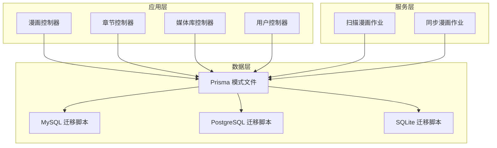
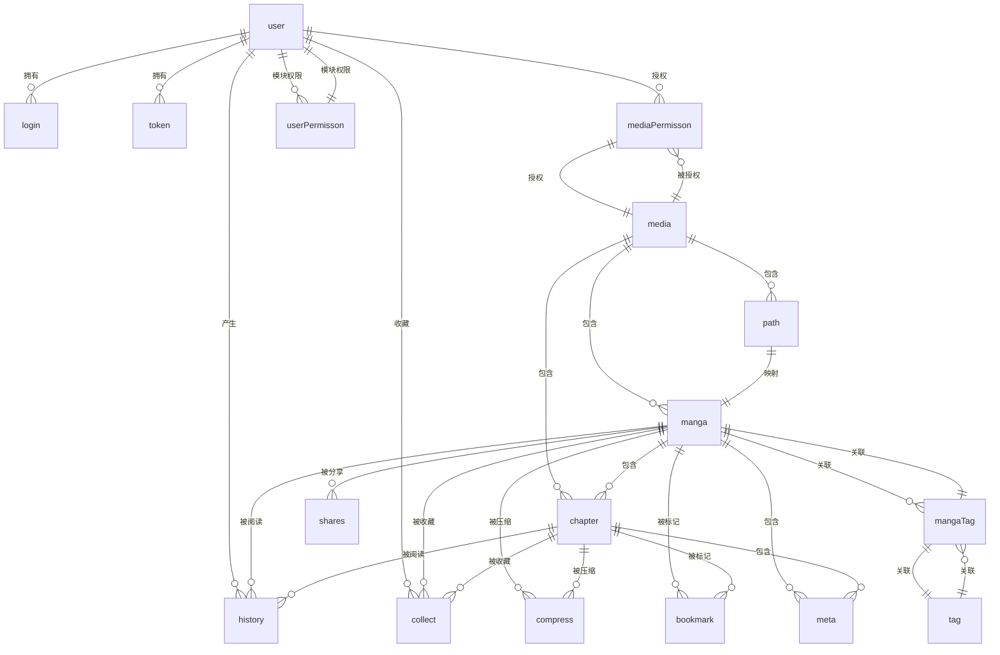
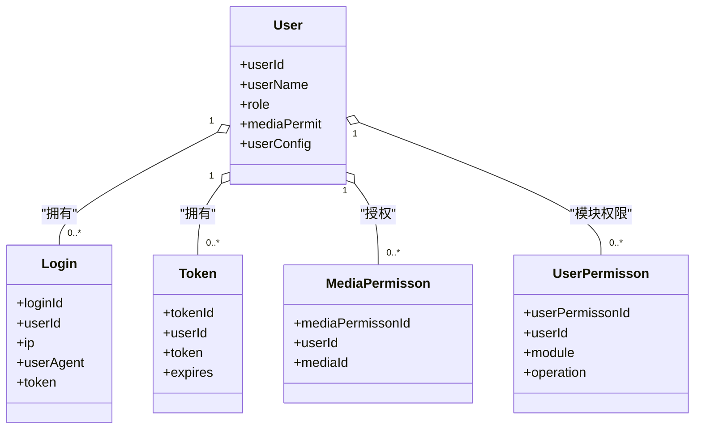
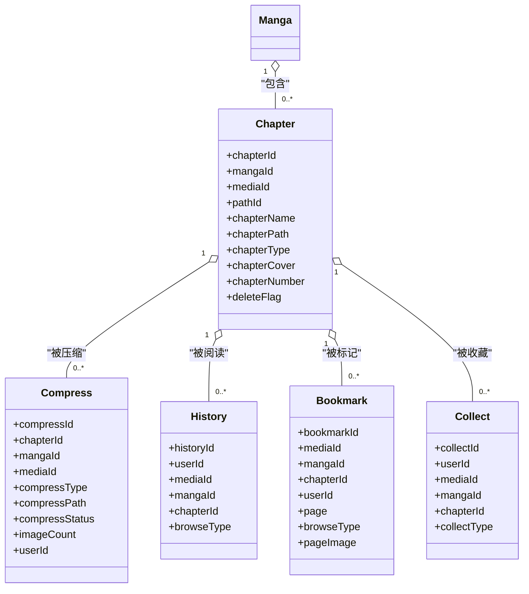
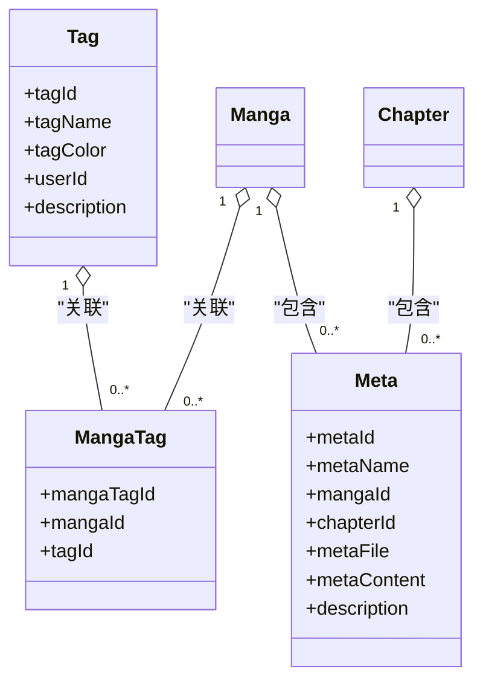
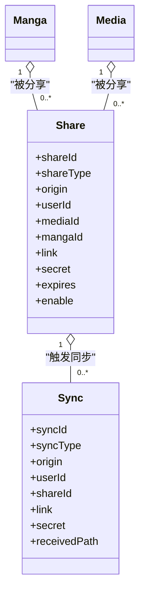
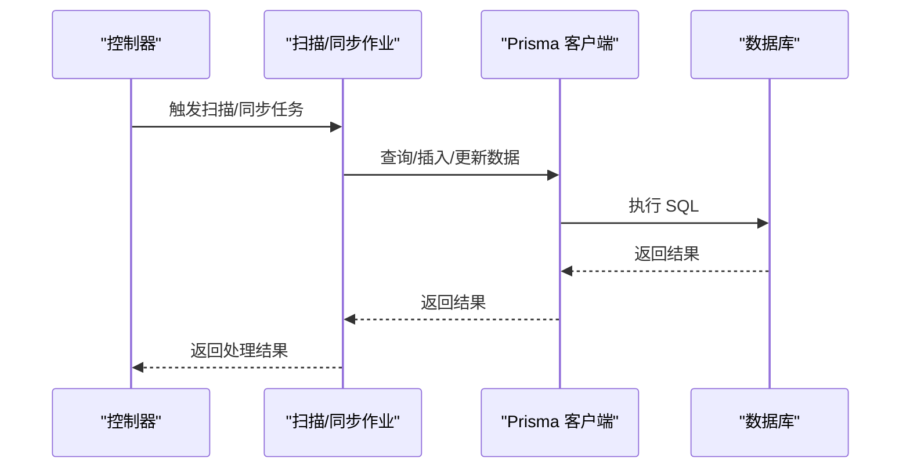
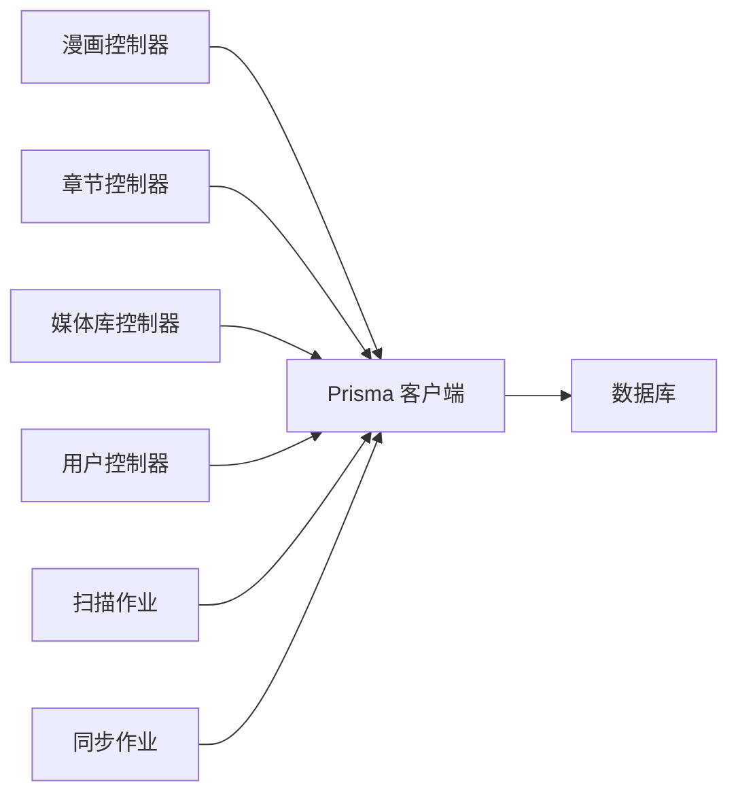

# 实体关系图

<cite>
**本文档引用的文件**
- [schema.prisma（MySQL）](file://prisma/mysql/schema.prisma)
- [schema.prisma（PostgreSQL）](file://prisma/pgsql/schema.prisma)
- [schema.prisma（SQLite）](file://prisma/sqlite/schema.prisma)
- [MySQL初始化迁移](file://prisma/mysql/migrations/20240817084208_init/migration.sql)
- [PostgreSQL初始化迁移](file://prisma/pgsql/migrations/20240817084740_init/migration.sql)
- [SQLite初始化迁移](file://prisma/sqlite/migrations/20240817081809_init/migration.sql)
- [漫画控制器](file://app/controllers/manga_controller.ts)
- [章节控制器](file://app/controllers/chapters_controller.ts)
- [媒体库控制器](file://app/controllers/media_controller.ts)
- [用户控制器](file://app/controllers/users_controller.ts)
- [扫描漫画作业](file://app/services/scan_manga_job.ts)
- [同步漫画作业](file://app/services/sync_manga_job.ts)
- [用户模型](file://app/models/user.ts)
</cite>

## 目录
1. [简介](#简介)
2. [项目结构](#项目结构)
3. [核心组件](#核心组件)
4. [架构总览](#架构总览)
5. [详细组件分析](#详细组件分析)
6. [依赖分析](#依赖分析)
7. [性能考虑](#性能考虑)
8. [故障排查指南](#故障排查指南)
9. [结论](#结论)
10. [附录](#附录)

## 简介
本文件为 SManga Adonis 的实体关系图（ERD）文档，基于 Prisma 模式文件与数据库迁移脚本，系统化梳理所有数据模型之间的关系。内容涵盖：
- 一对一、一对多、多对多关系的实现方式
- 外键约束与关系完整性保证
- 关系基数、参照完整性规则与级联删除/更新策略
- 数据流向与依赖关系
- ERD 图表与文字说明
- 在数据库设计与维护中的作用

## 项目结构
SManga Adonis 采用 Prisma 作为 ORM，使用 schema.prisma 定义数据模型，并通过迁移脚本在 MySQL、PostgreSQL、SQLite 三套数据库上生成一致的表结构。应用层控制器通过 Prisma 客户端进行数据访问。



**图表来源**
- [schema.prisma（MySQL）](file://prisma/mysql/schema.prisma)
- [schema.prisma（PostgreSQL）](file://prisma/pgsql/schema.prisma)
- [schema.prisma（SQLite）](file://prisma/sqlite/schema.prisma)
- [漫画控制器](file://app/controllers/manga_controller.ts)
- [章节控制器](file://app/controllers/chapters_controller.ts)
- [媒体库控制器](file://app/controllers/media_controller.ts)
- [用户控制器](file://app/controllers/users_controller.ts)
- [扫描漫画作业](file://app/services/scan_manga_job.ts)
- [同步漫画作业](file://app/services/sync_manga_job.ts)

**章节来源**
- [schema.prisma（MySQL）](file://prisma/mysql/schema.prisma)
- [schema.prisma（PostgreSQL）](file://prisma/pgsql/schema.prisma)
- [schema.prisma（SQLite）](file://prisma/sqlite/schema.prisma)

## 核心组件
本项目的核心数据模型包括：用户（user）、媒体库（media）、路径（path）、漫画（manga）、章节（chapter）、收藏（collect）、历史（history）、书签（bookmark）、压缩（compress）、标签（tag）、漫画标签（mangaTag）、登录（login）、令牌（token）、权限（mediaPermisson、userPermisson）、元数据（meta）、扫描（scan）、任务（task、taskSuccess、taskFailed）、版本（version）。这些模型通过外键关联形成完整的漫画管理生态。

**章节来源**
- [schema.prisma（MySQL）](file://prisma/mysql/schema.prisma)
- [schema.prisma（PostgreSQL）](file://prisma/pgsql/schema.prisma)
- [schema.prisma（SQLite）](file://prisma/sqlite/schema.prisma)

## 架构总览
下图展示了主要实体及其关系，标注了关系基数与外键约束策略：



**图表来源**
- [schema.prisma（MySQL）](file://prisma/mysql/schema.prisma)
- [schema.prisma（PostgreSQL）](file://prisma/pgsql/schema.prisma)
- [schema.prisma（SQLite）](file://prisma/sqlite/schema.prisma)

## 详细组件分析

### 用户相关模型
- 用户（user）：系统主体，具备角色与媒体访问权限，可生成登录记录、令牌、历史、收藏等。
- 登录（login）：记录用户登录行为，允许用户为空（匿名）。
- 令牌（token）：存储用户认证令牌，与用户建立一对一关系。
- 权限（mediaPermisson、userPermisson）：控制用户对媒体库与模块的操作权限。



**图表来源**
- [schema.prisma（MySQL）](file://prisma/mysql/schema.prisma)
- [schema.prisma（PostgreSQL）](file://prisma/pgsql/schema.prisma)
- [schema.prisma（SQLite）](file://prisma/sqlite/schema.prisma)

**章节来源**
- [schema.prisma（MySQL）](file://prisma/mysql/schema.prisma)
- [schema.prisma（PostgreSQL）](file://prisma/pgsql/schema.prisma)
- [schema.prisma（SQLite）](file://prisma/sqlite/schema.prisma)

### 媒体库与路径
- 媒体库（media）：定义浏览方向、目录格式、是否云端媒体等属性。
- 路径（path）：绑定媒体库与实际扫描路径，支持包含/排除规则与最后扫描时间。
- 漫画（manga）：属于某个媒体库与路径，包含封面、标题、作者、描述等元信息。

```mermaid
classDiagram
class Media {
+mediaId
+mediaName
+mediaType
+browseType
+isCloudMedia
}
class Path {
+pathId
+mediaId
+pathContent
+include
+exclude
+lastScanTime
}
class Manga {
+mangaId
+mediaId
+pathId
+mangaName
+mangaPath
+mangaCover
+chapterCount
+browseType
}
Media "1" o-- "0..*" Path : "包含"
Media "1" o-- "0..*" Manga : "包含"
Path "1" ||-- "0..*" Manga : "映射"
```

**图表来源**
- [schema.prisma（MySQL）](file://prisma/mysql/schema.prisma)
- [schema.prisma（PostgreSQL）](file://prisma/pgsql/schema.prisma)
- [schema.prisma（SQLite）](file://prisma/sqlite/schema.prisma)

**章节来源**
- [schema.prisma（MySQL）](file://prisma/mysql/schema.prisma)
- [schema.prisma（PostgreSQL）](file://prisma/pgsql/schema.prisma)
- [schema.prisma（SQLite）](file://prisma/sqlite/schema.prisma)

### 漫画与章节
- 章节（chapter）：属于某漫画与媒体库，包含章节名、路径、类型（图片/压缩包/PDF）、封面、编号等。
- 压缩（compress）：记录章节解压状态与缓存路径，一对一约束确保每个章节仅有一条压缩记录。
- 历史（history）：记录用户阅读进度与章节信息。
- 书签（bookmark）：记录用户在某章节的阅读位置与浏览类型。
- 收藏（collect）：记录用户对漫画或章节的收藏，支持唯一约束避免重复收藏。



**图表来源**
- [schema.prisma（MySQL）](file://prisma/mysql/schema.prisma)
- [schema.prisma（PostgreSQL）](file://prisma/pgsql/schema.prisma)
- [schema.prisma（SQLite）](file://prisma/sqlite/schema.prisma)

**章节来源**
- [schema.prisma（MySQL）](file://prisma/mysql/schema.prisma)
- [schema.prisma（PostgreSQL）](file://prisma/pgsql/schema.prisma)
- [schema.prisma（SQLite）](file://prisma/sqlite/schema.prisma)

### 标签与元数据
- 标签（tag）：系统或用户自定义标签，支持颜色与描述。
- 漫画标签（mangaTag）：多对多关联，确保同一漫画与标签组合唯一。
- 元数据（meta）：存储漫画或章节的元信息（如标题、作者、描述、标签图等），支持文件与文本内容。



**图表来源**
- [schema.prisma（MySQL）](file://prisma/mysql/schema.prisma)
- [schema.prisma（PostgreSQL）](file://prisma/pgsql/schema.prisma)
- [schema.prisma（SQLite）](file://prisma/sqlite/schema.prisma)

**章节来源**
- [schema.prisma（MySQL）](file://prisma/mysql/schema.prisma)
- [schema.prisma（PostgreSQL）](file://prisma/pgsql/schema.prisma)
- [schema.prisma（SQLite）](file://prisma/sqlite/schema.prisma)

### 分享与同步
- 分享（share）：支持以漫画或媒体库为对象的分享链接，可设置有效期与白黑名单。
- 同步（sync）：从远端源同步漫画与章节，生成下载任务。



**图表来源**
- [schema.prisma（MySQL）](file://prisma/mysql/schema.prisma)
- [schema.prisma（PostgreSQL）](file://prisma/pgsql/schema.prisma)
- [schema.prisma（SQLite）](file://prisma/sqlite/schema.prisma)

**章节来源**
- [schema.prisma（MySQL）](file://prisma/mysql/schema.prisma)
- [schema.prisma（PostgreSQL）](file://prisma/pgsql/schema.prisma)
- [schema.prisma（SQLite）](file://prisma/sqlite/schema.prisma)

### 任务与扫描
- 扫描（scan）：记录路径扫描状态与索引，复合主键确保路径唯一。
- 任务（task、taskSuccess、taskFailed）：异步任务队列，支持优先级与状态跟踪。
- 扫描/同步作业：通过服务层调用 Prisma 完成数据写入与更新。



**图表来源**
- [扫描漫画作业](file://app/services/scan_manga_job.ts)
- [同步漫画作业](file://app/services/sync_manga_job.ts)
- [漫画控制器](file://app/controllers/manga_controller.ts)
- [章节控制器](file://app/controllers/chapters_controller.ts)
- [媒体库控制器](file://app/controllers/media_controller.ts)
- [用户控制器](file://app/controllers/users_controller.ts)

**章节来源**
- [扫描漫画作业](file://app/services/scan_manga_job.ts)
- [同步漫画作业](file://app/services/sync_manga_job.ts)
- [漫画控制器](file://app/controllers/manga_controller.ts)
- [章节控制器](file://app/controllers/chapters_controller.ts)
- [媒体库控制器](file://app/controllers/media_controller.ts)
- [用户控制器](file://app/controllers/users_controller.ts)

## 依赖分析
- 控制器依赖 Prisma 客户端进行数据查询与更新，体现典型的 MVC 架构。
- 服务层封装复杂业务流程（扫描、同步），通过任务队列异步执行，降低请求延迟。
- 外键约束确保数据一致性，唯一索引保证关键组合的唯一性（如漫画+路径、章节+用户等）。



**图表来源**
- [schema.prisma（MySQL）](file://prisma/mysql/schema.prisma)
- [schema.prisma（PostgreSQL）](file://prisma/pgsql/schema.prisma)
- [schema.prisma（SQLite）](file://prisma/sqlite/schema.prisma)
- [漫画控制器](file://app/controllers/manga_controller.ts)
- [章节控制器](file://app/controllers/chapters_controller.ts)
- [媒体库控制器](file://app/controllers/media_controller.ts)
- [用户控制器](file://app/controllers/users_controller.ts)
- [扫描漫画作业](file://app/services/scan_manga_job.ts)
- [同步漫画作业](file://app/services/sync_manga_job.ts)

**章节来源**
- [schema.prisma（MySQL）](file://prisma/mysql/schema.prisma)
- [schema.prisma（PostgreSQL）](file://prisma/pgsql/schema.prisma)
- [schema.prisma（SQLite）](file://prisma/sqlite/schema.prisma)

## 性能考虑
- 唯一索引与组合唯一键（如漫画+路径、章节+用户、章节+唯一压缩）减少重复数据，提升查询效率。
- 外键约束与级联更新/删除策略（RESTRICT、CASCADE、SET NULL）保障数据一致性，避免悬挂引用。
- 异步任务队列（扫描、压缩、同步）分离高耗时操作，提升接口响应速度。
- 建议在高频查询字段（如 mangaName、chapterName、userName）上维护合适索引，结合唯一约束优化热点查询。

## 故障排查指南
- 外键冲突：当尝试删除或更新被其他记录引用的主键时，数据库会根据外键策略阻止操作。需先清理从表数据或调整策略。
- 唯一约束冲突：如漫画+路径或章节+用户组合重复，需检查输入参数或清理重复数据。
- 权限不足：用户访问媒体库或执行操作时，需检查 mediaPermisson 与 userPermisson 的配置。
- 任务异常：检查 task、taskFailed 表中的错误信息与状态，定位具体命令与参数。

**章节来源**
- [MySQL初始化迁移](file://prisma/mysql/migrations/20240817084208_init/migration.sql)
- [PostgreSQL初始化迁移](file://prisma/pgsql/migrations/20240817084740_init/migration.sql)
- [SQLite初始化迁移](file://prisma/sqlite/migrations/20240817081809_init/migration.sql)

## 结论
本 ERD 文档基于 Prisma 模式与迁移脚本，完整呈现了 SManga Adonis 的数据模型与关系。通过外键约束、唯一索引与合理的级联策略，系统在功能丰富的同时保持了良好的数据完整性与可维护性。建议在生产环境中持续关注索引策略与任务队列监控，以进一步提升性能与稳定性。

## 附录
- 数据库方言差异：MySQL、PostgreSQL、SQLite 在数据类型与 JSON 字段方面存在差异，但 Prisma 模式统一抽象，迁移脚本确保各数据库一致性。
- 版本管理：version 表用于记录系统版本，便于升级与回滚追踪。

**章节来源**
- [schema.prisma（MySQL）](file://prisma/mysql/schema.prisma)
- [schema.prisma（PostgreSQL）](file://prisma/pgsql/schema.prisma)
- [schema.prisma（SQLite）](file://prisma/sqlite/schema.prisma)
- [MySQL初始化迁移](file://prisma/mysql/migrations/20240817084208_init/migration.sql)
- [PostgreSQL初始化迁移](file://prisma/pgsql/migrations/20240817084740_init/migration.sql)
- [SQLite初始化迁移](file://prisma/sqlite/migrations/20240817081809_init/migration.sql)