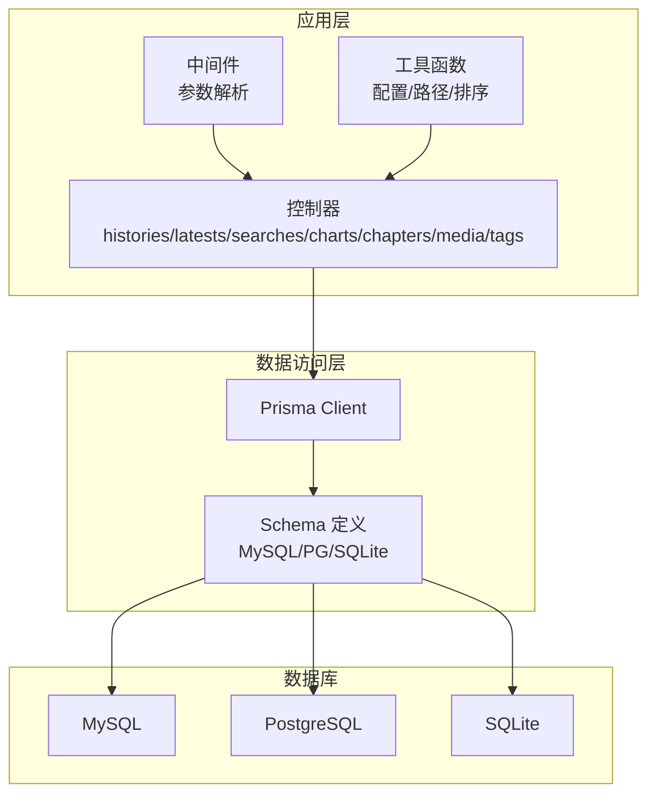
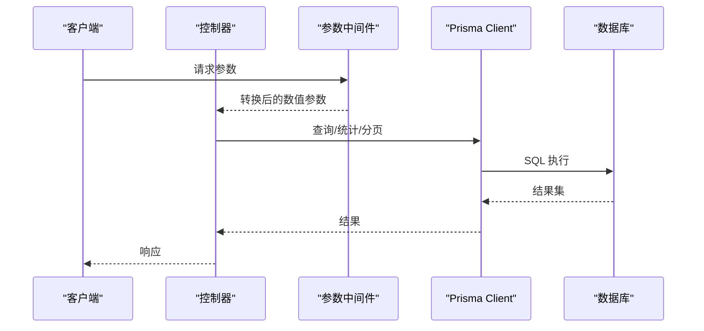
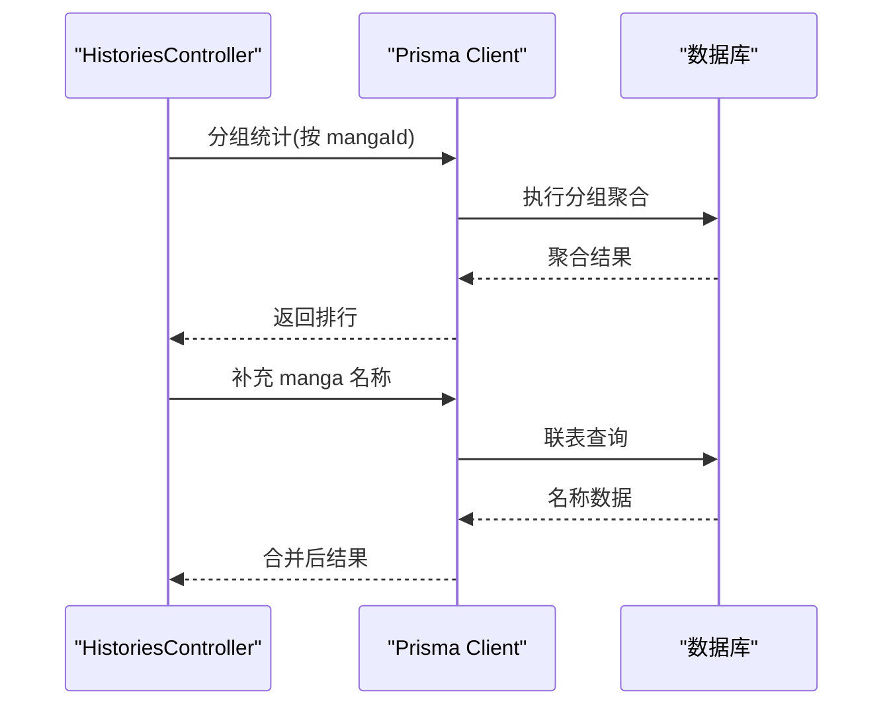
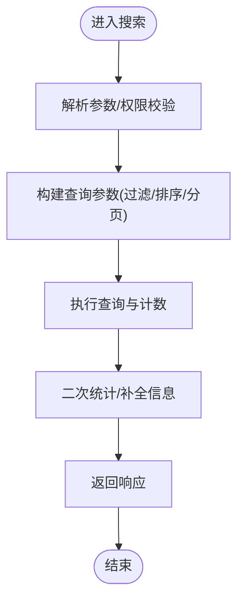
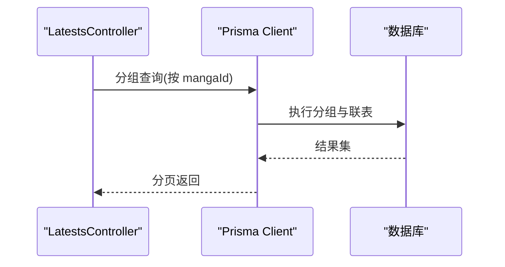
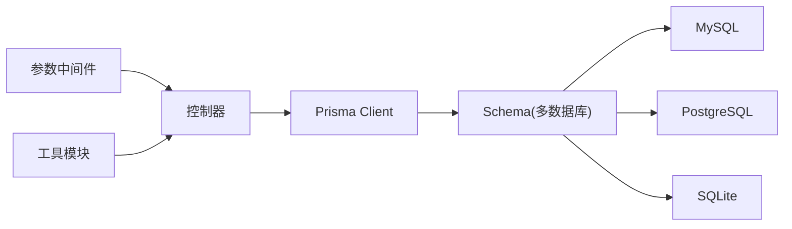

# 数据库性能优化

<cite>
**本文引用的文件**
- [config/database.ts](file://config/database.ts)
- [start/prisma.ts](file://start/prisma.ts)
- [prisma/mysql/schema.prisma](file://prisma/mysql/schema.prisma)
- [prisma/pgsql/schema.prisma](file://prisma/pgsql/schema.prisma)
- [prisma/sqlite/schema.prisma](file://prisma/sqlite/schema.prisma)
- [app/controllers/histories_controller.ts](file://app/controllers/histories_controller.ts)
- [app/controllers/charts_controller.ts](file://app/controllers/charts_controller.ts)
- [app/controllers/searches_controller.ts](file://app/controllers/searches_controller.ts)
- [app/controllers/latests_controller.ts](file://app/controllers/latests_controller.ts)
- [app/controllers/chapters_controller.ts](file://app/controllers/chapters_controller.ts)
- [app/controllers/media_controller.ts](file://app/controllers/media_controller.ts)
- [app/controllers/tags_controller.ts](file://app/controllers/tags_controller.ts)
- [app/services/database_check_service.ts](file://app/services/database_check_service.ts)
- [app/middleware/params_middleware.ts](file://app/middleware/params_middleware.ts)
- [app/utils/index.ts](file://app/utils/index.ts)
</cite>

## 目录
1. [简介](#简介)
2. [项目结构](#项目结构)
3. [核心组件](#核心组件)
4. [架构总览](#架构总览)
5. [详细组件分析](#详细组件分析)
6. [依赖关系分析](#依赖关系分析)
7. [性能考量与优化建议](#性能考量与优化建议)
8. [故障排查指南](#故障排查指南)
9. [结论](#结论)
10. [附录](#附录)

## 简介
本文件面向 SManga Adonis 的数据库性能优化，聚焦于 Prisma ORM 在 MySQL、PostgreSQL、SQLite 三类数据库上的索引策略、查询优化、分页与并发控制、慢查询分析、缓存与预加载、监控与评估方法，并结合项目现有控制器与服务层实现，给出可落地的优化建议与最佳实践。

## 项目结构
SManga Adonis 使用 Prisma 管理多数据库（MySQL、PostgreSQL、SQLite），通过统一的 Prisma Client 访问层对外提供接口；控制器层负责参数解析、鉴权与业务编排，服务层负责部署检查与迁移等运维流程。

图表来源
- [start/prisma.ts:1-42](file://start/prisma.ts#L1-L42)
- [prisma/mysql/schema.prisma:1-10](file://prisma/mysql/schema.prisma#L1-L10)
- [prisma/pgsql/schema.prisma:1-10](file://prisma/pgsql/schema.prisma#L1-L10)
- [prisma/sqlite/schema.prisma:1-10](file://prisma/sqlite/schema.prisma#L1-L10)

章节来源
- [config/database.ts:1-24](file://config/database.ts#L1-L24)
- [start/prisma.ts:1-42](file://start/prisma.ts#L1-L42)
- [prisma/mysql/schema.prisma:1-10](file://prisma/mysql/schema.prisma#L1-L10)
- [prisma/pgsql/schema.prisma:1-10](file://prisma/pgsql/schema.prisma#L1-L10)
- [prisma/sqlite/schema.prisma:1-10](file://prisma/sqlite/schema.prisma#L1-L10)

## 核心组件
- 数据库配置与连接
  - Adonis Lucid 配置仅定义了 MySQL 连接入口，但项目实际使用 Prisma 作为 ORM，通过环境变量与动态构建连接串驱动多数据库。
- Prisma 客户端初始化
  - 根据配置动态选择 MySQL/PostgreSQL/SQLite，构造 Prisma Client 并注入到控制器中。
- 模型与索引
  - Prisma Schema 中定义了主键、唯一约束与关系映射；部分字段具备索引或唯一性约束，可作为后续索引策略的基础。
- 控制器与查询模式
  - 历史记录、排行榜、搜索、最新章节、章节列表、媒体管理、标签等控制器展示了典型查询模式（分页、联表、分组统计、条件过滤）。

章节来源
- [config/database.ts:1-24](file://config/database.ts#L1-L24)
- [start/prisma.ts:1-42](file://start/prisma.ts#L1-L42)
- [prisma/mysql/schema.prisma:11-55](file://prisma/mysql/schema.prisma#L11-L55)
- [prisma/pgsql/schema.prisma:11-55](file://prisma/pgsql/schema.prisma#L11-L55)
- [prisma/sqlite/schema.prisma:11-55](file://prisma/sqlite/schema.prisma#L11-L55)

## 架构总览
下图展示从控制器到 Prisma Client，再到数据库的整体链路，以及多数据库适配与部署检查服务。

图表来源
- [app/controllers/histories_controller.ts:37-103](file://app/controllers/histories_controller.ts#L37-L103)
- [app/controllers/searches_controller.ts:14-74](file://app/controllers/searches_controller.ts#L14-L74)
- [app/controllers/latests_controller.ts:67-92](file://app/controllers/latests_controller.ts#L67-L92)
- [start/prisma.ts:1-42](file://start/prisma.ts#L1-L42)

## 详细组件分析

### 历史记录与排行榜查询
- 分组统计与联表查询
  - 使用分组统计计算阅读排行，随后联表补充名称信息。
  - 提供 PostgreSQL 与 MySQL 的原生 SQL 版本，以规避分组限制差异。
- 性能要点
  - 分组统计需确保相关字段建立合适索引；联表查询注意连接键与过滤条件的覆盖索引。
  - 对于大表，优先考虑在分组前缩小过滤范围，减少中间结果集。

图表来源
- [app/controllers/histories_controller.ts:78-100](file://app/controllers/histories_controller.ts#L78-L100)
- [app/controllers/charts_controller.ts:75-100](file://app/controllers/charts_controller.ts#L75-L100)

章节来源
- [app/controllers/histories_controller.ts:37-103](file://app/controllers/histories_controller.ts#L37-L103)
- [app/controllers/charts_controller.ts:48-100](file://app/controllers/charts_controller.ts#L48-L100)

### 搜索与分页查询
- 分页与条件过滤
  - 搜索控制器对漫画与章节进行分页查询，同时根据用户权限与媒体权限进行过滤。
  - 对每个结果进行二次统计（如未观看章节数），体现“N+1”问题风险。
- 性能要点
  - 分页查询应避免跳页过大；对高频过滤字段建立索引。
  - 对“N+1”场景采用批量预取或一次性聚合统计，减少额外查询。

图表来源
- [app/controllers/searches_controller.ts:14-74](file://app/controllers/searches_controller.ts#L14-L74)

章节来源
- [app/controllers/searches_controller.ts:14-136](file://app/controllers/searches_controller.ts#L14-L136)

### 最新章节与章节列表
- 最新章节
  - 使用分组与联表查询，按用户维度聚合最新章节。
- 章节列表
  - 支持关键字过滤、媒体与漫画筛选、分页与排序；包含 include 关联查询，注意懒加载与 N+1。
- 性能要点
  - 对关联字段与过滤字段建立复合索引；对 include 的关联表尽量限定 select 字段，减少传输与序列化开销。

图表来源
- [app/controllers/latests_controller.ts:67-92](file://app/controllers/latests_controller.ts#L67-L92)

章节来源
- [app/controllers/latests_controller.ts:67-92](file://app/controllers/latests_controller.ts#L67-L92)
- [app/controllers/chapters_controller.ts:110-160](file://app/controllers/chapters_controller.ts#L110-L160)

### 媒体与标签管理
- 媒体管理
  - 权限过滤 + 分页查询；支持批量删除与扫描任务入队。
- 标签管理
  - 支持分页与不分页两种模式；不分页时需关注大表全量导出的内存与网络压力。
- 性能要点
  - 对媒体权限表建立用户-媒体的联合索引；标签不分页时建议限制导出条数或提供筛选条件。

章节来源
- [app/controllers/media_controller.ts:9-48](file://app/controllers/media_controller.ts#L9-L48)
- [app/controllers/tags_controller.ts:1-55](file://app/controllers/tags_controller.ts#L1-L55)

### 参数解析中间件
- 将 query/body 中的数值 ID 与分页参数转换为数字，避免字符串比较带来的隐式转换成本。
- 建议：对非法输入进行显式校验与边界保护，防止异常参数导致索引失效或全表扫描。

章节来源
- [app/middleware/params_middleware.ts:1-37](file://app/middleware/params_middleware.ts#L1-L37)

### 数据库部署与迁移
- 自动检测配置中的数据库类型，写入 .env 对应变量，再执行 Prisma 生成与迁移部署。
- 建议：在生产环境固定数据库类型与连接串，避免频繁切换导致的迁移与生成开销。

章节来源
- [app/services/database_check_service.ts:1-92](file://app/services/database_check_service.ts#L1-L92)

## 依赖关系分析
- 控制器依赖 Prisma Client 进行数据访问；中间件负责参数规范化；工具模块提供配置与路径解析。
- 多数据库适配通过 Prisma Schema 与连接串实现，无需修改业务代码。

图表来源
- [start/prisma.ts:1-42](file://start/prisma.ts#L1-L42)
- [prisma/mysql/schema.prisma:1-10](file://prisma/mysql/schema.prisma#L1-L10)
- [prisma/pgsql/schema.prisma:1-10](file://prisma/pgsql/schema.prisma#L1-L10)
- [prisma/sqlite/schema.prisma:1-10](file://prisma/sqlite/schema.prisma#L1-L10)

章节来源
- [start/prisma.ts:1-42](file://start/prisma.ts#L1-L42)
- [prisma/mysql/schema.prisma:1-10](file://prisma/mysql/schema.prisma#L1-L10)
- [prisma/pgsql/schema.prisma:1-10](file://prisma/pgsql/schema.prisma#L1-L10)
- [prisma/sqlite/schema.prisma:1-10](file://prisma/sqlite/schema.prisma#L1-L10)

## 性能考量与优化建议

### 索引策略
- 主键与唯一约束
  - 已在 Schema 中定义主键与唯一约束（如 manga 与 chapter 的唯一组合、用户唯一用户名等），可作为基础索引。
- 常用过滤与连接字段
  - 历史记录：userId、mangaId、chapterId；建议在 history 上建立 (userId, createTime)、(mangaId)、(chapterId) 的复合/单列索引。
  - 章节列表：mediaId、mangaId、subTitle、deleteFlag；建议在 chapter 上建立 (mediaId, deleteFlag)、(mangaId)、(subTitle) 的索引。
  - 搜索：subTitle 包含查询建议在 MySQL 使用前缀索引或全文索引（视版本与存储引擎），PG 可使用 GIN/GIST。
  - 权限过滤：mediaPermisson(userId, mediaId)、user(userName) 等，建议建立联合索引。
- 分组与排序
  - 分组统计通常需要覆盖索引（如按 mangaId 分组 + 聚合字段），避免临时表与文件排序。

章节来源
- [prisma/mysql/schema.prisma:11-55](file://prisma/mysql/schema.prisma#L11-L55)
- [prisma/pgsql/schema.prisma:11-55](file://prisma/pgsql/schema.prisma#L11-L55)
- [prisma/sqlite/schema.prisma:11-55](file://prisma/sqlite/schema.prisma#L11-L55)
- [app/controllers/histories_controller.ts:78-100](file://app/controllers/histories_controller.ts#L78-L100)
- [app/controllers/searches_controller.ts:37-47](file://app/controllers/searches_controller.ts#L37-L47)
- [app/controllers/chapters_controller.ts:110-139](file://app/controllers/chapters_controller.ts#L110-L139)

### 查询优化技术
- 分页与排序
  - 使用 skip/take 时避免超大偏移；推荐基于游标分页或“基于最后一条记录”的增量分页，降低跳页成本。
- 预加载与 N+1
  - 对 include 的关联表尽量限定 select 字段；对批量操作使用批量查询替代循环逐条查询。
- 聚合与联表
  - 先过滤再分组，减少中间结果集；必要时使用物化视图或汇总表定期刷新。
- 原生 SQL 与方言差异
  - PostgreSQL 与 MySQL 在分组与排序上存在差异，建议在控制器中区分实现，或统一通过 Prisma 的原生 SQL 辅助函数处理。

章节来源
- [app/controllers/searches_controller.ts:54-65](file://app/controllers/searches_controller.ts#L54-L65)
- [app/controllers/chapters_controller.ts:141-144](file://app/controllers/chapters_controller.ts#L141-L144)
- [app/controllers/histories_controller.ts:48-84](file://app/controllers/histories_controller.ts#L48-L84)
- [app/controllers/latests_controller.ts:67-92](file://app/controllers/latests_controller.ts#L67-L92)

### 缓存策略与数据预加载
- 缓存热点数据
  - 对排行榜、媒体封面、标签列表等静态或低频变更数据设置短期缓存；对用户权限与媒体白名单进行集中缓存。
- 预加载与批量查询
  - 对“N+1”场景使用批量预取（如批量查询 manga 名称、章节统计）；对高频统计结果进行定时汇总写入汇总表。
- 文件系统缓存
  - 章节解压缓存路径由工具模块提供，建议结合自动清理策略与磁盘配额限制，避免磁盘膨胀影响 IO。

章节来源
- [app/utils/index.ts:94-105](file://app/utils/index.ts#L94-L105)
- [app/controllers/searches_controller.ts:54-65](file://app/controllers/searches_controller.ts#L54-L65)
- [app/controllers/chapters_controller.ts:222-273](file://app/controllers/chapters_controller.ts#L222-L273)

### 数据库连接池与并发控制
- 连接池配置
  - Prisma Client 默认连接池大小较小，建议在生产环境显式配置连接池参数（最大连接数、空闲超时、获取超时等），并与数据库最大连接数匹配。
- 并发控制
  - 对高并发写入场景（如历史记录、章节状态变更）使用事务与锁；对只读查询开启只读副本或读写分离。
- 连接串与环境变量
  - 通过环境变量注入数据库 URL，避免硬编码；在部署脚本中统一生成与部署迁移。

章节来源
- [start/prisma.ts:26-33](file://start/prisma.ts#L26-L33)
- [app/services/database_check_service.ts:35-47](file://app/services/database_check_service.ts#L35-L47)

### 慢查询分析与优化建议
- 慢查询日志
  - MySQL：启用慢查询日志与分析器；PG：启用 auto_explain 或 pg_stat_statements；SQLite：使用 EXPLAIN QUERY PLAN。
- 分析步骤
  - 定位慢查询 SQL → 分析执行计划 → 检查索引使用情况 → 优化 WHERE/JOIN/ORDER/LIMIT → 回归测试。
- 控制器侧建议
  - 对高频接口增加缓存；对复杂联表与分组查询增加物化视图或汇总表；对超大分页请求限制 page*pageSize。

章节来源
- [app/controllers/histories_controller.ts:48-84](file://app/controllers/histories_controller.ts#L48-L84)
- [app/controllers/searches_controller.ts:14-74](file://app/controllers/searches_controller.ts#L14-L74)

### 监控指标与性能评估
- 指标建议
  - QPS、P95/P99 延迟、连接池利用率、慢查询数量、索引命中率、缓冲池命中率、锁等待时间。
- 评估方法
  - 压力测试（JMeter/Locust）+ A/B 对比（优化前后）+ 持续监控告警。
- 日志与追踪
  - 记录关键接口耗时与错误码；对慢查询 SQL 与参数上下文进行采样记录。

[本节为通用指导，无需特定文件引用]

### 不同数据库平台的性能调优差异
- MySQL
  - 引擎选择（InnoDB/MyISAM）、字符集与排序规则、页大小、缓冲池大小；对 LIKE 前缀模糊查询使用前缀索引或全文索引。
- PostgreSQL
  - 并发写入与 MVCC、统计信息更新、分区表、并行查询；对 JSON/JSONB 字段使用 GIN/GIST 索引。
- SQLite
  - WAL 模式、同步策略、页面大小、自动检查点；适用于小规模或嵌入式场景，注意并发写入限制。

章节来源
- [prisma/mysql/schema.prisma:1-10](file://prisma/mysql/schema.prisma#L1-L10)
- [prisma/pgsql/schema.prisma:1-10](file://prisma/pgsql/schema.prisma#L1-L10)
- [prisma/sqlite/schema.prisma:1-10](file://prisma/sqlite/schema.prisma#L1-L10)

### 大数据量处理与分页策略
- 分页策略
  - 避免超大 page*pageSize；使用基于主键的游标分页或基于上次记录值的增量分页。
- 批处理与流式
  - 对大批量导出使用流式输出与分批处理，避免一次性加载到内存。
- 索引与分区
  - 对超大表考虑分区（按时间/媒体/用户）与合适的索引策略；定期维护统计信息与碎片整理。

章节来源
- [app/controllers/searches_controller.ts:14-74](file://app/controllers/searches_controller.ts#L14-L74)
- [app/controllers/tags_controller.ts:32-52](file://app/controllers/tags_controller.ts#L32-L52)

## 故障排查指南
- 参数类型错误
  - 若传入字符串 ID 导致隐式转换，可能引发索引失效；通过参数中间件统一转换并校验。
- 权限与可见性
  - 用户权限不足导致查询为空或报错；检查媒体权限表与用户角色字段。
- 分组与排序差异
  - MySQL 与 PG 在 ONLY_FULL_GROUP_BY 与排序表达式上差异较大；建议在控制器中区分实现或统一使用原生 SQL。
- 连接与迁移
  - 首次部署需确保 .env 中数据库 URL 正确，且执行 Prisma 生成与迁移；部署检查服务可辅助自动化。

章节来源
- [app/middleware/params_middleware.ts:1-37](file://app/middleware/params_middleware.ts#L1-L37)
- [app/services/database_check_service.ts:18-73](file://app/services/database_check_service.ts#L18-L73)
- [app/controllers/histories_controller.ts:37-44](file://app/controllers/histories_controller.ts#L37-L44)

## 结论
通过对 Prisma Schema 的索引与关系设计、控制器查询模式的优化、缓存与预加载策略、连接池与并发控制、慢查询分析与监控体系的完善，SManga Adonis 可在多数据库平台上获得稳定且可扩展的数据库性能表现。建议优先解决 N+1、超大分页与缺失索引问题，并结合业务特点引入物化视图与汇总表，持续监控与回归测试保障长期稳定性。

## 附录
- 配置与部署
  - 通过部署检查服务自动生成与部署 Prisma 迁移，确保 .env 与 Schema 一致。
- 路径与缓存
  - 工具模块提供跨平台的数据路径与缓存路径，便于在不同操作系统下统一管理。

章节来源
- [app/services/database_check_service.ts:67-73](file://app/services/database_check_service.ts#L67-L73)
- [app/utils/index.ts:94-105](file://app/utils/index.ts#L94-L105)