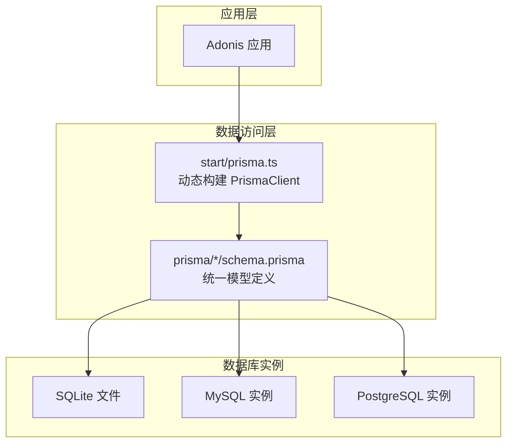
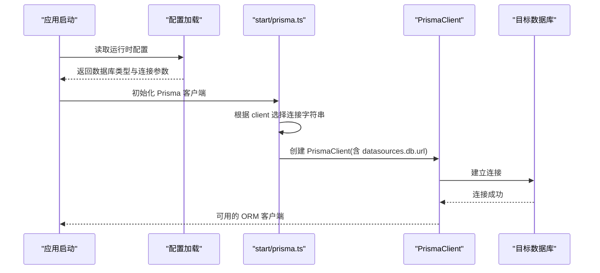
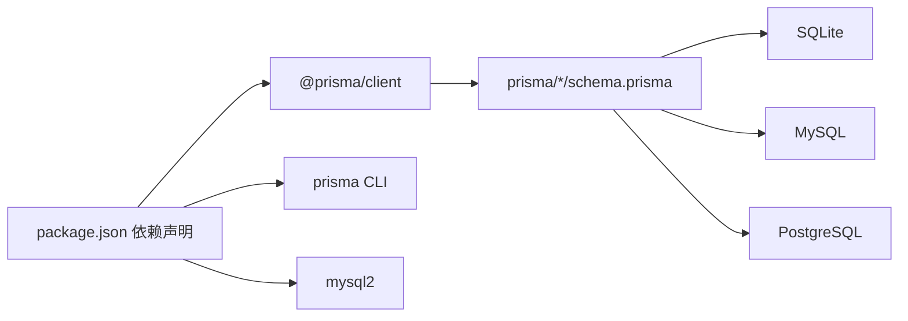

# 数据库设计

<cite>
**本文引用的文件**
- [prisma/sqlite/schema.prisma](file://prisma/sqlite/schema.prisma)
- [prisma/mysql/schema.prisma](file://prisma/mysql/schema.prisma)
- [prisma/pgsql/schema.prisma](file://prisma/pgsql/schema.prisma)
- [prisma/mysql/migrations/20240817084208_init/migration.sql](file://prisma/mysql/migrations/20240817084208_init/migration.sql)
- [prisma/pgsql/migrations/20240817084740_init/migration.sql](file://prisma/pgsql/migrations/20240817084740_init/migration.sql)
- [prisma/sqlite/migrations/20240817081809_init/migration.sql](file://prisma/sqlite/migrations/20240817081809_init/migration.sql)
- [start/prisma.ts](file://start/prisma.ts)
- [config/database.ts](file://config/database.ts)
- [package.json](file://package.json)
- [data-example/config/smanga.json](file://data-example/config/smanga.json)
</cite>

## 目录
1. [简介](#简介)
2. [项目结构](#项目结构)
3. [核心组件](#核心组件)
4. [架构总览](#架构总览)
5. [详细组件分析](#详细组件分析)
6. [依赖分析](#依赖分析)
7. [性能考虑](#性能考虑)
8. [故障排查指南](#故障排查指南)
9. [结论](#结论)
10. [附录](#附录)

## 简介
本文件为 SManga Adonis 的数据库设计与实现文档，覆盖多数据库支持（SQLite、MySQL、PostgreSQL）、实体关系模型、字段定义与数据类型、主键/外键与索引约束、数据访问模式、缓存策略、性能考量、数据生命周期与归档、迁移路径与版本管理、以及数据安全与访问控制要点。文档以 Prisma 模型与迁移 SQL 为依据，结合运行时客户端初始化逻辑，提供从概念到落地的完整视图。

## 项目结构
SManga Adonis 使用 Prisma 管理多数据库后端，通过统一的 Prisma 模型在 SQLite、MySQL、PostgreSQL 间保持一致的实体语义，并通过运行时配置选择具体数据源。



图表来源
- [start/prisma.ts:1-42](file://start/prisma.ts#L1-L42)
- [prisma/sqlite/schema.prisma:1-447](file://prisma/sqlite/schema.prisma#L1-L447)
- [prisma/mysql/schema.prisma:1-449](file://prisma/mysql/schema.prisma#L1-L449)
- [prisma/pgsql/schema.prisma:1-448](file://prisma/pgsql/schema.prisma#L1-L448)

章节来源
- [start/prisma.ts:1-42](file://start/prisma.ts#L1-L42)
- [prisma/sqlite/schema.prisma:1-447](file://prisma/sqlite/schema.prisma#L1-L447)
- [prisma/mysql/schema.prisma:1-449](file://prisma/mysql/schema.prisma#L1-L449)
- [prisma/pgsql/schema.prisma:1-448](file://prisma/pgsql/schema.prisma#L1-L448)

## 核心组件
- 统一模型：SQLite/MySQL/PostgreSQL 共用同一套 Prisma 模型定义，确保跨数据库一致性。
- 运行时客户端：根据配置动态选择数据库类型与连接参数，生成 PrismaClient。
- 迁移脚本：各数据库的初始迁移脚本定义了表结构、索引与外键约束。
- 配置示例：提供 SQLite 默认配置样例，便于本地开发与部署。

章节来源
- [start/prisma.ts:7-33](file://start/prisma.ts#L7-L33)
- [prisma/sqlite/schema.prisma:1-447](file://prisma/sqlite/schema.prisma#L1-L447)
- [prisma/mysql/schema.prisma:1-449](file://prisma/mysql/schema.prisma#L1-L449)
- [prisma/pgsql/schema.prisma:1-448](file://prisma/pgsql/schema.prisma#L1-L448)
- [data-example/config/smanga.json:1-54](file://data-example/config/smanga.json#L1-L54)

## 架构总览
下图展示数据库层与应用层交互，以及多数据库适配策略：



图表来源
- [start/prisma.ts:7-33](file://start/prisma.ts#L7-L33)
- [config/database.ts:1-24](file://config/database.ts#L1-L24)
- [data-example/config/smanga.json:2-11](file://data-example/config/smanga.json#L2-L11)

## 详细组件分析

### 实体关系总览
以下 ER 图基于 Prisma 模型与迁移脚本中的索引与外键定义绘制，涵盖主要实体及其关联关系。

```mermaid
erDiagram
MEDIA {
int mediaId PK
string mediaName UK
int mediaType
string mediaRating
string mediaCover
string sourceWebsite
int isCloudMedia
int directoryFormat
string browseType
int direction
int removeFirst
int deleteFlag
datetime createTime
datetime updateTime
}
PATH {
int pathId PK
int mediaId FK
string pathType
int autoScan
string include
string exclude
datetime lastScanTime
int deleteFlag
datetime createTime
datetime updateTime
string pathContent
}
MANGA {
int mangaId PK
int mediaId FK
int pathId FK
string mangaName
string mangaPath
string parentPath
string mangaCover
string mangaNumber
int chapterCount
string browseType
int direction
int removeFirst
string title
string subTitle
string author
string describe
date publishDate
int deleteFlag
datetime createTime
datetime updateTime
datetime chapterUpdate
}
CHAPTER {
int chapterId PK
int mangaId FK
int mediaId FK
int pathId FK
string browseType
string subTitle
int picNum
datetime createTime
datetime updateTime
string chapterName
string chapterPath
string chapterType
string chapterCover
string chapterNumber
int deleteFlag
}
BOOKMARK {
int bookmarkId PK
int mediaId
int mangaId FK
int chapterId FK
int userId
string browseType
int page
datetime createTime
datetime updateTime
string pageImage
}
HISTORY {
int historyId PK
int userId FK
int mediaId
int mangaId FK
string mangaName
int chapterId FK
string chapterName
string chapterPath
string browseType
datetime createTime
datetime updateTime
}
LATEST {
int latestId PK
int page
int count
int finish
int mangaId FK
int chapterId FK
int userId
datetime createTime
datetime updateTime
}
COLLECT {
int collectId PK
string collectType
int userId FK
int mediaId
int mangaId FK
string mangaName
int chapterId FK
string chapterName
datetime createTime
datetime updateTime
}
COMPRESS {
int compressId PK
string compressType
string compressPath
string compressStatus
int imageCount
int mediaId
int mangaId FK
int chapterId FK UK
string chapterPath
int userId
datetime createTime
datetime updateTime
}
META {
int metaId PK
string metaName
int mangaId FK
int chapterId FK
string metaFile
string metaContent
string description
datetime createTime
datetime updateTime
}
TAG {
int tagId PK
string tagName
string tagColor
int userId
string description
datetime createTime
datetime updateTime
}
MANGATAG {
int mangaTagId PK
int mangaId FK
int tagId FK
datetime createTime
datetime updateTime
}
SCAN {
int scanId PK
string scanStatus
string targetPath
int pathId FK UK
int scanCount
int scanIndex
datetime createTime
datetime updateTime
string pathContent
}
USER {
int userId PK
string userName UK
string passWord
string nickName
string header
string role
string mediaPermit
datetime createTime
datetime updateTime
json userConfig
}
TOKEN {
int tokenId PK
int userId FK
string token
datetime expires
datetime createTime
datetime updateTime
}
LOGIN {
int loginId PK
int userId FK
string userName
string nickName
int request
string ip
json userAgent
datetime createTime
datetime updateTime
string token
}
USERPERMISSION {
int userPermissonId PK
int userId FK
string module
string operation
datetime createTime
datetime updateTime
}
MEDIAPERMISSION {
int mediaPermissonId PK
int userId FK
int mediaId FK
datetime createTime
datetime updateTime
}
SHARE {
int shareId PK
string shareType
string shareName
string origin
int userId FK
int mediaId FK
int mangaId FK
string link
string secret
datetime expires
int enable
string whiteList
string blackList
datetime createTime
datetime updateTime
}
SYNC {
int syncId PK
string syncType
string syncName
string receivedPath
string origin
int userId
int shareId
string link
string secret
int auto
string token
datetime createTime
datetime updateTime
}
VERSION {
int versionId PK
string version UK
string description
datetime createTime
datetime updateTime
}
TASK {
int taskId PK
string taskName
text command
datetime createTime
datetime updateTime
string status
json args
timestamp startTime
timestamp endTime
text error
int priority
}
TASKFAILED {
int taskId PK
string taskName
string status
text command
json args
timestamp startTime
timestamp endTime
text error
datetime createTime
datetime updateTime
}
TASKSUCCESS {
int taskId PK
string taskName
string status
text command
json args
timestamp startTime
timestamp endTime
datetime createTime
datetime updateTime
}
LOG {
int logId PK
string logType
int logLevel
string module
string queue
string message
text exception
text version
text environment
json context
json device
datetime createTime
datetime updateTime
int userId
}
MEDIA ||--o{ PATH : "拥有"
PATH ||--o{ MANGA : "包含"
MANGA ||--o{ CHAPTER : "包含"
MANGA ||--o{ BOOKMARK : "被收藏"
MANGA ||--o{ HISTORY : "浏览历史"
MANGA ||--o{ LATEST : "最近阅读"
MANGA ||--o{ COLLECT : "收藏"
MANGA ||--o{ COMPRESS : "压缩任务"
MANGA ||--o{ META : "元数据"
MANGA ||--o{ MANGATAG : "标签关联"
MANGA ||--o{ SHARE : "分享"
CHAPTER ||--o{ BOOKMARK : "书签"
CHAPTER ||--o{ HISTORY : "历史"
CHAPTER ||--o{ LATEST : "最近阅读"
CHAPTER ||--o{ COMPRESS : "压缩任务"
CHAPTER ||--o{ META : "元数据"
USER ||--o{ TOKEN : "令牌"
USER ||--o{ LOGIN : "登录日志"
USER ||--o{ HISTORY : "历史"
USER ||--o{ COLLECT : "收藏"
USER ||--o{ LATEST : "最近阅读"
USER ||--o{ BOOKMARK : "书签"
USER ||--o{ USERPERMISSION : "权限"
USER ||--o{ MEDIAPERMISSION : "媒体权限"
USER ||--o{ SHARE : "分享"
MEDIA ||--o{ MEDIAPERMISSION : "权限"
TAG ||--o{ MANGATAG : "标签关联"
```

图表来源
- [prisma/sqlite/schema.prisma:11-447](file://prisma/sqlite/schema.prisma#L11-L447)
- [prisma/mysql/schema.prisma:11-449](file://prisma/mysql/schema.prisma#L11-L449)
- [prisma/pgsql/schema.prisma:11-448](file://prisma/pgsql/schema.prisma#L11-L448)
- [prisma/mysql/migrations/20240817084208_init/migration.sql:1-449](file://prisma/mysql/migrations/20240817084208_init/migration.sql#L1-L449)
- [prisma/pgsql/migrations/20240817084740_init/migration.sql:1-479](file://prisma/pgsql/migrations/20240817084740_init/migration.sql#L1-L479)
- [prisma/sqlite/migrations/20240817081809_init/migration.sql:1-385](file://prisma/sqlite/migrations/20240817081809_init/migration.sql#L1-L385)

章节来源
- [prisma/sqlite/schema.prisma:11-447](file://prisma/sqlite/schema.prisma#L11-L447)
- [prisma/mysql/schema.prisma:11-449](file://prisma/mysql/schema.prisma#L11-L449)
- [prisma/pgsql/schema.prisma:11-448](file://prisma/pgsql/schema.prisma#L11-L448)

### 字段定义与数据类型（按数据库）
- SQLite
  - 主键：自增整数（INTEGER AUTOINCREMENT）
  - 时间戳：DATETIME（默认 CURRENT_TIMESTAMP）
  - 文本：TEXT（无长度限制）
  - JSON：TEXT（序列化存储）
  - JSONB：不适用（使用 TEXT）
- MySQL
  - 主键：UNSIGNED INT AUTO_INCREMENT
  - 时间戳：DATETIME(6)（微秒精度）
  - 文本：VARCHAR(n) 或 TEXT（按模型注解）
  - JSON：JSON（原生类型）
  - Date：DATE
  - Timestamp：TIMESTAMP(0)
- PostgreSQL
  - 主键：SERIAL（自增）
  - 时间戳：TIMESTAMP(3)（毫秒精度）
  - 文本：TEXT 或 VARCHAR(n)
  - JSON：JSONB（原生类型）
  - Date：DATE
  - Timestamp：TIMESTAMP(0)

章节来源
- [prisma/sqlite/schema.prisma:1-447](file://prisma/sqlite/schema.prisma#L1-L447)
- [prisma/mysql/schema.prisma:1-449](file://prisma/mysql/schema.prisma#L1-L449)
- [prisma/pgsql/schema.prisma:1-448](file://prisma/pgsql/schema.prisma#L1-L448)

### 主键、外键与索引
- 主键
  - 所有实体均定义主键；SQLite 使用 INTEGER AUTOINCREMENT，MySQL 使用 UNSIGNED INT AUTO_INCREMENT，PostgreSQL 使用 SERIAL。
- 外键
  - 各数据库迁移脚本中显式定义外键约束，确保参照完整性。
- 索引与唯一性
  - 唯一索引包括：用户名唯一、媒体名称唯一、章节名与漫画组合唯一、压缩章节唯一、扫描路径唯一、书签页唯一等。
  - 部分数据库迁移脚本中还包含复合主键（如 scan 表）。

章节来源
- [prisma/mysql/migrations/20240817084208_init/migration.sql:378-449](file://prisma/mysql/migrations/20240817084208_init/migration.sql#L378-L449)
- [prisma/pgsql/migrations/20240817084740_init/migration.sql:408-479](file://prisma/pgsql/migrations/20240817084740_init/migration.sql#L408-L479)
- [prisma/sqlite/migrations/20240817081809_init/migration.sql:1-385](file://prisma/sqlite/migrations/20240817081809_init/migration.sql#L1-L385)

### 数据验证与业务规则
- 用户名唯一：用户表对 userName 建唯一索引。
- 收藏去重：收藏表对用户、收藏类型、漫画与章节组合建立唯一索引。
- 最近阅读去重：最近阅读表对章节与用户组合唯一。
- 书签去重：书签表对章节与页码组合唯一。
- 压缩任务唯一：压缩表对章节唯一。
- 扫描唯一：扫描表对路径唯一。
- 删除标记：多处实体包含 deleteFlag 字段，用于软删除或状态控制。
- 浏览偏好：实体包含 browseType、direction、removeFirst 等字段，用于个性化展示与排序。

章节来源
- [prisma/sqlite/schema.prisma:369-370](file://prisma/sqlite/schema.prisma#L369-L370)
- [prisma/mysql/schema.prisma:372-373](file://prisma/mysql/schema.prisma#L372-L373)
- [prisma/pgsql/schema.prisma:400-401](file://prisma/pgsql/schema.prisma#L400-L401)

### 数据访问模式与缓存策略
- 数据访问模式
  - 应用通过 PrismaClient 访问数据库，统一使用模型定义进行查询与更新。
  - 运行时根据配置选择数据库类型与连接参数，支持 SQLite 文件、MySQL 与 PostgreSQL。
- 缓存策略
  - 仓库未发现专用缓存层实现；建议在应用层引入 Redis 缓存热点数据（如用户会话、热门媒体、近期更新），并配合失效策略与一致性保证。

章节来源
- [start/prisma.ts:7-33](file://start/prisma.ts#L7-L33)
- [package.json:62-88](file://package.json#L62-L88)

### 性能考虑
- 索引优化
  - 为高频查询列（如用户名、媒体名、章节名、路径内容、章节ID）建立唯一索引，减少重复与提升查找效率。
- 查询优化
  - 利用 Prisma 的关系查询与预加载，避免 N+1 查询问题。
- 存储引擎
  - SQLite 适合单机与轻量场景；MySQL/PG 更适合高并发与复杂事务场景。
- 时间戳精度
  - MySQL/PG 提供更高精度的时间戳，有助于审计与统计分析。

章节来源
- [prisma/mysql/migrations/20240817084208_init/migration.sql:1-449](file://prisma/mysql/migrations/20240817084208_init/migration.sql#L1-L449)
- [prisma/pgsql/migrations/20240817084740_init/migration.sql:1-479](file://prisma/pgsql/migrations/20240817084740_init/migration.sql#L1-L479)
- [prisma/sqlite/migrations/20240817081809_init/migration.sql:1-385](file://prisma/sqlite/migrations/20240817081809_init/migration.sql#L1-L385)

### 数据生命周期、保留策略与归档
- 生命周期
  - 历史记录、日志、任务执行记录等可按时间维度定期清理。
  - 用户登录与令牌信息可设置过期时间，自动失效。
- 保留策略
  - 建议对日志与任务失败记录设定保留周期（如 30/90 天），到期自动归档或删除。
- 归档规则
  - 对历史与日志采用冷热分离：近期活跃数据保留在热存储，历史数据迁移到归档存储。

章节来源
- [prisma/sqlite/schema.prisma:130-145](file://prisma/sqlite/schema.prisma#L130-L145)
- [prisma/mysql/schema.prisma:130-145](file://prisma/mysql/schema.prisma#L130-L145)
- [prisma/pgsql/schema.prisma:130-145](file://prisma/pgsql/schema.prisma#L130-L145)

### 数据迁移路径与版本管理
- 迁移路径
  - 各数据库均提供初始迁移脚本，定义基础表结构与索引。
  - 迁移文件位于 prisma/{client}/migrations 下，按时间戳命名，体现演进顺序。
- 版本管理
  - 版本表用于记录系统版本号与描述，便于追踪升级状态。
  - 建议每次数据库变更均新增迁移文件，并在生产环境执行前进行回滚测试。

章节来源
- [prisma/mysql/migrations/20240817084208_init/migration.sql:1-449](file://prisma/mysql/migrations/20240817084208_init/migration.sql#L1-L449)
- [prisma/pgsql/migrations/20240817084740_init/migration.sql:1-479](file://prisma/pgsql/migrations/20240817084740_init/migration.sql#L1-L479)
- [prisma/sqlite/migrations/20240817081809_init/migration.sql:1-385](file://prisma/sqlite/migrations/20240817081809_init/migration.sql#L1-L385)
- [prisma/sqlite/schema.prisma:440-446](file://prisma/sqlite/schema.prisma#L440-L446)
- [prisma/mysql/schema.prisma:442-448](file://prisma/mysql/schema.prisma#L442-L448)
- [prisma/pgsql/schema.prisma:441-447](file://prisma/pgsql/schema.prisma#L441-L447)

### 数据安全、隐私与访问控制
- 身份认证
  - 用户密码采用哈希存储；令牌有效期可配置，支持过期自动失效。
- 访问控制
  - 用户模块权限与媒体权限表用于细粒度授权控制。
- 隐私保护
  - 日志与上下文信息包含敏感字段，建议在生产环境脱敏或限制保留周期。

章节来源
- [prisma/sqlite/schema.prisma:368-387](file://prisma/sqlite/schema.prisma#L368-L387)
- [prisma/mysql/schema.prisma:370-388](file://prisma/mysql/schema.prisma#L370-L388)
- [prisma/pgsql/schema.prisma:369-387](file://prisma/pgsql/schema.prisma#L369-L387)

### 多数据库支持差异与配置
- 差异点
  - SQLite：文件型数据库，适合单机与轻量部署；文本为主，JSON 以 TEXT 存储。
  - MySQL：支持 UNSIGNED 整型、更丰富的字符串类型与 JSON 原生类型；时间戳支持微秒级精度。
  - PostgreSQL：支持 JSONB 原生类型、更严格的类型系统与毫秒级时间戳。
- 配置方式
  - 运行时根据配置选择数据库类型与连接参数；SQLite 支持 Windows 与类 Unix 路径差异。
  - 示例配置文件提供 SQLite 默认路径与参数示例。

章节来源
- [start/prisma.ts:12-24](file://start/prisma.ts#L12-L24)
- [data-example/config/smanga.json:3-11](file://data-example/config/smanga.json#L3-L11)

## 依赖分析
- 运行时依赖
  - @prisma/client、prisma：用于生成与运行时访问数据库。
  - mysql2：MySQL 连接驱动。
  - Adonis 配置：Lucid 连接配置（当前默认 MySQL，但可通过运行时切换）。
- 依赖关系示意



图表来源
- [package.json:58-88](file://package.json#L58-L88)
- [prisma/sqlite/schema.prisma:1-447](file://prisma/sqlite/schema.prisma#L1-L447)
- [prisma/mysql/schema.prisma:1-449](file://prisma/mysql/schema.prisma#L1-L449)
- [prisma/pgsql/schema.prisma:1-448](file://prisma/pgsql/schema.prisma#L1-L448)

章节来源
- [package.json:58-88](file://package.json#L58-L88)

## 性能考虑
- 索引与查询
  - 为常用过滤与连接字段建立索引，避免全表扫描。
- 分页与批量
  - 对历史、日志等大表采用分页查询与批量处理，降低内存占用。
- 连接池
  - 在高并发场景下启用连接池与超时控制，避免资源耗尽。
- 存储格式
  - JSON 字段在不同数据库中存储格式不同，需注意序列化与反序列化开销。

## 故障排查指南
- 连接失败
  - 检查运行时配置与数据库服务连通性；确认 SQLite 文件路径存在且可写。
- 迁移异常
  - 查看对应数据库的迁移脚本与错误日志，确认外键与索引冲突。
- 性能问题
  - 分析慢查询日志，补充缺失索引或调整查询策略。

章节来源
- [start/prisma.ts:12-24](file://start/prisma.ts#L12-L24)
- [prisma/mysql/migrations/20240817084208_init/migration.sql:378-449](file://prisma/mysql/migrations/20240817084208_init/migration.sql#L378-L449)
- [prisma/pgsql/migrations/20240817084740_init/migration.sql:408-479](file://prisma/pgsql/migrations/20240817084740_init/migration.sql#L408-L479)
- [prisma/sqlite/migrations/20240817081809_init/migration.sql:1-385](file://prisma/sqlite/migrations/20240817081809_init/migration.sql#L1-L385)

## 结论
本设计通过统一的 Prisma 模型与多数据库迁移脚本，在 SQLite、MySQL、PostgreSQL 之间实现了高度一致的数据结构与约束。结合运行时配置与连接参数，应用可在不同环境中无缝切换。建议在生产环境中完善缓存、监控与归档策略，并持续维护迁移脚本以保障数据演进的可控性与可追溯性。

## 附录
- 示例配置
  - 提供 SQLite 默认配置示例，便于快速启动与本地开发。
- 版本信息
  - 项目版本号与描述由版本表维护，便于升级追踪。

章节来源
- [data-example/config/smanga.json:1-54](file://data-example/config/smanga.json#L1-L54)
- [prisma/sqlite/schema.prisma:440-446](file://prisma/sqlite/schema.prisma#L440-L446)
- [prisma/mysql/schema.prisma:442-448](file://prisma/mysql/schema.prisma#L442-L448)
- [prisma/pgsql/schema.prisma:441-447](file://prisma/pgsql/schema.prisma#L441-L447)