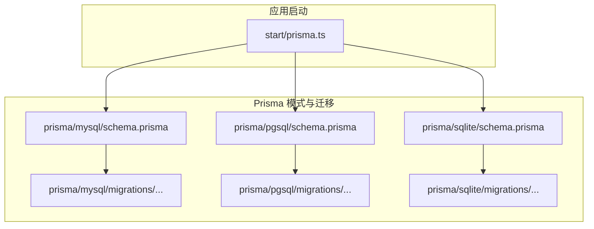
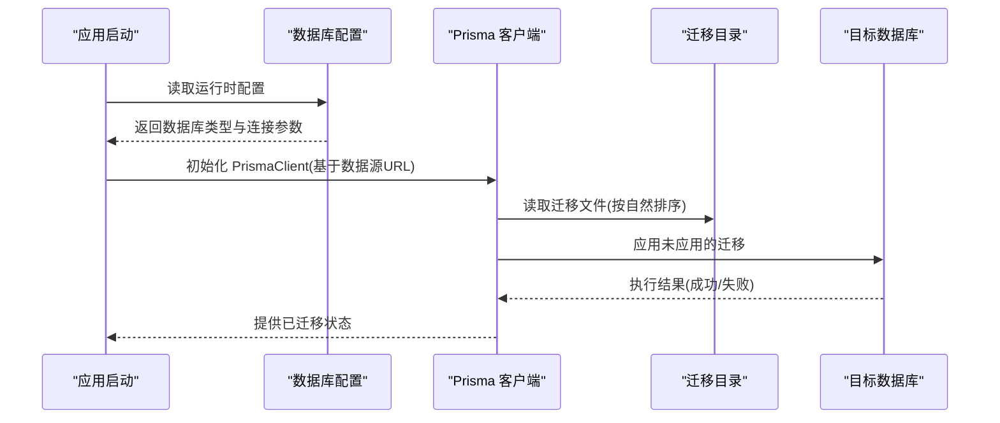
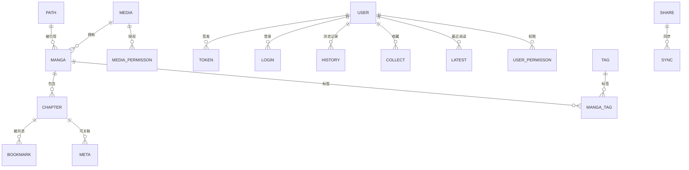
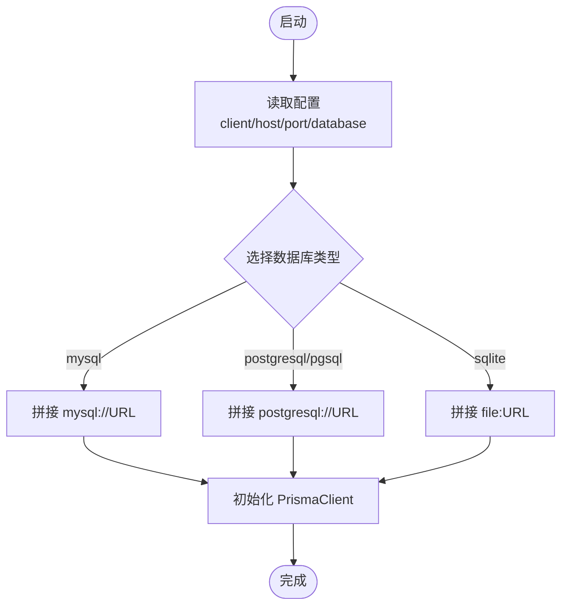
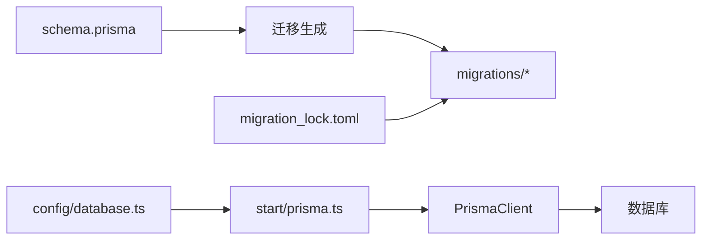

# 迁移管理

<cite>
**本文引用的文件**
- [prisma/mysql/schema.prisma](file://prisma/mysql/schema.prisma)
- [prisma/pgsql/schema.prisma](file://prisma/pgsql/schema.prisma)
- [prisma/sqlite/schema.prisma](file://prisma/sqlite/schema.prisma)
- [start/prisma.ts](file://start/prisma.ts)
- [prisma/mysql/migrations/20240817084208_init/migration.sql](file://prisma/mysql/migrations/20240817084208_init/migration.sql)
- [prisma/mysql/migrations/20250314161948_/migration.sql](file://prisma/mysql/migrations/20250314161948_/migration.sql)
- [prisma/mysql/migrations/20250710094409_share/migration.sql](file://prisma/mysql/migrations/20250710094409_share/migration.sql)
- [prisma/mysql/migrations/20250805145012_source_website/migration.sql](file://prisma/mysql/migrations/20250805145012_source_website/migration.sql)
- [prisma/mysql/migrations/20250829174551_share1/migration.sql](file://prisma/mysql/migrations/20250829174551_share1/migration.sql)
- [prisma/mysql/migrations/20250829182014_share2/migration.sql](file://prisma/mysql/migrations/20250829182014_share2/migration.sql)
- [prisma/mysql/migrations/20250910054909_meta_chapter/migration.sql](file://prisma/mysql/migrations/20250910054909_meta_chapter/migration.sql)
- [prisma/mysql/migrations/20251120111618_is_cloud_media/migration.sql](file://prisma/mysql/migrations/20251120111618_is_cloud_media/migration.sql)
- [prisma/mysql/migrations/migration_lock.toml](file://prisma/mysql/migrations/migration_lock.toml)
- [config/database.ts](file://config/database.ts)
</cite>

## 目录
1. [简介](#简介)
2. [项目结构](#项目结构)
3. [核心组件](#核心组件)
4. [架构总览](#架构总览)
5. [详细组件分析](#详细组件分析)
6. [依赖分析](#依赖分析)
7. [性能考虑](#性能考虑)
8. [故障排除指南](#故障排除指南)
9. [结论](#结论)
10. [附录](#附录)

## 简介
本文件为 SManga Adonis 的迁移管理文档，聚焦于 Prisma 迁移系统在多数据库平台（MySQL、PostgreSQL、SQLite）上的使用与最佳实践。内容涵盖：
- 迁移文件的组织与命名规范
- 迁移执行顺序与依赖关系
- 版本控制与回滚策略
- 数据库模式变更的自动化流程
- 不同数据库平台的差异与注意事项
- 故障排除与恢复指南
- 性能优化与批量操作建议

## 项目结构
SManga Adonis 将 Prisma 模式与迁移按数据库类型分目录存放，便于在不同数据库间复用模式定义并生成各自迁移文件。

图表来源
- [prisma/mysql/schema.prisma:1-449](file://prisma/mysql/schema.prisma#L1-L449)
- [prisma/pgsql/schema.prisma:1-448](file://prisma/pgsql/schema.prisma#L1-L448)
- [prisma/sqlite/schema.prisma:1-447](file://prisma/sqlite/schema.prisma#L1-L447)
- [start/prisma.ts:1-42](file://start/prisma.ts#L1-L42)

章节来源
- [prisma/mysql/schema.prisma:1-449](file://prisma/mysql/schema.prisma#L1-L449)
- [prisma/pgsql/schema.prisma:1-448](file://prisma/pgsql/schema.prisma#L1-L448)
- [prisma/sqlite/schema.prisma:1-447](file://prisma/sqlite/schema.prisma#L1-L447)
- [start/prisma.ts:1-42](file://start/prisma.ts#L1-L42)

## 核心组件
- Prisma 模式文件：定义数据模型、字段类型、索引与关系映射，决定各数据库的迁移输出。
- 迁移目录：按时间戳命名的迁移文件，记录数据库结构变更。
- 启动配置：根据运行环境选择数据库客户端与连接字符串，驱动 Prisma 客户端。
- 迁移锁文件：锁定迁移执行状态，避免并发冲突。

章节来源
- [prisma/mysql/schema.prisma:1-449](file://prisma/mysql/schema.prisma#L1-L449)
- [prisma/pgsql/schema.prisma:1-448](file://prisma/pgsql/schema.prisma#L1-L448)
- [prisma/sqlite/schema.prisma:1-447](file://prisma/sqlite/schema.prisma#L1-L447)
- [prisma/mysql/migrations/migration_lock.toml:1-4](file://prisma/mysql/migrations/migration_lock.toml#L1-L4)
- [start/prisma.ts:1-42](file://start/prisma.ts#L1-L42)

## 架构总览
下图展示从应用启动到迁移执行的关键交互：

图表来源
- [start/prisma.ts:1-42](file://start/prisma.ts#L1-L42)
- [config/database.ts:1-24](file://config/database.ts#L1-L24)

## 详细组件分析

### 迁移文件与变更历史
以下为 MySQL 平台的迁移清单与关键变更摘要（按时间顺序）：

- 20240817084208_init
  - 创建全部基础表与主键、唯一索引、外键约束
  - 关键点：初始化表结构与完整性约束
  章节来源
  - [prisma/mysql/migrations/20240817084208_init/migration.sql:1-449](file://prisma/mysql/migrations/20240817084208_init/migration.sql#L1-L449)

- 20250314161948_
  - 变更 latest 表唯一索引：从 (mangaId, userId) 改为 (chapterId, userId)，并重建外键
  - 新增 count 字段用于统计
  - 关键点：索引变更需注意重复值处理
  章节来源
  - [prisma/mysql/migrations/20250314161948_/migration.sql:1-24](file://prisma/mysql/migrations/20250314161948_/migration.sql#L1-L24)

- 20250710094409_share
  - 为 share 表添加 shareName 字段
  - 关键点：新增字段默认值与空值处理
  章节来源
  - [prisma/mysql/migrations/20250710094409_share/migration.sql:1-3](file://prisma/mysql/migrations/20250710094409_share/migration.sql#L1-L3)

- 20250805145012_source_website
  - 为 media 表添加 sourceWebsite 字段
  - 关键点：字段类型与长度适配
  章节来源
  - [prisma/mysql/migrations/20250805145012_source_website/migration.sql:1-3](file://prisma/mysql/migrations/20250805145012_source_website/migration.sql#L1-L3)

- 20250829174551_share1
  - 为 share 表添加 shareName 字段（重复）
  - 关键点：避免重复迁移；如需幂等，请合并或跳过
  章节来源
  - [prisma/mysql/migrations/20250829174551_share1/migration.sql:1-3](file://prisma/mysql/migrations/20250829174551_share1/migration.sql#L1-L3)

- 20250829182014_share2
  - 为 share 与 sync 表分别添加 shareName 与 syncName 字段
  - 关键点：字段名一致性与业务含义
  章节来源
  - [prisma/mysql/migrations/20250829182014_share2/migration.sql:1-6](file://prisma/mysql/migrations/20250829182014_share2/migration.sql#L1-L6)

- 20250910054909_meta_chapter
  - 为 meta 表添加 chapterId 外键关联
  - 关键点：外键约束与空值处理
  章节来源
  - [prisma/mysql/migrations/20250910054909_meta_chapter/migration.sql:1-6](file://prisma/mysql/migrations/20250910054909_meta_chapter/migration.sql#L1-L6)

- 20251120111618_is_cloud_media
  - 为 media 表添加 isCloudMedia 字段，默认 0
  - 关键点：布尔语义与默认值设计
  章节来源
  - [prisma/mysql/migrations/20251120111618_is_cloud_media/migration.sql:1-3](file://prisma/mysql/migrations/20251120111618_is_cloud_media/migration.sql#L1-L3)

迁移执行顺序与依赖关系
- 迁移按文件夹名称自然排序执行，先执行时间戳早的迁移，再执行新的迁移
- 外键依赖遵循“先建表后加外键”的原则，确保引用完整性
- 索引变更（如 latest 表唯一索引重定义）需要在变更前删除旧索引，变更后重建新索引

章节来源
- [prisma/mysql/migrations/20240817084208_init/migration.sql:378-449](file://prisma/mysql/migrations/20240817084208_init/migration.sql#L378-L449)
- [prisma/mysql/migrations/20250314161948_/migration.sql:7-24](file://prisma/mysql/migrations/20250314161948_/migration.sql#L7-L24)

### 数据库模式定义与差异
三套 schema.prisma 文件定义了相同的数据模型，但针对不同数据库的特性做了差异化处理：
- MySQL：使用无符号整型与高精度时间字段，JSON 类型以 TEXT 存储
- PostgreSQL：使用自增主键与标准时间戳类型，JSON 类型以 JSONB/JSON 存储
- SQLite：使用自增主键与通用文本类型，JSON 类型以 TEXT 存储

图表来源
- [prisma/mysql/schema.prisma:11-449](file://prisma/mysql/schema.prisma#L11-L449)
- [prisma/pgsql/schema.prisma:11-448](file://prisma/pgsql/schema.prisma#L11-L448)
- [prisma/sqlite/schema.prisma:11-447](file://prisma/sqlite/schema.prisma#L11-L447)

章节来源
- [prisma/mysql/schema.prisma:1-449](file://prisma/mysql/schema.prisma#L1-L449)
- [prisma/pgsql/schema.prisma:1-448](file://prisma/pgsql/schema.prisma#L1-L448)
- [prisma/sqlite/schema.prisma:1-447](file://prisma/sqlite/schema.prisma#L1-L447)

### 迁移执行与客户端选择
应用通过启动脚本动态构建数据库 URL，并初始化 PrismaClient：
- MySQL：使用 mysql:// 协议
- PostgreSQL：使用 postgresql:// 协议
- SQLite：使用 file: 协议，支持 Windows 与类 Unix 路径

图表来源
- [start/prisma.ts:7-33](file://start/prisma.ts#L7-L33)

章节来源
- [start/prisma.ts:1-42](file://start/prisma.ts#L1-L42)

### 版本控制与回滚策略
- 使用迁移锁文件防止并发执行
- 回滚策略建议：
  - 优先使用“向前迁移 + 新增修正迁移”的方式，避免直接回滚生产库
  - 对于可逆变更（如新增列），可在新迁移中进行反向修改
  - 对于不可逆变更（如删除列），应谨慎评估并准备数据备份
- 建议在每次迁移后提交迁移文件与迁移锁文件

章节来源
- [prisma/mysql/migrations/migration_lock.toml:1-4](file://prisma/mysql/migrations/migration_lock.toml#L1-L4)

### 自动化流程
- 在 CI/CD 中自动执行迁移：
  - 部署前置条件：数据库可达且具备相应权限
  - 执行命令：prisma migrate deploy 或 prisma migrate dev（开发环境）
  - 成功后更新应用版本号与迁移状态
- 开发环境建议使用 prisma migrate dev，生产环境使用 prisma migrate deploy

章节来源
- [config/database.ts:1-24](file://config/database.ts#L1-L24)

## 依赖分析
- 模式文件是迁移生成的唯一真相来源，迁移文件由模式变更生成
- 启动脚本依赖配置文件中的数据库类型与连接参数
- 迁移锁文件与迁移目录共同保证迁移执行的幂等性与一致性

图表来源
- [prisma/mysql/schema.prisma:1-449](file://prisma/mysql/schema.prisma#L1-L449)
- [prisma/mysql/migrations/migration_lock.toml:1-4](file://prisma/mysql/migrations/migration_lock.toml#L1-L4)
- [config/database.ts:1-24](file://config/database.ts#L1-L24)
- [start/prisma.ts:1-42](file://start/prisma.ts#L1-L42)

章节来源
- [prisma/mysql/schema.prisma:1-449](file://prisma/mysql/schema.prisma#L1-L449)
- [config/database.ts:1-24](file://config/database.ts#L1-L24)
- [start/prisma.ts:1-42](file://start/prisma.ts#L1-L42)

## 性能考虑
- 批量 DDL 操作：尽量将多个 ALTER 操作合并到单个迁移中，减少锁竞争
- 索引维护：大表建索引时考虑在线索引（MySQL 8+）、分批导入与延迟索引
- 时间字段精度：根据业务需求选择合适的时间精度，避免过度冗余
- JSON 字段：在 MySQL 中使用 TEXT 存储 JSON，注意查询性能与索引策略
- 外键约束：在高并发写入场景下，适当放宽约束或采用事件驱动异步校验

## 故障排除指南
常见问题与处理步骤：
- 迁移失败（唯一约束冲突）
  - 现象：索引变更时报唯一约束冲突
  - 处理：清理重复数据或调整数据清洗逻辑后再执行迁移
  - 参考迁移
    - [prisma/mysql/migrations/20250314161948_/migration.sql:1-24](file://prisma/mysql/migrations/20250314161948_/migration.sql#L1-L24)
- 外键约束错误
  - 现象：新增外键失败或引用不到目标表
  - 处理：确认被引用表已存在且数据满足约束；必要时先插入占位数据
  - 参考迁移
    - [prisma/mysql/migrations/20240817084208_init/migration.sql:378-449](file://prisma/mysql/migrations/20240817084208_init/migration.sql#L378-L449)
- 迁移锁导致无法继续
  - 现象：迁移卡住或提示锁文件存在
  - 处理：检查迁移锁文件是否正确提交；若确认无并发，可安全移除锁文件后重试
  - 参考文件
    - [prisma/mysql/migrations/migration_lock.toml:1-4](file://prisma/mysql/migrations/migration_lock.toml#L1-L4)
- SQLite JSON 类型不兼容
  - 现象：JSON 查询或索引异常
  - 处理：在 SQLite 中使用 TEXT 存储 JSON，避免复杂索引；必要时在应用层做序列化/反序列化
  - 参考模式
    - [prisma/sqlite/schema.prisma:1-447](file://prisma/sqlite/schema.prisma#L1-L447)

章节来源
- [prisma/mysql/migrations/20250314161948_/migration.sql:1-24](file://prisma/mysql/migrations/20250314161948_/migration.sql#L1-L24)
- [prisma/mysql/migrations/20240817084208_init/migration.sql:378-449](file://prisma/mysql/migrations/20240817084208_init/migration.sql#L378-L449)
- [prisma/mysql/migrations/migration_lock.toml:1-4](file://prisma/mysql/migrations/migration_lock.toml#L1-L4)
- [prisma/sqlite/schema.prisma:1-447](file://prisma/sqlite/schema.prisma#L1-L447)

## 结论
SManga Adonis 的迁移体系以 Prisma 为核心，通过统一的模式定义与多数据库平台的迁移输出，实现了跨平台的一致性与可维护性。建议在团队内明确迁移编写规范、测试流程与回滚预案，结合自动化部署与监控告警，确保数据库演进的安全与稳定。

## 附录
- 迁移最佳实践清单
  - 保持迁移小而专注，每个迁移只解决一个明确问题
  - 在开发环境充分验证迁移，再在预生产环境灰度
  - 对大表变更采用分批、限速与备份策略
  - 记录迁移变更的业务背景与风险评估
  - 统一命名规范与注释风格，便于追溯