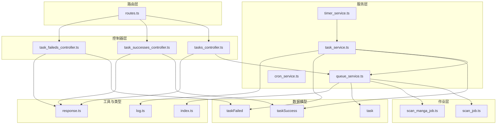
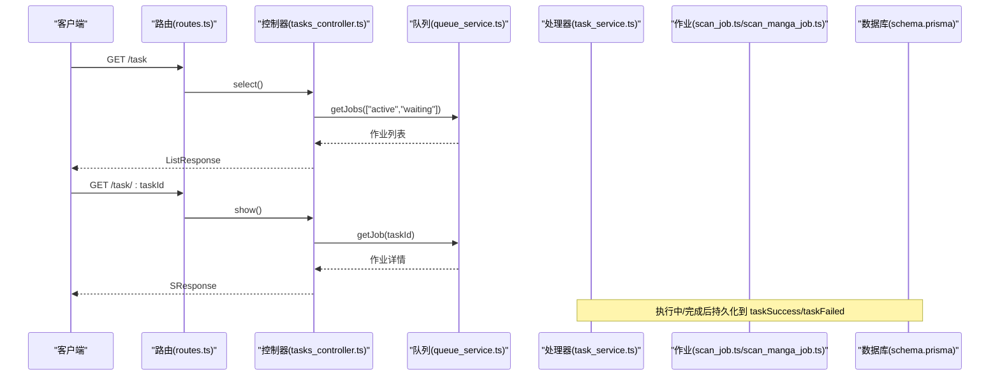
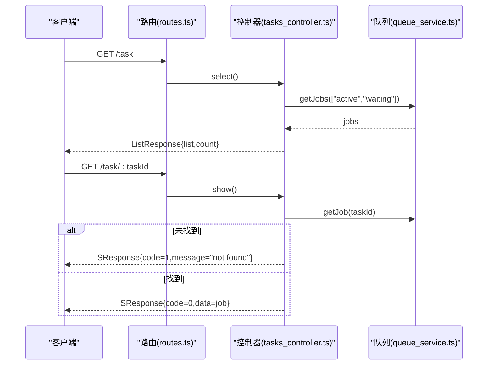
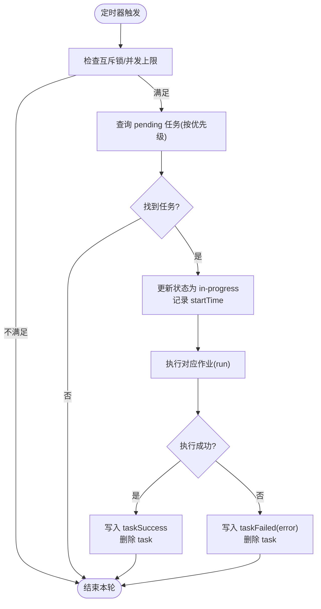
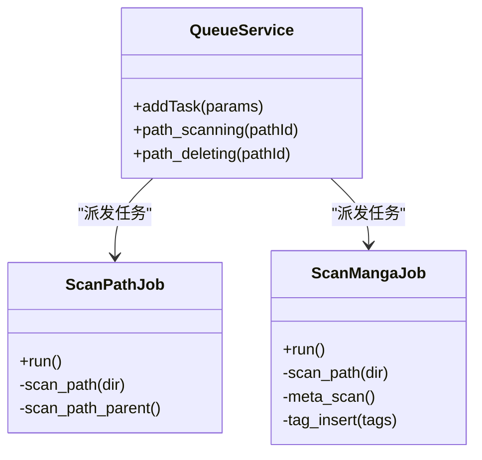
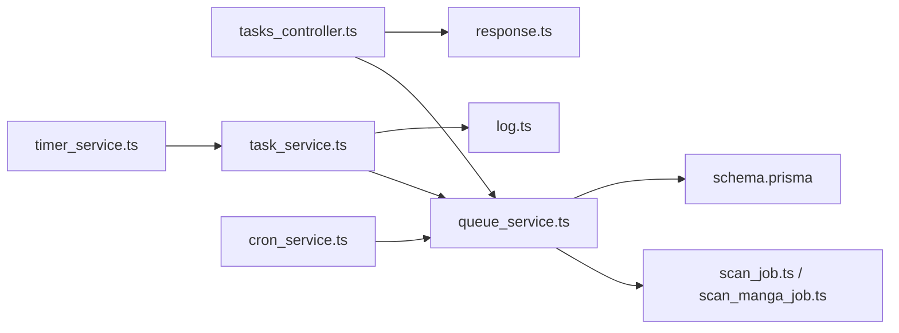

# 任务监控

<cite>
**本文引用的文件**
- [tasks_controller.ts](file://app/controllers/tasks_controller.ts)
- [task_successes_controller.ts](file://app/controllers/task_successes_controller.ts)
- [task_faileds_controller.ts](file://app/controllers/task_faileds_controller.ts)
- [queue_service.ts](file://app/services/queue_service.ts)
- [task_service.ts](file://app/services/task_service.ts)
- [timer_service.ts](file://app/services/timer_service.ts)
- [scan_job.ts](file://app/services/scan_job.ts)
- [scan_manga_job.ts](file://app/services/scan_manga_job.ts)
- [cron_service.ts](file://app/services/cron_service.ts)
- [routes.ts](file://start/routes.ts)
- [response.ts](file://app/interfaces/response.ts)
- [log.ts](file://app/utils/log.ts)
- [index.ts](file://app/type/index.ts)
- [schema.prisma(mysql)](file://prisma/mysql/schema.prisma)
- [schema.prisma(pgsql)](file://prisma/pgsql/schema.prisma)
- [schema.prisma(sqlite)](file://prisma/sqlite/schema.prisma)
</cite>

## 目录
1. [简介](#简介)
2. [项目结构](#项目结构)
3. [核心组件](#核心组件)
4. [架构总览](#架构总览)
5. [详细组件分析](#详细组件分析)
6. [依赖关系分析](#依赖关系分析)
7. [性能考量](#性能考量)
8. [故障排查指南](#故障排查指南)
9. [结论](#结论)
10. [附录](#附录)

## 简介
本文件面向 SManga Adonis 的任务监控系统，围绕“任务状态查询、执行进度跟踪、成功/失败任务列表获取”三大目标，系统化梳理任务生命周期各阶段的监控机制、API 使用方式、性能指标采集、异常处理与告警建议，并提供调试工具与日志分析技巧及监控界面使用指南。

## 项目结构
任务监控体系由以下层次构成：
- 路由层：定义任务相关 API，暴露任务查询、删除等接口
- 控制器层：封装任务队列与历史结果的查询与管理
- 服务层：Bull 队列调度、任务执行与持久化、定时任务调度
- 数据模型层：任务、成功/失败记录的数据库结构
- 工具与类型：统一响应格式、任务优先级、日志工具

图表来源
- [routes.ts:127-132](file://start/routes.ts#L127-L132)
- [tasks_controller.ts:1-55](file://app/controllers/tasks_controller.ts#L1-L55)
- [task_successes_controller.ts:1-54](file://app/controllers/task_successes_controller.ts#L1-L54)
- [task_faileds_controller.ts:1-61](file://app/controllers/task_faileds_controller.ts#L1-L61)
- [queue_service.ts:1-267](file://app/services/queue_service.ts#L1-L267)
- [task_service.ts:1-171](file://app/services/task_service.ts#L1-L171)
- [timer_service.ts:1-44](file://app/services/timer_service.ts#L1-L44)
- [scan_job.ts:1-254](file://app/services/scan_job.ts#L1-L254)
- [scan_manga_job.ts:1-800](file://app/services/scan_manga_job.ts#L1-L800)
- [schema.prisma(mysql):313-355](file://prisma/mysql/schema.prisma#L313-L355)
- [response.ts:1-64](file://app/interfaces/response.ts#L1-L64)
- [log.ts:1-74](file://app/utils/log.ts#L1-L74)
- [index.ts:1-49](file://app/type/index.ts#L1-L49)

章节来源
- [routes.ts:127-132](file://start/routes.ts#L127-L132)
- [tasks_controller.ts:1-55](file://app/controllers/tasks_controller.ts#L1-L55)
- [task_successes_controller.ts:1-54](file://app/controllers/task_successes_controller.ts#L1-L54)
- [task_faileds_controller.ts:1-61](file://app/controllers/task_faileds_controller.ts#L1-L61)
- [queue_service.ts:1-267](file://app/services/queue_service.ts#L1-L267)
- [task_service.ts:1-171](file://app/services/task_service.ts#L1-L171)
- [timer_service.ts:1-44](file://app/services/timer_service.ts#L1-L44)
- [scan_job.ts:1-254](file://app/services/scan_job.ts#L1-L254)
- [scan_manga_job.ts:1-800](file://app/services/scan_manga_job.ts#L1-L800)
- [schema.prisma(mysql):313-355](file://prisma/mysql/schema.prisma#L313-L355)
- [response.ts:1-64](file://app/interfaces/response.ts#L1-L64)
- [log.ts:1-74](file://app/utils/log.ts#L1-L74)
- [index.ts:1-49](file://app/type/index.ts#L1-L49)

## 核心组件
- 任务队列与调度
  - Bull 队列：按类别处理扫描、同步、压缩等任务，支持并发、重试、超时与指数退避
  - 任务派发：根据命令分发到具体作业；支持同步/异步模式与去重
- 任务生命周期
  - 待执行：写入 task 表，按优先级排队
  - 执行中：状态更新为 in-progress，记录开始时间
  - 完成/失败：分别写入 taskSuccess 或 taskFailed，记录结束时间与错误信息
- 历史记录查询
  - 成功/失败记录：通过专用控制器查询 taskSuccess/taskFailed 表
  - 队列作业：通过队列 API 查询 active/waiting 等状态作业
- 统一响应格式
  - SResponse/ListResponse 提供统一的 code/message/status/data/error 返回结构

章节来源
- [queue_service.ts:34-141](file://app/services/queue_service.ts#L34-L141)
- [task_service.ts:36-169](file://app/services/task_service.ts#L36-L169)
- [task_successes_controller.ts:7-16](file://app/controllers/task_successes_controller.ts#L7-L16)
- [task_faileds_controller.ts:14-22](file://app/controllers/task_faileds_controller.ts#L14-L22)
- [tasks_controller.ts:6-28](file://app/controllers/tasks_controller.ts#L6-L28)
- [response.ts:18-63](file://app/interfaces/response.ts#L18-L63)

## 架构总览
任务监控系统采用“路由-控制器-服务-作业-数据库”的分层设计，结合 Bull 队列与定时任务，形成完整的任务生命周期闭环。

图表来源
- [routes.ts:127-132](file://start/routes.ts#L127-L132)
- [tasks_controller.ts:6-28](file://app/controllers/tasks_controller.ts#L6-L28)
- [queue_service.ts:143-165](file://app/services/queue_service.ts#L143-L165)
- [task_service.ts:91-169](file://app/services/task_service.ts#L91-L169)
- [scan_job.ts:29-119](file://app/services/scan_job.ts#L29-L119)
- [scan_manga_job.ts:76-356](file://app/services/scan_manga_job.ts#L76-L356)
- [schema.prisma(mysql):313-355](file://prisma/mysql/schema.prisma#L313-L355)

## 详细组件分析

### 任务状态查询与历史记录
- 任务状态查询接口
  - GET /task：列出当前 active/waiting 的作业
  - GET /task/:taskId：按 ID 查询作业详情
  - DELETE /task/:taskId：删除指定作业
  - DELETE /task：清空队列（实际使用 clean 清理）
  - DELETE /task/:taskIds/batch：批量删除作业
- 成功/失败任务列表
  - GET /task/success：查询 taskSuccess 表
  - GET /task/failed：查询 taskFailed 表
- 统一响应
  - SResponse：code/message/status/data/error
  - ListResponse：code/message/list/count

图表来源
- [routes.ts:127-132](file://start/routes.ts#L127-L132)
- [tasks_controller.ts:6-28](file://app/controllers/tasks_controller.ts#L6-L28)
- [queue_service.ts:143-165](file://app/services/queue_service.ts#L143-L165)
- [response.ts:18-33](file://app/interfaces/response.ts#L18-L33)

章节来源
- [tasks_controller.ts:6-53](file://app/controllers/tasks_controller.ts#L6-L53)
- [task_successes_controller.ts:7-53](file://app/controllers/task_successes_controller.ts#L7-L53)
- [task_faileds_controller.ts:14-60](file://app/controllers/task_faileds_controller.ts#L14-L60)
- [routes.ts:127-132](file://start/routes.ts#L127-L132)
- [response.ts:18-63](file://app/interfaces/response.ts#L18-L63)

### 任务执行与生命周期
- 生命周期阶段
  - 待执行：写入 task 表，状态 pending
  - 执行中：状态 in-progress，记录 startTime
  - 完成：状态 completed，写入 taskSuccess
  - 失败：状态 failed，写入 taskFailed，并记录 error
- 执行流程
  - 定时器周期触发任务处理器
  - 任务处理器从数据库取 pending 任务，按优先级执行
  - 作业完成后写入成功/失败记录并删除任务

图表来源
- [timer_service.ts:17-25](file://app/services/timer_service.ts#L17-L25)
- [task_service.ts:36-84](file://app/services/task_service.ts#L36-L84)
- [task_service.ts:91-169](file://app/services/task_service.ts#L91-L169)

章节来源
- [timer_service.ts:17-25](file://app/services/timer_service.ts#L17-L25)
- [task_service.ts:36-84](file://app/services/task_service.ts#L36-L84)
- [task_service.ts:91-169](file://app/services/task_service.ts#L91-L169)

### 队列与作业
- 队列配置
  - 并发、最大重试次数、超时时间可配置
  - 指数退避，最大延迟限制，避免重试风暴
- 任务派发
  - 支持同步/异步模式
  - 对扫描/删除路径进行去重判断
  - 自动选择队列类别（scan/sync/compress）
- 作业类型
  - 扫描路径：派发扫描漫画任务、生成媒体封面等
  - 扫描漫画：解析元数据、生成封面、更新章节与标签

图表来源
- [queue_service.ts:175-264](file://app/services/queue_service.ts#L175-L264)
- [scan_job.ts:29-119](file://app/services/scan_job.ts#L29-L119)
- [scan_manga_job.ts:76-356](file://app/services/scan_manga_job.ts#L76-L356)

章节来源
- [queue_service.ts:175-264](file://app/services/queue_service.ts#L175-L264)
- [scan_job.ts:29-119](file://app/services/scan_job.ts#L29-L119)
- [scan_manga_job.ts:76-356](file://app/services/scan_manga_job.ts#L76-L356)

### 定时任务与自动调度
- 扫描定时任务：按配置周期扫描路径
- 同步定时任务：按配置周期执行媒体/漫画同步
- 媒体封面生成定时任务：周期性生成媒体库封面
- 清理压缩缓存定时任务：周期性清理压缩缓存

章节来源
- [cron_service.ts:16-89](file://app/services/cron_service.ts#L16-L89)
- [cron_service.ts:91-141](file://app/services/cron_service.ts#L91-L141)

### 数据模型与字段
- 任务表 task：包含 taskId、taskName、command、status、args、startTime、endTime、error、priority 等
- 成功记录 taskSuccess：包含 taskId、taskName、status、command、args、startTime、endTime
- 失败记录 taskFailed：包含 taskId、taskName、status、command、args、startTime、endTime、error

章节来源
- [schema.prisma(mysql):313-355](file://prisma/mysql/schema.prisma#L313-L355)
- [schema.prisma(pgsql):315-356](file://prisma/pgsql/schema.prisma#L315-L356)
- [schema.prisma(sqlite):316-358](file://prisma/sqlite/schema.prisma#L316-L358)

## 依赖关系分析
- 控制器依赖队列服务与 Prisma 模型
- 任务处理器依赖队列服务与各类作业
- 队列服务依赖 Redis（Bull），并注册不同类别处理器
- 日志工具贯穿作业执行过程，便于追踪与告警

图表来源
- [tasks_controller.ts:1-55](file://app/controllers/tasks_controller.ts#L1-L55)
- [queue_service.ts:1-267](file://app/services/queue_service.ts#L1-L267)
- [task_service.ts:1-171](file://app/services/task_service.ts#L1-L171)
- [cron_service.ts:1-144](file://app/services/cron_service.ts#L1-L144)
- [timer_service.ts:1-44](file://app/services/timer_service.ts#L1-L44)
- [log.ts:1-74](file://app/utils/log.ts#L1-L74)
- [schema.prisma(mysql):313-355](file://prisma/mysql/schema.prisma#L313-L355)

章节来源
- [tasks_controller.ts:1-55](file://app/controllers/tasks_controller.ts#L1-L55)
- [queue_service.ts:1-267](file://app/services/queue_service.ts#L1-L267)
- [task_service.ts:1-171](file://app/services/task_service.ts#L1-L171)
- [cron_service.ts:1-144](file://app/services/cron_service.ts#L1-L144)
- [timer_service.ts:1-44](file://app/services/timer_service.ts#L1-L44)
- [log.ts:1-74](file://app/utils/log.ts#L1-L74)
- [schema.prisma(mysql):313-355](file://prisma/mysql/schema.prisma#L313-L355)

## 性能考量
- 并发控制
  - 任务处理器限制最大并发，避免资源争用
  - 队列并发与重试次数可配置，指数退避降低风暴效应
- 去重与短路
  - 扫描/删除路径任务在队列中去重，避免重复执行
- 超时与重试
  - 为耗时任务设置合理超时与重试策略，失败后记录 error 便于定位
- I/O 优化
  - 扫描与解压等 I/O 密集型操作尽量异步化，减少阻塞

章节来源
- [task_service.ts:29](file://app/services/task_service.ts#L29)
- [queue_service.ts:30-32](file://app/services/queue_service.ts#L30-L32)
- [queue_service.ts:222-232](file://app/services/queue_service.ts#L222-L232)
- [queue_service.ts:252-260](file://app/services/queue_service.ts#L252-L260)

## 故障排查指南
- 常见问题
  - 任务未执行：检查定时器是否启动、任务处理器是否在运行
  - 任务堆积：检查并发配置、队列类别是否正确、是否存在长时间阻塞作业
  - 重复执行：确认路径扫描/删除去重逻辑是否生效
  - 失败定位：查看 taskFailed 记录的 error 字段与日志
- 调试工具与日志
  - 使用 GET /task 查询 active/waiting 作业，核对任务状态
  - 使用 GET /task/failed 获取失败列表，结合 error 字段定位
  - 使用日志工具记录错误与扫描结果，便于回溯
- 建议
  - 对高频失败任务增加重试与告警
  - 对超时任务调整超时阈值或拆分为子任务

章节来源
- [tasks_controller.ts:6-28](file://app/controllers/tasks_controller.ts#L6-L28)
- [task_faileds_controller.ts:14-22](file://app/controllers/task_faileds_controller.ts#L14-L22)
- [log.ts:60-72](file://app/utils/log.ts#L60-L72)

## 结论
该任务监控系统通过“路由-控制器-队列-处理器-作业-数据库”的清晰分层，实现了对任务全生命周期的可观测与可控化。配合统一响应格式、历史记录表与日志工具，能够有效支撑任务状态查询、执行进度跟踪、成功/失败统计与故障定位。建议在生产环境中结合告警策略与容量规划，持续优化并发与重试配置，确保系统稳定高效运行。

## 附录

### API 使用清单
- 任务查询
  - GET /task：获取 active/waiting 作业列表
  - GET /task/:taskId：获取指定作业详情
- 任务管理
  - DELETE /task/:taskId：删除指定作业
  - DELETE /task：清空队列（实际清理已完成/失败任务）
  - DELETE /task/:taskIds/batch：批量删除作业
- 成功/失败记录
  - GET /task/success：获取成功任务列表
  - GET /task/failed：获取失败任务列表

章节来源
- [routes.ts:127-132](file://start/routes.ts#L127-L132)
- [tasks_controller.ts:6-53](file://app/controllers/tasks_controller.ts#L6-L53)
- [task_successes_controller.ts:7-16](file://app/controllers/task_successes_controller.ts#L7-L16)
- [task_faileds_controller.ts:14-22](file://app/controllers/task_faileds_controller.ts#L14-L22)