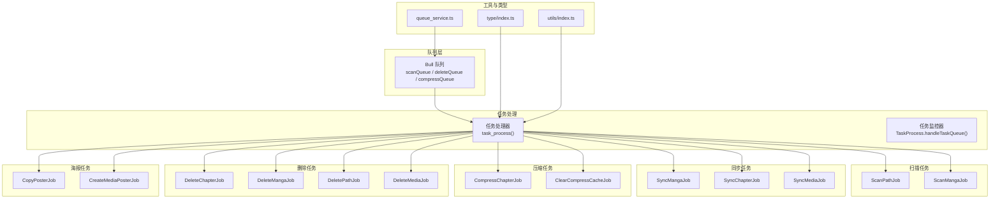
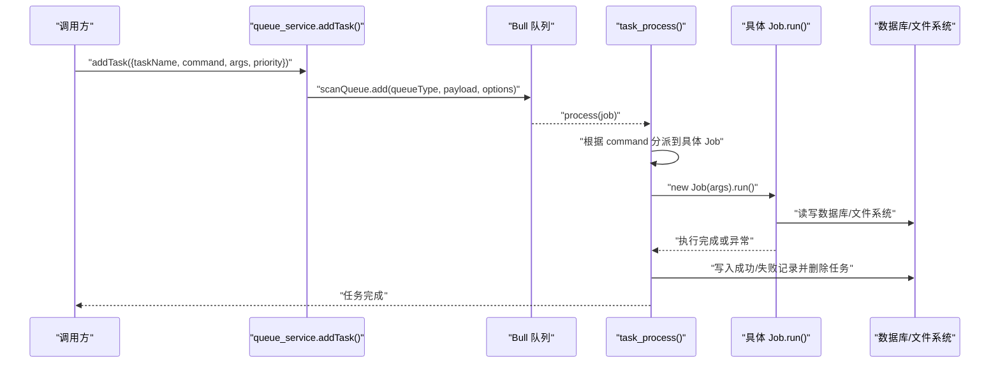
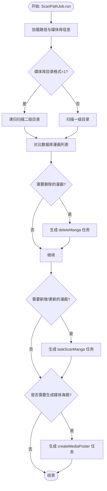
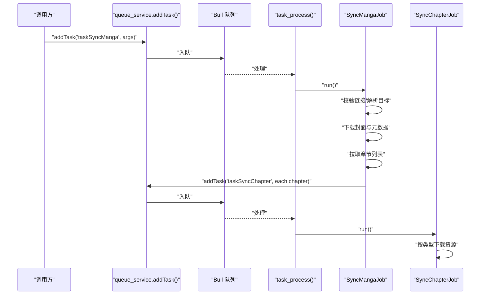
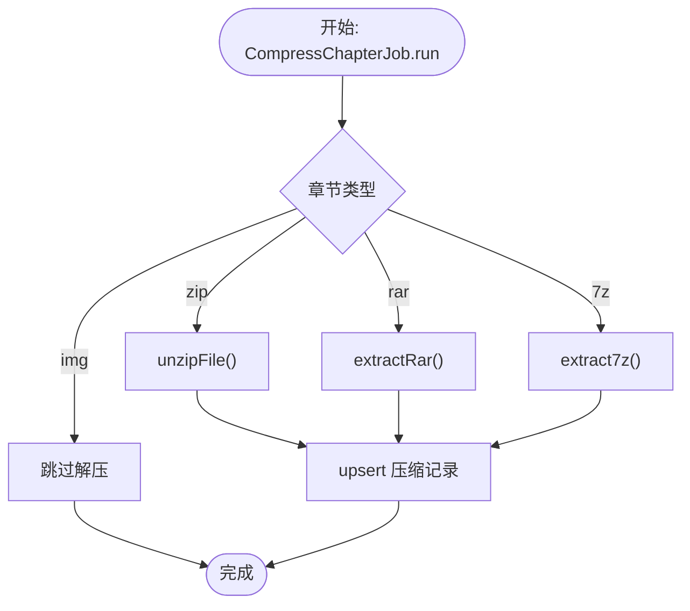
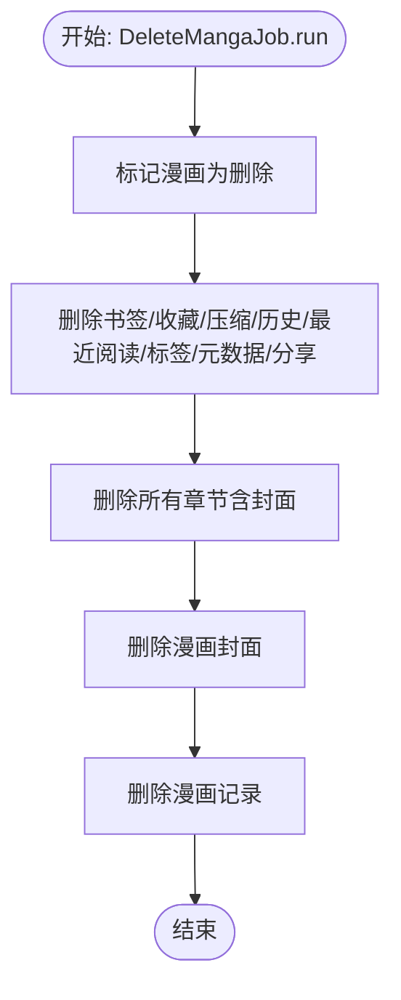
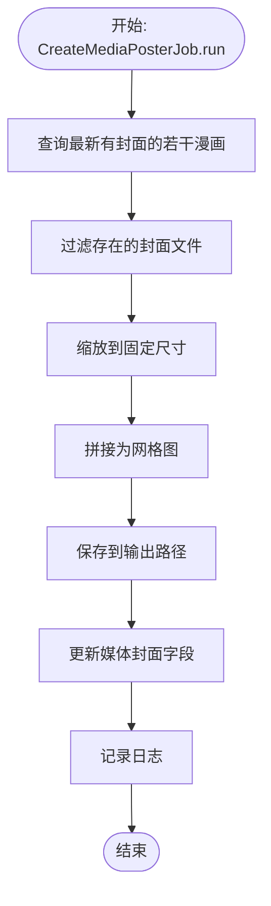
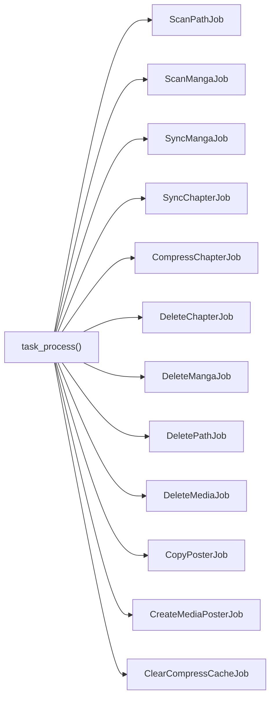

# 任务类型

<cite>
**本文引用的文件**
- [app/services/scan_job.ts](file://app/services/scan_job.ts)
- [app/services/scan_manga_job.ts](file://app/services/scan_manga_job.ts)
- [app/services/sync_manga_job.ts](file://app/services/sync_manga_job.ts)
- [app/services/sync_chapter_job.ts](file://app/services/sync_chapter_job.ts)
- [app/services/sync_media_job.ts](file://app/services/sync_media_job.ts)
- [app/services/compress_chapter_job.ts](file://app/services/compress_chapter_job.ts)
- [app/services/delete_chapter_job.ts](file://app/services/delete_chapter_job.ts)
- [app/services/delete_manga_job.ts](file://app/services/delete_manga_job.ts)
- [app/services/delete_path_job.ts](file://app/services/delete_path_job.ts)
- [app/services/delete_media_job.ts](file://app/services/delete_media_job.ts)
- [app/services/copy_poster_job.ts](file://app/services/copy_poster_job.ts)
- [app/services/create_media_poster_job.ts](file://app/services/create_media_poster_job.ts)
- [app/services/queue_service.ts](file://app/services/queue_service.ts)
- [app/services/task_service.ts](file://app/services/task_service.ts)
- [app/type/index.ts](file://app/type/index.ts)
- [app/utils/index.ts](file://app/utils/index.ts)
</cite>

## 目录
1. [简介](#简介)
2. [项目结构](#项目结构)
3. [核心组件](#核心组件)
4. [架构总览](#架构总览)
5. [详细组件分析](#详细组件分析)
6. [依赖分析](#依赖分析)
7. [性能考量](#性能考量)
8. [故障排查指南](#故障排查指南)
9. [结论](#结论)
10. [附录](#附录)

## 简介
本文件系统化梳理 SManga Adonis 中各类“任务”（Job）的实现与执行流程，覆盖扫描、同步、压缩、删除、海报处理等任务类型。文档从数据结构、参数传递、执行逻辑、结果处理、触发条件、依赖关系、错误处理与性能特征等方面进行深入说明，并提供使用示例与配置项说明，帮助开发者与运维人员高效理解与维护。

## 项目结构
SManga Adonis 的任务体系以“服务层 Job + 队列处理 + 类型与工具”的分层方式组织：
- 服务层：各具体任务封装为独立类（如 ScanPathJob、ScanMangaJob、SyncMangaJob 等），负责业务逻辑与数据持久化。
- 队列层：通过 Redis Bull 队列统一调度，按任务类别与优先级执行。
- 类型与工具：定义任务优先级、元数据键、通用路径与配置读取等。

图表来源
- [app/services/queue_service.ts:34-141](file://app/services/queue_service.ts#L34-L141)
- [app/services/task_service.ts:25-171](file://app/services/task_service.ts#L25-L171)
- [app/type/index.ts:3-16](file://app/type/index.ts#L3-L16)
- [app/utils/index.ts:94-115](file://app/utils/index.ts#L94-L115)

章节来源
- [app/services/queue_service.ts:1-267](file://app/services/queue_service.ts#L1-L267)
- [app/services/task_service.ts:1-171](file://app/services/task_service.ts#L1-L171)
- [app/type/index.ts:1-49](file://app/type/index.ts#L1-L49)
- [app/utils/index.ts:1-313](file://app/utils/index.ts#L1-L313)

## 核心组件
- 任务优先级：通过枚举定义不同任务的优先级，确保关键任务（如扫描、同步、海报生成）优先执行。
- 队列配置：支持并发、重试次数、超时、指数退避等，保障稳定性与吞吐。
- 任务处理器：统一接收命令与参数，路由到对应 Job 执行；成功/失败分别写入成功/失败表并清理。
- 工具函数：提供路径解析、配置读取、日志、文件删除、图片处理等通用能力。

章节来源
- [app/type/index.ts:3-16](file://app/type/index.ts#L3-L16)
- [app/services/queue_service.ts:17-32](file://app/services/queue_service.ts#L17-L32)
- [app/services/task_service.ts:25-171](file://app/services/task_service.ts#L25-L171)
- [app/utils/index.ts:94-115](file://app/utils/index.ts#L94-L115)

## 架构总览
以下序列图展示“添加任务 -> 入队 -> 处理器路由 -> 具体 Job 执行 -> 成功/失败记录”的完整链路。

图表来源
- [app/services/queue_service.ts:175-264](file://app/services/queue_service.ts#L175-L264)
- [app/services/queue_service.ts:103-141](file://app/services/queue_service.ts#L103-L141)
- [app/services/task_service.ts:91-171](file://app/services/task_service.ts#L91-L171)

## 详细组件分析

### 扫描任务
- 任务类型
  - taskScanPath：扫描路径，生成扫描子任务与媒体海报生成任务。
  - taskScanManga：扫描单部漫画，构建元数据、标签、封面、章节列表与顺序。
- 数据结构与参数
  - ScanPathJob：构造参数包含 pathId；运行时读取路径与媒体库信息，决定扫描策略（仅一层或递归两层）。
  - ScanMangaJob：构造参数包含 pathId、mangaPath、mangaName、parentPath、isCloudMedia；内部解析 smanga 元数据、series.json、标签、封面与章节。
- 执行逻辑
  - ScanPathJob：读取路径与媒体库 -> 依据媒体库目录格式选择扫描策略 -> 过滤隐藏文件与正则 -> 对比数据库差异 -> 生成 deleteManga 与 taskScanManga 任务 -> 可选生成媒体海报。
  - ScanMangaJob：读取路径与媒体库 -> 判断漫画类型（单本/连载）-> 若为单本：创建漫画与章节记录 -> 生成封面 -> 扫描 ComicInfo -> 写入扫描日志；若为连载：对比章节增删 -> 逐章创建/删除 -> 更新封面与元数据 -> 更新章节数量。
- 触发条件
  - 手动触发：调用 addTask(command='taskScanPath'|'taskScanManga')。
  - 自动触发：ScanPathJob 内部根据扫描结果动态 addTask。
- 依赖关系
  - 依赖 Prisma、文件系统、压缩包解压工具、图片处理工具、日志工具。
- 错误处理
  - 路径/媒体库不存在、章节插入失败、封面生成失败等均有日志记录与异常抛出。
- 性能特征
  - 递归扫描与正则过滤可能带来 IO 开销；建议合理设置忽略隐藏文件与 include/exclude 规则。

图表来源
- [app/services/scan_job.ts:29-119](file://app/services/scan_job.ts#L29-L119)

章节来源
- [app/services/scan_job.ts:15-254](file://app/services/scan_job.ts#L15-L254)
- [app/services/scan_manga_job.ts:29-356](file://app/services/scan_manga_job.ts#L29-L356)
- [app/utils/index.ts:94-115](file://app/utils/index.ts#L94-L115)

### 同步任务
- 任务类型
  - taskSyncManga：同步单部漫画，下载外置封面与元数据，再为每个章节创建同步任务。
  - taskSyncChapter：同步单个章节，按类型下载图片或整包资源。
  - taskSyncMedia：同步媒体库下所有漫画，批量触发同步任务。
- 数据结构与参数
  - SyncMangaJob：接收 link、origin、receivedPath、targetMangaRecord；根据媒体类型决定本地漫画路径。
  - SyncChapterJob：接收 localMangaPath、targetChapterRecord、origin；按章节类型处理。
  - SyncMediaJob：接收 receivedPath、link、origin；拉取媒体下所有漫画并逐个触发同步。
- 执行逻辑
  - SyncMangaJob：校验分享链接 -> 解析目标漫画 -> 下载外置封面与元数据 -> 拉取章节列表 -> 为每个章节 addTask('taskSyncChapter')。
  - SyncChapterJob：下载章节外置封面 -> 若为图片章节：创建章节目录并逐图下载；否则直接下载压缩包。
  - SyncMediaJob：解析媒体 -> 拉取漫画列表 -> 逐个 addTask('taskSyncManga')。
- 触发条件
  - 通过 addTask(command='taskSyncManga'|'taskSyncChapter'|'taskSyncMedia') 触发。
- 依赖关系
  - 依赖网络 API 工具、文件系统、队列服务。
- 错误处理
  - 链接无效、目标信息缺失、章节列表为空等均记录错误并提前返回。
- 性能特征
  - 并发下载需结合队列并发与重试策略控制；建议对大包资源采用断点续传或分块策略（当前实现按接口直下）。

图表来源
- [app/services/sync_manga_job.ts:25-102](file://app/services/sync_manga_job.ts#L25-L102)
- [app/services/sync_chapter_job.ts:20-64](file://app/services/sync_chapter_job.ts#L20-L64)
- [app/services/sync_media_job.ts:17-43](file://app/services/sync_media_job.ts#L17-L43)

章节来源
- [app/services/sync_manga_job.ts:10-103](file://app/services/sync_manga_job.ts#L10-L103)
- [app/services/sync_chapter_job.ts:8-65](file://app/services/sync_chapter_job.ts#L8-L65)
- [app/services/sync_media_job.ts:5-44](file://app/services/sync_media_job.ts#L5-L44)

### 压缩任务
- 任务类型
  - compressChapter：根据章节类型（zip/rar/7z/img）解压至压缩目录，并写入压缩记录。
  - clearCompressCache：清理超出配额的压缩缓存目录与数据库记录。
- 数据结构与参数
  - CompressChapterJob：接收 chapterId、chapterInfo、chapterType、chapterPath、compressPath。
  - ClearCompressCacheJob：无参数，读取配置 limit 与压缩目录。
- 执行逻辑
  - CompressChapterJob：根据类型调用对应解压工具 -> upsert 压缩记录 -> 输出完成日志。
  - ClearCompressCacheJob：统计记录数量 -> 超限删除旧记录与对应目录 -> 清理目录中不在记录内的文件夹。
- 触发条件
  - 通过 addTask(command='compressChapter'|'clearCompressCache') 触发。
- 依赖关系
  - 依赖压缩包解压工具、文件系统、Prisma。
- 错误处理
  - 解压失败抛出异常，由队列框架重试与记录失败。
- 性能特征
  - 解压为 CPU/IO 密集操作，建议合理设置并发与超时；定期清理可避免磁盘膨胀。

图表来源
- [app/services/compress_chapter_job.ts:31-65](file://app/services/compress_chapter_job.ts#L31-L65)

章节来源
- [app/services/compress_chapter_job.ts:6-71](file://app/services/compress_chapter_job.ts#L6-L71)
- [app/services/clear_compress_job.ts:13-56](file://app/services/clear_compress_job.ts#L13-L56)

### 删除任务
- 任务类型
  - deleteChapter：删除章节及其关联书签、收藏、压缩、历史、最近阅读、章节封面。
  - deleteManga：删除漫画及其关联数据（书签、收藏、压缩、历史、最近阅读、标签、元数据、分享、章节、封面）。
  - deletePath：标记路径为删除，并为路径下漫画生成 deleteManga 任务。
  - deleteMedia：标记媒体库为删除，并为其路径生成 deletePaths 任务。
- 数据结构与参数
  - DeleteChapterJob/DeleteMangaJob/DeletePathJob/DeleteMediaJob：均接收主键（chapterId/mangaId/pathId/mediaId）。
- 执行逻辑
  - deleteChapter：标记删除 -> 删除书签/收藏/压缩/历史/最近阅读 -> 删除章节封面 -> 删除章节。
  - deleteManga：标记删除 -> 删除漫画相关所有数据 -> 删除漫画封面 -> 删除漫画。
  - deletePath：标记路径删除 -> 为每个漫画 addTask('deleteManga')。
  - deleteMedia：标记媒体库删除 -> 为每个路径 addTask('deletePaths')。
- 触发条件
  - 通过 addTask(command='deleteChapter'|'deleteManga'|'deletePath'|'deleteMedia') 触发。
- 依赖关系
  - 依赖 Prisma、文件系统删除工具。
- 错误处理
  - 删除失败记录错误日志；对 smanga_* 路径进行安全判断后再删除。
- 性能特征
  - 删除涉及大量关联表与文件，建议串行或低并发执行，避免磁盘争用。

图表来源
- [app/services/delete_manga_job.ts:18-76](file://app/services/delete_manga_job.ts#L18-L76)

章节来源
- [app/services/delete_chapter_job.ts:11-58](file://app/services/delete_chapter_job.ts#L11-L58)
- [app/services/delete_manga_job.ts:11-78](file://app/services/delete_manga_job.ts#L11-L78)
- [app/services/delete_path_job.ts:19-39](file://app/services/delete_path_job.ts#L19-L39)
- [app/services/delete_media_job.ts:19-38](file://app/services/delete_media_job.ts#L19-L38)

### 海报处理任务
- 任务类型
  - copyPoster：按最大大小压缩图片并删除缓存源文件。
  - createMediaPoster：聚合媒体库最新漫画封面，拼接为媒体海报并更新媒体封面。
- 数据结构与参数
  - CopyPosterJob：inputPath、outputPath、maxSizeKB。
  - CreateMediaPosterJob：mediaId；内部取最新封面并生成拼接图。
- 执行逻辑
  - copyPoster：调用图片压缩工具 -> 删除缓存源文件。
  - createMediaPoster：查询最新有封面的若干漫画 -> 过滤存在文件 -> 缩放到固定尺寸 -> 拼接 -> 保存 -> 更新媒体封面 -> 记录日志。
- 触发条件
  - 通过 addTask(command='copyPoster'|'createMediaPoster') 触发。
- 依赖关系
  - 依赖 sharp、文件系统、日志工具。
- 错误处理
  - 图片处理异常记录日志；无封面或处理失败返回空。
- 性能特征
  - 图片处理为 CPU 密集型；建议限制并发与批量处理。

图表来源
- [app/services/create_media_poster_job.ts:22-89](file://app/services/create_media_poster_job.ts#L22-L89)

章节来源
- [app/services/copy_poster_job.ts:4-20](file://app/services/copy_poster_job.ts#L4-L20)
- [app/services/create_media_poster_job.ts:9-92](file://app/services/create_media_poster_job.ts#L9-L92)

## 依赖分析
- 组件耦合
  - 任务处理器与具体 Job 解耦，通过命令字符串路由，便于扩展新任务。
  - 队列层与业务层解耦，通过 addTask 统一入口，支持同步/异步切换。
- 外部依赖
  - Redis Bull：任务队列与重试。
  - Sharp：图片处理。
  - 压缩包工具：unzip、unrar、un7z。
  - Prisma：数据库访问。
- 循环依赖
  - 未见明显循环依赖；任务处理器与队列服务通过函数调用而非模块导入形成单向依赖。

图表来源
- [app/services/queue_service.ts:103-141](file://app/services/queue_service.ts#L103-L141)
- [app/services/task_service.ts:91-171](file://app/services/task_service.ts#L91-L171)

章节来源
- [app/services/queue_service.ts:1-267](file://app/services/queue_service.ts#L1-L267)
- [app/services/task_service.ts:1-171](file://app/services/task_service.ts#L1-L171)

## 性能考量
- 并发与限流
  - 队列并发与任务最大重试次数可配置；建议根据硬件与业务压力调整。
  - 任务处理器限制同时执行的任务数，避免数据库与磁盘争用。
- I/O 优化
  - 扫描阶段使用正则与隐藏文件过滤减少无效遍历。
  - 压缩与解压任务建议离峰执行，避免与扫描/同步冲突。
- 缓存与清理
  - 压缩缓存定期清理，避免磁盘膨胀。
  - 海报生成与拷贝任务尽量复用已有缓存文件。
- 网络与超时
  - 同步任务设置超时与指数退避，提升失败恢复能力。

## 故障排查指南
- 常见问题
  - 任务未执行：检查队列是否启动、Redis 连接、任务名与命令是否一致。
  - 重复任务：扫描/删除任务内置去重逻辑，避免同一路径重复执行。
  - 解压失败：检查压缩包完整性与类型识别；查看失败记录表定位具体章节。
  - 封面生成失败：检查图片路径存在性与 sharp 处理权限。
- 日志与记录
  - 成功/失败记录分别写入成功/失败表，便于审计与重试。
  - 任务处理器捕获异常并记录错误信息。
- 快速定位
  - 查看队列等待/活动任务列表，确认阻塞点。
  - 检查数据库中任务状态与错误字段。

章节来源
- [app/services/queue_service.ts:41-47](file://app/services/queue_service.ts#L41-L47)
- [app/services/task_service.ts:148-169](file://app/services/task_service.ts#L148-L169)

## 结论
SManga Adonis 的任务体系通过清晰的分层设计与统一的队列调度，实现了扫描、同步、压缩、删除、海报处理等多样化业务场景的稳定执行。通过合理的优先级、并发与清理策略，可在保证性能的同时提升可靠性。建议在生产环境中结合监控与告警完善可观测性，并根据实际负载持续优化队列配置与任务执行策略。

## 附录

### 任务类型与参数一览
- 扫描任务
  - taskScanPath：pathId
  - taskScanManga：pathId, mangaPath, mangaName, parentPath, isCloudMedia
- 同步任务
  - taskSyncManga：link, origin, receivedPath, targetMangaRecord
  - taskSyncChapter：localMangaPath, targetChapterRecord, origin
  - taskSyncMedia：receivedPath, link, origin
- 压缩任务
  - compressChapter：chapterId, chapterInfo, chapterType, chapterPath, compressPath
  - clearCompressCache：无
- 删除任务
  - deleteChapter：chapterId
  - deleteManga：mangaId
  - deletePath：pathId
  - deleteMedia：mediaId
- 海报任务
  - copyPoster：inputPath, outputPath, maxSizeKB
  - createMediaPoster：mediaId

章节来源
- [app/services/scan_job.ts:23-27](file://app/services/scan_job.ts#L23-L27)
- [app/services/scan_manga_job.ts:50-74](file://app/services/scan_manga_job.ts#L50-L74)
- [app/services/sync_manga_job.ts:17-23](file://app/services/sync_manga_job.ts#L17-L23)
- [app/services/sync_chapter_job.ts:14-18](file://app/services/sync_chapter_job.ts#L14-L18)
- [app/services/sync_media_job.ts:11-15](file://app/services/sync_media_job.ts#L11-L15)
- [app/services/compress_chapter_job.ts:12-30](file://app/services/compress_chapter_job.ts#L12-L30)
- [app/services/delete_chapter_job.ts:14-16](file://app/services/delete_chapter_job.ts#L14-L16)
- [app/services/delete_manga_job.ts:14-16](file://app/services/delete_manga_job.ts#L14-L16)
- [app/services/delete_path_job.ts:15-17](file://app/services/delete_path_job.ts#L15-L17)
- [app/services/delete_media_job.ts:15-17](file://app/services/delete_media_job.ts#L15-L17)
- [app/services/copy_poster_job.ts:9-13](file://app/services/copy_poster_job.ts#L9-L13)
- [app/services/create_media_poster_job.ts:18-20](file://app/services/create_media_poster_job.ts#L18-L20)

### 配置项说明
- 队列配置（来自配置文件）
  - concurrency：并发数
  - attempts：最大重试次数
  - timeout：超时时间（毫秒）
- 扫描配置
  - ignoreHiddenFiles：忽略隐藏文件
  - createMediaPoster：是否生成媒体海报
  - reloadCover：是否强制重载封面
  - defaultTagColor：默认标签颜色
- 压缩缓存配置
  - compress.limit：压缩缓存上限条目数

章节来源
- [app/services/queue_service.ts:24-28](file://app/services/queue_service.ts#L24-L28)
- [app/utils/index.ts:94-115](file://app/utils/index.ts#L94-L115)
- [app/services/scan_job.ts:25-26](file://app/services/scan_job.ts#L25-L26)
- [app/services/clear_compress_job.ts:18-18](file://app/services/clear_compress_job.ts#L18-L18)