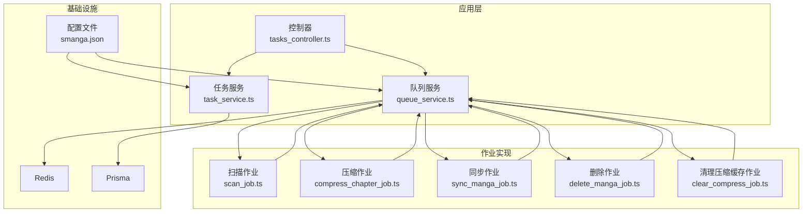
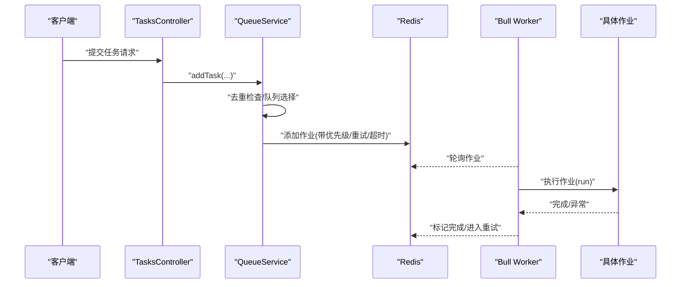
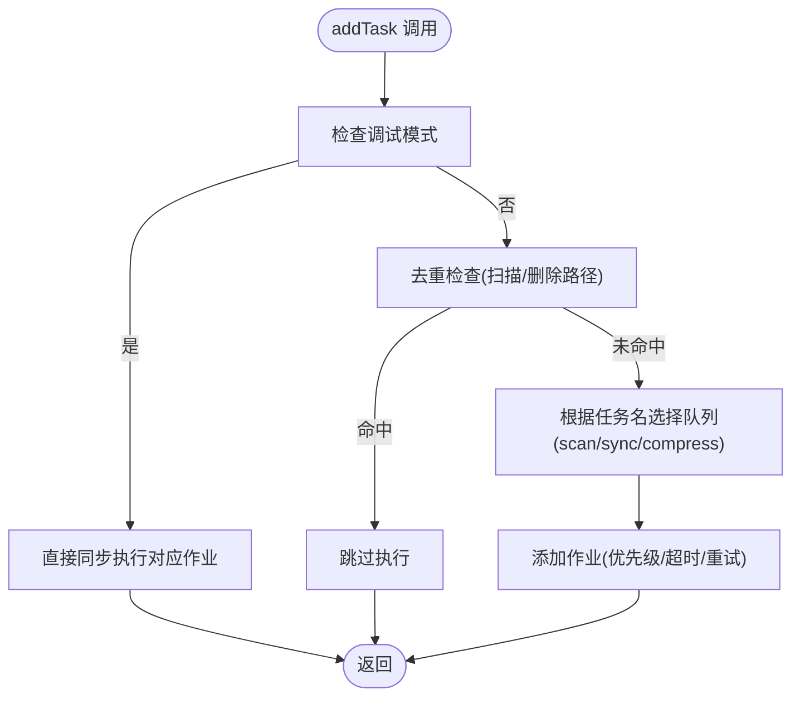
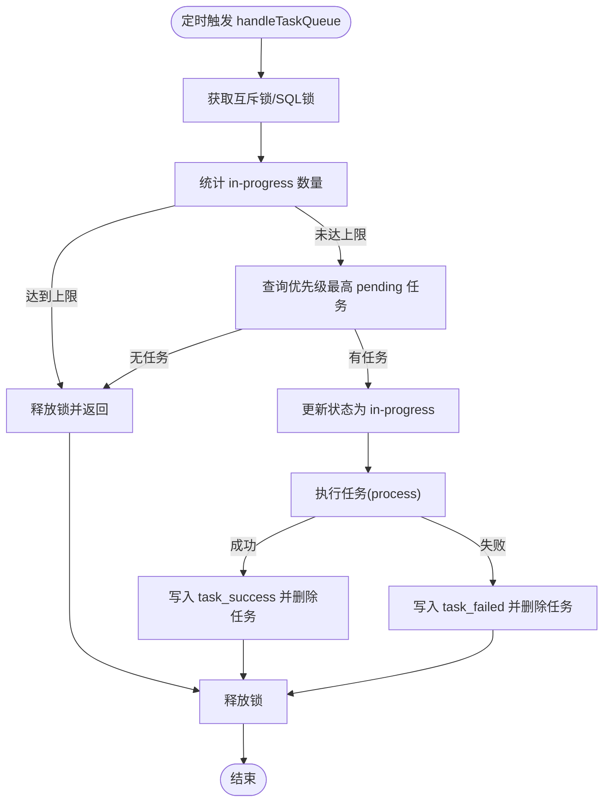
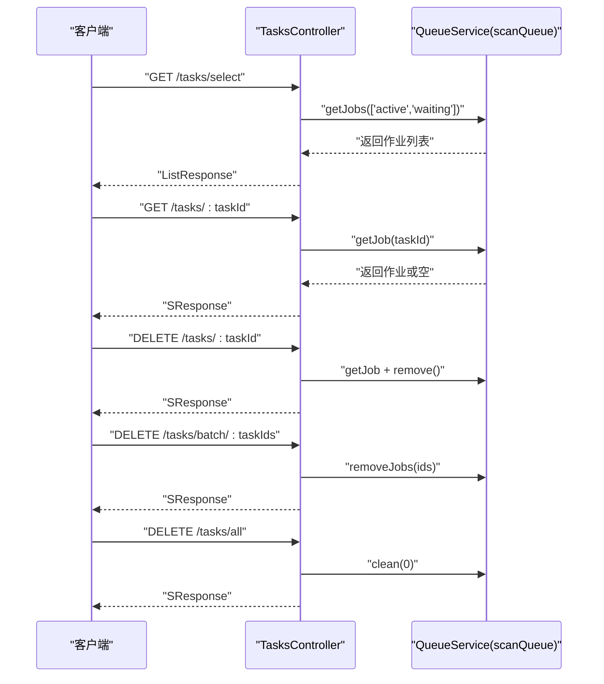
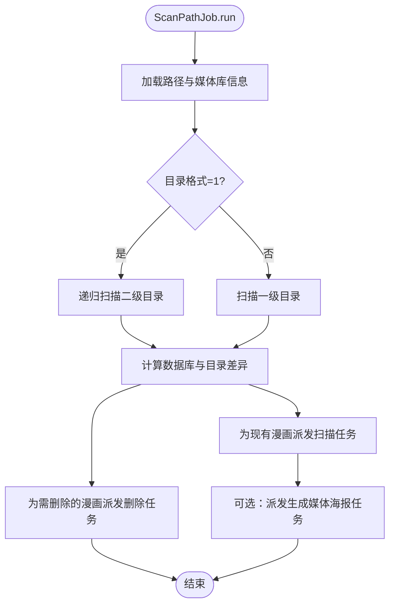
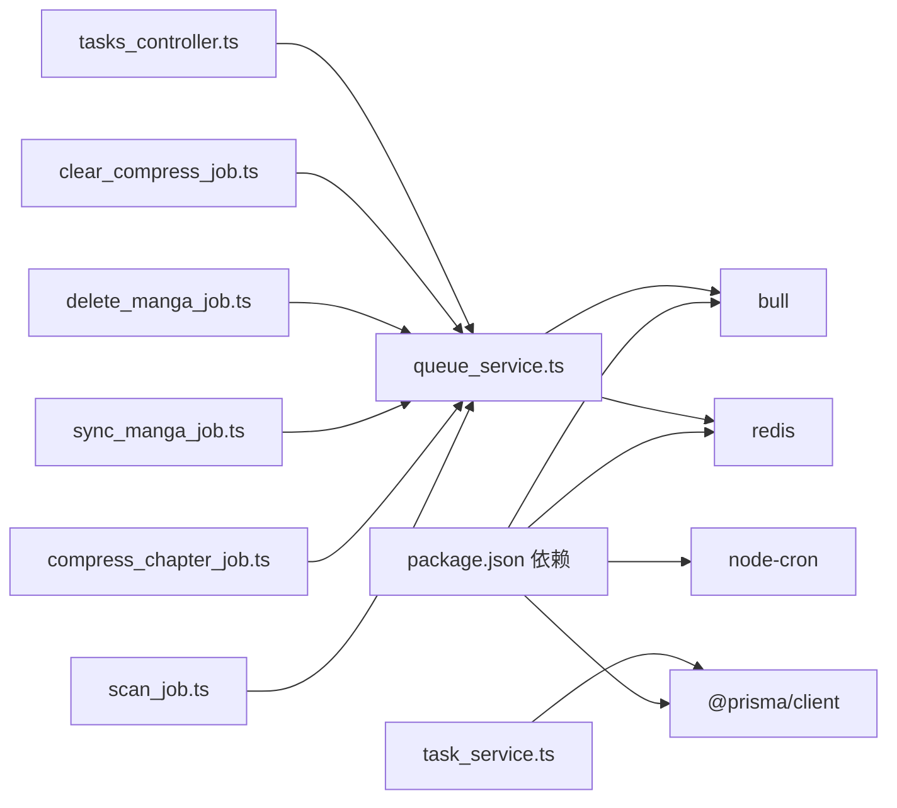

# 任务调度系统

<cite>
**本文引用的文件**
- [app/services/queue_service.ts](file://app/services/queue_service.ts)
- [app/services/task_service.ts](file://app/services/task_service.ts)
- [app/controllers/tasks_controller.ts](file://app/controllers/tasks_controller.ts)
- [app/utils/index.ts](file://app/utils/index.ts)
- [data-example/config/smanga.json](file://data-example/config/smanga.json)
- [app/services/scan_job.ts](file://app/services/scan_job.ts)
- [app/services/compress_chapter_job.ts](file://app/services/compress_chapter_job.ts)
- [app/services/sync_manga_job.ts](file://app/services/sync_manga_job.ts)
- [app/services/delete_manga_job.ts](file://app/services/delete_manga_job.ts)
- [app/services/clear_compress_job.ts](file://app/services/clear_compress_job.ts)
- [app/type/index.ts](file://app/type/index.ts)
- [package.json](file://package.json)
</cite>

## 目录
1. [简介](#简介)
2. [项目结构](#项目结构)
3. [核心组件](#核心组件)
4. [架构总览](#架构总览)
5. [详细组件分析](#详细组件分析)
6. [依赖关系分析](#依赖关系分析)
7. [性能考量](#性能考量)
8. [故障排除指南](#故障排除指南)
9. [结论](#结论)
10. [附录](#附录)

## 简介
本文件面向 SManga Adonis 的任务调度系统，系统采用 Bull 与 Redis 实现异步任务处理，结合队列管理与作业执行机制，覆盖扫描、同步、压缩、清理等多种作业类型。文档将从架构设计、组件职责、数据流与处理逻辑、错误重试与监控、高级特性（优先级、并发、资源限制）以及调试与排障等方面进行系统化说明。

## 项目结构
围绕任务调度的关键模块与文件如下：
- 队列服务：负责队列初始化、作业派发、重试策略、事件监听与队列选择
- 任务服务：负责数据库驱动的任务拉取、并发控制与执行结果持久化
- 控制器：提供任务查询、详情、删除、批量删除与清空接口
- 作业实现：扫描、压缩、同步、删除、清理等具体业务作业
- 工具与配置：配置读取、路径与日志工具、任务优先级枚举
- 依赖：Bull、Redis、Prisma、Node-cron 等

图表来源
- [app/controllers/tasks_controller.ts:1-55](file://app/controllers/tasks_controller.ts#L1-L55)
- [app/services/queue_service.ts:1-267](file://app/services/queue_service.ts#L1-L267)
- [app/services/task_service.ts:1-171](file://app/services/task_service.ts#L1-L171)
- [app/services/scan_job.ts:1-254](file://app/services/scan_job.ts#L1-L254)
- [app/services/compress_chapter_job.ts:1-71](file://app/services/compress_chapter_job.ts#L1-L71)
- [app/services/sync_manga_job.ts:1-103](file://app/services/sync_manga_job.ts#L1-L103)
- [app/services/delete_manga_job.ts:1-78](file://app/services/delete_manga_job.ts#L1-L78)
- [app/services/clear_compress_job.ts:1-56](file://app/services/clear_compress_job.ts#L1-L56)
- [data-example/config/smanga.json:1-54](file://data-example/config/smanga.json#L1-L54)

章节来源
- [app/controllers/tasks_controller.ts:1-55](file://app/controllers/tasks_controller.ts#L1-L55)
- [app/services/queue_service.ts:1-267](file://app/services/queue_service.ts#L1-L267)
- [app/services/task_service.ts:1-171](file://app/services/task_service.ts#L1-L171)
- [app/services/scan_job.ts:1-254](file://app/services/scan_job.ts#L1-L254)
- [app/services/compress_chapter_job.ts:1-71](file://app/services/compress_chapter_job.ts#L1-L71)
- [app/services/sync_manga_job.ts:1-103](file://app/services/sync_manga_job.ts#L1-L103)
- [app/services/delete_manga_job.ts:1-78](file://app/services/delete_manga_job.ts#L1-L78)
- [app/services/clear_compress_job.ts:1-56](file://app/services/clear_compress_job.ts#L1-L56)
- [data-example/config/smanga.json:1-54](file://data-example/config/smanga.json#L1-L54)

## 核心组件
- 队列服务（Bull + Redis）
  - 初始化 Redis 连接，定义队列（扫描、同步、压缩），注册作业处理器，统一派发 addTask
  - 支持按任务名自动路由到对应队列（scan/sync/compress），并配置重试、超时、指数退避
  - 提供去重逻辑（同一路径的扫描/删除任务仅允许一个在执行）
  - 提供调试模式：可强制同步执行以简化本地调试
- 任务服务（数据库驱动）
  - 通过互斥锁与并发上限控制，从数据库任务表中拉取待执行任务
  - 按优先级排序（升序），执行完成后写入成功/失败记录并删除任务
- 控制器
  - 提供任务列表、详情、删除、批量删除、清空队列等运维接口
- 作业实现
  - 扫描：根据路径与媒体库配置扫描漫画，派发删除/扫描/生成海报等子任务
  - 同步：解析远端链接，下载封面与元数据，并派发章节同步任务
  - 压缩：按类型解压章节至压缩目录，更新压缩记录
  - 删除：清理漫画相关数据与文件
  - 清理：按配置上限清理压缩缓存目录与数据库记录
- 配置与工具
  - 配置文件提供队列并发、重试次数、超时、扫描/压缩/同步等开关与参数
  - 工具函数提供路径、日志、JSON 序列化/反序列化、文件操作等

章节来源
- [app/services/queue_service.ts:1-267](file://app/services/queue_service.ts#L1-L267)
- [app/services/task_service.ts:1-171](file://app/services/task_service.ts#L1-L171)
- [app/controllers/tasks_controller.ts:1-55](file://app/controllers/tasks_controller.ts#L1-L55)
- [app/utils/index.ts:1-313](file://app/utils/index.ts#L1-L313)
- [data-example/config/smanga.json:1-54](file://data-example/config/smanga.json#L1-L54)

## 架构总览
系统采用“控制器 -> 队列服务/任务服务 -> 作业实现 -> 数据库/文件系统”的分层架构。Bull 作为消息队列与作业处理器，Redis 作为持久化存储；同时存在数据库驱动的任务队列（task 表）用于高优先级的后台处理。

图表来源
- [app/controllers/tasks_controller.ts:1-55](file://app/controllers/tasks_controller.ts#L1-L55)
- [app/services/queue_service.ts:175-264](file://app/services/queue_service.ts#L175-L264)

## 详细组件分析

### 队列服务（Bull + Redis）
- 队列初始化与连接
  - 使用 Redis 主机与端口初始化队列实例，事件监听完成与失败回调
- 作业处理器
  - 统一处理器：根据 command 分发到具体作业类
  - 专用处理器：按任务名前缀路由到 scan/sync/compress 队列
- 作业派发 addTask
  - 调试模式：当 debug.dispatchSync 开启时，直接同步执行对应作业
  - 去重逻辑：对扫描/删除路径任务，若同路径已有等待/执行中的作业则跳过
  - 队列选择：依据任务名包含 sync/compress 自动选择对应队列
  - 重试与超时：使用配置的 attempts、timeout，并启用指数退避（带抖动）
- 配置项
  - queue.concurrency、queue.attempts、queue.timeout
  - debug.dispatchSync（开发调试用）

图表来源
- [app/services/queue_service.ts:175-264](file://app/services/queue_service.ts#L175-L264)

章节来源
- [app/services/queue_service.ts:1-267](file://app/services/queue_service.ts#L1-L267)
- [data-example/config/smanga.json:46-50](file://data-example/config/smanga.json#L46-L50)
- [app/utils/index.ts:94-115](file://app/utils/index.ts#L94-L115)

### 任务服务（数据库驱动的任务队列）
- 并发控制
  - 使用互斥锁与最大并发上限，避免同时执行过多任务
- 任务拉取与执行
  - 从数据库任务表按优先级（升序）拉取待执行任务，更新状态为 in-progress
  - 执行成功写入 task_success，失败写入 task_failed，并删除任务记录
- 与队列服务的关系
  - 队列服务负责异步作业的派发与执行；任务服务负责数据库任务表的轮询与执行
  - 两者并行工作，互不干扰

图表来源
- [app/services/task_service.ts:36-84](file://app/services/task_service.ts#L36-L84)
- [app/services/task_service.ts:91-170](file://app/services/task_service.ts#L91-L170)

章节来源
- [app/services/task_service.ts:1-171](file://app/services/task_service.ts#L1-L171)

### 控制器（任务运维接口）
- 查询任务列表与详情
- 删除单个/批量/清空队列
- 返回统一响应结构

图表来源
- [app/controllers/tasks_controller.ts:6-53](file://app/controllers/tasks_controller.ts#L6-L53)

章节来源
- [app/controllers/tasks_controller.ts:1-55](file://app/controllers/tasks_controller.ts#L1-L55)

### 作业实现

#### 扫描作业（ScanPathJob）
- 功能：扫描路径下漫画，对比数据库差异，派发删除/扫描/生成媒体海报等子任务
- 关键点：
  - 目录扫描策略：支持仅一级目录或递归二级目录
  - 过滤规则：隐藏文件、包含/排除正则、元数据目录排除
  - 子任务优先级：扫描漫画、删除漫画、生成媒体海报
  - 超时与优先级：为不同子任务设置合理超时与优先级

图表来源
- [app/services/scan_job.ts:29-119](file://app/services/scan_job.ts#L29-L119)

章节来源
- [app/services/scan_job.ts:1-254](file://app/services/scan_job.ts#L1-L254)

#### 压缩作业（CompressChapterJob）
- 功能：根据章节类型（zip/rar/7z）解压至压缩目录，更新压缩记录
- 错误处理：捕获异常并抛出，交由 Bull 重试与记录失败

章节来源
- [app/services/compress_chapter_job.ts:1-71](file://app/services/compress_chapter_job.ts#L1-L71)

#### 同步作业（SyncMangaJob）
- 功能：解析远端链接，下载外置封面与元数据，获取章节列表并派发章节同步任务
- 关键点：优先级设置为同步相关作业，确保及时性

章节来源
- [app/services/sync_manga_job.ts:1-103](file://app/services/sync_manga_job.ts#L1-L103)

#### 删除作业（DeleteMangaJob）
- 功能：删除漫画及其关联的书签、收藏、压缩、历史、标签、元数据、章节、封面等
- 关键点：使用安全删除工具函数，避免误删非自有资源

章节来源
- [app/services/delete_manga_job.ts:1-78](file://app/services/delete_manga_job.ts#L1-L78)

#### 清理压缩缓存作业（ClearCompressJob）
- 功能：按配置上限清理压缩目录与数据库记录，保持空间可控
- 关键点：先删多余记录再比对目录，确保一致性

章节来源
- [app/services/clear_compress_job.ts:1-56](file://app/services/clear_compress_job.ts#L1-L56)

### 任务优先级与配置
- 优先级枚举：定义了扫描、同步、压缩、删除等作业的优先级数值，数值越小优先级越高
- 配置文件：提供 queue、scan、compress、sync、debug 等配置项，影响队列行为与作业策略

章节来源
- [app/type/index.ts:3-16](file://app/type/index.ts#L3-L16)
- [data-example/config/smanga.json:46-53](file://data-example/config/smanga.json#L46-L53)

## 依赖关系分析
- 外部依赖
  - Bull：作业队列与处理器
  - Redis：持久化存储与作业状态
  - Prisma：数据库访问与任务表管理
  - Node-cron：定时任务（与队列配合）
- 内部依赖
  - 队列服务依赖 Redis 与各作业实现
  - 任务服务依赖 Prisma 与互斥锁
  - 控制器依赖队列服务
  - 作业实现依赖工具函数与 Prisma

图表来源
- [package.json:62-88](file://package.json#L62-L88)
- [app/services/queue_service.ts:17-39](file://app/services/queue_service.ts#L17-L39)
- [app/services/task_service.ts:1-2](file://app/services/task_service.ts#L1-L2)

章节来源
- [package.json:1-100](file://package.json#L1-L100)
- [app/services/queue_service.ts:1-267](file://app/services/queue_service.ts#L1-L267)
- [app/services/task_service.ts:1-171](file://app/services/task_service.ts#L1-L171)

## 性能考量
- 并发与限流
  - 队列并发：queue.concurrency 控制 worker 并发
  - 数据库任务并发：任务服务内部最大并发上限，避免数据库压力过大
- 超时与重试
  - 作业超时：queue.timeout，避免长时间占用 worker
  - 重试策略：queue.attempts + 指数退避（带抖动），防止重试风暴
- 资源限制
  - 压缩缓存上限：compress.limit 控制压缩目录大小
  - 清理周期：compress.clearCron 定时清理
- I/O 优化
  - 扫描阶段尽量减少重复 I/O，利用去重逻辑避免重复任务
  - 解压作业按类型选择合适工具，避免不必要的转换

## 故障排除指南
- 任务未执行
  - 检查 Redis 是否正常连接（默认 127.0.0.1:6379）
  - 查看队列处理器是否注册（scan/sync/compress）
  - 确认任务名是否包含对应关键词以正确路由到队列
- 任务卡住或超时
  - 检查 queue.timeout 设置是否合理
  - 查看作业内部是否存在长时间阻塞操作
- 重复执行
  - 检查去重逻辑是否生效（同一路径的扫描/删除任务）
  - 使用控制器接口查看队列中是否已有相同任务
- 失败重试过多
  - 调整 queue.attempts 与 backoff 参数
  - 检查作业内部异常是否可恢复
- 数据库任务堆积
  - 检查任务服务互斥锁与并发上限是否导致吞吐不足
  - 可临时提高最大并发或调整任务优先级

章节来源
- [app/services/queue_service.ts:41-47](file://app/services/queue_service.ts#L41-L47)
- [app/services/queue_service.ts:222-232](file://app/services/queue_service.ts#L222-L232)
- [app/controllers/tasks_controller.ts:6-53](file://app/controllers/tasks_controller.ts#L6-L53)

## 结论
本任务调度系统通过 Bull + Redis 实现高可靠、可扩展的异步作业处理，结合数据库驱动的任务队列与完善的作业实现，覆盖扫描、同步、压缩、删除、清理等核心场景。通过优先级、并发、超时与重试等机制，系统在稳定性与性能之间取得平衡。配合控制器提供的运维接口与配置文件的灵活参数，便于在生产环境进行精细化调优与故障排查。

## 附录

### 配置项速览
- 队列配置（queue）
  - concurrency：并发数
  - attempts：最大重试次数
  - timeout：作业超时（毫秒）
- 调试配置（debug）
  - dispatchSync：1 时强制同步执行作业
- 扫描配置（scan）
  - auto、concurrency、reloadCover、doNotCopyCover、ignoreHiddenFiles、defaultTagColor、interval、mediaPosterInterval、createMediaPoster
- 压缩配置（compress）
  - sync、auto、saveDuration、poster、bookmark、autoClear、limit、clearCron
- 同步配置（sync）
  - interval

章节来源
- [data-example/config/smanga.json:18-53](file://data-example/config/smanga.json#L18-L53)