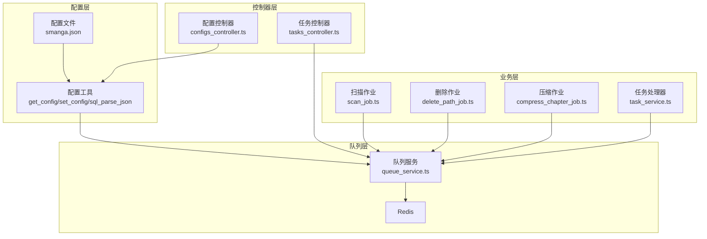
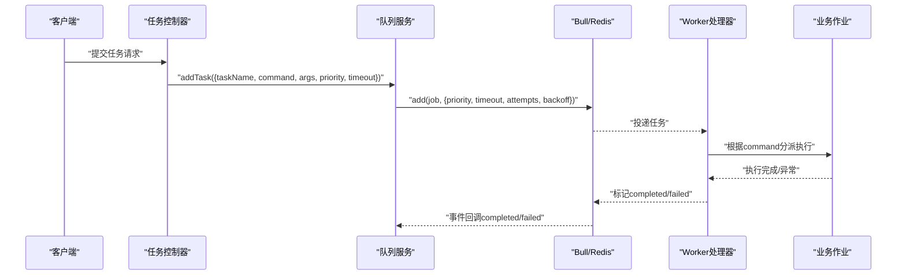
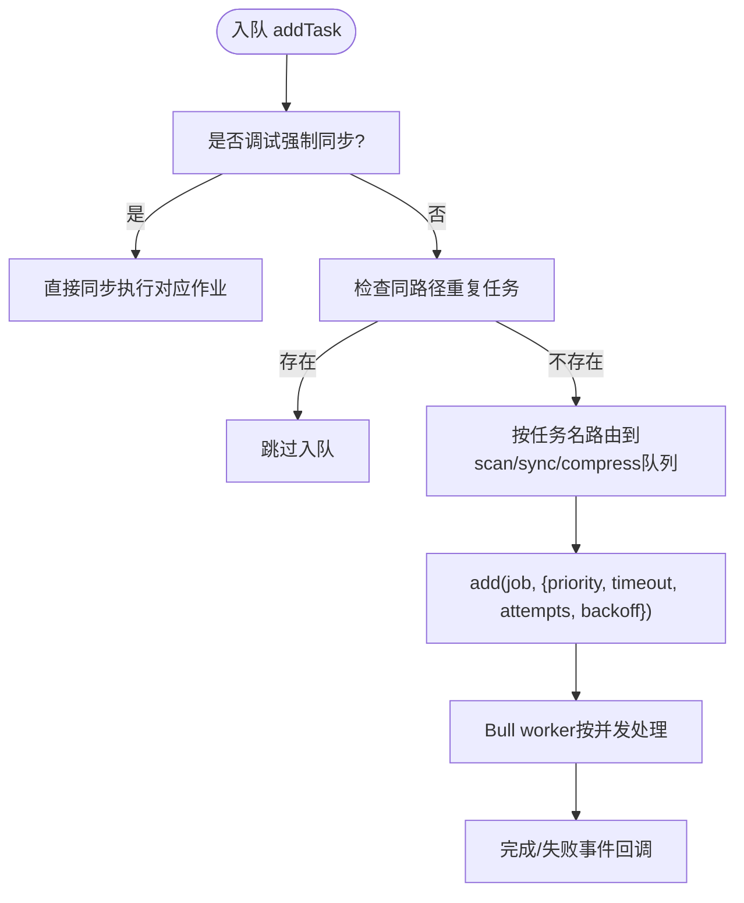
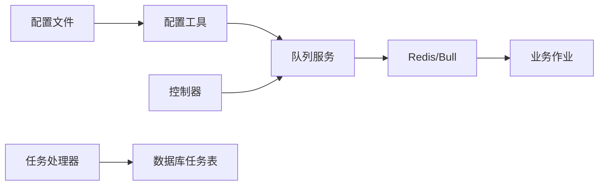

# 任务配置

<cite>
**本文引用的文件**
- [app/services/queue_service.ts](file://app/services/queue_service.ts)
- [app/utils/index.ts](file://app/utils/index.ts)
- [data-example/config/smanga.json](file://data-example/config/smanga.json)
- [app/controllers/tasks_controller.ts](file://app/controllers/tasks_controller.ts)
- [app/controllers/configs_controller.ts](file://app/controllers/configs_controller.ts)
- [app/services/task_service.ts](file://app/services/task_service.ts)
- [app/services/scan_job.ts](file://app/services/scan_job.ts)
- [app/services/delete_path_job.ts](file://app/services/delete_path_job.ts)
- [app/services/compress_chapter_job.ts](file://app/services/compress_chapter_job.ts)
- [start/kernel.ts](file://start/kernel.ts)
- [start/env.ts](file://start/env.ts)
- [config/app.ts](file://config/app.ts)
</cite>

## 目录
1. [简介](#简介)
2. [项目结构](#项目结构)
3. [核心组件](#核心组件)
4. [架构总览](#架构总览)
5. [详细组件分析](#详细组件分析)
6. [依赖关系分析](#依赖关系分析)
7. [性能考量](#性能考量)
8. [故障排查指南](#故障排查指南)
9. [结论](#结论)
10. [附录](#附录)

## 简介
本文件面向 SManga Adonis 的任务调度配置系统，聚焦于队列配置参数（并发数 concurrency、最大重试次数 attempts、超时时间 timeout）的作用与设置方法，覆盖任务优先级、超时处理、重试策略与回退机制、配置文件结构、环境变量、运行时配置动态更新与验证机制，并提供不同场景下的配置建议、性能调优与故障排除方案。

## 项目结构
围绕任务调度与配置的关键模块如下：
- 队列服务：定义 Redis 连接、队列进程注册、任务入队与重试回退策略
- 配置工具：读取/写入 smanga.json 配置文件，解析 SQL 类型差异
- 控制器：任务查询/删除、配置项修改与持久化
- 业务作业：扫描、删除、压缩等具体任务实现
- 启动与环境：应用启动流程、环境变量校验

图表来源
- [app/services/queue_service.ts:34-101](file://app/services/queue_service.ts#L34-L101)
- [app/utils/index.ts:94-115](file://app/utils/index.ts#L94-L115)
- [app/controllers/tasks_controller.ts:1-55](file://app/controllers/tasks_controller.ts#L1-L55)
- [app/controllers/configs_controller.ts:1-119](file://app/controllers/configs_controller.ts#L1-L119)
- [app/services/scan_job.ts:1-254](file://app/services/scan_job.ts#L1-L254)
- [app/services/delete_path_job.ts:1-39](file://app/services/delete_path_job.ts#L1-L39)
- [app/services/compress_chapter_job.ts:1-71](file://app/services/compress_chapter_job.ts#L1-L71)
- [app/services/task_service.ts:1-171](file://app/services/task_service.ts#L1-L171)

章节来源
- [app/services/queue_service.ts:17-101](file://app/services/queue_service.ts#L17-L101)
- [app/utils/index.ts:94-115](file://app/utils/index.ts#L94-L115)
- [app/controllers/tasks_controller.ts:1-55](file://app/controllers/tasks_controller.ts#L1-L55)
- [app/controllers/configs_controller.ts:1-119](file://app/controllers/configs_controller.ts#L1-L119)
- [app/services/scan_job.ts:1-254](file://app/services/scan_job.ts#L1-L254)
- [app/services/delete_path_job.ts:1-39](file://app/services/delete_path_job.ts#L1-L39)
- [app/services/compress_chapter_job.ts:1-71](file://app/services/compress_chapter_job.ts#L1-L71)
- [app/services/task_service.ts:1-171](file://app/services/task_service.ts#L1-L171)

## 核心组件
- 队列配置参数
  - 并发数 concurrency：决定每个队列同时处理的任务数
  - 最大重试次数 attempts：任务失败后的最大重试次数
  - 超时时间 timeout：单个任务的最大执行时间（毫秒）
- 任务优先级与超时
  - 通过入队参数 priority 控制优先级
  - 通过入队参数 timeout 覆盖全局超时
- 重试策略与回退
  - 使用指数回退（backoff），初始延迟、倍数因子、抖动与最大延迟限制
- 配置文件与运行时更新
  - 配置文件位于 data/config/smanga.json（Windows/Linux 路径不同）
  - 提供运行时修改接口，支持扫描/同步等定时任务的动态调整

章节来源
- [app/services/queue_service.ts:18-32](file://app/services/queue_service.ts#L18-L32)
- [app/services/queue_service.ts:24-28](file://app/services/queue_service.ts#L24-L28)
- [app/services/queue_service.ts:167-173](file://app/services/queue_service.ts#L167-L173)
- [app/services/queue_service.ts:252-260](file://app/services/queue_service.ts#L252-L260)
- [data-example/config/smanga.json:46-50](file://data-example/config/smanga.json#L46-L50)
- [app/utils/index.ts:94-115](file://app/utils/index.ts#L94-L115)
- [app/controllers/configs_controller.ts:16-95](file://app/controllers/configs_controller.ts#L16-L95)

## 架构总览
任务从控制器触发，经由队列服务入队，Bull 基于 Redis 分发给对应 worker 处理；业务作业根据命令分派到具体实现；失败任务按指数回退策略重试，直至达到 attempts 次数上限。

图表来源
- [app/controllers/tasks_controller.ts:1-55](file://app/controllers/tasks_controller.ts#L1-L55)
- [app/services/queue_service.ts:175-264](file://app/services/queue_service.ts#L175-L264)
- [app/services/scan_job.ts:95-107](file://app/services/scan_job.ts#L95-L107)
- [app/services/compress_chapter_job.ts:31-65](file://app/services/compress_chapter_job.ts#L31-L65)

## 详细组件分析

### 队列服务与配置参数
- 配置来源与默认值
  - 从配置文件读取 queue 段，若缺失则采用默认值：并发 1、重试 3、超时 120000ms
- 并发数控制
  - 通过 process('queueName', concurrency, handler) 设置每类任务的并发度
- 最大重试次数
  - 入队时 attempts 字段生效，配合 backoff 实现指数回退
- 超时时间设置
  - 全局超时来自 queue.timeout；也可在入队时指定单任务超时
- 任务类型路由
  - 根据任务名称包含 sync/compress 等关键字选择不同队列
- 重复任务去重
  - 对扫描/删除路径任务，检查等待/执行中的同路径任务，避免重复

图表来源
- [app/services/queue_service.ts:175-264](file://app/services/queue_service.ts#L175-L264)
- [app/services/queue_service.ts:143-165](file://app/services/queue_service.ts#L143-L165)

章节来源
- [app/services/queue_service.ts:18-32](file://app/services/queue_service.ts#L18-L32)
- [app/services/queue_service.ts:24-28](file://app/services/queue_service.ts#L24-L28)
- [app/services/queue_service.ts:68-87](file://app/services/queue_service.ts#L68-L87)
- [app/services/queue_service.ts:143-165](file://app/services/queue_service.ts#L143-L165)
- [app/services/queue_service.ts:175-264](file://app/services/queue_service.ts#L175-L264)

### 配置文件结构与环境变量
- 配置文件位置
  - Windows: ./data/config/smanga.json
  - Linux: /data/config/smanga.json
- 关键配置段
  - queue: concurrency、attempts、timeout
  - debug.dispatchSync: 是否强制同步执行（调试用途）
  - scan、compress、sync 等其他功能配置
- 环境变量
  - NODE_ENV、PORT、APP_KEY、HOST、LOG_LEVEL、DB_* 等
- 配置读取与写入
  - get_config()/set_config() 统一读写配置文件
  - sql_parse_json() 适配 SQLite 存储 JSON 的字符串化需求

章节来源
- [app/utils/index.ts:94-115](file://app/utils/index.ts#L94-L115)
- [app/utils/index.ts:163-179](file://app/utils/index.ts#L163-L179)
- [data-example/config/smanga.json:1-54](file://data-example/config/smanga.json#L1-L54)
- [start/env.ts:21-38](file://start/env.ts#L21-L38)

### 任务优先级与超时处理
- 优先级设置
  - 通过入队参数 priority 控制，数值越小优先级越高
  - 业务作业示例中对不同类型任务设置了不同的优先级常量
- 单任务超时
  - 可在入队时覆盖全局 queue.timeout
- 超时与失败
  - 超时或异常将触发重试，遵循 backoff 策略

章节来源
- [app/services/scan_job.ts:84-86](file://app/services/scan_job.ts#L84-L86)
- [app/services/scan_job.ts:105-107](file://app/services/scan_job.ts#L105-L107)
- [app/services/queue_service.ts:250-251](file://app/services/queue_service.ts#L250-L251)

### 重试策略与回退机制
- 指数回退
  - 类型为指数；初始延迟、倍数因子、抖动与最大延迟限制
- 最大重试次数
  - 由 attempts 决定，超过后不再重试并进入失败状态
- 失败处理
  - 触发 failed 事件回调，便于记录与告警

章节来源
- [app/services/queue_service.ts:252-260](file://app/services/queue_service.ts#L252-L260)
- [app/services/queue_service.ts:45-47](file://app/services/queue_service.ts#L45-L47)

### 运行时配置动态更新与验证
- 动态更新
  - 配置控制器支持按 key-value 修改配置并落盘
  - 针对扫描/媒体海报/同步等配置变更会重建相关定时任务
- 验证与权限
  - 配置修改需管理员角色
  - 环境变量在启动阶段进行格式与枚举校验

章节来源
- [app/controllers/configs_controller.ts:16-95](file://app/controllers/configs_controller.ts#L16-L95)
- [start/kernel.ts:60-69](file://start/kernel.ts#L60-L69)
- [start/env.ts:21-38](file://start/env.ts#L21-L38)
- [config/app.ts:18-40](file://config/app.ts#L18-L40)

### 业务作业与任务执行
- 扫描路径作业
  - 生成删除/扫描/生成海报等子任务，并设置相应优先级与超时
- 删除路径作业
  - 标记路径删除标志并批量生成删除漫画任务
- 压缩章节作业
  - 解压不同格式并更新压缩状态，异常时抛出以触发重试

章节来源
- [app/services/scan_job.ts:80-118](file://app/services/scan_job.ts#L80-L118)
- [app/services/delete_path_job.ts:19-37](file://app/services/delete_path_job.ts#L19-L37)
- [app/services/compress_chapter_job.ts:31-69](file://app/services/compress_chapter_job.ts#L31-L69)

### 任务查询与管理
- 查询队列中的等待/活动任务
- 查看单个任务详情
- 删除单个/批量/全部任务

章节来源
- [app/controllers/tasks_controller.ts:6-53](file://app/controllers/tasks_controller.ts#L6-L53)

## 依赖关系分析
- 队列服务依赖 Redis 与 Bull，负责任务入队、并发处理与事件回调
- 业务作业通过 addTask 注入队列，形成“控制器 -> 队列 -> 作业”的链路
- 配置工具贯穿读取/写入配置文件，支撑运行时动态更新
- 任务处理器（task_service.ts）负责数据库侧的任务队列（非 Redis 队列）的并发与优先级控制

图表来源
- [app/utils/index.ts:94-115](file://app/utils/index.ts#L94-L115)
- [app/services/queue_service.ts:175-264](file://app/services/queue_service.ts#L175-L264)
- [app/services/task_service.ts:36-84](file://app/services/task_service.ts#L36-L84)

章节来源
- [app/services/queue_service.ts:17-101](file://app/services/queue_service.ts#L17-L101)
- [app/utils/index.ts:94-115](file://app/utils/index.ts#L94-L115)
- [app/services/task_service.ts:25-84](file://app/services/task_service.ts#L25-L84)

## 性能考量
- 并发数（concurrency）
  - CPU 密集型任务（如压缩）建议降低并发，避免资源争用
  - I/O 密集型任务（如扫描/删除）可适度提高并发
- 重试与回退
  - 指数回退可缓解瞬时故障，但需设置合理最大延迟，避免放大尾延迟
- 超时设置
  - 针对耗时不确定的任务，建议在入队时单独设置超时，避免影响全局稳定性
- 重复任务去重
  - 对扫描/删除路径任务启用去重，减少无效负载

章节来源
- [app/services/queue_service.ts:252-260](file://app/services/queue_service.ts#L252-L260)
- [app/services/queue_service.ts:222-232](file://app/services/queue_service.ts#L222-L232)

## 故障排查指南
- 任务长时间不执行
  - 检查 Redis 连通性与队列进程是否启动
  - 核对 concurrency 是否过低导致积压
- 任务频繁失败
  - 查看 attempts 与 backoff 配置，确认是否因抖动/最大延迟导致重试间隔过大
  - 检查任务超时设置，适当提高单任务 timeout
- 重复任务导致资源浪费
  - 确认 path_scanning/path_deleting 去重逻辑是否生效
- 配置未生效
  - 确认配置文件路径与写入权限
  - 对扫描/同步等关键配置变更后，确认是否重建了相关定时任务
- 环境变量问题
  - 检查环境变量格式与枚举值，确保启动阶段通过校验

章节来源
- [app/services/queue_service.ts:34-39](file://app/services/queue_service.ts#L34-L39)
- [app/services/queue_service.ts:143-165](file://app/services/queue_service.ts#L143-L165)
- [app/controllers/configs_controller.ts:88-91](file://app/controllers/configs_controller.ts#L88-L91)
- [start/env.ts:21-38](file://start/env.ts#L21-L38)

## 结论
SManga Adonis 的任务调度配置以 Bull + Redis 为核心，结合 smanga.json 的集中式配置与运行时动态更新能力，提供了灵活可控的并发、重试与超时策略。通过合理的参数设置与回退机制，可在保证稳定性的同时提升吞吐。建议在生产环境中根据任务类型与资源情况逐步调优并发与超时，并严格控制重试上限与回退参数，避免雪崩效应。

## 附录

### 配置参数速查
- queue.concurrency：全局并发数
- queue.attempts：最大重试次数
- queue.timeout：全局任务超时（毫秒）
- debug.dispatchSync：调试模式强制同步执行
- scan.*、compress.*、sync.*：扫描/压缩/同步相关配置

章节来源
- [data-example/config/smanga.json:18-53](file://data-example/config/smanga.json#L18-L53)
- [app/utils/index.ts:94-115](file://app/utils/index.ts#L94-L115)