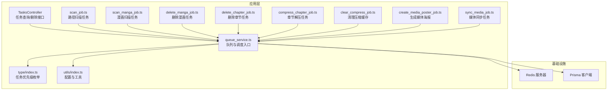
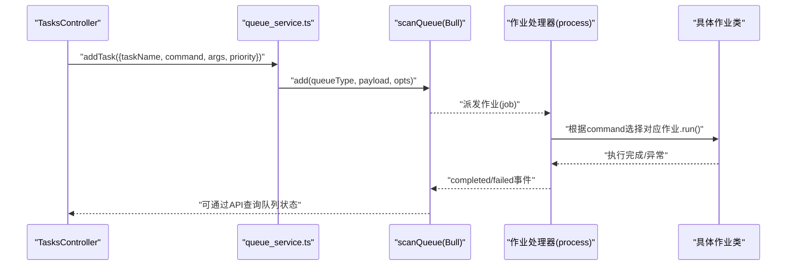
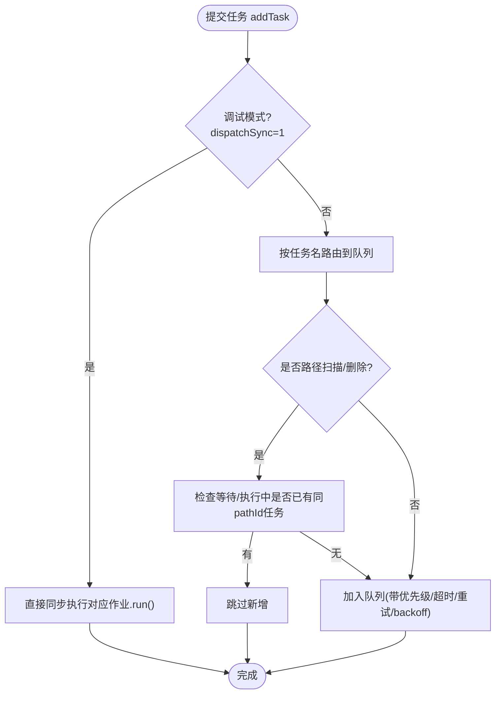
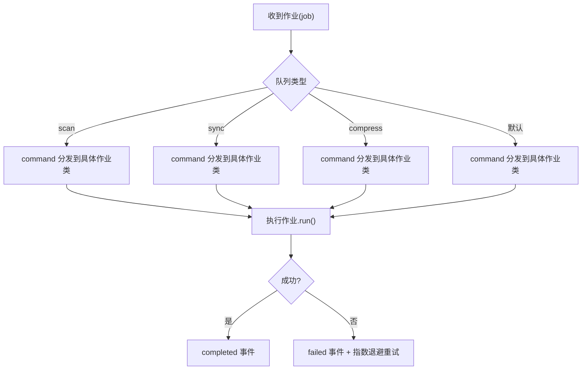
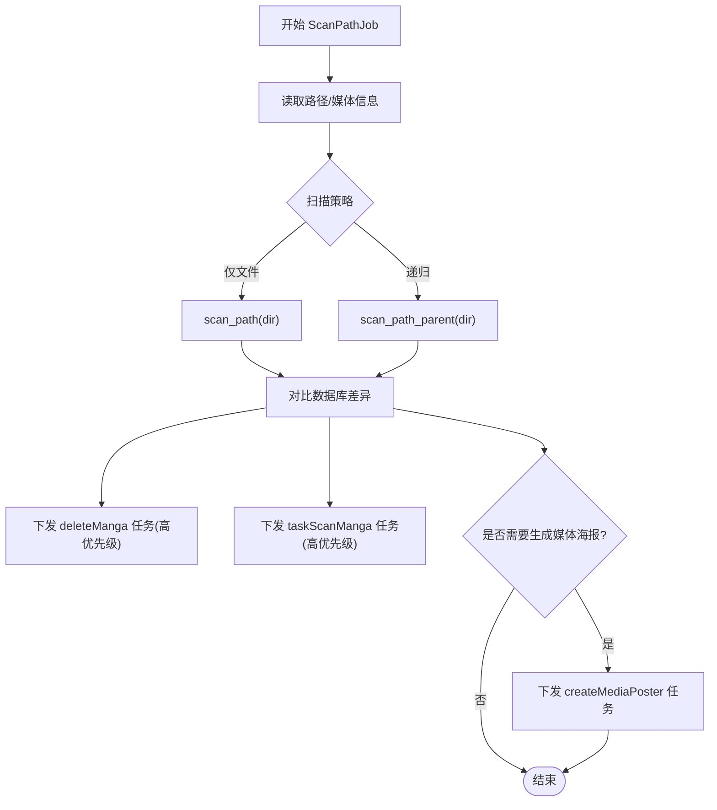
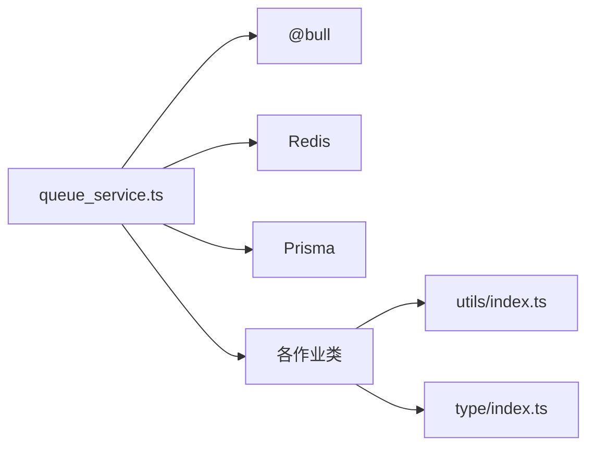

# 队列管理

<cite>
**本文引用的文件**
- [app/services/queue_service.ts](file://app/services/queue_service.ts)
- [app/services/scan_job.ts](file://app/services/scan_job.ts)
- [app/services/scan_manga_job.ts](file://app/services/scan_manga_job.ts)
- [app/services/delete_manga_job.ts](file://app/services/delete_manga_job.ts)
- [app/services/delete_chapter_job.ts](file://app/services/delete_chapter_job.ts)
- [app/services/compress_chapter_job.ts](file://app/services/compress_chapter_job.ts)
- [app/services/clear_compress_job.ts](file://app/services/clear_compress_job.ts)
- [app/services/create_media_poster_job.ts](file://app/services/create_media_poster_job.ts)
- [app/services/sync_media_job.ts](file://app/services/sync_media_job.ts)
- [app/type/index.ts](file://app/type/index.ts)
- [app/utils/index.ts](file://app/utils/index.ts)
- [data-example/config/smanga.json](file://data-example/config/smanga.json)
- [app/controllers/tasks_controller.ts](file://app/controllers/tasks_controller.ts)
- [package.json](file://package.json)
</cite>

## 目录
1. [简介](#简介)
2. [项目结构](#项目结构)
3. [核心组件](#核心组件)
4. [架构总览](#架构总览)
5. [详细组件分析](#详细组件分析)
6. [依赖关系分析](#依赖关系分析)
7. [性能考量](#性能考量)
8. [故障排查指南](#故障排查指南)
9. [结论](#结论)
10. [附录](#附录)

## 简介
本文件面向 SManga Adonis 的队列管理系统，围绕基于 Bull 和 Redis 的队列架构进行深入解析，重点覆盖以下方面：
- 三种队列类型：scanQueue、deleteQueue、compressQueue 的创建与配置
- 连接配置、事件监听（completed、failed）、并发控制与超时处理
- 队列生命周期管理、作业优先级设置、重试与回退策略
- 队列监控、性能调优与故障恢复
- 配置参数详解与最佳实践

## 项目结构
SManga Adonis 的队列体系由一个统一的服务模块负责，结合多个业务作业类共同完成扫描、删除、压缩、同步等后台任务。

图表来源
- [app/services/queue_service.ts:34-101](file://app/services/queue_service.ts#L34-L101)
- [app/controllers/tasks_controller.ts:1-55](file://app/controllers/tasks_controller.ts#L1-L55)
- [app/services/scan_job.ts:1-254](file://app/services/scan_job.ts#L1-L254)
- [app/services/scan_manga_job.ts:1-800](file://app/services/scan_manga_job.ts#L1-L800)
- [app/services/delete_manga_job.ts:1-78](file://app/services/delete_manga_job.ts#L1-L78)
- [app/services/delete_chapter_job.ts:1-58](file://app/services/delete_chapter_job.ts#L1-L58)
- [app/services/compress_chapter_job.ts:1-71](file://app/services/compress_chapter_job.ts#L1-L71)
- [app/services/clear_compress_job.ts:1-56](file://app/services/clear_compress_job.ts#L1-L56)
- [app/services/create_media_poster_job.ts:1-92](file://app/services/create_media_poster_job.ts#L1-L92)
- [app/services/sync_media_job.ts:1-44](file://app/services/sync_media_job.ts#L1-L44)
- [app/type/index.ts:1-49](file://app/type/index.ts#L1-L49)
- [app/utils/index.ts:1-313](file://app/utils/index.ts#L1-L313)

章节来源
- [app/services/queue_service.ts:17-101](file://app/services/queue_service.ts#L17-L101)
- [app/controllers/tasks_controller.ts:1-55](file://app/controllers/tasks_controller.ts#L1-L55)

## 核心组件
- 队列服务与配置
  - 统一的队列配置来源于全局配置，包含并发数、最大重试次数、超时时间等。
  - 提供 addTask 方法用于向队列提交任务，并根据任务名自动路由到 scan、sync 或 compress 队列。
  - 内置对特定路径扫描/删除任务的去重逻辑，避免重复执行。
- 事件监听
  - 监听 completed 与 failed 事件，便于记录与告警。
- 作业处理器
  - scanQueue 支持 scan、sync、compress 三类作业处理，以及默认处理分支。
  - 通过命令分发器将任务映射到具体作业类（如扫描、删除、压缩等）。
- 作业类
  - 路径扫描、漫画扫描、删除漫画、删除章节、章节解压、清理压缩缓存、生成媒体海报、媒体同步等。

章节来源
- [app/services/queue_service.ts:18-32](file://app/services/queue_service.ts#L18-L32)
- [app/services/queue_service.ts:34-101](file://app/services/queue_service.ts#L34-L101)
- [app/services/queue_service.ts:103-141](file://app/services/queue_service.ts#L103-L141)
- [app/services/queue_service.ts:175-264](file://app/services/queue_service.ts#L175-L264)
- [app/type/index.ts:3-16](file://app/type/index.ts#L3-L16)

## 架构总览
下图展示了从控制器到队列、再到作业处理器与具体作业类的整体流程。

图表来源
- [app/controllers/tasks_controller.ts:5-54](file://app/controllers/tasks_controller.ts#L5-L54)
- [app/services/queue_service.ts:175-264](file://app/services/queue_service.ts#L175-L264)
- [app/services/queue_service.ts:69-87](file://app/services/queue_service.ts#L69-L87)

## 详细组件分析

### 队列服务与配置
- 连接与初始化
  - scanQueue、deleteQueue、compressQueue 均指向同一 Redis 实例（默认本地 127.0.0.1:6379）。
  - 事件监听：completed 与 failed 事件分别输出日志，便于监控与排障。
- 并发与超时
  - 全局并发数、重试次数、超时时间来自配置；作业提交时统一采用配置值。
  - backoff 采用指数退避，初始延迟、倍数因子、抖动与最大延迟均有配置。
- 任务路由
  - 根据任务名包含关键字自动路由至 scan、sync 或 compress 队列。
- 去重逻辑
  - 对路径扫描与路径删除任务，查询当前等待与执行中的作业，若发现相同 pathId 的任务则跳过新增。

图表来源
- [app/services/queue_service.ts:175-264](file://app/services/queue_service.ts#L175-L264)
- [app/services/queue_service.ts:143-165](file://app/services/queue_service.ts#L143-L165)

章节来源
- [app/services/queue_service.ts:34-101](file://app/services/queue_service.ts#L34-L101)
- [app/services/queue_service.ts:175-264](file://app/services/queue_service.ts#L175-L264)
- [app/services/queue_service.ts:143-165](file://app/services/queue_service.ts#L143-L165)

### 作业处理器与命令分发
- scanQueue 的处理器分为三类：
  - 命名队列：'scan'、'sync'、'compress'
  - 默认处理器：接收通用命令并分发到具体作业类
- 命令到作业类的映射：
  - 例如：taskScanPath -> ScanPathJob、taskScanManga -> ScanMangaJob、deleteManga -> DeleteMangaJob、deleteChapter -> DeleteChapterJob、compressChapter -> CompressChapterJob、clearCompressCache -> ClearCompressJob、createMediaPoster -> CreateMediaPosterJob、taskSyncManga -> SyncMangaJob 等

图表来源
- [app/services/queue_service.ts:69-87](file://app/services/queue_service.ts#L69-L87)
- [app/services/queue_service.ts:103-141](file://app/services/queue_service.ts#L103-L141)

章节来源
- [app/services/queue_service.ts:69-87](file://app/services/queue_service.ts#L69-L87)
- [app/services/queue_service.ts:103-141](file://app/services/queue_service.ts#L103-L141)

### 路径扫描任务（ScanPathJob）
- 功能要点
  - 读取路径与媒体库信息，决定扫描策略（仅文件或递归目录）。
  - 生成删除与扫描两类子任务，并设置相应优先级与超时。
  - 可选生成媒体海报任务。
- 关键行为
  - 对比目录与数据库差异，批量下发删除与扫描任务。
  - 使用 addTask 并传入 TaskPriority 枚举以确保正确排序。

图表来源
- [app/services/scan_job.ts:29-119](file://app/services/scan_job.ts#L29-L119)
- [app/services/scan_job.ts:126-250](file://app/services/scan_job.ts#L126-L250)

章节来源
- [app/services/scan_job.ts:29-119](file://app/services/scan_job.ts#L29-L119)
- [app/services/scan_job.ts:126-250](file://app/services/scan_job.ts#L126-L250)

### 漫画扫描任务（ScanMangaJob）
- 功能要点
  - 根据媒体库类型（单本/连载）决定扫描流程。
  - 自动识别封面、元数据、标签、章节列表等。
  - 支持云盘媒体的特殊处理与缓存元数据判断。
- 关键行为
  - 生成章节与元数据，必要时生成章节封面。
  - 记录扫描日志，更新漫画与章节计数。

章节来源
- [app/services/scan_manga_job.ts:76-356](file://app/services/scan_manga_job.ts#L76-L356)
- [app/services/scan_manga_job.ts:728-791](file://app/services/scan_manga_job.ts#L728-L791)

### 删除任务系列
- 删除漫画（DeleteMangaJob）
  - 标记删除标志，清理书签、收藏、压缩、历史、标签、元数据、分享、章节及封面等。
- 删除章节（DeleteChapterJob）
  - 标记删除标志，清理书签、收藏、压缩、历史、最后阅读记录、章节封面等。

章节来源
- [app/services/delete_manga_job.ts:18-76](file://app/services/delete_manga_job.ts#L18-L76)
- [app/services/delete_chapter_job.ts:18-56](file://app/services/delete_chapter_job.ts#L18-L56)

### 压缩与清理任务
- 章节解压（CompressChapterJob）
  - 根据压缩类型（zip/rar/7z）解压到指定目录，并更新压缩记录状态。
  - 发生异常时抛出错误，触发 Bull 的重试与回退。
- 清理压缩缓存（ClearCompressJob）
  - 按配置上限清理压缩目录与数据库记录，保证磁盘空间可控。

章节来源
- [app/services/compress_chapter_job.ts:31-70](file://app/services/compress_chapter_job.ts#L31-L70)
- [app/services/clear_compress_job.ts:14-54](file://app/services/clear_compress_job.ts#L14-L54)

### 生成媒体海报（CreateMediaPosterJob）
- 功能要点
  - 选取若干漫画封面，使用 sharp 合成网格海报，写入数据库并记录日志。

章节来源
- [app/services/create_media_poster_job.ts:22-89](file://app/services/create_media_poster_job.ts#L22-L89)

### 媒体同步（SyncMediaJob）
- 功能要点
  - 解析分享链接，拉取目标媒体的漫画列表，逐个下发同步任务。

章节来源
- [app/services/sync_media_job.ts:17-43](file://app/services/sync_media_job.ts#L17-L43)

### 任务优先级与配置
- 优先级定义
  - 通过枚举定义各类任务的优先级数值，数值越小优先级越高。
- 配置项
  - queue.concurrency、queue.attempts、queue.timeout 来自全局配置文件。
  - 任务提交时可覆盖超时与优先级。

章节来源
- [app/type/index.ts:3-16](file://app/type/index.ts#L3-L16)
- [app/services/queue_service.ts:18-32](file://app/services/queue_service.ts#L18-L32)
- [data-example/config/smanga.json:46-50](file://data-example/config/smanga.json#L46-L50)

## 依赖关系分析
- 外部依赖
  - Bull 作为队列引擎，Redis 作为消息存储。
  - Prisma 作为数据库访问层。
  - sharp、unzipper、node-7z、node-unrar-js 等用于图像与压缩处理。
- 内部耦合
  - queue_service.ts 作为中心枢纽，被各控制器与作业类广泛依赖。
  - 作业类之间低耦合，通过统一的命令分发机制协作。

图表来源
- [package.json:72-87](file://package.json#L72-L87)
- [app/services/queue_service.ts:1-16](file://app/services/queue_service.ts#L1-L16)

章节来源
- [package.json:72-87](file://package.json#L72-L87)
- [app/services/queue_service.ts:1-16](file://app/services/queue_service.ts#L1-L16)

## 性能考量
- 并发与资源
  - 合理设置 queue.concurrency，避免 CPU/IO 抖动；对 I/O 密集型任务（如压缩、解压）建议适度降低并发。
- 超时与重试
  - 为耗时任务设置合理 timeout；指数退避可避免瞬时重试风暴，但需注意最大延迟上限。
- 任务拆分
  - 将大批量任务拆分为小批次，减少单次队列压力。
- 缓存与磁盘
  - 压缩缓存清理策略需结合磁盘容量与访问频率调整 limit 与清理周期。
- 监控与日志
  - 利用 completed/failed 事件与任务 API，定期巡检队列积压与失败率。

## 故障排查指南
- 常见问题定位
  - 任务长时间处于 waiting：检查 Redis 连通性与队列处理器是否正常启动。
  - 频繁失败：查看 failed 事件日志，关注作业内部异常（如文件不存在、权限不足、解压失败）。
  - 重复执行：确认去重逻辑是否生效（路径扫描/删除任务），避免同 pathId 的重复任务。
- 操作指引
  - 查询队列：通过任务控制器列出 active/waiting 任务，定位卡住的作业。
  - 删除任务：支持单个删除、批量删除、清空队列（保留已完成/失败任务或清除全部）。
  - 调整配置：修改全局配置后重启队列服务以生效。

章节来源
- [app/controllers/tasks_controller.ts:5-54](file://app/controllers/tasks_controller.ts#L5-L54)
- [app/services/queue_service.ts:41-47](file://app/services/queue_service.ts#L41-L47)
- [app/services/queue_service.ts:143-165](file://app/services/queue_service.ts#L143-L165)

## 结论
SManga Adonis 的队列系统以 Bull 为核心，结合 Redis 实现高可靠的任务编排。通过统一的队列服务与清晰的命令分发机制，实现了扫描、删除、压缩、同步等多种后台任务的有序执行。配合优先级、超时、重试与回退策略，系统具备良好的稳定性与可观测性。建议在生产环境中根据实际负载调整并发与超时参数，并持续监控队列状态与失败率，确保任务按时完成。

## 附录

### 配置参数详解与最佳实践
- queue.concurrency
  - 作用：全局并发数，影响同时执行的作业数量。
  - 建议：I/O 密集型任务适当下调，CPU 密集型任务可适度上调。
- queue.attempts
  - 作用：最大重试次数。
  - 建议：对易受外部环境影响的任务（网络/磁盘）适当提高。
- queue.timeout
  - 作用：单个作业超时时间（毫秒）。
  - 建议：为耗时任务设置合理上限，避免僵尸作业占用资源。
- debug.dispatchSync
  - 作用：调试模式下直接同步执行，便于开发测试。
  - 建议：生产环境保持关闭，确保队列行为一致。
- compress.limit/autoClear/clearCron
  - 作用：压缩缓存上限与清理策略。
  - 建议：结合磁盘容量与访问频率设定 limit，定期清理避免膨胀。

章节来源
- [data-example/config/smanga.json:46-50](file://data-example/config/smanga.json#L46-L50)
- [app/services/clear_compress_job.ts:18-42](file://app/services/clear_compress_job.ts#L18-L42)
- [app/services/queue_service.ts:24-32](file://app/services/queue_service.ts#L24-L32)