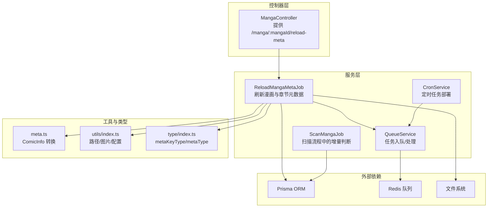
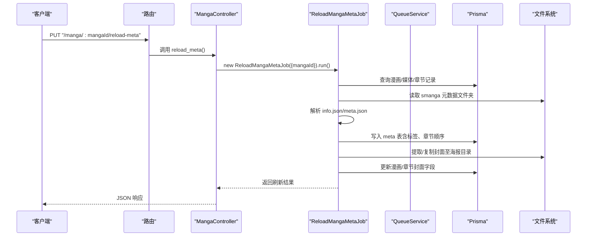
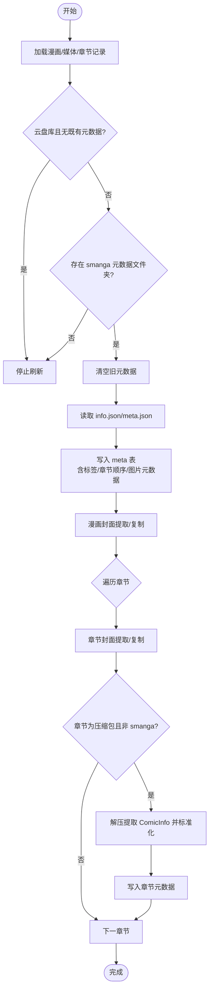
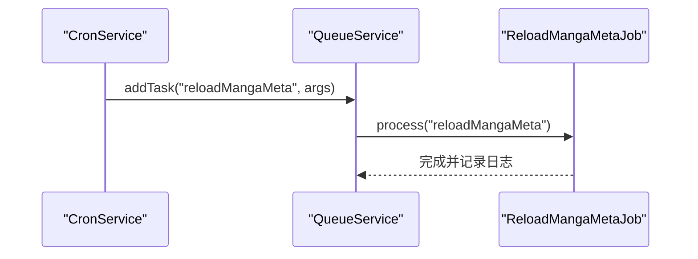
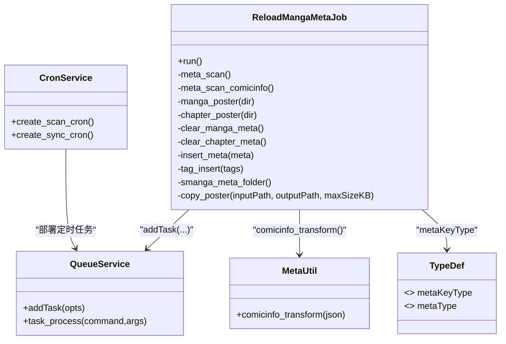

# 元数据刷新

<cite>
**本文引用的文件**
- [app/services/reload_manga_meta_job.ts](file://app/services/reload_manga_meta_job.ts)
- [app/controllers/manga_controller.ts](file://app/controllers/manga_controller.ts)
- [app/utils/meta.ts](file://app/utils/meta.ts)
- [app/utils/index.ts](file://app/utils/index.ts)
- [app/type/index.ts](file://app/type/index.ts)
- [app/services/queue_service.ts](file://app/services/queue_service.ts)
- [app/services/cron_service.ts](file://app/services/cron_service.ts)
- [app/services/scan_manga_job.ts](file://app/services/scan_manga_job.ts)
- [start/routes.ts](file://start/routes.ts)
- [data/config/smanga.json](file://data/config/smanga.json)
</cite>

## 目录
1. [简介](#简介)
2. [项目结构](#项目结构)
3. [核心组件](#核心组件)
4. [架构总览](#架构总览)
5. [详细组件分析](#详细组件分析)
6. [依赖关系分析](#依赖关系分析)
7. [性能考量](#性能考量)
8. [故障排查指南](#故障排查指南)
9. [结论](#结论)
10. [附录](#附录)

## 简介
本文件面向 SManga Adonis 的“元数据刷新”能力，系统性阐述触发机制、更新策略、数据同步流程与一致性维护。重点覆盖以下方面：
- 触发方式：手动接口触发、定时任务触发、扫描流程中的条件性刷新
- 更新范围：漫画元数据、章节元数据、封面图片与章节封面
- 数据来源与结构：smanga 自定义元数据文件夹、ComicInfo 格式、标签与角色图像
- 缓存策略与版本管理：基于文件系统时间戳的增量判断、封面缓存与压缩
- 批量与并发：任务队列与优先级、Redis 队列与重试退避
- 解析、校验与标准化：ComicInfo 转换、标签去重与系统标签约束

## 项目结构
围绕元数据刷新的关键文件与职责如下：
- 控制器层：对外暴露“重新加载元数据”的 HTTP 接口
- 服务层：ReloadMangaMetaJob 负责具体刷新逻辑；QueueService 统一调度；CronService 部署定时任务
- 工具层：meta.ts 负责 ComicInfo 格式标准化；utils/index.ts 提供路径、图片识别、配置读取等通用能力
- 类型定义：type/index.ts 定义元数据键名枚举与类型
- 配置：data/config/smanga.json 提供扫描、压缩、队列等参数
- 路由：start/routes.ts 注册“重新加载元数据”接口

图表来源
- [app/controllers/manga_controller.ts:336-348](file://app/controllers/manga_controller.ts#L336-L348)
- [app/services/reload_manga_meta_job.ts:42-92](file://app/services/reload_manga_meta_job.ts#L42-L92)
- [app/services/queue_service.ts:103-141](file://app/services/queue_service.ts#L103-L141)
- [app/services/cron_service.ts:16-43](file://app/services/cron_service.ts#L16-L43)
- [app/utils/meta.ts:3-34](file://app/utils/meta.ts#L3-L34)
- [app/utils/index.ts:34-52](file://app/utils/index.ts#L34-L52)
- [app/type/index.ts:18-48](file://app/type/index.ts#L18-L48)

章节来源
- [start/routes.ts:177-177](file://start/routes.ts#L177-L177)
- [app/controllers/manga_controller.ts:336-348](file://app/controllers/manga_controller.ts#L336-L348)
- [app/services/reload_manga_meta_job.ts:42-92](file://app/services/reload_manga_meta_job.ts#L42-L92)
- [app/services/queue_service.ts:103-141](file://app/services/queue_service.ts#L103-L141)
- [app/services/cron_service.ts:16-43](file://app/services/cron_service.ts#L16-L43)
- [app/utils/meta.ts:3-34](file://app/utils/meta.ts#L3-L34)
- [app/utils/index.ts:34-52](file://app/utils/index.ts#L34-L52)
- [app/type/index.ts:18-48](file://app/type/index.ts#L18-L48)

## 核心组件
- ReloadMangaMetaJob：负责从 smanga 元数据文件夹读取 info.json/meta.json，解析并写入数据库；根据漫画/章节类型提取封面；对 ComicInfo 进行标准化转换；维护标签与章节顺序
- QueueService：统一的任务入队与处理，支持优先级、超时、重试退避；将“reloadMangaMeta”命令映射到 ReloadMangaMetaJob.run
- CronService：按配置部署定时扫描与同步任务；可扩展为部署“元数据刷新”定时任务
- meta.ts：ComicInfo 转换器，将外部压缩包中的 ComicInfo 结构标准化为内部 metaType
- utils/index.ts：提供路径常量（元数据、海报、缓存）、图片识别、配置读取、首张图片查找等
- type/index.ts：定义元数据键名枚举 metaKeyType 与类型 metaType
- MangaController.reload_meta：对外暴露的 HTTP 接口，调用 ReloadMangaMetaJob.run
- ScanMangaJob：扫描流程中对“是否需要更新元数据/章节”的判断，用于控制刷新频率与范围

章节来源
- [app/services/reload_manga_meta_job.ts:24-92](file://app/services/reload_manga_meta_job.ts#L24-L92)
- [app/services/queue_service.ts:103-141](file://app/services/queue_service.ts#L103-L141)
- [app/services/cron_service.ts:16-43](file://app/services/cron_service.ts#L16-L43)
- [app/utils/meta.ts:3-34](file://app/utils/meta.ts#L3-L34)
- [app/utils/index.ts:34-52](file://app/utils/index.ts#L34-L52)
- [app/type/index.ts:18-48](file://app/type/index.ts#L18-L48)
- [app/controllers/manga_controller.ts:336-348](file://app/controllers/manga_controller.ts#L336-L348)
- [app/services/scan_manga_job.ts:362-417](file://app/services/scan_manga_job.ts#L362-L417)

## 架构总览
元数据刷新的端到端流程如下：

图表来源
- [start/routes.ts:177-177](file://start/routes.ts#L177-L177)
- [app/controllers/manga_controller.ts:336-348](file://app/controllers/manga_controller.ts#L336-L348)
- [app/services/reload_manga_meta_job.ts:42-92](file://app/services/reload_manga_meta_job.ts#L42-L92)
- [app/services/queue_service.ts:103-141](file://app/services/queue_service.ts#L103-L141)

## 详细组件分析

### ReloadMangaMetaJob：元数据刷新主流程
- 输入：mangaId
- 关键步骤
  - 初始化：读取配置、定位海报/缓存路径、查询漫画与媒体记录
  - 元数据扫描（smanga）：清空旧元数据，读取 info.json/meta.json，写入 meta 表；解析标签、角色图、章节顺序
  - 元数据扫描（ComicInfo）：仅当章节为 zip/rar/7z 且非 smanga 格式时，解压提取 ComicInfo，标准化后写入 meta 表
  - 封面处理：优先从 smanga 元数据、同级目录、漫画内部 cover.jpg 等位置检索；云盘库场景下有特殊路径；必要时复制到海报目录并压缩
  - 章节封面：对每个章节重复封面检索与复制流程；若漫画封面为空则回填
- 条件控制
  - 云盘库且无既有元数据时不刷新
  - 无 smanga 元数据文件夹时不刷新
  - 通过 QueueService 异步复制海报，避免阻塞主线程

图表来源
- [app/services/reload_manga_meta_job.ts:42-92](file://app/services/reload_manga_meta_job.ts#L42-L92)
- [app/services/reload_manga_meta_job.ts:99-206](file://app/services/reload_manga_meta_job.ts#L99-L206)
- [app/services/reload_manga_meta_job.ts:212-230](file://app/services/reload_manga_meta_job.ts#L212-L230)
- [app/services/reload_manga_meta_job.ts:237-326](file://app/services/reload_manga_meta_job.ts#L237-L326)
- [app/services/reload_manga_meta_job.ts:380-502](file://app/services/reload_manga_meta_job.ts#L380-L502)

章节来源
- [app/services/reload_manga_meta_job.ts:42-92](file://app/services/reload_manga_meta_job.ts#L42-L92)
- [app/services/reload_manga_meta_job.ts:99-206](file://app/services/reload_manga_meta_job.ts#L99-L206)
- [app/services/reload_manga_meta_job.ts:212-230](file://app/services/reload_manga_meta_job.ts#L212-L230)
- [app/services/reload_manga_meta_job.ts:237-326](file://app/services/reload_manga_meta_job.ts#L237-L326)
- [app/services/reload_manga_meta_job.ts:380-502](file://app/services/reload_manga_meta_job.ts#L380-L502)

### 元数据来源、格式与结构
- smanga 自定义格式
  - 元数据文件夹命名：位于与漫画同级目录，形如 “xxx-smanga-info”，或隐藏文件夹“.smanga”
  - 元数据文件：info.json 或 meta.json（兼容老版本）
  - 字段示例：标题、副标题、作者、描述、分类、标签、发布日期、状态、完成标志、章节列表（含排序）
- ComicInfo 格式
  - 从 zip/rar/7z 中提取 ComicInfo，经 meta.ts 转换为内部标准结构
  - 转换项：标题、副标题、作者、描述、分类、标签数组、发布日期、状态、完成标志
- 图片元数据
  - 支持 banner、thumbnail、cover、banner-background、other 等键名
  - 角色图通过 character 数组与文件名匹配

章节来源
- [app/services/reload_manga_meta_job.ts:111-124](file://app/services/reload_manga_meta_job.ts#L111-L124)
- [app/services/reload_manga_meta_job.ts:154-188](file://app/services/reload_manga_meta_job.ts#L154-L188)
- [app/utils/meta.ts:3-34](file://app/utils/meta.ts#L3-L34)
- [app/utils/index.ts:305-313](file://app/utils/index.ts#L305-L313)

### 元数据解析、验证与标准化
- 解析与写入
  - 读取 JSON 后逐键写入 meta 表，仅接受受控键名（metaKeyType）
  - 标签插入：系统标签唯一，自动创建；漫画-标签关联去重
  - 章节顺序：根据章节列表更新 chapterNumber（固定宽度序号）
- ComicInfo 标准化
  - 发布日期：由年月日拼接；若缺省则为空字符串
  - 完成状态：依据外部字段判定并映射为布尔值
  - 标签：逗号分隔字符串拆分为数组并去空
- 校验与容错
  - 文件存在性检查、目录合法性检查
  - 错误日志记录与异常捕获，避免中断后续流程

章节来源
- [app/services/reload_manga_meta_job.ts:125-147](file://app/services/reload_manga_meta_job.ts#L125-L147)
- [app/services/reload_manga_meta_job.ts:149-151](file://app/services/reload_manga_meta_job.ts#L149-L151)
- [app/services/reload_manga_meta_job.ts:190-204](file://app/services/reload_manga_meta_job.ts#L190-L204)
- [app/utils/meta.ts:3-34](file://app/utils/meta.ts#L3-L34)

### 缓存策略、版本管理与一致性
- 版本与增量
  - 通过文件系统时间戳比较决定是否刷新：smanga 元数据文件夹更新时间与最新 meta 记录的 updateTime 对比
  - 章节层面：漫画目录更新时间与最新章节 updateTime 对比
- 缓存与压缩
  - 海报复制到固定目录，按配置阈值进行压缩（KB）
  - 云盘库场景下强制复制以保证一致性
- 一致性维护
  - 先清空旧元数据再写入新元数据，确保与源文件夹一致
  - 标签与角色图的写入采用“存在即连结”的策略，避免重复

章节来源
- [app/services/scan_manga_job.ts:362-417](file://app/services/scan_manga_job.ts#L362-L417)
- [app/services/reload_manga_meta_job.ts:108-109](file://app/services/reload_manga_meta_job.ts#L108-L109)
- [app/services/reload_manga_meta_job.ts:237-326](file://app/services/reload_manga_meta_job.ts#L237-L326)
- [app/services/reload_manga_meta_job.ts:380-502](file://app/services/reload_manga_meta_job.ts#L380-L502)

### 触发机制与定时任务
- 手动触发
  - HTTP 接口：PUT /manga/:mangaId/reload-meta
  - 控制器直接实例化 ReloadMangaMetaJob 并执行
- 定时任务
  - CronService 部署扫描与同步任务；可扩展部署“元数据刷新”定时任务
  - 任务通过 QueueService 入队，支持优先级与重试退避
- 扫描流程中的条件性刷新
  - ScanMangaJob 在扫描时根据时间戳判断是否需要刷新元数据与章节

图表来源
- [app/services/cron_service.ts:16-43](file://app/services/cron_service.ts#L16-L43)
- [app/services/queue_service.ts:132-134](file://app/services/queue_service.ts#L132-L134)
- [app/services/reload_manga_meta_job.ts:42-92](file://app/services/reload_manga_meta_job.ts#L42-L92)

章节来源
- [start/routes.ts:177-177](file://start/routes.ts#L177-L177)
- [app/controllers/manga_controller.ts:336-348](file://app/controllers/manga_controller.ts#L336-L348)
- [app/services/cron_service.ts:16-43](file://app/services/cron_service.ts#L16-L43)
- [app/services/queue_service.ts:132-134](file://app/services/queue_service.ts#L132-L134)
- [app/services/scan_manga_job.ts:362-417](file://app/services/scan_manga_job.ts#L362-L417)

### 批量更新与并发控制
- 单条漫画刷新：通过 HTTP 接口逐个触发
- 批量场景建议
  - 通过定时任务或外部脚本循环调用接口
  - 使用 QueueService 的并发配置与优先级，避免资源争用
- 并发与重试
  - 队列并发、最大重试次数、指数退避、超时控制
  - 云盘库与大图场景优先复制并压缩，降低网络与 IO 压力

章节来源
- [data/config/smanga.json:50-54](file://data/config/smanga.json#L50-L54)
- [app/services/queue_service.ts:24-32](file://app/services/queue_service.ts#L24-L32)
- [app/services/queue_service.ts:252-261](file://app/services/queue_service.ts#L252-L261)

## 依赖关系分析

图表来源
- [app/services/reload_manga_meta_job.ts:24-92](file://app/services/reload_manga_meta_job.ts#L24-L92)
- [app/services/queue_service.ts:103-141](file://app/services/queue_service.ts#L103-L141)
- [app/services/cron_service.ts:16-43](file://app/services/cron_service.ts#L16-L43)
- [app/utils/meta.ts:3-34](file://app/utils/meta.ts#L3-L34)
- [app/type/index.ts:18-48](file://app/type/index.ts#L18-L48)

章节来源
- [app/services/reload_manga_meta_job.ts:24-92](file://app/services/reload_manga_meta_job.ts#L24-L92)
- [app/services/queue_service.ts:103-141](file://app/services/queue_service.ts#L103-L141)
- [app/services/cron_service.ts:16-43](file://app/services/cron_service.ts#L16-L43)
- [app/utils/meta.ts:3-34](file://app/utils/meta.ts#L3-L34)
- [app/type/index.ts:18-48](file://app/type/index.ts#L18-L48)

## 性能考量
- I/O 优化
  - 封面复制与压缩：仅在超过阈值或云盘库场景下执行，减少不必要的 IO
  - 首张图片快速定位：在 img 类章节快速定位首图，避免全盘扫描
- 并发与限流
  - 队列并发与重试退避，避免瞬时高峰导致资源争用
  - 云盘库与大图场景优先复制，缩短后续访问延迟
- 时间戳增量判断
  - 通过文件夹更新时间与数据库记录对比，避免重复刷新

章节来源
- [app/services/reload_manga_meta_job.ts:237-326](file://app/services/reload_manga_meta_job.ts#L237-L326)
- [app/services/reload_manga_meta_job.ts:380-502](file://app/services/reload_manga_meta_job.ts#L380-L502)
- [app/services/scan_manga_job.ts:362-417](file://app/services/scan_manga_job.ts#L362-L417)
- [data/config/smanga.json:50-54](file://data/config/smanga.json#L50-L54)

## 故障排查指南
- 常见问题
  - 元数据未更新：确认 smanga 元数据文件夹存在且包含 info.json/meta.json；检查时间戳增量判断
  - 封面为空：检查封面检索路径（元数据、同级目录、漫画内部 cover.jpg）；云盘库需复制
  - ComicInfo 未解析：确认章节类型为 zip/rar/7z 且非 smanga 格式；检查压缩包内是否存在 ComicInfo
  - 标签未生效：确认标签为系统标签且未重复；检查标签唯一性与关联插入
- 日志与调试
  - 错误日志记录与异常捕获，便于定位具体环节
  - 可开启同步调度模式进行本地调试（配置项 debug.dispatchSync）

章节来源
- [app/services/reload_manga_meta_job.ts:46-51](file://app/services/reload_manga_meta_job.ts#L46-L51)
- [app/services/reload_manga_meta_job.ts:267-266](file://app/services/reload_manga_meta_job.ts#L267-L266)
- [app/services/reload_manga_meta_job.ts:447-465](file://app/services/reload_manga_meta_job.ts#L447-L465)
- [data/config/smanga.json:32-34](file://data/config/smanga.json#L32-L34)

## 结论
SManga Adonis 的元数据刷新体系以 ReloadMangaMetaJob 为核心，结合 QueueService 的异步调度与 CronService 的定时部署，实现了对 smanga 自定义格式与 ComicInfo 的双通道解析与标准化。通过文件系统时间戳的增量判断、封面复制与压缩策略以及严格的标签与角色图处理，确保了元数据的一致性与性能表现。建议在生产环境中配合合理的定时策略与并发配置，以获得最佳体验。

## 附录
- 配置项参考
  - 扫描间隔、封面压缩阈值、队列并发与重试等
- 接口参考
  - PUT /manga/:mangaId/reload-meta

章节来源
- [data/config/smanga.json:18-54](file://data/config/smanga.json#L18-L54)
- [start/routes.ts:177-177](file://start/routes.ts#L177-L177)