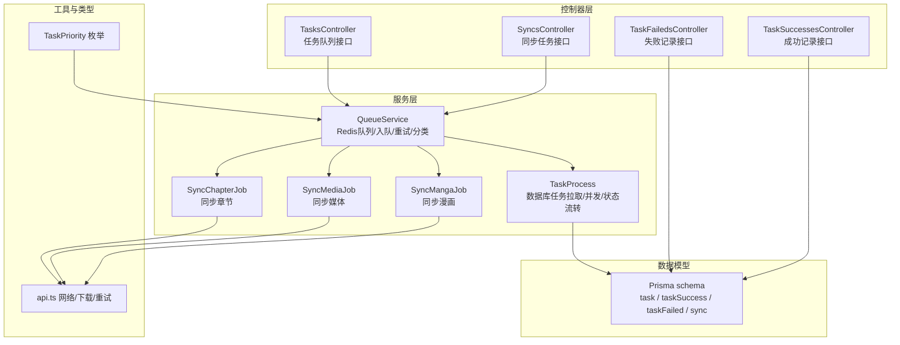
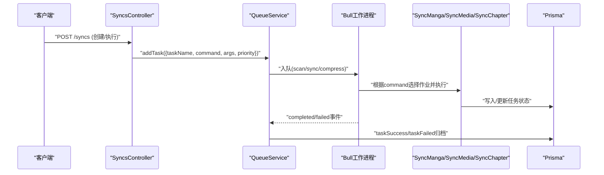
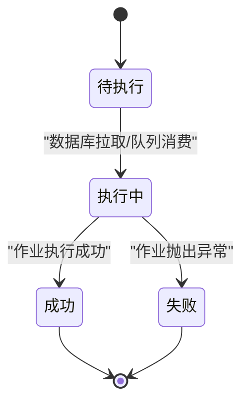
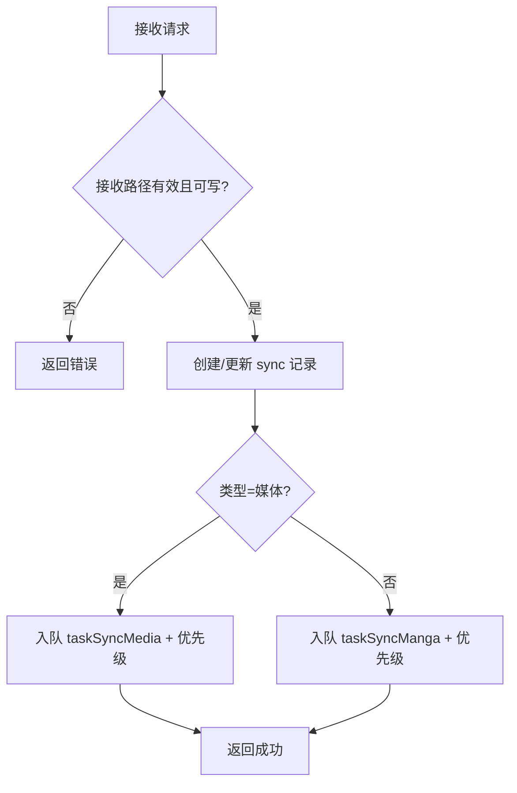
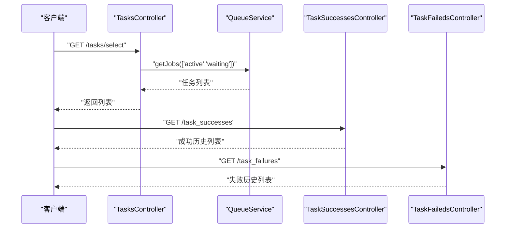
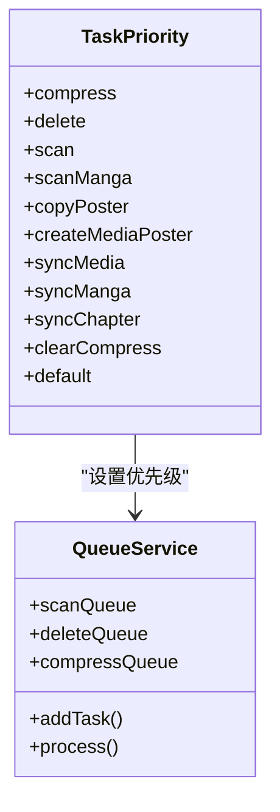
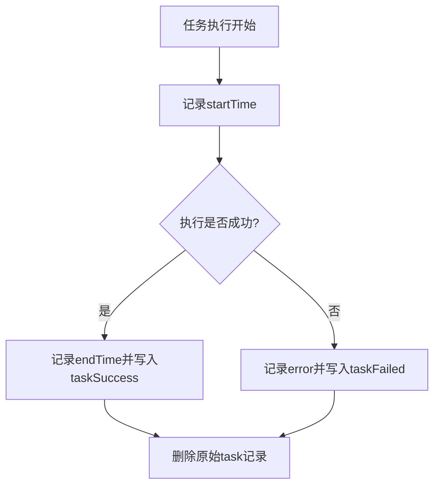
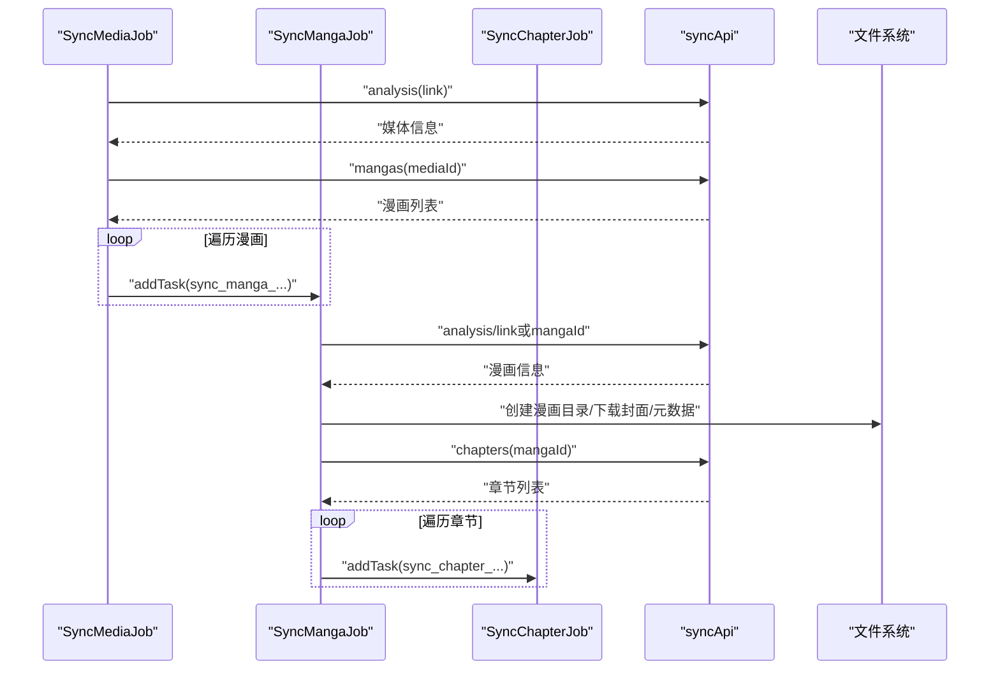
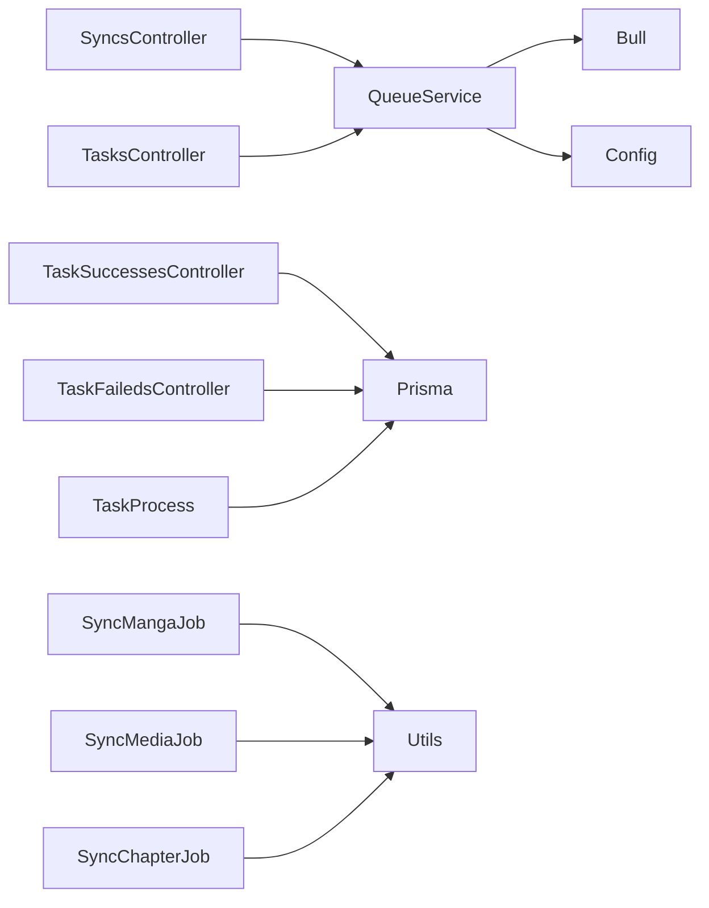

# 同步任务管理

<cite>
**本文引用的文件**
- [app/controllers/syncs_controller.ts](file://app/controllers/syncs_controller.ts)
- [app/services/queue_service.ts](file://app/services/queue_service.ts)
- [app/services/task_service.ts](file://app/services/task_service.ts)
- [app/services/sync_manga_job.ts](file://app/services/sync_manga_job.ts)
- [app/services/sync_media_job.ts](file://app/services/sync_media_job.ts)
- [app/services/sync_chapter_job.ts](file://app/services/sync_chapter_job.ts)
- [app/type/index.ts](file://app/type/index.ts)
- [app/utils/api.ts](file://app/utils/api.ts)
- [app/controllers/tasks_controller.ts](file://app/controllers/tasks_controller.ts)
- [app/controllers/task_faileds_controller.ts](file://app/controllers/task_faileds_controller.ts)
- [app/controllers/task_successes_controller.ts](file://app/controllers/task_successes_controller.ts)
- [prisma/sqlite/schema.prisma](file://prisma/sqlite/schema.prisma)
</cite>

## 目录
1. [简介](#简介)
2. [项目结构](#项目结构)
3. [核心组件](#核心组件)
4. [架构总览](#架构总览)
5. [详细组件分析](#详细组件分析)
6. [依赖关系分析](#依赖关系分析)
7. [性能考虑](#性能考虑)
8. [故障排查指南](#故障排查指南)
9. [结论](#结论)
10. [附录](#附录)

## 简介
本文件面向 SManga Adonis 的“同步任务管理”能力，系统性阐述同步任务的生命周期管理、状态跟踪与调度机制；覆盖任务的创建、修改、删除与批量操作；说明任务状态的实时监控与历史记录查询；明确任务优先级、队列管理与资源分配策略；并提供执行日志、错误报告与性能统计的实现要点与建议。

## 项目结构
围绕同步任务管理的关键模块与职责如下：
- 控制器层：负责对外接口与业务编排
  - 同步控制器：处理同步任务的创建、执行、更新、删除与批量删除
  - 任务控制器：提供任务队列的查询、详情、删除、批量删除与清空
  - 成功/失败任务控制器：提供历史记录的查询与管理
- 服务层：封装任务调度、执行与队列处理
  - 队列服务：定义 Redis 队列、任务入队、并发与重试策略、分类队列（scan/sync/compress）
  - 任务处理服务：基于数据库的任务拉取、并发控制、状态流转与结果归档
  - 同步作业：具体同步行为（媒体、漫画、章节）的实现
- 类型与工具：统一任务优先级枚举、HTTP 响应封装、网络与下载工具
- 数据模型：Prisma 定义的任务、成功/失败记录与同步配置表

图表来源
- [app/controllers/syncs_controller.ts:1-193](file://app/controllers/syncs_controller.ts#L1-L193)
- [app/controllers/tasks_controller.ts:1-55](file://app/controllers/tasks_controller.ts#L1-L55)
- [app/controllers/task_successes_controller.ts:1-54](file://app/controllers/task_successes_controller.ts#L1-L54)
- [app/controllers/task_faileds_controller.ts:1-61](file://app/controllers/task_faileds_controller.ts#L1-L61)
- [app/services/queue_service.ts:1-267](file://app/services/queue_service.ts#L1-L267)
- [app/services/task_service.ts:1-171](file://app/services/task_service.ts#L1-L171)
- [app/services/sync_manga_job.ts:1-103](file://app/services/sync_manga_job.ts#L1-L103)
- [app/services/sync_media_job.ts:1-44](file://app/services/sync_media_job.ts#L1-L44)
- [app/services/sync_chapter_job.ts:1-65](file://app/services/sync_chapter_job.ts#L1-L65)
- [app/type/index.ts:1-49](file://app/type/index.ts#L1-L49)
- [app/utils/api.ts:1-178](file://app/utils/api.ts#L1-L178)
- [prisma/sqlite/schema.prisma:311-437](file://prisma/sqlite/schema.prisma#L311-L437)

章节来源
- [app/controllers/syncs_controller.ts:1-193](file://app/controllers/syncs_controller.ts#L1-L193)
- [app/services/queue_service.ts:1-267](file://app/services/queue_service.ts#L1-L267)
- [app/services/task_service.ts:1-171](file://app/services/task_service.ts#L1-L171)
- [app/services/sync_manga_job.ts:1-103](file://app/services/sync_manga_job.ts#L1-L103)
- [app/services/sync_media_job.ts:1-44](file://app/services/sync_media_job.ts#L1-L44)
- [app/services/sync_chapter_job.ts:1-65](file://app/services/sync_chapter_job.ts#L1-L65)
- [app/type/index.ts:1-49](file://app/type/index.ts#L1-L49)
- [app/utils/api.ts:1-178](file://app/utils/api.ts#L1-L178)
- [prisma/sqlite/schema.prisma:311-437](file://prisma/sqlite/schema.prisma#L311-L437)

## 核心组件
- 同步控制器：提供同步任务的创建、执行、更新、删除与批量删除接口，支持媒体与漫画两类同步，并根据优先级入队
- 队列服务：基于 Redis 的 Bull 队列，支持 scan/sync/compress 分类队列、并发度、最大重试次数、超时与指数退避重试
- 任务处理服务：从数据库拉取待执行任务，按优先级排序，限制并发，执行完成后写入成功/失败记录并清理
- 同步作业：具体同步行为封装，如媒体同步、漫画同步、章节同步，负责下载与目录组织
- 历史记录控制器：提供成功/失败任务的历史查询与管理
- 数据模型：task、taskSuccess、taskFailed、sync 等模型支撑任务状态与历史追踪

章节来源
- [app/controllers/syncs_controller.ts:1-193](file://app/controllers/syncs_controller.ts#L1-L193)
- [app/services/queue_service.ts:1-267](file://app/services/queue_service.ts#L1-L267)
- [app/services/task_service.ts:1-171](file://app/services/task_service.ts#L1-L171)
- [app/services/sync_manga_job.ts:1-103](file://app/services/sync_manga_job.ts#L1-L103)
- [app/services/sync_media_job.ts:1-44](file://app/services/sync_media_job.ts#L1-L44)
- [app/services/sync_chapter_job.ts:1-65](file://app/services/sync_chapter_job.ts#L1-L65)
- [app/controllers/task_successes_controller.ts:1-54](file://app/controllers/task_successes_controller.ts#L1-L54)
- [app/controllers/task_faileds_controller.ts:1-61](file://app/controllers/task_faileds_controller.ts#L1-L61)
- [prisma/sqlite/schema.prisma:311-437](file://prisma/sqlite/schema.prisma#L311-L437)

## 架构总览
同步任务管理采用“控制器-服务-队列-作业-数据库”的分层架构。控制器负责对外接口与参数校验，服务层负责任务入队与执行调度，队列层负责任务持久化与重试，作业层负责具体业务逻辑，数据库负责任务状态与历史记录。

图表来源
- [app/controllers/syncs_controller.ts:34-108](file://app/controllers/syncs_controller.ts#L34-L108)
- [app/services/queue_service.ts:103-141](file://app/services/queue_service.ts#L103-L141)
- [app/services/sync_manga_job.ts:25-102](file://app/services/sync_manga_job.ts#L25-L102)
- [app/services/sync_media_job.ts:17-43](file://app/services/sync_media_job.ts#L17-L43)
- [app/services/sync_chapter_job.ts:20-64](file://app/services/sync_chapter_job.ts#L20-L64)
- [prisma/sqlite/schema.prisma:311-354](file://prisma/sqlite/schema.prisma#L311-L354)

## 详细组件分析

### 同步任务生命周期与状态流转
- 生命周期阶段
  - 创建：控制器校验接收路径与权限，创建同步记录，并根据类型入队对应命令
  - 入队：队列服务根据任务名特征选择 scan/sync/compress 队列，设置优先级、超时与重试
  - 执行：Bull 工作进程拉取任务，调用对应作业执行；作业内部进行网络请求与文件下载
  - 结果归档：成功/失败分别写入 taskSuccess/taskFailed 表，原始任务从 task 表删除
- 状态流转
  - pending → in-progress → completed 或 failed
  - 通过数据库字段 status、startTime、endTime、error 记录状态与时间线

图表来源
- [app/services/task_service.ts:36-84](file://app/services/task_service.ts#L36-L84)
- [app/services/queue_service.ts:103-141](file://app/services/queue_service.ts#L103-L141)
- [prisma/sqlite/schema.prisma:311-354](file://prisma/sqlite/schema.prisma#L311-L354)

章节来源
- [app/controllers/syncs_controller.ts:34-108](file://app/controllers/syncs_controller.ts#L34-L108)
- [app/services/queue_service.ts:175-264](file://app/services/queue_service.ts#L175-L264)
- [app/services/task_service.ts:91-169](file://app/services/task_service.ts#L91-L169)
- [prisma/sqlite/schema.prisma:311-354](file://prisma/sqlite/schema.prisma#L311-L354)

### 任务创建、修改、删除与批量操作
- 创建
  - 校验接收路径存在性与可写权限
  - 写入 sync 表
  - 根据 syncType 选择命令：taskSyncMedia 或 taskSyncManga，并设置优先级
- 修改
  - 更新 sync 记录字段（类型、源站、分享信息、自动开关等）
- 删除
  - 删除单条 sync 记录
  - 支持批量删除
- 执行
  - 单次触发：根据现有 sync 记录重新入队对应命令

图表来源
- [app/controllers/syncs_controller.ts:34-108](file://app/controllers/syncs_controller.ts#L34-L108)

章节来源
- [app/controllers/syncs_controller.ts:34-193](file://app/controllers/syncs_controller.ts#L34-L193)

### 任务状态实时监控与历史记录查询
- 实时监控
  - 任务队列查询：获取 active/waiting 任务列表
  - 任务详情：按 taskId 查询单个任务
- 历史记录
  - 成功/失败记录：提供分页查询与详情查看
  - 历史归档：执行完成后自动写入 taskSuccess/taskFailed

图表来源
- [app/controllers/tasks_controller.ts:6-28](file://app/controllers/tasks_controller.ts#L6-L28)
- [app/controllers/task_successes_controller.ts:7-16](file://app/controllers/task_successes_controller.ts#L7-L16)
- [app/controllers/task_faileds_controller.ts:14-23](file://app/controllers/task_faileds_controller.ts#L14-L23)

章节来源
- [app/controllers/tasks_controller.ts:1-55](file://app/controllers/tasks_controller.ts#L1-L55)
- [app/controllers/task_successes_controller.ts:1-54](file://app/controllers/task_successes_controller.ts#L1-L54)
- [app/controllers/task_faileds_controller.ts:1-61](file://app/controllers/task_faileds_controller.ts#L1-L61)

### 优先级设置、队列管理与资源分配
- 优先级
  - 通过枚举 TaskPriority 设置，数值越小优先级越高
  - 同步媒体、漫画、章节分别设置不同优先级
- 队列分类
  - scan/sync/compress 三类队列，依据任务名特征自动路由
- 资源分配
  - 并发度、最大重试次数、超时时间由配置决定
  - 作业内部对下载等耗时操作采用带退避的重试策略

图表来源
- [app/type/index.ts:3-16](file://app/type/index.ts#L3-L16)
- [app/services/queue_service.ts:175-264](file://app/services/queue_service.ts#L175-L264)

章节来源
- [app/type/index.ts:1-49](file://app/type/index.ts#L1-L49)
- [app/services/queue_service.ts:17-32](file://app/services/queue_service.ts#L17-L32)
- [app/services/queue_service.ts:175-264](file://app/services/queue_service.ts#L175-L264)

### 执行日志、错误报告与性能统计
- 执行日志
  - 队列事件：completed/failed 事件输出日志
  - 作业内部：打印执行步骤与关键信息
- 错误报告
  - 失败记录：捕获异常并写入 taskFailed，包含错误信息
  - 下载失败：带重试与错误日志记录
- 性能统计
  - 可基于 startTime/endTime 计算任务耗时
  - 可扩展统计队列长度、重试次数、平均耗时等指标

图表来源
- [app/services/task_service.ts:132-169](file://app/services/task_service.ts#L132-L169)
- [app/services/queue_service.ts:41-47](file://app/services/queue_service.ts#L41-L47)
- [app/utils/api.ts:125-176](file://app/utils/api.ts#L125-L176)

章节来源
- [app/services/task_service.ts:74-169](file://app/services/task_service.ts#L74-L169)
- [app/services/queue_service.ts:41-47](file://app/services/queue_service.ts#L41-L47)
- [app/utils/api.ts:125-176](file://app/utils/api.ts#L125-L176)

### 暂停、恢复与取消
- 当前实现
  - 未提供直接的暂停/恢复/取消操作
  - 支持删除单个任务（移除队列）、批量删除、清空队列
- 建议实现
  - 引入任务状态“paused”，在调度器中跳过该状态任务
  - 提供任务暂停/恢复接口，配合状态字段与调度逻辑
  - 取消：删除队列中的任务或标记为取消并跳过执行

章节来源
- [app/controllers/tasks_controller.ts:30-53](file://app/controllers/tasks_controller.ts#L30-L53)

### 同步作业流程（媒体/漫画/章节）
- 媒体同步
  - 解析分享链接，获取媒体信息
  - 遍历媒体下的漫画，逐个创建漫画同步任务
- 漫画同步
  - 解析分享链接，获取漫画信息
  - 下载封面与元数据，遍历章节创建章节同步任务
- 章节同步
  - 根据章节类型下载图片或视频文件
  - 组织本地目录结构并保存

图表来源
- [app/services/sync_media_job.ts:17-43](file://app/services/sync_media_job.ts#L17-L43)
- [app/services/sync_manga_job.ts:25-102](file://app/services/sync_manga_job.ts#L25-L102)
- [app/services/sync_chapter_job.ts:20-64](file://app/services/sync_chapter_job.ts#L20-L64)
- [app/utils/api.ts:52-73](file://app/utils/api.ts#L52-L73)

章节来源
- [app/services/sync_media_job.ts:1-44](file://app/services/sync_media_job.ts#L1-L44)
- [app/services/sync_manga_job.ts:1-103](file://app/services/sync_manga_job.ts#L1-L103)
- [app/services/sync_chapter_job.ts:1-65](file://app/services/sync_chapter_job.ts#L1-L65)
- [app/utils/api.ts:1-178](file://app/utils/api.ts#L1-L178)

## 依赖关系分析
- 控制器依赖服务与队列
  - SyncsController 依赖 QueueService 与 TaskPriority
  - TasksController 依赖 QueueService 的任务查询与删除能力
  - 成功/失败控制器依赖 Prisma 模型
- 服务依赖工具与数据库
  - QueueService 依赖 Redis/Bull、配置与工具函数
  - TaskProcess 依赖 Prisma 与互斥锁
  - 同步作业依赖网络工具与文件系统
- 数据模型
  - task、taskSuccess、taskFailed、sync 四张表支撑任务全生命周期

图表来源
- [app/controllers/syncs_controller.ts:1-193](file://app/controllers/syncs_controller.ts#L1-L193)
- [app/controllers/tasks_controller.ts:1-55](file://app/controllers/tasks_controller.ts#L1-L55)
- [app/controllers/task_successes_controller.ts:1-54](file://app/controllers/task_successes_controller.ts#L1-L54)
- [app/controllers/task_faileds_controller.ts:1-61](file://app/controllers/task_faileds_controller.ts#L1-L61)
- [app/services/queue_service.ts:1-267](file://app/services/queue_service.ts#L1-L267)
- [app/services/task_service.ts:1-171](file://app/services/task_service.ts#L1-L171)
- [app/services/sync_manga_job.ts:1-103](file://app/services/sync_manga_job.ts#L1-L103)
- [app/services/sync_media_job.ts:1-44](file://app/services/sync_media_job.ts#L1-L44)
- [app/services/sync_chapter_job.ts:1-65](file://app/services/sync_chapter_job.ts#L1-L65)
- [prisma/sqlite/schema.prisma:311-437](file://prisma/sqlite/schema.prisma#L311-L437)

章节来源
- [app/controllers/syncs_controller.ts:1-193](file://app/controllers/syncs_controller.ts#L1-L193)
- [app/services/queue_service.ts:1-267](file://app/services/queue_service.ts#L1-L267)
- [app/services/task_service.ts:1-171](file://app/services/task_service.ts#L1-L171)
- [prisma/sqlite/schema.prisma:311-437](file://prisma/sqlite/schema.prisma#L311-L437)

## 性能考虑
- 并发与限流
  - 数据库任务拉取并发受 maxConcurrentTasks 限制，避免过度竞争
  - 队列并发度与重试退避可调，降低重试风暴风险
- I/O 优化
  - 下载采用流式写入与带退避的重试策略，减少失败重试成本
- 存储与索引
  - 建议为 task.status、task.priority、task.createTime 建立索引以提升查询与排序性能
- 监控与告警
  - 建议采集队列长度、任务耗时、失败率等指标，结合日志进行可视化监控

## 故障排查指南
- 接收路径问题
  - 路径不存在或不可写会导致创建失败，需检查路径权限与存在性
- 任务未执行
  - 检查队列是否正确入队、工作进程是否运行、Redis 是否可用
  - 对于同一路径的扫描/删除任务，系统可能去重跳过重复执行
- 任务失败
  - 查看 taskFailed 记录的错误信息
  - 检查网络与远端接口可用性、下载重试日志
- 历史查询
  - 使用成功/失败控制器接口查询历史记录，定位问题根因

章节来源
- [app/controllers/syncs_controller.ts:38-53](file://app/controllers/syncs_controller.ts#L38-L53)
- [app/services/queue_service.ts:222-232](file://app/services/queue_service.ts#L222-L232)
- [app/controllers/task_faileds_controller.ts:14-23](file://app/controllers/task_faileds_controller.ts#L14-L23)
- [app/utils/api.ts:163-176](file://app/utils/api.ts#L163-L176)

## 结论
SManga Adonis 的同步任务管理以队列为核心，结合数据库状态与历史归档，实现了从创建到执行再到结果记录的完整闭环。通过优先级与队列分类，系统能够有序调度不同类型任务；通过下载重试与事件日志，提升了稳定性与可观测性。未来可在暂停/恢复/取消方面进一步增强控制能力，并完善监控与统计指标以支撑生产运维。

## 附录
- 关键数据模型字段说明
  - task：taskId、taskName、command、status、priority、args、startTime、endTime、error
  - taskSuccess/taskFailed：与 task 字段一致，用于历史归档
  - sync：syncId、syncType、syncName、receivedPath、origin、shareId、link、secret、auto、token

章节来源
- [prisma/sqlite/schema.prisma:311-437](file://prisma/sqlite/schema.prisma#L311-L437)