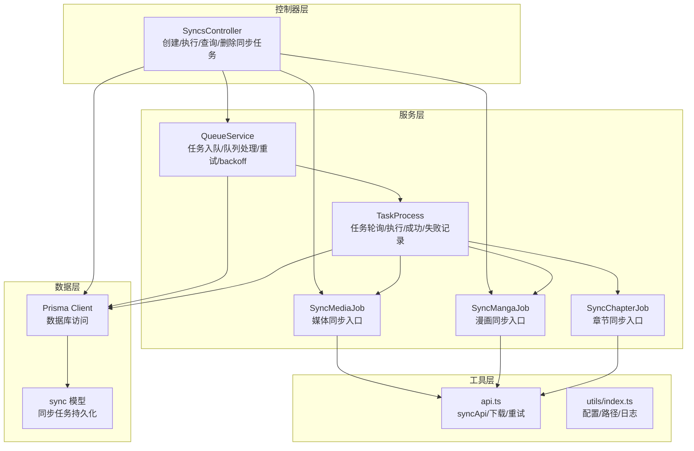
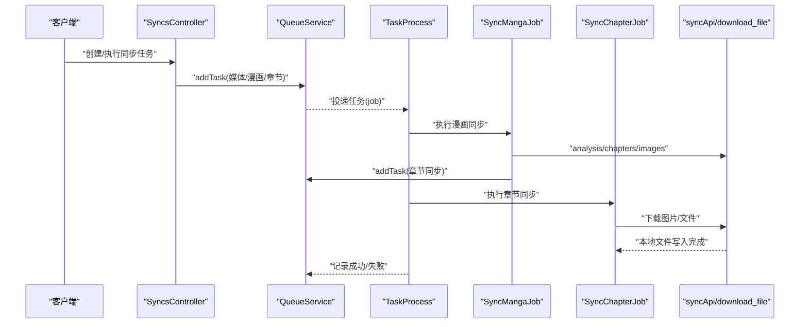
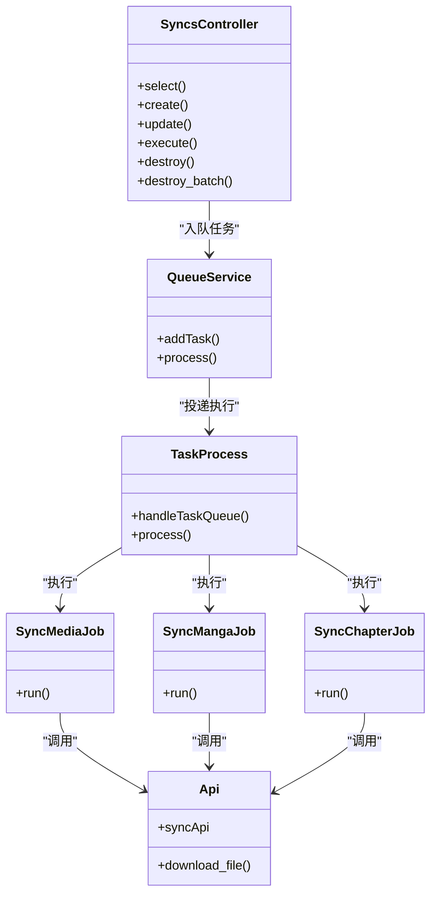
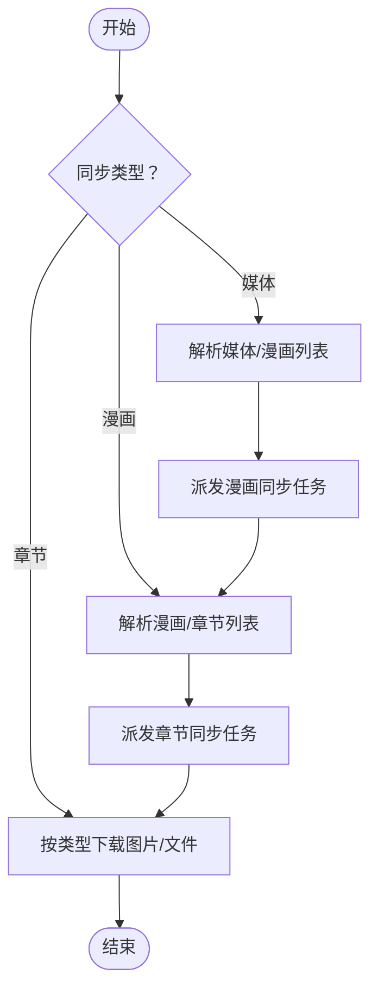

# 同步系统

<cite>
**本文引用的文件**
- [app/controllers/syncs_controller.ts](file://app/controllers/syncs_controller.ts)
- [app/services/sync_manga_job.ts](file://app/services/sync_manga_job.ts)
- [app/services/sync_chapter_job.ts](file://app/services/sync_chapter_job.ts)
- [app/services/sync_media_job.ts](file://app/services/sync_media_job.ts)
- [app/services/queue_service.ts](file://app/services/queue_service.ts)
- [app/services/task_service.ts](file://app/services/task_service.ts)
- [app/utils/api.ts](file://app/utils/api.ts)
- [app/type/index.ts](file://app/type/index.ts)
- [app/utils/index.ts](file://app/utils/index.ts)
- [app/listeners/task.ts](file://app/listeners/task.ts)
- [app/services/timer_service.ts](file://app/services/timer_service.ts)
- [start/prisma.ts](file://start/prisma.ts)
- [prisma/mysql/schema.prisma](file://prisma/mysql/schema.prisma)
- [prisma/pgsql/schema.prisma](file://prisma/pgsql/schema.prisma)
- [prisma/sqlite/schema.prisma](file://prisma/sqlite/schema.prisma)
- [config/app.ts](file://config/app.ts)
</cite>

## 目录
1. [简介](#简介)
2. [项目结构](#项目结构)
3. [核心组件](#核心组件)
4. [架构总览](#架构总览)
5. [详细组件分析](#详细组件分析)
6. [依赖关系分析](#依赖关系分析)
7. [性能考量](#性能考量)
8. [故障排查指南](#故障排查指南)
9. [结论](#结论)
10. [附录](#附录)

## 简介
本文件系统性阐述 SManga Adonis 的同步系统，覆盖以下方面：
- 数据同步机制：漫画数据、章节信息、媒体文件与元数据的同步流程
- 外部接口集成：与远端服务的分析、章节、图片与文件接口对接
- 同步策略：全量同步与增量同步的边界与实现要点
- 任务调度：基于 Redis 的队列系统、任务优先级与重试策略
- 冲突与一致性：路径存在性校验、幂等性与去重
- 错误处理与重试：下载失败重试、错误日志与失败记录
- 性能优化：并发控制、超时与指数退避、流式下载
- 监控与可观测性：任务状态、队列事件与日志

## 项目结构
同步系统围绕“控制器 -> 任务调度 -> 作业执行 -> 外部接口”的链路组织，关键模块如下：
- 控制器层：对外暴露同步任务的创建、执行、查询与删除
- 服务层：任务调度与执行、同步作业（媒体/漫画/章节）
- 工具层：HTTP 接口封装、下载与重试、通用工具
- 类型与配置：任务优先级、数据库模型与 Prisma 客户端
- 监听与定时：定时器驱动的任务轮询与队列事件监听

图表来源
- [app/controllers/syncs_controller.ts:1-193](file://app/controllers/syncs_controller.ts#L1-L193)
- [app/services/queue_service.ts:1-267](file://app/services/queue_service.ts#L1-L267)
- [app/services/task_service.ts:1-171](file://app/services/task_service.ts#L1-L171)
- [app/services/sync_media_job.ts:1-44](file://app/services/sync_media_job.ts#L1-L44)
- [app/services/sync_manga_job.ts:1-103](file://app/services/sync_manga_job.ts#L1-L103)
- [app/services/sync_chapter_job.ts:1-65](file://app/services/sync_chapter_job.ts#L1-L65)
- [app/utils/api.ts:1-178](file://app/utils/api.ts#L1-L178)
- [start/prisma.ts:1-41](file://start/prisma.ts#L1-L41)
- [prisma/mysql/schema.prisma:425-439](file://prisma/mysql/schema.prisma#L425-L439)

章节来源
- [app/controllers/syncs_controller.ts:1-193](file://app/controllers/syncs_controller.ts#L1-L193)
- [app/services/queue_service.ts:1-267](file://app/services/queue_service.ts#L1-L267)
- [app/services/task_service.ts:1-171](file://app/services/task_service.ts#L1-L171)
- [app/services/sync_media_job.ts:1-44](file://app/services/sync_media_job.ts#L1-L44)
- [app/services/sync_manga_job.ts:1-103](file://app/services/sync_manga_job.ts#L1-L103)
- [app/services/sync_chapter_job.ts:1-65](file://app/services/sync_chapter_job.ts#L1-L65)
- [app/utils/api.ts:1-178](file://app/utils/api.ts#L1-L178)
- [start/prisma.ts:1-41](file://start/prisma.ts#L1-L41)
- [prisma/mysql/schema.prisma:425-439](file://prisma/mysql/schema.prisma#L425-L439)

## 核心组件
- 同步控制器：负责接收请求、校验接收路径、创建/更新/执行/删除同步任务，并将任务推送到队列
- 队列服务：基于 Bull/Redis 的任务队列，支持按名称分类（scan/sync/compress）、并发、重试与指数退避
- 任务处理器：定时轮询待执行任务，串行/并发地执行具体命令
- 同步作业：
  - 媒体同步：解析分享链接，批量派发漫画同步任务
  - 漫画同步：解析漫画信息、下载封面与元数据、派发章节同步任务
  - 章节同步：根据章节类型下载图片或单文件
- 外部接口：统一的 syncApi 与下载器，支持带重试的流式下载
- 数据模型：Prisma 的 sync 模型，持久化同步任务元数据

章节来源
- [app/controllers/syncs_controller.ts:34-108](file://app/controllers/syncs_controller.ts#L34-L108)
- [app/services/queue_service.ts:34-87](file://app/services/queue_service.ts#L34-L87)
- [app/services/task_service.ts:36-84](file://app/services/task_service.ts#L36-L84)
- [app/services/sync_media_job.ts:17-43](file://app/services/sync_media_job.ts#L17-L43)
- [app/services/sync_manga_job.ts:25-102](file://app/services/sync_manga_job.ts#L25-L102)
- [app/services/sync_chapter_job.ts:20-65](file://app/services/sync_chapter_job.ts#L20-L65)
- [app/utils/api.ts:52-73](file://app/utils/api.ts#L52-L73)

## 架构总览
同步系统采用“控制器 -> 队列 -> 作业 -> 外部接口”的分层设计，确保职责清晰、可扩展与可维护。

图表来源
- [app/controllers/syncs_controller.ts:88-104](file://app/controllers/syncs_controller.ts#L88-L104)
- [app/services/queue_service.ts:175-264](file://app/services/queue_service.ts#L175-L264)
- [app/services/task_service.ts:91-170](file://app/services/task_service.ts#L91-L170)
- [app/services/sync_manga_job.ts:25-102](file://app/services/sync_manga_job.ts#L25-L102)
- [app/services/sync_chapter_job.ts:20-65](file://app/services/sync_chapter_job.ts#L20-L65)
- [app/utils/api.ts:52-73](file://app/utils/api.ts#L52-L73)

## 详细组件分析

### 同步控制器（SyncsController）
- 功能点
  - 分页查询同步任务
  - 创建同步任务：校验接收路径存在性与可写性；根据类型派发媒体/漫画同步任务
  - 更新同步任务：修改基础配置
  - 手动执行同步：将已有任务重新入队
  - 删除同步任务：单个/批量删除
- 关键行为
  - 路径校验：存在性与写权限
  - 自动/手动模式：自动字段映射为整数
  - 任务入队：依据类型选择命令与优先级

章节来源
- [app/controllers/syncs_controller.ts:9-32](file://app/controllers/syncs_controller.ts#L9-L32)
- [app/controllers/syncs_controller.ts:34-108](file://app/controllers/syncs_controller.ts#L34-L108)
- [app/controllers/syncs_controller.ts:110-133](file://app/controllers/syncs_controller.ts#L110-L133)
- [app/controllers/syncs_controller.ts:135-164](file://app/controllers/syncs_controller.ts#L135-L164)
- [app/controllers/syncs_controller.ts:166-193](file://app/controllers/syncs_controller.ts#L166-L193)

### 队列服务（QueueService）
- 功能点
  - 任务入队：支持同步/扫描/压缩三类队列；统一超时、重试与指数退避
  - 任务处理：按命令分发到对应作业
  - 调度策略：根据任务名选择队列；支持同步调试模式直连执行
  - 去重：对扫描/删除路径进行去重判断
- 关键配置
  - 并发数、最大重试次数、超时时间来自配置
  - 指数退避：初始延迟、倍数与最大延迟限制

章节来源
- [app/services/queue_service.ts:175-264](file://app/services/queue_service.ts#L175-L264)
- [app/services/queue_service.ts:34-87](file://app/services/queue_service.ts#L34-L87)
- [app/services/queue_service.ts:143-165](file://app/services/queue_service.ts#L143-L165)

### 任务处理器（TaskProcess）
- 功能点
  - 定时轮询：每周期检查待执行任务
  - 并发控制：互斥锁与最大并发限制
  - 成功/失败记录：完成后移除任务并写入成功/失败表
- 关键行为
  - 任务状态流转：pending -> in-progress -> completed/failed
  - 异常捕获：失败写入失败表并保留错误信息

章节来源
- [app/services/task_service.ts:36-84](file://app/services/task_service.ts#L36-L84)
- [app/services/task_service.ts:91-170](file://app/services/task_service.ts#L91-L170)

### 媒体同步作业（SyncMediaJob）
- 功能点
  - 解析分享链接，获取媒体信息
  - 列举媒体下所有漫画，逐个派发漫画同步任务
- 关键行为
  - 通过 syncApi.mangas 获取漫画列表
  - 以相同接收路径与来源地址派发任务

章节来源
- [app/services/sync_media_job.ts:17-43](file://app/services/sync_media_job.ts#L17-L43)
- [app/utils/api.ts:65-68](file://app/utils/api.ts#L65-L68)

### 漫画同步作业（SyncMangaJob）
- 功能点
  - 解析分享链接或使用传入漫画记录
  - 下载外置封面与元数据文件夹
  - 获取章节列表并逐个派发章节同步任务
- 关键行为
  - 目录结构：按媒体类型决定漫画根目录
  - 幂等性：若本地文件存在则跳过下载

章节来源
- [app/services/sync_manga_job.ts:25-102](file://app/services/sync_manga_job.ts#L25-L102)
- [app/utils/api.ts:52-73](file://app/utils/api.ts#L52-L73)

### 章节同步作业（SyncChapterJob）
- 功能点
  - 下载章节外置封面
  - 图片章节：创建章节目录并逐图下载
  - 其他类型：直接下载章节文件
- 关键行为
  - 幂等性：若本地文件存在则跳过下载

章节来源
- [app/services/sync_chapter_job.ts:20-65](file://app/services/sync_chapter_job.ts#L20-L65)
- [app/utils/api.ts:69-72](file://app/utils/api.ts#L69-L72)

### 外部接口与下载（api.ts）
- 功能点
  - 统一的 syncApi：analysis/chapters/images/mangas/file
  - 流式下载：支持超时、断流重试与错误清理
  - 重试策略：最大重试次数、初始延迟、指数退避
- 关键行为
  - 下载失败写入错误日志并删除临时文件
  - 请求参数注入时间戳，响应统一解析

章节来源
- [app/utils/api.ts:52-73](file://app/utils/api.ts#L52-L73)
- [app/utils/api.ts:125-176](file://app/utils/api.ts#L125-L176)

### 任务优先级与类型（type/index.ts）
- 优先级枚举：为不同任务设定执行顺序权重
- 典型优先级：syncMedia > syncManga > syncChapter

章节来源
- [app/type/index.ts:3-16](file://app/type/index.ts#L3-L16)

### 数据模型与持久化（Prisma）
- sync 模型：保存同步任务的类型、来源、分享信息、接收路径与自动标志
- Prisma 客户端：根据配置动态选择数据库类型与连接

章节来源
- [prisma/mysql/schema.prisma:425-439](file://prisma/mysql/schema.prisma#L425-L439)
- [prisma/pgsql/schema.prisma:424-438](file://prisma/pgsql/schema.prisma#L424-L438)
- [prisma/sqlite/schema.prisma:424-438](file://prisma/sqlite/schema.prisma#L424-L438)
- [start/prisma.ts:1-41](file://start/prisma.ts#L1-L41)

## 依赖关系分析

图表来源
- [app/controllers/syncs_controller.ts:1-193](file://app/controllers/syncs_controller.ts#L1-L193)
- [app/services/queue_service.ts:103-141](file://app/services/queue_service.ts#L103-L141)
- [app/services/task_service.ts:91-170](file://app/services/task_service.ts#L91-L170)
- [app/services/sync_media_job.ts:1-44](file://app/services/sync_media_job.ts#L1-L44)
- [app/services/sync_manga_job.ts:1-103](file://app/services/sync_manga_job.ts#L1-L103)
- [app/services/sync_chapter_job.ts:1-65](file://app/services/sync_chapter_job.ts#L1-L65)
- [app/utils/api.ts:52-73](file://app/utils/api.ts#L52-L73)

## 性能考量
- 并发与限流
  - 队列并发：由配置决定，避免资源争用
  - 任务轮询：定时器周期性触发，降低 CPU 占用
- 超时与重试
  - 任务超时：统一超时时间，防止卡死
  - 指数退避：避免重试风暴，上限保护
- I/O 优化
  - 流式下载：边读边写，减少内存占用
  - 幂等性：重复任务不重复下载，节省带宽
- 存储与路径
  - 接收路径必须存在且可写，避免频繁 I/O 错误
  - 目录结构按媒体类型区分，便于管理

章节来源
- [app/services/queue_service.ts:24-32](file://app/services/queue_service.ts#L24-L32)
- [app/services/queue_service.ts:252-260](file://app/services/queue_service.ts#L252-L260)
- [app/utils/api.ts:136-155](file://app/utils/api.ts#L136-L155)
- [app/controllers/syncs_controller.ts:39-53](file://app/controllers/syncs_controller.ts#L39-L53)

## 故障排查指南
- 任务未执行
  - 检查定时器是否启动与任务轮询是否正常
  - 查看队列事件回调（完成/失败）日志
- 下载失败
  - 查看错误日志与失败记录，确认重试次数与退避策略
  - 核对远端接口可用性与网络连通性
- 路径问题
  - 接收路径不存在或不可写会导致创建失败
  - 检查操作系统差异导致的路径映射
- 幂等性与重复任务
  - 若本地文件已存在，同步作业会跳过下载
  - 去重逻辑：扫描/删除路径任务会检测队列中同名任务

章节来源
- [app/services/task_service.ts:36-84](file://app/services/task_service.ts#L36-L84)
- [app/services/queue_service.ts:41-47](file://app/services/queue_service.ts#L41-L47)
- [app/utils/api.ts:164-170](file://app/utils/api.ts#L164-L170)
- [app/controllers/syncs_controller.ts:39-53](file://app/controllers/syncs_controller.ts#L39-L53)
- [app/utils/index.ts:94-115](file://app/utils/index.ts#L94-L115)

## 结论
SManga Adonis 的同步系统通过清晰的分层与队列机制，实现了对媒体、漫画与章节的可靠同步。其特点包括：
- 明确的同步策略：媒体/漫画/章节三级联动，支持分享链接直达
- 可靠的任务调度：队列化、重试与退避，保障稳定性
- 高效的 I/O：流式下载与幂等性，兼顾性能与一致性
- 可观测性：任务状态、失败记录与日志，便于排障

## 附录

### 同步流程对比（全量 vs 增量）
- 全量同步
  - 媒体同步：解析媒体，列举全部漫画并逐一派发
  - 漫画同步：下载封面/元数据，拉取全部章节并派发
  - 章节同步：按章节类型下载全部图片或文件
- 增量同步
  - 当前实现以全量为主，可通过在作业层增加“已存在即跳过”逻辑实现增量
  - 建议：基于文件时间戳/哈希进行比对，仅在变更时下载

图表来源
- [app/services/sync_media_job.ts:32-42](file://app/services/sync_media_job.ts#L32-L42)
- [app/services/sync_manga_job.ts:85-101](file://app/services/sync_manga_job.ts#L85-L101)
- [app/services/sync_chapter_job.ts:38-63](file://app/services/sync_chapter_job.ts#L38-L63)

### 同步状态监控与记录
- 任务状态：pending -> in-progress -> completed/failed
- 成功/失败记录：完成后写入成功/失败表，便于审计与重试
- 队列事件：完成/失败回调日志，辅助定位问题

章节来源
- [app/services/task_service.ts:132-170](file://app/services/task_service.ts#L132-L170)
- [app/services/queue_service.ts:41-47](file://app/services/queue_service.ts#L41-L47)