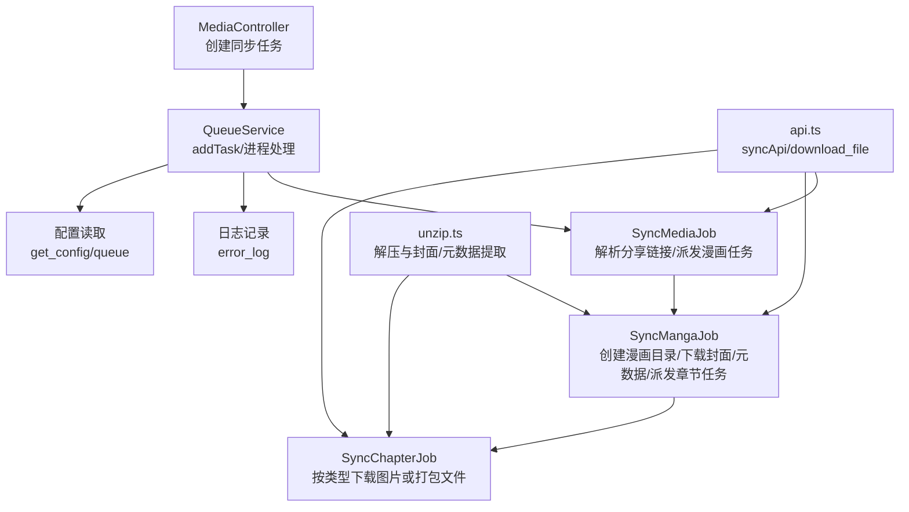
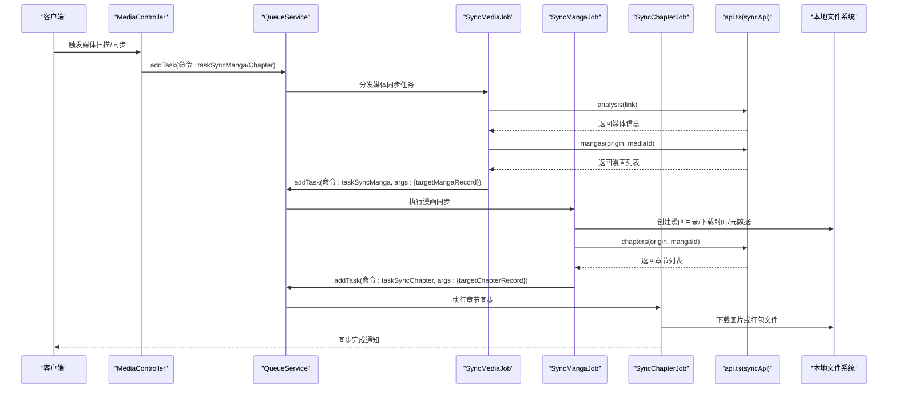
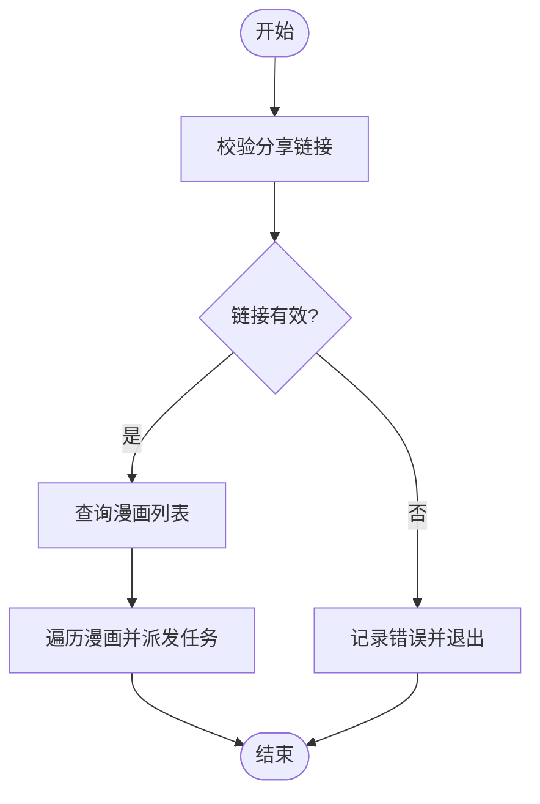
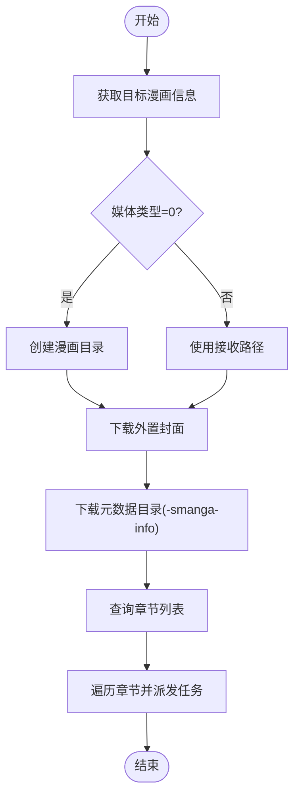
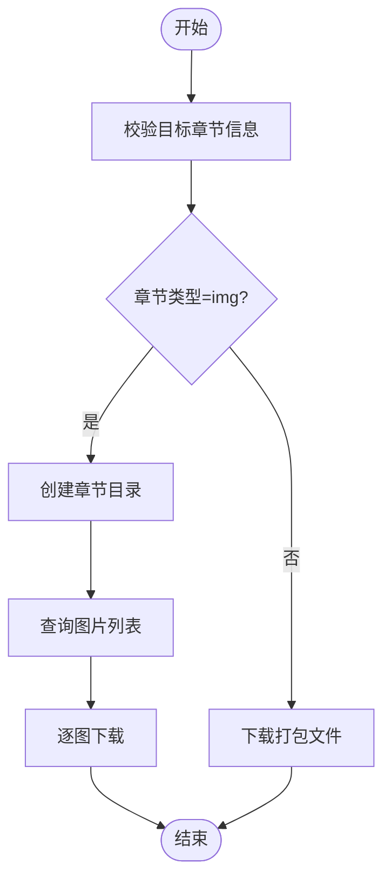
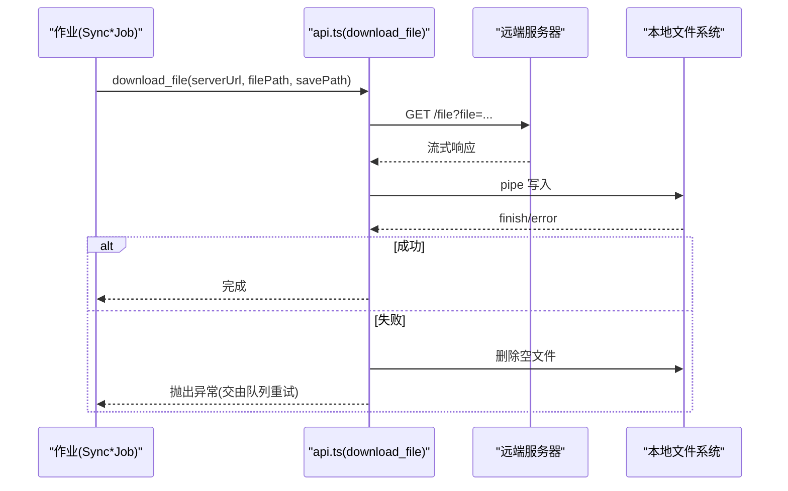
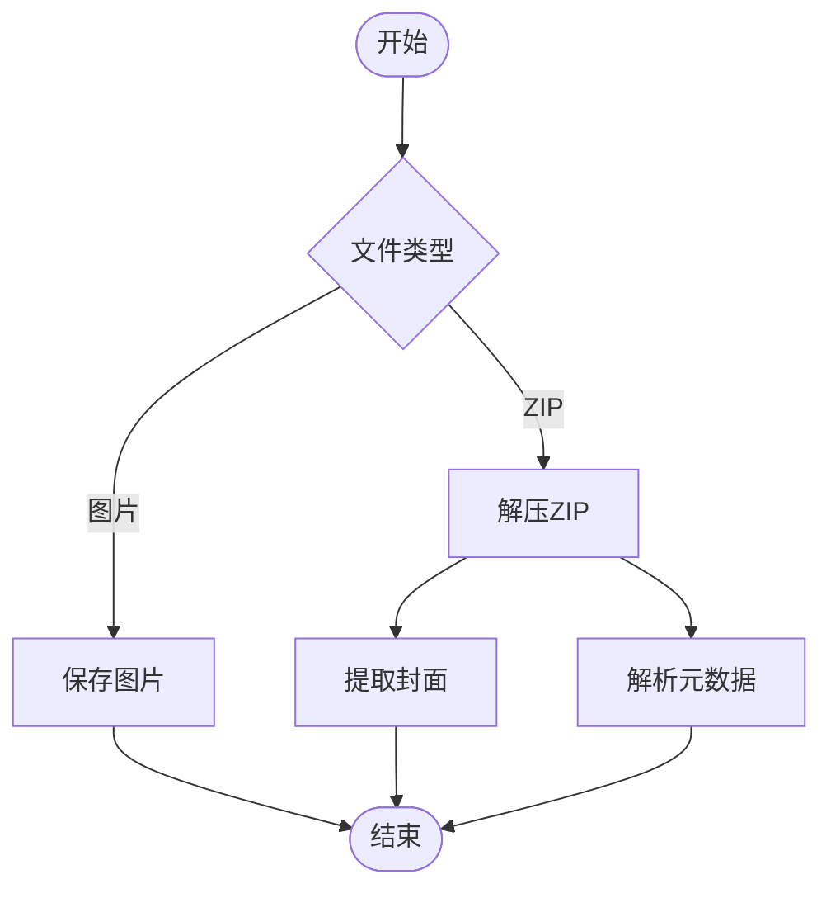
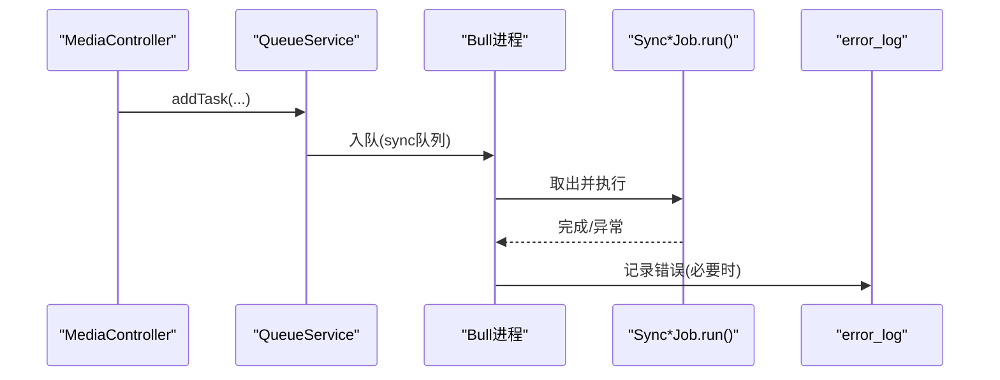
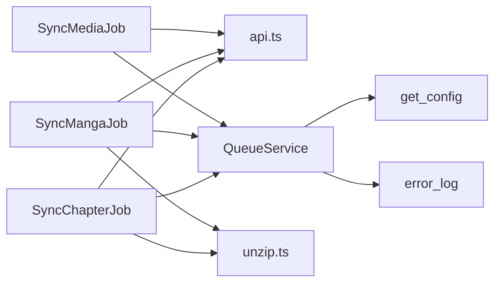

# 媒体文件同步

<cite>
**本文引用的文件**
- [app/services/sync_media_job.ts](file://app/services/sync_media_job.ts)
- [app/services/sync_manga_job.ts](file://app/services/sync_manga_job.ts)
- [app/services/sync_chapter_job.ts](file://app/services/sync_chapter_job.ts)
- [app/utils/api.ts](file://app/utils/api.ts)
- [app/utils/unzip.ts](file://app/utils/unzip.ts)
- [app/utils/index.ts](file://app/utils/index.ts)
- [app/services/queue_service.ts](file://app/services/queue_service.ts)
- [app/type/index.ts](file://app/type/index.ts)
- [app/controllers/media_controller.ts](file://app/controllers/media_controller.ts)
- [app/utils/log.ts](file://app/utils/log.ts)
- [data-example/config/smanga.json](file://data-example/config/smanga.json)
</cite>

## 目录
1. [简介](#简介)
2. [项目结构](#项目结构)
3. [核心组件](#核心组件)
4. [架构总览](#架构总览)
5. [详细组件分析](#详细组件分析)
6. [依赖关系分析](#依赖关系分析)
7. [性能考虑](#性能考虑)
8. [故障排查指南](#故障排查指南)
9. [结论](#结论)
10. [附录](#附录)

## 简介
本文件系统性阐述 SManga Adonis 的媒体文件同步能力，覆盖从“媒体库”到“漫画”再到“章节”的全链路同步流程，包括：
- 同步任务的创建、执行与监控
- 文件下载、解压、校验与存储策略
- 协议与接口约定、并发与重试机制
- 性能优化、带宽管理与断点续传思路
- 错误处理、重试与数据完整性保障

## 项目结构
媒体同步相关代码主要分布在以下模块：
- 控制器层：对外暴露媒体库操作接口，触发同步任务
- 服务层：封装具体同步作业（媒体、漫画、章节）
- 工具层：网络请求、文件下载、解压与格式判断
- 队列层：基于 Redis 的 Bull 队列，统一调度与重试
- 类型与配置：任务优先级、队列并发与重试参数、全局配置

图表来源
- [app/controllers/media_controller.ts:187-204](file://app/controllers/media_controller.ts#L187-L204)
- [app/services/queue_service.ts:175-264](file://app/services/queue_service.ts#L175-L264)
- [app/services/sync_media_job.ts:17-43](file://app/services/sync_media_job.ts#L17-L43)
- [app/services/sync_manga_job.ts:25-102](file://app/services/sync_manga_job.ts#L25-L102)
- [app/services/sync_chapter_job.ts:20-64](file://app/services/sync_chapter_job.ts#L20-L64)
- [app/utils/api.ts:52-73](file://app/utils/api.ts#L52-L73)
- [app/utils/unzip.ts:102-168](file://app/utils/unzip.ts#L102-L168)
- [app/utils/log.ts:60-72](file://app/utils/log.ts#L60-L72)
- [data-example/config/smanga.json:46-50](file://data-example/config/smanga.json#L46-L50)

章节来源
- [app/controllers/media_controller.ts:187-204](file://app/controllers/media_controller.ts#L187-L204)
- [app/services/queue_service.ts:175-264](file://app/services/queue_service.ts#L175-L264)
- [app/services/sync_media_job.ts:17-43](file://app/services/sync_media_job.ts#L17-L43)
- [app/services/sync_manga_job.ts:25-102](file://app/services/sync_manga_job.ts#L25-L102)
- [app/services/sync_chapter_job.ts:20-64](file://app/services/sync_chapter_job.ts#L20-L64)
- [app/utils/api.ts:52-73](file://app/utils/api.ts#L52-L73)
- [app/utils/unzip.ts:102-168](file://app/utils/unzip.ts#L102-L168)
- [app/utils/log.ts:60-72](file://app/utils/log.ts#L60-L72)
- [data-example/config/smanga.json:46-50](file://data-example/config/smanga.json#L46-L50)

## 核心组件
- SyncMediaJob：接收分享链接，解析目标媒体信息，枚举媒体下漫画列表，向队列派发“同步漫画”任务
- SyncMangaJob：根据媒体类型创建漫画目录；下载外置封面与元数据；枚举章节并派发“同步章节”任务
- SyncChapterJob：根据章节类型分别处理（图片集或打包文件），下载至本地指定路径
- QueueService：统一任务入队、并发控制、重试与超时；区分 sync/scan/compress 等队列
- api.ts：封装分析/章节/图片/漫画列表/文件下载等接口；提供带指数退避的下载函数
- unzip.ts：ZIP 解压、首张图片抽取、封面与元数据提取
- 配置与类型：任务优先级、队列并发/重试/超时、全局配置读取

章节来源
- [app/services/sync_media_job.ts:5-44](file://app/services/sync_media_job.ts#L5-L44)
- [app/services/sync_manga_job.ts:10-103](file://app/services/sync_manga_job.ts#L10-L103)
- [app/services/sync_chapter_job.ts:8-65](file://app/services/sync_chapter_job.ts#L8-L65)
- [app/services/queue_service.ts:17-32](file://app/services/queue_service.ts#L17-L32)
- [app/utils/api.ts:52-73](file://app/utils/api.ts#L52-L73)
- [app/utils/unzip.ts:102-168](file://app/utils/unzip.ts#L102-L168)
- [app/type/index.ts:3-16](file://app/type/index.ts#L3-L16)
- [data-example/config/smanga.json:46-50](file://data-example/config/smanga.json#L46-L50)

## 架构总览
媒体同步采用“控制器 -> 队列 -> 作业”的分层设计，确保高并发与可恢复性。

图表来源
- [app/controllers/media_controller.ts:187-204](file://app/controllers/media_controller.ts#L187-L204)
- [app/services/sync_media_job.ts:17-43](file://app/services/sync_media_job.ts#L17-L43)
- [app/services/sync_manga_job.ts:25-102](file://app/services/sync_manga_job.ts#L25-L102)
- [app/services/sync_chapter_job.ts:20-64](file://app/services/sync_chapter_job.ts#L20-L64)
- [app/utils/api.ts:52-73](file://app/utils/api.ts#L52-L73)

## 详细组件分析

### SyncMediaJob 组件分析
职责：
- 接收分享链接，调用分析接口获取媒体信息
- 枚举媒体下的漫画列表，逐个派发“同步漫画”任务

关键点：
- 链接有效性校验与错误处理
- 通过队列服务以指定优先级派发任务
- 支持多漫画并发同步

图表来源
- [app/services/sync_media_job.ts:17-43](file://app/services/sync_media_job.ts#L17-L43)

章节来源
- [app/services/sync_media_job.ts:5-44](file://app/services/sync_media_job.ts#L5-L44)

### SyncMangaJob 组件分析
职责：
- 根据媒体类型决定漫画目录结构
- 下载外置封面与元数据
- 枚举章节并派发“同步章节”任务

关键点：
- 目录创建与幂等检查（存在则跳过）
- 元数据目录命名规范
- 图片类型与非图片类型章节的差异化处理

图表来源
- [app/services/sync_manga_job.ts:25-102](file://app/services/sync_manga_job.ts#L25-L102)

章节来源
- [app/services/sync_manga_job.ts:10-103](file://app/services/sync_manga_job.ts#L10-L103)

### SyncChapterJob 组件分析
职责：
- 根据章节类型选择下载策略
- 图片类章节：创建章节目录并逐图下载
- 非图片类章节：直接下载打包文件

关键点：
- 目录存在性检查与创建
- 外置封面下载与去重
- 对不同章节类型的容错处理

图表来源
- [app/services/sync_chapter_job.ts:20-64](file://app/services/sync_chapter_job.ts#L20-L64)

章节来源
- [app/services/sync_chapter_job.ts:8-65](file://app/services/sync_chapter_job.ts#L8-L65)

### 下载与传输协议
- 接口封装：analysis、mangas、chapters、images、file
- 下载实现：基于 Axios 流式下载，写入本地文件；失败自动清理临时文件
- 重试机制：指数退避（初始延迟、回退因子），达到最大重试后记录错误日志并抛出异常交由队列处理
- 超时控制：请求与写入流完成均有限时

图表来源
- [app/utils/api.ts:125-176](file://app/utils/api.ts#L125-L176)

章节来源
- [app/utils/api.ts:52-73](file://app/utils/api.ts#L52-L73)
- [app/utils/api.ts:125-176](file://app/utils/api.ts#L125-L176)

### 存储策略与格式支持
- 目录结构：
  - 漫画根目录：媒体类型为 0 时按漫画名创建；否则复用接收路径
  - 元数据目录：在漫画目录后追加特定后缀
- 文件格式支持：通过工具函数识别图片格式，支持常见图片扩展名
- ZIP 解压与封面/元数据提取：提供多种提取策略，优先选取封面或首个图片，解析 ComicInfo.xml

图表来源
- [app/utils/unzip.ts:102-168](file://app/utils/unzip.ts#L102-L168)
- [app/utils/index.ts:24-28](file://app/utils/index.ts#L24-L28)

章节来源
- [app/utils/unzip.ts:102-168](file://app/utils/unzip.ts#L102-L168)
- [app/utils/index.ts:24-28](file://app/utils/index.ts#L24-L28)

### 任务创建、执行与监控
- 任务创建：控制器调用队列服务 addTask，传入命令、参数与优先级
- 任务执行：Bull 进程根据命令分发到对应作业类 run 方法
- 监控与日志：completed/failed 事件输出；错误日志写入数据库

图表来源
- [app/controllers/media_controller.ts:187-204](file://app/controllers/media_controller.ts#L187-L204)
- [app/services/queue_service.ts:175-264](file://app/services/queue_service.ts#L175-L264)
- [app/utils/log.ts:60-72](file://app/utils/log.ts#L60-L72)

章节来源
- [app/controllers/media_controller.ts:187-204](file://app/controllers/media_controller.ts#L187-L204)
- [app/services/queue_service.ts:175-264](file://app/services/queue_service.ts#L175-L264)
- [app/utils/log.ts:60-72](file://app/utils/log.ts#L60-L72)

## 依赖关系分析
- 组件耦合：
  - Sync*Job 依赖 api.ts 提供的分析与下载能力
  - QueueService 统一调度，隔离作业细节
  - unzip.ts 与 index.ts 提供通用工具能力
- 外部依赖：
  - Redis（Bull 队列）
  - Axios（HTTP 请求）
  - Sharp（图片压缩，用于其他场景）

图表来源
- [app/services/sync_media_job.ts:1-15](file://app/services/sync_media_job.ts#L1-L15)
- [app/services/sync_manga_job.ts:1-8](file://app/services/sync_manga_job.ts#L1-L8)
- [app/services/sync_chapter_job.ts:1-6](file://app/services/sync_chapter_job.ts#L1-L6)
- [app/services/queue_service.ts:15-32](file://app/services/queue_service.ts#L15-L32)
- [app/utils/api.ts:1-6](file://app/utils/api.ts#L1-L6)
- [app/utils/unzip.ts:1-10](file://app/utils/unzip.ts#L1-L10)
- [app/utils/log.ts:1-74](file://app/utils/log.ts#L1-L74)

章节来源
- [app/services/sync_media_job.ts:1-15](file://app/services/sync_media_job.ts#L1-L15)
- [app/services/sync_manga_job.ts:1-8](file://app/services/sync_manga_job.ts#L1-L8)
- [app/services/sync_chapter_job.ts:1-6](file://app/services/sync_chapter_job.ts#L1-L6)
- [app/services/queue_service.ts:15-32](file://app/services/queue_service.ts#L15-L32)
- [app/utils/api.ts:1-6](file://app/utils/api.ts#L1-L6)
- [app/utils/unzip.ts:1-10](file://app/utils/unzip.ts#L1-L10)
- [app/utils/log.ts:1-74](file://app/utils/log.ts#L1-L74)

## 性能考虑
- 并发控制
  - 队列并发数由配置决定，默认为 1，可通过配置调整
  - 不同业务域使用独立队列（scan/sync/compress），避免相互影响
- 超时与重试
  - 作业超时与最大重试次数可配置
  - 下载采用指数退避，避免瞬时重试风暴
- 带宽与磁盘
  - 流式下载减少内存占用
  - 目录与文件存在性检查避免重复 IO
- 断点续传
  - 当前实现未见断点续传逻辑；如需支持，可在下载层引入 Range 请求与本地断点记录，结合队列重试实现

章节来源
- [app/services/queue_service.ts:17-32](file://app/services/queue_service.ts#L17-L32)
- [app/services/queue_service.ts:241-262](file://app/services/queue_service.ts#L241-L262)
- [app/utils/api.ts:125-176](file://app/utils/api.ts#L125-L176)
- [data-example/config/smanga.json:46-50](file://data-example/config/smanga.json#L46-L50)

## 故障排查指南
- 常见问题
  - 分享链接无效/过期：检查链接有效性与有效期
  - 目标媒体/漫画/章节信息缺失：确认远端接口返回与参数传递
  - 下载失败：查看日志与错误重试记录，确认网络与远端服务状态
  - 重复任务：队列已存在相同任务时会跳过执行
- 日志与监控
  - completed/failed 事件输出到控制台
  - 错误日志写入数据库，便于追踪
- 重试策略
  - 作业与下载均具备指数退避重试
  - 达到最大重试后抛出异常，交由队列再次调度

章节来源
- [app/services/sync_media_job.ts:17-43](file://app/services/sync_media_job.ts#L17-L43)
- [app/services/sync_manga_job.ts:25-102](file://app/services/sync_manga_job.ts#L25-L102)
- [app/services/sync_chapter_job.ts:20-64](file://app/services/sync_chapter_job.ts#L20-L64)
- [app/utils/api.ts:125-176](file://app/utils/api.ts#L125-L176)
- [app/utils/log.ts:60-72](file://app/utils/log.ts#L60-L72)

## 结论
SManga Adonis 的媒体文件同步以队列为核心，实现了从媒体到漫画再到章节的分层同步。通过统一的任务调度、指数退避重试与流式下载，系统在可靠性与性能之间取得平衡。若需进一步提升吞吐量与资源利用率，建议引入断点续传、限速与更细粒度的并发控制策略。

## 附录
- 配置项参考
  - 队列并发/重试/超时：用于控制整体吞吐与稳定性
  - 同步间隔：用于定时任务调度
  - 压缩相关：用于后续图片处理（与同步流程互补）

章节来源
- [data-example/config/smanga.json:46-50](file://data-example/config/smanga.json#L46-L50)
- [data-example/config/smanga.json:51-53](file://data-example/config/smanga.json#L51-L53)