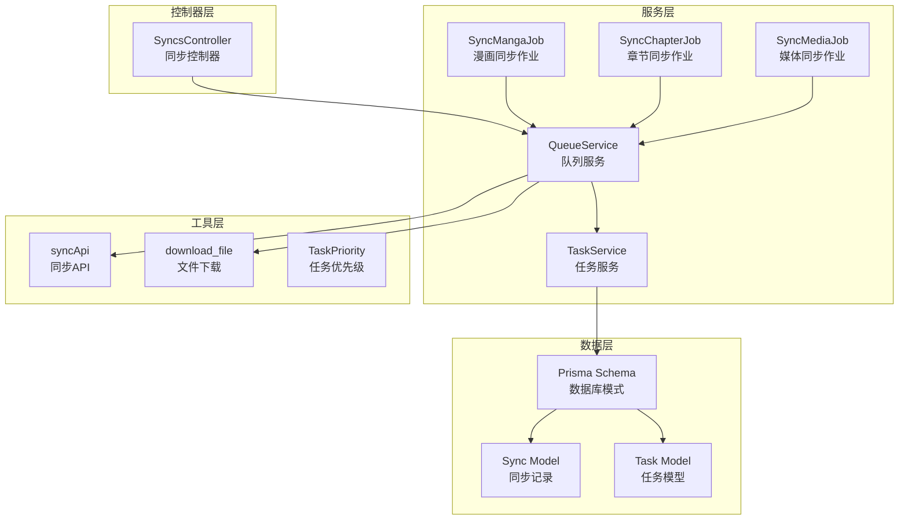
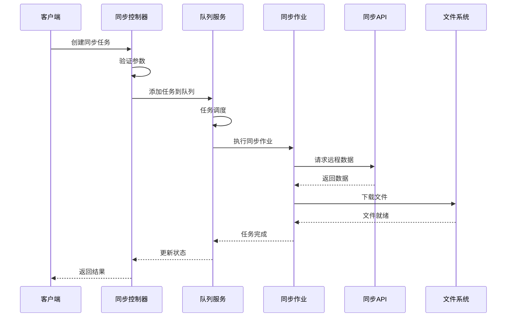
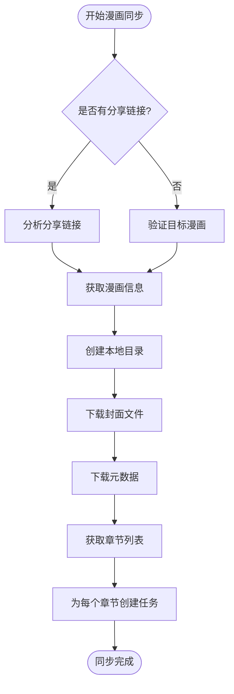
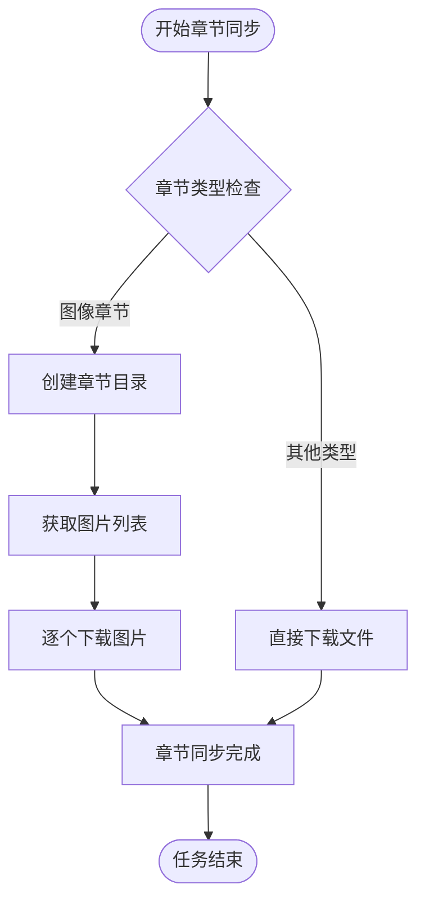
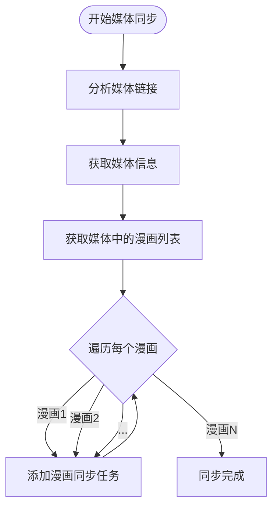
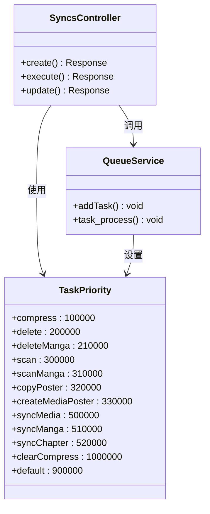
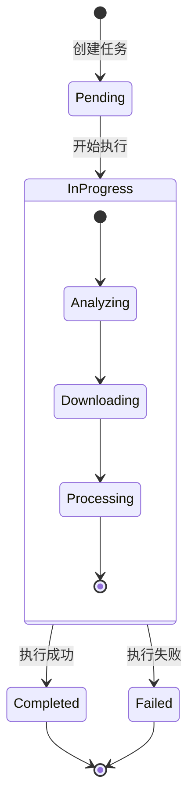
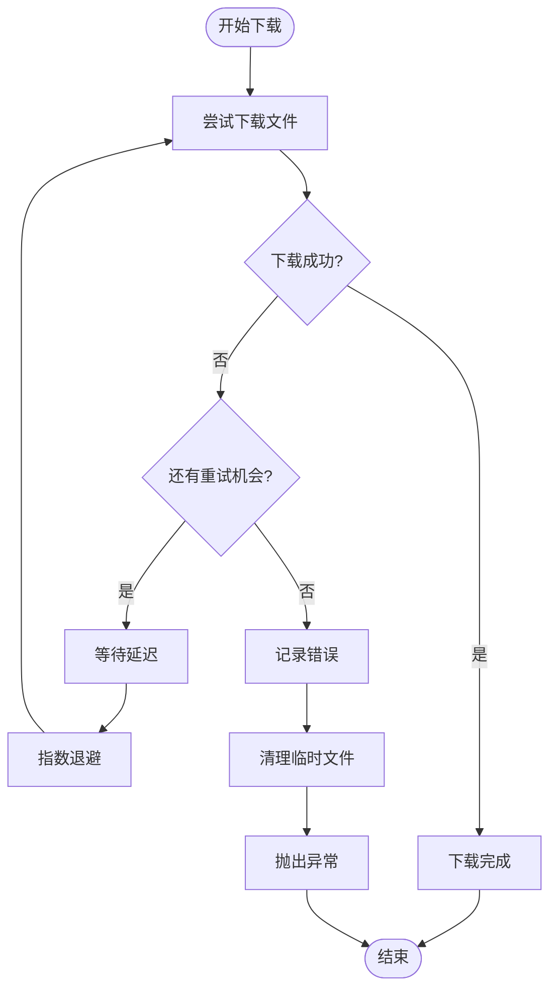
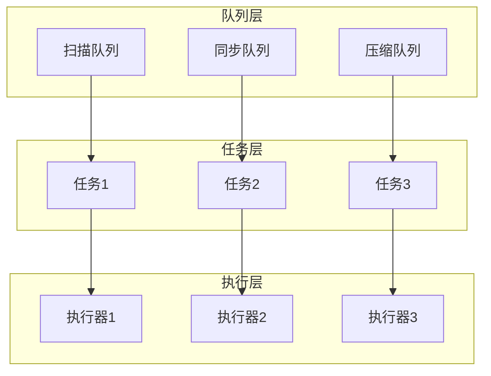
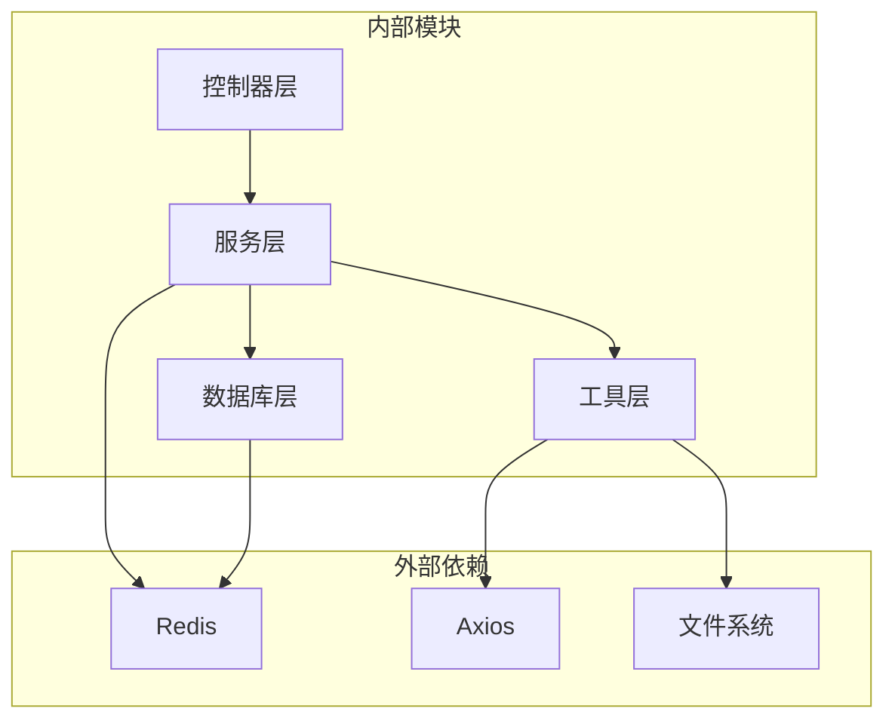

# 数据同步机制

<cite>
**本文档引用的文件**
- [syncs_controller.ts](file://app/controllers/syncs_controller.ts)
- [sync_manga_job.ts](file://app/services/sync_manga_job.ts)
- [sync_chapter_job.ts](file://app/services/sync_chapter_job.ts)
- [sync_media_job.ts](file://app/services/sync_media_job.ts)
- [queue_service.ts](file://app/services/queue_service.ts)
- [task_service.ts](file://app/services/task_service.ts)
- [api.ts](file://app/utils/api.ts)
- [index.ts](file://app/type/index.ts)
- [index.ts](file://app/utils/index.ts)
- [schema.prisma](file://prisma/sqlite/schema.prisma)
</cite>

## 目录
1. [简介](#简介)
2. [项目结构](#项目结构)
3. [核心组件](#核心组件)
4. [架构概览](#架构概览)
5. [详细组件分析](#详细组件分析)
6. [依赖关系分析](#依赖关系分析)
7. [性能考虑](#性能考虑)
8. [故障排除指南](#故障排除指南)
9. [结论](#结论)

## 简介

SManga Adonis的数据同步机制是一个基于Redis队列的任务管理系统，专门用于处理漫画数据的同步操作。该系统支持多种同步类型，包括漫画同步、章节同步和媒体库同步，具有完善的任务调度、优先级管理和错误恢复机制。

系统采用分层架构设计，通过控制器接收用户请求，服务层处理具体的同步逻辑，队列服务管理任务的调度和执行，工具层提供底层的API调用和文件操作功能。

## 项目结构

SManga Adonis的数据同步相关文件主要分布在以下目录结构中：



**图表来源**
- [syncs_controller.ts:1-193](file://app/controllers/syncs_controller.ts#L1-L193)
- [queue_service.ts:1-267](file://app/services/queue_service.ts#L1-L267)
- [schema.prisma:423-437](file://prisma/sqlite/schema.prisma#L423-L437)

**章节来源**
- [syncs_controller.ts:1-193](file://app/controllers/syncs_controller.ts#L1-L193)
- [queue_service.ts:1-267](file://app/services/queue_service.ts#L1-L267)
- [schema.prisma:423-437](file://prisma/sqlite/schema.prisma#L423-L437)

## 核心组件

### 同步控制器 (SyncsController)

同步控制器是系统的入口点，负责处理用户发起的同步请求。它提供了完整的CRUD操作，包括同步任务的创建、查询、更新、执行和删除。

主要功能特性：
- **同步任务管理**：支持创建新的同步任务、查询现有任务、更新任务配置、执行任务和删除任务
- **参数验证**：对接收路径进行存在性检查和权限验证
- **任务调度**：根据同步类型自动选择相应的同步作业
- **响应处理**：统一的响应格式，包含状态码、消息和数据

### 同步作业 (SyncMangaJob, SyncChapterJob, SyncMediaJob)

同步作业是实际执行同步逻辑的核心组件，每个作业都针对特定的同步场景进行了优化。

#### SyncMangaJob (漫画同步作业)
- **目标识别**：通过分享链接分析目标漫画信息
- **目录结构**：根据漫画类型创建相应的本地目录结构
- **文件下载**：下载漫画封面和元数据文件
- **章节管理**：获取所有章节信息并为每个章节创建同步任务

#### SyncChapterJob (章节同步作业)
- **章节处理**：支持图像章节和非图像章节的不同处理方式
- **文件组织**：按章节名称创建独立的文件夹结构
- **内容下载**：下载章节内的所有图片文件

#### SyncMediaJob (媒体同步作业)
- **媒体识别**：分析媒体库中的所有漫画
- **批量处理**：为媒体库中的每个漫画创建同步任务
- **链式调用**：自动触发漫画级别的同步流程

### 队列服务 (QueueService)

队列服务是整个同步系统的核心调度器，基于Bull Redis队列实现。

主要特性：
- **多队列支持**：支持扫描队列、同步队列和压缩队列
- **优先级调度**：根据任务优先级进行智能调度
- **重试机制**：指数退避重试，避免重试风暴
- **并发控制**：可配置的最大并发数限制

**章节来源**
- [syncs_controller.ts:34-108](file://app/controllers/syncs_controller.ts#L34-L108)
- [sync_manga_job.ts:10-103](file://app/services/sync_manga_job.ts#L10-L103)
- [sync_chapter_job.ts:8-65](file://app/services/sync_chapter_job.ts#L8-L65)
- [sync_media_job.ts:5-44](file://app/services/sync_media_job.ts#L5-L44)
- [queue_service.ts:17-267](file://app/services/queue_service.ts#L17-L267)

## 架构概览

SManga Adonis的数据同步系统采用分层架构，实现了清晰的关注点分离：



**图表来源**
- [syncs_controller.ts:34-108](file://app/controllers/syncs_controller.ts#L34-L108)
- [queue_service.ts:175-264](file://app/services/queue_service.ts#L175-L264)
- [api.ts:52-73](file://app/utils/api.ts#L52-L73)

系统架构的关键特点：
- **异步处理**：所有同步操作都是异步执行，不阻塞主线程
- **任务隔离**：每个同步作业独立运行，互不影响
- **错误隔离**：单个任务失败不会影响其他任务
- **状态追踪**：完整的任务生命周期管理

## 详细组件分析

### 同步类型和策略

系统支持三种主要的同步类型，每种都有特定的处理策略：

#### 漫画同步策略


**图表来源**
- [sync_manga_job.ts:25-102](file://app/services/sync_manga_job.ts#L25-L102)

#### 章节同步策略


**图表来源**
- [sync_chapter_job.ts:20-65](file://app/services/sync_chapter_job.ts#L20-L65)

#### 媒体同步策略


**图表来源**
- [sync_media_job.ts:17-43](file://app/services/sync_media_job.ts#L17-L43)

### 同步参数配置

系统通过多种方式支持参数配置：

#### 任务优先级配置


**图表来源**
- [index.ts:3-16](file://app/type/index.ts#L3-L16)
- [syncs_controller.ts:90-104](file://app/controllers/syncs_controller.ts#L90-L104)
- [queue_service.ts:241-262](file://app/services/queue_service.ts#L241-L262)

#### 队列配置参数
系统支持通过配置文件进行队列参数的动态调整：

| 参数 | 类型 | 默认值 | 描述 |
|------|------|--------|------|
| concurrency | number | 1 | 最大并发任务数 |
| attempts | number | 3 | 最大重试次数 |
| timeout | number | 120000 | 超时时间（毫秒） |

### 同步状态跟踪和监控

系统提供了完整的任务状态跟踪机制：

#### 任务状态管理


#### 数据库状态表
系统使用三个主要表来跟踪任务状态：

1. **task** - 待处理任务
2. **taskSuccess** - 成功任务历史
3. **taskFailed** - 失败任务历史

**章节来源**
- [task_service.ts:25-171](file://app/services/task_service.ts#L25-L171)
- [schema.prisma:311-354](file://prisma/sqlite/schema.prisma#L311-L354)

### 错误恢复机制

系统实现了多层次的错误恢复机制：

#### 文件下载重试


**图表来源**
- [api.ts:125-176](file://app/utils/api.ts#L125-L176)

#### 任务重试策略
- **指数退避**：初始延迟10秒，每次重试翻倍
- **最大延迟**：2分钟，防止无限增长
- **随机抖动**：避免重试风暴
- **最大重试次数**：3次

### 并发控制和资源分配

系统采用了多层并发控制策略：

#### 任务队列并发控制


**图表来源**
- [queue_service.ts:34-101](file://app/services/queue_service.ts#L34-L101)

#### 资源分配策略
- **内存管理**：使用流式下载避免内存溢出
- **磁盘空间**：检查可用空间后再开始下载
- **网络连接**：超时控制和连接池管理
- **CPU使用**：异步I/O操作，避免阻塞

## 依赖关系分析

系统各组件之间的依赖关系如下：



**图表来源**
- [queue_service.ts:17-39](file://app/services/queue_service.ts#L17-L39)
- [api.ts:1-73](file://app/utils/api.ts#L1-L73)

### 关键依赖关系

1. **Redis队列**：作为任务调度的核心基础设施
2. **Axios**：处理HTTP请求和响应
3. **文件系统**：本地文件操作和存储
4. **Prisma**：数据库ORM和模式定义

**章节来源**
- [queue_service.ts:17-39](file://app/services/queue_service.ts#L17-L39)
- [api.ts:1-73](file://app/utils/api.ts#L1-L73)
- [schema.prisma:1-447](file://prisma/sqlite/schema.prisma#L1-L447)

## 性能考虑

### 同步性能优化

系统在多个层面实现了性能优化：

#### 网络优化
- **流式下载**：使用HTTP流避免内存占用
- **超时控制**：合理的超时设置防止长时间阻塞
- **连接复用**：Axios实例复用减少连接开销

#### 存储优化
- **目录结构**：合理的文件组织结构提高访问效率
- **缓存策略**：重复文件检测避免重复下载
- **磁盘空间监控**：预检查可用空间防止IO错误

#### 并发优化
- **队列分区**：不同类型的任务分离处理
- **优先级调度**：重要任务优先执行
- **资源限制**：防止系统资源耗尽

### 监控和诊断

系统提供了全面的监控能力：

#### 日志记录
- **任务状态**：完整记录任务生命周期
- **错误信息**：详细的错误堆栈和上下文
- **性能指标**：执行时间和资源使用情况

#### 健康检查
- **队列状态**：等待和执行中的任务统计
- **系统资源**：内存、磁盘、网络使用情况
- **任务成功率**：历史成功率统计

## 故障排除指南

### 常见问题和解决方案

#### 同步任务无法启动
**症状**：任务创建成功但不执行
**可能原因**：
1. Redis服务未启动
2. 队列配置错误
3. 任务优先级冲突

**解决步骤**：
1. 检查Redis连接状态
2. 验证队列配置参数
3. 查看任务优先级设置

#### 文件下载失败
**症状**：章节或图片下载中断
**可能原因**：
1. 网络连接不稳定
2. 远程服务器限制
3. 本地磁盘空间不足

**解决步骤**：
1. 检查网络连接质量
2. 验证远程服务器状态
3. 清理磁盘空间

#### 同步进度停滞
**症状**：任务长时间无进展
**可能原因**：
1. 高优先级任务阻塞
2. 资源竞争
3. 死锁情况

**解决步骤**：
1. 检查任务队列状态
2. 分析资源使用情况
3. 调整任务优先级

### 调试工具和方法

#### 任务状态检查
```typescript
// 检查待处理任务
const pendingTasks = await prisma.task.findMany({
  where: { status: 'pending' }
});

// 检查执行中任务
const inProgressTasks = await prisma.task.findMany({
  where: { status: 'in-progress' }
});
```

#### 队列状态监控
```typescript
// 获取队列统计信息
const waitingJobs = await scanQueue.getWaiting();
const activeJobs = await scanQueue.getActive();
const completedJobs = await scanQueue.getCompleted();
const failedJobs = await scanQueue.getFailed();
```

**章节来源**
- [task_service.ts:36-84](file://app/services/task_service.ts#L36-L84)
- [queue_service.ts:143-165](file://app/services/queue_service.ts#L143-L165)

## 结论

SManga Adonis的数据同步机制是一个设计精良、功能完备的任务管理系统。它通过分层架构实现了清晰的关注点分离，通过Redis队列提供了可靠的异步处理能力，通过完善的错误恢复机制确保了系统的稳定性。

系统的主要优势包括：
- **模块化设计**：各组件职责明确，易于维护和扩展
- **异步处理**：不阻塞主线程，提升用户体验
- **容错性强**：多重错误恢复机制保障系统稳定
- **可监控性**：完整的状态跟踪和日志记录
- **性能优化**：多层优化策略确保高效运行

未来可以考虑的改进方向：
- 增加任务依赖关系管理
- 实现更精细的资源配额控制
- 添加实时状态推送功能
- 优化大数据量场景的处理能力