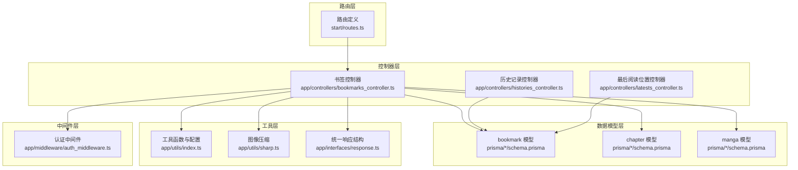
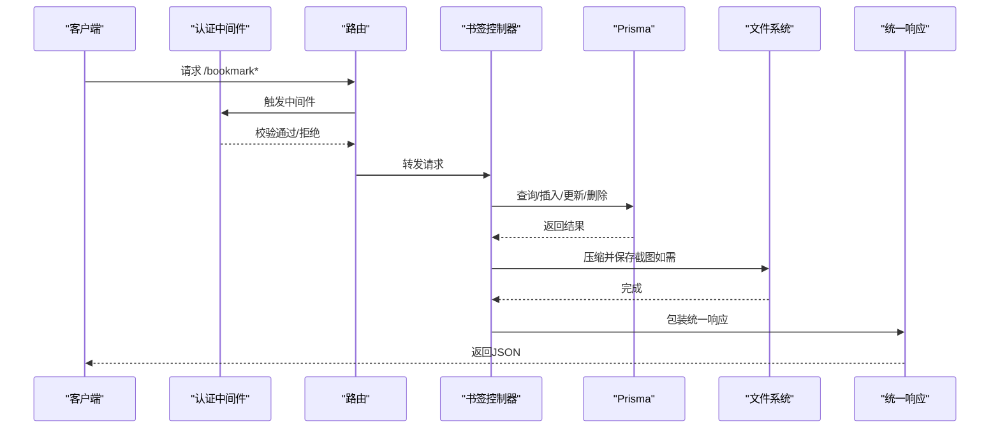
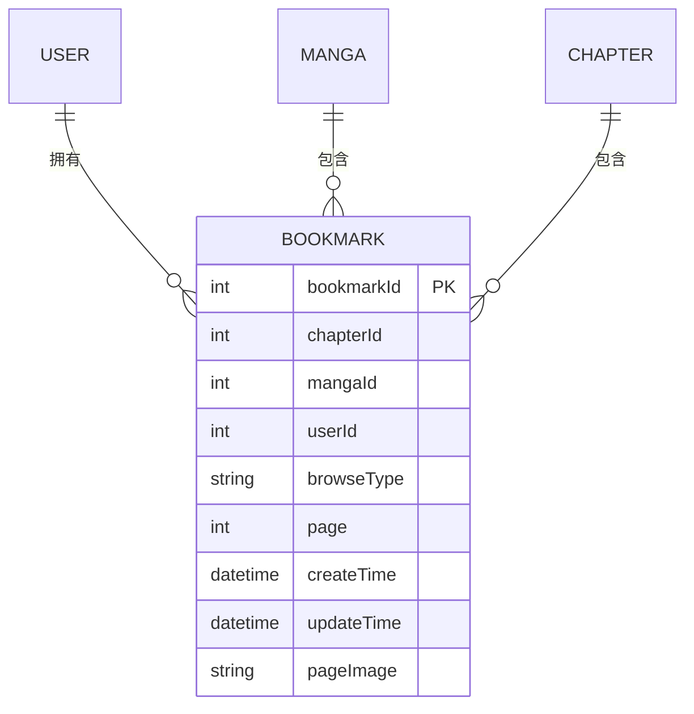
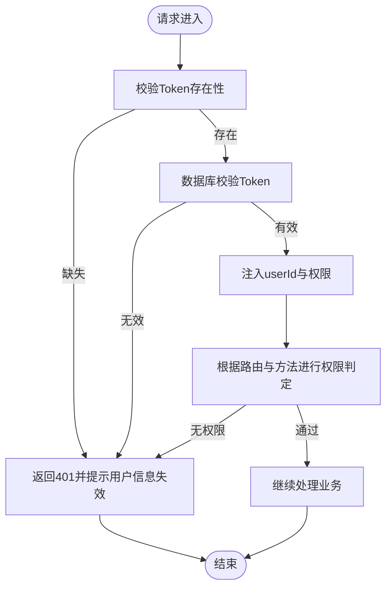
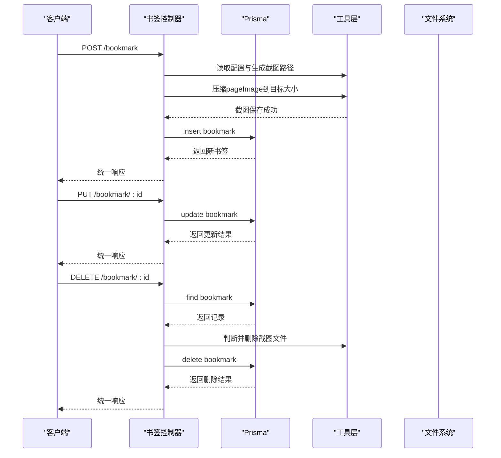
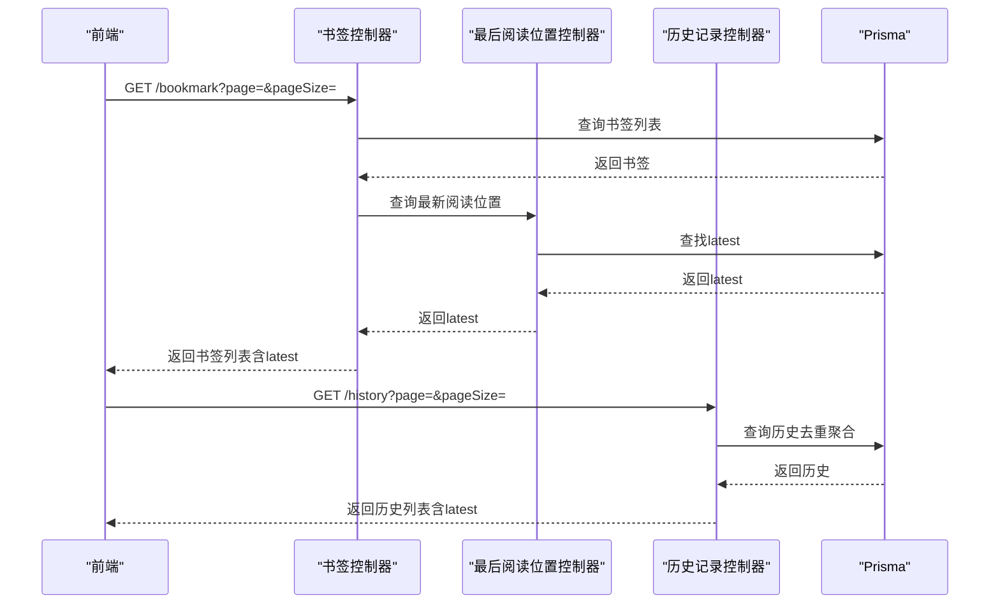
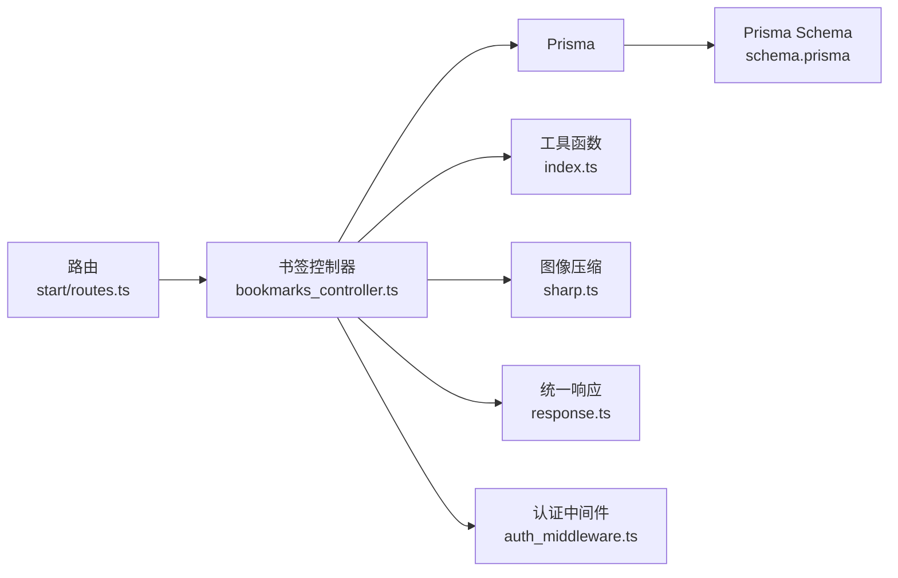

# 书签功能

<cite>
**本文引用的文件**
- [bookmarks_controller.ts](file://app/controllers/bookmarks_controller.ts)
- [routes.ts](file://start/routes.ts)
- [schema.prisma（SQLite）](file://prisma/sqlite/schema.prisma)
- [schema.prisma（MySQL）](file://prisma/mysql/schema.prisma)
- [schema.prisma（PostgreSQL）](file://prisma/pgsql/schema.prisma)
- [index.ts（工具函数与配置）](file://app/utils/index.ts)
- [sharp.ts（图像压缩）](file://app/utils/sharp.ts)
- [response.ts（响应结构）](file://app/interfaces/response.ts)
- [auth_middleware.ts（认证中间件）](file://app/middleware/auth_middleware.ts)
- [histories_controller.ts（历史记录控制器）](file://app/controllers/histories_controller.ts)
- [latests_controller.ts（最后阅读位置控制器）](file://app/controllers/latests_controller.ts)
</cite>

## 目录
1. [简介](#简介)
2. [项目结构](#项目结构)
3. [核心组件](#核心组件)
4. [架构总览](#架构总览)
5. [详细组件分析](#详细组件分析)
6. [依赖关系分析](#依赖关系分析)
7. [性能考量](#性能考量)
8. [故障排查指南](#故障排查指南)
9. [结论](#结论)
10. [附录](#附录)

## 简介
本文件系统化梳理 SManga Adonis 的“书签”功能，覆盖数据模型设计、存储机制、权限控制、增删改查、自动保存与恢复、分组与导出导入、跨设备同步、安全性与性能优化等主题。读者可据此快速理解并扩展书签能力。

## 项目结构
书签功能由以下关键部分组成：
- 路由层：定义书签相关接口
- 控制器层：实现查询、创建、更新、删除、批量删除
- 数据模型层：Prisma 模型与唯一约束
- 工具层：图像压缩、配置读取、文件路径管理
- 中间件层：认证与权限校验
- 关联模块：历史记录与最后阅读位置用于恢复与展示

**图表来源**
- [routes.ts:77-83](file://start/routes.ts#L77-L83)
- [bookmarks_controller.ts:1-201](file://app/controllers/bookmarks_controller.ts#L1-L201)
- [schema.prisma（SQLite）:11-26](file://prisma/sqlite/schema.prisma#L11-L26)
- [schema.prisma（MySQL）:11-26](file://prisma/mysql/schema.prisma#L11-L26)
- [schema.prisma（PostgreSQL）:11-26](file://prisma/pgsql/schema.prisma#L11-L26)
- [index.ts（工具函数与配置）:54-105](file://app/utils/index.ts#L54-L105)
- [sharp.ts:12-89](file://app/utils/sharp.ts#L12-L89)
- [response.ts:18-63](file://app/interfaces/response.ts#L18-L63)
- [auth_middleware.ts:23-85](file://app/middleware/auth_middleware.ts#L23-L85)
- [histories_controller.ts:1-270](file://app/controllers/histories_controller.ts#L1-L270)
- [latests_controller.ts:1-179](file://app/controllers/latests_controller.ts#L1-L179)

**章节来源**
- [routes.ts:77-83](file://start/routes.ts#L77-L83)
- [bookmarks_controller.ts:1-201](file://app/controllers/bookmarks_controller.ts#L1-L201)
- [schema.prisma（SQLite）:11-26](file://prisma/sqlite/schema.prisma#L11-L26)
- [schema.prisma（MySQL）:11-26](file://prisma/mysql/schema.prisma#L11-L26)
- [schema.prisma（PostgreSQL）:11-26](file://prisma/pgsql/schema.prisma#L11-L26)
- [index.ts（工具函数与配置）:54-105](file://app/utils/index.ts#L54-L105)
- [sharp.ts:12-89](file://app/utils/sharp.ts#L12-L89)
- [response.ts:18-63](file://app/interfaces/response.ts#L18-L63)
- [auth_middleware.ts:23-85](file://app/middleware/auth_middleware.ts#L23-L85)
- [histories_controller.ts:1-270](file://app/controllers/histories_controller.ts#L1-L270)
- [latests_controller.ts:1-179](file://app/controllers/latests_controller.ts#L1-L179)

## 核心组件
- 书签控制器：提供列表、详情、创建、更新、删除、批量删除接口；支持分页与关联章节/漫画名称返回；自动压缩并落盘书签截图。
- 数据模型：bookmark 表含章节、漫画、用户外键，以及浏览类型、页码、截图路径等字段；章节+页码唯一约束防止重复。
- 工具函数：统一响应结构、路径与配置读取、图像压缩、文件删除。
- 认证中间件：基于 Token 校验与角色/模块权限限制，确保用户身份与操作范围。
- 关联模块：历史记录与最后阅读位置用于“从书签恢复阅读进度”的体验增强。

**章节来源**
- [bookmarks_controller.ts:7-199](file://app/controllers/bookmarks_controller.ts#L7-L199)
- [schema.prisma（SQLite）:11-26](file://prisma/sqlite/schema.prisma#L11-L26)
- [response.ts:18-63](file://app/interfaces/response.ts#L18-L63)
- [index.ts（工具函数与配置）:54-105](file://app/utils/index.ts#L54-L105)
- [sharp.ts:12-89](file://app/utils/sharp.ts#L12-L89)
- [auth_middleware.ts:23-85](file://app/middleware/auth_middleware.ts#L23-L85)
- [histories_controller.ts:1-270](file://app/controllers/histories_controller.ts#L1-L270)
- [latests_controller.ts:1-179](file://app/controllers/latests_controller.ts#L1-L179)

## 架构总览
书签功能遵循“路由 → 中间件 → 控制器 → 数据访问 → 响应”的标准流程。控制器通过 Prisma 访问数据库，结合工具层完成图像压缩与文件落盘；中间件负责鉴权与权限控制；关联模块提供阅读进度恢复与展示。

**图表来源**
- [routes.ts:77-83](file://start/routes.ts#L77-L83)
- [auth_middleware.ts:23-85](file://app/middleware/auth_middleware.ts#L23-L85)
- [bookmarks_controller.ts:105-139](file://app/controllers/bookmarks_controller.ts#L105-L139)
- [index.ts（工具函数与配置）:54-105](file://app/utils/index.ts#L54-L105)
- [sharp.ts:12-89](file://app/utils/sharp.ts#L12-L89)
- [response.ts:18-63](file://app/interfaces/response.ts#L18-L63)

## 详细组件分析

### 数据模型与存储机制
- 模型关系
  - bookmark ←→ chapter（多对一）
  - bookmark ←→ manga（多对一）
  - bookmark ←→ user（多对一）
- 关键字段
  - chapterId、mangaId、userId：关联与权限边界
  - browseType：阅读方式（如 flow）
  - page：页码（配合章节形成唯一索引）
  - pageImage：书签截图路径（按章节命名）
- 唯一约束
  - 章节+页码唯一，避免同一章节重复书签
- 存储位置
  - 截图文件位于平台特定的 data/bookmark 目录，随配置文件读取决定

**图表来源**
- [schema.prisma（SQLite）:11-26](file://prisma/sqlite/schema.prisma#L11-L26)
- [schema.prisma（MySQL）:11-26](file://prisma/mysql/schema.prisma#L11-L26)
- [schema.prisma（PostgreSQL）:11-26](file://prisma/pgsql/schema.prisma#L11-L26)

**章节来源**
- [schema.prisma（SQLite）:11-26](file://prisma/sqlite/schema.prisma#L11-L26)
- [schema.prisma（MySQL）:11-26](file://prisma/mysql/schema.prisma#L11-L26)
- [schema.prisma（PostgreSQL）:11-26](file://prisma/pgsql/schema.prisma#L11-L26)

### 权限控制与安全
- 认证中间件
  - 通过请求头 token 校验用户有效性
  - 对特定模块与方法进行权限限制（如 DELETE）
  - 注入 userId 与用户权限信息至请求上下文
- 控制器侧
  - 所有查询/操作均以 userId 作为过滤条件，确保数据隔离
  - 删除书签时，若截图文件属于受控前缀则执行删除，避免误删

**图表来源**
- [auth_middleware.ts:23-85](file://app/middleware/auth_middleware.ts#L23-L85)
- [bookmarks_controller.ts:8-16](file://app/controllers/bookmarks_controller.ts#L8-L16)

**章节来源**
- [auth_middleware.ts:23-85](file://app/middleware/auth_middleware.ts#L23-L85)
- [bookmarks_controller.ts:8-16](file://app/controllers/bookmarks_controller.ts#L8-L16)

### 创建、更新、删除与查询
- 创建
  - 参数：chapterId、mangaId、mediaId、browseType、page、pageImage
  - 若提供 pageImage，先压缩到指定大小并保存至 data/bookmark 目录
  - 插入数据库并返回统一响应
- 更新
  - 通过 bookmarkId 更新指定字段
- 删除
  - 单条删除：若截图文件匹配受控前缀则删除文件
  - 批量删除：先收集并删除截图文件，再批量删除数据库记录
- 查询
  - 列表：支持分页与不分页两种模式；不分页直接返回；分页时同时返回总数
  - 关联字段：分页模式下包含章节与漫画名称，便于前端展示
  - 详情：按 bookmarkId 查询

**图表来源**
- [bookmarks_controller.ts:105-139](file://app/controllers/bookmarks_controller.ts#L105-L139)
- [bookmarks_controller.ts:141-151](file://app/controllers/bookmarks_controller.ts#L141-L151)
- [bookmarks_controller.ts:153-168](file://app/controllers/bookmarks_controller.ts#L153-L168)
- [bookmarks_controller.ts:170-199](file://app/controllers/bookmarks_controller.ts#L170-L199)
- [index.ts（工具函数与配置）:54-105](file://app/utils/index.ts#L54-L105)
- [sharp.ts:12-89](file://app/utils/sharp.ts#L12-L89)

**章节来源**
- [bookmarks_controller.ts:105-139](file://app/controllers/bookmarks_controller.ts#L105-L139)
- [bookmarks_controller.ts:141-151](file://app/controllers/bookmarks_controller.ts#L141-L151)
- [bookmarks_controller.ts:153-168](file://app/controllers/bookmarks_controller.ts#L153-L168)
- [bookmarks_controller.ts:170-199](file://app/controllers/bookmarks_controller.ts#L170-L199)
- [index.ts（工具函数与配置）:54-105](file://app/utils/index.ts#L54-L105)
- [sharp.ts:12-89](file://app/utils/sharp.ts#L12-L89)

### 自动保存与恢复机制
- 自动保存
  - 在阅读过程中，可通过历史记录或最后阅读位置接口持续更新阅读进度
  - 书签可作为“断点式保存”，记录当前章节与页码
- 恢复机制
  - 列表分页时，控制器会查询对应章节的“最后阅读位置”，并将页码回填到返回数据中，便于前端直接定位
  - 历史记录与最后阅读位置控制器均提供类似逻辑，保证“从书签恢复阅读”的一致性体验

**图表来源**
- [bookmarks_controller.ts:41-95](file://app/controllers/bookmarks_controller.ts#L41-L95)
- [latests_controller.ts:94-134](file://app/controllers/latests_controller.ts#L94-L134)
- [histories_controller.ts:8-36](file://app/controllers/histories_controller.ts#L8-L36)

**章节来源**
- [bookmarks_controller.ts:41-95](file://app/controllers/bookmarks_controller.ts#L41-L95)
- [latests_controller.ts:94-134](file://app/controllers/latests_controller.ts#L94-L134)
- [histories_controller.ts:8-36](file://app/controllers/histories_controller.ts#L8-L36)

### 书签分组管理、导出导入与跨设备同步
- 分组管理
  - 当前模型未内置“分组”字段；可在现有模型上扩展分组实体或通过标签/收藏模块间接实现分组效果
- 导出导入
  - 可通过书签列表接口导出书签元数据（章节、漫画、页码、浏览方式等），结合截图文件进行打包
  - 导入时按章节+页码唯一约束进行幂等处理，避免重复
- 跨设备同步
  - 书签数据本身具备用户维度隔离；建议在同步模块中以用户+章节+页码为核心键进行去重与合并
  - 建议同步截图文件时采用稳定的命名策略（如章节ID命名），并考虑文件大小与网络传输成本

[本节为概念性说明，不直接分析具体代码文件]

### 安全性保障
- 认证与授权
  - 通过中间件强制校验 token 并限制敏感操作
  - 控制器侧以 userId 过滤数据，避免越权访问
- 文件安全
  - 删除书签时仅删除受控前缀的截图文件，降低误删风险
- 输入校验
  - 建议在控制器层增加参数校验与白名单字段更新，减少 SQL 注入与非法字段写入风险

**章节来源**
- [auth_middleware.ts:23-85](file://app/middleware/auth_middleware.ts#L23-L85)
- [bookmarks_controller.ts:8-16](file://app/controllers/bookmarks_controller.ts#L8-L16)
- [bookmarks_controller.ts:153-168](file://app/controllers/bookmarks_controller.ts#L153-L168)

## 依赖关系分析
- 控制器依赖
  - 书签控制器依赖 Prisma、工具函数、图像压缩、统一响应结构与认证中间件
- 数据模型依赖
  - 书签模型依赖章节、漫画、用户模型，形成清晰的外键关系
- 路由依赖
  - 路由文件集中注册书签相关接口，便于统一管理

**图表来源**
- [routes.ts:77-83](file://start/routes.ts#L77-L83)
- [bookmarks_controller.ts:1-201](file://app/controllers/bookmarks_controller.ts#L1-L201)
- [index.ts（工具函数与配置）:54-105](file://app/utils/index.ts#L54-L105)
- [sharp.ts:12-89](file://app/utils/sharp.ts#L12-L89)
- [response.ts:18-63](file://app/interfaces/response.ts#L18-L63)
- [auth_middleware.ts:23-85](file://app/middleware/auth_middleware.ts#L23-L85)
- [schema.prisma（SQLite）:11-26](file://prisma/sqlite/schema.prisma#L11-L26)

**章节来源**
- [routes.ts:77-83](file://start/routes.ts#L77-L83)
- [bookmarks_controller.ts:1-201](file://app/controllers/bookmarks_controller.ts#L1-L201)
- [index.ts（工具函数与配置）:54-105](file://app/utils/index.ts#L54-L105)
- [sharp.ts:12-89](file://app/utils/sharp.ts#L12-L89)
- [response.ts:18-63](file://app/interfaces/response.ts#L18-L63)
- [auth_middleware.ts:23-85](file://app/middleware/auth_middleware.ts#L23-L85)
- [schema.prisma（SQLite）:11-26](file://prisma/sqlite/schema.prisma#L11-L26)

## 性能考量
- 查询优化
  - 分页查询使用并发统计总数，减少往返次数
  - 关联查询仅选择必要字段，避免 N+1 查询
- 写入优化
  - 批量删除时先收集文件再一次性删除，减少 IO 操作
- 图像处理
  - 压缩算法自适应质量与格式，优先 JPEG/PNG/WebP，避免不支持格式
  - 首次即小于阈值时直接复制，避免多余编码
- 存储与缓存
  - 截图文件按章节命名，便于清理与重建
  - 建议对常用书签列表做内存缓存或数据库索引优化

**章节来源**
- [bookmarks_controller.ts:41-95](file://app/controllers/bookmarks_controller.ts#L41-L95)
- [bookmarks_controller.ts:170-199](file://app/controllers/bookmarks_controller.ts#L170-L199)
- [sharp.ts:12-89](file://app/utils/sharp.ts#L12-L89)

## 故障排查指南
- 401 未授权
  - 检查请求头 token 是否存在且有效
  - 确认用户角色与操作权限
- 书签不存在
  - 删除接口在找不到记录时返回明确提示
- 截图未删除
  - 确认文件路径前缀是否符合受控规则
- 图像压缩失败
  - 检查输入格式是否受支持
  - 确认磁盘空间与目标路径权限
- 唯一约束冲突
  - 章节+页码唯一，避免重复书签

**章节来源**
- [auth_middleware.ts:32-54](file://app/middleware/auth_middleware.ts#L32-L54)
- [bookmarks_controller.ts:153-158](file://app/controllers/bookmarks_controller.ts#L153-L158)
- [bookmarks_controller.ts:160-163](file://app/controllers/bookmarks_controller.ts#L160-L163)
- [sharp.ts:85-88](file://app/utils/sharp.ts#L85-L88)
- [schema.prisma（SQLite）:25](file://prisma/sqlite/schema.prisma#L25)

## 结论
书签功能在数据模型、权限控制、文件处理与接口设计方面已具备良好基础。建议后续围绕“分组管理、导出导入、跨设备同步”完善高级特性，并持续优化查询与写入性能，提升用户体验与系统稳定性。

## 附录
- 接口清单（基于路由定义）
  - GET /bookmark：列表（支持分页与章节过滤）
  - GET /bookmark/:bookmarkId：详情
  - POST /bookmark：创建（可选传入截图）
  - PUT /bookmark/:bookmarkId：更新
  - DELETE /bookmark/:bookmarkId：删除
  - DELETE /bookmark/:bookmarkIds/batch：批量删除

**章节来源**
- [routes.ts:77-83](file://start/routes.ts#L77-L83)