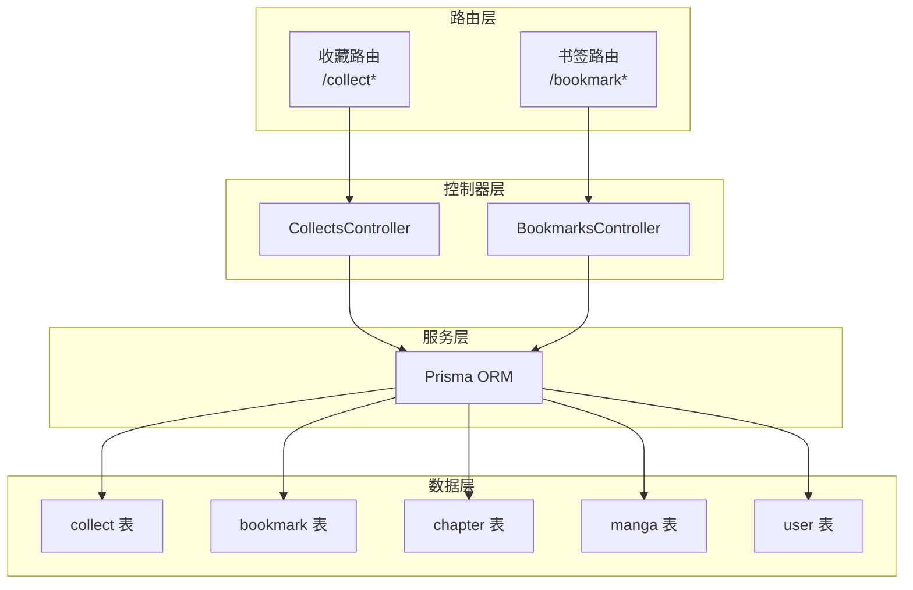
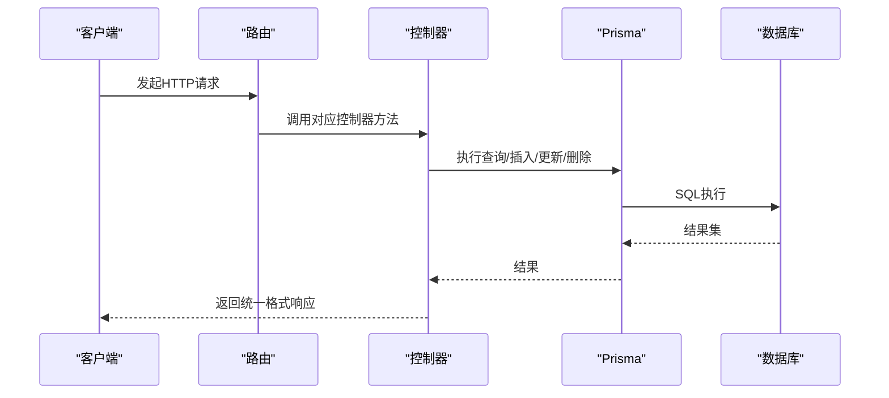
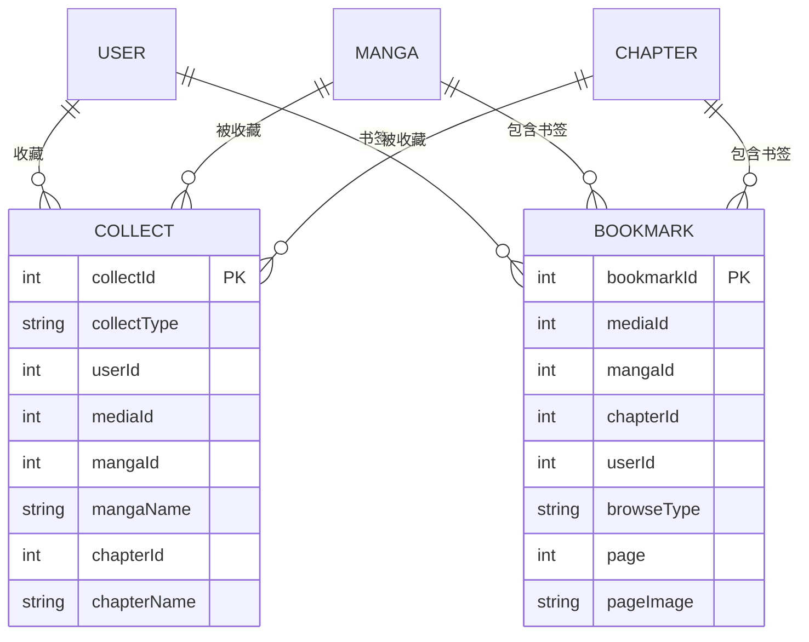
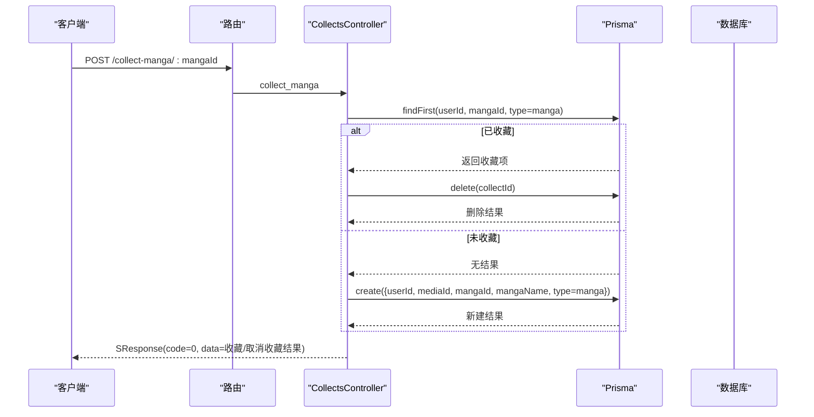
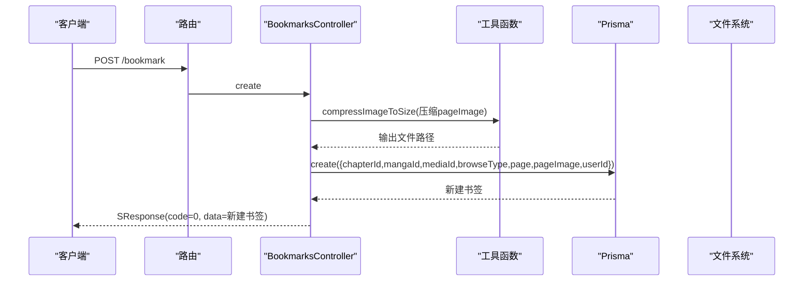
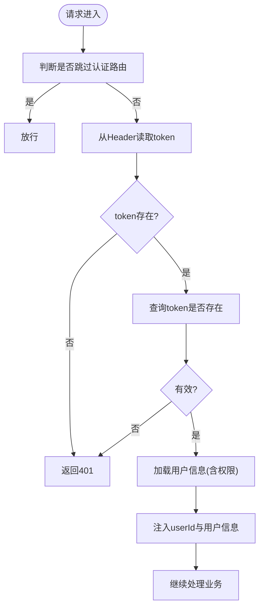
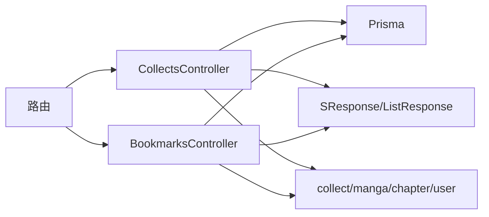

# 收藏管理

<cite>
**本文引用的文件**
- [routes.ts](file://start/routes.ts)
- [bookmarks_controller.ts](file://app/controllers/bookmarks_controller.ts)
- [collects_controller.ts](file://app/controllers/collects_controller.ts)
- [response.ts](file://app/interfaces/response.ts)
- [index.ts](file://app/utils/index.ts)
- [auth_middleware.ts](file://app/middleware/auth_middleware.ts)
- [latests_controller.ts](file://app/controllers/latests_controller.ts)
- [schema.prisma](file://prisma/sqlite/schema.prisma)
- [schema.prisma](file://prisma/mysql/schema.prisma)
- [schema.prisma](file://prisma/pgsql/schema.prisma)
- [migration.sql](file://prisma/mysql/migrations/20240817084208_init/migration.sql)
- [migration.sql](file://prisma/pgsql/migrations/20240817084740_init/migration.sql)
- [migration.sql](file://prisma/sqlite/migrations/20240817081809_init/migration.sql)
</cite>

## 目录
1. [简介](#简介)
2. [项目结构](#项目结构)
3. [核心组件](#核心组件)
4. [架构总览](#架构总览)
5. [详细组件分析](#详细组件分析)
6. [依赖分析](#依赖分析)
7. [性能考虑](#性能考虑)
8. [故障排查指南](#故障排查指南)
9. [结论](#结论)

## 简介
本文件系统化梳理 SManga Adonis 的收藏管理能力，覆盖以下方面：
- 数据模型设计：收藏类型（漫画收藏、章节收藏）、用户关联关系、唯一约束与外键关系
- 收藏生命周期：增删改查、批量删除、收藏状态检查
- 接口规范：请求方法、参数、返回值格式
- 高级特性：权限控制、重复收藏检测、收藏分类（按对象类型）
- 数据一致性与性能优化、错误处理机制

## 项目结构
收藏相关功能由两条主线构成：
- 收藏（collect）：对漫画或章节进行收藏/取消收藏，支持分页查询收藏列表
- 书签（bookmark）：记录用户在某章节的阅读进度与页面截图，支持分页查询、详情、创建、更新、删除及批量删除

图表来源
- [routes.ts:64-84](file://start/routes.ts#L64-L84)
- [collects_controller.ts:1-281](file://app/controllers/collects_controller.ts#L1-L281)
- [bookmarks_controller.ts:1-201](file://app/controllers/bookmarks_controller.ts#L1-L201)
- [schema.prisma:58-74](file://prisma/mysql/schema.prisma#L58-L74)

章节来源
- [routes.ts:64-84](file://start/routes.ts#L64-L84)

## 核心组件
- 收藏控制器（CollectsController）
  - 提供收藏/取消收藏漫画、收藏/取消收藏章节的接口
  - 提供收藏列表查询（按漫画/章节两类）
  - 提供收藏状态检查接口
- 书签控制器（BookmarksController）
  - 提供书签列表查询（支持分页与非分页）
  - 提供书签详情、创建、更新、删除、批量删除
- 返回格式
  - 统一使用 SResponse/ListResponse 包裹响应，包含 code/message/data/list/count/status 字段

章节来源
- [collects_controller.ts:1-281](file://app/controllers/collects_controller.ts#L1-L281)
- [bookmarks_controller.ts:1-201](file://app/controllers/bookmarks_controller.ts#L1-L201)
- [response.ts:1-64](file://app/interfaces/response.ts#L1-L64)

## 架构总览
收藏与书签均通过 Prisma 访问数据库，遵循统一的路由-控制器-服务-数据模型模式。

图表来源
- [routes.ts:64-84](file://start/routes.ts#L64-L84)
- [collects_controller.ts:1-281](file://app/controllers/collects_controller.ts#L1-L281)
- [bookmarks_controller.ts:1-201](file://app/controllers/bookmarks_controller.ts#L1-L201)

## 详细组件分析

### 数据模型设计
- 收藏（collect）
  - 关键字段：collectId、collectType（默认 manga）、userId、mediaId、mangaId、mangaName、chapterId、chapterName
  - 唯一约束：(userId, collectType, mangaId, chapterId)，确保同一用户对同一漫画或章节不会重复收藏
  - 外键关系：关联 user、manga、chapter
- 书签（bookmark）
  - 关键字段：bookmarkId、mediaId、mangaId、chapterId、userId、browseType、page、pageImage
  - 唯一约束：(chapterId, page)，确保同一章节同一页仅有一个书签
  - 外键关系：关联 manga、chapter
- 索引与兼容性
  - MySQL/PGSQL：显式创建唯一索引
  - SQLite：通过 Prisma 定义唯一约束

图表来源
- [schema.prisma:58-74](file://prisma/mysql/schema.prisma#L58-L74)
- [schema.prisma:58-74](file://prisma/sqlite/schema.prisma#L58-L74)
- [schema.prisma:58-74](file://prisma/pgsql/schema.prisma#L58-L74)
- [migration.sql:1-16](file://prisma/mysql/migrations/20240817084208_init/migration.sql#L1-L16)
- [migration.sql:39-43](file://prisma/pgsql/migrations/20240817084740_init/migration.sql#L39-L43)
- [migration.sql:2-15](file://prisma/sqlite/migrations/20240817081809_init/migration.sql#L2-L15)

章节来源
- [schema.prisma:58-74](file://prisma/mysql/schema.prisma#L58-L74)
- [schema.prisma:58-74](file://prisma/sqlite/schema.prisma#L58-L74)
- [schema.prisma:58-74](file://prisma/pgsql/schema.prisma#L58-L74)
- [migration.sql:1-16](file://prisma/mysql/migrations/20240817084208_init/migration.sql#L1-L16)
- [migration.sql:39-43](file://prisma/pgsql/migrations/20240817084740_init/migration.sql#L39-L43)
- [migration.sql:2-15](file://prisma/sqlite/migrations/20240817081809_init/migration.sql#L2-L15)

### 收藏接口与流程
- 收藏/取消收藏漫画
  - 方法：POST /collect-manga/:mangaId
  - 逻辑：若存在相同 (userId, mangaId, collectType='manga') 的收藏则删除，否则创建一条新收藏
- 收藏/取消收藏章节
  - 方法：POST /collect-chapter/:chapterId
  - 逻辑：若存在相同 (userId, chapterId, collectType='chapter') 的收藏则删除，否则创建一条新收藏
- 查询收藏列表（漫画）
  - 方法：GET /collect-manga?page&pageSize
  - 逻辑：按用户过滤，include manga 信息，计算未观看章节数
- 查询收藏列表（章节）
  - 方法：GET /collect-chapter?page&pageSize
  - 逻辑：按用户过滤，include chapter 和 manga 信息，并注入 latest 信息
- 收藏状态检查
  - 方法：GET /manga-iscollect/:mangaId 或 GET /chapter-iscollect/:chapterId
  - 逻辑：根据传入的 mangaId 或 chapterId 查询是否存在对应收藏记录
- 新增/查询/更新/删除收藏
  - 方法：POST /collect、GET /collect/:collectId、PUT /collect/:collectId、DELETE /collect/:collectId

图表来源
- [routes.ts:72-75](file://start/routes.ts#L72-L75)
- [collects_controller.ts:132-164](file://app/controllers/collects_controller.ts#L132-L164)

章节来源
- [routes.ts:64-76](file://start/routes.ts#L64-L76)
- [collects_controller.ts:132-202](file://app/controllers/collects_controller.ts#L132-L202)

### 书签接口与流程
- 查询书签列表
  - 方法：GET /bookmark?page&pageSize&chapterId
  - 逻辑：支持分页与按章节过滤；分页时注入 chapterName、mangaName，并查询 latest 信息
- 查询书签详情
  - 方法：GET /bookmark/:bookmarkId
- 创建书签
  - 方法：POST /bookmark
  - 逻辑：接收 chapterId、mangaId、mediaId、browseType、page、pageImage；可选压缩页面截图至指定尺寸并保存到本地；创建书签记录
- 更新书签
  - 方法：PUT /bookmark/:bookmarkId
- 删除书签
  - 方法：DELETE /bookmark/:bookmarkId
  - 逻辑：先删除本地 pageImage 文件（匹配特定前缀），再删除数据库记录
- 批量删除书签
  - 方法：DELETE /bookmark/:bookmarkIds/batch
  - 逻辑：解析逗号分隔的 bookmarkIds，批量删除并清理对应文件

图表来源
- [routes.ts:78-83](file://start/routes.ts#L78-L83)
- [bookmarks_controller.ts:105-139](file://app/controllers/bookmarks_controller.ts#L105-L139)
- [index.ts:54-62](file://app/utils/index.ts#L54-L62)

章节来源
- [routes.ts:77-83](file://start/routes.ts#L77-L83)
- [bookmarks_controller.ts:7-199](file://app/controllers/bookmarks_controller.ts#L7-L199)
- [index.ts:54-105](file://app/utils/index.ts#L54-L105)

### 权限控制与用户上下文
- 认证中间件
  - 从请求头提取 token，校验有效性；将 userId 与用户信息注入到请求上下文中
  - 对部分路由（如 /user、DELETE 请求）进行额外权限限制
- 收藏/书签接口
  - 控制器中通过请求上下文获取 userId，实现按用户隔离的数据访问

图表来源
- [auth_middleware.ts:23-85](file://app/middleware/auth_middleware.ts#L23-L85)

章节来源
- [auth_middleware.ts:17-85](file://app/middleware/auth_middleware.ts#L17-L85)

### 收藏状态检查与重复收藏检测
- 收藏状态检查
  - 通过唯一约束（userId, collectType, mangaId, chapterId）实现幂等判断
  - 若存在即视为已收藏，否则未收藏
- 重复收藏检测
  - 在创建收藏前先查询是否存在相同组合的收藏项，避免重复插入
  - 通过唯一索引/约束保证数据库层面的去重

章节来源
- [collects_controller.ts:142-163](file://app/controllers/collects_controller.ts#L142-L163)
- [schema.prisma:73-73](file://prisma/mysql/schema.prisma#L73-L73)

### 收藏分类与列表统计
- 收藏类型
  - collectType='manga'：收藏漫画
  - collectType='chapter'：收藏章节
- 列表统计
  - 收藏漫画列表：计算每个漫画的未观看章节数（基于历史记录分组统计）
  - 收藏章节列表：注入 latest 信息，便于展示最近阅读位置

章节来源
- [collects_controller.ts:17-70](file://app/controllers/collects_controller.ts#L17-L70)
- [collects_controller.ts:72-130](file://app/controllers/collects_controller.ts#L72-L130)
- [latests_controller.ts:94-134](file://app/controllers/latests_controller.ts#L94-L134)

### 返回格式与错误处理
- 统一响应格式
  - SResponse：用于单条记录操作（新增/更新/删除/状态检查）
  - ListResponse：用于列表查询（包含 list 与 count）
- 错误处理
  - 认证失败：返回 401 与统一错误响应
  - 业务异常：控制器内捕获并返回 SResponse(code=1, message=错误信息)
  - 文件删除：工具函数对删除异常进行日志记录但不中断流程

章节来源
- [response.ts:18-63](file://app/interfaces/response.ts#L18-L63)
- [auth_middleware.ts:34-54](file://app/middleware/auth_middleware.ts#L34-L54)
- [bookmarks_controller.ts:153-168](file://app/controllers/bookmarks_controller.ts#L153-L168)
- [index.ts:181-187](file://app/utils/index.ts#L181-L187)

## 依赖分析
- 控制器依赖
  - CollectsController：依赖 Prisma、SResponse/ListResponse、路由参数
  - BookmarksController：依赖 Prisma、SResponse/ListResponse、图像压缩工具、文件工具
- 数据模型依赖
  - collect 与 bookmark 均依赖 user、manga、chapter
  - latest 与 history 与 manga、chapter 存在统计关联
- 路由依赖
  - 收藏与书签路由分别映射到对应控制器方法

图表来源
- [routes.ts:64-83](file://start/routes.ts#L64-L83)
- [collects_controller.ts:1-281](file://app/controllers/collects_controller.ts#L1-L281)
- [bookmarks_controller.ts:1-201](file://app/controllers/bookmarks_controller.ts#L1-L201)

章节来源
- [routes.ts:64-83](file://start/routes.ts#L64-L83)

## 性能考虑
- 查询优化
  - 列表查询采用 Promise.all 并行获取数据与总数，减少往返时间
  - 分页查询使用 skip/take，避免一次性加载大量数据
- 关联查询
  - 收藏漫画/章节列表 include 相关实体，减少 N+1 查询风险
- 唯一约束
  - 通过数据库唯一索引/约束避免重复插入，降低后续去重成本
- IO 优化
  - 书签图片压缩与落盘在创建时完成，避免运行时重复处理
- 统计计算
  - 通过 groupBy 统计未观看章节数，减少应用层循环计算

章节来源
- [collects_controller.ts:40-69](file://app/controllers/collects_controller.ts#L40-L69)
- [collects_controller.ts:100-103](file://app/controllers/collects_controller.ts#L100-L103)
- [bookmarks_controller.ts:65-68](file://app/controllers/bookmarks_controller.ts#L65-L68)
- [index.ts:94-105](file://app/utils/index.ts#L94-L105)

## 故障排查指南
- 认证失败
  - 确认请求头携带有效的 token；检查 token 是否存在于数据库
- 收藏/取消收藏无效
  - 检查 collectType、userId、mangaId、chapterId 组合是否正确
  - 确认唯一约束是否被触发（重复收藏会被自动取消）
- 书签删除失败或残留文件
  - 检查 pageImage 路径是否匹配特定前缀；确认文件存在且具备删除权限
  - 查看日志输出定位删除异常
- 列表统计异常
  - 检查历史记录与章节数量是否一致；确认 groupBy 统计逻辑

章节来源
- [auth_middleware.ts:32-54](file://app/middleware/auth_middleware.ts#L32-L54)
- [collects_controller.ts:142-163](file://app/controllers/collects_controller.ts#L142-L163)
- [bookmarks_controller.ts:153-168](file://app/controllers/bookmarks_controller.ts#L153-L168)
- [index.ts:181-187](file://app/utils/index.ts#L181-L187)

## 结论
SManga Adonis 的收藏管理以清晰的数据模型与严格的唯一约束为基础，结合统一的响应格式与中间件认证，提供了可靠的收藏/取消收藏、列表查询、状态检查与书签管理能力。通过并发查询、关联预加载与数据库唯一约束，系统在可用性与性能之间取得平衡。建议在生产环境中配合完善的监控与日志，持续优化查询与 IO 行为。