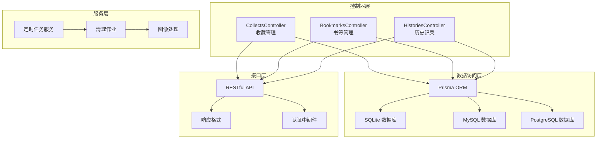
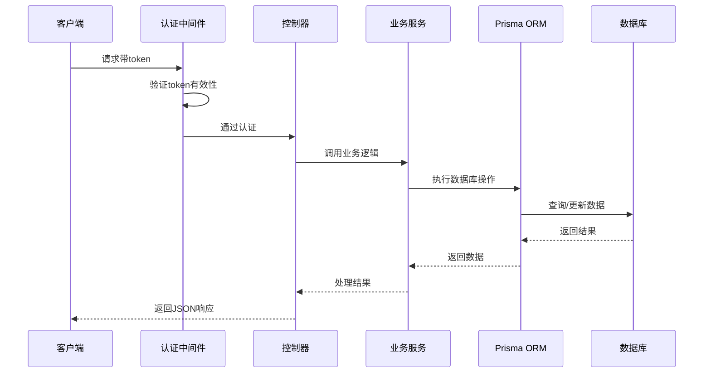
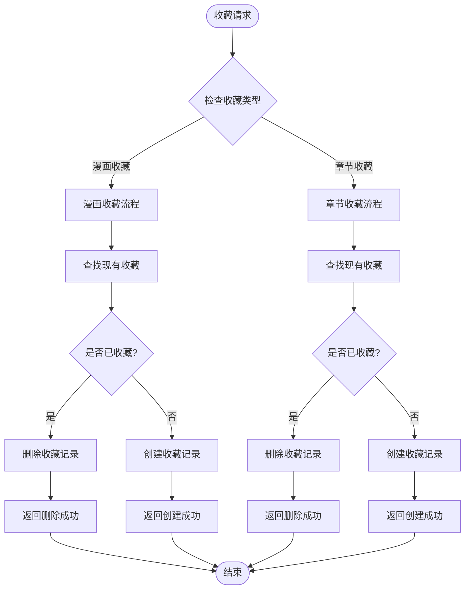
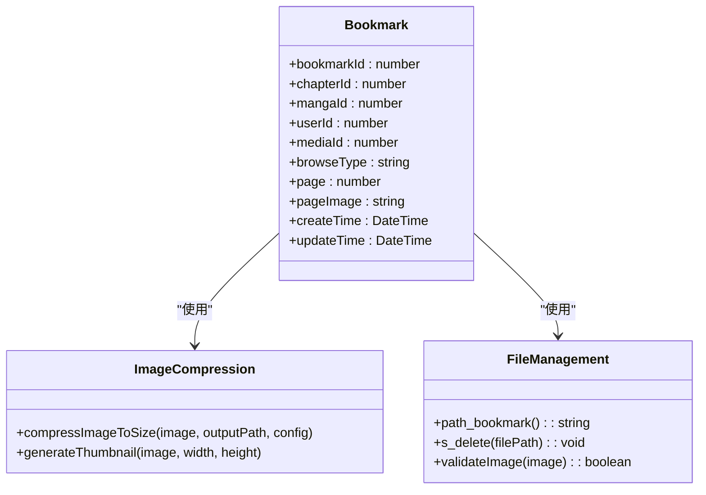
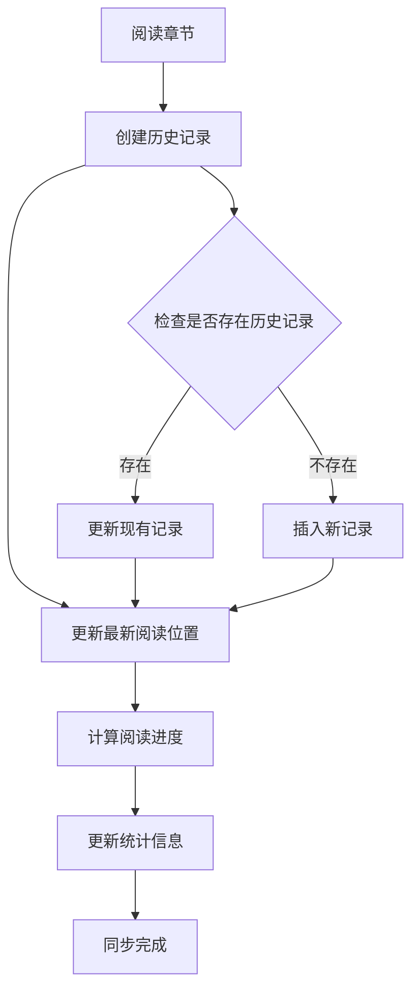
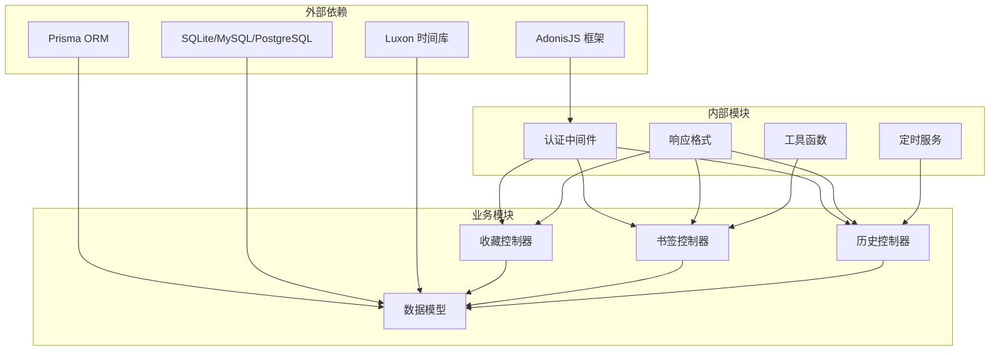

# 收藏系统模块

<cite>
**本文档引用的文件**
- [collects_controller.ts](file://app/controllers/collects_controller.ts)
- [bookmarks_controller.ts](file://app/controllers/bookmarks_controller.ts)
- [histories_controller.ts](file://app/controllers/histories_controller.ts)
- [schema.prisma](file://prisma/sqlite/schema.prisma)
- [routes.ts](file://start/routes.ts)
- [auth_middleware.ts](file://app/middleware/auth_middleware.ts)
- [response.ts](file://app/interfaces/response.ts)
- [clear_compress_job.ts](file://app/services/clear_compress_job.ts)
- [cron_service.ts](file://app/services/cron_service.ts)
</cite>

## 目录
1. [简介](#简介)
2. [项目结构](#项目结构)
3. [核心组件](#核心组件)
4. [架构概览](#架构概览)
5. [详细组件分析](#详细组件分析)
6. [依赖关系分析](#依赖关系分析)
7. [性能考虑](#性能考虑)
8. [故障排除指南](#故障排除指南)
9. [结论](#结论)

## 简介

SManga Adonis收藏系统模块是一个完整的数字漫画收藏、书签管理和阅读历史跟踪解决方案。该模块提供了用户收藏管理、阅读进度跟踪、书签设置和历史记录维护等核心功能，支持多数据库后端（SQLite、MySQL、PostgreSQL）和多种浏览模式。

该系统采用基于Prisma ORM的数据模型设计，实现了收藏关系的建立、书签位置记录、阅读历史的自动更新机制，并提供了收藏分类、进度同步、历史清理等高级特性。系统还包含了完善的权限控制和数据一致性保证机制。

## 项目结构

收藏系统模块主要由以下组件构成：

**图表来源**
- [collects_controller.ts:1-281](file://app/controllers/collects_controller.ts#L1-L281)
- [bookmarks_controller.ts:1-201](file://app/controllers/bookmarks_controller.ts#L1-L201)
- [histories_controller.ts:1-270](file://app/controllers/histories_controller.ts#L1-L270)

**章节来源**
- [routes.ts:64-104](file://start/routes.ts#L64-L104)
- [schema.prisma:1-447](file://prisma/sqlite/schema.prisma#L1-L447)

## 核心组件

### 数据模型设计

收藏系统的核心数据模型包括三个主要实体：收藏（collect）、书签（bookmark）和历史记录（history），它们通过用户ID关联到用户表。

#### 收藏模型 (Collect)
- **collectId**: 主键，自增整数
- **collectType**: 收藏类型，默认"manga"，可选"chapter"
- **userId**: 用户ID，外键关联用户表
- **mediaId**: 媒体库ID
- **mangaId**: 漫画ID，外键关联漫画表
- **chapterId**: 章节ID，可空，外键关联章节表
- **mangaName**: 漫画名称
- **chapterName**: 章节名称
- **唯一约束**: (userId, collectType, mangaId, chapterId)

#### 书签模型 (Bookmark)
- **bookmarkId**: 主键，自增整数
- **chapterId**: 章节ID，外键关联章节表
- **mangaId**: 漫画ID，外键关联漫画表
- **userId**: 用户ID，外键关联用户表
- **mediaId**: 媒体库ID
- **browseType**: 浏览类型，默认"flow"
- **page**: 书签页码
- **pageImage**: 书签图片路径
- **唯一约束**: (chapterId, page)

#### 历史记录模型 (History)
- **historyId**: 主键，自增整数
- **userId**: 用户ID，外键关联用户表
- **mediaId**: 媒体库ID
- **mangaId**: 漫画ID，外键关联漫画表
- **chapterId**: 章节ID，外键关联章节表
- **mangaName**: 漫画名称
- **chapterName**: 章节名称
- **browseType**: 浏览类型，默认"flow"
- **createTime**: 创建时间

**章节来源**
- [schema.prisma:58-110](file://prisma/sqlite/schema.prisma#L58-L110)

### API接口设计

系统提供完整的RESTful API接口，支持收藏、书签和历史记录的CRUD操作：

#### 收藏管理接口
- GET `/collect`: 获取所有收藏
- GET `/collect-manga`: 获取用户漫画收藏列表
- GET `/collect-chapter`: 获取用户章节收藏列表
- POST `/collect-manga/:mangaId`: 添加或取消收藏漫画
- POST `/collect-chapter/:chapterId`: 添加或取消收藏章节
- GET `/manga-iscollect/:mangaId`: 检查漫画是否已收藏
- GET `/chapter-iscollect/:chapterId`: 检查章节是否已收藏

#### 书签管理接口
- GET `/bookmark`: 获取书签列表
- POST `/bookmark`: 创建书签
- PUT `/bookmark/:bookmarkId`: 更新书签
- DELETE `/bookmark/:bookmarkId`: 删除书签
- DELETE `/bookmark/:bookmarkIds/batch`: 批量删除书签

#### 历史记录接口
- GET `/history`: 获取历史记录列表
- POST `/history`: 创建历史记录
- PUT `/history/:chapterId`: 更新历史记录
- PUT `/read-all-chapters/:mangaId`: 将漫画标记为已读
- PUT `/unread-all-chapters/:mangaId`: 将漫画标记为未读
- GET `/chapter-is-read/:chapterId`: 检查章节是否已阅读

**章节来源**
- [routes.ts:64-104](file://start/routes.ts#L64-L104)

## 架构概览

收藏系统采用分层架构设计，确保关注点分离和代码可维护性：

**图表来源**
- [auth_middleware.ts:23-84](file://app/middleware/auth_middleware.ts#L23-L84)
- [collects_controller.ts:132-164](file://app/controllers/collects_controller.ts#L132-L164)

### 权限控制机制

系统实现了多层次的权限控制：

1. **全局认证**: 所有受保护路由都需要有效的token
2. **角色权限**: 管理员用户拥有特殊权限
3. **媒体权限**: 用户只能访问被授权的媒体库
4. **模块权限**: 基于用户权限表的细粒度控制

**章节来源**
- [auth_middleware.ts:17-85](file://app/middleware/auth_middleware.ts#L17-L85)

## 详细组件分析

### 收藏管理组件

收藏管理组件负责处理用户的收藏操作，支持漫画和章节两个层级的收藏。

#### 核心功能实现

**图表来源**
- [collects_controller.ts:132-202](file://app/controllers/collects_controller.ts#L132-L202)

#### 收藏类型设计

系统支持两种收藏类型：
- **manga类型**: 收藏整个漫画作品
- **chapter类型**: 收藏特定章节

每种类型都有不同的业务逻辑和数据结构。

**章节来源**
- [collects_controller.ts:17-70](file://app/controllers/collects_controller.ts#L17-L70)

### 书签管理组件

书签管理组件提供精确的阅读位置跟踪功能，支持图片压缩和文件管理。

#### 书签存储机制

**图表来源**
- [bookmarks_controller.ts:105-139](file://app/controllers/bookmarks_controller.ts#L105-L139)
- [bookmarks_controller.ts:153-168](file://app/controllers/bookmarks_controller.ts#L153-L168)

#### 图像处理流程

书签功能集成了智能图像处理机制：

1. **图片压缩**: 将原始图片压缩到指定尺寸
2. **文件存储**: 自动管理书签图片文件
3. **内存优化**: 及时清理不需要的临时文件

**章节来源**
- [bookmarks_controller.ts:105-139](file://app/controllers/bookmarks_controller.ts#L105-L139)

### 历史记录组件

历史记录组件实现了复杂的阅读进度跟踪，支持跨平台和跨设备的进度同步。

#### 历史记录算法

**图表来源**
- [histories_controller.ts:126-160](file://app/controllers/histories_controller.ts#L126-L160)

#### 跨数据库兼容性

系统针对不同数据库实现了优化的SQL查询：

- **PostgreSQL**: 使用MAX函数处理GROUP BY场景
- **MySQL**: 使用聚合函数确保查询稳定性

**章节来源**
- [histories_controller.ts:48-124](file://app/controllers/histories_controller.ts#L48-L124)

## 依赖关系分析

收藏系统模块的依赖关系体现了清晰的关注点分离：

**图表来源**
- [collects_controller.ts:1-5](file://app/controllers/collects_controller.ts#L1-L5)
- [bookmarks_controller.ts:1-6](file://app/controllers/bookmarks_controller.ts#L1-L6)
- [histories_controller.ts:1-6](file://app/controllers/histories_controller.ts#L1-L6)

### 数据一致性保证

系统通过多种机制确保数据一致性：

1. **事务处理**: 关键操作使用数据库事务
2. **唯一约束**: 通过数据库唯一约束防止重复数据
3. **级联删除**: 确保相关数据的完整性
4. **验证机制**: 输入参数的严格验证

**章节来源**
- [schema.prisma:25-74](file://prisma/sqlite/schema.prisma#L25-L74)

## 性能考虑

### 查询优化策略

收藏系统采用了多项性能优化措施：

#### 并行查询优化
- 使用Promise.all同时执行多个查询
- 减少数据库连接开销
- 提高响应速度

#### 分页查询优化
- 实现高效的分页查询
- 使用skip/take避免全表扫描
- 支持大数据量场景

#### 缓存策略
- 书签图片使用压缩存储
- 历史记录按漫画分组查询
- 避免重复计算阅读进度

### 内存管理

系统实现了智能的内存管理机制：

1. **及时释放**: 大对象使用后立即释放
2. **批量处理**: 大量数据操作使用批处理
3. **资源监控**: 定期检查内存使用情况

## 故障排除指南

### 常见问题及解决方案

#### 认证失败
**问题**: 用户无法访问受保护的收藏功能
**原因**: Token无效或过期
**解决**: 重新登录获取新的Token

#### 数据库连接问题
**问题**: 收藏操作失败
**原因**: 数据库连接异常
**解决**: 检查数据库配置和连接状态

#### 权限不足
**问题**: 无法执行某些操作
**原因**: 用户权限不足
**解决**: 联系管理员提升权限

#### 性能问题
**问题**: 页面加载缓慢
**原因**: 数据量过大或查询效率低
**解决**: 使用分页功能或优化查询条件

**章节来源**
- [auth_middleware.ts:34-54](file://app/middleware/auth_middleware.ts#L34-L54)

### 调试技巧

1. **日志分析**: 查看系统日志定位问题
2. **数据库监控**: 监控数据库查询性能
3. **网络诊断**: 检查API响应时间和错误码
4. **内存分析**: 监控内存使用情况

## 结论

SManga Adonis收藏系统模块是一个功能完整、设计合理的数字漫画管理解决方案。该模块通过精心设计的数据模型、完善的API接口和强大的权限控制机制，为用户提供了优质的收藏、书签和历史记录管理体验。

系统的主要优势包括：

1. **模块化设计**: 清晰的职责分离和可扩展的架构
2. **数据一致性**: 通过多种机制确保数据完整性
3. **性能优化**: 针对大数据量场景的优化策略
4. **跨平台支持**: 支持多种数据库和部署环境
5. **安全性**: 完善的认证和授权机制

未来可以考虑的功能增强包括：
- 更智能的推荐算法
- 多设备同步优化
- 更丰富的统计分析功能
- 移动端专用优化

该收藏系统模块为SManga Adonis平台提供了坚实的数据基础，支持了整个应用的核心功能需求。