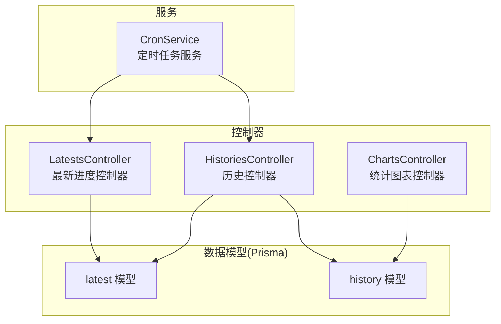
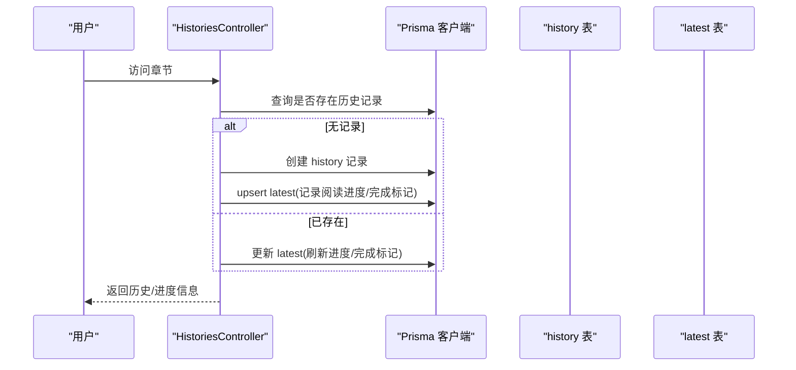
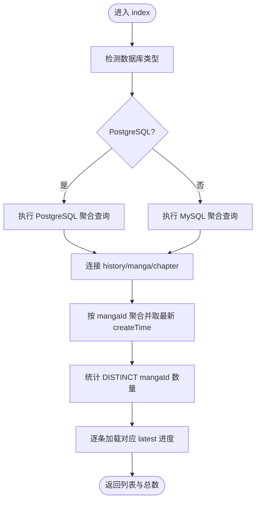
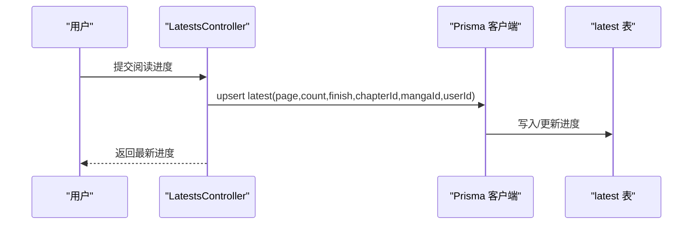
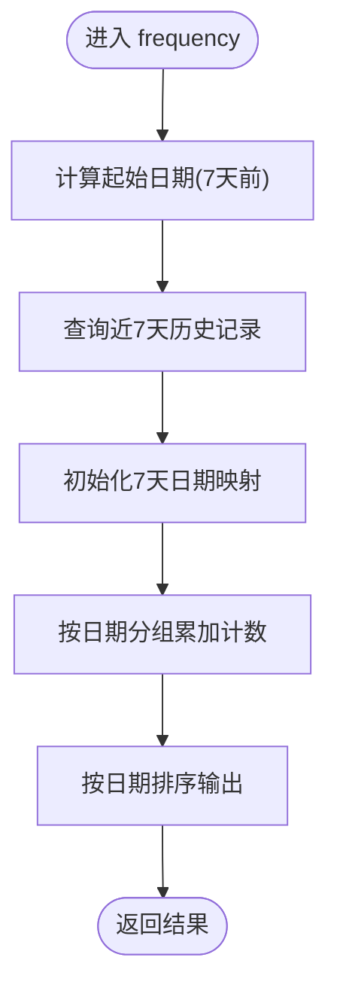
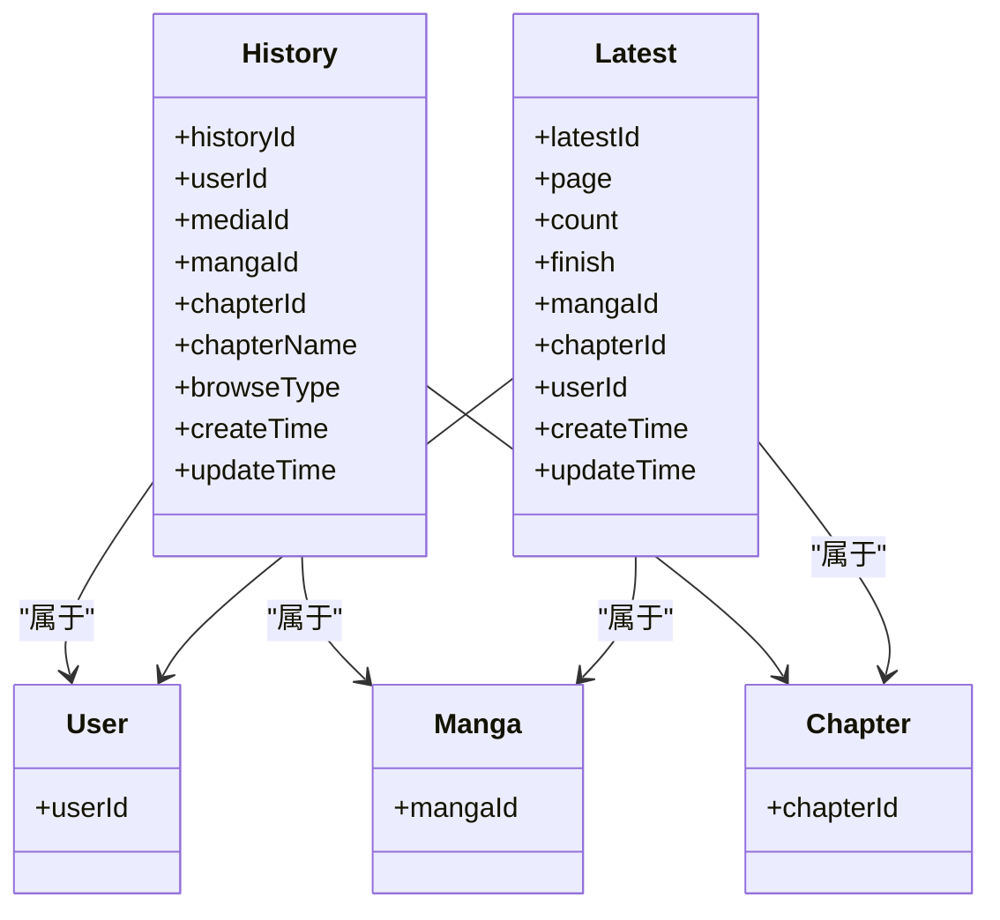
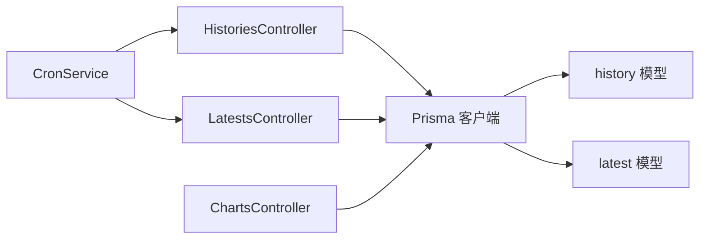
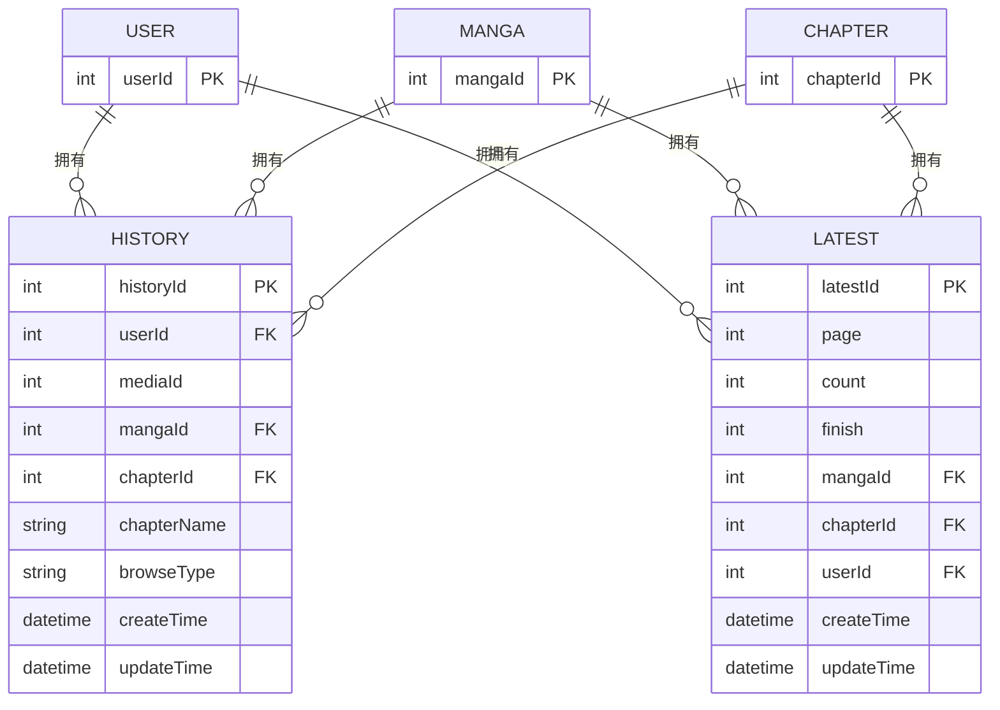

# 阅读历史

<cite>
**本文引用的文件**
- [app/controllers/histories_controller.ts](file://app/controllers/histories_controller.ts)
- [prisma/pgsql/schema.prisma](file://prisma/pgsql/schema.prisma)
- [prisma/mysql/schema.prisma](file://prisma/mysql/schema.prisma)
- [prisma/sqlite/schema.prisma](file://prisma/sqlite/schema.prisma)
- [app/controllers/latests_controller.ts](file://app/controllers/latests_controller.ts)
- [app/controllers/charts_controller.ts](file://app/controllers/charts_controller.ts)
- [app/services/cron_service.ts](file://app/services/cron_service.ts)
</cite>

## 目录
1. [简介](#简介)
2. [项目结构](#项目结构)
3. [核心组件](#核心组件)
4. [架构总览](#架构总览)
5. [详细组件分析](#详细组件分析)
6. [依赖关系分析](#依赖关系分析)
7. [性能考量](#性能考量)
8. [故障排查指南](#故障排查指南)
9. [结论](#结论)
10. [附录](#附录)

## 简介
本文件系统性阐述 SManga Adonis 的“阅读历史”功能，覆盖数据模型设计、时间线管理、自动更新机制、历史记录生命周期与清理策略、进度跟踪与去重、统计聚合与趋势分析、存储优化与隐私保护等主题。目标是帮助开发者与运维人员快速理解并高效维护该功能。

## 项目结构
围绕阅读历史的关键文件与职责如下：
- 控制器层：负责对外接口与业务编排（历史列表、创建、更新、删除、批量标记、章节是否已读）。
- 数据模型层：基于 Prisma 的 history 与 latest 模型，分别承载“历史记录”和“最新阅读进度”。
- 统计与图表：提供按漫画、标签、浏览频率等维度的统计接口。
- 定时任务：通过 cron_service 部署周期性任务，间接影响历史与进度的生命周期管理。

**图示来源**
- [app/controllers/histories_controller.ts:1-270](file://app/controllers/histories_controller.ts#L1-L270)
- [app/controllers/latests_controller.ts:96-178](file://app/controllers/latests_controller.ts#L96-L178)
- [app/controllers/charts_controller.ts:1-160](file://app/controllers/charts_controller.ts#L1-L160)
- [app/services/cron_service.ts:1-144](file://app/services/cron_service.ts#L1-L144)
- [prisma/pgsql/schema.prisma:95-127](file://prisma/pgsql/schema.prisma#L95-L127)

**章节来源**
- [app/controllers/histories_controller.ts:1-270](file://app/controllers/histories_controller.ts#L1-L270)
- [prisma/pgsql/schema.prisma:95-127](file://prisma/pgsql/schema.prisma#L95-L127)
- [prisma/mysql/schema.prisma:95-127](file://prisma/mysql/schema.prisma#L95-L127)
- [prisma/sqlite/schema.prisma:95-127](file://prisma/sqlite/schema.prisma#L95-L127)
- [app/controllers/charts_controller.ts:1-160](file://app/controllers/charts_controller.ts#L1-L160)
- [app/services/cron_service.ts:1-144](file://app/services/cron_service.ts#L1-L144)

## 核心组件
- 历史记录模型（history）
  - 关键字段：用户标识、媒体标识、漫画标识、章节标识、章节名称、浏览类型、创建/更新时间。
  - 作用：记录用户对各章节的访问行为，作为“历史”的原子单元。
- 最新阅读进度模型（latest）
  - 关键字段：页面号、完成标记、漫画/章节/用户标识、创建/更新时间。
  - 作用：记录用户的“当前阅读位置”，用于断点续读与“最近阅读”展示。

两者通过外键关联到 user、manga、chapter，形成“用户-漫画-章节”的阅读闭环。

**章节来源**
- [prisma/pgsql/schema.prisma:95-127](file://prisma/pgsql/schema.prisma#L95-L127)
- [prisma/mysql/schema.prisma:95-127](file://prisma/mysql/schema.prisma#L95-L127)
- [prisma/sqlite/schema.prisma:95-127](file://prisma/sqlite/schema.prisma#L95-L127)

## 架构总览
阅读历史的端到端流程包括：
- 用户访问章节时触发历史记录写入；
- 同步更新“最新阅读进度”；
- 历史列表按漫画维度聚合展示；
- 统计模块按时间窗口聚合浏览频次；
- 定时任务清理或维护相关缓存与状态。

**图示来源**
- [app/controllers/histories_controller.ts:126-160](file://app/controllers/histories_controller.ts#L126-L160)
- [app/controllers/histories_controller.ts:217-236](file://app/controllers/histories_controller.ts#L217-L236)
- [prisma/pgsql/schema.prisma:95-127](file://prisma/pgsql/schema.prisma#L95-L127)

## 详细组件分析

### 历史控制器（HistoriesController）
- 列表查询（index）
  - 支持分页与按漫画维度聚合，返回每部漫画的最新章节信息与“最新阅读进度”。
  - PostgreSQL 与 MySQL 分别使用原生 SQL 实现聚合与排序，避免复杂 ORM GROUP BY 限制。
- 新增历史（create）
  - 连接 user/manga/chapter，写入历史记录与必要字段。
- 更新历史（update）
  - 按章节与用户维度批量更新媒体/漫画/章节信息。
- 删除历史（destroy）
  - 按章节与用户维度批量删除历史记录。
- 批量标记已读/清空（read_all_chapters/unread_all_chapters）
  - 遍历漫画所有章节，批量创建历史记录并同步 latest 完成标记。
- 章节是否已读（chapter_is_read）
  - 快速判断某章节是否存在历史记录。

**图示来源**
- [app/controllers/histories_controller.ts:8-46](file://app/controllers/histories_controller.ts#L8-L46)
- [app/controllers/histories_controller.ts:48-124](file://app/controllers/histories_controller.ts#L48-L124)

**章节来源**
- [app/controllers/histories_controller.ts:1-270](file://app/controllers/histories_controller.ts#L1-L270)

### 最新进度控制器（LatestsController）
- 读取最新进度（show）
  - 按用户与漫画查找最新阅读进度，同时返回下个可读章节。
- 写入/更新进度（create/update）
  - upsert 或 update 页面号、完成标记、章节/漫画/用户标识。
- 删除进度（destroy）
  - 按章节与用户删除进度记录。

**图示来源**
- [app/controllers/latests_controller.ts:96-178](file://app/controllers/latests_controller.ts#L96-L178)
- [prisma/pgsql/schema.prisma:113-127](file://prisma/pgsql/schema.prisma#L113-L127)

**章节来源**
- [app/controllers/latests_controller.ts:96-178](file://app/controllers/latests_controller.ts#L96-L178)

### 统计与趋势（ChartsController）
- 漫画浏览类型分布（browse）
  - 按 browseType 聚合统计漫画数量。
- 标签热度排行（tag）
  - 按标签聚合统计并返回标签名与数量。
- 漫画热度排行（ranking）
  - 按历史记录数统计漫画热度。
- 浏览频率趋势（frequency）
  - 近7天按日统计历史记录数量，形成趋势序列。

**图示来源**
- [app/controllers/charts_controller.ts:114-158](file://app/controllers/charts_controller.ts#L114-L158)

**章节来源**
- [app/controllers/charts_controller.ts:1-160](file://app/controllers/charts_controller.ts#L1-L160)

### 自动更新与生命周期管理
- 自动更新机制
  - 用户访问章节时，HistoriesController 写入 history 并 upsert latest，确保进度与历史同步。
  - 批量标记已读时，遍历漫画所有章节，统一写入历史并标记完成。
- 生命周期与清理策略
  - 当前代码未直接提供历史记录的自动清理逻辑；可通过定时任务服务部署自定义清理作业（如清理 N 天前的历史），或结合外部工具定期维护。
  - latest 表与 history 表均具备外键约束，删除 manga 或 chapter 会级联影响相关记录，需谨慎操作。

**图示来源**
- [prisma/pgsql/schema.prisma:95-127](file://prisma/pgsql/schema.prisma#L95-L127)

**章节来源**
- [app/controllers/histories_controller.ts:190-250](file://app/controllers/histories_controller.ts#L190-L250)
- [prisma/pgsql/schema.prisma:95-127](file://prisma/pgsql/schema.prisma#L95-L127)

## 依赖关系分析
- 控制器依赖 Prisma 客户端进行数据持久化。
- 历史与进度模型依赖 user/manga/chapter 的关系完整性。
- 统计模块依赖历史表的时序数据。
- 定时任务服务可调度清理/维护类作业，间接影响历史与进度的生命周期。

**图示来源**
- [app/controllers/histories_controller.ts:1-270](file://app/controllers/histories_controller.ts#L1-L270)
- [app/controllers/latests_controller.ts:96-178](file://app/controllers/latests_controller.ts#L96-L178)
- [app/controllers/charts_controller.ts:1-160](file://app/controllers/charts_controller.ts#L1-L160)
- [app/services/cron_service.ts:1-144](file://app/services/cron_service.ts#L1-L144)

**章节来源**
- [app/controllers/histories_controller.ts:1-270](file://app/controllers/histories_controller.ts#L1-L270)
- [app/controllers/latests_controller.ts:96-178](file://app/controllers/latests_controller.ts#L96-L178)
- [app/controllers/charts_controller.ts:1-160](file://app/controllers/charts_controller.ts#L1-L160)
- [app/services/cron_service.ts:1-144](file://app/services/cron_service.ts#L1-L144)

## 性能考量
- 聚合查询优化
  - PostgreSQL/MySQL 分别采用原生 SQL 聚合，避免 ORM GROUP BY 的限制与隐式排序问题，提高分页与计数效率。
- 连接与索引
  - history 与 latest 均以 (userId, mangaId/chapterId) 作为常用过滤条件，建议在这些列上建立复合索引以加速查询。
- 批量操作
  - 批量标记已读时，先查出所有章节再批量写入，减少往返次数；若章节较多，可考虑分批提交。
- 统计查询
  - frequency 按近7天筛选，避免全表扫描；建议为 history.createTime 建立索引以提升范围查询性能。

[本节为通用性能建议，不直接分析具体文件]

## 故障排查指南
- 历史列表为空或异常
  - 检查用户标识是否正确传入，确认历史记录是否已创建。
  - 确认数据库类型分支逻辑是否命中（PostgreSQL/MySQL）。
- 进度不同步
  - 确认 upsert latest 是否被调用；检查 latest 表的唯一约束（chapterId, userId）。
- 统计结果异常
  - 检查时间范围参数与频率统计的日期归并逻辑。
- 清理策略缺失
  - 若历史记录增长过快，可在定时任务中添加清理作业，或调整保留策略。

**章节来源**
- [app/controllers/histories_controller.ts:1-270](file://app/controllers/histories_controller.ts#L1-L270)
- [app/controllers/latests_controller.ts:96-178](file://app/controllers/latests_controller.ts#L96-L178)
- [app/controllers/charts_controller.ts:114-158](file://app/controllers/charts_controller.ts#L114-L158)
- [app/services/cron_service.ts:1-144](file://app/services/cron_service.ts#L1-L144)

## 结论
SManga Adonis 的阅读历史功能以 history 与 latest 为核心，通过控制器实现精确的进度跟踪与历史聚合，借助统计模块提供多维可视化。当前实现强调“访问即记录、断点即续读”的体验，同时预留了通过定时任务扩展清理与维护能力的空间。建议在生产环境进一步完善索引、批量写入与清理策略，以保障性能与稳定性。

## 附录

### 数据模型与关系概览

**图示来源**
- [prisma/pgsql/schema.prisma:95-127](file://prisma/pgsql/schema.prisma#L95-L127)