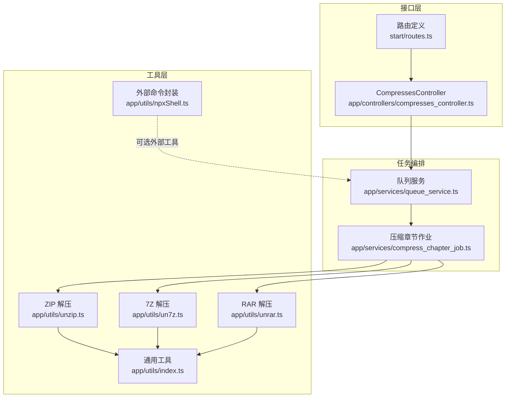
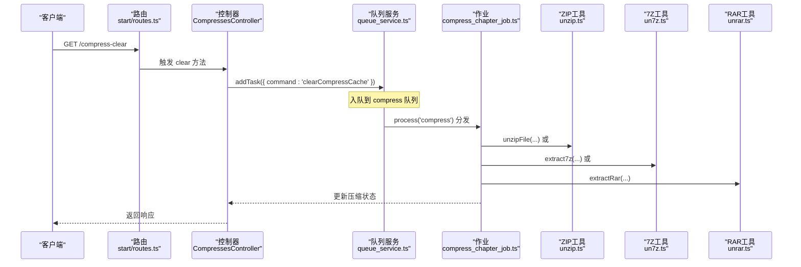
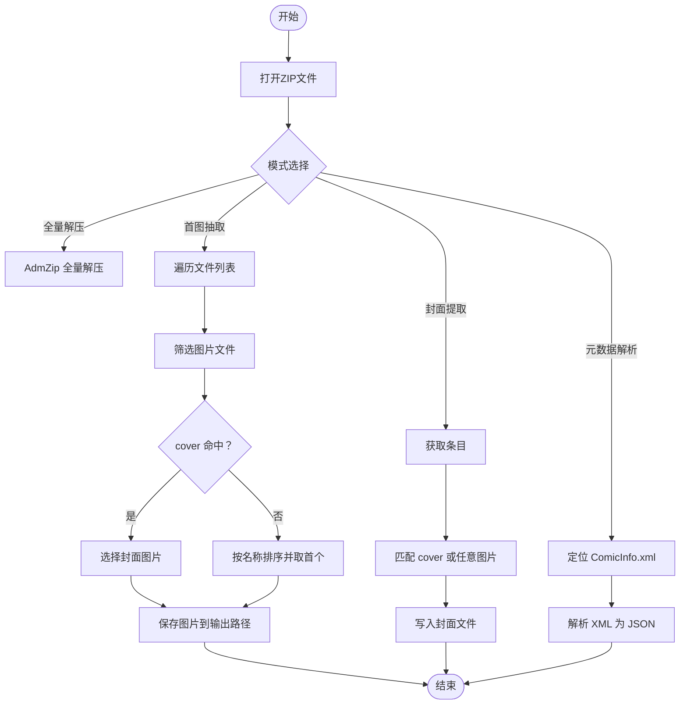
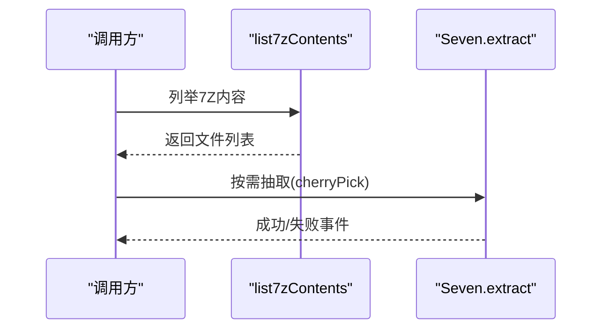
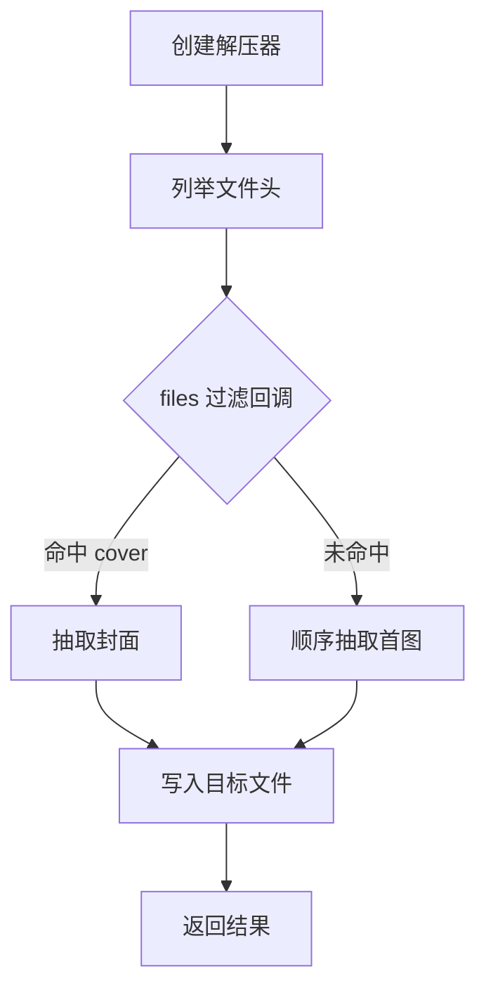
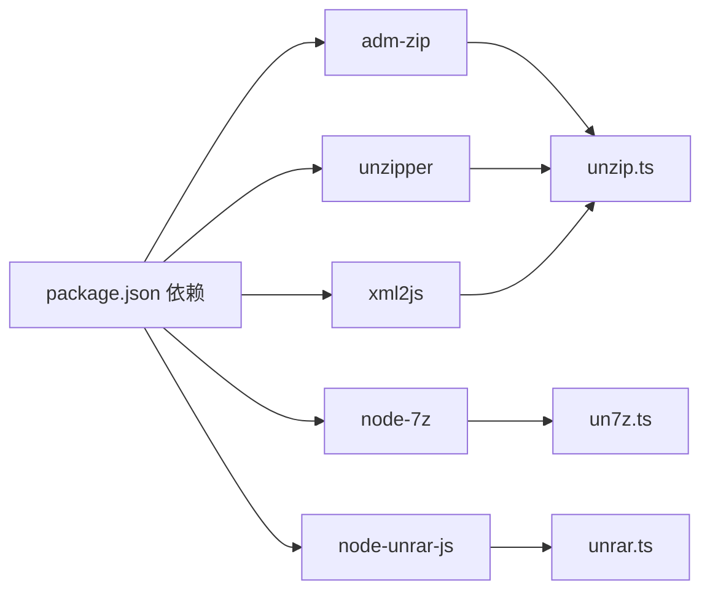

# 压缩包解压处理

<cite>
**本文引用的文件**
- [app/controllers/compresses_controller.ts](file://app/controllers/compresses_controller.ts)
- [app/services/compress_chapter_job.ts](file://app/services/compress_chapter_job.ts)
- [app/services/queue_service.ts](file://app/services/queue_service.ts)
- [app/utils/unzip.ts](file://app/utils/unzip.ts)
- [app/utils/un7z.ts](file://app/utils/un7z.ts)
- [app/utils/unrar.ts](file://app/utils/unrar.ts)
- [app/utils/index.ts](file://app/utils/index.ts)
- [app/utils/npxShell.ts](file://app/utils/npxShell.ts)
- [start/routes.ts](file://start/routes.ts)
- [package.json](file://package.json)
</cite>

## 目录
1. [简介](#简介)
2. [项目结构](#项目结构)
3. [核心组件](#核心组件)
4. [架构总览](#架构总览)
5. [详细组件分析](#详细组件分析)
6. [依赖关系分析](#依赖关系分析)
7. [性能考量](#性能考量)
8. [故障排除指南](#故障排除指南)
9. [结论](#结论)
10. [附录](#附录)

## 简介
本文件系统性梳理 SManga Adonis 中“压缩包解压处理”的实现与使用，覆盖以下要点：
- 支持的压缩格式：ZIP、7Z、RAR
- 各格式的解压实现与调用方式
- 错误处理、异常恢复策略
- 文件验证、路径安全检查
- 不同格式处理差异、性能对比与最佳实践
- 失败后的故障排除与重试机制

## 项目结构
围绕压缩解压的关键代码分布在控制器、服务层、工具函数与队列调度中，整体采用“HTTP 控制器 -> 队列服务 -> 作业类 -> 工具函数”的分层设计。

**图表来源**
- [app/controllers/compresses_controller.ts:1-147](file://app/controllers/compresses_controller.ts#L1-L147)
- [app/services/queue_service.ts:1-267](file://app/services/queue_service.ts#L1-L267)
- [app/services/compress_chapter_job.ts:1-71](file://app/services/compress_chapter_job.ts#L1-L71)
- [app/utils/unzip.ts:1-168](file://app/utils/unzip.ts#L1-L168)
- [app/utils/un7z.ts:1-141](file://app/utils/un7z.ts#L1-L141)
- [app/utils/unrar.ts:1-118](file://app/utils/unrar.ts#L1-L118)
- [app/utils/index.ts:1-313](file://app/utils/index.ts#L1-L313)
- [app/utils/npxShell.ts:1-23](file://app/utils/npxShell.ts#L1-L23)
- [start/routes.ts:1-241](file://start/routes.ts#L1-L241)

**章节来源**
- [start/routes.ts:85-93](file://start/routes.ts#L85-L93)
- [app/controllers/compresses_controller.ts:30-56](file://app/controllers/compresses_controller.ts#L30-L56)
- [app/services/queue_service.ts:49-66](file://app/services/queue_service.ts#L49-L66)
- [app/services/compress_chapter_job.ts:31-44](file://app/services/compress_chapter_job.ts#L31-L44)

## 核心组件
- 压缩资源控制器：负责压缩记录的增删改查与触发清理任务
- 队列服务：统一接收任务、配置并发/重试/超时、调度到对应作业
- 压缩章节作业：根据压缩类型选择具体解压工具并持久化状态
- 工具函数：
  - ZIP：AdmZip + unzipper（支持封面提取、元数据解析）
  - 7Z：node-7z（流式事件监听、列表枚举）
  - RAR：node-unrar-js（按需抽取首张图、封面优先）

**章节来源**
- [app/controllers/compresses_controller.ts:7-146](file://app/controllers/compresses_controller.ts#L7-L146)
- [app/services/queue_service.ts:17-32](file://app/services/queue_service.ts#L17-L32)
- [app/services/compress_chapter_job.ts:6-71](file://app/services/compress_chapter_job.ts#L6-L71)
- [app/utils/unzip.ts:10-168](file://app/utils/unzip.ts#L10-L168)
- [app/utils/un7z.ts:12-141](file://app/utils/un7z.ts#L12-L141)
- [app/utils/unrar.ts:7-118](file://app/utils/unrar.ts#L7-L118)

## 架构总览
下图展示从 HTTP 请求到任务入队再到具体解压执行的端到端流程。

**图表来源**
- [start/routes.ts:92](file://start/routes.ts#L92)
- [app/controllers/compresses_controller.ts:137-145](file://app/controllers/compresses_controller.ts#L137-L145)
- [app/services/queue_service.ts:49-66](file://app/services/queue_service.ts#L49-L66)
- [app/services/compress_chapter_job.ts:31-65](file://app/services/compress_chapter_job.ts#L31-L65)
- [app/utils/unzip.ts:10](file://app/utils/unzip.ts#L10)
- [app/utils/un7z.ts:12](file://app/utils/un7z.ts#L12)
- [app/utils/unrar.ts:7](file://app/utils/unrar.ts#L7)

## 详细组件分析

### 压缩资源控制器（CompressesController）
- 提供压缩记录的查询、创建、更新、删除与批量删除
- 提供“清空压缩缓存”任务入口，通过队列服务异步执行

关键点：
- 删除操作会同时删除磁盘文件（基于通用删除工具）
- 清理接口会向队列添加清理任务

**章节来源**
- [app/controllers/compresses_controller.ts:8-28](file://app/controllers/compresses_controller.ts#L8-L28)
- [app/controllers/compresses_controller.ts:30-56](file://app/controllers/compresses_controller.ts#L30-L56)
- [app/controllers/compresses_controller.ts:58-105](file://app/controllers/compresses_controller.ts#L58-L105)
- [app/controllers/compresses_controller.ts:108-135](file://app/controllers/compresses_controller.ts#L108-L135)
- [app/controllers/compresses_controller.ts:137-145](file://app/controllers/compresses_controller.ts#L137-L145)

### 队列服务（queue_service.ts）
- 统一配置并发度、最大重试次数、超时时间
- 为压缩任务分配独立队列，支持指数退避重试
- 任务分发逻辑：根据 command 分派到对应作业类

关键点：
- 配置来源于全局配置对象，可动态读取
- 对于 compress 类任务，使用独立队列并设置 backoff

**章节来源**
- [app/services/queue_service.ts:17-32](file://app/services/queue_service.ts#L17-L32)
- [app/services/queue_service.ts:49-66](file://app/services/queue_service.ts#L49-L66)
- [app/services/queue_service.ts:241-262](file://app/services/queue_service.ts#L241-L262)

### 压缩章节作业（compress_chapter_job.ts）
- 接收章节 ID、章节信息、压缩类型、路径等参数
- 根据类型选择对应工具函数执行解压
- 解压完成后 upsert 压缩状态

关键点：
- 未识别类型时打印提示
- 异常会向上抛出，交由队列判定失败并重试

**章节来源**
- [app/services/compress_chapter_job.ts:6-30](file://app/services/compress_chapter_job.ts#L6-L30)
- [app/services/compress_chapter_job.ts:31-44](file://app/services/compress_chapter_job.ts#L31-L44)
- [app/services/compress_chapter_job.ts:46-69](file://app/services/compress_chapter_job.ts#L46-L69)

### ZIP 解压工具（unzip.ts）
- 主要能力
  - 全量解压：AdmZip
  - 首图抽取：unzipper（支持顺序与“cover”优先策略）
  - 封面提取：AdmZip + 名称匹配
  - 元数据解析：ComicInfo.xml 解析为 JSON
- 路径与安全
  - 输出前确保目标目录存在
  - 通过图片扩展名判断过滤（is_img）

**图表来源**
- [app/utils/unzip.ts:10-168](file://app/utils/unzip.ts#L10-L168)
- [app/utils/index.ts:24-28](file://app/utils/index.ts#L24-L28)

**章节来源**
- [app/utils/unzip.ts:10-13](file://app/utils/unzip.ts#L10-L13)
- [app/utils/unzip.ts:17-50](file://app/utils/unzip.ts#L17-L50)
- [app/utils/unzip.ts:52-80](file://app/utils/unzip.ts#L52-L80)
- [app/utils/unzip.ts:82-100](file://app/utils/unzip.ts#L82-L100)
- [app/utils/unzip.ts:102-114](file://app/utils/unzip.ts#L102-L114)
- [app/utils/unzip.ts:122-168](file://app/utils/unzip.ts#L122-L168)

### 7Z 解压工具（un7z.ts）
- 主要能力
  - 全量解压：node-7z 流式事件监听
  - 列表枚举：支持 cherryPick 过滤
  - 首图抽取：先列出再挑选 cover 或首个图片并按需抽取
- 路径与安全
  - 输出目录由调用方传入
  - 通过 is_img 过滤候选文件

**图表来源**
- [app/utils/un7z.ts:34-54](file://app/utils/un7z.ts#L34-L54)
- [app/utils/un7z.ts:56-86](file://app/utils/un7z.ts#L56-L86)
- [app/utils/un7z.ts:88-138](file://app/utils/un7z.ts#L88-L138)

**章节来源**
- [app/utils/un7z.ts:12-26](file://app/utils/un7z.ts#L12-L26)
- [app/utils/un7z.ts:28-32](file://app/utils/un7z.ts#L28-L32)
- [app/utils/un7z.ts:34-54](file://app/utils/un7z.ts#L34-L54)
- [app/utils/un7z.ts:56-86](file://app/utils/un7z.ts#L56-L86)
- [app/utils/un7z.ts:88-138](file://app/utils/un7z.ts#L88-L138)

### RAR 解压工具（unrar.ts）
- 主要能力
  - 全量解压：node-unrar-js
  - 首图抽取：支持“cover”优先与顺序回退
- 路径与安全
  - 通过 filenameTransform 将输出文件名固定为目标文件
  - 仅在命中 cover 时提前短路

**图表来源**
- [app/utils/unrar.ts:7-18](file://app/utils/unrar.ts#L7-L18)
- [app/utils/unrar.ts:20-53](file://app/utils/unrar.ts#L20-L53)
- [app/utils/unrar.ts:55-115](file://app/utils/unrar.ts#L55-L115)

**章节来源**
- [app/utils/unrar.ts:7-18](file://app/utils/unrar.ts#L7-L18)
- [app/utils/unrar.ts:20-53](file://app/utils/unrar.ts#L20-L53)
- [app/utils/unrar.ts:55-115](file://app/utils/unrar.ts#L55-L115)

### 通用工具与路径安全（index.ts）
- 图片扩展名判断（is_img）
- 路径常量（meta/poster/cache/compress 等）
- 删除工具（s_delete）
- 日志写入（write_log）

这些工具为各格式解压提供基础能力保障，如图片过滤、目录创建、日志记录等。

**章节来源**
- [app/utils/index.ts:24-28](file://app/utils/index.ts#L24-L28)
- [app/utils/index.ts:74-82](file://app/utils/index.ts#L74-L82)
- [app/utils/index.ts:181-187](file://app/utils/index.ts#L181-L187)
- [app/utils/index.ts:189-199](file://app/utils/index.ts#L189-L199)

### 外部命令封装（npxShell.ts）
- 通过 child_process 执行 npx 命令，捕获标准输出并返回执行结果
- 适用于需要借助外部 CLI 的场景（如某些特殊工具链）

**章节来源**
- [app/utils/npxShell.ts:12-22](file://app/utils/npxShell.ts#L12-L22)

## 依赖关系分析
- 压缩格式与工具映射
  - ZIP → AdmZip + unzipper
  - 7Z → node-7z
  - RAR → node-unrar-js
- 关键依赖版本（节选）
  - adm-zip、unzipper、node-7z、node-unrar-js、xml2js

**图表来源**
- [package.json:69-87](file://package.json#L69-L87)
- [app/utils/unzip.ts:5-8](file://app/utils/unzip.ts#L5-L8)
- [app/utils/un7z.ts:1](file://app/utils/un7z.ts#L1)
- [app/utils/unrar.ts:5](file://app/utils/unrar.ts#L5)

**章节来源**
- [package.json:69-87](file://package.json#L69-L87)

## 性能考量
- 流式事件监听
  - 7Z 与 RAR 均采用流式事件监听，避免一次性加载全部数据，降低内存峰值
- 按需抽取
  - 首图抽取与“cover”优先策略减少不必要的全量解压
- 并发与重试
  - 队列支持并发与指数退避重试，提升吞吐与稳定性
- I/O 优化
  - 输出前确保目录存在，避免多次失败重试导致的重复 I/O

[本节为通用性能讨论，不直接分析具体文件]

## 故障排除指南
- 常见问题与定位
  - 解压无输出或空目录：确认输入路径有效、输出目录存在且可写
  - 首图未抽取：检查文件名是否包含 cover、扩展名是否被 is_img 匹配
  - 7Z/RAR 报错：查看队列失败日志与工具函数错误事件回调
- 重试机制
  - 队列配置了最大重试次数与指数退避，失败后自动重试
- 异常恢复
  - 作业层捕获异常并抛出，交由队列判定失败；清理任务可通过控制器接口触发

**章节来源**
- [app/services/queue_service.ts:241-262](file://app/services/queue_service.ts#L241-L262)
- [app/services/compress_chapter_job.ts:66-69](file://app/services/compress_chapter_job.ts#L66-L69)
- [app/utils/unzip.ts:46-49](file://app/utils/unzip.ts#L46-L49)
- [app/utils/un7z.ts:21-24](file://app/utils/un7z.ts#L21-L24)
- [app/utils/unrar.ts:13-18](file://app/utils/unrar.ts#L13-L18)

## 结论
本实现以“控制器-队列-作业-工具函数”的分层架构组织压缩解压流程，针对 ZIP、7Z、RAR 三类常见格式分别采用适配的第三方库，结合流式事件监听、按需抽取与路径安全检查，形成稳定可靠的解压能力。配合队列的并发与重试策略，可在生产环境中高效、稳健地处理大规模压缩包解压任务。

## 附录

### 不同压缩格式处理差异与最佳实践
- ZIP
  - 优点：生态成熟、工具丰富
  - 建议：优先使用首图抽取与封面优先策略；需要元数据时解析 ComicInfo.xml
- 7Z
  - 优点：压缩率高、支持列表过滤
  - 建议：先 list 再按需抽取，减少 I/O；对大文件尤为友好
- RAR
  - 优点：兼容性好
  - 建议：优先抽取封面，否则按名称排序取首图；注意文件名转换

**章节来源**
- [app/utils/unzip.ts:17-80](file://app/utils/unzip.ts#L17-L80)
- [app/utils/un7z.ts:34-86](file://app/utils/un7z.ts#L34-L86)
- [app/utils/unrar.ts:20-115](file://app/utils/unrar.ts#L20-L115)