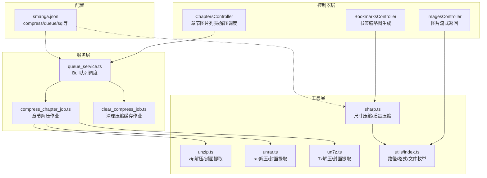
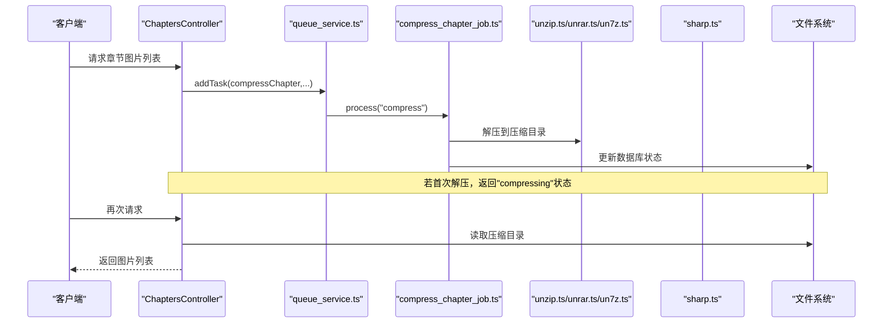
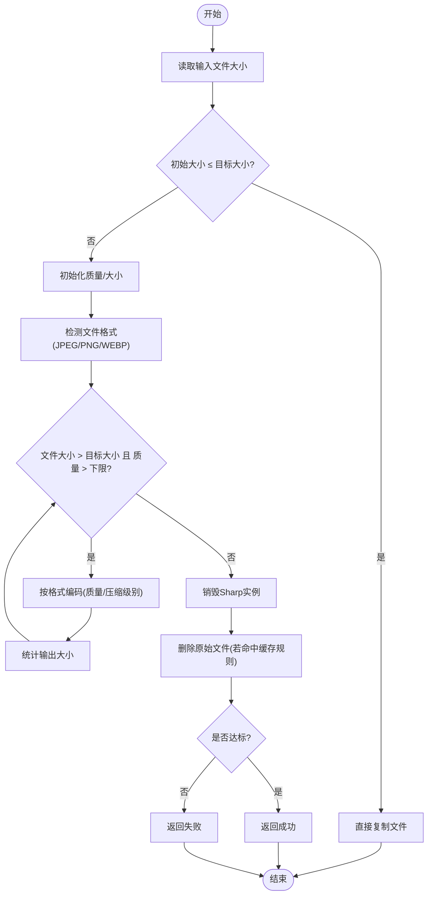
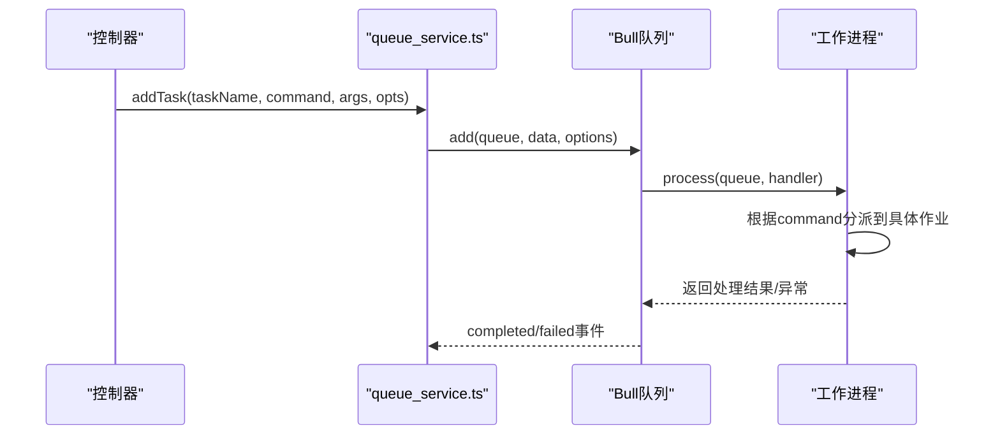
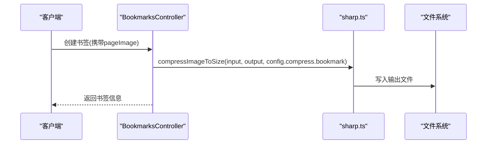
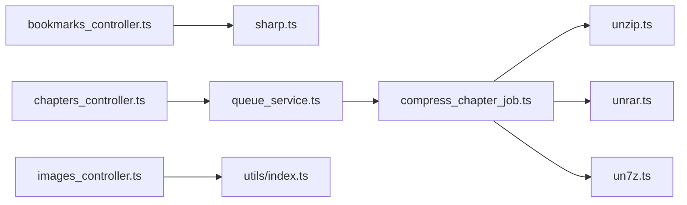

# 图像处理与优化

<cite>
**本文引用的文件**
- [app/utils/sharp.ts](file://app/utils/sharp.ts)
- [app/controllers/images_controller.ts](file://app/controllers/images_controller.ts)
- [app/controllers/bookmarks_controller.ts](file://app/controllers/bookmarks_controller.ts)
- [app/controllers/chapters_controller.ts](file://app/controllers/chapters_controller.ts)
- [app/services/queue_service.ts](file://app/services/queue_service.ts)
- [app/services/compress_chapter_job.ts](file://app/services/compress_chapter_job.ts)
- [app/services/clear_compress_job.ts](file://app/services/clear_compress_job.ts)
- [app/utils/unzip.ts](file://app/utils/unzip.ts)
- [app/utils/unrar.ts](file://app/utils/unrar.ts)
- [app/utils/un7z.ts](file://app/utils/un7z.ts)
- [app/utils/index.ts](file://app/utils/index.ts)
- [app/type/index.ts](file://app/type/index.ts)
- [data-example/config/smanga.json](file://data-example/config/smanga.json)
</cite>

## 目录
1. [简介](#简介)
2. [项目结构](#项目结构)
3. [核心组件](#核心组件)
4. [架构总览](#架构总览)
5. [详细组件分析](#详细组件分析)
6. [依赖关系分析](#依赖关系分析)
7. [性能考量](#性能考量)
8. [故障排查指南](#故障排查指南)
9. [结论](#结论)
10. [附录](#附录)

## 简介
本文件系统化梳理 SManga Adonis 的图像处理与优化能力，重点围绕基于 Sharp 的图像处理管线展开，覆盖尺寸调整、质量压缩与格式转换；解释优化算法选择依据、压缩比控制与质量保持策略；阐述批量图像处理、内存管理与性能优化；给出图像处理作业的调度机制、错误处理与进度监控方案；并说明图像格式支持、色彩空间转换与 EXIF 数据处理的实现细节。

## 项目结构
与图像处理与优化相关的关键模块分布如下：
- 工具层：Sharp 图像处理、归档解压（zip/rar/7z）、通用工具函数
- 控制器层：图片流式返回、书签缩略图生成、章节图片列表与解压调度
- 服务层：队列服务（Bull + Redis）、章节压缩作业、清理缓存作业
- 配置层：全局配置（含压缩策略、队列并发与超时）



**图表来源**
- [app/controllers/bookmarks_controller.ts:105-139](file://app/controllers/bookmarks_controller.ts#L105-L139)
- [app/controllers/chapters_controller.ts:307-320](file://app/controllers/chapters_controller.ts#L307-L320)
- [app/services/queue_service.ts:49-66](file://app/services/queue_service.ts#L49-L66)
- [app/services/compress_chapter_job.ts:31-65](file://app/services/compress_chapter_job.ts#L31-L65)
- [app/utils/sharp.ts:12-89](file://app/utils/sharp.ts#L12-L89)
- [app/utils/unzip.ts:10-13](file://app/utils/unzip.ts#L10-L13)
- [app/utils/unrar.ts:7-18](file://app/utils/unrar.ts#L7-L18)
- [app/utils/un7z.ts:12-26](file://app/utils/un7z.ts#L12-L26)
- [data-example/config/smanga.json:36-45](file://data-example/config/smanga.json#L36-L45)

**章节来源**
- [app/controllers/images_controller.ts:1-114](file://app/controllers/images_controller.ts#L1-L114)
- [app/controllers/bookmarks_controller.ts:1-201](file://app/controllers/bookmarks_controller.ts#L1-L201)
- [app/controllers/chapters_controller.ts:1-515](file://app/controllers/chapters_controller.ts#L1-L515)
- [app/services/queue_service.ts:1-267](file://app/services/queue_service.ts#L1-L267)
- [app/services/compress_chapter_job.ts:1-71](file://app/services/compress_chapter_job.ts#L1-L71)
- [app/services/clear_compress_job.ts:1-56](file://app/services/clear_compress_job.ts#L1-L56)
- [app/utils/sharp.ts:1-181](file://app/utils/sharp.ts#L1-L181)
- [app/utils/unzip.ts:1-168](file://app/utils/unzip.ts#L1-L168)
- [app/utils/unrar.ts:1-118](file://app/utils/unrar.ts#L1-L118)
- [app/utils/un7z.ts:1-141](file://app/utils/un7z.ts#L1-L141)
- [app/utils/index.ts:1-313](file://app/utils/index.ts#L1-L313)
- [app/type/index.ts:1-49](file://app/type/index.ts#L1-L49)
- [data-example/config/smanga.json:1-54](file://data-example/config/smanga.json#L1-L54)

## 核心组件
- 基于 Sharp 的图像处理工具
  - 尺寸压缩与质量压缩：根据目标大小迭代调整质量，支持 JPEG/PNG/WebP
  - 单次预设质量压缩：根据初始文件大小与目标大小估算初始质量，减少迭代
  - 缓存清理：仅删除 smanga_cache 目录下的临时文件
- 归档解压工具
  - zip：AdmZip 全量解压
  - rar：node-unrar-js 提取与封面优先策略
  - 7z：node-7z 流式解压与首张图片提取
- 队列与作业
  - Bull + Redis 调度章节压缩与清理任务
  - 任务优先级与重试退避策略
- 控制器集成
  - 书签缩略图生成：调用尺寸压缩接口
  - 章节图片列表：按需触发解压任务或返回已解压目录
  - 图片流式返回：校验路径与类型后以流方式输出

**章节来源**
- [app/utils/sharp.ts:12-89](file://app/utils/sharp.ts#L12-L89)
- [app/utils/sharp.ts:91-167](file://app/utils/sharp.ts#L91-L167)
- [app/utils/unzip.ts:10-13](file://app/utils/unzip.ts#L10-L13)
- [app/utils/unrar.ts:7-18](file://app/utils/unrar.ts#L7-L18)
- [app/utils/un7z.ts:12-26](file://app/utils/un7z.ts#L12-L26)
- [app/services/queue_service.ts:49-66](file://app/services/queue_service.ts#L49-L66)
- [app/controllers/bookmarks_controller.ts:117-123](file://app/controllers/bookmarks_controller.ts#L117-L123)
- [app/controllers/chapters_controller.ts:196-368](file://app/controllers/chapters_controller.ts#L196-L368)
- [app/controllers/images_controller.ts:8-29](file://app/controllers/images_controller.ts#L8-L29)

## 架构总览
整体流程从控制器发起，通过队列异步执行解压作业，再由 Sharp 进行尺寸/质量优化，最终将结果持久化至压缩目录并维护状态。



**图表来源**
- [app/controllers/chapters_controller.ts:307-320](file://app/controllers/chapters_controller.ts#L307-L320)
- [app/services/queue_service.ts:49-66](file://app/services/queue_service.ts#L49-L66)
- [app/services/compress_chapter_job.ts:31-65](file://app/services/compress_chapter_job.ts#L31-L65)
- [app/utils/unzip.ts:10-13](file://app/utils/unzip.ts#L10-L13)
- [app/utils/unrar.ts:7-18](file://app/utils/unrar.ts#L7-L18)
- [app/utils/un7z.ts:12-26](file://app/utils/un7z.ts#L12-L26)

## 详细组件分析

### 组件A：基于 Sharp 的图像处理管线
- 功能要点
  - 尺寸压缩：循环降低质量直至达到目标大小，支持 JPEG/PNG/WebP
  - 单次预设质量压缩：根据初始大小与目标大小估算初始质量，减少迭代
  - 缓存清理：仅删除 smanga_cache 目录下的临时文件
- 算法与策略
  - JPEG：使用质量参数；PNG：使用压缩级别（与质量反比映射）；WebP：使用质量参数
  - 质量下限：JPEG/PNG/WebP 均不低于 10
  - 初始质量：尺寸压缩默认 80；单次预设质量根据初始大小动态计算
  - 文件大小检查：每次压缩后统计输出文件大小，与目标阈值比较
- 错误处理
  - 格式不支持时抛出错误
  - 异常捕获并返回失败标志
- 性能与内存
  - 每次处理后销毁 Sharp 实例，避免资源泄漏
  - PNG 压缩级别与质量呈非线性关系，需结合目标大小迭代



**图表来源**
- [app/utils/sharp.ts:12-89](file://app/utils/sharp.ts#L12-L89)
- [app/utils/sharp.ts:91-167](file://app/utils/sharp.ts#L91-L167)

**章节来源**
- [app/utils/sharp.ts:12-89](file://app/utils/sharp.ts#L12-L89)
- [app/utils/sharp.ts:91-167](file://app/utils/sharp.ts#L91-L167)

### 组件B：章节解压与压缩作业
- 功能要点
  - 根据章节类型（zip/rar/7z）选择对应解压工具
  - 解压完成后更新数据库状态为“compressed”
  - 支持清理压缩缓存作业，按配置上限裁剪历史记录与目录
- 作业调度
  - 通过队列服务添加任务，设置优先级与超时
  - 支持同路径/路径删除去重，避免重复执行
- 错误处理
  - 解压失败抛出异常，交由队列框架重试与退避

```mermaid
classDiagram
class CompressChapterJob {
+chapterId : number
+chapterInfo : any
+chapterType : string
+chapterPath : string
+compressPath : string
+run() Promise<void>
}
class ClearCompressJob {
+run() Promise<void>
}
class UnzipUtil {
+unzipFile(path, out)
}
class UnrarUtil {
+extractRar(path, out)
}
class Un7zUtil {
+extract7z(path, out)
}
CompressChapterJob --> UnzipUtil : "zip"
CompressChapterJob --> UnrarUtil : "rar"
CompressChapterJob --> Un7zUtil : "7z"
ClearCompressJob --> FS["文件系统"] : "删除超出限制的目录"
```

**图表来源**
- [app/services/compress_chapter_job.ts:6-70](file://app/services/compress_chapter_job.ts#L6-L70)
- [app/services/clear_compress_job.ts:13-55](file://app/services/clear_compress_job.ts#L13-L55)
- [app/utils/unzip.ts:10-13](file://app/utils/unzip.ts#L10-L13)
- [app/utils/unrar.ts:7-18](file://app/utils/unrar.ts#L7-L18)
- [app/utils/un7z.ts:12-26](file://app/utils/un7z.ts#L12-L26)

**章节来源**
- [app/services/compress_chapter_job.ts:1-71](file://app/services/compress_chapter_job.ts#L1-L71)
- [app/services/clear_compress_job.ts:1-56](file://app/services/clear_compress_job.ts#L1-L56)
- [app/utils/unzip.ts:1-168](file://app/utils/unzip.ts#L1-L168)
- [app/utils/unrar.ts:1-118](file://app/utils/unrar.ts#L1-L118)
- [app/utils/un7z.ts:1-141](file://app/utils/un7z.ts#L1-L141)

### 组件C：队列服务与任务调度
- 队列配置
  - 并发数、最大重试次数、超时时间可配置
  - 采用指数退避与抖动，避免重试风暴
- 任务分类
  - scan/sync/compress 三类队列，按任务名称自动路由
  - 任务优先级枚举，便于关键任务优先执行
- 去重与同步
  - 路径扫描/删除去重，避免重复任务堆积
  - 调试模式下可同步执行，便于开发调试



**图表来源**
- [app/services/queue_service.ts:175-264](file://app/services/queue_service.ts#L175-L264)
- [app/type/index.ts:3-16](file://app/type/index.ts#L3-L16)

**章节来源**
- [app/services/queue_service.ts:1-267](file://app/services/queue_service.ts#L1-L267)
- [app/type/index.ts:1-49](file://app/type/index.ts#L1-L49)

### 组件D：书签缩略图与图片流式返回
- 书签缩略图
  - 从页面截图生成缩略图，调用尺寸压缩接口，目标大小来自配置
- 图片流式返回
  - 校验文件存在性与类型，设置 Content-Type，以流方式返回文件



**图表来源**
- [app/controllers/bookmarks_controller.ts:117-123](file://app/controllers/bookmarks_controller.ts#L117-L123)
- [app/utils/sharp.ts:12-89](file://app/utils/sharp.ts#L12-L89)

**章节来源**
- [app/controllers/bookmarks_controller.ts:1-201](file://app/controllers/bookmarks_controller.ts#L1-L201)
- [app/controllers/images_controller.ts:1-114](file://app/controllers/images_controller.ts#L1-L114)
- [app/utils/sharp.ts:12-89](file://app/utils/sharp.ts#L12-L89)

## 依赖关系分析
- 组件耦合
  - 控制器仅负责编排与参数传递，核心逻辑下沉至工具与作业
  - 队列服务集中管理任务路由、重试与退避
- 外部依赖
  - Sharp：图像处理核心库
  - Bull + Redis：任务队列
  - 归档库：AdmZip、node-unrar-js、node-7z
- 循环依赖
  - 无明显循环依赖，职责清晰



**图表来源**
- [app/controllers/bookmarks_controller.ts:1-201](file://app/controllers/bookmarks_controller.ts#L1-L201)
- [app/controllers/chapters_controller.ts:1-515](file://app/controllers/chapters_controller.ts#L1-L515)
- [app/services/queue_service.ts:1-267](file://app/services/queue_service.ts#L1-L267)
- [app/services/compress_chapter_job.ts:1-71](file://app/services/compress_chapter_job.ts#L1-L71)
- [app/utils/sharp.ts:1-181](file://app/utils/sharp.ts#L1-L181)
- [app/utils/unzip.ts:1-168](file://app/utils/unzip.ts#L1-L168)
- [app/utils/unrar.ts:1-118](file://app/utils/unrar.ts#L1-L118)
- [app/utils/un7z.ts:1-141](file://app/utils/un7z.ts#L1-L141)
- [app/controllers/images_controller.ts:1-114](file://app/controllers/images_controller.ts#L1-L114)
- [app/utils/index.ts:1-313](file://app/utils/index.ts#L1-L313)

**章节来源**
- [app/controllers/bookmarks_controller.ts:1-201](file://app/controllers/bookmarks_controller.ts#L1-L201)
- [app/controllers/chapters_controller.ts:1-515](file://app/controllers/chapters_controller.ts#L1-L515)
- [app/services/queue_service.ts:1-267](file://app/services/queue_service.ts#L1-L267)
- [app/services/compress_chapter_job.ts:1-71](file://app/services/compress_chapter_job.ts#L1-L71)
- [app/utils/sharp.ts:1-181](file://app/utils/sharp.ts#L1-L181)
- [app/utils/unzip.ts:1-168](file://app/utils/unzip.ts#L1-L168)
- [app/utils/unrar.ts:1-118](file://app/utils/unrar.ts#L1-L118)
- [app/utils/un7z.ts:1-141](file://app/utils/un7z.ts#L1-L141)
- [app/controllers/images_controller.ts:1-114](file://app/controllers/images_controller.ts#L1-L114)
- [app/utils/index.ts:1-313](file://app/utils/index.ts#L1-L313)

## 性能考量
- 并发与重试
  - 队列并发数与重试次数可配置，建议根据服务器资源与磁盘 I/O 调优
  - 指数退避与抖动可有效缓解重试风暴
- 内存与磁盘
  - Sharp 处理后及时销毁实例，避免内存泄漏
  - 解压与压缩目录分离，定期清理超出配置上限的历史记录
- I/O 优化
  - 流式返回图片，避免一次性加载至内存
  - 归档解压采用流式 API，降低内存峰值

[本节为通用指导，无需列出具体文件来源]

## 故障排查指南
- 常见问题
  - 图片格式不支持：检查文件扩展名是否在支持列表内
  - 解压失败：确认归档完整性与目标目录权限
  - 队列任务超时：检查队列并发与超时配置，必要时提升并发
- 日志与监控
  - 队列 completed/failed 事件可用于任务状态监控
  - 控制器与作业中均有错误日志输出
- 清理与恢复
  - 使用清理作业按配置上限裁剪压缩目录
  - 同路径/路径删除去重可避免重复任务堆积

**章节来源**
- [app/services/queue_service.ts:41-47](file://app/services/queue_service.ts#L41-L47)
- [app/services/compress_chapter_job.ts:66-69](file://app/services/compress_chapter_job.ts#L66-L69)
- [app/services/clear_compress_job.ts:14-54](file://app/services/clear_compress_job.ts#L14-L54)

## 结论
SManga Adonis 的图像处理与优化体系以 Sharp 为核心，结合 Bull 队列实现了章节解压与图片处理的异步化与可扩展化。通过合理的质量控制策略、缓存清理与 I/O 优化，系统在保证质量的同时兼顾性能与稳定性。建议在生产环境中根据硬件条件调优队列并发与超时参数，并定期执行清理作业以维持磁盘空间健康。

[本节为总结性内容，无需列出具体文件来源]

## 附录

### 图像格式支持与特性
- 支持格式：JPEG/JPG、PNG、WEBP
- 特性差异
  - JPEG：质量参数
  - PNG：压缩级别（与质量反比映射）
  - WEBP：质量参数
- EXIF 处理
  - 当前实现未显式进行 EXIF 写入/剥离操作，如需 EXIF 控制可在 Sharp 编码阶段增加相应选项

**章节来源**
- [app/utils/sharp.ts:40-60](file://app/utils/sharp.ts#L40-L60)
- [app/utils/sharp.ts:130-148](file://app/utils/sharp.ts#L130-L148)

### 配置项与默认值
- 压缩策略
  - poster/bookmark：默认 300KB
  - autoClear：默认 2（开启自动清理）
  - limit：默认 1000（清理上限）
- 队列配置
  - concurrency：默认 1
  - attempts：默认 3
  - timeout：默认 120000ms

**章节来源**
- [data-example/config/smanga.json:36-50](file://data-example/config/smanga.json#L36-L50)