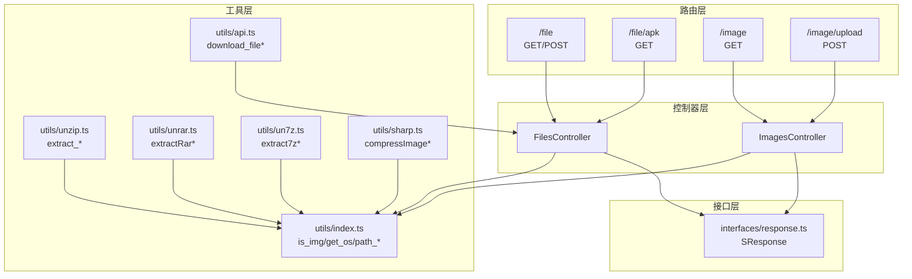
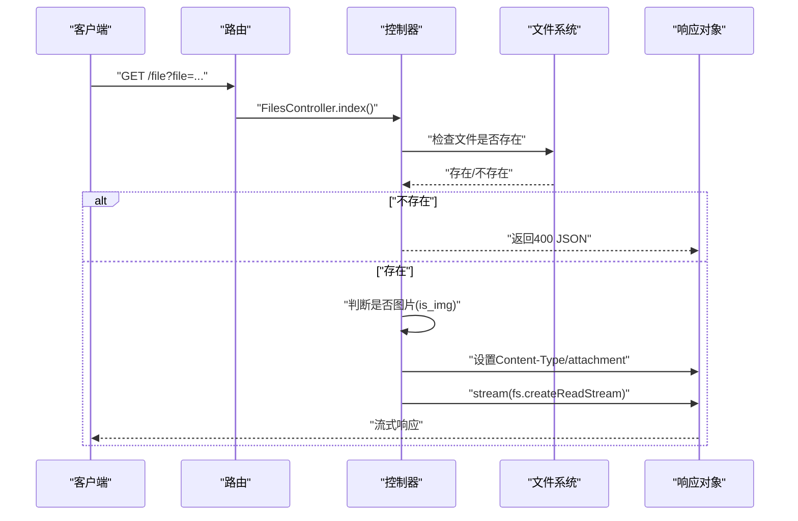
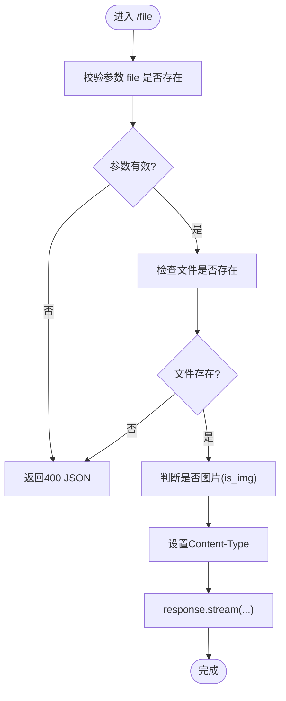
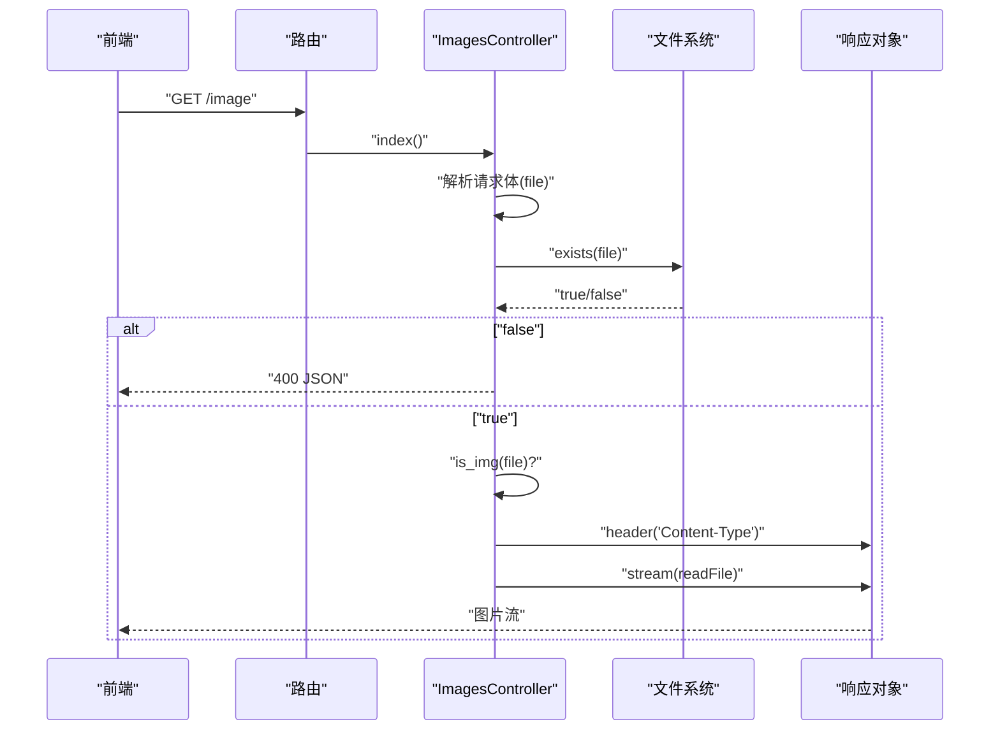
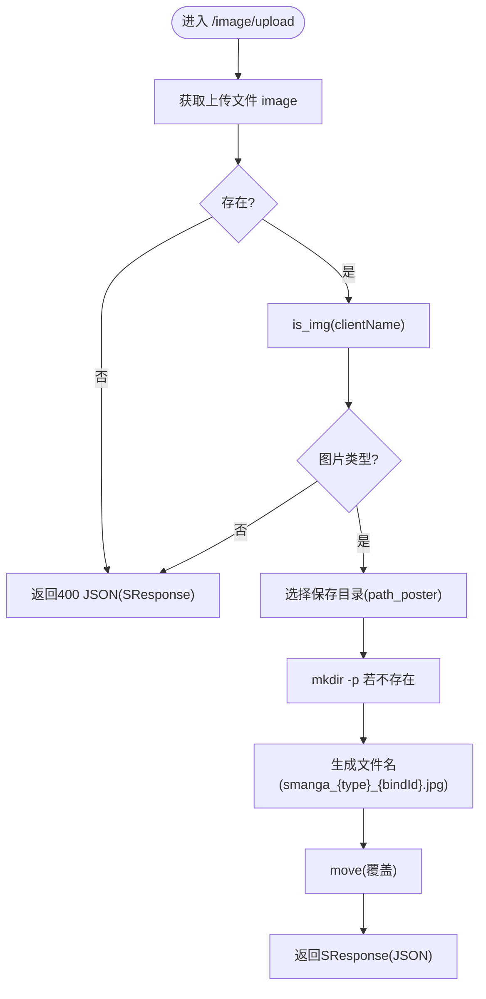
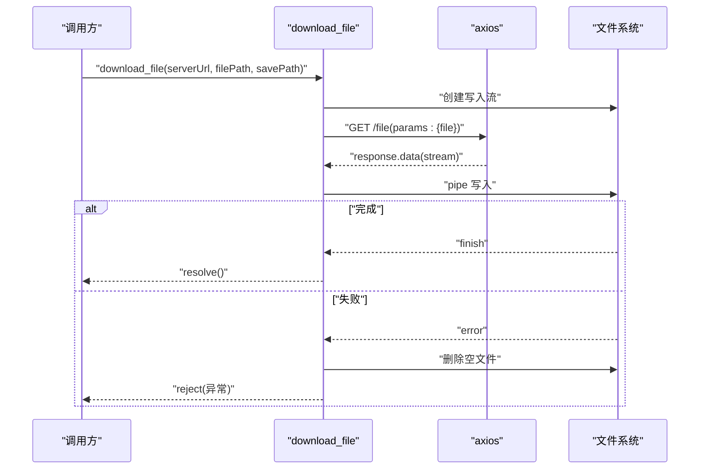
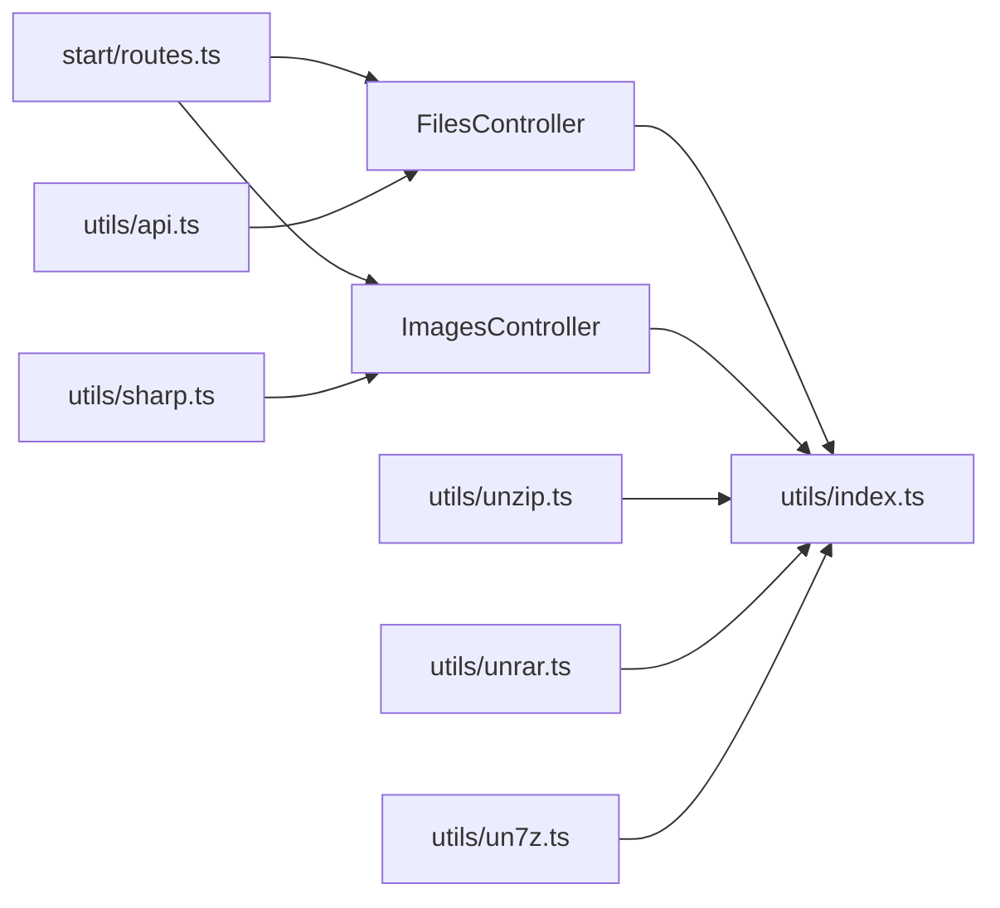

# 文件上传与下载

<cite>
**本文引用的文件**
- [app/controllers/files_controller.ts](file://app/controllers/files_controller.ts)
- [app/controllers/images_controller.ts](file://app/controllers/images_controller.ts)
- [app/utils/index.ts](file://app/utils/index.ts)
- [app/utils/api.ts](file://app/utils/api.ts)
- [app/interfaces/response.ts](file://app/interfaces/response.ts)
- [start/routes.ts](file://start/routes.ts)
- [app/utils/unzip.ts](file://app/utils/unzip.ts)
- [app/utils/unrar.ts](file://app/utils/unrar.ts)
- [app/utils/un7z.ts](file://app/utils/un7z.ts)
- [app/utils/sharp.ts](file://app/utils/sharp.ts)
</cite>

## 目录
1. [简介](#简介)
2. [项目结构](#项目结构)
3. [核心组件](#核心组件)
4. [架构总览](#架构总览)
5. [详细组件分析](#详细组件分析)
6. [依赖关系分析](#依赖关系分析)
7. [性能考量](#性能考量)
8. [故障排查指南](#故障排查指南)
9. [结论](#结论)
10. [附录](#附录)

## 简介
本文件围绕 SManga Adonis 的“文件上传与下载”能力，系统化梳理上传与下载的实现方式、安全校验策略、MIME 类型判定、文件存在性检查、流式传输与响应头设置、错误处理与最佳实践，并给出常见问题的定位与解决思路。重点覆盖以下方面：
- 上传：图片文件的类型校验、保存路径与命名策略、响应格式统一
- 下载：图片文件流传输、APK 文件下载、通用文件下载（通过路由 /file）
- 安全：路径存在性检查、文件类型判断、响应头设置、客户端流式下载
- 错误处理：统一响应结构、异常捕获与日志记录
- 最佳实践：流式传输、最小权限路径、重试与退避策略

## 项目结构
与文件上传下载直接相关的模块分布如下：
- 控制器层
  - 文件控制器：提供通用文件下载与 APK 下载入口
  - 图片控制器：提供图片上传与图片下载（基于路径）
- 工具层
  - 通用工具：平台识别、路径常量、图片类型判断
  - 解压工具：ZIP/RAR/7Z 的封面与元数据提取
  - 图像处理：图片尺寸压缩与质量控制
  - API 工具：服务端文件下载的客户端封装（带重试与退避）
- 接口层
  - 统一响应结构：前后端一致的返回格式
- 路由层
  - 定义 /file、/file/apk、/image、/image/upload 等接口

图表来源
- [start/routes.ts:237-241](file://start/routes.ts#L237-L241)
- [app/controllers/files_controller.ts:1-55](file://app/controllers/files_controller.ts#L1-L55)
- [app/controllers/images_controller.ts:1-114](file://app/controllers/images_controller.ts#L1-L114)
- [app/utils/index.ts:1-313](file://app/utils/index.ts#L1-L313)
- [app/utils/api.ts:1-178](file://app/utils/api.ts#L1-L178)
- [app/utils/unzip.ts:1-168](file://app/utils/unzip.ts#L1-L168)
- [app/utils/unrar.ts:1-118](file://app/utils/unrar.ts#L1-L118)
- [app/utils/un7z.ts:1-141](file://app/utils/un7z.ts#L1-L141)
- [app/utils/sharp.ts:1-181](file://app/utils/sharp.ts#L1-L181)
- [app/interfaces/response.ts:1-64](file://app/interfaces/response.ts#L1-L64)

章节来源
- [start/routes.ts:237-241](file://start/routes.ts#L237-L241)
- [app/controllers/files_controller.ts:1-55](file://app/controllers/files_controller.ts#L1-L55)
- [app/controllers/images_controller.ts:1-114](file://app/controllers/images_controller.ts#L1-L114)
- [app/utils/index.ts:1-313](file://app/utils/index.ts#L1-L313)
- [app/utils/api.ts:1-178](file://app/utils/api.ts#L1-L178)
- [app/utils/unzip.ts:1-168](file://app/utils/unzip.ts#L1-L168)
- [app/utils/unrar.ts:1-118](file://app/utils/unrar.ts#L1-L118)
- [app/utils/un7z.ts:1-141](file://app/utils/un7z.ts#L1-L141)
- [app/utils/sharp.ts:1-181](file://app/utils/sharp.ts#L1-L181)
- [app/interfaces/response.ts:1-64](file://app/interfaces/response.ts#L1-L64)

## 核心组件
- 文件控制器（FilesController）
  - 提供通用文件下载（GET/POST /file），根据文件路径读取并以流方式返回；对非图片文件设置二进制 MIME 类型
  - 提供 APK 下载（GET /file/apk），设置附件下载并返回文件内容
- 图片控制器（ImagesController）
  - 提供图片下载（GET /image）：基于路径校验与 MIME 判定，流式返回
  - 提供图片上传（POST /image/upload）：校验文件类型、选择保存目录、生成唯一文件名并移动文件
- 通用工具（utils/index.ts）
  - 平台识别、路径常量（poster/meta/cache/compress/config）、图片类型判断（is_img）
- 统一响应（interfaces/response.ts）
  - SResponse：统一的 code/message/data/error/status 结构
- 下载客户端（utils/api.ts）
  - download_file：基于 axios 的 GET /file 流式下载，带重试与退避，错误时清理空文件并记录日志
- 解压与封面提取（utils/unzip.ts、unrar.ts、un7z.ts）
  - ZIP/RAR/7Z 的封面与元数据提取，辅助扫描流程
- 图像处理（utils/sharp.ts）
  - 图片压缩至指定大小，按格式选择编码参数

章节来源
- [app/controllers/files_controller.ts:1-55](file://app/controllers/files_controller.ts#L1-L55)
- [app/controllers/images_controller.ts:1-114](file://app/controllers/images_controller.ts#L1-L114)
- [app/utils/index.ts:1-313](file://app/utils/index.ts#L1-L313)
- [app/interfaces/response.ts:1-64](file://app/interfaces/response.ts#L1-L64)
- [app/utils/api.ts:1-178](file://app/utils/api.ts#L1-L178)
- [app/utils/unzip.ts:1-168](file://app/utils/unzip.ts#L1-L168)
- [app/utils/unrar.ts:1-118](file://app/utils/unrar.ts#L1-L118)
- [app/utils/un7z.ts:1-141](file://app/utils/un7z.ts#L1-L141)
- [app/utils/sharp.ts:1-181](file://app/utils/sharp.ts#L1-L181)

## 架构总览
下图展示“文件下载”与“文件上传”的关键调用链路与职责边界。

图表来源
- [start/routes.ts:237-241](file://start/routes.ts#L237-L241)
- [app/controllers/files_controller.ts:7-34](file://app/controllers/files_controller.ts#L7-L34)

章节来源
- [start/routes.ts:237-241](file://start/routes.ts#L237-L241)
- [app/controllers/files_controller.ts:1-55](file://app/controllers/files_controller.ts#L1-L55)

## 详细组件分析

### 文件下载（通用与 APK）
- 路由映射
  - GET/POST /file：通用文件下载
  - GET /file/apk：APK 下载
- 安全与校验
  - 文件存在性检查：使用文件系统 API 判断路径是否存在
  - MIME 类型判定：若非图片扩展名，设置为二进制流类型
- 响应与传输
  - 通用下载：设置 Content-Type 并以流方式返回
  - APK 下载：使用附件模式（attachment）触发浏览器下载行为
- 错误处理
  - 缺失参数或文件不存在：返回 400 与统一响应结构

图表来源
- [app/controllers/files_controller.ts:7-34](file://app/controllers/files_controller.ts#L7-L34)

章节来源
- [app/controllers/files_controller.ts:1-55](file://app/controllers/files_controller.ts#L1-L55)
- [app/utils/index.ts:24-28](file://app/utils/index.ts#L24-L28)
- [start/routes.ts:237-241](file://start/routes.ts#L237-L241)

### 图片下载（基于路径）
- 功能点
  - 从请求体获取 file 参数
  - 存在性检查与 MIME 判定
  - 设置响应头并流式传输
- 适用场景
  - 前端传入本地图片路径，服务端直接转发

图表来源
- [app/controllers/images_controller.ts:9-29](file://app/controllers/images_controller.ts#L9-L29)

章节来源
- [app/controllers/images_controller.ts:1-114](file://app/controllers/images_controller.ts#L1-L114)
- [app/utils/index.ts:24-28](file://app/utils/index.ts#L24-L28)

### 图片上传（类型校验与保存）
- 路由映射：POST /image/upload
- 校验与保存流程
  - 获取上传字段 image
  - 校验文件类型（is_img）
  - 依据 mangaId/chapterId/mediaId 选择保存目录与文件名（poster 目录）
  - 确保目录存在，移动文件（覆盖）
  - 返回统一响应结构
- 响应格式
  - 使用 SResponse 统一返回 code/message/data/error/status

图表来源
- [app/controllers/images_controller.ts:35-112](file://app/controllers/images_controller.ts#L35-L112)
- [app/utils/index.ts:44-52](file://app/utils/index.ts#L44-L52)

章节来源
- [app/controllers/images_controller.ts:1-114](file://app/controllers/images_controller.ts#L1-L114)
- [app/utils/index.ts:1-313](file://app/utils/index.ts#L1-L313)
- [app/interfaces/response.ts:1-64](file://app/interfaces/response.ts#L1-L64)

### 客户端下载（流式与重试）
- 下载流程
  - 通过 axios 发起 GET /file，设置 responseType 为 stream
  - 使用管道将响应流写入本地文件
  - 完成后 resolve，失败时删除空文件并抛错
- 重试与退避
  - 支持最大重试次数、初始延迟与指数退避因子
  - 达到最大重试后记录错误日志并抛出异常

图表来源
- [app/utils/api.ts:75-176](file://app/utils/api.ts#L75-L176)

章节来源
- [app/utils/api.ts:1-178](file://app/utils/api.ts#L1-L178)

### MIME 类型与文件类型判断
- 图片类型判断
  - 通过扩展名正则判断是否为图片（支持多种格式）
- 非图片文件
  - 默认以二进制流类型返回，避免浏览器误解析
- 平台差异
  - Windows/Linux 使用不同根路径，影响文件路径与配置读取

章节来源
- [app/utils/index.ts:24-28](file://app/utils/index.ts#L24-L28)
- [app/utils/index.ts:9-18](file://app/utils/index.ts#L9-L18)

### 响应头设置与安全下载
- 图片下载
  - 设置 Content-Type 为图片或二进制类型
  - 使用流式传输，避免一次性加载到内存
- APK 下载
  - 使用附件模式（attachment）触发下载
- 安全建议
  - 限制可访问路径范围（如 poster/meta/cache）
  - 对外部输入路径进行白名单与规范化处理（建议）

章节来源
- [app/controllers/files_controller.ts:24-33](file://app/controllers/files_controller.ts#L24-L33)
- [app/controllers/files_controller.ts:50-53](file://app/controllers/files_controller.ts#L50-L53)
- [app/controllers/images_controller.ts:19-28](file://app/controllers/images_controller.ts#L19-L28)

### 错误处理与统一响应
- 统一响应结构
  - SResponse：code/message/data/error/status
- 常见错误
  - 上传：未找到文件、不支持的图片格式、缺少必要参数
  - 下载：参数缺失、文件不存在、写入失败
- 处理策略
  - 返回 400 JSON，携带错误码与消息
  - 下载失败时清理空文件并记录日志

章节来源
- [app/interfaces/response.ts:1-64](file://app/interfaces/response.ts#L1-L64)
- [app/controllers/images_controller.ts:44-88](file://app/controllers/images_controller.ts#L44-L88)
- [app/utils/api.ts:163-170](file://app/utils/api.ts#L163-L170)

## 依赖关系分析
- 控制器依赖
  - FilesController/ ImagesController 依赖 utils/index.ts 进行路径与类型判断
  - 下载客户端依赖 axios 进行流式下载
- 工具依赖
  - 解压工具依赖第三方库（AdmZip、unzipper、node-7z、node-unrar-js）
  - 图像处理依赖 sharp
- 路由依赖
  - 路由定义了 /file、/file/apk、/image、/image/upload 的映射

图表来源
- [start/routes.ts:237-241](file://start/routes.ts#L237-L241)
- [app/controllers/files_controller.ts:1-55](file://app/controllers/files_controller.ts#L1-L55)
- [app/controllers/images_controller.ts:1-114](file://app/controllers/images_controller.ts#L1-L114)
- [app/utils/index.ts:1-313](file://app/utils/index.ts#L1-L313)
- [app/utils/api.ts:1-178](file://app/utils/api.ts#L1-L178)
- [app/utils/unzip.ts:1-168](file://app/utils/unzip.ts#L1-L168)
- [app/utils/unrar.ts:1-118](file://app/utils/unrar.ts#L1-L118)
- [app/utils/un7z.ts:1-141](file://app/utils/un7z.ts#L1-L141)
- [app/utils/sharp.ts:1-181](file://app/utils/sharp.ts#L1-L181)

章节来源
- [start/routes.ts:237-241](file://start/routes.ts#L237-L241)
- [app/controllers/files_controller.ts:1-55](file://app/controllers/files_controller.ts#L1-L55)
- [app/controllers/images_controller.ts:1-114](file://app/controllers/images_controller.ts#L1-L114)
- [app/utils/index.ts:1-313](file://app/utils/index.ts#L1-L313)
- [app/utils/api.ts:1-178](file://app/utils/api.ts#L1-L178)
- [app/utils/unzip.ts:1-168](file://app/utils/unzip.ts#L1-L168)
- [app/utils/unrar.ts:1-118](file://app/utils/unrar.ts#L1-L118)
- [app/utils/un7z.ts:1-141](file://app/utils/un7z.ts#L1-L141)
- [app/utils/sharp.ts:1-181](file://app/utils/sharp.ts#L1-L181)

## 性能考量
- 流式传输
  - 使用流式读取与响应，降低内存占用，适合大文件下载
- 压缩与质量控制
  - 图片压缩采用多轮质量迭代或预设质量，平衡体积与清晰度
- I/O 优化
  - 仅在必要时读取文件头或元数据，避免不必要的磁盘访问
- 并发与队列
  - 扫描与解压流程可结合任务队列异步执行，避免阻塞主线程

## 故障排查指南
- 下载返回 400
  - 检查 /file 请求参数 file 是否传递
  - 检查文件是否存在且可读
- 浏览器无法正确显示图片
  - 确认 Content-Type 设置是否为图片类型
  - 确认 is_img 判断逻辑与扩展名一致
- APK 下载未触发下载
  - 确认使用了附件模式（attachment）并设置了正确的文件名
- 上传失败
  - 检查上传字段名称与类型（仅允许图片）
  - 检查保存目录权限与空间
- 下载失败重试
  - 观察日志中重试次数与退避延迟
  - 确认网络连通性与服务器磁盘状态

章节来源
- [app/controllers/files_controller.ts:10-22](file://app/controllers/files_controller.ts#L10-L22)
- [app/controllers/files_controller.ts:42-48](file://app/controllers/files_controller.ts#L42-L48)
- [app/utils/api.ts:158-170](file://app/utils/api.ts#L158-L170)
- [app/utils/index.ts:24-28](file://app/utils/index.ts#L24-L28)

## 结论
SManga Adonis 的文件上传与下载能力以简洁的控制器与工具函数为核心，实现了：
- 安全的文件存在性检查与类型判断
- 流式传输与合理的响应头设置
- 统一的错误响应结构与客户端下载重试机制
建议在生产环境中进一步强化：
- 路径白名单与规范化
- 访问鉴权与速率限制
- 大文件分块与断点续传（如需）
- 更细粒度的日志与监控

## 附录
- 常用接口
  - GET /file?file=...：通用文件下载（图片/二进制）
  - POST /file：同上（兼容 POST）
  - GET /file/apk：APK 下载
  - GET /image：基于路径的图片下载
  - POST /image/upload：图片上传（支持多类型图片）
- 关键实现参考
  - [文件下载实现:7-34](file://app/controllers/files_controller.ts#L7-L34)
  - [APK 下载实现:36-54](file://app/controllers/files_controller.ts#L36-L54)
  - [图片下载实现:9-29](file://app/controllers/images_controller.ts#L9-L29)
  - [图片上传实现:35-112](file://app/controllers/images_controller.ts#L35-L112)
  - [统一响应结构:18-33](file://app/interfaces/response.ts#L18-L33)
  - [客户端下载与重试:75-176](file://app/utils/api.ts#L75-L176)
  - [图片类型判断:24-28](file://app/utils/index.ts#L24-L28)
  - [路径与平台适配:9-18](file://app/utils/index.ts#L9-L18)