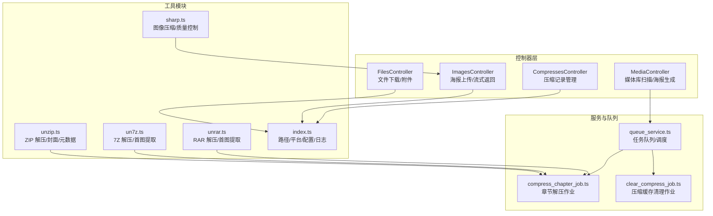
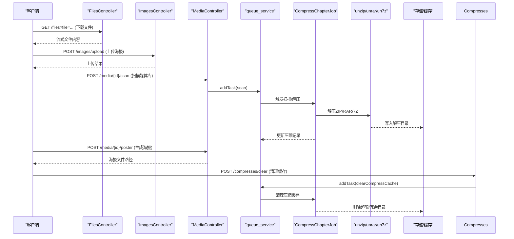
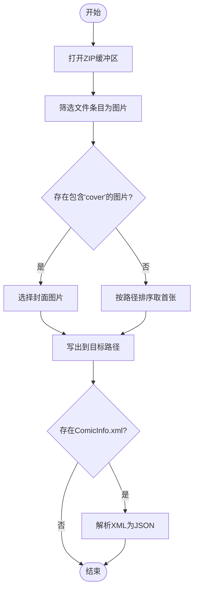
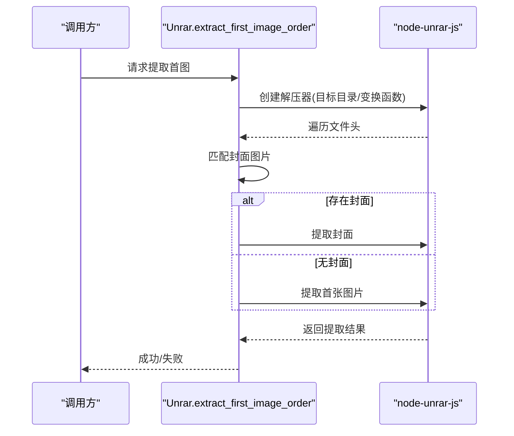
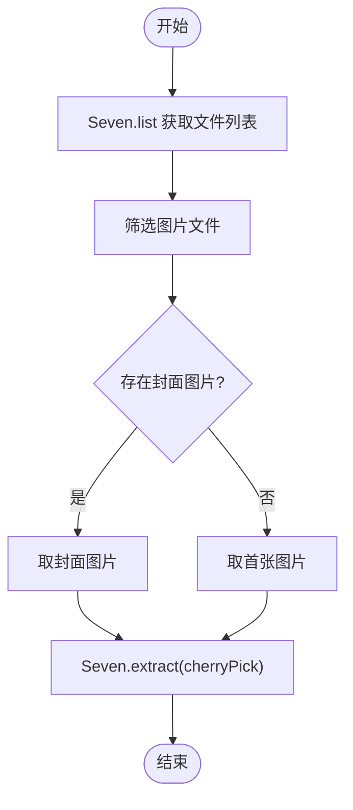
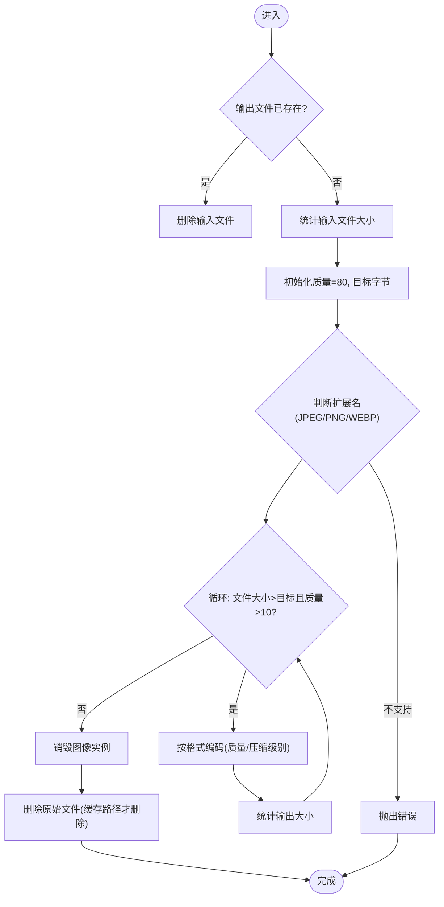
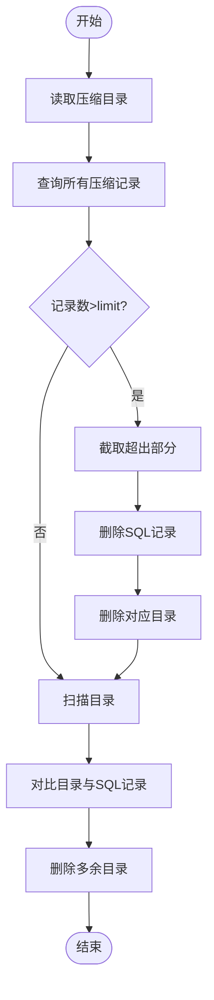
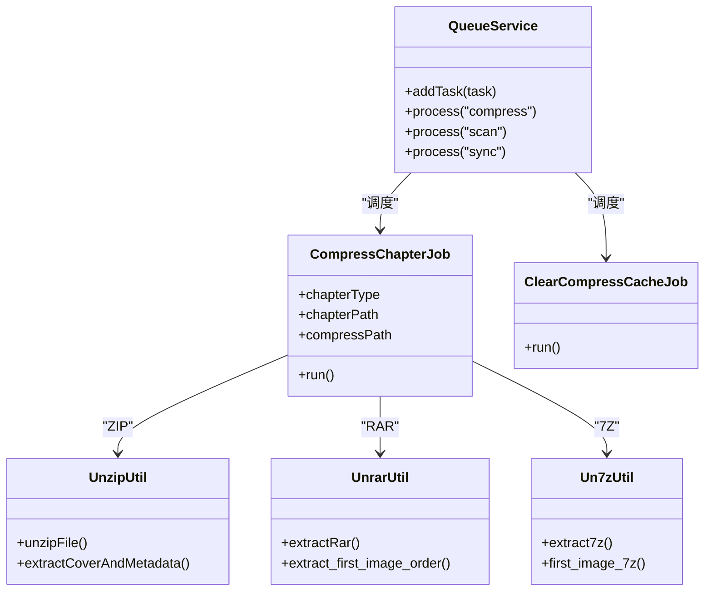
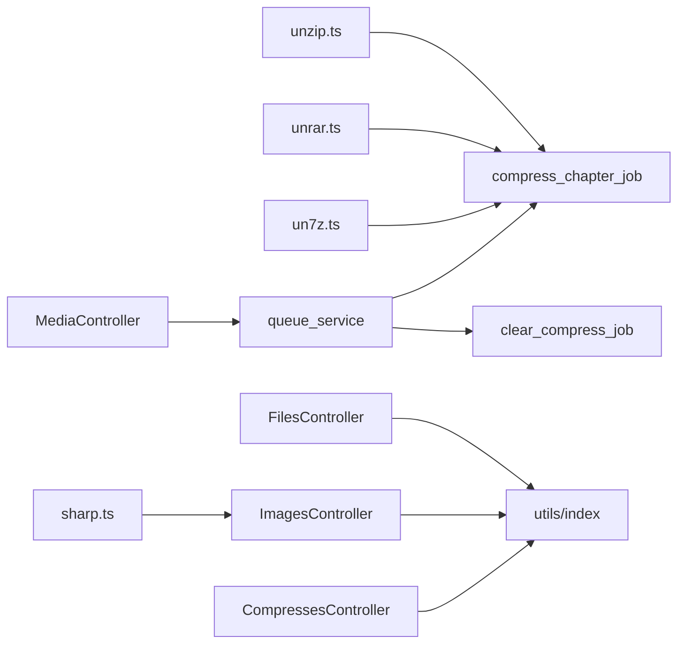

# 文件处理系统

<cite>
**本文引用的文件**
- [app/controllers/files_controller.ts](file://app/controllers/files_controller.ts)
- [app/controllers/images_controller.ts](file://app/controllers/images_controller.ts)
- [app/controllers/compresses_controller.ts](file://app/controllers/compresses_controller.ts)
- [app/utils/unzip.ts](file://app/utils/unzip.ts)
- [app/utils/un7z.ts](file://app/utils/un7z.ts)
- [app/utils/unrar.ts](file://app/utils/unrar.ts)
- [app/utils/sharp.ts](file://app/utils/sharp.ts)
- [app/utils/index.ts](file://app/utils/index.ts)
- [app/services/compress_chapter_job.ts](file://app/services/compress_chapter_job.ts)
- [app/services/clear_compress_job.ts](file://app/services/clear_compress_job.ts)
- [app/services/queue_service.ts](file://app/services/queue_service.ts)
- [app/controllers/media_controller.ts](file://app/controllers/media_controller.ts)
- [config/app.ts](file://config/app.ts)
</cite>

## 目录
1. [简介](#简介)
2. [项目结构](#项目结构)
3. [核心组件](#核心组件)
4. [架构总览](#架构总览)
5. [详细组件分析](#详细组件分析)
6. [依赖关系分析](#依赖关系分析)
7. [性能考虑](#性能考虑)
8. [故障排查指南](#故障排查指南)
9. [结论](#结论)
10. [附录](#附录)

## 简介
本文件处理系统围绕漫画文件的上传、解压、图像处理与缓存管理展开，覆盖以下能力：
- 多格式压缩包支持：ZIP、7Z、RAR
- 图像提取与封面识别：自动定位首张图片、优先封面图
- 图像压缩与质量控制：按目标大小迭代压缩、PNG/WebP/JPEG差异化策略
- 存储策略与缓存清理：基于配置的上限与冗余清理
- 安全与权限：上传校验、路径存在性检查、MIME 类型设置
- 批量解压与队列化处理：通过任务队列异步执行解压与清理

## 项目结构
文件处理系统主要由控制器、工具模块、服务作业与队列组成，形成“请求—作业—存储”的清晰分层。

图表来源
- [app/controllers/files_controller.ts:1-55](file://app/controllers/files_controller.ts#L1-L55)
- [app/controllers/images_controller.ts:1-114](file://app/controllers/images_controller.ts#L1-L114)
- [app/controllers/compresses_controller.ts:1-147](file://app/controllers/compresses_controller.ts#L1-L147)
- [app/utils/unzip.ts:1-168](file://app/utils/unzip.ts#L1-L168)
- [app/utils/un7z.ts:1-141](file://app/utils/un7z.ts#L1-L141)
- [app/utils/unrar.ts:1-118](file://app/utils/unrar.ts#L1-L118)
- [app/utils/sharp.ts:1-181](file://app/utils/sharp.ts#L1-L181)
- [app/utils/index.ts:1-313](file://app/utils/index.ts#L1-L313)
- [app/services/queue_service.ts:1-267](file://app/services/queue_service.ts#L1-L267)
- [app/services/compress_chapter_job.ts:1-71](file://app/services/compress_chapter_job.ts#L1-L71)
- [app/services/clear_compress_job.ts:1-56](file://app/services/clear_compress_job.ts#L1-L56)
- [app/controllers/media_controller.ts:1-206](file://app/controllers/media_controller.ts#L1-L206)

章节来源
- [app/controllers/files_controller.ts:1-55](file://app/controllers/files_controller.ts#L1-L55)
- [app/controllers/images_controller.ts:1-114](file://app/controllers/images_controller.ts#L1-L114)
- [app/controllers/compresses_controller.ts:1-147](file://app/controllers/compresses_controller.ts#L1-L147)
- [app/utils/unzip.ts:1-168](file://app/utils/unzip.ts#L1-L168)
- [app/utils/un7z.ts:1-141](file://app/utils/un7z.ts#L1-L141)
- [app/utils/unrar.ts:1-118](file://app/utils/unrar.ts#L1-L118)
- [app/utils/sharp.ts:1-181](file://app/utils/sharp.ts#L1-L181)
- [app/utils/index.ts:1-313](file://app/utils/index.ts#L1-L313)
- [app/services/queue_service.ts:1-267](file://app/services/queue_service.ts#L1-L267)
- [app/services/compress_chapter_job.ts:1-71](file://app/services/compress_chapter_job.ts#L1-L71)
- [app/services/clear_compress_job.ts:1-56](file://app/services/clear_compress_job.ts#L1-L56)
- [app/controllers/media_controller.ts:1-206](file://app/controllers/media_controller.ts#L1-L206)

## 核心组件
- 文件下载与附件
  - 提供指定路径文件的流式返回与附件下载，内置存在性与MIME校验。
- 海报上传与流式返回
  - 支持上传海报并按 manga/chapter/media 绑定命名；返回流式图片内容。
- 压缩记录管理
  - 提供压缩记录的增删改查、批量删除与清理任务触发。
- ZIP/RAR/7Z 解压工具
  - ZIP：AdmZip 全量解压、首图提取、封面提取、ComicInfo.xml 解析。
  - RAR：node-unrar-js 全量解压、首图提取（含封面优先）。
  - 7Z：node-7z 流式解压、首图提取（含封面优先）。
- 图像处理与压缩
  - 基于 sharp 的多格式压缩，按目标大小迭代降低质量，PNG 使用压缩级别映射。
- 存储与缓存
  - 跨平台路径解析（data 目录），压缩缓存上限与冗余清理。
- 任务队列与作业
  - 通过 Bull 队列调度章节解压与缓存清理作业，支持优先级与指数退避重试。

章节来源
- [app/controllers/files_controller.ts:7-34](file://app/controllers/files_controller.ts#L7-L34)
- [app/controllers/images_controller.ts:35-112](file://app/controllers/images_controller.ts#L35-L112)
- [app/controllers/compresses_controller.ts:30-105](file://app/controllers/compresses_controller.ts#L30-L105)
- [app/utils/unzip.ts:10-114](file://app/utils/unzip.ts#L10-L114)
- [app/utils/unrar.ts:7-115](file://app/utils/unrar.ts#L7-L115)
- [app/utils/un7z.ts:12-137](file://app/utils/un7z.ts#L12-L137)
- [app/utils/sharp.ts:12-89](file://app/utils/sharp.ts#L12-L89)
- [app/utils/index.ts:64-82](file://app/utils/index.ts#L64-L82)
- [app/services/queue_service.ts:49-66](file://app/services/queue_service.ts#L49-L66)
- [app/services/compress_chapter_job.ts:31-65](file://app/services/compress_chapter_job.ts#L31-L65)
- [app/services/clear_compress_job.ts:14-54](file://app/services/clear_compress_job.ts#L14-L54)

## 架构总览
系统采用“控制器接收请求—工具模块处理业务—服务作业异步执行—队列持久化”的模式，保证高并发与可维护性。

图表来源
- [app/controllers/files_controller.ts:7-34](file://app/controllers/files_controller.ts#L7-L34)
- [app/controllers/images_controller.ts:35-112](file://app/controllers/images_controller.ts#L35-L112)
- [app/controllers/media_controller.ts:187-204](file://app/controllers/media_controller.ts#L187-L204)
- [app/services/queue_service.ts:175-264](file://app/services/queue_service.ts#L175-L264)
- [app/services/compress_chapter_job.ts:31-65](file://app/services/compress_chapter_job.ts#L31-L65)
- [app/utils/unzip.ts:10-114](file://app/utils/unzip.ts#L10-L114)
- [app/utils/unrar.ts:7-115](file://app/utils/unrar.ts#L7-L115)
- [app/utils/un7z.ts:12-137](file://app/utils/un7z.ts#L12-L137)
- [app/services/clear_compress_job.ts:14-54](file://app/services/clear_compress_job.ts#L14-L54)

## 详细组件分析

### 文件下载与附件（FilesController）
- 功能要点
  - 校验请求参数与文件存在性，设置 Content-Type 或 attachment。
  - 流式返回文件内容，支持非图片二进制类型。
- 安全与健壮性
  - 缺失参数与路径错误返回明确状态码与消息。
  - MIME 类型根据 is_img 判定，避免错误类型泄露。
- 使用场景
  - 下载 APK、图片直链访问、通用文件下载。

章节来源
- [app/controllers/files_controller.ts:7-34](file://app/controllers/files_controller.ts#L7-L34)
- [app/utils/index.ts:24-28](file://app/utils/index.ts#L24-L28)

### 海报上传与流式返回（ImagesController）
- 功能要点
  - 接收 multipart/form-data 中的 image 字段，校验扩展名。
  - 按 manga/chapter/media 绑定生成唯一文件名，保存至 poster 目录。
  - 支持流式返回海报文件内容。
- 安全与健壮性
  - 严格校验图片扩展名，拒绝非图片类型。
  - 必须提供三者之一的绑定 ID，避免无主文件。
- 使用场景
  - 媒体库/漫画/章节封面上传与展示。

章节来源
- [app/controllers/images_controller.ts:35-112](file://app/controllers/images_controller.ts#L35-L112)
- [app/utils/index.ts:44-52](file://app/utils/index.ts#L44-L52)

### 压缩记录管理（CompressesController）
- 功能要点
  - 分页查询、新增、详情、更新、单/批量删除。
  - 删除时联动物理文件删除。
  - 提供清理压缩缓存的任务入口。
- 使用场景
  - 管理解压产物目录与记录一致性。

章节来源
- [app/controllers/compresses_controller.ts:8-28](file://app/controllers/compresses_controller.ts#L8-L28)
- [app/controllers/compresses_controller.ts:30-105](file://app/controllers/compresses_controller.ts#L30-L105)
- [app/controllers/compresses_controller.ts:137-145](file://app/controllers/compresses_controller.ts#L137-L145)

### ZIP 解压与元数据（unzip.ts）
- 功能要点
  - 全量解压、首图提取（顺序/带封面优先）、封面提取、ComicInfo.xml 解析。
- 算法与流程
  - 使用 unzipper.Open.buffer 遍历条目，筛选图片与 ComicInfo.xml。
  - 封面优先策略：名称包含 cover 的图片优先，否则按路径排序取首张。
- 错误处理
  - 异常捕获并返回布尔结果，便于上层作业处理。

图表来源
- [app/utils/unzip.ts:17-50](file://app/utils/unzip.ts#L17-L50)
- [app/utils/unzip.ts:52-80](file://app/utils/unzip.ts#L52-L80)
- [app/utils/unzip.ts:82-114](file://app/utils/unzip.ts#L82-L114)
- [app/utils/unzip.ts:122-168](file://app/utils/unzip.ts#L122-L168)

章节来源
- [app/utils/unzip.ts:10-114](file://app/utils/unzip.ts#L10-L114)
- [app/utils/unzip.ts:122-168](file://app/utils/unzip.ts#L122-L168)

### RAR 解压与首图（unrar.ts）
- 功能要点
  - 全量解压、按需提取首图（优先封面）。
- 算法与流程
  - 使用 node-unrar-js 的 createExtractorFromFile，通过回调筛选图片。
  - 若存在封面图片则优先提取，否则按顺序提取第一张图片。

图表来源
- [app/utils/unrar.ts:64-115](file://app/utils/unrar.ts#L64-L115)

章节来源
- [app/utils/unrar.ts:7-115](file://app/utils/unrar.ts#L7-L115)

### 7Z 解压与首图（un7z.ts）
- 功能要点
  - 全量解压（Promise 包装）、列出内容、首图提取（含封面优先）。
- 算法与流程
  - 通过 Seven.list 获取文件列表，筛选图片后优先封面，否则取首张。
  - 使用 $cherryPick 精确提取单个文件，减少 IO。

图表来源
- [app/utils/un7z.ts:34-54](file://app/utils/un7z.ts#L34-L54)
- [app/utils/un7z.ts:56-86](file://app/utils/un7z.ts#L56-L86)
- [app/utils/un7z.ts:88-137](file://app/utils/un7z.ts#L88-L137)

章节来源
- [app/utils/un7z.ts:12-137](file://app/utils/un7z.ts#L12-L137)

### 图像压缩与质量控制（sharp.ts）
- 功能要点
  - 按目标大小（KB）迭代压缩，JPEG/PNG/WebP 差异化参数。
  - PNG 使用压缩级别与质量联动映射，避免过度压缩。
- 算法与流程
  - 初始质量 80，每次递减 10，直到文件小于目标大小或质量下限 10。
  - 若初始文件即小于目标大小，直接复制并删除原文件。
  - 仅在缓存路径命中时删除原文件，避免误删其他目录。

图表来源
- [app/utils/sharp.ts:12-89](file://app/utils/sharp.ts#L12-L89)

章节来源
- [app/utils/sharp.ts:12-89](file://app/utils/sharp.ts#L12-L89)

### 存储策略与缓存清理（index.ts + clear_compress_job.ts）
- 存储策略
  - 跨平台 data 目录：meta/poster/cache/compress/config/logs。
  - 压缩缓存目录 path_compress，统一管理解压产物。
- 缓存清理
  - 依据配置 compress.limit 控制定额，超过限额删除最早记录与对应目录。
  - 扫描压缩目录，删除数据库中不存在的冗余文件夹。

图表来源
- [app/utils/index.ts:64-82](file://app/utils/index.ts#L64-L82)
- [app/services/clear_compress_job.ts:14-54](file://app/services/clear_compress_job.ts#L14-L54)

章节来源
- [app/utils/index.ts:64-82](file://app/utils/index.ts#L64-L82)
- [app/services/clear_compress_job.ts:14-54](file://app/services/clear_compress_job.ts#L14-L54)

### 任务队列与作业（queue_service.ts + compress_chapter_job.ts + clear_compress_job.ts）
- 任务队列
  - Bull Redis 队列，按任务类型路由到不同处理器（scan/sync/compress）。
  - 支持优先级、超时、指数退避重试。
- 作业
  - CompressChapterJob：根据压缩类型调用对应解压工具，更新数据库记录。
  - ClearCompressCacheJob：执行缓存清理逻辑。

图表来源
- [app/services/queue_service.ts:49-66](file://app/services/queue_service.ts#L49-L66)
- [app/services/queue_service.ts:103-141](file://app/services/queue_service.ts#L103-L141)
- [app/services/compress_chapter_job.ts:31-65](file://app/services/compress_chapter_job.ts#L31-L65)
- [app/services/clear_compress_job.ts:14-54](file://app/services/clear_compress_job.ts#L14-L54)
- [app/utils/unzip.ts:10-114](file://app/utils/unzip.ts#L10-L114)
- [app/utils/unrar.ts:7-115](file://app/utils/unrar.ts#L7-L115)
- [app/utils/un7z.ts:12-137](file://app/utils/un7z.ts#L12-L137)

章节来源
- [app/services/queue_service.ts:1-267](file://app/services/queue_service.ts#L1-L267)
- [app/services/compress_chapter_job.ts:1-71](file://app/services/compress_chapter_job.ts#L1-L71)
- [app/services/clear_compress_job.ts:1-56](file://app/services/clear_compress_job.ts#L1-L56)

## 依赖关系分析
- 控制器依赖工具模块与服务层，负责输入校验与响应封装。
- 工具模块依赖第三方库（AdmZip、node-unrar-js、node-7z、sharp），承担具体业务逻辑。
- 服务层通过队列解耦耗时操作，避免阻塞请求线程。
- 配置与路径模块提供跨平台兼容性与集中化管理。

图表来源
- [app/controllers/files_controller.ts:1-55](file://app/controllers/files_controller.ts#L1-L55)
- [app/controllers/images_controller.ts:1-114](file://app/controllers/images_controller.ts#L1-L114)
- [app/controllers/compresses_controller.ts:1-147](file://app/controllers/compresses_controller.ts#L1-L147)
- [app/utils/unzip.ts:1-168](file://app/utils/unzip.ts#L1-L168)
- [app/utils/unrar.ts:1-118](file://app/utils/unrar.ts#L1-L118)
- [app/utils/un7z.ts:1-141](file://app/utils/un7z.ts#L1-L141)
- [app/utils/sharp.ts:1-181](file://app/utils/sharp.ts#L1-L181)
- [app/utils/index.ts:1-313](file://app/utils/index.ts#L1-L313)
- [app/services/queue_service.ts:1-267](file://app/services/queue_service.ts#L1-L267)
- [app/services/compress_chapter_job.ts:1-71](file://app/services/compress_chapter_job.ts#L1-L71)
- [app/services/clear_compress_job.ts:1-56](file://app/services/clear_compress_job.ts#L1-L56)

## 性能考虑
- 异步与队列
  - 解压与缓存清理通过队列异步执行，避免请求阻塞。
  - 指数退避与最大重试次数降低瞬时压力。
- I/O 优化
  - 7Z 使用 $cherryPick 精准提取首图，减少不必要的解压。
  - ZIP/RAR 仅在必要时解析 ComicInfo.xml，避免额外开销。
- 图像压缩
  - 迭代压缩避免多次 IO，PNG 压缩级别与质量联动映射提升效率。
- 存储上限
  - 通过 compress.limit 控制缓存规模，定期清理冗余目录。

## 故障排查指南
- 文件下载失败
  - 检查 file 参数与文件存在性；确认 is_img 判定与 Content-Type 设置。
- 海报上传失败
  - 确认上传字段名与扩展名校验；检查 poster 目录权限与磁盘空间。
- 解压任务异常
  - 查看队列日志与作业错误堆栈；确认压缩包格式与第三方库可用性。
- 缓存清理无效
  - 检查 compress.limit 配置；确认压缩目录与数据库记录一致性。
- 图像压缩未生效
  - 核对目标大小与格式支持；确认 sharp 编码参数与质量下限。

章节来源
- [app/controllers/files_controller.ts:10-22](file://app/controllers/files_controller.ts#L10-L22)
- [app/controllers/images_controller.ts:42-60](file://app/controllers/images_controller.ts#L42-L60)
- [app/services/queue_service.ts:41-47](file://app/services/queue_service.ts#L41-L47)
- [app/services/compress_chapter_job.ts:66-69](file://app/services/compress_chapter_job.ts#L66-L69)
- [app/services/clear_compress_job.ts:20-24](file://app/services/clear_compress_job.ts#L20-L24)
- [app/utils/sharp.ts:85-88](file://app/utils/sharp.ts#L85-L88)

## 结论
本文件处理系统以清晰的分层设计实现了多格式压缩包解压、图像处理与缓存管理，结合队列化与配置化的策略，兼顾了易用性与可维护性。建议后续增强：
- 增加文件完整性校验（如哈希比对）与断点续传支持；
- 丰富图像处理能力（尺寸裁剪、格式转换、批处理）；
- 引入更细粒度的权限控制与审计日志。

## 附录
- 关键路径与配置
  - 数据目录：meta/poster/cache/compress/config/logs
  - 队列配置：并发数、重试次数、超时时间
  - 缓存上限：compress.limit

章节来源
- [app/utils/index.ts:34-115](file://app/utils/index.ts#L34-L115)
- [app/services/queue_service.ts:17-32](file://app/services/queue_service.ts#L17-L32)
- [app/services/clear_compress_job.ts:18](file://app/services/clear_compress_job.ts#L18)