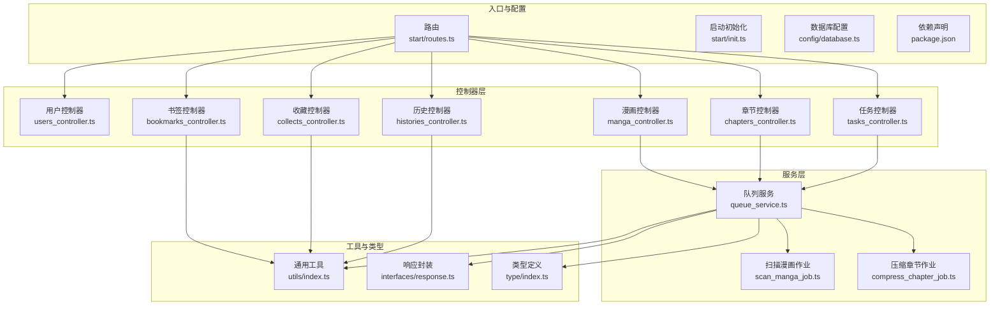
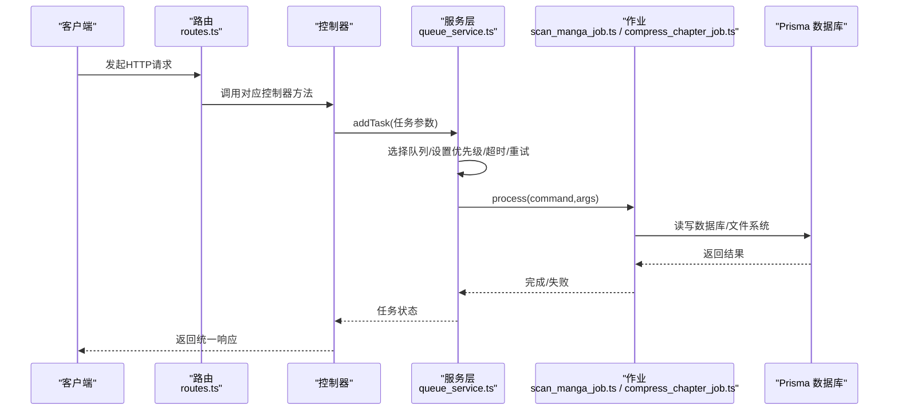
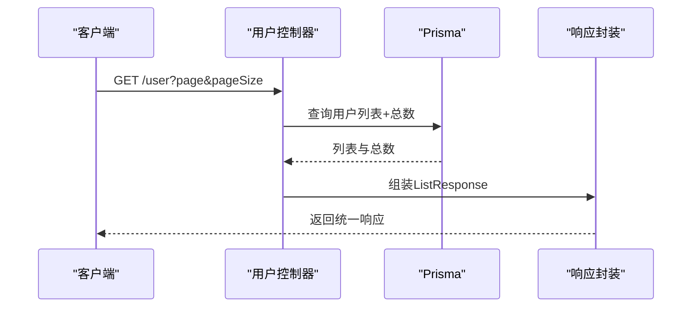
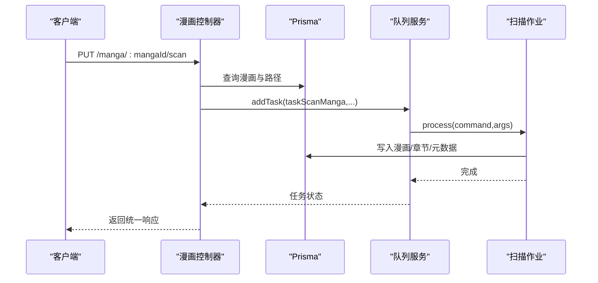
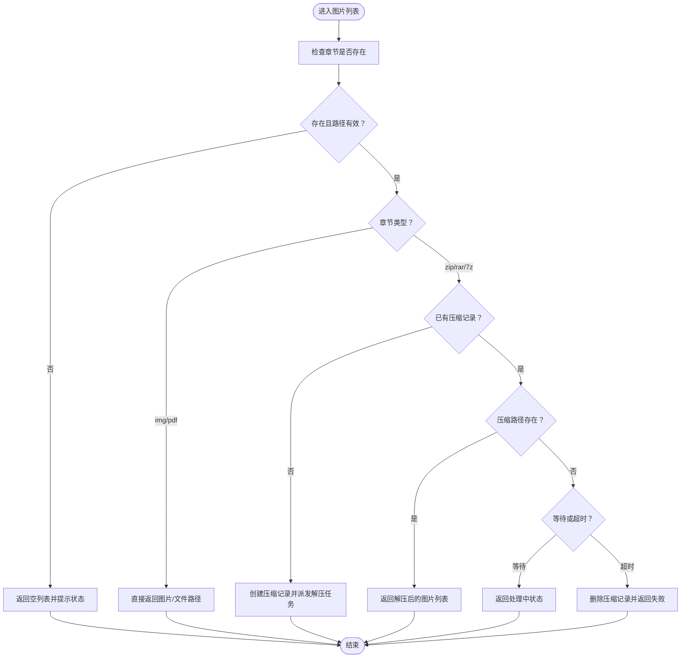
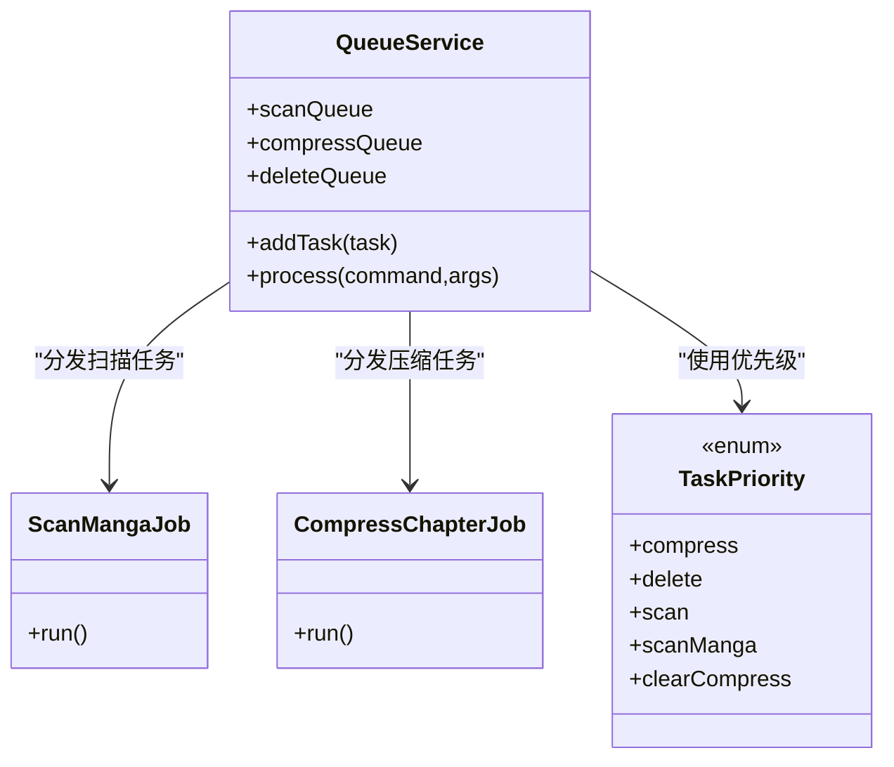
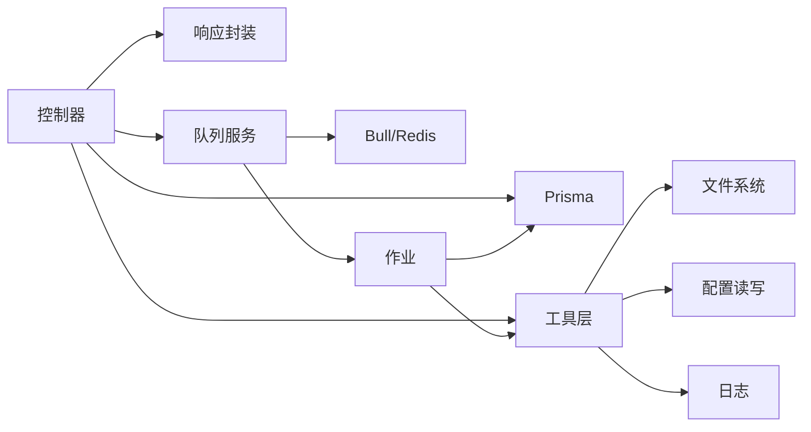

# 核心功能模块

<cite>
**本文引用的文件**
- [app/controllers/users_controller.ts](file://app/controllers/users_controller.ts)
- [app/controllers/manga_controller.ts](file://app/controllers/manga_controller.ts)
- [app/controllers/chapters_controller.ts](file://app/controllers/chapters_controller.ts)
- [app/controllers/bookmarks_controller.ts](file://app/controllers/bookmarks_controller.ts)
- [app/controllers/collects_controller.ts](file://app/controllers/collects_controller.ts)
- [app/controllers/histories_controller.ts](file://app/controllers/histories_controller.ts)
- [app/controllers/tasks_controller.ts](file://app/controllers/tasks_controller.ts)
- [app/services/queue_service.ts](file://app/services/queue_service.ts)
- [app/services/scan_manga_job.ts](file://app/services/scan_manga_job.ts)
- [app/services/compress_chapter_job.ts](file://app/services/compress_chapter_job.ts)
- [app/utils/index.ts](file://app/utils/index.ts)
- [app/interfaces/response.ts](file://app/interfaces/response.ts)
- [app/type/index.ts](file://app/type/index.ts)
- [start/routes.ts](file://start/routes.ts)
- [start/init.ts](file://start/init.ts)
- [config/database.ts](file://config/database.ts)
- [package.json](file://package.json)
</cite>

## 目录
1. [简介](#简介)
2. [项目结构](#项目结构)
3. [核心组件](#核心组件)
4. [架构总览](#架构总览)
5. [详细组件分析](#详细组件分析)
6. [依赖分析](#依赖分析)
7. [性能考量](#性能考量)
8. [故障排查指南](#故障排查指南)
9. [结论](#结论)
10. [附录](#附录)

## 简介
本文件面向 SManga Adonis 的核心功能模块，系统化梳理用户管理、漫画管理、章节管理、收藏系统、任务调度与文件处理等模块的设计理念、实现方式与相互关系。文档从架构、数据流、接口设计、错误处理与性能优化等方面进行深入解析，并提供模块间集成模式与通信机制说明，帮助开发者快速理解与高效维护。

## 项目结构
SManga Adonis 基于 AdonisJS 构建，采用控制器-服务-工具-类型-路由的分层组织方式。核心模块围绕“漫画资源管理”与“异步任务编排”两大主线展开：控制器负责请求接入与响应封装；服务层封装业务流程与任务派发；工具层提供通用能力（文件系统、压缩解压、日志、配置）；类型层定义任务优先级与元数据键；路由层统一暴露 REST 接口。

图表来源
- [start/routes.ts:10-241](file://start/routes.ts#L10-L241)
- [app/controllers/users_controller.ts:1-160](file://app/controllers/users_controller.ts#L1-L160)
- [app/controllers/manga_controller.ts:1-460](file://app/controllers/manga_controller.ts#L1-L460)
- [app/controllers/chapters_controller.ts:1-515](file://app/controllers/chapters_controller.ts#L1-L515)
- [app/controllers/bookmarks_controller.ts:1-201](file://app/controllers/bookmarks_controller.ts#L1-L201)
- [app/controllers/collects_controller.ts:1-281](file://app/controllers/collects_controller.ts#L1-L281)
- [app/controllers/histories_controller.ts:1-270](file://app/controllers/histories_controller.ts#L1-L270)
- [app/controllers/tasks_controller.ts:1-55](file://app/controllers/tasks_controller.ts#L1-L55)
- [app/services/queue_service.ts:1-267](file://app/services/queue_service.ts#L1-L267)
- [app/services/scan_manga_job.ts:1-800](file://app/services/scan_manga_job.ts#L1-L800)
- [app/services/compress_chapter_job.ts:1-71](file://app/services/compress_chapter_job.ts#L1-L71)
- [app/utils/index.ts:1-313](file://app/utils/index.ts#L1-L313)
- [app/interfaces/response.ts:1-64](file://app/interfaces/response.ts#L1-L64)
- [app/type/index.ts:1-49](file://app/type/index.ts#L1-L49)
- [config/database.ts:1-24](file://config/database.ts#L1-L24)
- [package.json:1-100](file://package.json#L1-L100)

章节来源
- [start/routes.ts:10-241](file://start/routes.ts#L10-L241)
- [package.json:16-36](file://package.json#L16-L36)

## 核心组件
- 用户管理模块：提供用户 CRUD、权限校验与配置读取，支持媒体库权限控制与角色管理。
- 漫画管理模块：提供漫画列表/详情、元数据编辑、标签管理、批量扫描、压缩与清理等能力。
- 章节管理模块：提供章节列表/详情、图片列表、下载、压缩状态管理与解压缓存清理。
- 收藏系统：提供漫画/章节收藏与取消收藏，支持分页与统计未读数量。
- 历史记录：提供阅读历史、最后阅读位置、全本已读/未读标记等。
- 任务调度系统：基于 Redis 的 Bull 队列，统一派发扫描、压缩、删除、同步等异步任务。
- 文件处理系统：提供路径管理、图片提取、压缩包解压、日志与配置读写等工具能力。

章节来源
- [app/controllers/users_controller.ts:1-160](file://app/controllers/users_controller.ts#L1-L160)
- [app/controllers/manga_controller.ts:1-460](file://app/controllers/manga_controller.ts#L1-L460)
- [app/controllers/chapters_controller.ts:1-515](file://app/controllers/chapters_controller.ts#L1-L515)
- [app/controllers/bookmarks_controller.ts:1-201](file://app/controllers/bookmarks_controller.ts#L1-L201)
- [app/controllers/collects_controller.ts:1-281](file://app/controllers/collects_controller.ts#L1-L281)
- [app/controllers/histories_controller.ts:1-270](file://app/controllers/histories_controller.ts#L1-L270)
- [app/controllers/tasks_controller.ts:1-55](file://app/controllers/tasks_controller.ts#L1-L55)
- [app/services/queue_service.ts:1-267](file://app/services/queue_service.ts#L1-L267)
- [app/utils/index.ts:1-313](file://app/utils/index.ts#L1-L313)

## 架构总览
系统采用“控制器-服务-工具-类型-路由”的分层架构，配合 Redis/Bull 实现异步任务编排。控制器负责参数解析、鉴权与响应封装；服务层封装业务流程与任务派发；工具层提供跨模块复用的能力；类型层统一任务优先级与元数据键；路由层集中暴露 REST 接口。

图表来源
- [start/routes.ts:10-241](file://start/routes.ts#L10-L241)
- [app/controllers/manga_controller.ts:217-259](file://app/controllers/manga_controller.ts#L217-L259)
- [app/controllers/chapters_controller.ts:308-321](file://app/controllers/chapters_controller.ts#L308-L321)
- [app/services/queue_service.ts:175-264](file://app/services/queue_service.ts#L175-L264)
- [app/services/scan_manga_job.ts:76-356](file://app/services/scan_manga_job.ts#L76-L356)
- [app/services/compress_chapter_job.ts:31-65](file://app/services/compress_chapter_job.ts#L31-L65)

## 详细组件分析

### 用户管理模块
- 职责边界：用户生命周期管理、权限校验、用户配置读取。
- 接口设计：提供分页列表、详情、创建、更新、删除、配置读取等接口。
- 权限控制：通过用户角色与媒体库权限表进行访问控制；非管理员仅能访问授权媒体库。
- 数据流转：控制器接收请求，调用 Prisma 进行数据库操作，返回统一响应对象。
- 错误处理：对缺失参数、用户不存在、权限不足等情况返回明确错误码与消息。
- 性能优化：分页查询与并发统计结合，避免一次性加载大量数据。

图表来源
- [app/controllers/users_controller.ts:8-42](file://app/controllers/users_controller.ts#L8-L42)
- [app/interfaces/response.ts:44-63](file://app/interfaces/response.ts#L44-L63)

章节来源
- [app/controllers/users_controller.ts:1-160](file://app/controllers/users_controller.ts#L1-L160)
- [app/interfaces/response.ts:1-64](file://app/interfaces/response.ts#L1-L64)

### 漫画管理模块
- 职责边界：漫画的增删改查、扫描、元数据编辑、标签管理、批量压缩与清理。
- 接口设计：列表/详情、创建/更新/删除、扫描、元数据编辑、标签管理、批量压缩/清理。
- 权限控制：非管理员需具备媒体库权限才可访问；扫描任务通过队列异步执行。
- 数据流转：控制器解析参数，调用 Prisma 查询/更新，必要时派发扫描/删除/压缩任务。
- 错误处理：对漫画不存在、路径不存在、权限不足等场景返回明确错误。
- 性能优化：扫描时根据媒体库类型与云盘特性决定是否扫描元数据；章节未更新时跳过扫描。

图表来源
- [app/controllers/manga_controller.ts:217-259](file://app/controllers/manga_controller.ts#L217-L259)
- [app/services/queue_service.ts:103-141](file://app/services/queue_service.ts#L103-L141)
- [app/services/scan_manga_job.ts:76-356](file://app/services/scan_manga_job.ts#L76-L356)

章节来源
- [app/controllers/manga_controller.ts:1-460](file://app/controllers/manga_controller.ts#L1-L460)
- [app/services/queue_service.ts:1-267](file://app/services/queue_service.ts#L1-L267)
- [app/services/scan_manga_job.ts:1-800](file://app/services/scan_manga_job.ts#L1-L800)

### 章节管理模块
- 职责边界：章节列表/详情、图片列表、下载、压缩状态管理与缓存清理。
- 接口设计：列表/详情、首章查询、图片列表、下载、压缩删除。
- 数据流转：图片列表接口根据章节类型与压缩状态决定直接返回或派发解压任务；支持自动清理压缩缓存。
- 错误处理：章节不存在、文件不存在、解压超时等场景返回明确状态。
- 性能优化：图片排序支持数字排序；解压缓存按配置自动清理。

图表来源
- [app/controllers/chapters_controller.ts:180-369](file://app/controllers/chapters_controller.ts#L180-L369)
- [app/services/compress_chapter_job.ts:31-65](file://app/services/compress_chapter_job.ts#L31-L65)
- [app/utils/index.ts:234-260](file://app/utils/index.ts#L234-L260)

章节来源
- [app/controllers/chapters_controller.ts:1-515](file://app/controllers/chapters_controller.ts#L1-L515)
- [app/services/compress_chapter_job.ts:1-71](file://app/services/compress_chapter_job.ts#L1-L71)
- [app/utils/index.ts:1-313](file://app/utils/index.ts#L1-L313)

### 收藏系统
- 职责边界：漫画/章节收藏与取消收藏，支持分页查询与未读统计。
- 接口设计：收藏/取消收藏、收藏列表（按类型）、收藏状态查询。
- 数据流转：收藏接口根据用户与目标ID查询是否存在，存在则删除，否则创建。
- 错误处理：收藏不存在时返回明确提示。
- 性能优化：分页查询与统计未读数量结合，避免一次性加载大量数据。

章节来源
- [app/controllers/collects_controller.ts:1-281](file://app/controllers/collects_controller.ts#L1-L281)

### 历史记录
- 职责边界：阅读历史、最后阅读位置、全本已读/未读标记。
- 接口设计：历史列表、创建/更新/删除、全本已读/未读、章节是否已读。
- 数据流转：历史列表支持 MySQL/PostgreSQL 的原生 SQL 分组查询，避免复杂 ORM 聚合。
- 错误处理：章节不存在或用户不匹配时返回相应状态。
- 性能优化：针对不同数据库使用最优 SQL 方案，减少中间层开销。

章节来源
- [app/controllers/histories_controller.ts:1-270](file://app/controllers/histories_controller.ts#L1-L270)

### 书签系统
- 职责边界：书签创建、更新、删除与批量删除，支持封面缩略图生成。
- 接口设计：书签列表、详情、创建、更新、删除、批量删除。
- 数据流转：创建时根据配置将封面图压缩到指定尺寸并保存；删除时清理本地文件。
- 错误处理：书签不存在时返回明确提示。
- 性能优化：封面图按配置尺寸压缩，降低存储与传输成本。

章节来源
- [app/controllers/bookmarks_controller.ts:1-201](file://app/controllers/bookmarks_controller.ts#L1-L201)
- [app/utils/index.ts:1-313](file://app/utils/index.ts#L1-L313)

### 任务调度系统
- 职责边界：统一派发与执行扫描、压缩、删除、同步等异步任务。
- 接口设计：任务列表、任务详情、删除任务、批量删除、清空队列。
- 数据流转：控制器通过队列服务查询/删除任务；队列服务根据命令分发到具体作业。
- 错误处理：任务不存在时返回明确提示；作业失败通过回调记录日志。
- 性能优化：支持并发、重试、指数退避与超时控制；按任务类型路由到不同队列。

图表来源
- [app/services/queue_service.ts:1-267](file://app/services/queue_service.ts#L1-L267)
- [app/services/scan_manga_job.ts:1-800](file://app/services/scan_manga_job.ts#L1-L800)
- [app/services/compress_chapter_job.ts:1-71](file://app/services/compress_chapter_job.ts#L1-L71)
- [app/type/index.ts:3-16](file://app/type/index.ts#L3-L16)

章节来源
- [app/controllers/tasks_controller.ts:1-55](file://app/controllers/tasks_controller.ts#L1-L55)
- [app/services/queue_service.ts:1-267](file://app/services/queue_service.ts#L1-L267)
- [app/type/index.ts:1-49](file://app/type/index.ts#L1-L49)

### 文件处理系统
- 职责边界：路径管理、图片提取、压缩包解压、日志与配置读写。
- 跨平台支持：Windows/Linux 下数据目录与配置文件路径差异由工具层抽象。
- 数据流转：扫描作业读取目录结构，识别压缩包类型并解压；章节图片列表递归扫描目录并按规则过滤。
- 错误处理：文件不存在、路径无效、解压失败等场景返回明确状态。
- 性能优化：图片提取支持排除规则与数字排序；缓存清理按配置周期执行。

章节来源
- [app/utils/index.ts:1-313](file://app/utils/index.ts#L1-L313)
- [app/services/scan_manga_job.ts:728-791](file://app/services/scan_manga_job.ts#L728-L791)
- [app/controllers/chapters_controller.ts:489-514](file://app/controllers/chapters_controller.ts#L489-L514)

## 依赖分析
- 控制器依赖：控制器统一依赖 Prisma 与响应封装，部分模块依赖队列服务与工具函数。
- 服务层依赖：队列服务依赖 Redis/Bull，作业依赖工具层与 Prisma。
- 工具层依赖：通用工具依赖 Node FS/Path/Os，提供路径、配置、日志、图片处理等功能。
- 类型层依赖：任务优先级与元数据键供服务层与控制器使用。
- 路由层依赖：集中注册各模块控制器方法，形成统一 API。

图表来源
- [app/controllers/manga_controller.ts:1-460](file://app/controllers/manga_controller.ts#L1-L460)
- [app/controllers/chapters_controller.ts:1-515](file://app/controllers/chapters_controller.ts#L1-L515)
- [app/services/queue_service.ts:1-267](file://app/services/queue_service.ts#L1-L267)
- [app/utils/index.ts:1-313](file://app/utils/index.ts#L1-L313)
- [app/interfaces/response.ts:1-64](file://app/interfaces/response.ts#L1-L64)

章节来源
- [package.json:62-88](file://package.json#L62-L88)
- [config/database.ts:1-24](file://config/database.ts#L1-L24)

## 性能考量
- 异步任务：扫描、压缩、删除等耗时操作通过队列异步执行，避免阻塞请求。
- 并发与重试：队列支持并发度、最大重试次数与指数退避，提升稳定性。
- 数据库适配：历史列表针对 MySQL/PostgreSQL 提供原生 SQL，减少 ORM 聚合开销。
- 缓存与清理：章节解压缓存按配置自动清理，避免磁盘占用持续增长。
- 资源压缩：书签封面与海报按配置尺寸压缩，降低存储与网络传输成本。

## 故障排查指南
- 任务未执行：检查队列服务是否正常连接 Redis；查看任务控制器的查询与删除接口。
- 扫描异常：确认媒体库类型与路径配置；检查扫描作业的日志与错误回调。
- 解压失败：检查压缩包完整性与解压类型；查看压缩作业的 upsert 状态。
- 权限问题：核对用户角色与媒体库权限；确保非管理员仅访问授权媒体库。
- 配置缺失：启动初始化会补全默认配置项；检查配置文件路径与权限。

章节来源
- [app/controllers/tasks_controller.ts:1-55](file://app/controllers/tasks_controller.ts#L1-L55)
- [app/services/queue_service.ts:41-47](file://app/services/queue_service.ts#L41-L47)
- [start/init.ts:112-183](file://start/init.ts#L112-L183)

## 结论
SManga Adonis 以清晰的分层架构与异步任务编排为核心，实现了漫画资源的高效管理与稳定扩展。通过统一的响应封装、严格的权限控制与完善的工具层支持，系统在易用性与可维护性之间取得了良好平衡。建议在生产环境中合理配置队列并发与重试策略，并定期清理解压缓存以维持最佳性能。

## 附录
- 路由与控制器映射：参考路由文件，定位各模块接口与控制器方法。
- 数据库配置：支持多种客户端，按需调整连接参数与迁移路径。
- 启动初始化：自动创建目录与默认配置，首次部署时需关注权限与路径。

章节来源
- [start/routes.ts:10-241](file://start/routes.ts#L10-L241)
- [config/database.ts:1-24](file://config/database.ts#L1-L24)
- [start/init.ts:63-110](file://start/init.ts#L63-L110)