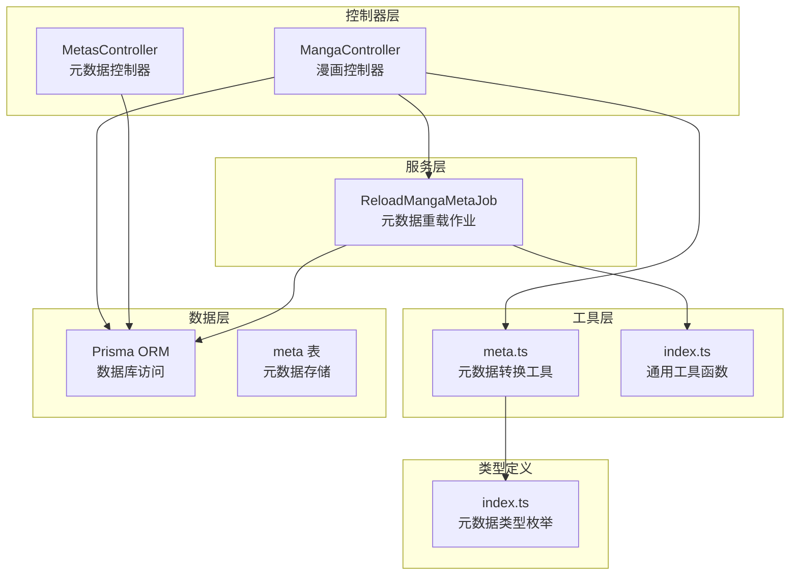
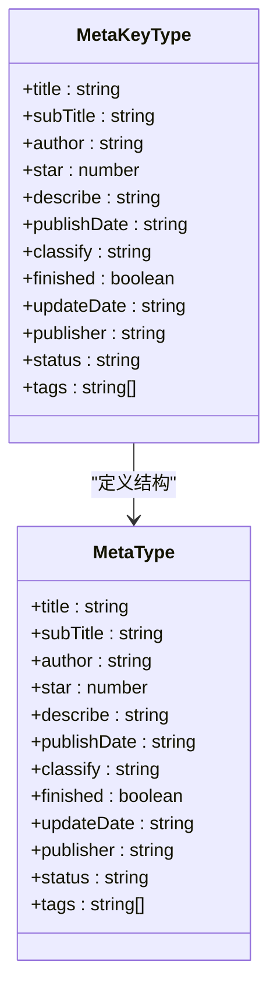
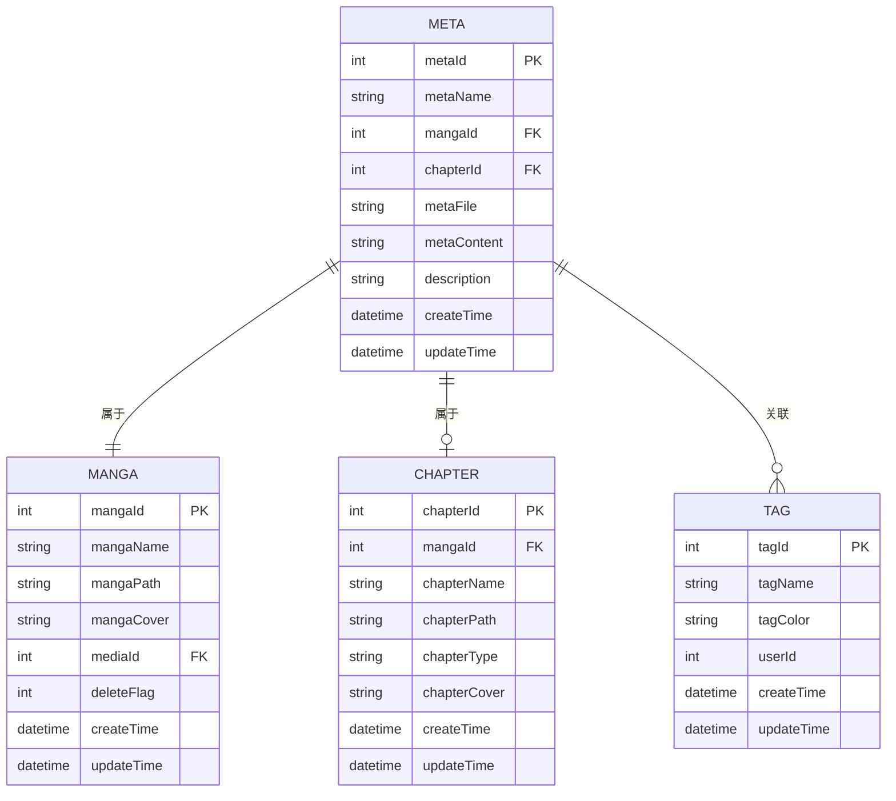
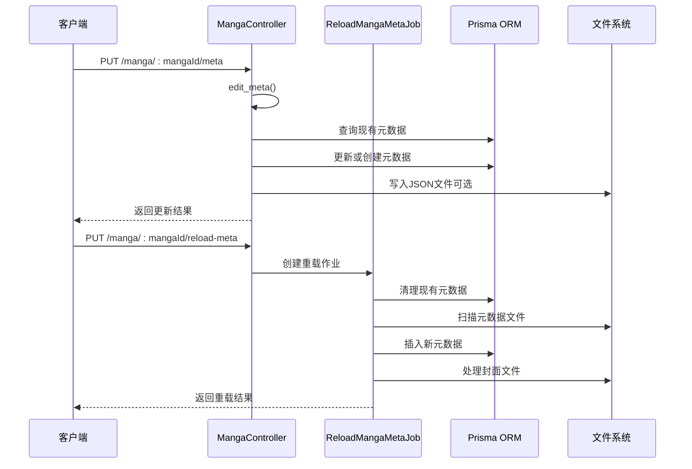
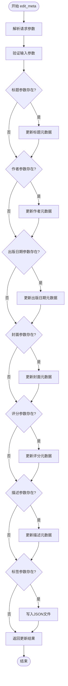
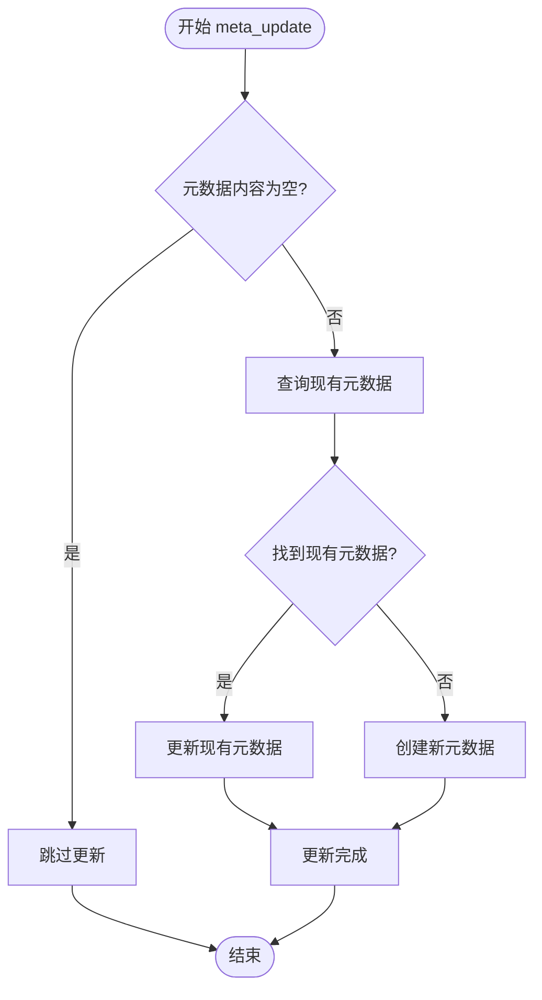
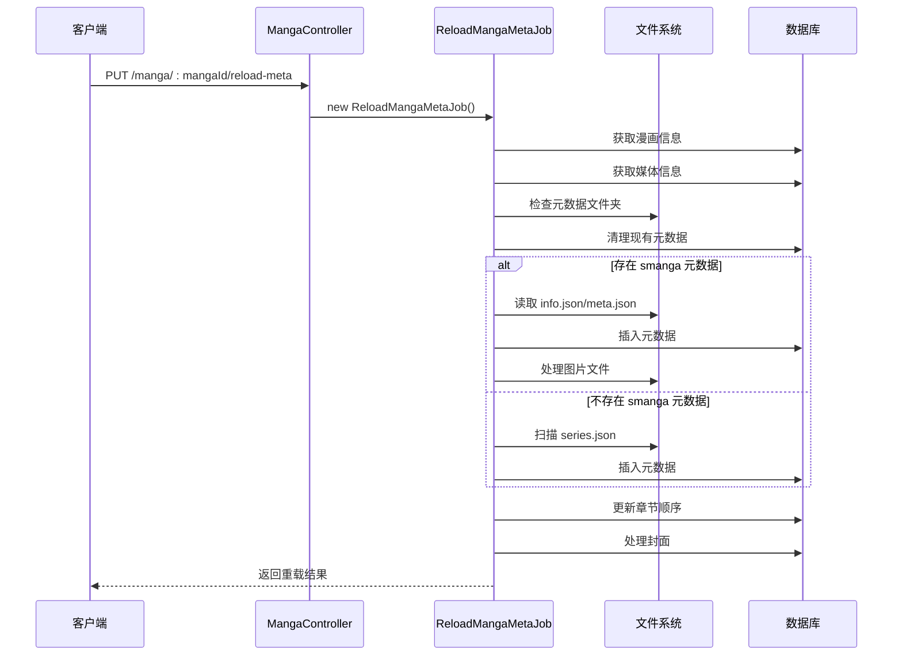
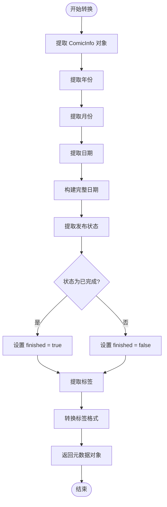
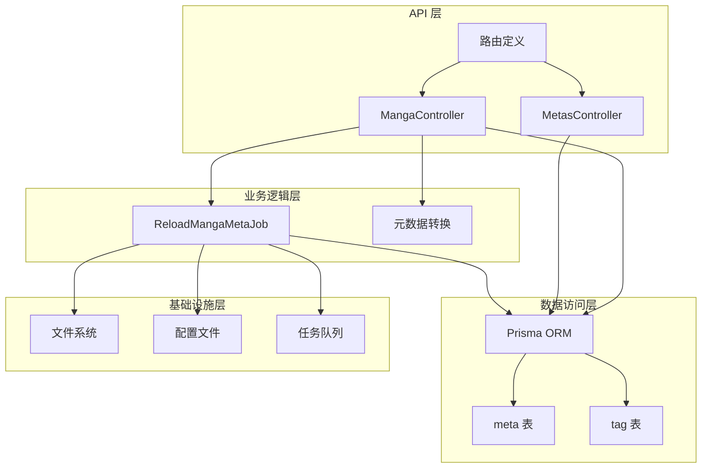
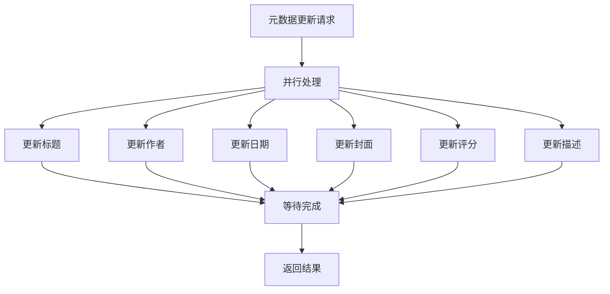

# 漫画元数据管理

<cite>
**本文档引用的文件**
- [manga_controller.ts](file://app/controllers/manga_controller.ts)
- [metas_controller.ts](file://app/controllers/metas_controller.ts)
- [meta.ts](file://app/utils/meta.ts)
- [reload_manga_meta_job.ts](file://app/services/reload_manga_meta_job.ts)
- [index.ts](file://app/type/index.ts)
- [index.ts](file://app/utils/index.ts)
- [routes.ts](file://start/routes.ts)
- [schema.prisma](file://prisma/sqlite/schema.prisma)
- [smanga.json](file://data-example/config/smanga.json)
</cite>

## 目录
1. [简介](#简介)
2. [项目结构](#项目结构)
3. [核心组件](#核心组件)
4. [架构概览](#架构概览)
5. [详细组件分析](#详细组件分析)
6. [依赖关系分析](#依赖关系分析)
7. [性能考虑](#性能考虑)
8. [故障排除指南](#故障排除指南)
9. [结论](#结论)
10. [附录](#附录)

## 简介

SManga Adonis 是一个基于 AdonisJS 的漫画管理系统，专门用于管理和组织漫画资源。本文件专注于系统的漫画元数据管理功能，详细介绍了元数据的编辑、创建、更新和重新加载机制。

漫画元数据管理功能涵盖了以下核心能力：
- 动态编辑漫画标题、作者、出版日期、封面、评分、描述等字段
- 自动化的元数据创建和更新逻辑
- 智能的元数据重新加载机制
- 结构化的存储架构和JSON文件生成
- 数据同步和缓存策略
- 完整的API接口文档和数据格式规范

## 项目结构

SManga Adonis 采用典型的 MVC 架构模式，元数据管理功能主要分布在以下几个关键模块中：



**图表来源**
- [manga_controller.ts:12-460](file://app/controllers/manga_controller.ts#L12-L460)
- [metas_controller.ts:13-61](file://app/controllers/metas_controller.ts#L13-L61)
- [reload_manga_meta_job.ts:24-683](file://app/services/reload_manga_meta_job.ts#L24-L683)
- [meta.ts:1-34](file://app/utils/meta.ts#L1-L34)

**章节来源**
- [manga_controller.ts:12-460](file://app/controllers/manga_controller.ts#L12-L460)
- [routes.ts:169-181](file://start/routes.ts#L169-L181)

## 核心组件

### 元数据类型系统

系统定义了完整的元数据类型系统，确保数据的一致性和完整性：



**图表来源**
- [index.ts:18-46](file://app/type/index.ts#L18-L46)

### 数据存储架构

元数据存储采用关系型数据库设计，支持漫画和章节级别的元数据管理：



**图表来源**
- [schema.prisma:252-264](file://prisma/sqlite/schema.prisma#L252-L264)

**章节来源**
- [index.ts:18-46](file://app/type/index.ts#L18-L46)
- [schema.prisma:252-264](file://prisma/sqlite/schema.prisma#L252-L264)

## 架构概览

### 元数据管理整体流程



**图表来源**
- [manga_controller.ts:261-348](file://app/controllers/manga_controller.ts#L261-L348)
- [reload_manga_meta_job.ts:42-92](file://app/services/reload_manga_meta_job.ts#L42-L92)

## 详细组件分析

### edit_meta 方法详解

`edit_meta` 方法是元数据编辑的核心入口，提供了强大的动态更新能力：

#### 方法签名和参数



**图表来源**
- [manga_controller.ts:261-308](file://app/controllers/manga_controller.ts#L261-L308)

#### 元数据更新逻辑

系统采用异步并行更新策略，确保响应速度：

| 字段名称 | 类型 | 更新方式 | 缓存策略 |
|---------|------|----------|----------|
| title | string | 直接更新 | 数据库缓存 |
| subTitle | string | 直接更新 | 数据库缓存 |
| author | string | 直接更新 | 数据库缓存 |
| star | number | 直接更新 | 数据库缓存 |
| describe | string | 直接更新 | 数据库缓存 |
| publishDate | string | 直接更新 | 数据库缓存 |
| tags | string[] | 标签关联更新 | 数据库缓存 |

**章节来源**
- [manga_controller.ts:261-330](file://app/controllers/manga_controller.ts#L261-L330)

### meta_update 方法详解

`meta_update` 方法实现了元数据的智能创建和更新逻辑：

#### 核心更新流程



**图表来源**
- [manga_controller.ts:310-330](file://app/controllers/manga_controller.ts#L310-L330)

#### 数据库操作策略

系统采用"先查询后更新"的策略，确保数据一致性：

1. **查询阶段**：通过 `mangaId` 和 `metaName` 组合键查询现有元数据
2. **更新阶段**：如果存在则更新 `metaContent` 字段
3. **创建阶段**：如果不存在则创建新的元数据记录

**章节来源**
- [manga_controller.ts:310-330](file://app/controllers/manga_controller.ts#L310-L330)

### reload_meta 方法详解

`reload_meta` 方法提供了完整的元数据重新加载机制：

#### 重载流程架构



**图表来源**
- [manga_controller.ts:336-348](file://app/controllers/manga_controller.ts#L336-L348)
- [reload_manga_meta_job.ts:42-92](file://app/services/reload_manga_meta_job.ts#L42-L92)

#### 元数据扫描策略

系统支持多种元数据来源的智能识别：

| 元数据类型 | 文件位置 | 识别方式 | 处理逻辑 |
|-----------|----------|----------|----------|
| smanga 元数据 | `.smanga` 文件夹 | 文件夹存在检测 | 直接读取 JSON 文件 |
| ComicInfo 元数据 | 章节压缩包内 | ComicInfo 标签检测 | 解析 ComicInfo 格式 |
| series.json 元数据 | 漫画目录 | 文件存在检测 | 解析 series.json 格式 |
| 标签元数据 | character.json | JSON 结构检测 | 提取标签信息 |

**章节来源**
- [reload_manga_meta_job.ts:99-230](file://app/services/reload_manga_meta_job.ts#L99-L230)

### 元数据转换工具

`comicinfo_transform` 函数负责将外部元数据格式转换为系统内部格式：

#### 转换流程



**图表来源**
- [meta.ts:3-34](file://app/utils/meta.ts#L3-L34)

**章节来源**
- [meta.ts:3-34](file://app/utils/meta.ts#L3-L34)

## 依赖关系分析

### 组件间依赖关系



**图表来源**
- [routes.ts:169-181](file://start/routes.ts#L169-L181)
- [manga_controller.ts:12-460](file://app/controllers/manga_controller.ts#L12-L460)
- [reload_manga_meta_job.ts:24-683](file://app/services/reload_manga_meta_job.ts#L24-L683)

### 外部依赖分析

系统依赖的关键外部组件：

| 组件名称 | 版本 | 用途 | 依赖关系 |
|---------|------|------|----------|
| AdonisJS | ^6.0 | Web 框架 | 核心框架 |
| Prisma | ^5.0 | ORM 框架 | 数据持久化 |
| Node.js | ^18.0 | 运行环境 | 基础环境 |
| SQLite | | 数据库 | 存储引擎 |
| Sharp | | 图像处理 | 封面处理 |

**章节来源**
- [routes.ts:169-181](file://start/routes.ts#L169-L181)
- [schema.prisma:252-264](file://prisma/sqlite/schema.prisma#L252-L264)

## 性能考虑

### 缓存策略

系统采用了多层次的缓存策略来优化性能：

1. **数据库查询缓存**：Prisma ORM 自动缓存查询结果
2. **文件系统缓存**：封面文件复制到本地缓存目录
3. **内存缓存**：常用配置和元数据缓存在内存中

### 并发处理

系统支持并发元数据更新，采用异步处理模式：



**图表来源**
- [manga_controller.ts:277-284](file://app/controllers/manga_controller.ts#L277-L284)

### 性能优化建议

1. **批量更新**：对于大量元数据更新，建议使用批量操作
2. **缓存预热**：启动时预加载常用元数据到内存
3. **异步处理**：大文件处理使用异步队列
4. **连接池**：合理配置数据库连接池大小

## 故障排除指南

### 常见问题及解决方案

#### 元数据更新失败

**问题症状**：调用 `edit_meta` 接口返回错误

**可能原因**：
1. 数据库连接异常
2. 参数格式不正确
3. 权限不足

**解决步骤**：
1. 检查数据库连接状态
2. 验证请求参数格式
3. 确认用户权限

#### 元数据重载失败

**问题症状**：调用 `reload_meta` 接口返回失败

**可能原因**：
1. 元数据文件损坏
2. 文件权限问题
3. 路径配置错误

**解决步骤**：
1. 检查元数据文件完整性
2. 验证文件系统权限
3. 确认路径配置正确

#### 封面处理异常

**问题症状**：封面无法正常显示或处理

**可能原因**：
1. 图像格式不支持
2. 文件大小超限
3. 存储空间不足

**解决步骤**：
1. 检查图像格式兼容性
2. 验证文件大小限制
3. 确认磁盘空间充足

**章节来源**
- [manga_controller.ts:261-348](file://app/controllers/manga_controller.ts#L261-L348)
- [reload_manga_meta_job.ts:42-92](file://app/services/reload_manga_meta_job.ts#L42-L92)

## 结论

SManga Adonis 的漫画元数据管理功能展现了现代 Web 应用的优秀设计实践。通过精心设计的架构和完善的工具链，系统实现了：

1. **灵活的元数据编辑**：支持动态字段更新和批量操作
2. **智能的元数据管理**：自动识别多种元数据格式并进行转换
3. **高效的存储架构**：基于关系型数据库的结构化存储
4. **可靠的同步机制**：支持多源数据同步和冲突解决
5. **完善的缓存策略**：多层次缓存提升系统性能

该系统为漫画管理提供了坚实的技术基础，能够满足从个人收藏到大规模部署的各种需求场景。

## 附录

### API 接口文档

#### 元数据编辑接口

| 接口 | 方法 | 路径 | 功能描述 |
|------|------|------|----------|
| 编辑元数据 | PUT | `/manga/:mangaId/meta` | 动态编辑漫画元数据 |
| 重新加载元数据 | PUT | `/manga/:mangaId/reload-meta` | 重新扫描和加载元数据 |
| 添加标签 | PUT | `/manga/:mangaId/tags` | 批量添加漫画标签 |

#### 请求参数规范

**编辑元数据请求参数**：

| 参数名 | 类型 | 必填 | 描述 | 示例 |
|--------|------|------|------|------|
| title | string | 否 | 漫画标题 | `"火影忍者"` |
| author | string | 否 | 作者信息 | `"岸本齐史"` |
| publishDate | string | 否 | 出版日期 | `"2000-01-01"` |
| mangaCover | string | 否 | 封面路径 | `"/data/poster/1.jpg"` |
| star | number | 否 | 评分 | `5` |
| describe | string | 否 | 描述信息 | `"经典漫画作品"` |
| tags | string[] | 否 | 标签数组 | `["动作","冒险"]` |
| wirteMetaJson | boolean | 否 | 是否写入JSON文件 | `true` |

**章节来源**
- [routes.ts:177-179](file://start/routes.ts#L177-L179)
- [manga_controller.ts:261-308](file://app/controllers/manga_controller.ts#L261-L308)

### 数据格式规范

#### 元数据存储格式

系统支持多种元数据存储格式：

**数据库存储格式**：
```json
{
  "metaId": 1,
  "metaName": "title",
  "mangaId": 1,
  "chapterId": null,
  "metaContent": "火影忍者",
  "metaFile": null,
  "description": null,
  "createTime": "2024-01-01T00:00:00Z",
  "updateTime": "2024-01-01T00:00:00Z"
}
```

**JSON 文件格式**：
```json
{
  "title": "火影忍者",
  "author": "岸本齐史",
  "publishDate": "2000-01-01",
  "mangaCover": "/data/poster/1.jpg",
  "star": 5,
  "describe": "经典漫画作品",
  "tags": ["动作", "冒险"]
}
```

#### 配置文件格式

系统配置文件采用 JSON 格式：

**配置文件示例**：
```json
{
  "sql": {
    "client": "sqlite",
    "file": "./data/smanga.db"
  },
  "scan": {
    "auto": 1,
    "concurrency": 2,
    "defaultTagColor": "#a0d911"
  },
  "compress": {
    "poster": 300,
    "bookmark": 300
  }
}
```

**章节来源**
- [schema.prisma:252-264](file://prisma/sqlite/schema.prisma#L252-L264)
- [smanga.json:1-54](file://data-example/config/smanga.json#L1-L54)

### 实际使用示例

#### 基本元数据编辑

```javascript
// 更新漫画标题和作者
fetch('/manga/1/meta', {
  method: 'PUT',
  headers: {
    'Content-Type': 'application/json',
  },
  body: JSON.stringify({
    title: '火影忍者',
    author: '岸本齐史',
    publishDate: '2000-01-01',
    describe: '经典漫画作品'
  })
})
```

#### 批量元数据更新

```javascript
// 同时更新多个元数据字段
const updates = [
  updateMeta('title', '火影忍者'),
  updateMeta('author', '岸本齐史'),
  updateMeta('publishDate', '2000-01-01'),
  updateMeta('star', '5'),
  updateMeta('describe', '经典漫画作品')
];

Promise.all(updates).then(results => {
  console.log('所有元数据更新完成');
});
```

#### 元数据重新加载

```javascript
// 重新扫描和加载元数据
fetch('/manga/1/reload-meta', {
  method: 'PUT'
})
.then(response => response.json())
.then(data => {
  console.log('元数据重新加载完成');
});
```