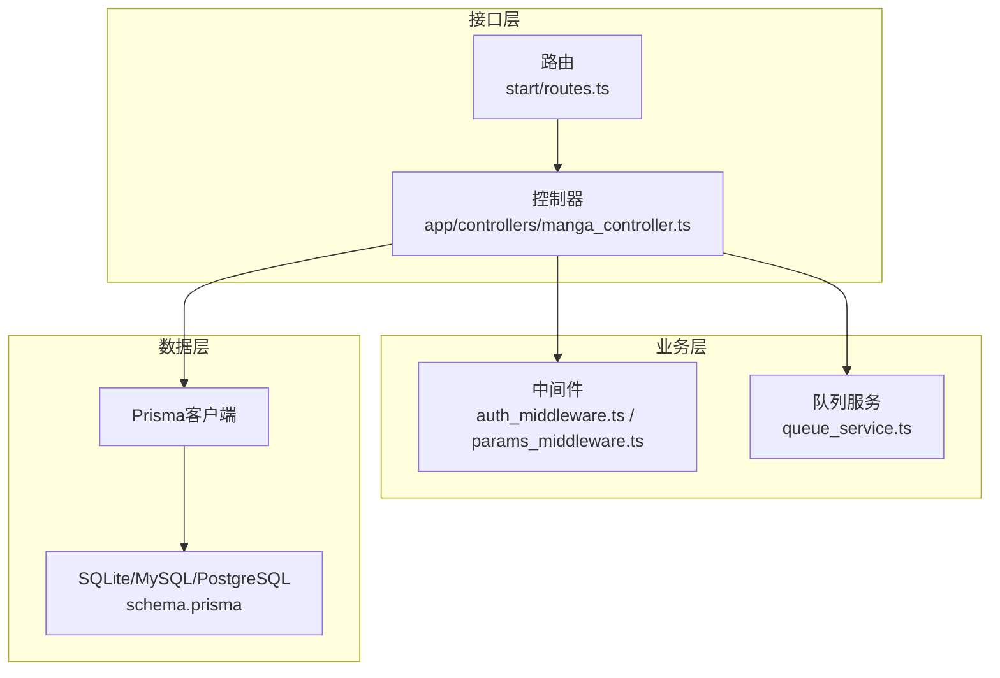
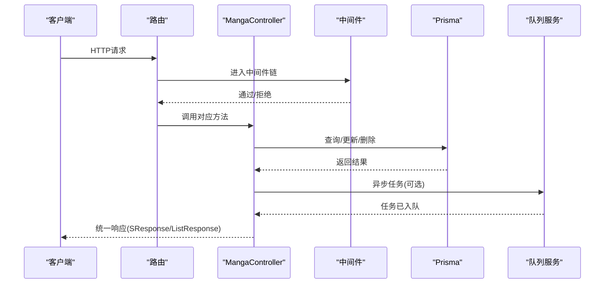
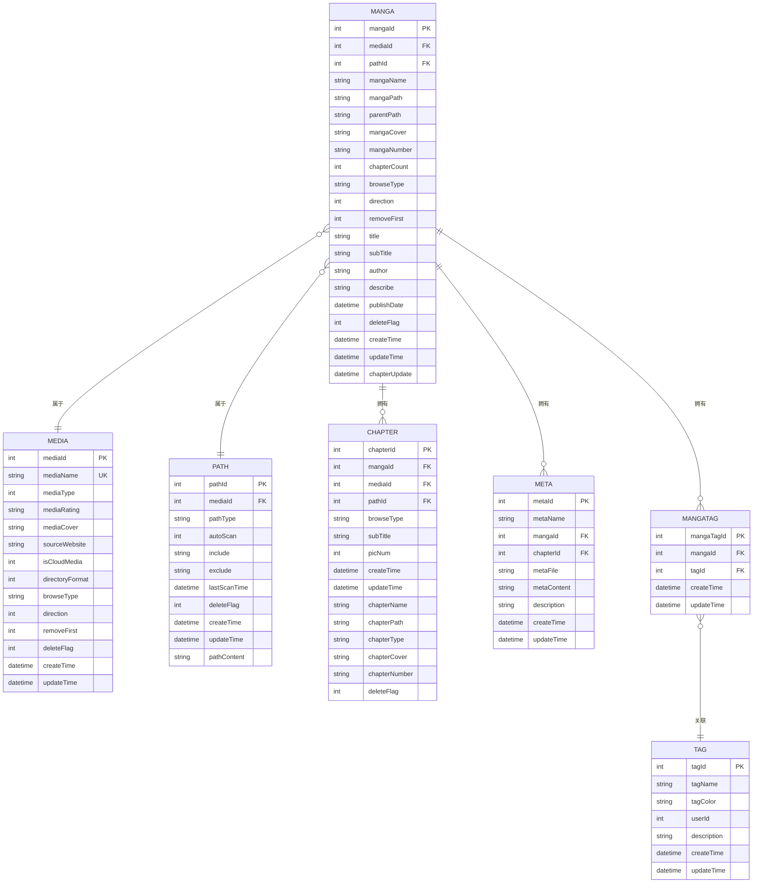
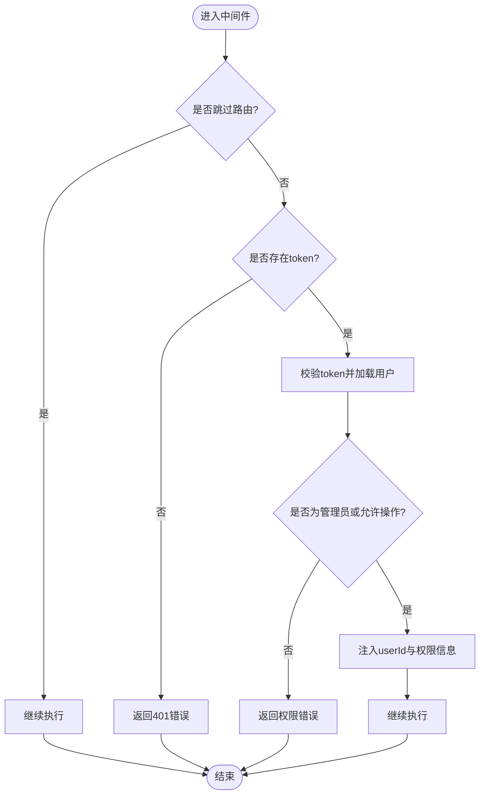
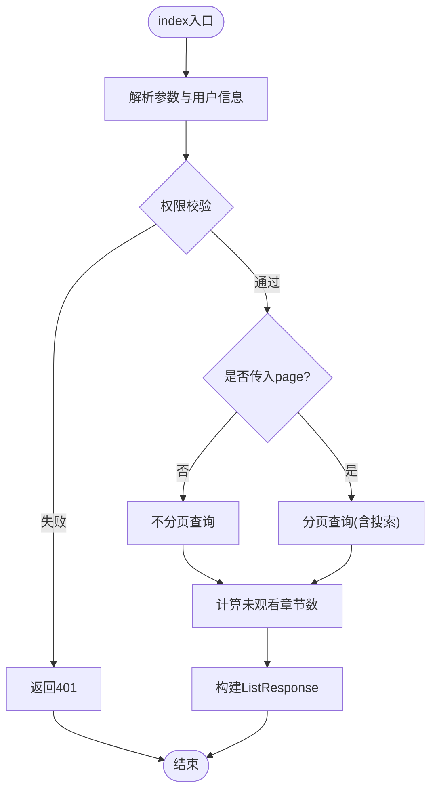
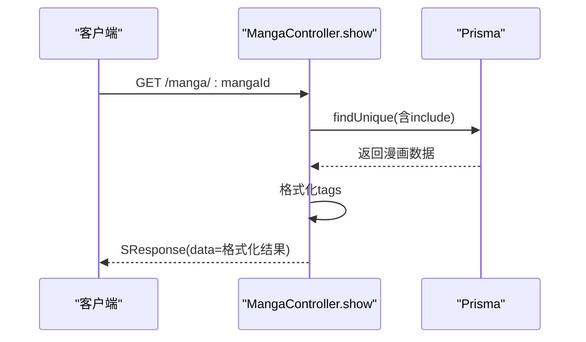
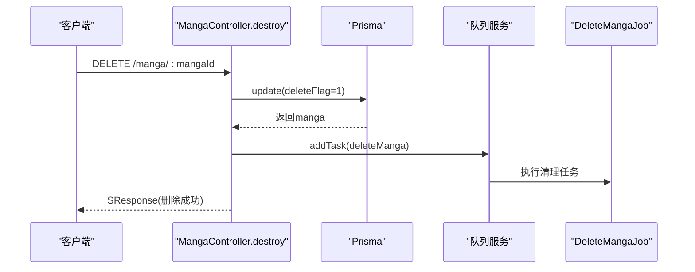
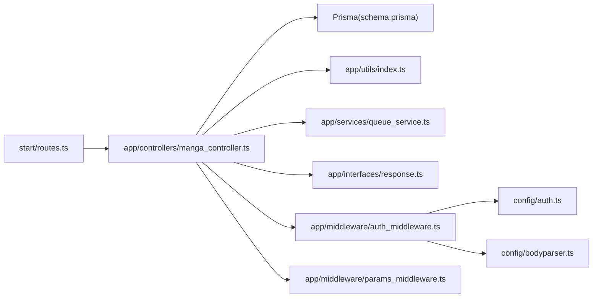

# 漫画基础CRUD操作

<cite>
**本文档引用的文件**
- [manga_controller.ts](file://app/controllers/manga_controller.ts)
- [routes.ts](file://start/routes.ts)
- [schema.prisma](file://prisma/sqlite/schema.prisma)
- [response.ts](file://app/interfaces/response.ts)
- [index.ts](file://app/utils/index.ts)
- [auth_middleware.ts](file://app/middleware/auth_middleware.ts)
- [params_middleware.ts](file://app/middleware/params_middleware.ts)
- [auth.ts](file://config/auth.ts)
- [bodyparser.ts](file://config/bodyparser.ts)
- [queue_service.ts](file://app/services/queue_service.ts)
- [delete_manga_job.ts](file://app/services/delete_manga_job.ts)
- [reload_manga_meta_job.ts](file://app/services/reload_manga_meta_job.ts)
- [handler.ts](file://app/exceptions/handler.ts)
</cite>

## 目录
1. [简介](#简介)
2. [项目结构](#项目结构)
3. [核心组件](#核心组件)
4. [架构总览](#架构总览)
5. [详细组件分析](#详细组件分析)
6. [依赖关系分析](#依赖关系分析)
7. [性能考虑](#性能考虑)
8. [故障排查指南](#故障排查指南)
9. [结论](#结论)
10. [附录](#附录)

## 简介
本文件面向SManga Adonis项目的漫画基础CRUD操作，系统性阐述以下内容：
- 增删改查实现：index（分页/不分页/权限/搜索）、show（详情与数据格式化）、create/update/destroy（完整流程）
- 数据模型字段与关系：基于Prisma schema的漫画实体及关联
- 权限控制与中间件：认证、模块权限、媒体权限
- 验证与输入处理：参数类型转换、请求体解析
- 事务与错误处理：队列任务、异常捕获与统一响应格式
- 性能优化与最佳实践：分页、并发、缓存与资源清理
- API调用示例与响应格式：端点、参数、返回结构

## 项目结构
漫画相关的核心文件分布如下：
- 控制器：app/controllers/manga_controller.ts 提供漫画CRUD与扩展操作
- 路由：start/routes.ts 定义REST端点映射
- 数据模型：prisma/sqlite/schema.prisma 定义manga、chapter、meta、mangaTag等实体
- 响应格式：app/interfaces/response.ts 统一返回结构
- 工具函数：app/utils/index.ts 提供排序、路径、文件操作等工具
- 中间件：app/middleware/auth_middleware.ts、app/middleware/params_middleware.ts 实现认证与参数处理
- 认证配置：config/auth.ts、config/bodyparser.ts
- 服务与队列：app/services/queue_service.ts、app/services/delete_manga_job.ts、app/services/reload_manga_meta_job.ts
- 异常处理：app/exceptions/handler.ts

**图表来源**
- [routes.ts:169-181](file://start/routes.ts#L169-L181)
- [manga_controller.ts:12-460](file://app/controllers/manga_controller.ts#L12-L460)
- [auth_middleware.ts:17-87](file://app/middleware/auth_middleware.ts#L17-L87)
- [params_middleware.ts:3-65](file://app/middleware/params_middleware.ts#L3-L65)
- [queue_service.ts:175-264](file://app/services/queue_service.ts#L175-L264)
- [schema.prisma:163-198](file://prisma/sqlite/schema.prisma#L163-L198)

**章节来源**
- [routes.ts:169-181](file://start/routes.ts#L169-L181)
- [manga_controller.ts:12-460](file://app/controllers/manga_controller.ts#L12-L460)
- [schema.prisma:163-198](file://prisma/sqlite/schema.prisma#L163-L198)

## 核心组件
- 漫画控制器：提供index、show、create、update、destroy、批量删除、扫描、元数据编辑、标签管理、压缩等操作
- 路由：REST风格端点映射至控制器方法
- 数据模型：manga实体及其与chapter、meta、mangaTag、media、path等的关联
- 响应格式：SResponse与ListResponse统一返回结构
- 中间件：认证与参数类型转换
- 队列服务：异步任务调度与重试策略

**章节来源**
- [manga_controller.ts:12-460](file://app/controllers/manga_controller.ts#L12-L460)
- [routes.ts:169-181](file://start/routes.ts#L169-L181)
- [response.ts:18-63](file://app/interfaces/response.ts#L18-L63)
- [auth_middleware.ts:17-87](file://app/middleware/auth_middleware.ts#L17-L87)
- [params_middleware.ts:3-65](file://app/middleware/params_middleware.ts#L3-L65)
- [queue_service.ts:175-264](file://app/services/queue_service.ts#L175-L264)

## 架构总览
漫画CRUD通过路由触发控制器方法，控制器使用Prisma访问数据库，并结合中间件进行权限校验与参数处理。部分耗时操作（如删除漫画、扫描元数据）通过队列服务异步执行。

**图表来源**
- [routes.ts:169-181](file://start/routes.ts#L169-L181)
- [manga_controller.ts:12-460](file://app/controllers/manga_controller.ts#L12-L460)
- [auth_middleware.ts:23-84](file://app/middleware/auth_middleware.ts#L23-L84)
- [queue_service.ts:175-264](file://app/services/queue_service.ts#L175-L264)

## 详细组件分析

### 数据模型与字段
漫画实体（manga）关键字段与关系：
- 主键与外键：mangaId、mediaId、pathId
- 基础信息：mangaName、mangaPath、parentPath、mangaCover、mangaNumber
- 行为属性：browseType、direction、removeFirst、chapterCount
- 元数据：title、subTitle、author、describe、publishDate
- 标记与时间：deleteFlag、createTime、updateTime、chapterUpdate
- 关联实体：chapter、meta、mangaTag、media、path、latest、history、collect、bookmark、compress、shares

**图表来源**
- [schema.prisma:163-198](file://prisma/sqlite/schema.prisma#L163-L198)
- [schema.prisma:29-55](file://prisma/sqlite/schema.prisma#L29-L55)
- [schema.prisma:252-264](file://prisma/sqlite/schema.prisma#L252-L264)
- [schema.prisma:201-212](file://prisma/sqlite/schema.prisma#L201-L212)
- [schema.prisma:299-308](file://prisma/sqlite/schema.prisma#L299-L308)

**章节来源**
- [schema.prisma:163-198](file://prisma/sqlite/schema.prisma#L163-L198)

### 权限控制与中间件
- 认证中间件：校验token有效性，注入用户信息与媒体权限列表
- 模块/操作权限：对DELETE请求与特定模块（如/user）进行角色校验
- 参数中间件：自动将query/body/path中的数字型id与关键字段转换为数值
- 认证配置：基于access tokens的API守卫

**图表来源**
- [auth_middleware.ts:23-84](file://app/middleware/auth_middleware.ts#L23-L84)
- [params_middleware.ts:4-62](file://app/middleware/params_middleware.ts#L4-L62)
- [auth.ts:5-15](file://config/auth.ts#L5-L15)

**章节来源**
- [auth_middleware.ts:17-87](file://app/middleware/auth_middleware.ts#L17-L87)
- [params_middleware.ts:3-65](file://app/middleware/params_middleware.ts#L3-L65)
- [auth.ts:1-28](file://config/auth.ts#L1-L28)

### index方法：分页查询、不分页查询、权限控制与搜索
- 请求参数：mediaId、page、pageSize、keyWord、order
- 权限控制：非管理员需具备对应媒体权限
- 不分页：按排序条件查询所有未删除漫画
- 分页：支持关键词subTitle模糊匹配，统计每部漫画未观看章节数
- 排序：order_params支持按id、number、name、createTime、updateTime升/降序

**图表来源**
- [manga_controller.ts:13-115](file://app/controllers/manga_controller.ts#L13-L115)
- [index.ts:117-154](file://app/utils/index.ts#L117-L154)

**章节来源**
- [manga_controller.ts:13-115](file://app/controllers/manga_controller.ts#L13-L115)
- [index.ts:117-154](file://app/utils/index.ts#L117-L154)

### show方法：详情获取与数据格式化
- 查询：根据mangaId查询漫画，包含meta、mangaTags(tag)、media基本信息
- 数据格式化：将mangaTags中的tag提取到顶层tags字段，移除冗余字段

**图表来源**
- [manga_controller.ts:117-145](file://app/controllers/manga_controller.ts#L117-L145)

**章节来源**
- [manga_controller.ts:117-145](file://app/controllers/manga_controller.ts#L117-L145)

### create方法：新增漫画
- 输入：请求体作为Prisma.mangaCreateInput
- 处理：调用prisma.manga.create
- 响应：SResponse(code=0, message='新增成功', data=manga)

**章节来源**
- [manga_controller.ts:147-154](file://app/controllers/manga_controller.ts#L147-L154)

### update方法：修改漫画
- 输入：仅允许修改指定字段（mangaName、mangaNumber、mangaPath、mangaCover、removeFirst、browseType）
- 处理：prisma.manga.update
- 响应：SResponse(code=0, message='更新成功', data=manga)

**章节来源**
- [manga_controller.ts:156-172](file://app/controllers/manga_controller.ts#L156-L172)

### destroy方法：删除漫画
- 标记删除：将deleteFlag设为1
- 异步清理：入队DeleteMangaJob执行书签、收藏、压缩、历史、标签、元数据、章节、封面等清理
- 响应：SResponse(code=0, message='删除成功', data=manga)

**图表来源**
- [manga_controller.ts:174-188](file://app/controllers/manga_controller.ts#L174-L188)
- [queue_service.ts:175-264](file://app/services/queue_service.ts#L175-L264)
- [delete_manga_job.ts:18-76](file://app/services/delete_manga_job.ts#L18-L76)

**章节来源**
- [manga_controller.ts:174-188](file://app/controllers/manga_controller.ts#L174-L188)
- [delete_manga_job.ts:11-77](file://app/services/delete_manga_job.ts#L11-L77)

### destroy_batch方法：批量删除
- 输入：mangaIds数组
- 流程：逐个标记删除并入队清理任务
- 响应：SResponse(data=mangaIds)

**章节来源**
- [manga_controller.ts:190-215](file://app/controllers/manga_controller.ts#L190-L215)

### 元数据与标签管理
- 编辑元数据：edit_meta支持title、author、publishDate、mangaCover、star、describe、tags、wirteMetaJson
- 重新加载元数据：reload_meta通过ReloadMangaMetaJob扫描并写入数据库与本地meta.json
- 添加标签：add_tags删除旧标签并批量写入新标签，支持写入meta.json

**章节来源**
- [manga_controller.ts:261-308](file://app/controllers/manga_controller.ts#L261-L308)
- [manga_controller.ts:336-348](file://app/controllers/manga_controller.ts#L336-L348)
- [manga_controller.ts:350-394](file://app/controllers/manga_controller.ts#L350-L394)
- [reload_manga_meta_job.ts:24-92](file://app/services/reload_manga_meta_job.ts#L24-L92)

### 压缩与扫描
- 压缩全部章节：compress_all为未压缩章节入队压缩任务
- 删除压缩记录：compress_delete删除压缩文件并清理记录
- 扫描漫画：scan为指定漫画入队扫描任务

**章节来源**
- [manga_controller.ts:396-458](file://app/controllers/manga_controller.ts#L396-L458)

## 依赖关系分析
- 控制器依赖Prisma进行数据访问
- 中间件负责认证与参数预处理
- 队列服务承载耗时任务，避免阻塞请求
- 响应格式统一，便于前端消费

**图表来源**
- [routes.ts:169-181](file://start/routes.ts#L169-L181)
- [manga_controller.ts:12-460](file://app/controllers/manga_controller.ts#L12-L460)
- [schema.prisma:163-198](file://prisma/sqlite/schema.prisma#L163-L198)
- [index.ts:1-313](file://app/utils/index.ts#L1-L313)
- [queue_service.ts:175-264](file://app/services/queue_service.ts#L175-L264)
- [response.ts:18-63](file://app/interfaces/response.ts#L18-L63)
- [auth_middleware.ts:17-87](file://app/middleware/auth_middleware.ts#L17-L87)
- [params_middleware.ts:3-65](file://app/middleware/params_middleware.ts#L3-L65)
- [auth.ts:1-28](file://config/auth.ts#L1-L28)
- [bodyparser.ts:1-56](file://config/bodyparser.ts#L1-L56)

**章节来源**
- [routes.ts:169-181](file://start/routes.ts#L169-L181)
- [manga_controller.ts:12-460](file://app/controllers/manga_controller.ts#L12-L460)
- [schema.prisma:163-198](file://prisma/sqlite/schema.prisma#L163-L198)

## 性能考虑
- 分页查询：使用skip/take限制结果集，count统计总数，避免一次性加载大量数据
- 并发与重试：队列服务配置并发数、最大重试次数与指数退避，减少重复任务与资源竞争
- 异步清理：删除漫画采用队列异步清理，避免长事务阻塞
- 排序与索引：order_params支持多字段排序，建议在数据库层面建立相应索引
- 缓存与压缩：封面压缩与缓存路径配置，降低I/O与网络传输成本

[本节为通用性能指导，无需具体文件引用]

## 故障排查指南
- 认证失败：检查token头是否正确传递，确认token存在且未过期
- 权限不足：确认用户角色或媒体权限是否满足操作要求
- 参数类型错误：确保id类参数为数值类型，可通过参数中间件自动转换
- 数据库异常：查看异常处理器日志，定位具体错误位置
- 队列任务失败：检查Redis连接、任务重试策略与日志输出

**章节来源**
- [auth_middleware.ts:32-54](file://app/middleware/auth_middleware.ts#L32-L54)
- [params_middleware.ts:4-62](file://app/middleware/params_middleware.ts#L4-L62)
- [handler.ts:14-27](file://app/exceptions/handler.ts#L14-L27)
- [queue_service.ts:41-47](file://app/services/queue_service.ts#L41-L47)

## 结论
SManga Adonis的漫画CRUD通过清晰的控制器、严格的中间件权限控制、统一的响应格式与异步队列机制，实现了高效、可维护的漫画数据管理能力。结合分页、排序与资源清理策略，可在大规模数据场景下保持良好性能与稳定性。

[本节为总结性内容，无需具体文件引用]

## 附录

### API端点与调用示例
- 获取漫画列表
  - 方法：GET
  - 路径：/manga
  - 查询参数：mediaId、page、pageSize、keyWord、order
  - 示例：GET /manga?mediaId=1&page=1&pageSize=20&order=nameAsc
- 获取单个漫画详情
  - 方法：GET
  - 路径：/manga/:mangaId
  - 示例：GET /manga/123
- 新增漫画
  - 方法：POST
  - 路径：/manga
  - 请求体：符合Prisma.mangaCreateInput的字段集合
  - 示例：POST /manga
- 更新漫画
  - 方法：PUT
  - 路径：/manga/:mangaId
  - 请求体：mangaName、mangaNumber、mangaPath、mangaCover、removeFirst、browseType
  - 示例：PUT /manga/123
- 删除漫画
  - 方法：DELETE
  - 路径：/manga/:mangaId
  - 示例：DELETE /manga/123
- 批量删除漫画
  - 方法：DELETE
  - 路径：/manga/:mangaIds/batch
  - 请求体：{ mangaIds: [1,2,3] }
  - 示例：DELETE /manga/1,2,3/batch
- 扫描漫画
  - 方法：PUT
  - 路径：/manga/:mangaId/scan
  - 示例：PUT /manga/123/scan
- 重新加载元数据
  - 方法：PUT
  - 路径：/manga/:mangaId/reload-meta
  - 示例：PUT /manga/123/reload-meta
- 编辑元数据
  - 方法：PUT
  - 路径：/manga/:mangaId/meta
  - 请求体：title、author、publishDate、mangaCover、star、describe、tags、wirteMetaJson
  - 示例：PUT /manga/123/meta
- 添加标签
  - 方法：PUT
  - 路径：/manga/:mangaId/tags
  - 请求体：tags（数组）、metaWriteJson（可选）
  - 示例：PUT /manga/123/tags
- 压缩全部章节
  - 方法：PUT
  - 路径：/manga/:mangaId/compress
  - 示例：PUT /manga/123/compress
- 删除压缩记录
  - 方法：DELETE
  - 路径：/manga/:mangaId/compress
  - 示例：DELETE /manga/123/compress

**章节来源**
- [routes.ts:169-181](file://start/routes.ts#L169-L181)

### 响应格式
- 成功响应：code=0，message为空或自定义消息，data为具体数据
- 列表响应：code=0，message为空，list为数组，count为总数
- 错误响应：code≠0，message为错误描述，status为状态标识

**章节来源**
- [response.ts:18-63](file://app/interfaces/response.ts#L18-L63)

### 验证规则与输入处理
- 认证：token头必须有效
- 权限：非管理员需具备媒体权限
- 参数：id类与关键字段自动转换为数值
- 请求体：支持JSON、表单与multipart

**章节来源**
- [auth_middleware.ts:32-54](file://app/middleware/auth_middleware.ts#L32-L54)
- [params_middleware.ts:4-62](file://app/middleware/params_middleware.ts#L4-L62)
- [bodyparser.ts:8-52](file://config/bodyparser.ts#L8-L52)

### 事务与错误处理机制
- 事务：删除漫画采用队列异步清理，避免长事务
- 错误处理：异常处理器根据环境决定调试模式，统一上报与记录
- 队列重试：指数退避与最大重试次数，保障任务可靠性

**章节来源**
- [delete_manga_job.ts:18-76](file://app/services/delete_manga_job.ts#L18-L76)
- [handler.ts:14-27](file://app/exceptions/handler.ts#L14-L27)
- [queue_service.ts:241-262](file://app/services/queue_service.ts#L241-L262)