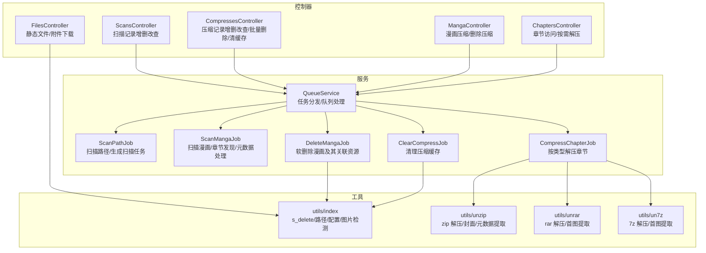
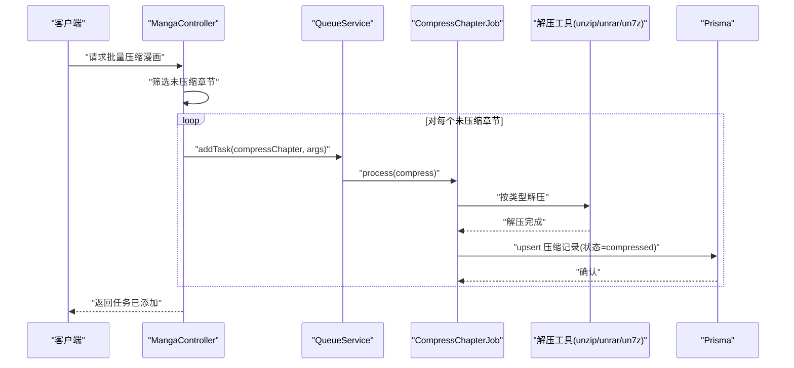
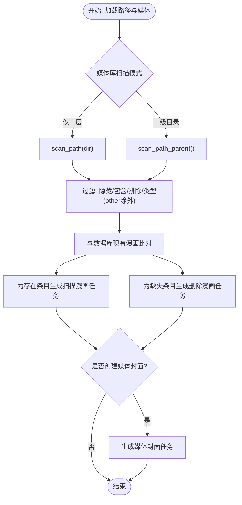
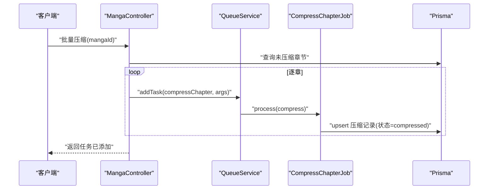
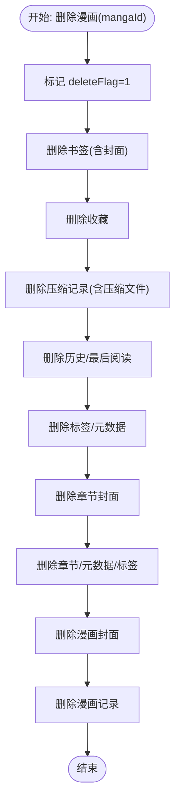
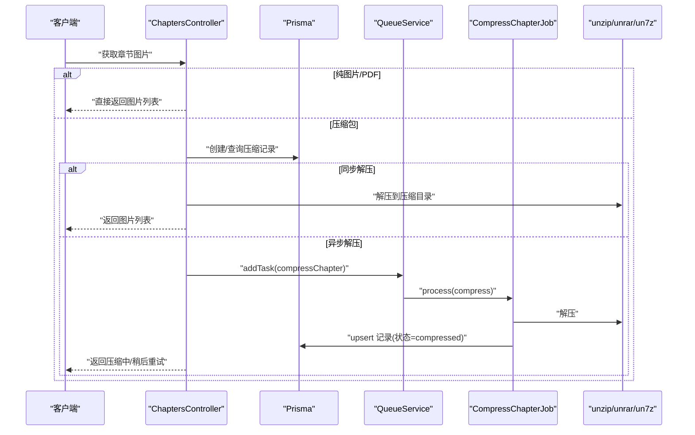
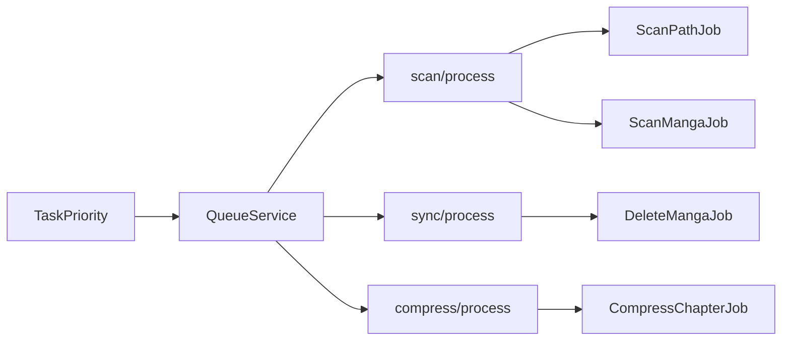

# 漫画文件操作

<cite>
**本文引用的文件**
- [app/controllers/scans_controller.ts](file://app/controllers/scans_controller.ts)
- [app/controllers/compresses_controller.ts](file://app/controllers/compresses_controller.ts)
- [app/controllers/manga_controller.ts](file://app/controllers/manga_controller.ts)
- [app/controllers/chapters_controller.ts](file://app/controllers/chapters_controller.ts)
- [app/controllers/files_controller.ts](file://app/controllers/files_controller.ts)
- [app/services/queue_service.ts](file://app/services/queue_service.ts)
- [app/services/scan_job.ts](file://app/services/scan_job.ts)
- [app/services/scan_manga_job.ts](file://app/services/scan_manga_job.ts)
- [app/services/compress_chapter_job.ts](file://app/services/compress_chapter_job.ts)
- [app/services/delete_manga_job.ts](file://app/services/delete_manga_job.ts)
- [app/services/clear_compress_job.ts](file://app/services/clear_compress_job.ts)
- [app/type/index.ts](file://app/type/index.ts)
- [app/utils/index.ts](file://app/utils/index.ts)
- [app/utils/unzip.ts](file://app/utils/unzip.ts)
- [app/utils/unrar.ts](file://app/utils/unrar.ts)
- [app/utils/un7z.ts](file://app/utils/un7z.ts)
</cite>

## 目录
1. [简介](#简介)
2. [项目结构](#项目结构)
3. [核心组件](#核心组件)
4. [架构总览](#架构总览)
5. [详细组件分析](#详细组件分析)
6. [依赖关系分析](#依赖关系分析)
7. [性能考量](#性能考量)
8. [故障排除指南](#故障排除指南)
9. [结论](#结论)
10. [附录：API 接口定义](#附录api-接口定义)

## 简介
本文件面向 SManga Adonis 的漫画文件操作能力，围绕“扫描、压缩与删除”三大主题，系统梳理以下内容：
- 扫描机制：如何遍历文件系统、识别漫画条目、发现章节并生成任务。
- 批量压缩与清理：如何对漫画章节进行批量解压、记录状态、清理缓存。
- 删除机制：软删除策略与异步删除作业的执行流程。
- API 接口文档、性能优化建议与常见问题排查。

## 项目结构
围绕漫画文件操作的关键模块分布如下：
- 控制器层：负责接收请求、校验参数、调用服务与工具，并返回统一响应。
- 服务层：封装具体业务逻辑，如扫描、压缩、删除、清理等，统一通过队列调度。
- 工具层：提供文件系统操作、解压工具、路径与配置管理等通用能力。
- 类型与常量：定义任务优先级、元数据键等。

图表来源
- [app/controllers/scans_controller.ts:1-58](file://app/controllers/scans_controller.ts#L1-L58)
- [app/controllers/compresses_controller.ts:1-147](file://app/controllers/compresses_controller.ts#L1-L147)
- [app/controllers/manga_controller.ts:439-460](file://app/controllers/manga_controller.ts#L439-L460)
- [app/controllers/chapters_controller.ts:203-302](file://app/controllers/chapters_controller.ts#L203-L302)
- [app/controllers/files_controller.ts:1-55](file://app/controllers/files_controller.ts#L1-L55)
- [app/services/queue_service.ts:1-267](file://app/services/queue_service.ts#L1-L267)
- [app/services/scan_job.ts:1-254](file://app/services/scan_job.ts#L1-L254)
- [app/services/scan_manga_job.ts:1037-1093](file://app/services/scan_manga_job.ts#L1037-L1093)
- [app/services/compress_chapter_job.ts:1-71](file://app/services/compress_chapter_job.ts#L1-L71)
- [app/services/delete_manga_job.ts:1-78](file://app/services/delete_manga_job.ts#L1-L78)
- [app/services/clear_compress_job.ts:1-56](file://app/services/clear_compress_job.ts#L1-L56)
- [app/utils/index.ts:1-313](file://app/utils/index.ts#L1-L313)
- [app/utils/unzip.ts:1-168](file://app/utils/unzip.ts#L1-L168)
- [app/utils/unrar.ts:1-118](file://app/utils/unrar.ts#L1-L118)
- [app/utils/un7z.ts:1-141](file://app/utils/un7z.ts#L1-L141)

章节来源
- [app/controllers/scans_controller.ts:1-58](file://app/controllers/scans_controller.ts#L1-L58)
- [app/controllers/compresses_controller.ts:1-147](file://app/controllers/compresses_controller.ts#L1-L147)
- [app/controllers/manga_controller.ts:439-460](file://app/controllers/manga_controller.ts#L439-L460)
- [app/controllers/chapters_controller.ts:203-302](file://app/controllers/chapters_controller.ts#L203-L302)
- [app/controllers/files_controller.ts:1-55](file://app/controllers/files_controller.ts#L1-L55)
- [app/services/queue_service.ts:1-267](file://app/services/queue_service.ts#L1-L267)
- [app/services/scan_job.ts:1-254](file://app/services/scan_job.ts#L1-L254)
- [app/services/scan_manga_job.ts:1037-1093](file://app/services/scan_manga_job.ts#L1037-L1093)
- [app/services/compress_chapter_job.ts:1-71](file://app/services/compress_chapter_job.ts#L1-L71)
- [app/services/delete_manga_job.ts:1-78](file://app/services/delete_manga_job.ts#L1-L78)
- [app/services/clear_compress_job.ts:1-56](file://app/services/clear_compress_job.ts#L1-L56)
- [app/utils/index.ts:1-313](file://app/utils/index.ts#L1-L313)
- [app/utils/unzip.ts:1-168](file://app/utils/unzip.ts#L1-L168)
- [app/utils/unrar.ts:1-118](file://app/utils/unrar.ts#L1-L118)
- [app/utils/un7z.ts:1-141](file://app/utils/un7z.ts#L1-L141)

## 核心组件
- 扫描路径任务（ScanPathJob）：根据媒体库配置决定扫描模式（仅一层目录或二级目录），遍历文件系统，识别漫画条目，生成“扫描漫画”子任务；同时对数据库中不存在的漫画条目生成“删除漫画”异步任务。
- 扫描漫画任务（ScanMangaJob）：解析章节、提取元数据（如 ComicInfo）、建立标签与元数据索引，支持云媒体与自定义元数据目录策略。
- 压缩章节任务（CompressChapterJob）：根据章节类型（zip/rar/7z/pdf/img）选择对应解压器，将压缩包解压至指定目录，并维护压缩记录的状态。
- 清理压缩缓存（ClearCompressJob）：按配置上限清理压缩目录，删除多余文件夹与数据库记录。
- 删除漫画任务（DeleteMangaJob）：软删除标记后，按顺序清理书签、收藏、压缩记录、历史、标签、元数据、章节封面、章节、漫画封面与漫画本身。
- 队列服务（QueueService）：集中管理任务分发、优先级、重试与超时策略，支持同步调试模式与同路径任务去重。
- 工具函数（utils/index）：提供跨平台路径、配置读取、安全删除（s_delete）、图片检测、延迟等通用能力。

章节来源
- [app/services/scan_job.ts:1-254](file://app/services/scan_job.ts#L1-L254)
- [app/services/scan_manga_job.ts:1037-1093](file://app/services/scan_manga_job.ts#L1037-L1093)
- [app/services/compress_chapter_job.ts:1-71](file://app/services/compress_chapter_job.ts#L1-L71)
- [app/services/clear_compress_job.ts:1-56](file://app/services/clear_compress_job.ts#L1-L56)
- [app/services/delete_manga_job.ts:1-78](file://app/services/delete_manga_job.ts#L1-L78)
- [app/services/queue_service.ts:1-267](file://app/services/queue_service.ts#L1-L267)
- [app/utils/index.ts:1-313](file://app/utils/index.ts#L1-L313)

## 架构总览
整体采用“控制器 -> 服务 -> 工具”的分层设计，所有耗时操作通过队列异步执行，保证接口快速响应与高吞吐。

图表来源
- [app/controllers/manga_controller.ts:439-460](file://app/controllers/manga_controller.ts#L439-L460)
- [app/services/queue_service.ts:49-66](file://app/services/queue_service.ts#L49-L66)
- [app/services/compress_chapter_job.ts:1-71](file://app/services/compress_chapter_job.ts#L1-L71)
- [app/utils/unzip.ts:1-168](file://app/utils/unzip.ts#L1-L168)
- [app/utils/unrar.ts:1-118](file://app/utils/unrar.ts#L1-L118)
- [app/utils/un7z.ts:1-141](file://app/utils/un7z.ts#L1-L141)

## 详细组件分析

### 扫描机制：scan 方法与路径遍历
- 路径与媒体库加载：根据 pathId 加载路径与媒体库信息，若缺失则终止任务。
- 扫描模式：
  - 仅一层目录：遍历顶层目录，识别 zip/cbz/cbr/rar/7z/pdf 等类型，应用包含/排除规则与隐藏文件过滤。
  - 二级目录：先筛选合法子目录，再对每个子目录执行“一层目录”扫描。
- 条目对比与任务生成：
  - 与数据库现有漫画比对，删除数据库中不存在的漫画条目，生成“删除漫画”异步任务。
  - 对现有漫画条目生成“扫描漫画”异步任务，携带路径、媒体信息与序号，用于后续章节发现与元数据处理。
- 媒体封面生成：可选触发“创建媒体封面”任务。

图表来源
- [app/services/scan_job.ts:29-119](file://app/services/scan_job.ts#L29-L119)
- [app/services/scan_job.ts:126-198](file://app/services/scan_job.ts#L126-L198)
- [app/services/scan_job.ts:204-250](file://app/services/scan_job.ts#L204-L250)

章节来源
- [app/services/scan_job.ts:1-254](file://app/services/scan_job.ts#L1-L254)

### 批量压缩与清理：compress_all 与 compress_delete
- compress_all（批量压缩）：
  - 控制器筛选漫画下所有未压缩章节，逐个提交“压缩章节”任务，设置压缩优先级与较长超时。
  - 任务内部根据章节类型选择解压器，解压至压缩目录并更新压缩记录状态。
- compress_delete（删除压缩记录与文件）：
  - 控制器删除漫画下所有压缩记录，并逐一调用安全删除函数删除压缩目录。
  - 清理完成后返回成功响应。

图表来源
- [app/controllers/manga_controller.ts:439-460](file://app/controllers/manga_controller.ts#L439-L460)
- [app/services/queue_service.ts:49-66](file://app/services/queue_service.ts#L49-L66)
- [app/services/compress_chapter_job.ts:1-71](file://app/services/compress_chapter_job.ts#L1-L71)

章节来源
- [app/controllers/manga_controller.ts:439-460](file://app/controllers/manga_controller.ts#L439-L460)
- [app/services/compress_chapter_job.ts:1-71](file://app/services/compress_chapter_job.ts#L1-L71)
- [app/services/clear_compress_job.ts:1-56](file://app/services/clear_compress_job.ts#L1-L56)

### 删除机制：软删除与异步删除作业
- 软删除策略：
  - 删除漫画前先标记 deleteFlag=1，随后按顺序清理书签、收藏、压缩记录、历史、标签、元数据、章节封面、章节、漫画封面与漫画本身。
  - 仅删除以特定前缀命名的封面/书签文件，避免误删外部资源。
- 异步删除作业：
  - 通过队列服务分发“删除漫画”任务，确保删除流程在后台执行，不影响接口响应。
  - 提供“删除路径/媒体”等其他删除类任务，统一由队列处理。

图表来源
- [app/services/delete_manga_job.ts:18-76](file://app/services/delete_manga_job.ts#L18-L76)
- [app/utils/index.ts:181-187](file://app/utils/index.ts#L181-L187)

章节来源
- [app/services/delete_manga_job.ts:1-78](file://app/services/delete_manga_job.ts#L1-L78)
- [app/utils/index.ts:1-313](file://app/utils/index.ts#L1-L313)

### 按需解压与章节访问：章节控制器
- 章节访问：
  - 若章节为纯图片或 PDF，直接返回图片列表或 PDF 路径。
  - 若章节为压缩包且开启同步解压：先创建压缩记录（状态 compressing/compressed），再执行解压，随后返回图片列表。
  - 若未开启同步解压：创建压缩记录（状态 compressing），异步提交压缩任务。
- 自动清理缓存：
  - 当配置允许自动清理时，提交“清理压缩缓存”任务，按上限裁剪压缩目录。

图表来源
- [app/controllers/chapters_controller.ts:203-302](file://app/controllers/chapters_controller.ts#L203-L302)
- [app/services/queue_service.ts:49-66](file://app/services/queue_service.ts#L49-L66)
- [app/services/compress_chapter_job.ts:1-71](file://app/services/compress_chapter_job.ts#L1-L71)
- [app/utils/unzip.ts:1-168](file://app/utils/unzip.ts#L1-L168)
- [app/utils/unrar.ts:1-118](file://app/utils/unrar.ts#L1-L118)
- [app/utils/un7z.ts:1-141](file://app/utils/un7z.ts#L1-L141)

章节来源
- [app/controllers/chapters_controller.ts:203-302](file://app/controllers/chapters_controller.ts#L203-L302)

### 压缩记录管理与批量删除
- 单条删除：删除压缩记录并同步删除压缩文件。
- 批量删除：根据传入的多个 compressId 查询记录，删除数据库记录并逐条删除文件。
- 清理缓存：按配置上限裁剪压缩目录，删除多余文件夹与数据库记录。

章节来源
- [app/controllers/compresses_controller.ts:1-147](file://app/controllers/compresses_controller.ts#L1-L147)
- [app/services/clear_compress_job.ts:1-56](file://app/services/clear_compress_job.ts#L1-L56)

### 扫描记录管理
- 提供扫描记录的列表、详情、新增、更新、删除接口，便于管理扫描任务状态与配置。

章节来源
- [app/controllers/scans_controller.ts:1-58](file://app/controllers/scans_controller.ts#L1-L58)

### 静态文件与附件下载
- 提供图片流式返回与 APK 附件下载能力，包含基础的文件存在性与 MIME 类型判断。

章节来源
- [app/controllers/files_controller.ts:1-55](file://app/controllers/files_controller.ts#L1-L55)

## 依赖关系分析
- 任务优先级：通过枚举定义不同任务的优先级，确保关键任务（如删除、扫描、压缩）按预期顺序执行。
- 队列配置：并发度、最大重试次数、超时时间、指数退避策略，保障稳定性与弹性。
- 任务路由：根据任务名称自动路由到对应处理器，支持 scan/sync/compress 三类队列。

图表来源
- [app/type/index.ts:3-16](file://app/type/index.ts#L3-L16)
- [app/services/queue_service.ts:34-141](file://app/services/queue_service.ts#L34-L141)

章节来源
- [app/type/index.ts:1-49](file://app/type/index.ts#L1-L49)
- [app/services/queue_service.ts:1-267](file://app/services/queue_service.ts#L1-L267)

## 性能考量
- 异步化与队列：所有耗时操作（扫描、压缩、删除、清理）均通过队列异步执行，避免阻塞请求。
- 任务去重：同一路径的扫描/删除任务在队列中去重，避免重复执行。
- 超时与重试：统一配置超时与指数退避，降低瞬时压力与抖动。
- 图片与元数据：按需解压与缓存清理，减少磁盘占用与 IO 压力。
- 跨平台路径：统一路径与配置读取，避免平台差异导致的性能问题。

## 故障排除指南
- 解压失败：
  - 检查压缩包完整性与类型是否受支持。
  - 查看队列失败回调日志，定位具体章节与错误原因。
- 删除异常：
  - 确认 deleteFlag 标记是否生效，检查封面/书签文件命名前缀是否符合预期。
  - 核对 s_delete 是否具备权限，避免权限不足导致删除失败。
- 扫描未生效：
  - 检查媒体库扫描模式与包含/排除规则，确认隐藏文件过滤是否启用。
  - 确认队列中是否存在同路径扫描任务去重导致的跳过。
- 缓存清理无效：
  - 检查压缩目录是否存在、配置上限是否合理。
  - 确认清理任务是否被调度执行。

章节来源
- [app/services/queue_service.ts:41-47](file://app/services/queue_service.ts#L41-L47)
- [app/services/compress_chapter_job.ts:66-69](file://app/services/compress_chapter_job.ts#L66-L69)
- [app/utils/index.ts:181-187](file://app/utils/index.ts#L181-L187)

## 结论
SManga Adonis 的漫画文件操作以队列为中枢，结合扫描、压缩、删除与清理四大能力，实现了稳定高效的离线漫画管理。通过异步化与任务优先级控制，系统在保证接口响应的同时，兼顾了大规模数据处理的可靠性与可维护性。

## 附录：API 接口定义

- 扫描记录
  - GET /api/scans：获取扫描记录列表
  - GET /api/scans/{scanId}：获取扫描记录详情
  - POST /api/scans：新增扫描记录
  - PUT /api/scans/{scanId}：更新扫描记录
  - DELETE /api/scans/{scanId}：删除扫描记录

- 压缩记录
  - GET /api/compresses：获取压缩记录列表（支持分页）
  - GET /api/compresses/{compressId}：获取压缩记录详情
  - POST /api/compresses：新增压缩记录
  - PUT /api/compresses/{compressId}：更新压缩记录
  - DELETE /api/compresses/{compressId}：删除单条压缩记录（并删除文件）
  - DELETE /api/compresses/batch/{compressIds}：批量删除压缩记录（并删除文件）
  - POST /api/compresses/clear：提交清理压缩缓存任务

- 漫画
  - POST /api/manga/{mangaId}/compress：批量压缩漫画未压缩章节
  - POST /api/manga/{mangaId}/compress-delete：删除漫画的所有压缩记录与文件

- 章节
  - GET /api/chapters/{chapterId}/images：获取章节图片列表（按需解压）

- 文件
  - GET /api/files：返回指定文件的图片流
  - GET /api/files/apk：下载 APK 附件

章节来源
- [app/controllers/scans_controller.ts:1-58](file://app/controllers/scans_controller.ts#L1-L58)
- [app/controllers/compresses_controller.ts:1-147](file://app/controllers/compresses_controller.ts#L1-L147)
- [app/controllers/manga_controller.ts:439-460](file://app/controllers/manga_controller.ts#L439-L460)
- [app/controllers/chapters_controller.ts:203-302](file://app/controllers/chapters_controller.ts#L203-L302)
- [app/controllers/files_controller.ts:1-55](file://app/controllers/files_controller.ts#L1-L55)