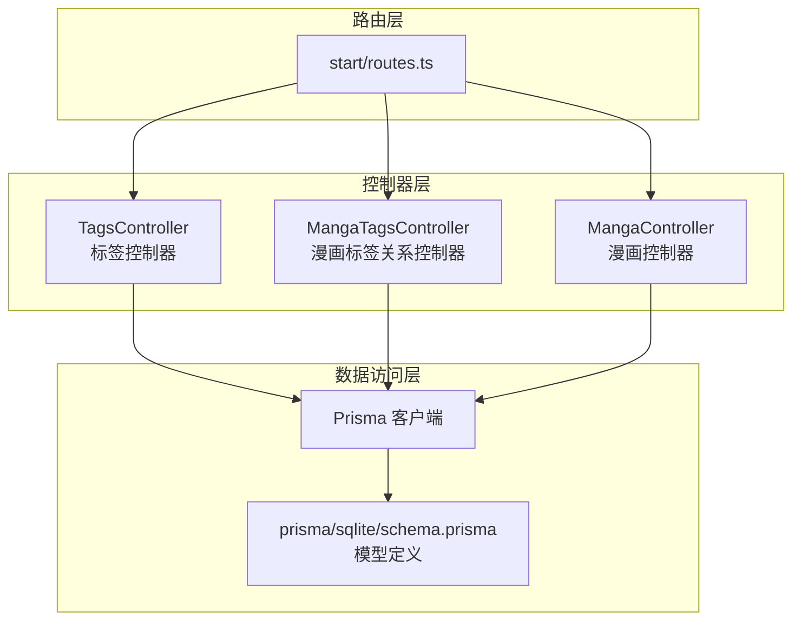
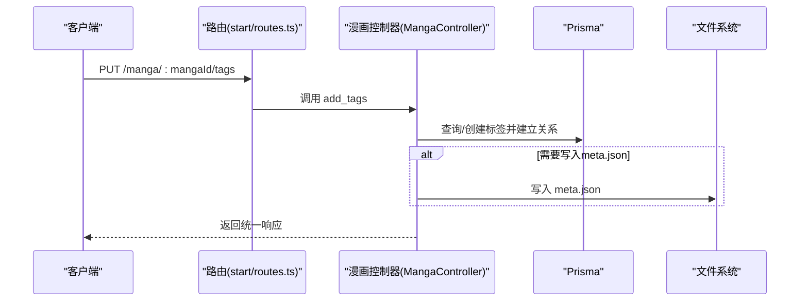
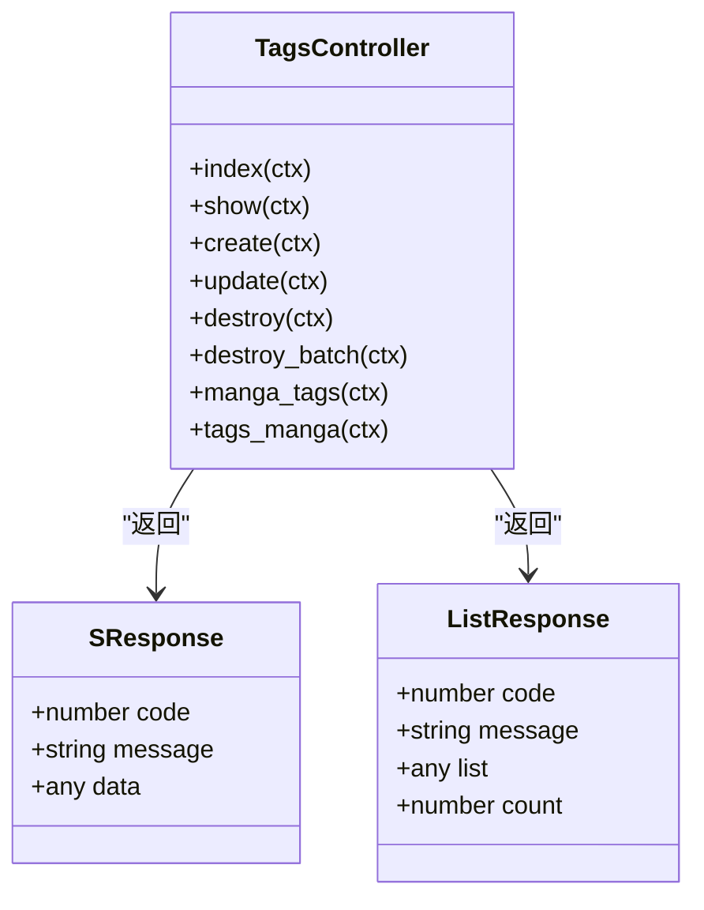
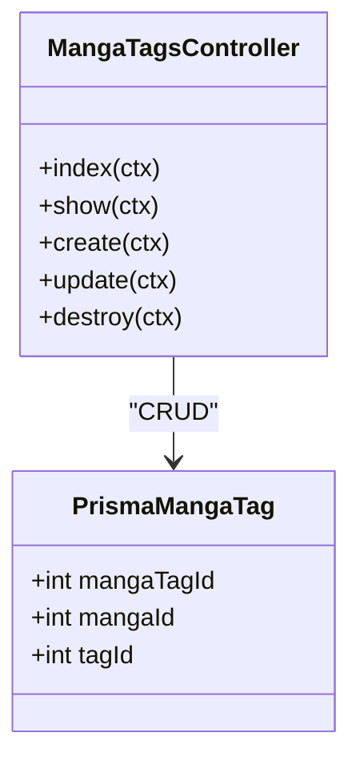
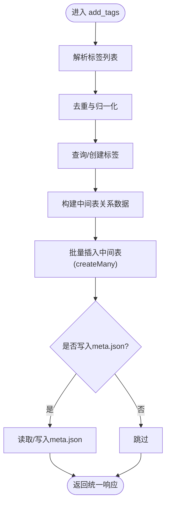
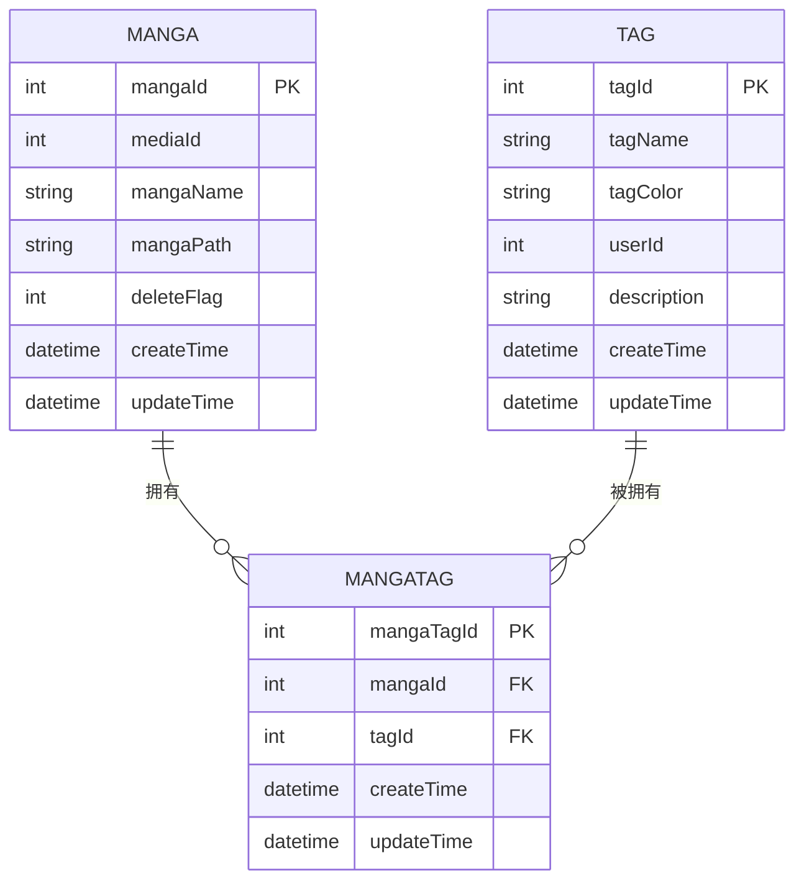
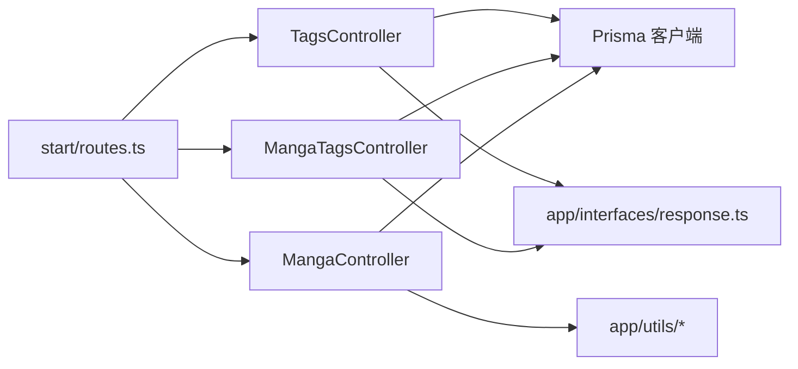

# 漫画标签系统

<cite>
**本文引用的文件**
- [app/controllers/tags_controller.ts](file://app/controllers/tags_controller.ts)
- [app/controllers/manga_tags_controller.ts](file://app/controllers/manga_tags_controller.ts)
- [app/controllers/manga_controller.ts](file://app/controllers/manga_controller.ts)
- [prisma/sqlite/schema.prisma](file://prisma/sqlite/schema.prisma)
- [start/routes.ts](file://start/routes.ts)
- [app/interfaces/response.ts](file://app/interfaces/response.ts)
- [app/utils/meta.ts](file://app/utils/meta.ts)
- [app/type/index.ts](file://app/type/index.ts)
- [app/utils/api.ts](file://app/utils/api.ts)
- [app/utils/index.ts](file://app/utils/index.ts)
</cite>

## 目录
1. [简介](#简介)
2. [项目结构](#项目结构)
3. [核心组件](#核心组件)
4. [架构总览](#架构总览)
5. [详细组件分析](#详细组件分析)
6. [依赖分析](#依赖分析)
7. [性能考虑](#性能考虑)
8. [故障排查指南](#故障排查指南)
9. [结论](#结论)
10. [附录](#附录)

## 简介
本文件面向SManga Adonis的漫画标签系统，围绕标签的添加、删除与管理展开，重点覆盖以下方面：
- 标签与漫画的多对多关系设计与Prisma模型映射
- 批量标签操作（add_tags）与标签关系维护流程
- 标签数据模型与关联查询策略
- 标签JSON文件写入与同步机制
- 标签API接口定义、使用示例与最佳实践
- 标签搜索、过滤与统计能力的实现要点

## 项目结构
标签系统由三层组成：HTTP路由层、控制器层、数据访问层（Prisma）。路由将请求转发到对应控制器，控制器调用Prisma进行数据库操作，并通过统一响应包装类返回结果。

图表来源
- [start/routes.ts:154-167](file://start/routes.ts#L154-L167)
- [app/controllers/tags_controller.ts:1-203](file://app/controllers/tags_controller.ts#L1-L203)
- [app/controllers/manga_tags_controller.ts:1-60](file://app/controllers/manga_tags_controller.ts#L1-L60)
- [app/controllers/manga_controller.ts:1-200](file://app/controllers/manga_controller.ts#L1-L200)
- [prisma/sqlite/schema.prisma:299-308](file://prisma/sqlite/schema.prisma#L299-L308)

章节来源
- [start/routes.ts:154-167](file://start/routes.ts#L154-L167)
- [prisma/sqlite/schema.prisma:299-308](file://prisma/sqlite/schema.prisma#L299-L308)

## 核心组件
- 标签控制器（TagsController）
  - 提供标签的增删改查、分页列表、按漫画查询标签、按标签查询漫画等接口
  - 支持单个标签删除与批量删除
- 漫画标签关系控制器（MangaTagsController）
  - 提供漫画标签关系的增删改查，用于维护多对多关系
- 漫画控制器（MangaController）
  - 提供add_tags接口，支持批量添加标签并可选写入meta.json
- 数据模型（Prisma）
  - tag：标签实体
  - mangaTag：标签与漫画的中间表（多对多关系）
  - manga：漫画实体，包含与标签的关系

章节来源
- [app/controllers/tags_controller.ts:1-203](file://app/controllers/tags_controller.ts#L1-L203)
- [app/controllers/manga_tags_controller.ts:1-60](file://app/controllers/manga_tags_controller.ts#L1-L60)
- [app/controllers/manga_controller.ts:1-200](file://app/controllers/manga_controller.ts#L1-L200)
- [prisma/sqlite/schema.prisma:299-308](file://prisma/sqlite/schema.prisma#L299-L308)

## 架构总览
标签系统采用经典的三层架构：
- 表现层：HTTP路由与控制器
- 业务层：控制器内封装业务逻辑（如批量标签添加、权限校验）
- 数据层：Prisma ORM负责模型映射与SQL生成

图表来源
- [start/routes.ts:179](file://start/routes.ts#L179)
- [app/controllers/manga_controller.ts:365-394](file://app/controllers/manga_controller.ts#L365-L394)

## 详细组件分析

### 标签控制器（TagsController）
- 功能概览
  - 列表与分页：支持不分页与分页两种模式
  - 单条查询：根据tagId查询标签
  - 新增/更新：创建与更新标签
  - 删除：单个删除与批量删除（同时清理中间表关系）
  - 关联查询：
    - 按漫画查询标签：返回该漫画的所有标签及中间表标识
    - 按标签查询漫画：支持分页与权限过滤
- 权限与安全
  - 在按标签查询漫画时，会基于用户角色与媒体权限进行过滤，避免越权访问
- 响应格式
  - 统一使用SResponse与ListResponse进行返回包装

图表来源
- [app/controllers/tags_controller.ts:1-203](file://app/controllers/tags_controller.ts#L1-L203)
- [app/interfaces/response.ts:18-63](file://app/interfaces/response.ts#L18-L63)

章节来源
- [app/controllers/tags_controller.ts:1-203](file://app/controllers/tags_controller.ts#L1-L203)
- [app/interfaces/response.ts:18-63](file://app/interfaces/response.ts#L18-L63)

### 漫画标签关系控制器（MangaTagsController）
- 功能概览
  - 列表与单条查询
  - 新增/更新/删除中间表记录
- 设计要点
  - 中间表包含唯一约束（mangaId, tagId），避免重复关系
  - 提供精确的中间表记录定位与修改

图表来源
- [app/controllers/manga_tags_controller.ts:1-60](file://app/controllers/manga_tags_controller.ts#L1-L60)
- [prisma/sqlite/schema.prisma:201-212](file://prisma/sqlite/schema.prisma#L201-L212)

章节来源
- [app/controllers/manga_tags_controller.ts:1-60](file://app/controllers/manga_tags_controller.ts#L1-L60)
- [prisma/sqlite/schema.prisma:201-212](file://prisma/sqlite/schema.prisma#L201-L212)

### 漫画控制器（MangaController）- 批量标签操作
- add_tags接口
  - 输入：mangaId + 标签列表（名称或ID）
  - 处理流程：
    - 解析输入标签，去重
    - 查询或创建标签，建立中间表关系（createMany）
    - 可选写入meta.json（当metaWriteJson为真时）
  - 输出：统一响应，包含创建数量或结果
- 权限与安全
  - 控制器内部包含用户与媒体权限校验逻辑（在其他方法中体现），建议在add_tags中同样遵循
- 性能优化
  - 使用createMany一次性批量插入中间表记录，减少多次往返

图表来源
- [app/controllers/manga_controller.ts:365-394](file://app/controllers/manga_controller.ts#L365-L394)

章节来源
- [app/controllers/manga_controller.ts:365-394](file://app/controllers/manga_controller.ts#L365-L394)

### 数据模型与关系设计
- 模型定义
  - tag：标签实体，包含标签名、颜色、描述、创建/更新时间等
  - manga：漫画实体，包含与标签的多对多关系
  - mangaTag：中间表，建立manga与tag的多对多关系，并带唯一约束
- 关系图

图表来源
- [prisma/sqlite/schema.prisma:299-308](file://prisma/sqlite/schema.prisma#L299-L308)
- [prisma/sqlite/schema.prisma:201-212](file://prisma/sqlite/schema.prisma#L201-L212)
- [prisma/sqlite/schema.prisma:163-198](file://prisma/sqlite/schema.prisma#L163-L198)

章节来源
- [prisma/sqlite/schema.prisma:299-308](file://prisma/sqlite/schema.prisma#L299-L308)
- [prisma/sqlite/schema.prisma:201-212](file://prisma/sqlite/schema.prisma#L201-L212)
- [prisma/sqlite/schema.prisma:163-198](file://prisma/sqlite/schema.prisma#L163-L198)

### API接口文档
- 标签管理
  - GET /tag：分页列出标签
  - GET /tag/:tagId：查询单个标签
  - POST /tag：创建标签
  - PUT /tag/:tagId：更新标签
  - DELETE /tag/:tagId：删除标签
  - DELETE /tag/:tagIds/batch：批量删除标签
- 标签与漫画关联
  - GET /manga-tag/:mangaId：查询某漫画的所有标签
  - POST /manga-tag：创建标签-漫画关系
  - DELETE /manga-tag/:mangaTagId：删除标签-漫画关系
  - GET /tags-manga：按标签查询漫画（支持分页与权限过滤）
- 批量标签操作
  - PUT /manga/:mangaId/tags：为漫画批量添加标签，支持可选写入meta.json

章节来源
- [start/routes.ts:154-167](file://start/routes.ts#L154-L167)
- [start/routes.ts:179](file://start/routes.ts#L179)

### 使用示例与最佳实践
- 批量添加标签
  - 请求：PUT /manga/{mangaId}/tags
  - 参数：标签数组（名称或ID），可选metaWriteJson控制是否写入meta.json
  - 最佳实践：
    - 先去重再提交，避免重复标签
    - 使用createMany批量插入中间表，提升性能
    - 若启用meta.json写入，确保目录存在且有写权限
- 权限控制
  - 在按标签查询漫画时，需结合用户角色与媒体权限进行过滤，防止越权
- 数据一致性
  - 删除标签时，先清理中间表关系，再删除标签
  - 批量删除标签时，使用事务或成批删除以保证原子性

章节来源
- [app/controllers/manga_controller.ts:365-394](file://app/controllers/manga_controller.ts#L365-L394)
- [app/controllers/tags_controller.ts:83-114](file://app/controllers/tags_controller.ts#L83-L114)
- [app/controllers/tags_controller.ts:137-201](file://app/controllers/tags_controller.ts#L137-L201)

### 标签搜索、过滤与统计
- 搜索与过滤
  - 标签列表：支持分页与排序
  - 按标签查询漫画：支持tagIds数组、分页、权限过滤
- 统计
  - 可基于中间表统计标签使用频次（在业务层聚合）
  - 漫画详情展示时，可将mangaTags转换为tag集合返回

章节来源
- [app/controllers/tags_controller.ts:19-52](file://app/controllers/tags_controller.ts#L19-L52)
- [app/controllers/tags_controller.ts:137-201](file://app/controllers/tags_controller.ts#L137-L201)
- [app/controllers/manga_controller.ts:117-145](file://app/controllers/manga_controller.ts#L117-L145)

## 依赖分析
- 控制器依赖
  - TagsController与MangaTagsController均依赖Prisma客户端
  - MangaController依赖Prisma与工具函数（文件读写、排序参数等）
- 模块耦合
  - 控制器与Prisma模型解耦，通过路由集中暴露接口
  - 统一响应包装类降低控制器与前端交互复杂度
- 外部依赖
  - axios用于同步接口调用（与标签系统无直接关联，但属于系统工具集）

图表来源
- [start/routes.ts:154-167](file://start/routes.ts#L154-L167)
- [app/controllers/tags_controller.ts:1-203](file://app/controllers/tags_controller.ts#L1-L203)
- [app/controllers/manga_tags_controller.ts:1-60](file://app/controllers/manga_tags_controller.ts#L1-L60)
- [app/controllers/manga_controller.ts:1-200](file://app/controllers/manga_controller.ts#L1-L200)
- [app/interfaces/response.ts:18-63](file://app/interfaces/response.ts#L18-L63)

## 性能考虑
- 批量插入
  - 使用createMany减少数据库往返次数
- 并行查询
  - 列表查询中使用Promise.all并行获取数据与总数
- 文件写入
  - meta.json写入前检查目录存在性，避免异常
- 排序与索引
  - 在Prisma schema中为常用查询字段建立索引（如tagId、mangaId）可进一步提升性能

章节来源
- [app/controllers/manga_controller.ts:365-394](file://app/controllers/manga_controller.ts#L365-L394)
- [app/controllers/tags_controller.ts:41-44](file://app/controllers/tags_controller.ts#L41-L44)

## 故障排查指南
- 删除标签报错
  - 确认是否先清理中间表关系再删除标签
  - 检查批量删除参数格式（逗号分隔的tagIds）
- 权限问题
  - 按标签查询漫画时，确认用户角色与媒体权限配置
- meta.json写入失败
  - 检查目标路径是否存在且具备写权限
  - 确保metaWriteJson参数正确传递

章节来源
- [app/controllers/tags_controller.ts:83-114](file://app/controllers/tags_controller.ts#L83-L114)
- [app/controllers/manga_controller.ts:377-391](file://app/controllers/manga_controller.ts#L377-L391)

## 结论
SManga Adonis的标签系统通过清晰的三层架构与Prisma模型实现了标签与漫画的多对多关系管理。控制器层提供了完善的增删改查与批量操作接口，配合统一响应包装与权限过滤，满足了实际业务需求。通过批量插入与并行查询优化，系统在性能上具备良好表现；通过meta.json写入与同步机制，实现了标签数据的持久化与外部共享能力。

## 附录
- 元数据与标签
  - 元数据解析工具可从ComicInfo中提取标签数组，便于导入与同步
- 类型定义
  - metaKeyType与metaType定义了元数据键与结构，便于跨模块使用

章节来源
- [app/utils/meta.ts:1-34](file://app/utils/meta.ts#L1-L34)
- [app/type/index.ts:18-48](file://app/type/index.ts#L18-L48)