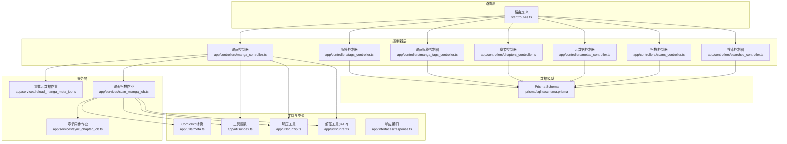
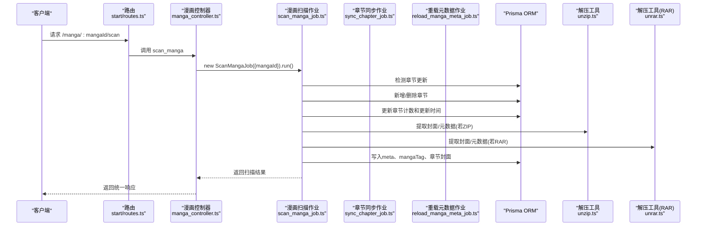
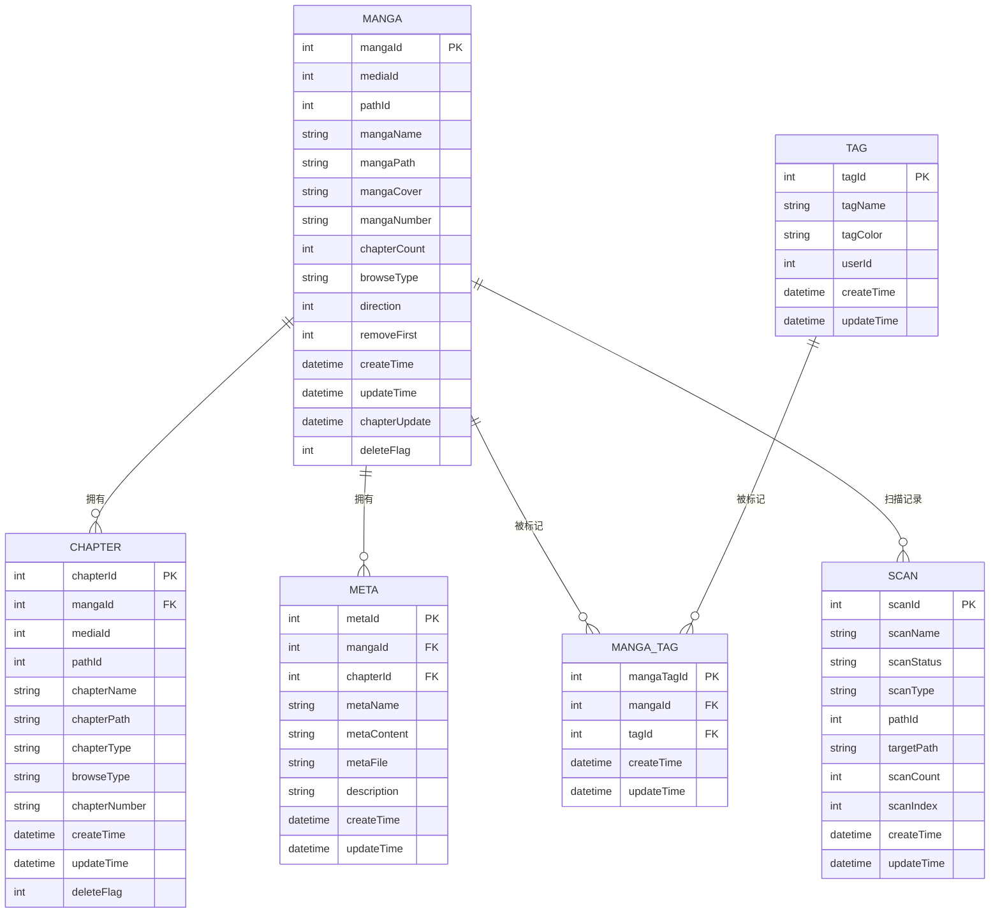
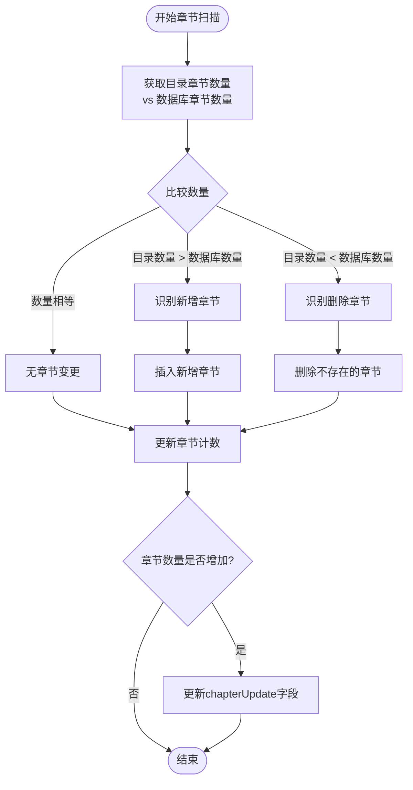
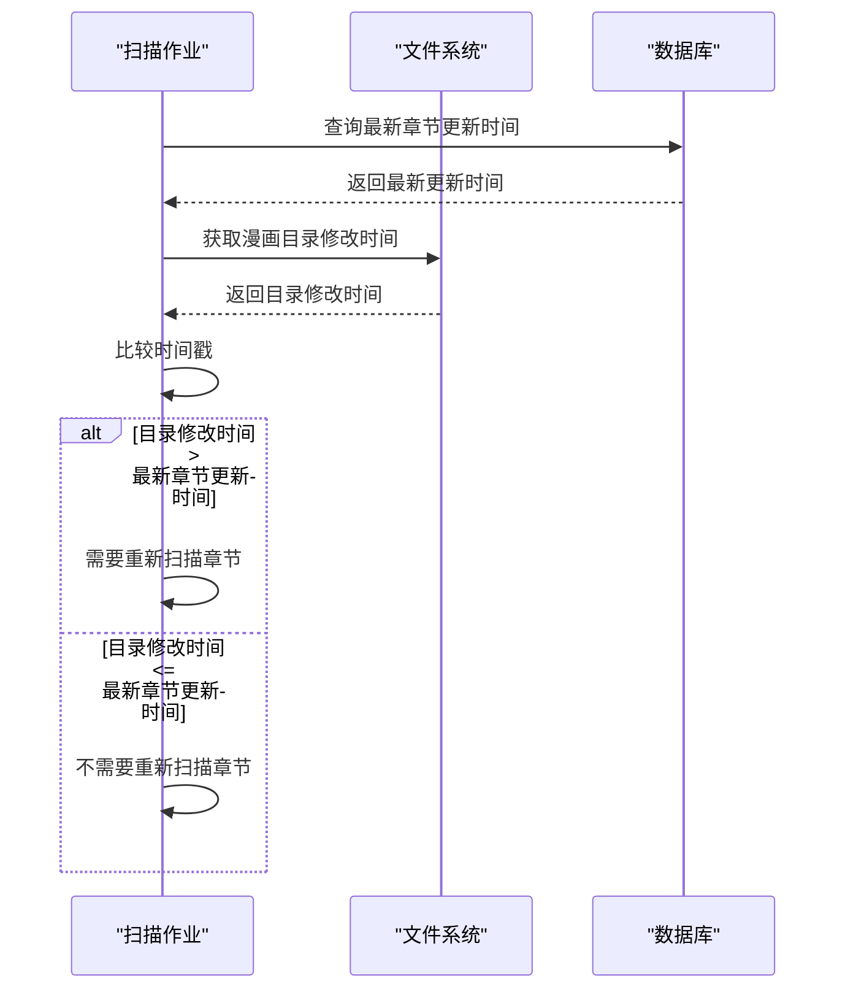
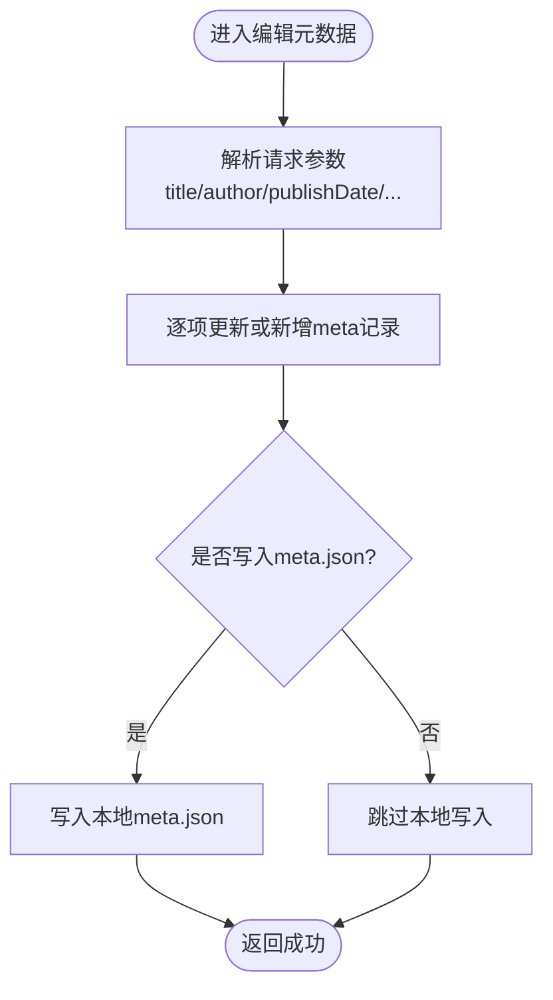
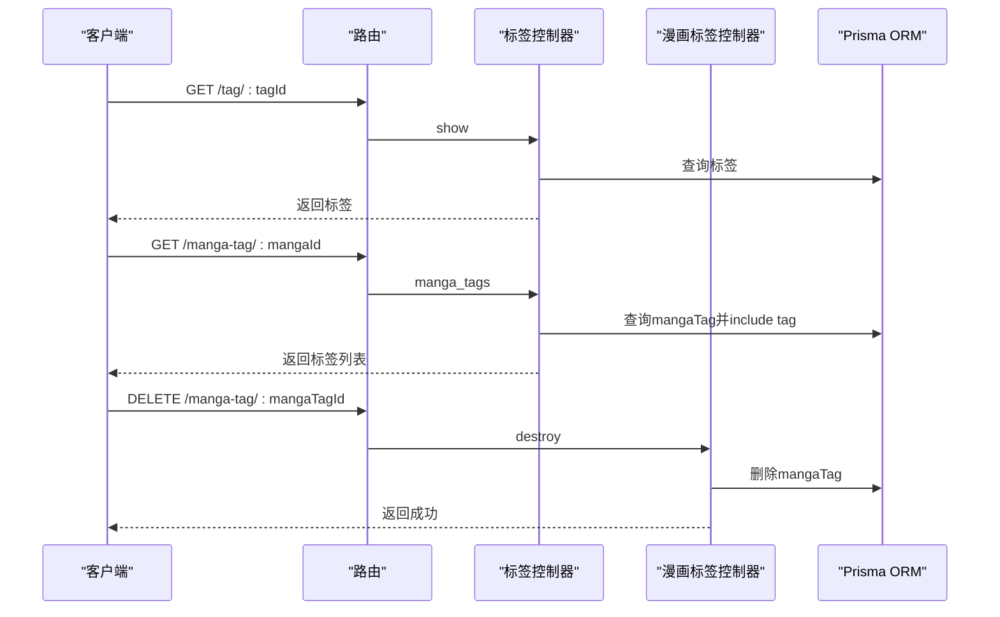
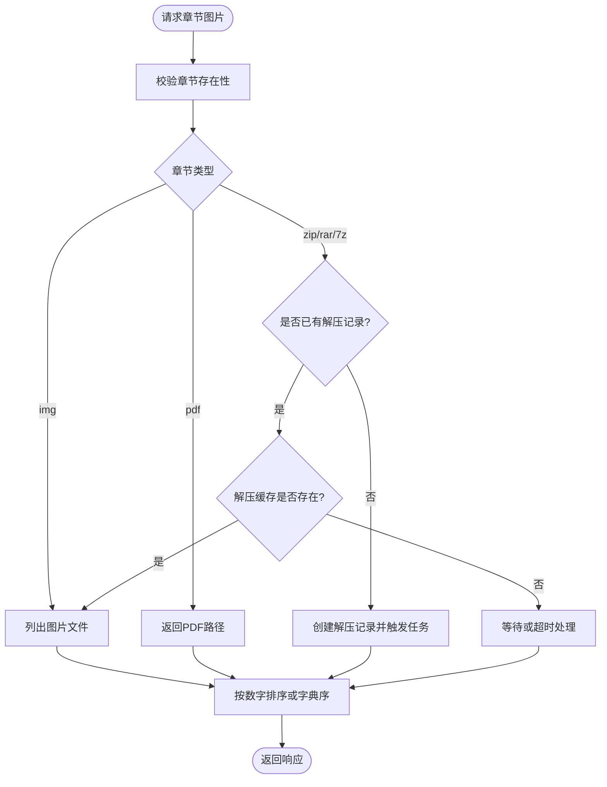
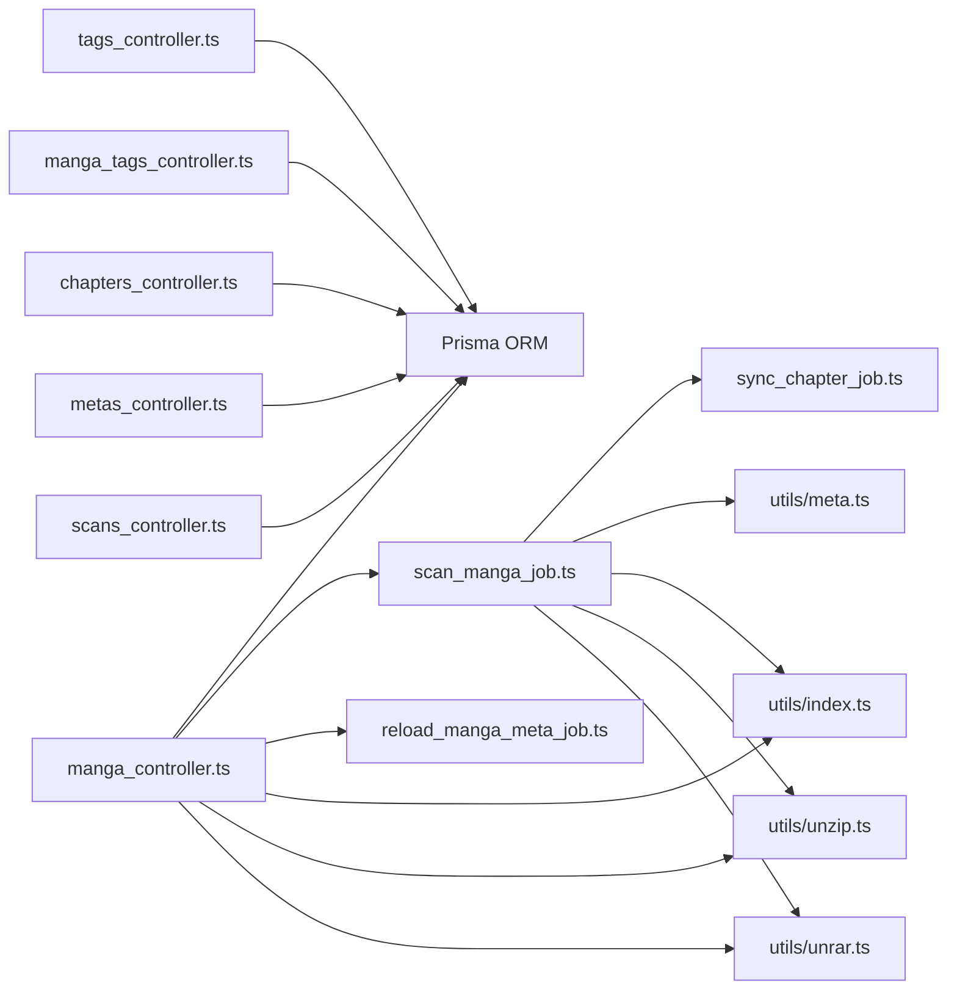

# 漫画管理模块

<cite>
**本文引用的文件**
- [manga_controller.ts](file://app/controllers/manga_controller.ts)
- [manga_tags_controller.ts](file://app/controllers/manga_tags_controller.ts)
- [tags_controller.ts](file://app/controllers/tags_controller.ts)
- [chapters_controller.ts](file://app/controllers/chapters_controller.ts)
- [metas_controller.ts](file://app/controllers/metas_controller.ts)
- [scans_controller.ts](file://app/controllers/scans_controller.ts)
- [scan_manga_job.ts](file://app/services/scan_manga_job.ts)
- [sync_chapter_job.ts](file://app/services/sync_chapter_job.ts)
- [schema.prisma](file://prisma/sqlite/schema.prisma)
- [routes.ts](file://start/routes.ts)
- [reload_manga_meta_job.ts](file://app/services/reload_manga_meta_job.ts)
- [meta.ts](file://app/utils/meta.ts)
- [index.ts（响应接口）](file://app/interfaces/response.ts)
- [index.ts（工具函数）](file://app/utils/index.ts)
- [unzip.ts](file://app/utils/unzip.ts)
- [unrar.ts](file://app/utils/unrar.ts)
- [searches_controller.ts](file://app/controllers/searches_controller.ts)
- [20260402181920_chapter_update_migration.sql](file://prisma/sqlite/migrations/20260402181920_chapter_update/migration.sql)
- [20260402181850_chapter_update_migration.sql](file://prisma/pgsql/migrations/20260402181850_chapter_update/migration.sql)
- [20260402181735_chapter_update_migration.sql](file://prisma/mysql/migrations/20260402181735_chapter_update/migration.sql)
</cite>

## 更新摘要
**所做更改**
- 新增章节更新跟踪机制章节，详细说明chapterUpdate字段的作用和实现
- 更新漫画扫描功能描述，包含章节数量比较逻辑和更新策略
- 新增章节更新检测算法说明，包括should_chapter_update方法
- 更新数据模型说明，包含新的chapterUpdate字段定义
- 新增章节更新排序功能说明

## 目录
1. [简介](#简介)
2. [项目结构](#项目结构)
3. [核心组件](#核心组件)
4. [架构总览](#架构总览)
5. [详细组件分析](#详细组件分析)
6. [依赖关系分析](#依赖关系分析)
7. [性能考量](#性能考量)
8. [故障排查指南](#故障排查指南)
9. [结论](#结论)
10. [附录](#附录)

## 简介
本文件为 SManga Adonis 的漫画管理模块提供系统化技术文档，覆盖漫画数据模型设计、CRUD 操作、标签管理、元数据与封面处理、章节关联、搜索与排序、批量处理、任务队列与异步处理、章节更新跟踪机制以及 API 接口规范。文档旨在帮助开发者快速理解模块实现、正确集成与扩展，并提供可操作的排错建议。

## 项目结构
漫画管理模块围绕"漫画（manga）—标签（tag）—标签关联（mangaTag）—章节（chapter）—元数据（meta）—扫描记录（scan）"展开，采用控制器-服务-工具函数分层组织，配合 Prisma ORM 实现跨数据库适配（SQLite/MySQL/PostgreSQL）。路由集中定义在统一入口，便于前后端对接。

**图表来源**
- [routes.ts:169-193](file://start/routes.ts#L169-L193)
- [manga_controller.ts:12-460](file://app/controllers/manga_controller.ts#L12-L460)
- [tags_controller.ts:1-203](file://app/controllers/tags_controller.ts#L1-L203)
- [manga_tags_controller.ts:1-60](file://app/controllers/manga_tags_controller.ts#L1-L60)
- [chapters_controller.ts:1-515](file://app/controllers/chapters_controller.ts#L1-L515)
- [metas_controller.ts:1-61](file://app/controllers/metas_controller.ts#L1-L61)
- [scans_controller.ts:1-58](file://app/controllers/scans_controller.ts#L1-L58)
- [scan_manga_job.ts:1-1181](file://app/services/scan_manga_job.ts#L1-L1181)
- [sync_chapter_job.ts:1-35](file://app/services/sync_chapter_job.ts#L1-L35)
- [reload_manga_meta_job.ts:1-683](file://app/services/reload_manga_meta_job.ts#L1-L683)
- [schema.prisma:163-264](file://prisma/sqlite/schema.prisma#L163-L264)
- [index.ts（工具函数）:1-200](file://app/utils/index.ts#L1-L200)
- [unzip.ts:1-168](file://app/utils/unzip.ts#L1-L168)
- [unrar.ts:1-118](file://app/utils/unrar.ts#L1-L118)
- [meta.ts:1-34](file://app/utils/meta.ts#L1-L34)
- [index.ts（响应接口）:1-64](file://app/interfaces/response.ts#L1-L64)

**章节来源**
- [routes.ts:169-193](file://start/routes.ts#L169-L193)
- [schema.prisma:163-264](file://prisma/sqlite/schema.prisma#L163-L264)

## 核心组件
- 漫画控制器：提供漫画列表/详情、增删改、扫描、元数据编辑、标签设置、批量压缩/清理、重载元数据等能力。
- 标签控制器：提供标签的增删改查、分页、批量删除、查询绑定到漫画的标签、按标签筛选漫画。
- 漫画标签控制器：维护 mangaTag 关联表的 CRUD。
- 章节控制器：提供章节列表/详情、图片列表（含压缩/解压）、下载、批量删除、压缩记录清理。
- 元数据控制器：提供 meta 表的通用 CRUD。
- 扫描控制器：提供扫描记录的增删改查，支持扫描任务管理。
- 漫画扫描作业：负责章节更新检测、新增/删除章节处理、元数据同步和章节顺序更新。
- 章节同步作业：处理云端漫画章节的外置封面下载和同步。
- 重载元数据作业：负责扫描 smanga 元数据、ComicInfo、生成封面、更新标签与章节顺序。
- 工具与类型：统一的响应格式、排序参数解析、路径与配置、解压与封面提取、ComicInfo 转换。
- 数据模型：基于 Prisma 的 schema，定义 manga、chapter、meta、tag、mangaTag、scan 等实体及关系。

**章节来源**
- [manga_controller.ts:12-460](file://app/controllers/manga_controller.ts#L12-L460)
- [tags_controller.ts:1-203](file://app/controllers/tags_controller.ts#L1-L203)
- [manga_tags_controller.ts:1-60](file://app/controllers/manga_tags_controller.ts#L1-L60)
- [chapters_controller.ts:1-515](file://app/controllers/chapters_controller.ts#L1-L515)
- [metas_controller.ts:1-61](file://app/controllers/metas_controller.ts#L1-L61)
- [scans_controller.ts:1-58](file://app/controllers/scans_controller.ts#L1-L58)
- [scan_manga_job.ts:1-1181](file://app/services/scan_manga_job.ts#L1-L1181)
- [sync_chapter_job.ts:1-35](file://app/services/sync_chapter_job.ts#L1-L35)
- [reload_manga_meta_job.ts:1-683](file://app/services/reload_manga_meta_job.ts#L1-L683)
- [index.ts（响应接口）:1-64](file://app/interfaces/response.ts#L1-L64)
- [index.ts（工具函数）:1-200](file://app/utils/index.ts#L1-L200)
- [unzip.ts:1-168](file://app/utils/unzip.ts#L1-L168)
- [unrar.ts:1-118](file://app/utils/unrar.ts#L1-L118)
- [meta.ts:1-34](file://app/utils/meta.ts#L1-L34)
- [schema.prisma:163-264](file://prisma/sqlite/schema.prisma#L163-L264)

## 架构总览
漫画管理模块采用"控制器-服务-工具-ORM"的分层架构，通过路由统一暴露 RESTful 接口；业务流程通过任务队列异步执行（如扫描、压缩、封面复制、章节同步），保障主线程响应性与稳定性。

**图表来源**
- [routes.ts:177-177](file://start/routes.ts#L177-L177)
- [manga_controller.ts:336-348](file://app/controllers/manga_controller.ts#L336-L348)
- [scan_manga_job.ts:356-362](file://app/services/scan_manga_job.ts#L356-L362)
- [sync_chapter_job.ts:20-35](file://app/services/sync_chapter_job.ts#L20-L35)
- [reload_manga_meta_job.ts:42-92](file://app/services/reload_manga_meta_job.ts#L42-L92)
- [unzip.ts:102-114](file://app/utils/unzip.ts#L102-L114)
- [unrar.ts:55-115](file://app/utils/unrar.ts#L55-L115)

## 详细组件分析

### 数据模型与关系
漫画管理模块的核心数据模型如下，新增了章节更新跟踪机制：

**图表来源**
- [schema.prisma:163-264](file://prisma/sqlite/schema.prisma#L163-L264)
- [20260402181920_chapter_update_migration.sql:4-28](file://prisma/sqlite/migrations/20260402181920_chapter_update/migration.sql#L4-L28)

**章节来源**
- [schema.prisma:163-264](file://prisma/sqlite/schema.prisma#L163-L264)
- [20260402181920_chapter_update_migration.sql:4-28](file://prisma/sqlite/migrations/20260402181920_chapter_update/migration.sql#L4-L28)

### 章节更新跟踪机制
**新增功能**：漫画扫描功能现在包含章节更新跟踪机制，通过chapterUpdate字段和章节数量比较逻辑实现智能更新检测。

#### 章节更新检测算法
漫画扫描作业实现了智能的章节更新检测机制：

1. **章节数量比较**：扫描时比较实际目录中的章节数量与数据库中存储的章节数量
2. **新增章节处理**：当实际目录章节数量大于数据库记录时，识别新增章节并创建
3. **删除章节处理**：当实际目录章节数量小于数据库记录时，识别删除章节并清理
4. **更新时间标记**：仅在章节数量增加时更新chapterUpdate字段

**图表来源**
- [scan_manga_job.ts:262-359](file://app/services/scan_manga_job.ts#L262-L359)
- [scan_manga_job.ts:356-362](file://app/services/scan_manga_job.ts#L356-L362)

#### 章节更新检测方法
扫描作业提供了专门的方法来判断是否需要更新章节：

**图表来源**
- [scan_manga_job.ts:402-425](file://app/services/scan_manga_job.ts#L402-L425)

**章节来源**
- [scan_manga_job.ts:262-359](file://app/services/scan_manga_job.ts#L262-L359)
- [scan_manga_job.ts:356-362](file://app/services/scan_manga_job.ts#L356-L362)
- [scan_manga_job.ts:402-425](file://app/services/scan_manga_job.ts#L402-L425)

### 漫画控制器（CRUD、扫描、元数据、标签、压缩）
- 列表与分页：支持按媒体库、关键字、排序参数查询；新增chapterUpdate排序支持；非管理员需受媒体权限约束。
- 详情：包含元数据、标签、媒体信息的聚合返回。
- 新增/更新/删除：标准 CRUD；软删除通过 deleteFlag 字段实现。
- 扫描：异步添加扫描任务，支持本地与云盘库场景，包含章节更新跟踪。
- 元数据编辑：支持多字段原子更新，可选写入本地 meta.json。
- 重载元数据：调用作业类扫描 smanga 元数据、ComicInfo、生成封面、更新标签与章节顺序。
- 标签设置：清空旧标签后批量写入新标签，可选写入本地标签文件。
- 批量压缩/清理：针对漫画下所有未压缩章节发起压缩任务，或删除压缩记录与缓存。

**图表来源**
- [manga_controller.ts:261-308](file://app/controllers/manga_controller.ts#L261-L308)

**章节来源**
- [manga_controller.ts:12-460](file://app/controllers/manga_controller.ts#L12-L460)

### 标签管理（标签与漫画标签）
- 标签 CRUD：支持分页、批量删除；创建时记录 userId 以区分系统/用户标签。
- 漫画标签 CRUD：维护 mangaTag 关联表。
- 标签到漫画查询：按标签集合分页查询绑定的漫画，支持媒体权限过滤。
- 漫画到标签查询：查询某漫画绑定的所有标签。

**图表来源**
- [routes.ts:154-167](file://start/routes.ts#L154-L167)
- [tags_controller.ts:116-135](file://app/controllers/tags_controller.ts#L116-L135)
- [manga_tags_controller.ts:12-59](file://app/controllers/manga_tags_controller.ts#L12-L59)

**章节来源**
- [tags_controller.ts:1-203](file://app/controllers/tags_controller.ts#L1-L203)
- [manga_tags_controller.ts:1-60](file://app/controllers/manga_tags_controller.ts#L1-L60)

### 章节管理（图片列表、压缩/解压、下载）
- 图片列表：根据章节类型（图片/压缩包/PDF）返回图片路径；支持同步/异步解压与缓存清理。
- 下载：纯图章节返回图片列表，压缩包返回原文件流。
- 压缩记录清理：删除压缩记录与缓存目录。

**图表来源**
- [chapters_controller.ts:180-369](file://app/controllers/chapters_controller.ts#L180-L369)
- [unzip.ts:10-13](file://app/utils/unzip.ts#L10-L13)
- [unzip.ts:102-114](file://app/utils/unzip.ts#L102-L114)
- [unrar.ts:55-115](file://app/utils/unrar.ts#L55-L115)

**章节来源**
- [chapters_controller.ts:1-515](file://app/controllers/chapters_controller.ts#L1-L515)
- [unzip.ts:1-168](file://app/utils/unzip.ts#L1-L168)
- [unrar.ts:1-118](file://app/utils/unrar.ts#L1-L118)

### 元数据管理（meta）
- 通用 CRUD：支持 meta 表的增删改查。
- 元数据键类型：统一定义 title/subTitle/author/star/describe/publishDate/classify/finished/updateDate/publisher/status/tags 等键。

**章节来源**
- [metas_controller.ts:1-61](file://app/controllers/metas_controller.ts#L1-L61)
- [index.ts（类型定义）:18-48](file://app/type/index.ts#L18-L48)

### 扫描管理（scan）
- 扫描记录 CRUD：支持扫描任务的增删改查。
- 扫描状态管理：跟踪扫描进度和状态。
- 扫描任务调度：与漫画扫描作业协同工作。

**章节来源**
- [scans_controller.ts:1-58](file://app/controllers/scans_controller.ts#L1-L58)

### 搜索功能
- 漫画搜索：按 subTitle 关键字分页查询，支持排序与媒体权限过滤。
- 章节搜索：按 subTitle 关键字分页查询，支持排序与媒体权限过滤。

**章节来源**
- [searches_controller.ts:14-74](file://app/controllers/searches_controller.ts#L14-L74)
- [searches_controller.ts:76-135](file://app/controllers/searches_controller.ts#L76-L135)

### API 接口清单（节选）
- 漫画
  - GET /manga → 列表（支持分页、关键字、排序、媒体过滤，新增chapterUpdate排序）
  - GET /manga/:mangaId → 详情（含元数据、标签、媒体）
  - POST /manga → 新增
  - PUT /manga/:mangaId → 更新
  - DELETE /manga/:mangaId → 软删除
  - DELETE /manga/:mangaIds/batch → 批量软删除
  - PUT /manga/:mangaId/scan → 添加扫描任务（包含章节更新跟踪）
  - PUT /manga/:mangaId/reload-meta → 重载元数据
  - PUT /manga/:mangaId/meta → 编辑元数据（可写本地meta.json）
  - PUT /manga/:mangaId/tags → 设置标签（可写本地标签文件）
  - PUT /manga/:mangaId/compress → 批量压缩未压缩章节
  - DELETE /manga/:mangaId/compress → 清理压缩记录与缓存
- 标签
  - GET /tag → 标签列表（支持分页）
  - GET /tag/:tagId → 标签详情
  - POST /tag → 新增标签（记录userId）
  - PUT /tag/:tagId → 更新标签
  - DELETE /tag/:tagId → 删除标签（先删关联）
  - DELETE /tag/:tagIds/batch → 批量删除标签
  - GET /manga-tag/:mangaId → 查询漫画绑定的标签
  - GET /tags-manga → 按标签集合查询漫画（分页）
- 章节
  - GET /chapter → 章节列表（支持分页、关键字、排序、媒体过滤）
  - GET /chapter/:chapterId → 章节详情
  - GET /chapter-images/:chapterId → 图片列表（含解压/缓存策略）
  - POST /chapter → 新增
  - PUT /chapter/:chapterId → 更新
  - DELETE /chapter/:chapterId → 软删除
  - DELETE /chapter/:chapterIds/batch → 批量软删除
  - DELETE /chapter/:chapterId/compress → 清理压缩记录
- 元数据
  - GET /meta → 元数据列表
  - GET /meta/:metaId → 元数据详情
  - POST /meta → 新增
  - PUT /meta/:metaId → 更新
  - DELETE /meta/:metaId → 删除
- 扫描
  - GET /scan → 扫描记录列表
  - GET /scan/:scanId → 扫描记录详情
  - POST /scan → 新增扫描记录
  - PUT /scan/:scanId → 更新扫描记录
  - DELETE /scan/:scanId → 删除扫描记录
- 搜索
  - GET /search-mangas → 漫画搜索
  - GET /search-chapters → 章节搜索

**章节来源**
- [routes.ts:169-193](file://start/routes.ts#L169-L193)
- [routes.ts:154-167](file://start/routes.ts#L154-L167)
- [scans_controller.ts:1-58](file://app/controllers/scans_controller.ts#L1-L58)

## 依赖关系分析
- 控制器依赖 Prisma ORM 进行数据访问；部分操作通过工具函数进行路径解析、配置读取、解压与封面提取。
- 漫画扫描作业串联章节更新检测、新增/删除章节处理、元数据同步等多个功能模块。
- 重载元数据作业串联多个工具与控制器能力，形成完整的元数据同步链路。
- 路由集中暴露接口，便于统一鉴权与权限控制。

**图表来源**
- [manga_controller.ts:1-12](file://app/controllers/manga_controller.ts#L1-L12)
- [tags_controller.ts:1-3](file://app/controllers/tags_controller.ts#L1-L3)
- [manga_tags_controller.ts:1-3](file://app/controllers/manga_tags_controller.ts#L1-L3)
- [chapters_controller.ts:1-3](file://app/controllers/chapters_controller.ts#L1-L3)
- [metas_controller.ts:1-3](file://app/controllers/metas_controller.ts#L1-L3)
- [scans_controller.ts:1-3](file://app/controllers/scans_controller.ts#L1-L3)
- [scan_manga_job.ts:1-16](file://app/services/scan_manga_job.ts#L1-L16)
- [sync_chapter_job.ts:1-16](file://app/services/sync_chapter_job.ts#L1-L16)
- [reload_manga_meta_job.ts:1-16](file://app/services/reload_manga_meta_job.ts#L1-L16)
- [index.ts（工具函数）:1-200](file://app/utils/index.ts#L1-L200)
- [unzip.ts:1-168](file://app/utils/unzip.ts#L1-L168)
- [unrar.ts:1-118](file://app/utils/unrar.ts#L1-L118)

**章节来源**
- [manga_controller.ts:1-12](file://app/controllers/manga_controller.ts#L1-L12)
- [scan_manga_job.ts:1-16](file://app/services/scan_manga_job.ts#L1-L16)
- [sync_chapter_job.ts:1-16](file://app/services/sync_chapter_job.ts#L1-L16)
- [reload_manga_meta_job.ts:1-16](file://app/services/reload_manga_meta_job.ts#L1-L16)
- [index.ts（工具函数）:1-200](file://app/utils/index.ts#L1-L200)

## 性能考量
- 异步任务：扫描、压缩、封面复制均通过任务队列执行，避免阻塞请求线程。
- 分页与并发：列表查询使用 take/skip 并发统计 count，减少一次性加载压力。
- 解压策略：首次访问创建解压记录并触发任务，后续复用缓存；可配置自动清理缓存降低磁盘占用。
- 排序参数：统一解析 order 参数，支持按 id/number/name/createTime/updateTime/chapterUpdate 升/降序。
- 数据库适配：Prisma schema 在 SQLite/MySQL/PostgreSQL 下均可用，注意字段长度与日期类型差异。
- 章节更新优化：通过章节数量比较和时间戳检测，避免不必要的全量扫描。

## 故障排查指南
- 权限问题：非管理员访问需满足媒体权限，否则返回 401/403。
- 资源不存在：漫画/路径/章节不存在时返回相应提示与状态码。
- 解压超时：章节解压任务超时会删除记录，需检查压缩包完整性与解压工具依赖。
- 本地元数据写入：编辑元数据时可选择写入本地 meta.json，需确认目录权限与磁盘空间。
- 标签冲突：系统标签保持唯一性，用户标签不强制唯一，注意标签合并策略。
- 章节更新异常：检查chapterUpdate字段是否正确更新，验证章节数量比较逻辑。
- 扫描任务失败：检查扫描作业的日志输出，确认文件系统访问权限和磁盘空间。

**章节来源**
- [manga_controller.ts:217-259](file://app/controllers/manga_controller.ts#L217-L259)
- [chapters_controller.ts:328-359](file://app/controllers/chapters_controller.ts#L328-L359)
- [tags_controller.ts:83-91](file://app/controllers/tags_controller.ts#L83-L91)
- [scan_manga_job.ts:402-425](file://app/services/scan_manga_job.ts#L402-L425)

## 结论
漫画管理模块通过清晰的分层设计与完善的任务队列机制，实现了从数据模型到接口层的完整闭环。新增的章节更新跟踪机制显著提升了扫描效率，通过智能的章节数量比较和时间戳检测，避免了不必要的全量扫描。标签与元数据体系支持灵活的内容组织与检索，章节解压与封面处理兼顾性能与体验。建议在生产环境中结合监控与日志，持续优化任务优先级与缓存策略。

## 附录

### 响应格式
- 统一响应：code/message/data/error/status
- 列表响应：在统一响应基础上增加 list/count

**章节来源**
- [index.ts（响应接口）:1-64](file://app/interfaces/response.ts#L1-L64)

### 排序参数规范
- order 支持 asc/desc，默认升序
- 支持 id、number、name、createTime、updateTime、chapterUpdate 等字段排序

**章节来源**
- [index.ts（工具函数）:117-160](file://app/utils/index.ts#L117-L160)

### 元数据键类型
- title、subTitle、author、star、describe、publishDate、classify、finished、updateDate、publisher、status、tags

**章节来源**
- [index.ts（类型定义）:18-48](file://app/type/index.ts#L18-L48)

### 章节更新跟踪机制
**新增功能**：章节更新跟踪机制通过以下方式实现：

1. **数据模型增强**：新增chapterUpdate字段，记录章节最后更新时间
2. **智能检测算法**：通过比较目录修改时间和最新章节更新时间判断是否需要扫描
3. **增量更新策略**：仅处理新增或删除的章节，避免全量重建
4. **性能优化**：减少不必要的文件系统扫描和数据库操作

**章节来源**
- [schema.prisma:186](file://prisma/sqlite/schema.prisma#L186)
- [scan_manga_job.ts:402-425](file://app/services/scan_manga_job.ts#L402-L425)
- [scan_manga_job.ts:262-359](file://app/services/scan_manga_job.ts#L262-L359)