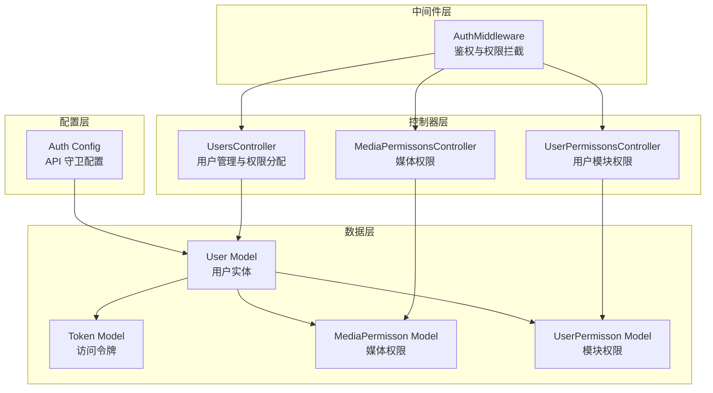
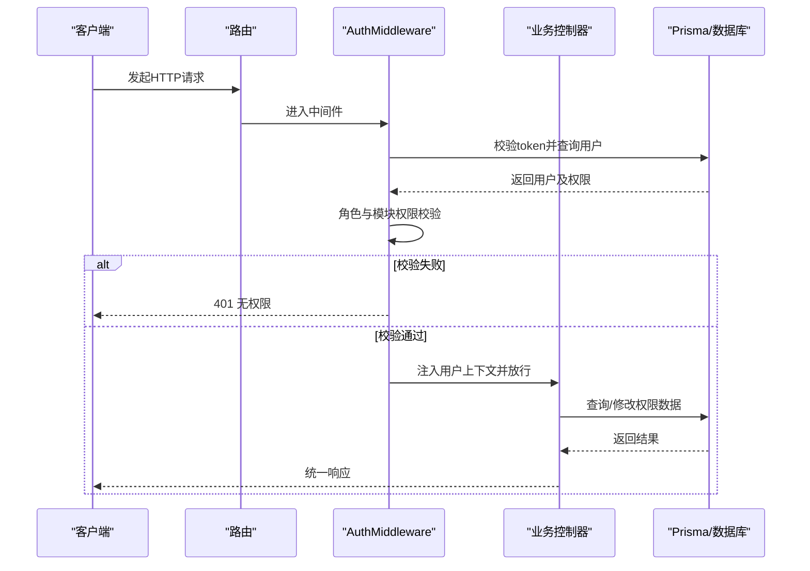
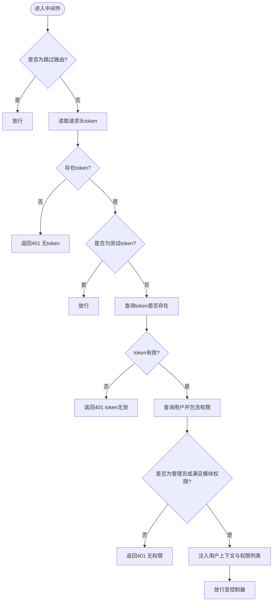
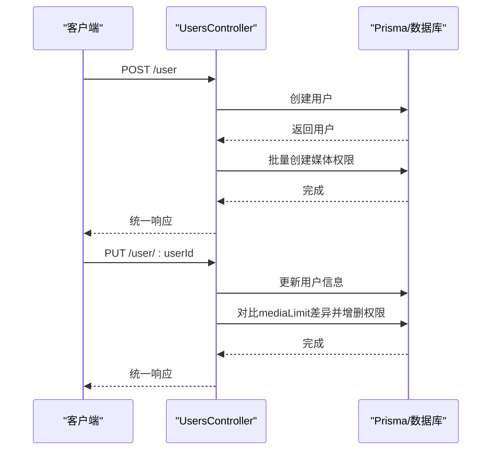
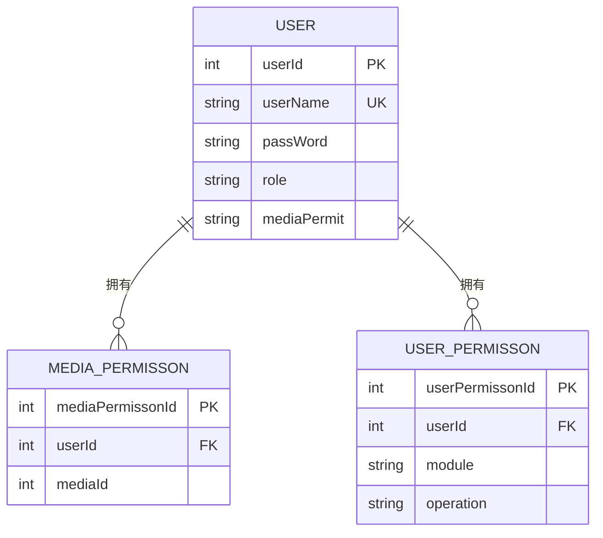
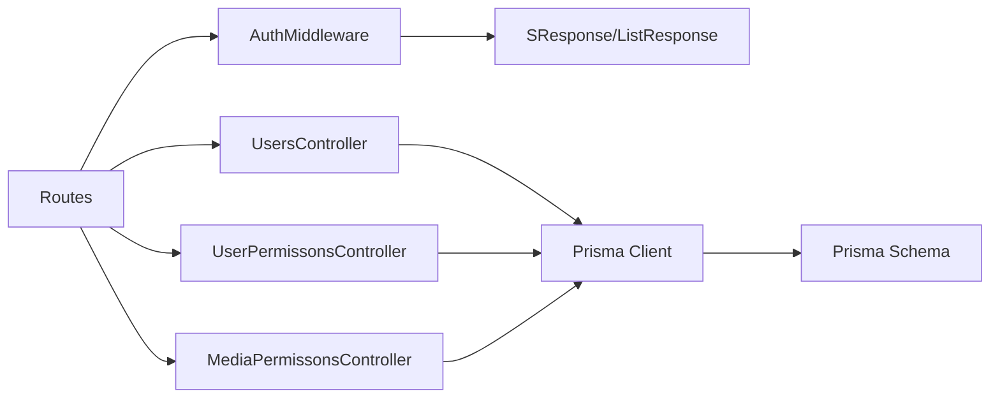
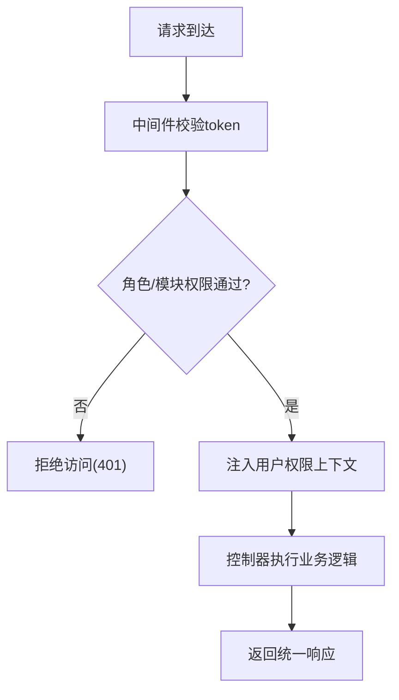

# 权限控制系统

<cite>
**本文档引用的文件**
- [app/controllers/user_permissons_controller.ts](file://app/controllers/user_permissons_controller.ts)
- [app/controllers/media_permissons_controller.ts](file://app/controllers/media_permissons_controller.ts)
- [app/controllers/users_controller.ts](file://app/controllers/users_controller.ts)
- [app/middleware/auth_middleware.ts](file://app/middleware/auth_middleware.ts)
- [app/models/user.ts](file://app/models/user.ts)
- [config/auth.ts](file://config/auth.ts)
- [prisma/sqlite/schema.prisma](file://prisma/sqlite/schema.prisma)
- [app/interfaces/response.ts](file://app/interfaces/response.ts)
- [app/type/http.ts](file://app/type/http.ts)
- [app/utils/index.ts](file://app/utils/index.ts)
- [start/routes.ts](file://start/routes.ts)
</cite>

## 目录
1. [简介](#简介)
2. [项目结构](#项目结构)
3. [核心组件](#核心组件)
4. [架构总览](#架构总览)
5. [详细组件分析](#详细组件分析)
6. [依赖关系分析](#依赖关系分析)
7. [性能考虑](#性能考虑)
8. [故障排查指南](#故障排查指南)
9. [结论](#结论)
10. [附录](#附录)

## 简介
本文件系统性梳理 SManga Adonis 的权限控制系统，重点覆盖基于角色的访问控制（RBAC）机制、媒体权限分配与用户权限管理。文档从权限模型设计、控制器实现、中间件拦截、数据模型与迁移、以及最佳实践与常见场景出发，帮助开发者快速理解并正确使用权限体系。

## 项目结构
权限相关功能主要分布在以下层次：
- 中间件层：统一鉴权与权限拦截
- 控制器层：用户权限与媒体权限的 CRUD 管理
- 数据模型层：用户、令牌、媒体权限、模块权限等
- 配置层：认证守卫与用户模型绑定
- 工具与响应层：统一响应格式与 JSON 序列化工具

**图表来源**
- [app/middleware/auth_middleware.ts:17-85](file://app/middleware/auth_middleware.ts#L17-L85)
- [app/controllers/users_controller.ts:1-160](file://app/controllers/users_controller.ts#L1-L160)
- [app/controllers/user_permissons_controller.ts:13-65](file://app/controllers/user_permissons_controller.ts#L13-L65)
- [app/controllers/media_permissons_controller.ts:13-61](file://app/controllers/media_permissons_controller.ts#L13-L61)
- [app/models/user.ts:13-33](file://app/models/user.ts#L13-L33)
- [config/auth.ts:5-15](file://config/auth.ts#L5-L15)

**章节来源**
- [app/middleware/auth_middleware.ts:17-85](file://app/middleware/auth_middleware.ts#L17-L85)
- [app/controllers/users_controller.ts:1-160](file://app/controllers/users_controller.ts#L1-L160)
- [app/controllers/user_permissons_controller.ts:13-65](file://app/controllers/user_permissons_controller.ts#L13-L65)
- [app/controllers/media_permissons_controller.ts:13-61](file://app/controllers/media_permissons_controller.ts#L13-L61)
- [app/models/user.ts:13-33](file://app/models/user.ts#L13-L33)
- [config/auth.ts:5-15](file://config/auth.ts#L5-L15)

## 核心组件
- RBAC 模型
  - 角色：用户表包含 role 字段，默认为普通用户；仅管理员可进行用户管理与删除操作。
  - 模块权限：userPermisson 表记录用户对特定模块的操作权限，字段包含模块名与操作类型。
  - 媒体权限：mediaPermisson 表记录用户对特定媒体库的访问权限，形成细粒度的资源边界。
- 认证与授权
  - 使用访问令牌进行 API 认证，守卫绑定用户模型。
  - 中间件统一校验 token 并注入用户上下文，同时根据角色与模块权限进行访问控制。
- 统一响应
  - 所有接口返回统一格式，便于前端处理与错误提示。

**章节来源**
- [prisma/sqlite/schema.prisma:368-400](file://prisma/sqlite/schema.prisma#L368-L400)
- [prisma/sqlite/schema.prisma:238-249](file://prisma/sqlite/schema.prisma#L238-L249)
- [config/auth.ts:5-15](file://config/auth.ts#L5-L15)
- [app/middleware/auth_middleware.ts:23-85](file://app/middleware/auth_middleware.ts#L23-L85)
- [app/interfaces/response.ts:18-63](file://app/interfaces/response.ts#L18-L63)

## 架构总览
下图展示了从请求进入系统到权限判定与资源访问的整体流程：

**图表来源**
- [start/routes.ts:194-241](file://start/routes.ts#L194-L241)
- [app/middleware/auth_middleware.ts:23-85](file://app/middleware/auth_middleware.ts#L23-L85)
- [app/controllers/users_controller.ts:52-138](file://app/controllers/users_controller.ts#L52-L138)
- [app/controllers/user_permissons_controller.ts:13-65](file://app/controllers/user_permissons_controller.ts#L13-L65)
- [app/controllers/media_permissons_controller.ts:13-61](file://app/controllers/media_permissons_controller.ts#L13-L61)

## 详细组件分析

### 中间件：AuthMiddleware
- 跳过规则：部署、测试、登录、静态资源与分析接口不进行鉴权。
- 令牌校验：从请求头读取 token，查询令牌是否存在并关联用户。
- 角色限制：除管理员外，禁止访问用户管理与执行删除操作。
- 权限注入：将用户的媒体权限集合与模块权限集合注入到请求上下文，供后续控制器使用。

**图表来源**
- [app/middleware/auth_middleware.ts:23-85](file://app/middleware/auth_middleware.ts#L23-L85)

**章节来源**
- [app/middleware/auth_middleware.ts:23-85](file://app/middleware/auth_middleware.ts#L23-L85)

### 控制器：UsersController（用户与媒体权限）
- 创建用户：接收用户名、密码、角色与媒体权限范围，创建用户后批量插入媒体权限。
- 更新用户：支持更新基础信息与媒体权限范围，内部对比差异并自动插入或删除对应媒体权限记录。
- 列表与详情：支持分页查询并返回用户媒体权限集合的简化形式。

**图表来源**
- [app/controllers/users_controller.ts:52-138](file://app/controllers/users_controller.ts#L52-L138)

**章节来源**
- [app/controllers/users_controller.ts:52-138](file://app/controllers/users_controller.ts#L52-L138)

### 控制器：UserPermissonsController（用户模块权限）
- 提供用户模块权限的增删改查接口，用于精细化控制用户对各模块的操作能力。

**章节来源**
- [app/controllers/user_permissons_controller.ts:13-65](file://app/controllers/user_permissons_controller.ts#L13-L65)

### 控制器：MediaPermissonsController（媒体权限）
- 提供媒体权限的增删改查接口，用于控制用户对特定媒体库的访问范围。

**章节来源**
- [app/controllers/media_permissons_controller.ts:13-61](file://app/controllers/media_permissons_controller.ts#L13-L61)

### 数据模型：权限相关表
- 用户表（user）：包含用户基本信息、角色、媒体访问策略等字段，并关联媒体权限与模块权限。
- 媒体权限表（mediaPermisson）：唯一约束为用户+媒体，确保每个用户对每个媒体的权限唯一。
- 模块权限表（userPermisson）：唯一约束为用户+模块+操作，支持按模块与操作维度的细粒度控制。

**图表来源**
- [prisma/sqlite/schema.prisma:368-400](file://prisma/sqlite/schema.prisma#L368-L400)
- [prisma/sqlite/schema.prisma:238-249](file://prisma/sqlite/schema.prisma#L238-L249)

**章节来源**
- [prisma/sqlite/schema.prisma:238-249](file://prisma/sqlite/schema.prisma#L238-L249)
- [prisma/sqlite/schema.prisma:368-400](file://prisma/sqlite/schema.prisma#L368-L400)

### 认证配置：Auth 守卫
- 使用访问令牌守卫，提供用户模型绑定，确保 token 与用户关联并支持鉴权。

**章节来源**
- [config/auth.ts:5-15](file://config/auth.ts#L5-L15)
- [app/models/user.ts:32-33](file://app/models/user.ts#L32-L33)

### 统一响应与工具
- 统一响应类：封装通用返回结构，便于前后端一致处理。
- JSON 工具：针对 SQLite 不支持原生 JSON 的情况，提供字符串序列化/反序列化工具，保证跨数据库兼容。

**章节来源**
- [app/interfaces/response.ts:18-63](file://app/interfaces/response.ts#L18-L63)
- [app/utils/index.ts:163-179](file://app/utils/index.ts#L163-L179)

## 依赖关系分析
- 中间件依赖 Prisma 查询用户与权限，并依赖统一响应格式返回错误。
- 控制器依赖 Prisma 进行权限数据的增删改查，并在用户管理中联动媒体权限。
- 模型与 Prisma schema 定义了权限表之间的外键关系与唯一约束。
- 路由文件定义了受保护的资源路径，配合中间件实现访问控制。

**图表来源**
- [app/middleware/auth_middleware.ts:23-85](file://app/middleware/auth_middleware.ts#L23-L85)
- [app/controllers/users_controller.ts:52-138](file://app/controllers/users_controller.ts#L52-L138)
- [app/controllers/user_permissons_controller.ts:13-65](file://app/controllers/user_permissons_controller.ts#L13-L65)
- [app/controllers/media_permissons_controller.ts:13-61](file://app/controllers/media_permissons_controller.ts#L13-L61)
- [prisma/sqlite/schema.prisma:238-249](file://prisma/sqlite/schema.prisma#L238-L249)

**章节来源**
- [start/routes.ts:194-241](file://start/routes.ts#L194-L241)
- [app/middleware/auth_middleware.ts:23-85](file://app/middleware/auth_middleware.ts#L23-L85)
- [app/controllers/users_controller.ts:52-138](file://app/controllers/users_controller.ts#L52-L138)
- [app/controllers/user_permissons_controller.ts:13-65](file://app/controllers/user_permissons_controller.ts#L13-L65)
- [app/controllers/media_permissons_controller.ts:13-61](file://app/controllers/media_permissons_controller.ts#L13-L61)

## 性能考虑
- 中间件查询用户时包含权限关联，建议在高并发场景下对用户与权限查询进行缓存或索引优化。
- 批量媒体权限更新采用逐条对比与增删，建议在权限规模较大时合并事务以减少往返。
- 统一响应与 JSON 工具避免重复序列化开销，保持接口稳定性。

## 故障排查指南
- 401 无权限
  - 检查请求头 token 是否存在且有效。
  - 确认用户角色是否为管理员（如需访问用户管理或删除操作）。
  - 核对模块权限与媒体权限是否正确注入到请求上下文。
- 接口返回错误
  - 统一响应类包含状态码与消息字段，便于前端定位问题。
- 数据不一致
  - 在更新用户媒体权限时，确认差异对比逻辑是否正确执行插入与删除。

**章节来源**
- [app/middleware/auth_middleware.ts:34-85](file://app/middleware/auth_middleware.ts#L34-L85)
- [app/interfaces/response.ts:18-63](file://app/interfaces/response.ts#L18-L63)

## 结论
SManga Adonis 的权限体系以 RBAC 为核心，结合角色、模块权限与媒体权限三重维度，实现了灵活而可控的资源访问边界。中间件统一拦截与校验，控制器负责权限数据的维护，Prisma schema 明确约束关系，整体架构清晰、职责分明。建议在生产环境中进一步完善权限缓存、批量操作优化与审计日志，以提升性能与可观测性。

## 附录

### 权限配置示例（步骤说明）
- 创建用户并授予媒体访问范围
  - 步骤：调用用户创建接口，传入媒体权限数组，服务端将自动为选中的媒体创建权限记录。
  - 参考路径：[用户创建流程:52-84](file://app/controllers/users_controller.ts#L52-L84)
- 更新用户媒体权限
  - 步骤：调用用户更新接口，传入新的媒体权限数组，服务端将自动对比差异并增删权限。
  - 参考路径：[用户更新流程:87-138](file://app/controllers/users_controller.ts#L87-L138)
- 管理用户模块权限
  - 步骤：通过用户模块权限控制器进行增删改查。
  - 参考路径：[用户模块权限控制器:13-65](file://app/controllers/user_permissons_controller.ts#L13-L65)
- 管理媒体权限
  - 步骤：通过媒体权限控制器进行增删改查。
  - 参考路径：[媒体权限控制器:13-61](file://app/controllers/media_permissons_controller.ts#L13-L61)

### 权限检查流程（概念图）
