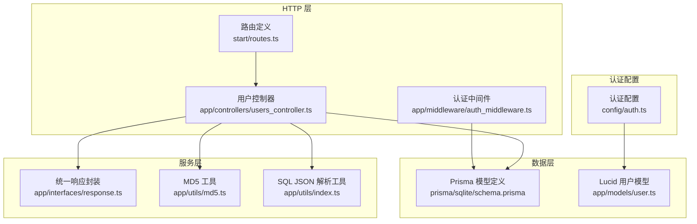
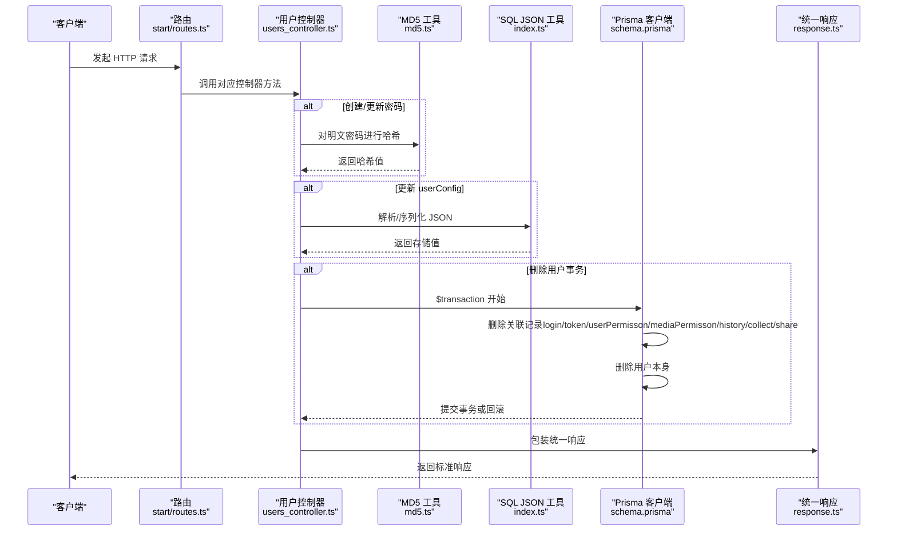
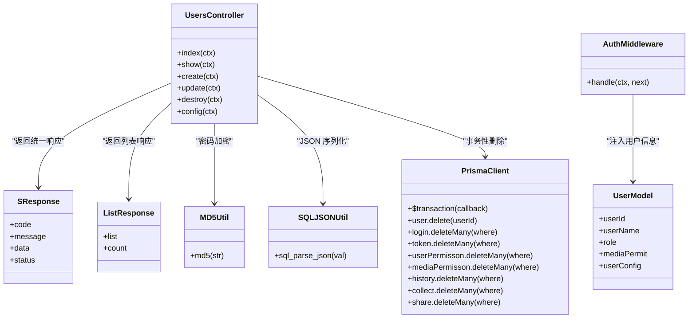
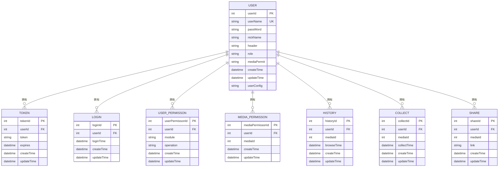

# 用户CRUD操作

<cite>
**本文引用的文件**
- [users_controller.ts](file://app/controllers/users_controller.ts)
- [routes.ts](file://start/routes.ts)
- [response.ts](file://app/interfaces/response.ts)
- [md5.ts](file://app/utils/md5.ts)
- [index.ts](file://app/utils/index.ts)
- [auth.ts](file://config/auth.ts)
- [auth_middleware.ts](file://app/middleware/auth_middleware.ts)
- [user.ts](file://app/models/user.ts)
- [schema.prisma](file://prisma/sqlite/schema.prisma)
- [user_permissons_controller.ts](file://app/controllers/user_permissons_controller.ts)
- [http.ts](file://app/type/http.ts)
</cite>

## 更新摘要
**变更内容**
- 用户删除操作已升级为事务性级联删除，提供更好的数据完整性保证
- 新增了详细的错误处理机制，包括事务回滚和异常捕获
- 删除操作现在确保所有相关关联数据（登录记录、令牌、权限、历史记录等）同时被删除或回滚

## 目录
1. [简介](#简介)
2. [项目结构](#项目结构)
3. [核心组件](#核心组件)
4. [架构总览](#架构总览)
5. [详细组件分析](#详细组件分析)
6. [依赖关系分析](#依赖关系分析)
7. [性能考量](#性能考量)
8. [故障排查指南](#故障排查指南)
9. [结论](#结论)
10. [附录：API 接口与数据模型](#附录api-接口与数据模型)

## 简介
本文件面向 SManga Adonis 的"用户"模块，系统性梳理用户 CRUD（增删改查）操作的实现方式与最佳实践，覆盖以下主题：
- 用户注册、信息更新、删除、列表查询
- 密码加密处理、数据验证、权限控制
- 分页查询、条件过滤、排序机制与批量操作
- API 接口定义、请求/响应格式、错误处理策略
- 实际使用场景与常见问题排查

**更新** 用户删除操作现已采用事务性级联删除，确保数据完整性和一致性。

## 项目结构
用户相关能力由控制器、路由、中间件、认证配置、工具类与数据库模型共同构成。下图给出与用户 CRUD 相关的关键文件与交互关系。

**图表来源**
- [routes.ts:194-200](file://start/routes.ts#L194-L200)
- [users_controller.ts:1-181](file://app/controllers/users_controller.ts#L1-L181)
- [auth_middleware.ts:1-87](file://app/middleware/auth_middleware.ts#L1-L87)
- [response.ts:18-63](file://app/interfaces/response.ts#L18-L63)
- [md5.ts:19-21](file://app/utils/md5.ts#L19-L21)
- [index.ts:163-179](file://app/utils/index.ts#L163-L179)
- [schema.prisma:368-386](file://prisma/sqlite/schema.prisma#L368-L386)
- [user.ts:13-33](file://app/models/user.ts#L13-L33)
- [auth.ts:5-15](file://config/auth.ts#L5-L15)

**章节来源**
- [routes.ts:194-200](file://start/routes.ts#L194-L200)
- [users_controller.ts:1-181](file://app/controllers/users_controller.ts#L1-L181)
- [auth_middleware.ts:1-87](file://app/middleware/auth_middleware.ts#L1-L87)
- [response.ts:18-63](file://app/interfaces/response.ts#L18-L63)
- [md5.ts:19-21](file://app/utils/md5.ts#L19-L21)
- [index.ts:163-179](file://app/utils/index.ts#L163-L179)
- [schema.prisma:368-386](file://prisma/sqlite/schema.prisma#L368-L386)
- [user.ts:13-33](file://app/models/user.ts#L13-L33)
- [auth.ts:5-15](file://config/auth.ts#L5-L15)

## 核心组件
- 用户控制器（UsersController）
  - 提供用户列表、详情、创建、更新、删除、用户配置读取等方法
  - 内置基础参数校验与统一响应封装
  - **更新** 删除操作现使用事务性级联删除，确保数据一致性
- 路由（start/routes.ts）
  - 定义用户相关 API 路由，绑定到用户控制器
- 认证中间件（AuthMiddleware）
  - 统一鉴权与权限拦截，限制非管理员访问用户资源
- 响应封装（SResponse/ListResponse）
  - 统一返回格式，便于前端消费
- 工具类
  - MD5 加密：用于密码入库前的哈希处理
  - SQL JSON 解析：兼容 SQLite 存储 JSON 的字符串化需求
- 数据模型与 Prisma Schema
  - 用户模型字段、关联关系与唯一约束
- 认证配置（config/auth.ts）
  - 基于访问令牌的认证守卫配置
- Lucid 用户模型（app/models/user.ts）
  - 与 AdonisJS Auth 集成，提供基于邮箱的认证能力

**章节来源**
- [users_controller.ts:7-181](file://app/controllers/users_controller.ts#L7-L181)
- [routes.ts:194-200](file://start/routes.ts#L194-L200)
- [auth_middleware.ts:17-87](file://app/middleware/auth_middleware.ts#L17-L87)
- [response.ts:18-63](file://app/interfaces/response.ts#L18-L63)
- [md5.ts:19-21](file://app/utils/md5.ts#L19-L21)
- [index.ts:163-179](file://app/utils/index.ts#L163-L179)
- [schema.prisma:368-386](file://prisma/sqlite/schema.prisma#L368-L386)
- [auth.ts:5-15](file://config/auth.ts#L5-L15)
- [user.ts:13-33](file://app/models/user.ts#L13-L33)

## 架构总览
用户 CRUD 的端到端流程如下：客户端通过路由访问控制器，控制器调用 Prisma 执行数据库操作，并通过统一响应封装返回；认证中间件在访问用户资源时进行权限校验。

**图表来源**
- [routes.ts:194-200](file://start/routes.ts#L194-L200)
- [users_controller.ts:52-166](file://app/controllers/users_controller.ts#L52-L166)
- [md5.ts:19-21](file://app/utils/md5.ts#L19-L21)
- [index.ts:163-179](file://app/utils/index.ts#L163-L179)
- [schema.prisma:368-386](file://prisma/sqlite/schema.prisma#L368-L386)
- [response.ts:18-63](file://app/interfaces/response.ts#L18-L63)

## 详细组件分析

### 用户控制器方法实现
- 列表查询（index）
  - 支持分页参数 page、pageSize
  - 并行查询列表与总数，提升性能
  - 返回包含媒体权限简化的用户列表
- 详情查询（show）
  - 通过 userId 查询单个用户
- 创建（create）
  - 必填字段校验（用户名）
  - 密码使用 MD5 哈希入库
  - 可选 mediaLimit 数组，逐项写入媒体权限表
- 更新（update）
  - 支持用户名、密码、用户配置、角色、媒体权限等字段
  - 密码存在时进行 MD5 哈希
  - userConfig 通过 sql_parse_json 处理
  - 基于 mediaLimit 的差异更新媒体权限
- 删除（destroy）
  - **更新** 使用 Prisma 事务确保所有删除操作要么全部成功，要么全部失败
  - 先删除与用户关联的所有记录：login、token、userPermisson、mediaPermisson、history、collect、share
  - 最后删除用户本身
  - 包含完整的错误处理和回滚机制
- 用户配置读取（config）
  - 从 user.userConfig 中解析 JSON 并返回

**章节来源**
- [users_controller.ts:8-42](file://app/controllers/users_controller.ts#L8-L42)
- [users_controller.ts:44-50](file://app/controllers/users_controller.ts#L44-L50)
- [users_controller.ts:52-85](file://app/controllers/users_controller.ts#L52-L85)
- [users_controller.ts:87-138](file://app/controllers/users_controller.ts#L87-L138)
- [users_controller.ts:140-166](file://app/controllers/users_controller.ts#L140-L166)

### 密码加密与数据验证
- 密码加密
  - 创建与更新时，若传入 passWord 字段，控制器调用 MD5 工具进行哈希后再入库
- 数据验证
  - 创建时对必填字段进行简单校验（如用户名非空），其余字段按需处理
  - userConfig 通过 sql_parse_json 在 SQLite 环境下自动序列化为字符串

**章节来源**
- [users_controller.ts:61-63](file://app/controllers/users_controller.ts#L61-L63)
- [users_controller.ts:101](file://app/controllers/users_controller.ts#L101)
- [md5.ts:19-21](file://app/utils/md5.ts#L19-L21)
- [index.ts:163-179](file://app/utils/index.ts#L163-L179)

### 权限控制与中间件
- 认证中间件
  - 从请求头提取 token，查询 token 表与用户表，注入 request.userId 与 request.user
  - 对用户资源访问进行管理员权限校验
  - 放行特定路由（如 /deploy、/test、/login、/file、/analysis）
- 认证配置
  - 守卫 api 使用访问令牌提供者，模型指向用户模型

**章节来源**
- [auth_middleware.ts:23-87](file://app/middleware/auth_middleware.ts#L23-L87)
- [auth.ts:5-15](file://config/auth.ts#L5-L15)
- [http.ts:12-14](file://app/type/http.ts#L12-L14)

### 数据模型与关联
- 用户模型
  - 主键 userId，唯一用户名 userName
  - 角色 role 默认 user，媒体权限策略 mediaPermit 默认 limit
  - 关联 tokens、userPermissons、mediaPermissons、historys、collects、shares
- 认证集成
  - Lucid 用户模型集成 withAuthFinder，支持基于邮箱的认证

**章节来源**
- [schema.prisma:368-386](file://prisma/sqlite/schema.prisma#L368-L386)
- [user.ts:13-33](file://app/models/user.ts#L13-L33)

### API 接口说明与使用示例

- 获取用户列表
  - 方法与路径：GET /user
  - 查询参数
    - page: 页码（可选）
    - pageSize: 每页条数（可选）
  - 响应：ListResponse，包含 list 与 count
  - 示例路径参考：[users_controller.ts:8-42](file://app/controllers/users_controller.ts#L8-L42)

- 获取单个用户
  - 方法与路径：GET /user/:userId
  - 路径参数：userId
  - 响应：SResponse，data 为用户对象
  - 示例路径参考：[users_controller.ts:44-50](file://app/controllers/users_controller.ts#L44-L50)

- 创建用户
  - 方法与路径：POST /user
  - 请求体字段
    - userName: 必填
    - passWord: 必填（将被 MD5 哈希）
    - role: 可选（默认 user）
    - mediaPermit: 可选
    - mediaLimit: 可选数组，元素含 mediaId 与 permit
  - 响应：SResponse，data 为新创建用户
  - 示例路径参考：[users_controller.ts:52-85](file://app/controllers/users_controller.ts#L52-L85)

- 更新用户
  - 方法与路径：PUT /user/:userId
  - 路径参数：userId
  - 请求体字段
    - userName: 可选
    - passWord: 可选（存在时进行 MD5 哈希）
    - userConfig: 可选（支持 JSON，SQLite 下自动序列化）
    - role: 可选
    - mediaPermit: 可选
    - mediaLimit: 可选数组，按 permit 差异更新权限
  - 响应：SResponse，data 为更新后的用户
  - 示例路径参考：[users_controller.ts:87-138](file://app/controllers/users_controller.ts#L87-L138)

- 删除用户
  - **更新** 方法与路径：DELETE /user/:userId
  - 路径参数：userId
  - **更新** 响应：SResponse，data 为被删除用户
  - **更新** 特性：使用事务性级联删除，确保所有关联数据的一致性
  - 示例路径参考：[users_controller.ts:140-166](file://app/controllers/users_controller.ts#L140-L166)

- 读取用户配置
  - 方法与路径：GET /client-user-config
  - 响应：SResponse，data 为解析后的用户配置对象
  - 示例路径参考：[users_controller.ts:168-179](file://app/controllers/users_controller.ts#L168-L179)

**章节来源**
- [routes.ts:194-200](file://start/routes.ts#L194-L200)
- [users_controller.ts:8-179](file://app/controllers/users_controller.ts#L8-L179)

### 高级功能与最佳实践

- 分页查询
  - 通过 page 与 pageSize 计算 skip/take，避免一次性加载大量数据
  - 并行统计总数与查询列表，降低延迟
  - 示例路径参考：[users_controller.ts:8-30](file://app/controllers/users_controller.ts#L8-L30)

- 条件过滤与排序
  - 当前控制器未内置 where/order 参数解析
  - 如需条件过滤或排序，建议在控制器中扩展查询参数解析，结合 Prisma 的 where 与 orderBy
  - 示例路径参考：[users_controller.ts:11-25](file://app/controllers/users_controller.ts#L11-L25)

- 批量操作
  - 当前未提供批量删除接口
  - 可参考其他模块的批量删除模式（如 /compress/:compressIds/batch），在用户模块增加批量删除路由与控制器方法
  - 示例路径参考：[routes.ts:91](file://start/routes.ts#L91)

- 权限与安全
  - 认证中间件仅允许管理员访问用户资源
  - 建议在创建/更新时增加更严格的字段白名单与业务规则校验
  - **更新** 删除操作现具备完整的事务安全保障
  - 示例路径参考：[auth_middleware.ts:63-76](file://app/middleware/auth_middleware.ts#L63-L76)

- 错误处理策略
  - 统一使用 SResponse/ListResponse 返回 code/message/status
  - **更新** 删除操作包含详细的异常捕获和错误处理
  - 建议补充更细粒度的错误码与国际化消息
  - 示例路径参考：[response.ts:18-63](file://app/interfaces/response.ts#L18-L63)

**章节来源**
- [users_controller.ts:8-42](file://app/controllers/users_controller.ts#L8-L42)
- [routes.ts:91](file://start/routes.ts#L91)
- [auth_middleware.ts:63-76](file://app/middleware/auth_middleware.ts#L63-L76)
- [response.ts:18-63](file://app/interfaces/response.ts#L18-L63)

## 依赖关系分析

**图表来源**
- [users_controller.ts:7-181](file://app/controllers/users_controller.ts#L7-L181)
- [auth_middleware.ts:17-87](file://app/middleware/auth_middleware.ts#L17-L87)
- [response.ts:18-63](file://app/interfaces/response.ts#L18-L63)
- [md5.ts:19-21](file://app/utils/md5.ts#L19-L21)
- [index.ts:163-179](file://app/utils/index.ts#L163-L179)
- [user.ts:13-33](file://app/models/user.ts#L13-L33)

**章节来源**
- [users_controller.ts:7-181](file://app/controllers/users_controller.ts#L7-L181)
- [auth_middleware.ts:17-87](file://app/middleware/auth_middleware.ts#L17-L87)
- [response.ts:18-63](file://app/interfaces/response.ts#L18-L63)
- [md5.ts:19-21](file://app/utils/md5.ts#L19-L21)
- [index.ts:163-179](file://app/utils/index.ts#L163-L179)
- [user.ts:13-33](file://app/models/user.ts#L13-L33)

## 性能考量
- 并行查询
  - 列表查询中并行执行 findMany 与 count，减少往返时间
- 分页与总数分离
  - 仅在需要时计算总数，避免不必要的 COUNT 查询
- 权限简化
  - 列表返回时将媒体权限简化为 mediaId 数组，降低序列化成本
- **更新** 事务性能
  - 事务性删除确保原子性，但可能影响单次删除的性能
  - 建议在批量删除场景下使用事务以保证数据一致性
- 建议优化
  - 为常用查询建立索引（如 userName、userId）
  - 对大列表启用游标分页或基于游标的翻页以进一步降低偏移成本

**章节来源**
- [users_controller.ts:27-30](file://app/controllers/users_controller.ts#L27-L30)
- [users_controller.ts:35-38](file://app/controllers/users_controller.ts#L35-L38)
- [users_controller.ts:140-166](file://app/controllers/users_controller.ts#L140-L166)

## 故障排查指南
- 认证失败
  - 现象：返回 401 且 message 为"用户信息失效"
  - 排查：确认请求头携带 token，检查 token 是否存在于数据库
  - 参考路径：[auth_middleware.ts:32-54](file://app/middleware/auth_middleware.ts#L32-L54)
- 权限不足
  - 现象：返回 401 且 message 为"无权限操作"
  - 排查：确认当前用户角色为 admin，或访问的路由是否在放行列表
  - 参考路径：[auth_middleware.ts:63-76](file://app/middleware/auth_middleware.ts#L63-L76)
- 用户名重复
  - 现象：创建失败或数据库约束冲突
  - 排查：确保 userName 唯一性
  - 参考路径：[schema.prisma:370](file://prisma/sqlite/schema.prisma#L370)
- 密码不一致
  - 现象：登录或更新时提示密码错误
  - 排查：确认传入明文密码是否与 MD5 哈希匹配
  - 参考路径：[md5.ts:19-21](file://app/utils/md5.ts#L19-L21)
- JSON 存储异常（SQLite）
  - 现象：userConfig 无法正确解析
  - 排查：确认使用 sql_parse_json 进行序列化/反序列化
  - 参考路径：[index.ts:163-179](file://app/utils/index.ts#L163-L179)
- **更新** 删除失败
  - 现象：删除用户时返回错误信息
  - 排查：检查用户是否存在关联数据，确认事务执行状态
  - 参考路径：[users_controller.ts:140-166](file://app/controllers/users_controller.ts#L140-L166)

**章节来源**
- [auth_middleware.ts:32-76](file://app/middleware/auth_middleware.ts#L32-L76)
- [schema.prisma:370](file://prisma/sqlite/schema.prisma#L370)
- [md5.ts:19-21](file://app/utils/md5.ts#L19-L21)
- [index.ts:163-179](file://app/utils/index.ts#L163-L179)
- [users_controller.ts:140-166](file://app/controllers/users_controller.ts#L140-L166)

## 结论
SManga Adonis 的用户模块提供了完整的 CRUD 能力，配合认证中间件与统一响应封装，能够满足基本的用户管理需求。**更新** 用户删除操作现已采用事务性级联删除，显著提升了数据完整性和错误处理能力。建议后续增强：
- 扩展条件过滤与排序参数解析
- 引入更严格的字段校验与业务规则
- 增加批量删除等高级功能
- 优化大列表查询的分页策略
- **更新** 在高并发场景下考虑事务锁策略和性能优化

## 附录：API 接口与数据模型

### API 接口清单
- GET /user
  - 查询参数：page、pageSize
  - 响应：ListResponse
- GET /user/:userId
  - 响应：SResponse
- POST /user
  - 请求体：userName、passWord、role、mediaPermit、mediaLimit
  - 响应：SResponse
- PUT /user/:userId
  - 请求体：userName、passWord、userConfig、role、mediaPermit、mediaLimit
  - 响应：SResponse
- DELETE /user/:userId
  - **更新** 响应：SResponse，包含事务性删除的完整数据
  - **更新** 特性：确保所有关联数据的一致性删除
- GET /client-user-config
  - 响应：SResponse

**章节来源**
- [routes.ts:194-200](file://start/routes.ts#L194-L200)
- [users_controller.ts:8-179](file://app/controllers/users_controller.ts#L8-L179)

### 数据模型 ER 图

**图表来源**
- [schema.prisma:368-386](file://prisma/sqlite/schema.prisma#L368-L386)
- [schema.prisma:389-400](file://prisma/sqlite/schema.prisma#L389-L400)
- [schema.prisma:402-421](file://prisma/sqlite/schema.prisma#L402-L421)