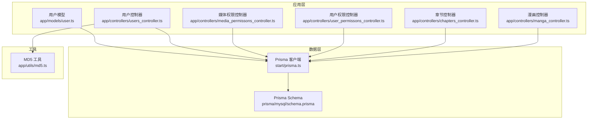
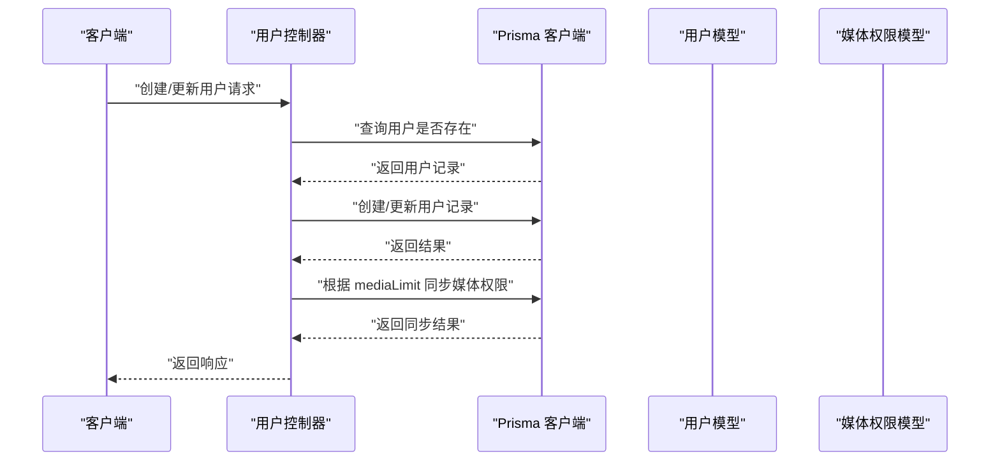
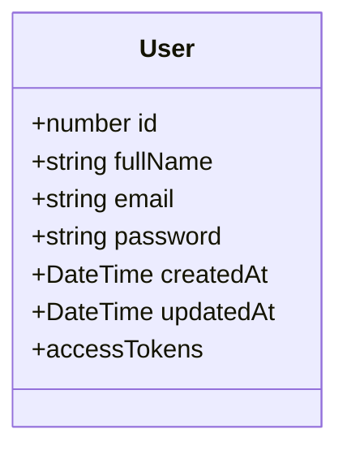
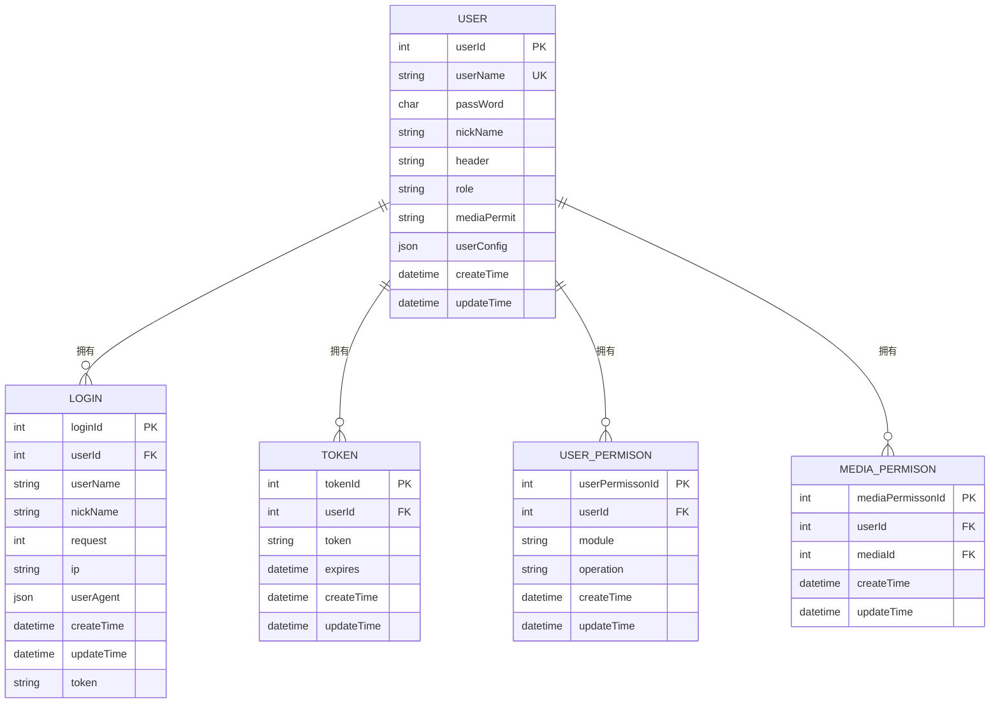
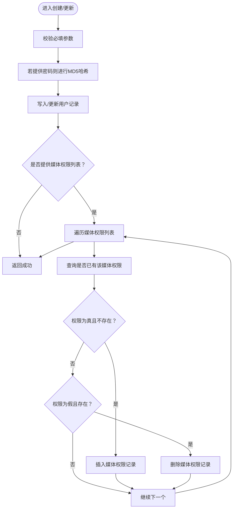
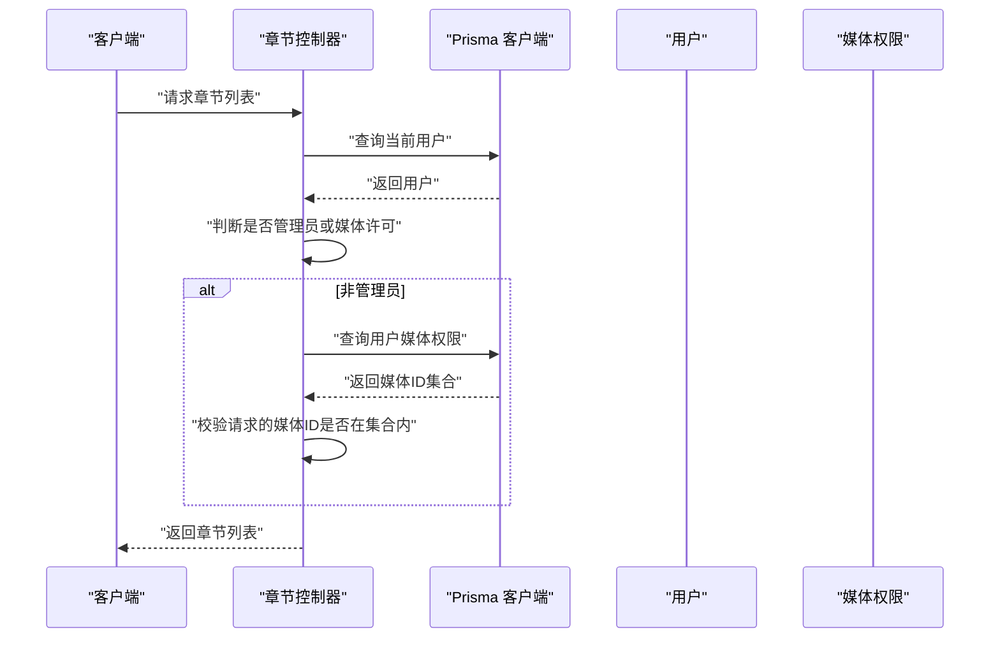
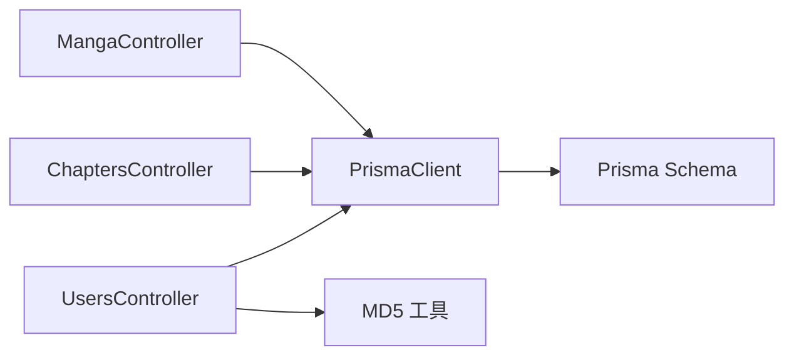

# 用户模型设计

<cite>
**本文引用的文件**
- [app/models/user.ts](file://app/models/user.ts)
- [prisma/mysql/schema.prisma](file://prisma/mysql/schema.prisma)
- [app/controllers/users_controller.ts](file://app/controllers/users_controller.ts)
- [app/controllers/media_permissons_controller.ts](file://app/controllers/media_permissons_controller.ts)
- [app/controllers/user_permissons_controller.ts](file://app/controllers/user_permissons_controller.ts)
- [app/controllers/chapters_controller.ts](file://app/controllers/chapters_controller.ts)
- [app/controllers/manga_controller.ts](file://app/controllers/manga_controller.ts)
- [app/utils/md5.ts](file://app/utils/md5.ts)
- [start/prisma.ts](file://start/prisma.ts)
</cite>

## 目录
1. [简介](#简介)
2. [项目结构](#项目结构)
3. [核心组件](#核心组件)
4. [架构总览](#架构总览)
5. [详细组件分析](#详细组件分析)
6. [依赖分析](#依赖分析)
7. [性能考量](#性能考量)
8. [故障排查指南](#故障排查指南)
9. [结论](#结论)
10. [附录](#附录)

## 简介
本文件面向 SManga Adonis 的“用户模型设计”，系统性阐述用户数据模型的字段定义、数据类型、约束条件与关系映射；并结合 Prisma ORM 的模型定义、字段校验规则、索引设计与性能优化进行深入解析。文档同时提供模型关系图，展示用户与媒体权限、收藏、历史、书签等实体之间的关联，并给出数据库 Schema 示例与数据模型最佳实践建议。

## 项目结构
围绕用户模型的关键文件分布如下：
- Lucid 模型：用于 AdonisJS 应用层的用户实体定义与认证混入
- Prisma Schema：定义数据库层面的用户表结构、字段类型、唯一索引与外键关系
- 控制器：用户 CRUD、权限分配、配置读取等业务逻辑
- 工具函数：密码哈希（MD5）等安全相关工具
- 启动配置：Prisma 客户端初始化与多数据库适配

图表来源
- [app/models/user.ts:1-33](file://app/models/user.ts#L1-L33)
- [prisma/mysql/schema.prisma:370-388](file://prisma/mysql/schema.prisma#L370-L388)
- [app/controllers/users_controller.ts:1-160](file://app/controllers/users_controller.ts#L1-L160)
- [app/controllers/media_permissons_controller.ts:1-61](file://app/controllers/media_permissons_controller.ts#L1-L61)
- [app/controllers/user_permissons_controller.ts:1-66](file://app/controllers/user_permissons_controller.ts#L1-L66)
- [app/controllers/chapters_controller.ts:1-515](file://app/controllers/chapters_controller.ts#L1-L515)
- [app/controllers/manga_controller.ts:1-460](file://app/controllers/manga_controller.ts#L1-L460)
- [app/utils/md5.ts:1-22](file://app/utils/md5.ts#L1-L22)
- [start/prisma.ts:1-42](file://start/prisma.ts#L1-L42)

章节来源
- [app/models/user.ts:1-33](file://app/models/user.ts#L1-L33)
- [prisma/mysql/schema.prisma:1-449](file://prisma/mysql/schema.prisma#L1-L449)
- [app/controllers/users_controller.ts:1-160](file://app/controllers/users_controller.ts#L1-L160)
- [app/utils/md5.ts:1-22](file://app/utils/md5.ts#L1-L22)
- [start/prisma.ts:1-42](file://start/prisma.ts#L1-L42)

## 核心组件
- 用户模型（Lucid）
  - 主键：id（自增整数）
  - 名称：fullName（可空）
  - 账号：email（用于登录）
  - 密码：password（存储为哈希值，序列化时隐藏）
  - 时间戳：createdAt、updatedAt（自动维护）
  - 认证混入：基于 withAuthFinder 的密码校验与令牌提供者
- 用户模型（Prisma）
  - 主键：userId（自增整数）
  - 字段：userName（唯一）、passWord（定长字符，存储哈希）、nickName、header、role（默认 user）、mediaPermit（默认 limit）、userConfig（JSON）、createTime、updateTime
  - 关系：与 login、token、userPermisson、mediaPermisson、history、collect、share 等实体存在一对多或多对多关系
- 权限模型
  - 媒体权限：mediaPermisson（用户-媒体多对多中间表，唯一索引组合）
  - 用户模块权限：userPermisson（用户-模块-操作唯一索引）

章节来源
- [app/models/user.ts:8-33](file://app/models/user.ts#L8-L33)
- [prisma/mysql/schema.prisma:370-388](file://prisma/mysql/schema.prisma#L370-L388)
- [prisma/mysql/schema.prisma:238-249](file://prisma/mysql/schema.prisma#L238-L249)
- [prisma/mysql/schema.prisma:391-402](file://prisma/mysql/schema.prisma#L391-L402)

## 架构总览
用户模型在系统中的职责与交互：
- 认证与授权：Lucid 模型通过 withAuthFinder 提供基于 email 的认证能力；控制器中使用 Prisma 查询用户并结合媒体权限进行访问控制
- 数据持久化：Prisma Schema 明确字段类型、默认值、唯一索引与外键约束
- 权限控制：用户可通过 mediaPermisson 限制可访问的媒体集合；也可通过 role 或 mediaPermit 实现粗粒度策略
- 业务集成：章节与漫画控制器在执行前会校验用户是否存在、是否具备相应媒体权限

图表来源
- [app/controllers/users_controller.ts:52-85](file://app/controllers/users_controller.ts#L52-L85)
- [app/controllers/users_controller.ts:87-138](file://app/controllers/users_controller.ts#L87-L138)
- [prisma/mysql/schema.prisma:370-388](file://prisma/mysql/schema.prisma#L370-L388)
- [prisma/mysql/schema.prisma:238-249](file://prisma/mysql/schema.prisma#L238-L249)

## 详细组件分析

### 用户模型（Lucid）
- 设计要点
  - 使用 withAuthFinder 混入，以 email 作为唯一标识 uid，password 列名为 password
  - 密码列 serializeAs 为 null，避免在序列化响应中泄露
  - 提供 DbAccessTokensProvider.forModel(User) 用于令牌管理
- 认证流程
  - 登录时通过 email 查找用户，再比对哈希后的密码
  - 成功后生成访问令牌并返回给客户端

图表来源
- [app/models/user.ts:13-33](file://app/models/user.ts#L13-L33)

章节来源
- [app/models/user.ts:8-33](file://app/models/user.ts#L8-L33)

### 用户模型（Prisma）
- 字段定义与约束
  - userId：主键，自增
  - userName：唯一索引，VARCHAR(191)
  - passWord：CHAR(32)，存储 MD5 哈希
  - nickName、header：VARCHAR(191)
  - role：VARCHAR(191)，默认 “user”
  - mediaPermit：VARCHAR(191)，默认 “limit”
  - userConfig：JSON
  - createTime、updateTime：默认 CURRENT_TIMESTAMP，更新时自动更新
- 关系映射
  - 与 login、token：一对多
  - 与 userPermisson：一对多
  - 与 mediaPermisson：一对多
  - 与 history、collect、share：一对多

图表来源
- [prisma/mysql/schema.prisma:370-388](file://prisma/mysql/schema.prisma#L370-L388)
- [prisma/mysql/schema.prisma:238-249](file://prisma/mysql/schema.prisma#L238-L249)
- [prisma/mysql/schema.prisma:391-402](file://prisma/mysql/schema.prisma#L391-L402)
- [prisma/mysql/schema.prisma:148-160](file://prisma/mysql/schema.prisma#L148-L160)
- [prisma/mysql/schema.prisma:359-367](file://prisma/mysql/schema.prisma#L359-L367)

章节来源
- [prisma/mysql/schema.prisma:370-388](file://prisma/mysql/schema.prisma#L370-L388)
- [prisma/mysql/schema.prisma:238-249](file://prisma/mysql/schema.prisma#L238-L249)
- [prisma/mysql/schema.prisma:391-402](file://prisma/mysql/schema.prisma#L391-L402)

### 用户控制器（UsersController）
- 功能概览
  - 列表与详情：支持分页、包含媒体权限简表
  - 创建：接收 userName、passWord、role、mediaPermit、mediaLimit，密码经 MD5 存储，随后批量写入媒体权限
  - 更新：支持更新用户名、密码（可选）、用户配置（JSON）、角色、媒体权限；根据 mediaLimit 同步权限
  - 删除：删除用户
  - 配置：读取用户配置 JSON 并返回
- 关键点
  - 密码统一使用 MD5 工具进行哈希
  - 媒体权限同步采用“存在即插入、不存在即删除”的幂等策略

图表来源
- [app/controllers/users_controller.ts:52-85](file://app/controllers/users_controller.ts#L52-L85)
- [app/controllers/users_controller.ts:87-138](file://app/controllers/users_controller.ts#L87-L138)
- [app/utils/md5.ts:19-21](file://app/utils/md5.ts#L19-L21)

章节来源
- [app/controllers/users_controller.ts:1-160](file://app/controllers/users_controller.ts#L1-L160)
- [app/utils/md5.ts:1-22](file://app/utils/md5.ts#L1-L22)

### 媒体权限与用户权限控制器
- 媒体权限控制器
  - 提供媒体权限的增删改查接口，支持按 mediaPermissonId 查询与更新
- 用户权限控制器
  - 提供用户模块权限的增删改查接口，支持按 userPermissonId 查询与更新

章节来源
- [app/controllers/media_permissons_controller.ts:1-61](file://app/controllers/media_permissons_controller.ts#L1-L61)
- [app/controllers/user_permissons_controller.ts:1-66](file://app/controllers/user_permissons_controller.ts#L1-L66)

### 访问控制与权限校验
- 章节控制器
  - 在查询章节列表前，先获取当前用户，判断其角色或 mediaPermit 是否允许访问指定媒体
  - 若非管理员，进一步检查用户拥有的媒体权限集合，确保 mediaId 在其中
- 漫画控制器
  - 类似地，在执行漫画相关操作前，校验用户是否存在、是否具备相应媒体权限

图表来源
- [app/controllers/chapters_controller.ts:33-53](file://app/controllers/chapters_controller.ts#L33-L53)
- [prisma/mysql/schema.prisma:370-388](file://prisma/mysql/schema.prisma#L370-L388)
- [prisma/mysql/schema.prisma:238-249](file://prisma/mysql/schema.prisma#L238-L249)

章节来源
- [app/controllers/chapters_controller.ts:1-515](file://app/controllers/chapters_controller.ts#L1-L515)
- [app/controllers/manga_controller.ts:1-460](file://app/controllers/manga_controller.ts#L1-L460)

## 依赖分析
- 模型与控制器耦合
  - UsersController 依赖 Prisma 客户端进行用户与媒体权限的读写
  - ChaptersController 与 MangaController 依赖 Prisma 客户端进行用户权限校验
- 工具函数依赖
  - MD5 工具被用户控制器用于密码哈希
- 客户端初始化
  - start/prisma.ts 根据配置动态选择数据库类型并创建 PrismaClient

图表来源
- [app/controllers/users_controller.ts:1-160](file://app/controllers/users_controller.ts#L1-L160)
- [app/controllers/chapters_controller.ts:1-515](file://app/controllers/chapters_controller.ts#L1-L515)
- [app/controllers/manga_controller.ts:1-460](file://app/controllers/manga_controller.ts#L1-L460)
- [app/utils/md5.ts:1-22](file://app/utils/md5.ts#L1-L22)
- [start/prisma.ts:1-42](file://start/prisma.ts#L1-L42)
- [prisma/mysql/schema.prisma:1-449](file://prisma/mysql/schema.prisma#L1-L449)

章节来源
- [app/controllers/users_controller.ts:1-160](file://app/controllers/users_controller.ts#L1-L160)
- [app/controllers/chapters_controller.ts:1-515](file://app/controllers/chapters_controller.ts#L1-L515)
- [app/controllers/manga_controller.ts:1-460](file://app/controllers/manga_controller.ts#L1-L460)
- [app/utils/md5.ts:1-22](file://app/utils/md5.ts#L1-L22)
- [start/prisma.ts:1-42](file://start/prisma.ts#L1-L42)
- [prisma/mysql/schema.prisma:1-449](file://prisma/mysql/schema.prisma#L1-L449)

## 性能考量
- 索引与唯一约束
  - 用户名唯一索引：加速登录与去重
  - 媒体权限唯一索引：保证用户-媒体组合唯一，避免重复授权
  - 用户模块权限唯一索引：防止重复授予相同模块-操作权限
- 查询优化
  - 列表接口使用分页与并发统计 count
  - 权限校验在控制器入口处进行，减少无效查询
- 存储与序列化
  - 密码字段序列化隐藏，避免敏感信息泄露
  - JSON 字段 userConfig 支持灵活配置，但需注意查询与更新时的健壮性

章节来源
- [prisma/mysql/schema.prisma:370-388](file://prisma/mysql/schema.prisma#L370-L388)
- [prisma/mysql/schema.prisma:238-249](file://prisma/mysql/schema.prisma#L238-L249)
- [prisma/mysql/schema.prisma:391-402](file://prisma/mysql/schema.prisma#L391-L402)
- [app/controllers/users_controller.ts:8-42](file://app/controllers/users_controller.ts#L8-L42)
- [app/models/user.ts:23-24](file://app/models/user.ts#L23-L24)

## 故障排查指南
- 登录失败
  - 检查用户是否存在且 email 正确
  - 确认密码是否为 MD5 哈希值
- 权限不足
  - 确认用户角色或 mediaPermit 是否允许访问目标媒体
  - 检查媒体权限表中是否存在对应记录
- 密码更新异常
  - 确认传入的密码是否为空；若为空则不更新
  - 确认 MD5 工具正常工作
- 媒体权限同步问题
  - 确认 mediaLimit 数组格式正确
  - 检查是否存在重复授权或遗漏授权的情况

章节来源
- [app/controllers/users_controller.ts:52-138](file://app/controllers/users_controller.ts#L52-L138)
- [app/utils/md5.ts:19-21](file://app/utils/md5.ts#L19-L21)
- [prisma/mysql/schema.prisma:370-388](file://prisma/mysql/schema.prisma#L370-L388)
- [prisma/mysql/schema.prisma:238-249](file://prisma/mysql/schema.prisma#L238-L249)

## 结论
SManga Adonis 的用户模型通过 Lucid 与 Prisma 双层抽象实现：Lucid 提供认证与令牌能力，Prisma 提供强一致的数据库结构与关系约束。用户模型围绕 userName、passWord、role、mediaPermit、userConfig 等关键字段构建，配合媒体权限与模块权限实现细粒度访问控制。通过控制器在入口处进行权限校验与媒体权限同步，既保证了安全性，也提升了用户体验。建议在生产环境中进一步强化密码策略与审计日志，持续优化查询与索引以提升性能。

## 附录
- 数据库 Schema 示例（摘自 Prisma Schema）
  - 用户表：包含主键、唯一用户名、固定长度密码、昵称、头像、角色、媒体权限策略、用户配置、时间戳等字段
  - 媒体权限表：用户-媒体多对多中间表，含唯一索引
  - 用户模块权限表：用户-模块-操作唯一索引
- 最佳实践
  - 密码：建议升级为更强的哈希算法（如 bcrypt），并启用盐值与迭代次数配置
  - 权限：优先使用媒体权限而非角色硬编码，便于精细化控制
  - 配置：userConfig 使用受控的 JSON Schema 校验，避免非法配置
  - 索引：为常用查询字段建立复合索引，平衡写入与读取性能

章节来源
- [prisma/mysql/schema.prisma:370-388](file://prisma/mysql/schema.prisma#L370-L388)
- [prisma/mysql/schema.prisma:238-249](file://prisma/mysql/schema.prisma#L238-L249)
- [prisma/mysql/schema.prisma:391-402](file://prisma/mysql/schema.prisma#L391-L402)